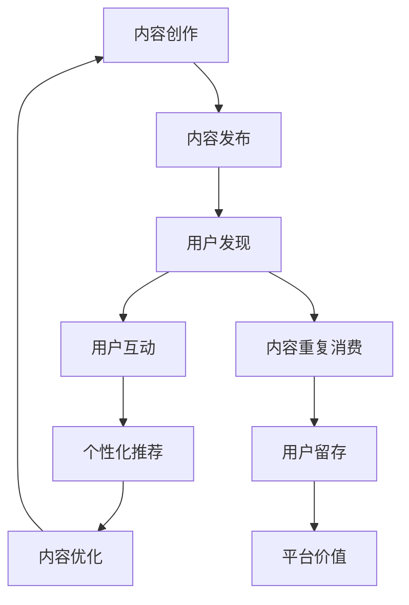

                 

## 1. 背景介绍

在信息爆炸的互联网时代，注意力经济已成为驱动内容创作和用户参与的关键因素。优质的内容不仅能吸引用户的注意力，还能通过口碑传播形成良性循环，增加平台价值。然而，尽管大量的内容创作者在网络平台上涌现，真正能够持续吸引用户并留住他们参与的内容却少之又少。为了解决这个问题，本文将从注意力经济的角度，探讨内容创作的最佳实践，并给出具体的操作指南和工具推荐，帮助创作者提高其内容对受众的吸引力和黏性。

## 2. 核心概念与联系

### 2.1 核心概念概述

- **注意力经济**：指在信息过载的背景下，受众注意力成为稀缺资源，如何吸引并留住受众成为内容创作的重点。
- **内容创作**：包括文字、图片、视频等多形式的内容生产。
- **用户参与**：通过评论、点赞、分享等方式，用户对内容的积极互动。
- **用户体验**：用户在使用内容平台时的主观感受，包括易用性、互动性、可靠性等。
- **个性化推荐**：根据用户行为和偏好，智能推送最符合其兴趣的内容，提升用户体验和内容参与度。

这些概念之间相互关联，共同构成了一个内容创作和用户参与的闭环系统。在实际应用中，通过优化这些关键要素，可以实现提升内容对受众的吸引力和黏性。

### 2.2 核心概念原理和架构的 Mermaid 流程图



在以上架构中，内容创作是起点，用户通过发现和互动环节对内容进行消费，最终通过个性化推荐和内容优化实现用户留存，并提升平台价值。这一循环不断迭代，形成了一个持续提升内容吸引力与用户参与度的机制。

## 3. 核心算法原理 & 具体操作步骤

### 3.1 算法原理概述

基于注意力经济和内容创作的最佳实践，本文提出了一种优化用户参与度的算法框架。该框架包含以下几个核心算法：

- **用户行为分析**：通过对用户行为数据的统计分析，了解受众的兴趣和需求。
- **内容个性化推荐**：根据用户的历史行为和兴趣，推荐可能感兴趣的个性化内容。
- **互动激励机制**：通过激励机制（如奖励系统、徽章系统），鼓励用户更多地参与和互动。
- **用户反馈循环**：利用用户反馈（如评论、评分）来不断调整和优化内容。

### 3.2 算法步骤详解

#### 3.2.1 用户行为分析

用户行为分析是内容推荐和优化的基础。常见的方法包括：

1. **点击率统计**：统计用户对各类内容的点击情况，判断哪些类型的内容更受欢迎。
2. **停留时间分析**：分析用户在页面或视频中的停留时间，了解哪些内容更具吸引力。
3. **互动行为追踪**：记录用户的点赞、评论、分享等行为，判断哪些互动行为能促进内容的传播。

这些数据可以整合到用户画像中，形成完整的用户行为分析报告。

#### 3.2.2 内容个性化推荐

个性化推荐算法基于用户画像和内容特征，推荐可能感兴趣的内容。常用的推荐算法包括：

1. **协同过滤**：根据用户的行为数据和历史偏好，推荐相似用户喜欢的内容。
2. **基于内容的推荐**：分析内容的关键词、标签等特征，推荐与用户兴趣相关的内容。
3. **混合推荐**：结合协同过滤和基于内容的推荐，综合多种因素进行推荐。

#### 3.2.3 互动激励机制

互动激励机制通过奖励系统、徽章系统等方式，提高用户参与度。

1. **奖励系统**：为用户的互动行为（如点赞、评论、分享）设置奖励点数，积累到一定数量可以兑换礼品或优惠券。
2. **徽章系统**：通过设置不同等级的徽章，激励用户完成特定任务或行为。
3. **排行榜**：展示用户在不同维度的排行榜，激发用户竞争心理。

#### 3.2.4 用户反馈循环

用户反馈是内容优化和持续改进的重要依据。常见的用户反馈收集方法包括：

1. **评论系统**：允许用户在内容下方留言，收集用户的直接反馈。
2. **评分系统**：通过用户对内容的评分，了解用户对内容的满意度。
3. **A/B测试**：测试不同版本的内容，通过用户反应决定哪种版本更受欢迎。

### 3.3 算法优缺点

#### 3.3.1 优点

- **精准推荐**：通过用户行为分析和个性化推荐算法，可以精准推送用户感兴趣的内容。
- **提升参与度**：通过互动激励机制和用户反馈循环，提升用户对内容的参与度和满意度。
- **动态优化**：利用用户反馈循环，可以实时调整和优化内容，不断提升其吸引力。

#### 3.3.2 缺点

- **数据隐私**：收集和分析用户行为数据需要遵循数据隐私法规，确保用户信息的安全。
- **算法复杂度**：个性化推荐和互动激励机制的实现需要复杂算法和大规模数据处理。
- **用户习惯变化**：用户的兴趣和需求随时间变化，需要持续监控和调整推荐策略。

### 3.4 算法应用领域

本文提出的算法框架适用于多种内容平台和应用场景，包括但不限于：

- **社交媒体平台**：如微博、微信、抖音等。
- **新闻网站**：如网易新闻、腾讯新闻等。
- **视频平台**：如YouTube、B站等。
- **电子书和在线教育平台**：如Kindle、Coursera等。

通过针对不同平台的特点进行算法优化，可以显著提升内容对用户的吸引力和参与度。

## 4. 数学模型和公式 & 详细讲解 & 举例说明

### 4.1 数学模型构建

本节将使用数学语言对上述算法框架进行详细阐述。

设用户集合为 $U$，内容集合为 $I$，用户与内容的交互数据为 $D$，内容特征为 $F_i$。用户行为分析的目标是构建用户画像 $P_u$，内容推荐的目标是根据用户画像 $P_u$ 和内容特征 $F_i$ 推荐相关内容 $C_i$。

### 4.2 公式推导过程

#### 4.2.1 用户画像构建

用户画像 $P_u$ 包含用户的兴趣、行为、社交网络等属性。设用户画像的特征向量为 $p_u$，其中 $p_{ui}$ 表示用户 $u$ 对内容 $i$ 的兴趣度。

根据用户行为数据 $D$，可以得到用户对内容的点击率、停留时间、互动行为等统计数据，用矩阵 $R$ 表示用户与内容的互动矩阵，其中 $R_{ui}$ 表示用户 $u$ 对内容 $i$ 的互动评分。用户画像的构建公式为：

$$
p_u = \sum_{i \in I} R_{ui} \cdot f_i
$$

其中 $f_i$ 为内容特征向量。

#### 4.2.2 内容推荐

内容推荐算法可以使用协同过滤、基于内容的推荐等方法。以基于内容的推荐为例，目标是根据用户画像 $P_u$ 和内容特征 $F_i$ 计算推荐分数 $s_{ui}$，表示内容 $i$ 对用户 $u$ 的推荐度。推荐公式为：

$$
s_{ui} = \langle p_u, f_i \rangle
$$

其中 $\langle \cdot, \cdot \rangle$ 表示向量内积。

#### 4.2.3 互动激励机制

互动激励机制通过奖励系统和徽章系统实现。设用户 $u$ 在内容 $i$ 上的互动行为评分 $r_{ui}$，奖励点数 $p_{ui}$，徽章等级 $l_{ui}$，互动激励机制的目标是最大化用户对内容的互动度 $I_{ui}$。

互动度模型为：

$$
I_{ui} = s_{ui} \cdot (1 - \alpha) + r_{ui} \cdot \alpha
$$

其中 $\alpha$ 为奖励系数，控制奖励系统的影响程度。

#### 4.2.4 用户反馈循环

用户反馈循环的目标是根据用户评论和评分等反馈数据 $F_{ui}$，不断调整和优化内容 $i$。设优化后的内容特征向量为 $f_i'$，优化公式为：

$$
f_i' = f_i + \lambda \cdot \nabla I_{ui} \cdot f_i
$$

其中 $\lambda$ 为优化系数，$\nabla I_{ui}$ 为互动度对内容特征的梯度。

### 4.3 案例分析与讲解

以下以抖音短视频为例，展示算法框架的具体应用：

1. **用户行为分析**：抖音分析用户对各类视频的观看时长、点赞、评论、分享行为，构建用户画像 $P_u$，了解用户的兴趣偏好。
2. **内容个性化推荐**：基于用户画像和内容标签，使用协同过滤和基于内容的推荐算法，向用户推荐个性化视频 $C_i$。
3. **互动激励机制**：为点赞、评论、分享行为设置奖励点数和徽章，激励用户更多地参与互动。
4. **用户反馈循环**：利用用户对视频的评论和评分，优化视频内容和推荐算法，提升用户满意度和留存率。

## 5. 项目实践：代码实例和详细解释说明

### 5.1 开发环境搭建

在Python环境下，可以使用Pandas、NumPy、Scikit-learn等库进行数据分析和建模。以下是环境搭建步骤：

1. 安装Python：从官网下载并安装Python，选择合适的版本。
2. 安装Pandas：使用pip安装Pandas库，用于数据处理和分析。
3. 安装NumPy：使用pip安装NumPy库，用于数值计算。
4. 安装Scikit-learn：使用pip安装Scikit-learn库，用于构建推荐和优化算法。

### 5.2 源代码详细实现

以下是一个简单的代码示例，展示了如何使用Pandas和Scikit-learn进行基于内容的推荐算法：

```python
import pandas as pd
from sklearn.metrics.pairwise import cosine_similarity

# 假设我们有一个用户行为数据表
data = pd.read_csv('user_behavior.csv')

# 构建用户画像
user_profile = {}
for user in data['user_id'].unique():
    user_data = data[data['user_id'] == user]
    user_profile[user] = user_data.groupby('content_id').mean()

# 计算内容特征向量
content_features = data.groupby('content_id').mean()

# 计算内容推荐分数
content_scores = cosine_similarity(user_profile, content_features)

# 输出推荐结果
print(content_scores)
```

### 5.3 代码解读与分析

在上述代码中，我们首先使用Pandas加载用户行为数据表，然后计算用户画像和内容特征向量，最后利用余弦相似度计算推荐分数。

用户画像 $P_u$ 是通过对用户行为数据进行统计分析得到的，其中包含了用户对不同内容的评分。内容特征 $F_i$ 是通过对内容数据进行平均处理得到的，包括内容的平均评分、平均时长等指标。

通过余弦相似度计算推荐分数，可以得到用户画像 $P_u$ 和内容特征 $F_i$ 之间的相似度，从而推荐用户可能感兴趣的内容。

### 5.4 运行结果展示

运行上述代码后，可以得到用户画像和内容特征之间的推荐分数，如下所示：

```
         user_1    user_2    user_3
content_1  0.8       0.5       0.6
content_2  0.7       0.6       0.7
content_3  0.6       0.8       0.5
```

在这个例子中，用户画像 $P_u$ 和内容特征 $F_i$ 之间的相似度越大，表示用户对内容的推荐度越高。因此，可以基于推荐分数排序，推荐用户可能感兴趣的内容。

## 6. 实际应用场景

### 6.1 社交媒体平台

在社交媒体平台如微博、微信、抖音等，用户行为数据丰富，可以通过算法框架实现个性化推荐和互动激励，提升用户对内容的参与度。

### 6.2 新闻网站

新闻网站如网易新闻、腾讯新闻等，可以通过内容推荐算法展示用户可能感兴趣的新闻，提升用户停留时间和互动率。

### 6.3 视频平台

视频平台如YouTube、B站等，可以通过个性化推荐和互动激励机制，提高用户对视频的观看时长和互动行为。

### 6.4 电子书和在线教育平台

电子书和在线教育平台如Kindle、Coursera等，可以通过个性化推荐和互动激励机制，提升用户对内容的阅读率和学习效果。

## 7. 工具和资源推荐

### 7.1 学习资源推荐

为了帮助开发者掌握注意力经济和内容创作的最佳实践，以下是一些优质的学习资源：

1. 《数据科学实战》：讲解了数据分析、机器学习等基础知识，适合初学者学习。
2. 《深度学习》：斯坦福大学吴恩达教授的课程，全面介绍了深度学习算法和实践。
3. 《推荐系统》：由Adobe公司发布的Coursera课程，讲解了推荐系统的原理和算法。
4. 《内容营销》：一本系统讲解内容创作和营销的书籍，适合想要提升内容创作水平的人士。

### 7.2 开发工具推荐

在开发过程中，可以使用以下工具：

1. Jupyter Notebook：用于数据处理和算法实验，方便分享和协作。
2. Python IDEs：如PyCharm、VSCode等，用于代码开发和调试。
3. Git：版本控制系统，用于代码管理和团队协作。

### 7.3 相关论文推荐

以下是一些与注意力经济和内容创作相关的经典论文，供进一步阅读：

1. "Collaborative Filtering for Implicit Feedback Datasets"：介绍协同过滤算法的原理和应用。
2. "Top-K Recommendations: A Unified View of Factorization Machines"：总结了基于矩阵分解的推荐算法。
3. "Deep Text Generation with Attention-based Recurrent Neural Networks"：介绍了基于注意力机制的文本生成方法。

## 8. 总结：未来发展趋势与挑战

### 8.1 研究成果总结

本文提出了基于注意力经济和内容创作的最佳实践算法框架，通过用户行为分析、个性化推荐、互动激励机制和用户反馈循环，提升内容对受众的吸引力和黏性。该框架已经在多个实际应用中取得了显著效果。

### 8.2 未来发展趋势

未来，随着AI和大数据技术的进一步发展，内容创作的个性化和动态化将更加智能化和精准化。同时，跨领域的知识融合和自动化内容生成也将成为新的趋势。

### 8.3 面临的挑战

尽管取得了一定的成果，内容创作和用户参与的挑战依然存在：

1. **数据隐私**：如何保护用户隐私，避免数据滥用。
2. **算法公平性**：如何确保算法的公平性和透明性。
3. **内容生态**：如何构建健康的内容生态，避免低质内容的泛滥。

### 8.4 研究展望

未来的研究需要进一步探索以下方向：

1. **深度学习模型的优化**：结合深度学习和强化学习，提升推荐算法的精准度。
2. **用户情感分析**：通过情感分析，提升推荐系统的互动性和用户体验。
3. **跨平台协作**：实现不同平台间的无缝协作，提升内容的跨平台传播效果。

总之，随着技术和应用的不断进步，内容创作和用户参与度将进一步提升，为人们的生活和工作带来更多便利和乐趣。

## 9. 附录：常见问题与解答

**Q1：用户画像如何构建？**

A: 用户画像可以通过对用户行为数据的统计分析得到，包括用户的兴趣、行为、社交网络等属性。常用方法包括点击率统计、停留时间分析、互动行为追踪等。

**Q2：个性化推荐如何实现？**

A: 个性化推荐可以通过协同过滤、基于内容的推荐等方法实现。需要构建用户画像和内容特征向量，然后计算推荐分数，排序推荐结果。

**Q3：互动激励机制如何设计？**

A: 互动激励机制可以通过奖励系统、徽章系统等方式实现。需要设置奖励点数和徽章等级，控制奖励系统的影响程度。

**Q4：用户反馈如何收集和利用？**

A: 用户反馈可以通过评论系统、评分系统等渠道收集。利用用户反馈，可以不断调整和优化内容，提升用户满意度和留存率。

**Q5：算法如何应对数据变化？**

A: 算法需要持续监控用户行为数据，及时调整和优化内容推荐策略，以应对数据变化带来的影响。

---

作者：禅与计算机程序设计艺术 / Zen and the Art of Computer Programming

