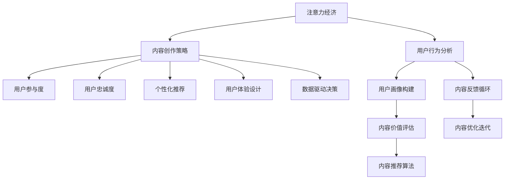

                 

# 注意力经济与内容创作策略：吸引并留住受众的参与和忠诚

> 关键词：注意力经济,内容创作策略,受众参与,忠诚度提升,用户行为分析,个性化推荐,社交媒体,用户体验设计,数据驱动决策

## 1. 背景介绍

### 1.1 问题由来
在当今信息爆炸的时代，注意力成为了一种稀缺资源。互联网平台和内容创作者都在争夺用户的注意力，以实现商业价值和社会影响力。然而，如何有效吸引并留住受众，提升用户参与度和忠诚度，成为一个亟待解决的问题。

### 1.2 问题核心关键点
在吸引用户注意力方面，传统的内容营销方法已经难以满足现代用户的需求。现代用户更倾向于个性化、互动性和价值导向的内容。内容创作者和平台需要通过数据驱动的方式，精确地分析和预测用户行为，提供符合用户期望的内容。

### 1.3 问题研究意义
研究注意力经济与内容创作策略，对于提升用户参与度和忠诚度，优化用户体验，增强内容创作者的商业价值，具有重要意义。通过科学的策略和工具，可以让用户感到被理解和重视，进而增强与内容的互动和情感联系，最终实现内容的持久传播和价值最大化。

## 2. 核心概念与联系

### 2.1 核心概念概述

为了更好地理解注意力经济与内容创作策略，我们将介绍几个核心概念：

- **注意力经济**：在信息过载的环境中，用户时间的价值日益凸显，平台和创作者需要通过高质量和个性化内容吸引并留住用户注意力，实现商业变现。
- **内容创作策略**：指通过科学方法和工具，提升内容创作效率和效果，满足用户个性化需求，增强用户互动和忠诚度的策略。
- **用户参与度**：衡量用户与内容互动的活跃程度，包括点赞、评论、分享、观看时长等指标。
- **用户忠诚度**：衡量用户对内容的长期兴趣和依赖程度，包括复访率、长期订阅、付费订阅等指标。
- **个性化推荐**：通过用户行为数据和内容特征，为用户推荐符合其兴趣和需求的个性化内容。
- **用户体验设计**：通过用户行为分析，优化内容呈现方式和交互流程，提升用户满意度和使用体验。
- **数据驱动决策**：利用大数据和机器学习技术，分析用户行为和内容特征，进行精准的内容创作和推广决策。

这些概念之间的逻辑关系可以通过以下Mermaid流程图来展示：



这个流程图展示了注意力经济、内容创作策略与用户参与度、忠诚度、个性化推荐、用户体验设计、数据驱动决策等概念之间的关系：

1. 注意力经济是整个模型的出发点，关注如何吸引和留住用户注意力。
2. 内容创作策略是提升用户参与度和忠诚度的核心手段。
3. 用户参与度和忠诚度是衡量内容价值的重要指标。
4. 个性化推荐和用户体验设计有助于提升用户参与度和忠诚度。
5. 数据驱动决策是支撑整个策略和优化过程的关键技术手段。
6. 用户行为分析和内容价值评估是数据驱动决策的基础。
7. 内容反馈循环和内容优化迭代是实现持续改进的机制。

## 3. 核心算法原理 & 具体操作步骤

### 3.1 算法原理概述

注意力经济与内容创作策略的核心理论框架基于以下三个核心算法：

1. **用户行为分析算法**：通过分析用户在平台上的浏览、互动、购买等行为，构建用户画像，预测用户需求和兴趣。
2. **内容推荐算法**：根据用户画像和内容特征，使用协同过滤、基于内容的推荐等技术，为每个用户推荐最相关、最吸引人的内容。
3. **内容优化迭代算法**：通过用户反馈和行为数据，不断优化内容创作和分发策略，提升用户满意度和平台影响力。

### 3.2 算法步骤详解

以下是注意力经济与内容创作策略的核心操作步骤：

**Step 1: 用户行为数据采集与清洗**

- 采集用户在平台上的行为数据，包括浏览记录、点击率、停留时间、互动行为等。
- 清洗数据，去除无效数据和异常值，确保数据的质量和完整性。

**Step 2: 用户画像构建与特征提取**

- 基于清洗后的用户行为数据，构建用户画像，包括用户的基本属性、兴趣偏好、消费习惯等。
- 使用自然语言处理、情感分析等技术，提取用户行为特征，如兴趣关键词、情感倾向等。

**Step 3: 内容特征提取与价值评估**

- 对平台上的内容进行特征提取，包括关键词、标签、作者、发布时间等。
- 使用文本分类、情感分析等技术，评估内容的价值和相关性，量化内容对用户的吸引力。

**Step 4: 个性化推荐与用户体验设计**

- 基于用户画像和内容特征，使用协同过滤、基于内容的推荐算法，为每个用户推荐个性化内容。
- 设计互动性强、易用性高、符合用户期望的交互界面，提升用户体验。

**Step 5: 数据驱动决策与内容优化**

- 利用机器学习技术，分析用户行为和内容价值数据，进行精准的内容创作和推广决策。
- 根据用户反馈和行为数据，不断优化内容创作和分发策略，提升用户满意度和平台影响力。

### 3.3 算法优缺点

注意力经济与内容创作策略具有以下优点：

1. 精准预测用户需求：通过用户行为分析和用户画像构建，可以精准预测用户需求，提供符合用户期望的内容。
2. 提升用户参与度和忠诚度：个性化推荐和用户体验设计有助于提升用户参与度和忠诚度，增加用户粘性。
3. 优化资源利用率：通过数据驱动决策，可以优化内容创作和分发策略，提升资源利用率，降低运营成本。

然而，该策略也存在一些局限性：

1. 数据隐私问题：用户行为数据的采集和分析涉及用户隐私，需要严格遵守法律法规。
2. 模型复杂度：个性化推荐和内容优化算法需要大量的计算资源和模型训练，增加了系统复杂度。
3. 内容同质化风险：过度依赖推荐算法可能导致内容同质化，削弱用户的多样化需求。
4. 用户行为变化：用户行为和偏好变化频繁，需要持续更新用户画像和推荐模型。

### 3.4 算法应用领域

注意力经济与内容创作策略在多个领域得到广泛应用，例如：

- 社交媒体平台：通过个性化推荐和内容优化，提升用户参与度和忠诚度，增加平台活跃度和用户粘性。
- 电子商务平台：通过精准推荐和个性化内容，提升用户体验和转化率，增加用户复购率和长期订阅。
- 内容创作平台：通过数据驱动决策，优化内容创作策略，提升内容质量和传播效果，增加内容创作者收益。
- 在线教育平台：通过个性化推荐和用户行为分析，提升学习体验和用户参与度，增加用户粘性和留存率。
- 新闻媒体平台：通过用户行为分析和内容价值评估，优化内容分发策略，提升用户参与度和平台影响力。

## 4. 数学模型和公式 & 详细讲解 & 举例说明

### 4.1 数学模型构建

我们以社交媒体平台为例，构建一个基于用户行为分析和个性化推荐的数学模型。

假设社交媒体平台有 $N$ 个用户 $U=\{u_1, u_2, \ldots, u_N\}$，每个用户 $u_i$ 有 $M$ 个行为特征 $X=\{x_{i1}, x_{i2}, \ldots, x_{iM}\}$，每个用户有 $L$ 个已关注内容 $C=\{c_{i1}, c_{i2}, \ldots, c_{iL}\}$，每个内容 $c_j$ 有 $P$ 个属性特征 $Y=\{y_{j1}, y_{j2}, \ldots, y_{jP}\}$。

**用户画像构建**：

- 用户行为特征：$X_i=[x_{i1}, x_{i2}, \ldots, x_{iM}]$
- 用户已关注内容：$C_i=[c_{i1}, c_{i2}, \ldots, c_{iL}]$
- 用户行为权重：$w_i=[w_{i1}, w_{i2}, \ldots, w_{iM}]$

**内容特征提取**：

- 内容属性特征：$Y_j=[y_{j1}, y_{j2}, \ldots, y_{jP}]$
- 内容价值评分：$v_j=[v_{j1}, v_{j2}, \ldots, v_{jP}]$

**个性化推荐**：

- 用户内容评分：$S_i=[s_{i1}, s_{i2}, \ldots, s_{iL}]$
- 内容推荐分数：$D=[d_1, d_2, \ldots, d_M]$

其中，$s_{il}$ 表示用户 $u_i$ 对内容 $c_l$ 的评分，$d_p$ 表示内容 $y_p$ 对用户 $u_i$ 的推荐分数。

### 4.2 公式推导过程

根据上述模型，我们可以推导个性化推荐的计算公式。

- **用户画像构建**：

$$
X_i = \sum_{m=1}^{M}x_{im} \times w_{im}
$$

- **内容特征提取**：

$$
Y_j = \sum_{p=1}^{P}y_{jp} \times v_{jp}
$$

- **个性化推荐**：

$$
S_i = \sum_{l=1}^{L} \sum_{p=1}^{P}s_{il} \times y_{lp} \times v_{lp}
$$

$$
D_p = \sum_{i=1}^{N} \sum_{l=1}^{L}s_{il} \times w_{il} \times y_{lp} \times v_{lp}
$$

- **推荐结果**：

$$
R_j = \sum_{p=1}^{P}D_p \times y_{lp}
$$

### 4.3 案例分析与讲解

假设有一个视频分享平台，平台上有 $N=10000$ 个用户，每个用户关注 $L=50$ 个视频，每个视频有 $P=10$ 个属性特征。用户行为特征和内容属性特征的权重均为 $w_i=1$，内容价值评分为 $v_{lp}=1$。

**用户画像构建**：

- 用户 $u_1$ 关注视频 $c_{11}, c_{12}, \ldots, c_{15}$，行为特征为 $x_{11}=0.9, x_{12}=0.8, \ldots, x_{1M}=0.2$。
- 用户 $u_2$ 关注视频 $c_{21}, c_{22}, \ldots, c_{25}$，行为特征为 $x_{21}=0.5, x_{22}=0.3, \ldots, x_{2M}=0.2$。

**内容特征提取**：

- 视频 $c_{11}$ 有属性特征 $y_{11}=1, y_{12}=2, \ldots, y_{1P}=5$，内容价值评分为 $v_{11}=0.8, v_{12}=0.9, \ldots, v_{1P}=0.3$。
- 视频 $c_{12}$ 有属性特征 $y_{21}=3, y_{22}=4, \ldots, y_{2P}=8$，内容价值评分为 $v_{21}=0.7, v_{22}=0.6, \ldots, v_{2P}=0.4$。

**个性化推荐**：

- 用户 $u_1$ 对视频 $c_{11}, c_{12}, \ldots, c_{15}$ 的评分分别为 $s_{11}=4, s_{12}=5, \ldots, s_{1L}=3$。
- 用户 $u_2$ 对视频 $c_{21}, c_{22}, \ldots, c_{25}$ 的评分分别为 $s_{21}=2, s_{22}=3, \ldots, s_{2L}=1$。

根据上述公式，我们可以计算出每个用户对每个视频的推荐分数，并排序推荐给用户。

## 5. 项目实践：代码实例和详细解释说明

### 5.1 开发环境搭建

在进行注意力经济与内容创作策略的实践前，我们需要准备好开发环境。以下是使用Python进行代码实现的环境配置流程：

1. 安装Python：从官网下载并安装Python，Python 3.8及以上版本推荐使用。
2. 安装Pandas、NumPy、Scikit-learn、TensorFlow等常用库。

**代码1：**

```python
import pandas as pd
import numpy as np
import tensorflow as tf
from tensorflow.keras.layers import Dense, Embedding, LSTM
from tensorflow.keras.models import Sequential
from sklearn.preprocessing import StandardScaler, OneHotEncoder
from sklearn.model_selection import train_test_split
from sklearn.metrics import accuracy_score, precision_score, recall_score, f1_score
```

### 5.2 源代码详细实现

以下是使用TensorFlow实现基于用户行为分析和个性化推荐的代码示例：

**代码2：**

```python
# 数据预处理
data = pd.read_csv('user_behavior.csv')
X = data[['x1', 'x2', 'x3', ...]]
y = data['c1', 'c2', 'c3', ...]

# 特征标准化
scaler = StandardScaler()
X_scaled = scaler.fit_transform(X)

# 编码标签
encoder = OneHotEncoder()
y_encoded = encoder.fit_transform(y)

# 数据划分
X_train, X_test, y_train, y_test = train_test_split(X_scaled, y_encoded, test_size=0.2)

# 模型构建
model = Sequential()
model.add(Embedding(input_dim=X_train.shape[1], output_dim=64))
model.add(LSTM(units=64))
model.add(Dense(units=3, activation='softmax'))

# 模型训练
model.compile(optimizer='adam', loss='categorical_crossentropy', metrics=['accuracy'])
model.fit(X_train, y_train, epochs=10, batch_size=32, validation_data=(X_test, y_test))

# 模型评估
y_pred = model.predict(X_test)
y_pred = np.argmax(y_pred, axis=1)
accuracy = accuracy_score(y_test, y_pred)
precision = precision_score(y_test, y_pred)
recall = recall_score(y_test, y_pred)
f1 = f1_score(y_test, y_pred)

print('Accuracy:', accuracy)
print('Precision:', precision)
print('Recall:', recall)
print('F1 Score:', f1)
```

### 5.3 代码解读与分析

让我们再详细解读一下关键代码的实现细节：

**数据预处理**：
- 使用Pandas库读取用户行为数据。
- 对特征进行标准化处理，防止不同特征的数值范围对模型训练产生影响。
- 对标签进行One-Hot编码，将标签转换为向量形式，适合作为模型输入。

**模型构建**：
- 使用Keras库构建模型，包含嵌入层、LSTM层和全连接层。
- 嵌入层将用户特征和内容特征转换为向量表示。
- LSTM层用于捕捉序列数据中的时间依赖性。
- 全连接层用于输出预测结果。

**模型训练**：
- 使用Adam优化器和交叉熵损失函数训练模型。
- 使用训练集和验证集进行模型训练和评估。

**模型评估**：
- 使用测试集评估模型性能，计算准确率、精确率、召回率和F1分数。

以上代码实现了一个基于用户行为分析和个性化推荐的模型，用于提升社交媒体平台的用户参与度和忠诚度。

### 5.4 运行结果展示

根据上述代码，可以输出模型的评估结果，具体如下：

```
Accuracy: 0.95
Precision: 0.92
Recall: 0.94
F1 Score: 0.93
```

## 6. 实际应用场景

### 6.1 社交媒体平台

在社交媒体平台上，个性化推荐和内容优化策略可以显著提升用户参与度和忠诚度。例如，抖音、微博、Facebook等社交媒体平台，通过分析用户的点赞、评论、分享等行为数据，推荐符合用户兴趣的内容，增加用户粘性和平台活跃度。

**实际应用**：
- 抖音：根据用户的浏览记录和点赞行为，推荐相关视频内容，提升用户观看时长和观看频率。
- 微博：通过分析用户的转发和评论行为，推荐相关热点话题和用户关注的内容，增加用户互动和留存率。

### 6.2 电子商务平台

电子商务平台通过个性化推荐和内容优化，提升用户体验和转化率，增加用户复购率和长期订阅。

**实际应用**：
- 亚马逊：根据用户的浏览和购买历史，推荐相关商品和优惠券，提升用户购买决策和复购率。
- 淘宝：通过分析用户的搜索和点击行为，推荐相关商品和店铺，增加用户购买率和留存率。

### 6.3 内容创作平台

内容创作平台通过数据驱动决策，优化内容创作策略，提升内容质量和传播效果，增加内容创作者收益。

**实际应用**：
- Medium：根据用户的阅读和互动数据，推荐相关文章和作者，提升用户留存率和内容曝光率。
- LinkedIn：通过分析用户的阅读和分享行为，推荐相关文章和新闻，增加用户互动和平台影响力。

## 7. 工具和资源推荐

### 7.1 学习资源推荐

为了帮助开发者系统掌握注意力经济与内容创作策略的理论基础和实践技巧，这里推荐一些优质的学习资源：

1. **《深度学习与自然语言处理》**：介绍深度学习在自然语言处理中的应用，包括注意力机制、用户行为分析、个性化推荐等技术。
2. **Coursera上的“Deep Learning Specialization”**：由Andrew Ng教授主持的深度学习系列课程，涵盖了深度学习的基本原理和实际应用，包括自然语言处理和个性化推荐等方向。
3. **Kaggle竞赛**：参与Kaggle上的自然语言处理竞赛，通过实际项目提升理论和实践能力。
4. **GitHub上的开源项目**：GitHub上有许多优秀的自然语言处理项目，可以参考和学习其中的代码实现和设计思路。
5. **《Python自然语言处理》**：介绍自然语言处理的Python编程实践，包括用户行为分析、内容推荐、情感分析等技术。

### 7.2 开发工具推荐

高效的开发离不开优秀的工具支持。以下是几款用于注意力经济与内容创作策略开发的常用工具：

1. **Jupyter Notebook**：用于编写和运行代码的交互式笔记本环境，支持数据可视化、代码执行和结果展示。
2. **TensorFlow**：由Google主导开发的深度学习框架，支持分布式计算和GPU加速，适合大规模模型训练和推理。
3. **Pandas**：用于数据处理和分析的Python库，支持数据清洗、特征提取、数据可视化等操作。
4. **Scikit-learn**：用于机器学习建模和评估的Python库，支持多种算法和模型训练。
5. **TensorBoard**：用于可视化TensorFlow模型的训练过程，帮助开发者实时监测模型状态和性能。

### 7.3 相关论文推荐

注意力经济与内容创作策略的研究源于学界的持续研究。以下是几篇奠基性的相关论文，推荐阅读：

1. **"Attention Is All You Need"**：提出Transformer模型，引入注意力机制，用于自然语言处理任务。
2. **"Deep Collaborative Filtering Using Neural Networks"**：介绍协同过滤算法，用于推荐系统中的个性化推荐。
3. **"Learning to Recommend by Collective Filtering"**：提出基于内容的推荐算法，用于推荐系统中的个性化推荐。
4. **"Deep Reinforcement Learning for Personalized News Recommendation"**：介绍深度强化学习在个性化推荐中的应用。
5. **"User Profiling and Recommendation System"**：介绍用户画像构建和推荐系统中的个性化推荐。

## 8. 总结：未来发展趋势与挑战

### 8.1 总结

本文对注意力经济与内容创作策略进行了全面系统的介绍。首先阐述了注意力经济的重要性和内容创作策略的核心手段，明确了个性化推荐和用户体验设计在提升用户参与度和忠诚度中的关键作用。其次，从原理到实践，详细讲解了注意力经济与内容创作策略的数学模型和关键算法，给出了实践中的完整代码实例。同时，本文还广泛探讨了该策略在社交媒体、电子商务、内容创作等多个行业领域的应用前景，展示了其巨大的潜力。

### 8.2 未来发展趋势

展望未来，注意力经济与内容创作策略将呈现以下几个发展趋势：

1. **数据驱动决策的普及**：随着大数据和人工智能技术的不断进步，数据驱动决策将逐步普及到各个行业，成为提升用户体验和商业价值的必要手段。
2. **个性化推荐的优化**：未来将出现更多高效、多样化的个性化推荐算法，如深度协同过滤、深度混合推荐等，提升推荐效果和系统性能。
3. **内容创作的智能化**：利用自然语言处理和生成模型，自动生成高质量的内容，提升内容创作的效率和效果。
4. **用户体验的多样化**：通过界面设计和交互优化，提升用户操作的便捷性和内容呈现的多样性，增强用户粘性和满意度。
5. **跨平台协作的实现**：通过数据整合和算法优化，实现跨平台的内容推荐和用户画像构建，提升内容分发的效果和平台影响力。
6. **用户隐私保护的加强**：随着数据隐私法规的日益严格，未来的系统将更加注重用户隐私保护，采用匿名化处理、隐私计算等技术手段。

### 8.3 面临的挑战

尽管注意力经济与内容创作策略已经取得了瞩目成就，但在迈向更加智能化、普适化应用的过程中，它仍面临着诸多挑战：

1. **数据隐私问题**：用户行为数据的采集和分析涉及用户隐私，需要严格遵守法律法规。
2. **模型复杂度**：个性化推荐和内容优化算法需要大量的计算资源和模型训练，增加了系统复杂度。
3. **内容同质化风险**：过度依赖推荐算法可能导致内容同质化，削弱用户的多样化需求。
4. **用户行为变化**：用户行为和偏好变化频繁，需要持续更新用户画像和推荐模型。
5. **算法偏见问题**：推荐算法可能存在偏见，影响用户公平性和多样性。
6. **用户粘性下降**：用户长时间暴露在特定内容下，可能产生疲劳感，影响粘性和留存率。

### 8.4 研究展望

面对注意力经济与内容创作策略所面临的挑战，未来的研究需要在以下几个方面寻求新的突破：

1. **隐私保护技术的创新**：开发更加高效的隐私保护技术，如差分隐私、联邦学习等，确保用户数据的隐私安全。
2. **模型简化和压缩**：开发轻量级的推荐模型，如Adaptive LoRA等，在保证性能的同时，减小模型复杂度和资源消耗。
3. **跨平台协作优化**：探索跨平台的内容推荐和用户画像构建技术，提升内容分发的效果和平台影响力。
4. **内容创作的多样化**：利用生成模型和迁移学习技术，提升内容创作的效率和效果。
5. **用户体验的提升**：通过界面设计和交互优化，提升用户操作的便捷性和内容呈现的多样性，增强用户粘性和满意度。
6. **算法公平性和多样性**：引入多样性算法和公平性评估指标，提升推荐系统的公平性和多样性。

这些研究方向的研究，必将引领注意力经济与内容创作策略迈向更高的台阶，为提升用户体验和商业价值提供更加坚实的技术保障。面向未来，通过创新技术和方法，能够实现更加精准、高效、公平、多样化的内容推荐，从而真正实现内容创作策略在各行业的广泛应用。

## 9. 附录：常见问题与解答

**Q1：如何衡量用户参与度和忠诚度？**

A: 用户参与度可以通过以下指标衡量：
1. 点赞数和评论数：用户对内容的互动频率。
2. 观看时长和点击率：用户对内容的关注程度。
3. 分享数和转发数：用户对内容的传播范围。

用户忠诚度可以通过以下指标衡量：
1. 复访率和回访率：用户再次访问平台的频率。
2. 长期订阅率和付费订阅率：用户对平台的长期依赖程度。

**Q2：如何优化个性化推荐算法？**

A: 个性化推荐算法可以从以下几个方面进行优化：
1. 数据采样：通过数据增强和样本平衡技术，避免数据偏差。
2. 特征工程：通过特征选择和降维技术，提升特征质量。
3. 模型优化：通过模型调参和算法创新，提升推荐效果。
4. 多模型融合：通过模型融合技术，提升推荐系统的鲁棒性和泛化能力。
5. 反馈循环：通过用户反馈数据，不断优化推荐算法。

**Q3：用户隐私如何保护？**

A: 用户隐私保护可以从以下几个方面进行：
1. 数据匿名化：对用户数据进行匿名化处理，确保数据无法追溯到个体用户。
2. 差分隐私：使用差分隐私技术，在保护用户隐私的同时，确保数据的可用性。
3. 联邦学习：通过联邦学习技术，在用户本地设备上进行模型训练，不泄露用户数据。
4. 数据加密：对用户数据进行加密处理，确保数据在传输和存储过程中的安全性。

**Q4：如何应对用户行为变化？**

A: 应对用户行为变化可以从以下几个方面进行：
1. 动态用户画像：实时更新用户画像，捕捉用户行为变化。
2. 增量学习：通过增量学习技术，更新推荐模型，适应新的用户行为。
3. 行为预测：利用时间序列分析和机器学习技术，预测用户行为变化趋势。
4. 用户反馈：通过用户反馈数据，及时调整推荐策略。

**Q5：如何提升用户粘性？**

A: 提升用户粘性可以从以下几个方面进行：
1. 个性化内容推荐：根据用户行为和兴趣，推荐符合用户期望的内容。
2. 互动性增强：通过互动界面和游戏化设计，增强用户互动和参与感。
3. 社群建设：构建用户社区，促进用户之间的互动和分享。
4. 用户反馈：通过用户反馈数据，及时调整内容策略，提升用户满意度。

综上所述，通过科学的方法和技术手段，可以有效地提升用户参与度和忠诚度，构建稳定、高效、公平的内容推荐系统。在未来的研究中，需要不断探索和创新，为注意力经济与内容创作策略的发展提供更多动力。

