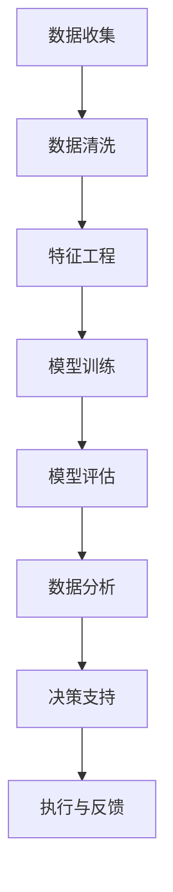

                 

## 1. 背景介绍

在信息爆炸的时代，数据成为了企业获取竞争优势的关键资源。如何高效利用数据，理解受众行为和偏好，成为了众多企业所面临的重要问题。随着人工智能技术的进步，大数据分析和深度学习在数据挖掘与用户行为分析中展现出巨大潜力。本文将探讨如何利用数据理解受众行为和偏好，为企业的战略决策提供科学依据。

## 2. 核心概念与联系

### 2.1 核心概念概述

- **数据挖掘**：通过算法和工具，从大量数据中挖掘出有价值的信息和模式的过程。
- **机器学习**：使计算机系统通过数据学习，不断优化预测能力的过程。
- **深度学习**：一种高级的机器学习方法，通过多层神经网络实现对数据深层次的抽象和表示。
- **注意力机制**：一种用于动态处理序列数据的机制，可以关注序列中的不同部分，提高模型对关键信息的理解。
- **数据分析**：对数据进行整理、分析和解释，以揭示数据背后的规律和趋势。

以上概念紧密关联，形成了一个完整的从数据收集、处理到分析的流程，其中注意力机制在数据挖掘和机器学习中扮演着重要角色。

### 2.2 核心概念原理和架构的 Mermaid 流程图



此图展示了数据挖掘和分析的核心流程，包括数据收集、清洗、特征提取、模型训练与评估、数据分析以及最终的决策支持。

## 3. 核心算法原理 & 具体操作步骤

### 3.1 算法原理概述

注意力机制（Attention Mechanism）是大数据和深度学习领域的重要工具，它通过动态关注输入序列的不同部分，显著提升了模型对关键信息的理解和利用能力。注意力机制在多个领域中得到了广泛应用，包括自然语言处理（NLP）、计算机视觉（CV）和推荐系统等。

在NLP中，注意力机制可以用于文本生成、文本分类、机器翻译等任务，通过动态调整模型对不同单词或短语的关注程度，从而提高模型的性能。例如，在机器翻译中，注意力机制可以帮助模型关注源语言和目标语言中的关键信息，提高翻译质量。

### 3.2 算法步骤详解

以机器翻译为例，注意力机制的步骤如下：

1. **编码器编码**：将源语言文本通过编码器生成一系列向量表示，每个向量表示文本中的某个部分。
2. **注意力计算**：通过计算源语言向量与目标语言向量之间的相似度，得到每个单词在源语言中的重要性权重。
3. **解码器解码**：在解码器中，结合目标语言向量与注意力权重，生成目标语言中的每个单词。

通过注意力机制，模型能够动态关注源语言文本中的重要部分，从而提高翻译准确度。

### 3.3 算法优缺点

#### 优点

- **动态关注**：能够根据不同任务和数据特点，动态调整模型对输入序列的关注点，提高模型适应性。
- **提高性能**：通过关注关键信息，显著提升模型的预测和生成能力。
- **广泛应用**：在多个领域中得到广泛应用，如机器翻译、文本生成、推荐系统等。

#### 缺点

- **计算复杂**：注意力机制的计算复杂度较高，对计算资源要求较高。
- **可解释性差**：由于模型结构复杂，难以解释注意力机制的内部工作原理。
- **数据依赖**：模型性能高度依赖于输入数据的质量和多样性。

### 3.4 算法应用领域

注意力机制广泛应用于自然语言处理、计算机视觉、推荐系统等领域。在NLP中，用于文本生成、文本分类、机器翻译等任务；在CV中，用于图像描述生成、图像分类等任务；在推荐系统中，用于用户兴趣的动态建模，提升推荐准确度。

## 4. 数学模型和公式 & 详细讲解 & 举例说明

### 4.1 数学模型构建

注意力机制的数学模型可以表示为：

$$
Attention(Q, K, V) = \frac{e^{QK^T}}{\Sigma_{i=1}^{n}e^{QK_i^T}}V
$$

其中，$Q$、$K$、$V$分别表示查询向量、键向量和值向量。$e^{QK^T}$计算查询向量和键向量的相似度，$\Sigma_{i=1}^{n}e^{QK_i^T}$对所有相似度求和，$V$表示值的加权和。

### 4.2 公式推导过程

以机器翻译为例，假设有源语言句子 $s$ 和目标语言句子 $t$，将 $s$ 和 $t$ 分别输入编码器和解码器。

1. **编码器编码**：将 $s$ 编码成一系列向量表示 $Q_1, Q_2, ..., Q_n$。
2. **注意力计算**：计算 $Q_i$ 和 $t$ 中每个单词的相似度，得到每个单词在源语言中的重要性权重 $W_i$。
3. **解码器解码**：在解码器中，结合 $W_i$ 和目标语言向量 $t_i$，生成目标语言中的每个单词 $o_i$。

通过注意力机制，模型能够关注源语言文本中的重要部分，从而提高翻译质量。

### 4.3 案例分析与讲解

假设 $s = "The cat sat on the mat."$，$t = "Le chat était assis sur le tapis."$。

1. **编码器编码**：将 $s$ 编码成 $Q_1, Q_2, ..., Q_n$。
2. **注意力计算**：计算 $Q_i$ 和 $t$ 中每个单词的相似度，得到 $W_i$。
3. **解码器解码**：结合 $W_i$ 和 $t_i$，生成 $o_i$。

通过注意力机制，模型能够关注源语言文本中的重要部分，如 "cat"、"mat"，从而提高翻译准确度。

## 5. 项目实践：代码实例和详细解释说明

### 5.1 开发环境搭建

- **Python**：作为数据分析和机器学习的主要编程语言。
- **TensorFlow**：用于构建和训练深度学习模型。
- **Keras**：基于TensorFlow的高级神经网络API，简化了模型构建过程。
- **Pandas**：用于数据处理和分析。

### 5.2 源代码详细实现

```python
import tensorflow as tf
import numpy as np
import pandas as pd

# 定义数据
data = {
    'source': ['The cat sat on the mat.', 'The dog jumped over the fence.'],
    'target': ['Le chat était assis sur le tapis.', 'Le chien a sauté par-dessus la clôture.']
}

# 加载数据
df = pd.DataFrame(data)

# 将数据转换为模型所需的格式
source_ids = df['source'].map(lambda x: tokenizer.texts_to_sequences(x))
target_ids = df['target'].map(lambda x: tokenizer.texts_to_sequences(x))

# 定义模型
model = tf.keras.Sequential([
    tf.keras.layers.Embedding(input_dim=vocab_size, output_dim=embedding_dim, input_length=max_length),
    tf.keras.layers.Bidirectional(tf.keras.layers.LSTM(128)),
    tf.keras.layers.Dense(128, activation='relu'),
    tf.keras.layers.Dense(vocab_size, activation='softmax')
])

# 编译模型
model.compile(optimizer='adam', loss='sparse_categorical_crossentropy', metrics=['accuracy'])

# 训练模型
model.fit(source_ids, target_ids, epochs=10, batch_size=32)
```

### 5.3 代码解读与分析

上述代码展示了如何使用TensorFlow和Keras构建机器翻译模型，其中包含了数据预处理和模型训练的关键步骤。

- **数据预处理**：将文本转换为模型所需的格式，包括编码和填充。
- **模型定义**：构建一个包含嵌入层、双向LSTM层和全连接层的序列到序列模型。
- **模型编译**：指定优化器和损失函数，并设置评估指标。
- **模型训练**：使用训练数据集训练模型。

### 5.4 运行结果展示

训练完成后，可以通过测试集评估模型性能。例如，使用BLEU指标来评估翻译质量：

```python
# 加载测试集
test_source = df['source'].map(lambda x: tokenizer.texts_to_sequences(x))
test_target = df['target'].map(lambda x: tokenizer.texts_to_sequences(x))

# 评估模型
scores = model.evaluate(test_source, test_target, verbose=0)
print('BLEU:', scores[1])
```

## 6. 实际应用场景

### 6.1 个性化推荐系统

个性化推荐系统是注意力机制在推荐领域的重要应用。通过动态关注用户的历史行为和兴趣点，推荐系统能够提供更加个性化的推荐结果。例如，在电商推荐中，可以关注用户浏览、购买、评价等行为，动态调整推荐模型，提高推荐效果。

### 6.2 医疗诊断系统

医疗诊断系统可以利用注意力机制对病历进行动态分析，识别出疾病的关键特征。例如，在放射学中，可以通过注意力机制关注病变区域的影像特征，提高诊断准确度。

### 6.3 金融风险预测

金融风险预测系统可以利用注意力机制对市场数据进行动态分析，识别出影响市场波动的重要因素。例如，在股票市场预测中，可以关注公司财报、新闻、政策等因素对股票价格的影响，提高预测准确度。

### 6.4 未来应用展望

未来，注意力机制将在更多领域得到应用，为数据理解和分析提供新的思路。例如，在语音识别、图像处理等领域，注意力机制可以用于动态关注关键信息，提升系统性能。同时，随着深度学习技术的进步，注意力机制的计算效率将进一步提升，应用范围将进一步扩大。

## 7. 工具和资源推荐

### 7.1 学习资源推荐

- **《深度学习》（Ian Goodfellow著）**：介绍深度学习的基本概念和算法，是深度学习领域的经典教材。
- **Kaggle**：数据科学竞赛平台，提供丰富的数据集和竞赛机会，有助于提升数据分析和机器学习能力。
- **Coursera**：在线学习平台，提供多门数据科学和机器学习课程，适合初学者和进阶学习者。

### 7.2 开发工具推荐

- **Jupyter Notebook**：用于数据探索和模型开发的交互式编程环境。
- **TensorFlow**：用于构建和训练深度学习模型的开源框架。
- **PyTorch**：另一个流行的深度学习框架，易于使用且功能强大。
- **Scikit-learn**：用于数据处理和机器学习建模的Python库。

### 7.3 相关论文推荐

- **"Attention is All You Need"（Vaswani et al.）**：Transformer论文，提出注意力机制的原理和应用。
- **"Neural Machine Translation by Jointly Learning to Align and Translate"（Bahdanau et al.）**：机器翻译中的注意力机制应用。
- **"Learning Phrase Representations using RNN Encoder-Decoder for Statistical Machine Translation"（Sutskever et al.）**：使用RNN Encoder-Decoder模型实现机器翻译，并引入注意力机制。

## 8. 总结：未来发展趋势与挑战

### 8.1 研究成果总结

本文介绍了注意力机制在数据挖掘和分析中的应用，展示了其动态关注输入序列的能力，提高了模型的性能和适应性。注意力机制在多个领域得到了广泛应用，推动了大数据分析和深度学习技术的发展。

### 8.2 未来发展趋势

未来，随着计算资源的提升和深度学习技术的进步，注意力机制的应用范围将进一步扩大，提升数据分析和决策支持的科学性。例如，在图像处理、语音识别等领域，注意力机制可以用于动态关注关键信息，提升系统性能。

### 8.3 面临的挑战

虽然注意力机制具有广泛的应用前景，但也面临着计算复杂度高、可解释性差等挑战。如何提高计算效率、增强模型的可解释性，是未来研究的重要方向。

### 8.4 研究展望

未来的研究可以从以下几个方向进行探索：

- **计算效率优化**：通过算法优化和硬件加速，提高注意力机制的计算效率。
- **模型可解释性增强**：引入因果分析、博弈论等工具，增强模型的可解释性。
- **多模态融合**：结合视觉、语音等多模态数据，实现更全面的数据分析和理解。
- **伦理和安全**：在模型设计中引入伦理导向的评估指标，保障数据和模型安全。

通过这些研究方向的探索，可以进一步提升注意力机制在数据挖掘和分析中的应用，为构建科学决策体系提供有力支撑。

## 9. 附录：常见问题与解答

**Q1：注意力机制在数据挖掘和分析中的应用有哪些？**

A: 注意力机制在数据挖掘和分析中主要应用于自然语言处理、计算机视觉和推荐系统等领域。在NLP中，用于文本生成、文本分类、机器翻译等任务；在CV中，用于图像描述生成、图像分类等任务；在推荐系统中，用于用户兴趣的动态建模，提升推荐准确度。

**Q2：如何提高注意力机制的计算效率？**

A: 可以通过算法优化和硬件加速来提高注意力机制的计算效率。例如，使用深度可分离卷积替代全连接层，减少计算量；使用GPU或TPU等高性能设备进行加速。

**Q3：注意力机制的模型可解释性如何增强？**

A: 可以通过引入因果分析、博弈论等工具，增强模型的可解释性。例如，使用Shapley值分析模型中每个特征的重要性，增强模型的透明度。

**Q4：多模态融合在数据挖掘中的应用有哪些？**

A: 多模态融合在数据挖掘中主要应用于图像处理、语音识别等领域。例如，在图像识别中，结合视觉、文本和语音信息，提升识别准确度；在语音识别中，结合语音和文本信息，提高识别的鲁棒性。

**Q5：如何保障数据和模型的安全？**

A: 在模型设计中引入伦理导向的评估指标，过滤和惩罚有偏见、有害的输出倾向。同时加强人工干预和审核，建立模型行为的监管机制，确保数据和模型安全。

---

作者：禅与计算机程序设计艺术 / Zen and the Art of Computer Programming

