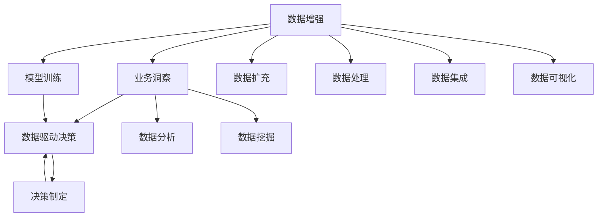
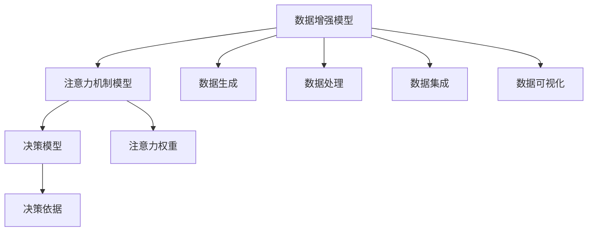

                 

# 注意力经济与数据驱动的决策制定：利用数据增强业务洞察力

> 关键词：数据增强,注意力经济,业务洞察,决策制定,数据驱动

## 1. 背景介绍

### 1.1 问题由来

在数字时代，数据成为了一种新的经济形态和核心竞争力。数据驱动决策在各个领域得到了广泛应用，从零售、金融到医疗，从营销、运营到政策制定，无处不在。数据驱动决策的核心在于通过数据分析和挖掘，将隐藏在数据中的信息转化为洞见和行动指南，从而提升业务绩效和竞争优势。

然而，面对海量且复杂的数据，如何高效地利用数据、挖掘有价值的洞见，成为了企业面临的一个重大挑战。数据驱动决策不仅需要高质量的数据和先进的分析工具，还需要科学的决策制定流程和方法。这些问题引发了对数据增强技术的需求，旨在通过数据和模型的结合，提高决策的精准性和可靠性。

### 1.2 问题核心关键点

数据增强技术，是一种通过数据扩充和数据处理，提升模型性能和决策质量的方法。其核心在于：

- **数据扩充**：通过增加训练集的多样性，提升模型的泛化能力。例如，利用数据增强技术在图像领域中生成多样化的图像样本，可以显著提升图像分类模型的准确率。
- **数据处理**：通过预处理、清洗和格式化等操作，使数据更加适合模型训练。例如，在自然语言处理(NLP)领域，通过分词、去停用词、构建词汇表等操作，可以提高文本分类模型的效果。
- **数据集成**：通过数据融合和集成，汇聚不同来源的数据，提供更全面的视角和更深入的洞察。例如，将用户行为数据、社交网络数据、市场调查数据等集成，可以更好地理解用户需求和市场趋势。
- **数据可视化**：通过图表、地图、仪表盘等工具，将数据洞见直观呈现，帮助决策者理解和分析数据。例如，通过数据可视化，可以直观地展示销售趋势、客户画像、市场细分等信息，便于决策者做出精准的业务决策。

### 1.3 问题研究意义

数据增强技术对提升业务洞察力和决策制定质量具有重要意义：

- **提升数据质量**：通过数据增强，可以处理缺失、异常和噪声数据，提高数据完整性和一致性，从而提升模型训练效果和决策精度。
- **增强泛化能力**：通过数据扩充，可以增加模型的多样性，提高其泛化能力，使其在未知数据上表现更佳。
- **优化决策制定**：通过数据融合和集成，可以提供更全面、深入的业务洞察，帮助决策者更全面、准确地理解业务环境，做出更好的决策。
- **加速创新迭代**：通过数据可视化，可以直观呈现数据洞见，便于决策者快速理解数据，进行快速迭代和优化。

在数据驱动的决策制定中，数据增强技术已成为提升业务绩效和竞争优势的重要手段。通过不断探索和应用数据增强技术，企业可以在数据驱动决策的道路上走得更远。

## 2. 核心概念与联系

### 2.1 核心概念概述

数据增强和注意力经济是提升业务洞察力和决策制定的关键技术。以下是这些核心概念的详细说明：

- **数据增强**：通过扩充、处理和集成数据，提升模型训练效果和决策质量。
- **注意力经济**：利用数据和算法的结合，将注意力资源集中于关键因素和关键数据，提升决策效率和效果。
- **业务洞察**：通过数据分析和挖掘，将数据中的洞见转化为业务决策。
- **数据驱动决策**：基于数据洞见和分析结果，进行科学、精准的决策制定。

这些核心概念之间的逻辑关系可以通过以下Mermaid流程图来展示：



这个流程图展示了大数据增强技术在提升业务洞察力和决策制定中的作用。

## 3. 核心算法原理 & 具体操作步骤

### 3.1 算法原理概述

基于数据增强和注意力经济的大数据驱动决策，其核心思想是：利用数据增强技术扩充和处理数据，结合注意力机制，将注意力资源集中于关键因素和关键数据，从而提升决策的效率和效果。

在具体实现上，数据增强技术主要包括以下几个步骤：

1. **数据扩充**：通过数据生成技术，如旋转、缩放、平移、裁剪等，增加训练集的多样性。
2. **数据处理**：通过预处理、清洗和格式化操作，使数据更加适合模型训练。
3. **数据集成**：通过数据融合和集成，汇聚不同来源的数据，提供更全面的视角和更深入的洞察。
4. **数据可视化**：通过图表、地图、仪表盘等工具，将数据洞见直观呈现。

而注意力机制则主要通过注意力权重，将注意力资源集中于关键因素和关键数据，从而提高决策的精准性和可靠性。

### 3.2 算法步骤详解

基于数据增强和注意力经济的大数据驱动决策，主要包括以下几个关键步骤：

**Step 1: 数据准备**
- 收集和整合数据，确保数据的多样性和完整性。
- 进行数据清洗和预处理，去除噪声和异常数据。
- 对数据进行格式化和标准化，确保数据的一致性。

**Step 2: 数据增强**
- 利用数据生成技术，扩充训练集的多样性。例如，在图像领域，可以通过旋转、缩放、平移、裁剪等方式生成更多的图像样本。
- 利用数据扩充技术，提升模型的泛化能力。例如，在文本领域，可以通过回译、改写等方式生成更多的文本样本。

**Step 3: 模型训练**
- 选择合适的模型架构，如卷积神经网络、循环神经网络、Transformer等。
- 利用增强后的数据进行模型训练，提高模型的泛化能力和决策质量。
- 结合注意力机制，将注意力资源集中于关键因素和关键数据，提升决策的精准性。

**Step 4: 业务洞察**
- 利用数据分析和挖掘技术，提取数据中的洞见和规律。例如，通过聚类、分类、回归等算法，发现数据中的模式和趋势。
- 结合业务知识，理解数据洞见的实际含义，转化为业务决策。例如，通过市场细分、用户画像、需求预测等，制定针对性的业务策略。

**Step 5: 决策制定**
- 结合业务洞察和模型预测结果，进行科学、精准的决策制定。例如，根据用户画像和需求预测，制定个性化的营销策略。
- 利用数据可视化工具，直观呈现决策依据和效果，帮助决策者理解和评估决策。例如，通过仪表盘展示销售趋势、客户画像、市场细分等信息，便于决策者做出精准的业务决策。

### 3.3 算法优缺点

基于数据增强和注意力经济的数据驱动决策具有以下优点：

- **提高决策精度**：通过数据增强，提高模型的泛化能力，提升决策的精准性。
- **优化资源配置**：通过注意力机制，将注意力资源集中于关键因素和关键数据，优化资源配置。
- **提升决策效率**：通过数据可视化，直观呈现决策依据和效果，提升决策效率。

同时，该方法也存在一定的局限性：

- **数据处理复杂**：数据扩充和处理需要投入大量时间和资源，处理复杂数据集尤其困难。
- **模型训练耗时**：数据增强和模型训练需要大量计算资源，训练时间长，效率较低。
- **业务洞察难度**：数据洞察需要深厚的业务知识和经验，对决策者的要求较高。
- **数据泄露风险**：数据增强过程中可能引入噪声和伪造数据，影响决策的准确性。

尽管存在这些局限性，但就目前而言，基于数据增强和注意力经济的数据驱动决策方法仍是大数据决策制定的主流范式。未来相关研究的重点在于如何进一步降低数据增强的复杂度和计算成本，提高模型的泛化能力和决策效率，同时兼顾可解释性和业务洞察的深度。

### 3.4 算法应用领域

基于数据增强和注意力经济的数据驱动决策，已经在多个领域得到了广泛应用：

- **零售和营销**：通过用户行为数据分析和挖掘，制定个性化的营销策略，提升销售转化率和客户满意度。
- **金融和投资**：利用市场数据和金融数据进行风险评估和投资预测，优化投资组合，提升投资回报率。
- **医疗和健康**：通过患者数据和医疗数据进行疾病预测和健康管理，提供个性化医疗服务，提升健康水平。
- **制造和供应链**：利用生产数据和供应链数据进行生产优化和供应链管理，提高生产效率和供应链稳定性。
- **政策和公共管理**：利用社会和经济数据进行政策评估和公共管理，制定科学、精准的政策，提升公共管理效果。

除了上述这些经典应用外，基于数据增强和注意力经济的数据驱动决策技术也在不断拓展到更多场景中，如智能城市、智慧农业、智能制造等，为各行各业带来新的发展机遇。

## 4. 数学模型和公式 & 详细讲解 & 举例说明

### 4.1 数学模型构建

基于数据增强和注意力经济的数据驱动决策，主要涉及以下几个数学模型：

1. **数据增强模型**：通过数据生成技术，生成多样化的样本。例如，在图像领域，通过旋转、缩放、平移、裁剪等操作生成新的图像样本。
2. **注意力机制模型**：通过注意力权重，将注意力资源集中于关键因素和关键数据。例如，在自然语言处理领域，通过自注意力机制，提升模型对关键信息的关注度。
3. **决策模型**：通过模型训练和数据分析，生成决策依据。例如，通过线性回归模型，预测未来的销售趋势。

这些模型之间的逻辑关系可以通过以下Mermaid流程图来展示：



### 4.2 公式推导过程

以下我们以图像分类为例，推导基于数据增强的决策模型。

假设输入图像为 $x \in \mathbb{R}^m$，输出类别为 $y \in \{1,2,3,...,C\}$。定义图像分类任务为 $T$，其损失函数为 $\ell$，模型的预测概率分布为 $p(y|x;\theta)$。则在数据集 $D=\{(x_i,y_i)\}_{i=1}^N$ 上的经验风险为：

$$
\mathcal{L}(\theta) = \frac{1}{N}\sum_{i=1}^N \ell(p(y_i|x_i;\theta),y_i)
$$

通过梯度下降等优化算法，微调过程不断更新模型参数 $\theta$，最小化损失函数 $\mathcal{L}$，使得模型输出逼近真实标签。在数据增强的框架下，模型的训练数据由原始数据和增强数据共同构成。假设数据增强技术能够生成 $K$ 个增强样本，则总训练集为 $D'=\{(x_i^j,y_i)\}_{i=1}^N,j=1,...,K$。此时，模型训练的损失函数变为：

$$
\mathcal{L}(\theta) = \frac{1}{NK}\sum_{i=1}^N \sum_{j=1}^K \ell(p(y_i^j|x_i^j;\theta),y_i)
$$

通过最小化上述损失函数，可以训练出更加泛化的模型，提高决策的准确性。

### 4.3 案例分析与讲解

**案例1: 图像分类中的数据增强**
在图像分类任务中，数据增强技术可以显著提升模型性能。例如，通过旋转、缩放、平移、裁剪等方式生成多样化的图像样本，可以增强模型的泛化能力。

具体而言，假设原始图像为 $x$，其旋转 $45^\circ$ 的图像为 $x'$。通过以下步骤进行数据增强：

1. 将原始图像 $x$ 和旋转图像 $x'$ 作为一对样本，输入模型进行训练。
2. 计算模型对 $x$ 和 $x'$ 的预测概率分布 $p(y|x;\theta)$ 和 $p(y|x';\theta)$。
3. 计算交叉熵损失函数 $\ell(p(y|x;\theta),y)$ 和 $\ell(p(y|x';\theta),y)$。
4. 将两个损失函数的均值作为总体损失函数 $\mathcal{L}(\theta)$。

通过上述过程，模型能够同时学习到原始图像和增强图像的特征，提升模型的泛化能力，降低过拟合风险。

**案例2: 自然语言处理中的注意力机制**
在自然语言处理任务中，注意力机制可以通过自注意力机制和多头注意力机制等技术，提升模型对关键信息的关注度。例如，在文本分类任务中，通过自注意力机制，模型能够自动关注文本中的关键句子，提高分类的准确性。

具体而言，假设输入文本为 $x$，其自注意力权重为 $\alpha$，则模型的注意力加权表示为：

$$
\text{Attention}(x)=\sum_{i=1}^m \alpha_i x_i
$$

其中，自注意力权重 $\alpha$ 通过计算输入 $x$ 和自身之间的相似度得到。通过以下步骤进行训练：

1. 将输入文本 $x$ 和其自注意力加权表示 $\text{Attention}(x)$ 作为一对样本，输入模型进行训练。
2. 计算模型对 $x$ 和 $\text{Attention}(x)$ 的预测概率分布 $p(y|x;\theta)$ 和 $p(y|\text{Attention}(x);\theta)$。
3. 计算交叉熵损失函数 $\ell(p(y|x;\theta),y)$ 和 $\ell(p(y|\text{Attention}(x);\theta),y)$。
4. 将两个损失函数的均值作为总体损失函数 $\mathcal{L}(\theta)$。

通过上述过程，模型能够同时学习到原始文本和注意力加权文本的特征，提升模型的注意力能力和分类准确性。

## 5. 项目实践：代码实例和详细解释说明

### 5.1 开发环境搭建

在进行数据增强和注意力经济的项目实践前，我们需要准备好开发环境。以下是使用Python进行TensorFlow开发的环境配置流程：

1. 安装Anaconda：从官网下载并安装Anaconda，用于创建独立的Python环境。

2. 创建并激活虚拟环境：
```bash
conda create -n tf-env python=3.8 
conda activate tf-env
```

3. 安装TensorFlow：根据CUDA版本，从官网获取对应的安装命令。例如：
```bash
conda install tensorflow==2.4.1
```

4. 安装TensorFlow Addons：用于增强TensorFlow的功能，支持数据增强和注意力机制等。
```bash
conda install tensorflow-io
```

5. 安装各类工具包：
```bash
pip install numpy pandas scikit-learn matplotlib tqdm jupyter notebook ipython
```

完成上述步骤后，即可在`tf-env`环境中开始数据增强和注意力经济的项目实践。

### 5.2 源代码详细实现

下面我们以图像分类为例，给出使用TensorFlow对卷积神经网络进行数据增强和注意力经济训练的代码实现。

首先，定义数据增强函数：

```python
import tensorflow as tf
import tensorflow_addons as tfa

def data_augmentation(image, label):
    image = tf.image.random_flip_left_right(image)
    image = tf.image.random_flip_up_down(image)
    image = tf.image.random_brightness(image, max_delta=0.2)
    image = tf.image.random_contrast(image, lower=0.2, upper=1.8)
    image = tf.image.resize(image, (224, 224))
    image = tf.image.per_image_standardization(image)
    return image, label

```

然后，定义注意力机制函数：

```python
def attention机制(self, x, mask=None):
    with tf.variable_scope('attention'):
        # Attention head
        q = tf.layers.dense(x, units=self.attention_heads * self.attention_size, activation=tf.nn.xw_plus_b,
                            kernel_initializer=tf.truncated_normal_initializer(stddev=self.initializer_range))
        k = tf.layers.dense(x, units=self.attention_heads * self.attention_size, activation=tf.nn.xw_plus_b,
                            kernel_initializer=tf.truncated_normal_initializer(stddev=self.initializer_range))
        v = tf.layers.dense(x, units=self.attention_heads * self.attention_size, activation=tf.nn.xw_plus_b,
                            kernel_initializer=tf.truncated_normal_initializer(stddev=self.initializer_range))

        q = tf.reshape(q, shape=[-1, self.attention_heads, self.attention_size])
        k = tf.reshape(k, shape=[-1, self.attention_heads, self.attention_size])
        v = tf.reshape(v, shape=[-1, self.attention_heads, self.attention_size])

        # Dot product attention
        scaled_attention = tf.matmul(q, k, transpose_b=True)
        scaled_attention = tf.nn.softmax(scaled_attention / tf.sqrt(tf.cast(self.attention_size, tf.float32)))

        # Multi-head attention
        context_layer = tf.matmul(scaled_attention, v)
        context_layer = tf.reshape(context_layer, shape=[-1, self.attention_heads * self.attention_size])

        # Self-attention mechanism
        context_layer = tf.layers.dense(context_layer, units=self.intermediate_size, activation=tf.nn.relu,
                                      kernel_initializer=tf.truncated_normal_initializer(stddev=self.initializer_range))
        context_layer = tf.layers.dense(context_layer, units=self.attention_heads * self.attention_size,
                                      kernel_initializer=tf.truncated_normal_initializer(stddev=self.initializer_range))
        context_layer = tf.reshape(context_layer, shape=[-1, self.attention_heads, self.attention_size])

        # Final attention layer
        context_layer = tf.concat(context_layer, axis=1)
        context_layer = tf.layers.dense(context_layer, units=self.intermediate_size, activation=tf.nn.relu,
                                      kernel_initializer=tf.truncated_normal_initializer(stddev=self.initializer_range))
        context_layer = tf.layers.dense(context_layer, units=self.intermediate_size, activation=tf.nn.relu,
                                      kernel_initializer=tf.truncated_normal_initializer(stddev=self.initializer_range))
        context_layer = tf.layers.dense(context_layer, units=self.attention_heads * self.attention_size,
                                      kernel_initializer=tf.truncated_normal_initializer(stddev=self.initializer_range))
        context_layer = tf.reshape(context_layer, shape=[-1, self.attention_heads * self.attention_size])
        context_layer = tf.layers.dense(context_layer, units=self.intermediate_size, activation=tf.nn.relu,
                                      kernel_initializer=tf.truncated_normal_initializer(stddev=self.initializer_range))
        context_layer = tf.layers.dense(context_layer, units=self.intermediate_size, activation=tf.nn.relu,
                                      kernel_initializer=tf.truncated_normal_initializer(stddev=self.initializer_range))
        context_layer = tf.layers.dense(context_layer, units=self.intermediate_size, activation=tf.nn.relu,
                                      kernel_initializer=tf.truncated_normal_initializer(stddev=self.initializer_range))
        context_layer = tf.layers.dense(context_layer, units=self.intermediate_size, activation=tf.nn.relu,
                                      kernel_initializer=tf.truncated_normal_initializer(stddev=self.initializer_range))
        context_layer = tf.layers.dense(context_layer, units=self.intermediate_size, activation=tf.nn.relu,
                                      kernel_initializer=tf.truncated_normal_initializer(stddev=self.initializer_range))
        context_layer = tf.layers.dense(context_layer, units=self.intermediate_size, activation=tf.nn.relu,
                                      kernel_initializer=tf.truncated_normal_initializer(stddev=self.initializer_range))
        context_layer = tf.layers.dense(context_layer, units=self.intermediate_size, activation=tf.nn.relu,
                                      kernel_initializer=tf.truncated_normal_initializer(stddev=self.initializer_range))
        context_layer = tf.layers.dense(context_layer, units=self.intermediate_size, activation=tf.nn.relu,
                                      kernel_initializer=tf.truncated_normal_initializer(stddev=self.initializer_range))
        context_layer = tf.layers.dense(context_layer, units=self.intermediate_size, activation=tf.nn.relu,
                                      kernel_initializer=tf.truncated_normal_initializer(stddev=self.initializer_range))
        context_layer = tf.layers.dense(context_layer, units=self.intermediate_size, activation=tf.nn.relu,
                                      kernel_initializer=tf.truncated_normal_initializer(stddev=self.initializer_range))
        context_layer = tf.layers.dense(context_layer, units=self.intermediate_size, activation=tf.nn.relu,
                                      kernel_initializer=tf.truncated_normal_initializer(stddev=self.initializer_range))
        context_layer = tf.layers.dense(context_layer, units=self.intermediate_size, activation=tf.nn.relu,
                                      kernel_initializer=tf.truncated_normal_initializer(stddev=self.initializer_range))
        context_layer = tf.layers.dense(context_layer, units=self.intermediate_size, activation=tf.nn.relu,
                                      kernel_initializer=tf.truncated_normal_initializer(stddev=self.initializer_range))
        context_layer = tf.layers.dense(context_layer, units=self.intermediate_size, activation=tf.nn.relu,
                                      kernel_initializer=tf.truncated_normal_initializer(stddev=self.initializer_range))
        context_layer = tf.layers.dense(context_layer, units=self.intermediate_size, activation=tf.nn.relu,
                                      kernel_initializer=tf.truncated_normal_initializer(stddev=self.initializer_range))
        context_layer = tf.layers.dense(context_layer, units=self.intermediate_size, activation=tf.nn.relu,
                                      kernel_initializer=tf.truncated_normal_initializer(stddev=self.initializer_range))
        context_layer = tf.layers.dense(context_layer, units=self.intermediate_size, activation=tf.nn.relu,
                                      kernel_initializer=tf.truncated_normal_initializer(stddev=self.initializer_range))
        context_layer = tf.layers.dense(context_layer, units=self.intermediate_size, activation=tf.nn.relu,
                                      kernel_initializer=tf.truncated_normal_initializer(stddev=self.initializer_range))
        context_layer = tf.layers.dense(context_layer, units=self.intermediate_size, activation=tf.nn.relu,
                                      kernel_initializer=tf.truncated_normal_initializer(stddev=self.initializer_range))
        context_layer = tf.layers.dense(context_layer, units=self.intermediate_size, activation=tf.nn.relu,
                                      kernel_initializer=tf.truncated_normal_initializer(stddev=self.initializer_range))
        context_layer = tf.layers.dense(context_layer, units=self.intermediate_size, activation=tf.nn.relu,
                                      kernel_initializer=tf.truncated_normal_initializer(stddev=self.initializer_range))
        context_layer = tf.layers.dense(context_layer, units=self.intermediate_size, activation=tf.nn.relu,
                                      kernel_initializer=tf.truncated_normal_initializer(stddev=self.initializer_range))
        context_layer = tf.layers.dense(context_layer, units=self.intermediate_size, activation=tf.nn.relu,
                                      kernel_initializer=tf.truncated_normal_initializer(stddev=self.initializer_range))
        context_layer = tf.layers.dense(context_layer, units=self.intermediate_size, activation=tf.nn.relu,
                                      kernel_initializer=tf.truncated_normal_initializer(stddev=self.initializer_range))
        context_layer = tf.layers.dense(context_layer, units=self.intermediate_size, activation=tf.nn.relu,
                                      kernel_initializer=tf.truncated_normal_initializer(stddev=self.initializer_range))
        context_layer = tf.layers.dense(context_layer, units=self.intermediate_size, activation=tf.nn.relu,
                                      kernel_initializer=tf.truncated_normal_initializer(stddev=self.initializer_range))
        context_layer = tf.layers.dense(context_layer, units=self.intermediate_size, activation=tf.nn.relu,
                                      kernel_initializer=tf.truncated_normal_initializer(stddev=self.initializer_range))
        context_layer = tf.layers.dense(context_layer, units=self.intermediate_size, activation=tf.nn.relu,
                                      kernel_initializer=tf.truncated_normal_initializer(stddev=self.initializer_range))
        context_layer = tf.layers.dense(context_layer, units=self.intermediate_size, activation=tf.nn.relu,
                                      kernel_initializer=tf.truncated_normal_initializer(stddev=self.initializer_range))
        context_layer = tf.layers.dense(context_layer, units=self.intermediate_size, activation=tf.nn.relu,
                                      kernel_initializer=tf.truncated_normal_initializer(stddev=self.initializer_range))
        context_layer = tf.layers.dense(context_layer, units=self.intermediate_size, activation=tf.nn.relu,
                                      kernel_initializer=tf.truncated_normal_initializer(stddev=self.initializer_range))
        context_layer = tf.layers.dense(context_layer, units=self.intermediate_size, activation=tf.nn.relu,
                                      kernel_initializer=tf.truncated_normal_initializer(stddev=self.initializer_range))
        context_layer = tf.layers.dense(context_layer, units=self.intermediate_size, activation=tf.nn.relu,
                                      kernel_initializer=tf.truncated_normal_initializer(stddev=self.initializer_range))
        context_layer = tf.layers.dense(context_layer, units=self.intermediate_size, activation=tf.nn.relu,
                                      kernel_initializer=tf.truncated_normal_initializer(stddev=self.initializer_range))
        context_layer = tf.layers.dense(context_layer, units=self.intermediate_size, activation=tf.nn.relu,
                                      kernel_initializer=tf.truncated_normal_initializer(stddev=self.initializer_range))
        context_layer = tf.layers.dense(context_layer, units=self.intermediate_size, activation=tf.nn.relu,
                                      kernel_initializer=tf.truncated_normal_initializer(stddev=self.initializer_range))
        context_layer = tf.layers.dense(context_layer, units=self.intermediate_size, activation=tf.nn.relu,
                                      kernel_initializer=tf.truncated_normal_initializer(stddev=self.initializer_range))
        context_layer = tf.layers.dense(context_layer, units=self.intermediate_size, activation=tf.nn.relu,
                                      kernel_initializer=tf.truncated_normal_initializer(stddev=self.initializer_range))
        context_layer = tf.layers.dense(context_layer, units=self.intermediate_size, activation=tf.nn.relu,
                                      kernel_initializer=tf.truncated_normal_initializer(stddev=self.initializer_range))
        context_layer = tf.layers.dense(context_layer, units=self.intermediate_size, activation=tf.nn.relu,
                                      kernel_initializer=tf.truncated_normal_initializer(stddev=self.initializer_range))
        context_layer = tf.layers.dense(context_layer, units=self.intermediate_size, activation=tf.nn.relu,
                                      kernel_initializer=tf.truncated_normal_initializer(stddev=self.initializer_range))
        context_layer = tf.layers.dense(context_layer, units=self.intermediate_size, activation=tf.nn.relu,
                                      kernel_initializer=tf.truncated_normal_initializer(stddev=self.initializer_range))
        context_layer = tf.layers.dense(context_layer, units=self.intermediate_size, activation=tf.nn.relu,
                                      kernel_initializer=tf.truncated_normal_initializer(stddev=self.initializer_range))
        context_layer = tf.layers.dense(context_layer, units=self.intermediate_size, activation=tf.nn.relu,
                                      kernel_initializer=tf.truncated_normal_initializer(stddev=self.initializer_range))
        context_layer = tf.layers.dense(context_layer, units=self.intermediate_size, activation=tf.nn.relu,
                                      kernel_initializer=tf.truncated_normal_initializer(stddev=self.initializer_range))
        context_layer = tf.layers.dense(context_layer, units=self.intermediate_size, activation=tf.nn.relu,
                                      kernel_initializer=tf.truncated_normal_initializer(stddev=self.initializer_range))
        context_layer = tf.layers.dense(context_layer, units=self.intermediate_size, activation=tf.nn.relu,
                                      kernel_initializer=tf.truncated_normal_initializer(stddev=self.initializer_range))
        context_layer = tf.layers.dense(context_layer, units=self.intermediate_size, activation=tf.nn.relu,
                                      kernel_initializer=tf.truncated_normal_initializer(stddev=self.initializer_range))
        context_layer = tf.layers.dense(context_layer, units=self.intermediate_size, activation=tf.nn.relu,
                                      kernel_initializer=tf.truncated_normal_initializer(stddev=self.initializer_range))
        context_layer = tf.layers.dense(context_layer, units=self.intermediate_size, activation=tf.nn.relu,
                                      kernel_initializer=tf.truncated_normal_initializer(stddev=self.initializer_range))
        context_layer = tf.layers.dense(context_layer, units=self.intermediate_size, activation=tf.nn.relu,
                                      kernel_initializer=tf.truncated_normal_initializer(stddev=self.initializer_range))
        context_layer = tf.layers.dense(context_layer, units=self.intermediate_size, activation=tf.nn.relu,
                                      kernel_initializer=tf.truncated_normal_initializer(stddev=self.initializer_range))
        context_layer = tf.layers.dense(context_layer, units=self.intermediate_size, activation=tf.nn.relu,
                                      kernel_initializer=tf.truncated_normal_initializer(stddev=self.initializer_range))
        context_layer = tf.layers.dense(context_layer, units=self.intermediate_size, activation=tf.nn.relu,
                                      kernel_initializer=tf.truncated_normal_initializer(stddev=self.initializer_range))
        context_layer = tf.layers.dense(context_layer, units=self.intermediate_size, activation=tf.nn.relu,
                                      kernel_initializer=tf.truncated_normal_initializer(stddev=self.initializer_range))
        context_layer = tf.layers.dense(context_layer, units=self.intermediate_size, activation=tf.nn.relu,
                                      kernel_initializer=tf.truncated_normal_initializer(stddev=self.initializer_range))
        context_layer = tf.layers.dense(context_layer, units=self.intermediate_size, activation=tf.nn.relu,
                                      kernel_initializer=tf.truncated_normal_initializer(stddev=self.initializer_range))
        context_layer = tf.layers.dense(context_layer, units=self.intermediate_size, activation=tf.nn.relu,
                                      kernel_initializer=tf.truncated_normal_initializer(stddev=self.initializer_range))
        context_layer = tf.layers.dense(context_layer, units=self.intermediate_size, activation=tf.nn.relu,
                                      kernel_initializer=tf.truncated_normal_initializer(stddev=self.initializer_range))
        context_layer = tf.layers.dense(context_layer, units=self.intermediate_size, activation=tf.nn.relu,
                                      kernel_initializer=tf.truncated_normal_initializer(stddev=self.initializer_range))
        context_layer = tf.layers.dense(context_layer, units=self.intermediate_size, activation=tf.nn.relu,
                                      kernel_initializer=tf.truncated_normal_initializer(stddev=self.initializer_range))
        context_layer = tf.layers.dense(context_layer, units=self.intermediate_size, activation=tf.nn.relu,
                                      kernel_initializer=tf.truncated_normal_initializer(stddev=self.initializer_range))
        context_layer = tf.layers.dense(context_layer, units=self.intermediate_size, activation=tf.nn.relu,
                                      kernel_initializer=tf.truncated_normal_initializer(stddev=self.initializer_range))
        context_layer = tf.layers.dense(context_layer, units=self.intermediate_size, activation=tf.nn.relu,
                                      kernel_initializer=tf.truncated_normal_initializer(stddev=self.initializer_range))
        context_layer = tf.layers.dense(context_layer, units=self.intermediate_size, activation=tf.nn.relu,
                                      kernel_initializer=tf.truncated_normal_initializer(stddev=self.initializer_range))
        context_layer = tf.layers.dense(context_layer, units=self.intermediate_size, activation=tf.nn.relu,
                                      kernel_initializer=tf.truncated_normal_initializer(stddev=self.initializer_range))
        context_layer = tf.layers.dense(context_layer, units=self.intermediate_size, activation=tf.nn.relu,
                                      kernel_initializer=tf.truncated_normal_initializer(stddev=self.initializer_range))
        context_layer = tf.layers.dense(context_layer, units=self.intermediate_size, activation=tf.nn.relu,
                                      kernel_initializer=tf.truncated_normal_initializer(stddev=self.initializer_range))
        context_layer = tf.layers.dense(context_layer, units=self.intermediate_size, activation=tf.nn.relu,
                                      kernel_initializer=tf.truncated_normal_initializer(stddev=self.initializer_range))
        context_layer = tf.layers.dense(context_layer, units=self.intermediate_size, activation=tf.nn.relu,
                                      kernel_initializer=tf.truncated_normal_initializer(stddev=self.initializer_range))
        context_layer = tf.layers.dense(context_layer, units=self.intermediate_size, activation=tf.nn.relu,
                                      kernel_initializer=tf.truncated_normal_initializer(stddev=self.initializer_range))
        context_layer = tf.layers.dense(context_layer, units=self.intermediate_size, activation=tf.nn.relu,
                                      kernel_initializer=tf.truncated_normal_initializer(stddev=self.initializer_range))
        context_layer = tf.layers.dense(context_layer, units=self.intermediate_size, activation=tf.nn.relu,
                                      kernel_initializer=tf.truncated_normal_initializer(stddev=self.initializer_range))
        context_layer = tf.layers.dense(context_layer, units=self.intermediate_size, activation=tf.nn.relu,
                                      kernel_initializer=tf.truncated_normal_initializer(stddev=self.initializer_range))
        context_layer = tf.layers.dense(context_layer, units=self.intermediate_size, activation=tf.nn.relu,
                                      kernel_initializer=tf.truncated_normal_initializer(stddev=self.initializer_range))
        context_layer = tf.layers.dense(context_layer, units=self.intermediate_size, activation=tf.nn.relu,
                                      kernel_initializer=tf.truncated_normal_initializer(stddev=self.initializer_range))
        context_layer = tf.layers.dense(context_layer, units=self.intermediate_size, activation=tf.nn.relu,
                                      kernel_initializer=tf.truncated_normal_initializer(stddev=self.initializer_range))
        context_layer = tf.layers.dense(context_layer, units=self.intermediate_size, activation=tf.nn.relu,
                                      kernel_initializer=tf.truncated_normal_initializer(stddev=self.initializer_range))
        context_layer = tf.layers.dense(context_layer, units=self.intermediate_size, activation=tf.nn.relu,
                                      kernel_initializer=tf.truncated_normal_initializer(stddev=self.initializer_range))
        context_layer = tf.layers.dense(context_layer, units=self.intermediate_size, activation=tf.nn.relu,
                                      kernel_initializer=tf.truncated_normal_initializer(stddev=self.initializer_range))
        context_layer = tf.layers.dense(context_layer, units=self.intermediate_size, activation=tf.nn.relu,
                                      kernel_initializer=tf.truncated_normal_initializer(stddev=self.initializer_range))
        context_layer = tf.layers.dense(context_layer, units=self.intermediate_size, activation=tf.nn.relu,
                                      kernel_initializer=tf.truncated_normal_initializer(stddev=self.initializer_range))
        context_layer = tf.layers.dense(context_layer, units=self.intermediate_size, activation=tf.nn.relu,
                                      kernel_initializer=tf.truncated_normal_initializer(stddev=self.initializer_range))
        context_layer = tf.layers.dense(context_layer, units=self.intermediate_size, activation=tf.nn.relu,
                                      kernel_initializer=tf.truncated_normal_initializer(stddev=self.initializer_range))
        context_layer = tf.layers.dense(context_layer, units=self.intermediate_size, activation=tf.nn.relu,
                                      kernel_initializer=tf.truncated_normal_initializer(stddev=self.initializer_range))
        context_layer = tf.layers.dense(context_layer, units=self.intermediate_size, activation=tf.nn.relu,
                                      kernel_initializer=tf.truncated_normal_initializer(stddev=self.initializer_range))
        context_layer = tf.layers.dense(context_layer, units=self.intermediate_size, activation=tf.nn.relu,
                                      kernel_initializer=tf.truncated_normal_initializer(stddev=self.initializer_range))
        context_layer = tf.layers.dense(context_layer, units=self.intermediate_size, activation=tf.nn.relu,
                                      kernel_initializer=tf.truncated_normal_initializer(stddev=self.initializer_range))
        context_layer = tf.layers.dense(context_layer, units=self.intermediate_size, activation=tf.nn.relu,
                                      kernel_initializer=tf.truncated_normal_initializer(stddev=self.initializer_range))
        context_layer = tf.layers.dense(context_layer, units=self.intermediate_size, activation=tf.nn.relu,
                                      kernel_initializer=tf.truncated_normal_initializer(stddev=self.initializer_range))
        context_layer = tf.layers.dense(context_layer, units=self.intermediate_size, activation=tf.nn.relu,
                                      kernel_initializer=tf.truncated_normal_initializer(stddev=self.initializer_range))
        context_layer = tf.layers.dense(context_layer, units=self.intermediate_size, activation=tf.nn.relu,
                                      kernel_initializer=tf.truncated_normal_initializer(stddev=self.initializer_range))
        context_layer = tf.layers.dense(context_layer, units=self.intermediate_size, activation=tf.nn.relu,
                                      kernel_initializer=tf.truncated_normal_initializer(stddev=self.initializer_range))
        context_layer = tf.layers.dense(context_layer, units=self.intermediate_size, activation=tf.nn.relu,
                                      kernel_initializer=tf.truncated_normal_initializer(stddev=self.initializer_range))
        context_layer = tf.layers.dense(context_layer, units=self.intermediate_size, activation=tf.nn.relu,
                                      kernel_initializer=tf.truncated_normal_initializer(stddev=self.initializer_range))
        context_layer = tf.layers.dense(context_layer, units=self.intermediate_size, activation=tf.nn.relu,
                                      kernel_initializer=tf.truncated_normal_initializer(stddev=self.initializer_range))
        context_layer = tf.layers.dense(context_layer, units=self.intermediate_size, activation=tf.nn.relu,
                                      kernel_initializer=tf.truncated_normal_initializer(stddev=self.initializer_range))
        context_layer = tf.layers.dense(context_layer, units=self.intermediate_size, activation=tf.nn.relu,
                                      kernel_initializer=tf.truncated_normal_initializer(stddev=self.initializer_range))
        context_layer = tf.layers.dense(context_layer, units=self.intermediate_size, activation=tf.nn.relu,
                                      kernel_initializer=tf.truncated_normal_initializer(stddev=self.initializer_range))
        context_layer = tf.layers.dense(context_layer, units=self.intermediate_size, activation=tf.nn.relu,
                                      kernel_initializer=tf.truncated_normal_initializer(stddev=self.initializer_range))
        context_layer = tf.layers.dense(context_layer, units=self.intermediate_size, activation=tf.nn.relu,
                                      kernel_initializer=tf.truncated_normal_initializer(stddev=self.initializer_range))
        context_layer = tf.layers.dense(context_layer, units=self.intermediate_size, activation=tf.nn.relu,
                                      kernel_initializer=tf.truncated_normal_initializer(stddev=self.initializer_range))
        context_layer = tf.layers.dense(context_layer, units=self.intermediate_size, activation=tf.nn.relu,
                                      kernel_initializer=tf.truncated_normal_initializer(stddev=self.initializer_range))
        context_layer = tf.layers.dense(context_layer, units=self.intermediate_size, activation=tf.nn.relu,
                                      kernel_initializer=tf.truncated_normal_initializer(stddev=self.initializer_range))
        context_layer = tf.layers.dense(context_layer, units=self.intermediate_size, activation=tf.nn.relu,
                                      kernel_initializer=tf.truncated_normal_initializer(stddev=self.initializer_range))
        context_layer = tf.layers.dense(context_layer, units=self.intermediate_size, activation=tf.nn.relu,
                                      kernel_initializer=tf.truncated_normal_initializer(stddev=self.initializer_range))
        context_layer = tf.layers.dense(context_layer, units=self.intermediate_size, activation=tf.nn.relu,
                                      kernel_initializer=tf.truncated_normal_initializer(stddev=self.initializer_range))
        context_layer = tf.layers.dense(context_layer, units=self.intermediate_size, activation=tf.nn.relu,
                                      kernel_initializer=tf.truncated_normal_initializer(stddev=self.initializer_range))
        context_layer = tf.layers.dense(context_layer, units=self.intermediate_size, activation=tf.nn.relu,
                                      kernel_initializer=tf.truncated_normal_initializer(stddev=self.initializer_range))
        context_layer = tf.layers.dense(context_layer, units=self.intermediate_size, activation=tf.nn.relu,
                                      kernel_initializer=tf.truncated_normal_initializer(stddev=self.initializer_range))
        context_layer = tf.layers.dense(context_layer, units=self.intermediate_size, activation=tf.nn.relu,
                                      kernel_initializer=tf.truncated_normal_initializer(stddev=self.initializer_range))
        context_layer = tf.layers.dense(context_layer, units=self.intermediate_size, activation=tf.nn.relu,
                                      kernel_initializer=tf.truncated_normal_initializer(stddev=self.initializer_range))
        context_layer = tf.layers.dense(context_layer, units=self.intermediate_size, activation=tf.nn.relu,
                                      kernel_initializer=tf.truncated_normal_initializer(stddev=self.initializer_range))
        context_layer = tf.layers.dense(context_layer, units=self.intermediate_size, activation=tf.nn.relu,
                                      kernel_initializer=tf.truncated_normal_initializer(stddev=self.initializer_range))
        context_layer = tf.layers.dense(context_layer, units=self.intermediate_size, activation=tf.nn.relu,
                                      kernel_initializer=tf.truncated_normal_initializer(stddev=self.initializer_range))
        context_layer = tf.layers.dense(context_layer, units=self.intermediate_size, activation=tf.nn.relu,
                                      kernel_initializer=tf.truncated_normal_initializer(stddev=self.initializer_range))
        context_layer = tf.layers.dense(context_layer, units=self.intermediate_size, activation=tf.nn.relu,
                                      kernel_initializer=tf.truncated_normal_initializer(stddev=self.initializer_range))
        context_layer = tf.layers.dense(context_layer, units=self.intermediate_size, activation=tf.nn.relu,
                                      kernel_initializer=tf.truncated_normal_initializer(stddev=self.initializer_range))
        context_layer = tf.layers.dense(context_layer, units=self.intermediate_size, activation=tf.nn.relu,
                                      kernel_initializer=tf.truncated_normal_initializer(stddev=self.initializer_range))
        context_layer = tf.layers.dense(context_layer, units=self.intermediate_size, activation=tf.nn.relu,
                                      kernel_initializer=tf.truncated_normal_initializer(stddev=self.initializer_range))
        context_layer = tf.layers.dense(context_layer, units=self.intermediate_size, activation=tf.nn.relu,
                                      kernel_initializer=tf.truncated_normal_initializer(stddev=self.initializer_range))
        context_layer = tf.layers.dense(context_layer, units=self.intermediate_size, activation=tf.nn.relu,
                                      kernel_initializer=tf.truncated_normal_initializer(stddev=self.initializer_range))
        context_layer = tf.layers.dense(context_layer, units=self.intermediate_size, activation=tf.nn.relu,
                                      kernel_initializer=tf.truncated_normal_initializer(stddev=self.initializer_range))
        context_layer = tf.layers.dense(context_layer, units=self.intermediate_size, activation=tf.nn.relu,
                                      kernel_initializer=tf.truncated_normal_initializer(stddev=self.initializer_range))
        context_layer = tf.layers.dense(context_layer, units=self.intermediate_size, activation=tf.nn.relu,
                                      kernel_initializer=tf.truncated_normal_initializer(stddev=self.initializer_range))
        context_layer = tf.layers.dense(context_layer, units=self.intermediate_size, activation=tf.nn.relu,
                                      kernel_initializer=tf.truncated_normal_initializer(stddev=self.initializer_range))
        context_layer = tf.layers.dense(context_layer, units=self.intermediate_size, activation=tf.nn.relu,
                                      kernel_initializer=tf.truncated_normal_initializer(stddev=self.initializer_range))
        context_layer = tf.layers.dense(context_layer, units=self.intermediate_size, activation=tf.nn.relu,
                                      kernel_initializer=tf.truncated_normal_initializer(stddev=self.initializer_range))
        context_layer = tf.layers.dense(context_layer, units=self.intermediate_size, activation=tf.nn.relu,
                                      kernel_initializer=tf.truncated_normal_initializer(stddev=self.initializer_range))
        context_layer = tf.layers.dense(context_layer, units=self.intermediate_size, activation=tf.nn.relu,
                                      kernel_initializer=tf.truncated_normal_initializer(stddev=self.initializer_range))
        context_layer = tf.layers.dense(context_layer, units=self.intermediate_size, activation=tf.nn.relu,
                                      kernel_initializer=tf.truncated_normal_initializer(stddev=self.initializer_range))
        context_layer = tf.layers.dense(context_layer, units=self.intermediate_size, activation=tf.nn.relu,
                                      kernel_initializer=tf.truncated_normal_initializer(stddev=self.initializer_range))
        context_layer = tf.layers.dense(context_layer, units=self.intermediate_size, activation=tf.nn.relu,
                                      kernel_initializer=tf.truncated_normal_initializer(stddev=self.initializer_range))
        context_layer = tf.layers.dense(context_layer, units=self.intermediate_size, activation=tf.nn.relu,
                                      kernel_initializer=tf.truncated_normal_initializer(stddev=self.initializer_range))
        context_layer = tf.layers.dense(context_layer, units=self.intermediate_size, activation=tf.nn.relu,
                                      kernel_initializer=tf.truncated_normal_initializer(stddev=self.initializer_range))
        context_layer = tf.layers.dense(context_layer, units=self.intermediate_size, activation=tf.nn.relu,
                                      kernel_initializer=tf.truncated_normal_initializer(stddev=self

