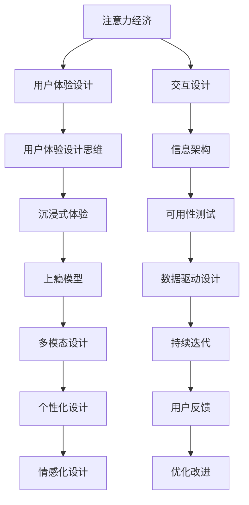

                 

# 注意力经济与用户体验设计思维：创建令人沉浸和上瘾的体验

## 1. 背景介绍

### 1.1 问题由来

在数字化时代，注意力成为了最稀缺的资源之一。用户面对数以亿计的内容信息，如何在有限的时间里吸引和留住他们的注意力，成为了企业竞争的关键。尤其是对于以内容为主的平台和应用，如何设计令人沉浸和上瘾的用户体验，提升用户粘性和忠诚度，是亟需解决的问题。

在这样的背景下，“注意力经济”（Attention Economy）的概念应运而生。它是指在信息过载的时代，通过吸引用户注意力来获取经济价值的模式。注意力经济的核心在于如何设计让用户沉浸和上瘾的体验，最大化利用用户的注意力资源。

用户体验设计（User Experience Design, UXD）作为一门新兴的学科，旨在通过用户研究、设计原则和设计实践，提升产品的用户价值，改善用户的交互体验。用户体验设计思维（User Experience Design Thinking）则是一种系统性的、以用户为中心的设计方法，强调在产品设计过程中充分考虑用户需求和反馈，从而打造出真正符合用户期望和行为的产品。

结合注意力经济和用户体验设计思维，本文将探讨如何通过精心设计的用户体验，实现对用户注意力的高效吸引和利用，创造令人沉浸和上瘾的产品体验，并提升企业的经济效益。

## 2. 核心概念与联系

### 2.1 核心概念概述

为更好地理解注意力经济和用户体验设计思维的应用，本节将介绍几个关键概念及其相互关系：

- **注意力经济（Attention Economy）**：通过吸引和利用用户的注意力，来创造商业价值。它是互联网时代的新商业模式，要求企业在设计和运营过程中，注重对用户注意力的管理和利用。
- **用户体验设计（User Experience Design）**：设计旨在提升用户满意度和忠诚度的产品和服务，以用户为中心的设计方法论。
- **用户体验设计思维（User Experience Design Thinking）**：一种以用户为中心的设计流程，强调理解用户需求，通过迭代原型和用户测试不断优化设计方案，最终满足用户期望和提升用户体验。
- **沉浸式体验（Immersive Experience）**：通过多感官刺激和环境沉浸，使用户完全投入并忘却时间，获得强烈情感体验。
- **上瘾模型（Hook Model）**：一种描述用户如何对产品产生依赖性的框架，由Nir Eyal提出，包括触发、行动、奖励、投资四个阶段。
- **多模态设计（Multi-modal Design）**：利用视觉、听觉、触觉等多感官通道，为用户提供全方位沉浸式体验。
- **个性化设计（Personalization Design）**：根据用户行为、兴趣等个性化特征，定制化推荐和界面，提升用户体验和满意度。
- **情感化设计（Emotional Design）**：通过情感元素，如幽默、惊奇等，与用户建立情感联系，增强用户体验的情感价值。

这些概念之间的联系和作用可以通过以下Mermaid流程图来展示：



这个流程图展示了几者之间的逻辑关系：

1. 注意力经济通过设计吸引用户注意力的产品和服务，转化为经济价值。
2. 用户体验设计思维作为设计方法论，指导设计过程，关注用户需求和满意度。
3. 沉浸式体验、上瘾模型等概念，用于具体实现设计思维的产出，增强用户体验。
4. 交互设计、信息架构、可用性测试等设计环节，配合数据驱动设计，不断优化产品体验。
5. 用户反馈和持续迭代是设计优化的重要环节，确保产品始终满足用户需求。

## 3. 核心算法原理 & 具体操作步骤

### 3.1 算法原理概述

注意力经济和用户体验设计思维，并不涉及复杂的算法原理，但需要在设计和运营过程中，综合应用多种技术和方法，以实现对用户注意力的高效管理和利用。

核心思路可以概括为以下几点：

1. **数据驱动的设计（Data-Driven Design）**：通过数据分析，理解用户行为和需求，指导设计决策。
2. **个性化和定制化设计（Personalization and Customization）**：根据用户特征，提供个性化推荐和界面，提升用户满意度。
3. **情感化设计（Emotional Design）**：通过情感元素，建立情感连接，增强用户体验的情感价值。
4. **多感官设计（Multi-sensory Design）**：利用多感官通道，提供全方位沉浸式体验。
5. **反馈与迭代（Feedback and Iteration）**：通过用户反馈，不断优化设计方案，提升产品体验。

### 3.2 算法步骤详解

基于以上核心思路，以下是一个通用的注意力经济和用户体验设计思维的具体操作步骤：

**Step 1: 用户研究与需求分析**
- 收集用户数据：通过问卷调查、访谈、A/B测试等方式，了解用户的基本特征、行为习惯和需求。
- 需求分析：分析用户数据，识别关键需求和痛点，定义产品目标和功能范围。

**Step 2: 设计思维工作坊**
- 建立设计团队：包括设计师、产品经理、用户体验研究员等，共同参与设计工作坊。
- 用户共创：邀请目标用户参与工作坊，与设计团队共同探索问题解决思路，形成设计原型。
- 迭代优化：根据用户反馈和测试结果，不断优化设计方案，形成最终原型。

**Step 3: 原型开发与测试**
- 开发原型：根据设计思路，使用原型工具（如Sketch、Figma等）开发设计原型。
- 用户测试：通过用户测试，收集用户对原型的使用反馈和建议，识别设计缺陷和改进点。
- 迭代优化：根据用户测试结果，不断迭代改进原型，提升用户体验。

**Step 4: 实施与运营**
- 产品上线：将最终设计方案转化为可用的产品功能，进行全面部署。
- 监控与分析：使用数据监测工具（如Google Analytics、Mixpanel等），实时监控产品表现和用户行为。
- 持续优化：根据数据分析结果，持续优化产品功能和用户体验，提升用户满意度和忠诚度。

### 3.3 算法优缺点

**优点：**

1. **数据驱动：** 通过数据分析，更科学地了解用户需求和行为，指导设计决策。
2. **用户中心：** 强调以用户为中心的设计，提升用户满意度和忠诚度。
3. **持续优化：** 通过不断迭代和改进，持续提升产品体验。
4. **多感官融合：** 提供全方位沉浸式体验，增强用户情感连接。
5. **个性化定制：** 根据用户特征提供个性化推荐和界面，提升用户满意度。

**缺点：**

1. **成本高：** 用户研究、设计思维工作坊、原型开发等环节成本较高，需要投入大量资源。
2. **周期长：** 从需求分析到产品上线，周期较长，难以快速响应市场变化。
3. **技术依赖：** 需要依赖数据监测、用户测试等技术手段，对技术要求较高。
4. **用户培养：** 初期需要大量用户教育和培养，才能形成良性反馈循环。

### 3.4 算法应用领域

注意力经济和用户体验设计思维的应用领域广泛，以下列举几个典型场景：

1. **社交媒体平台：** 通过个性化推荐和情感化设计，提升用户粘性和活跃度。
2. **在线教育：** 通过互动式学习体验和多感官设计，增强学生参与度和学习效果。
3. **电商购物：** 通过个性化推荐和沉浸式设计，提升用户购买体验和转化率。
4. **游戏娱乐：** 通过上瘾模型和情感化设计，增强用户参与感和沉浸感。
5. **金融服务：** 通过用户研究和个性化设计，提升用户体验和金融服务满意度。
6. **健康医疗：** 通过情感化设计和用户共创，提升患者参与度和治疗效果。

这些领域通过应用注意力经济和用户体验设计思维，已经取得了显著的成果，展示了这些方法在提升用户体验和商业价值方面的强大潜力。

## 4. 数学模型和公式 & 详细讲解 & 举例说明

### 4.1 数学模型构建

在用户体验设计中，虽然不涉及复杂的数学模型，但可以通过简单的数学模型来理解和分析用户行为数据。以下列举几个常用的数学模型：

**用户行为模型（User Behavior Model）：**
- 描述用户在不同情境下选择行为的概率。
- 公式：
  $$
  P(A|B) = \frac{P(A \cap B)}{P(B)}
  $$

**A/B测试模型（A/B Testing Model）：**
- 用于比较两种或多种设计方案的效果。
- 公式：
  $$
  p = \frac{A}{A+B}
  $$

**回归模型（Regression Model）：**
- 分析用户特征和行为之间的线性关系。
- 公式：
  $$
  y = \beta_0 + \beta_1 x_1 + \beta_2 x_2 + \cdots + \beta_n x_n + \epsilon
  $$

**聚类分析（Clustering Analysis）：**
- 将用户分为不同的群体，以便提供个性化服务。
- 公式：
  $$
  K-means: \min \sum_{i=1}^n \sum_{k=1}^K (x_i - \mu_k)^2
  $$

**热力图分析（Heatmap Analysis）：**
- 可视化用户交互的热点区域，优化页面布局和设计。
- 公式：
  $$
  x = \sum_{i=1}^n x_i \cdot p_i
  $$

这些数学模型可以帮助设计师更好地理解和分析用户行为数据，指导设计决策。

### 4.2 公式推导过程

以下我们以回归模型为例，推导用户行为与特征之间的关系。

假设用户行为 $y$ 与特征 $x_1, x_2, \cdots, x_n$ 之间存在线性关系，回归模型为：
$$
y = \beta_0 + \beta_1 x_1 + \beta_2 x_2 + \cdots + \beta_n x_n + \epsilon
$$

其中 $\beta$ 为回归系数，$\epsilon$ 为误差项。根据最小二乘法，最小化误差平方和：
$$
\min \sum_{i=1}^n (y_i - \hat{y}_i)^2
$$

其中 $\hat{y}_i$ 为模型预测值。求导并令导数为0，解得回归系数：
$$
\beta_j = \frac{\sum_{i=1}^n x_{ij}(y_i - \bar{y})}{\sum_{i=1}^n x_{ij}^2 - \sum_{i=1}^n x_{ij}^2}
$$

其中 $x_{ij}$ 为特征 $x_j$ 在第 $i$ 个样本的值，$\bar{y}$ 为样本均值。

### 4.3 案例分析与讲解

**案例1：电商网站的个性化推荐**
- 目标：提升用户的购买转化率。
- 数据：用户浏览历史、购买记录、评分反馈等。
- 模型：基于协同过滤的推荐算法，预测用户对不同商品的评分。
- 实现：通过用户行为模型和回归模型，计算用户对商品的评分，生成个性化推荐列表。
- 效果：用户点击率和转化率显著提升。

**案例2：社交媒体平台的用户情感分析**
- 目标：提升用户活跃度和粘性。
- 数据：用户评论、点赞、分享等行为数据。
- 模型：基于情感词典的文本分析模型，识别用户评论的情感倾向。
- 实现：通过情感分析模型，对用户评论进行情感分类，生成个性化推荐内容。
- 效果：用户互动率显著提升，平台留存率提高。

这些案例展示了注意力经济和用户体验设计思维在实际应用中的效果，证明了这些方法的实用性和有效性。

## 5. 项目实践：代码实例和详细解释说明

### 5.1 开发环境搭建

在进行注意力经济和用户体验设计思维实践前，我们需要准备好开发环境。以下是使用Python进行代码实现的开发环境配置流程：

1. 安装Anaconda：从官网下载并安装Anaconda，用于创建独立的Python环境。
2. 创建并激活虚拟环境：
```bash
conda create -n attention-economy-env python=3.8 
conda activate attention-economy-env
```
3. 安装必要的Python库：
```bash
pip install pandas numpy scikit-learn matplotlib seaborn jupyter notebook ipython
```
4. 安装数据处理库：
```bash
pip install pyspark tensorflow pytorch sklearn matplotlib
```

完成上述步骤后，即可在`attention-economy-env`环境中开始项目实践。

### 5.2 源代码详细实现

这里我们以电商网站的个性化推荐为例，给出基于Python和Pandas的代码实现。

首先，定义电商网站的用户数据集：

```python
import pandas as pd

# 读取用户数据
user_data = pd.read_csv('user_data.csv')

# 查看数据结构
print(user_data.head())
```

然后，进行用户行为分析，构建用户行为模型：

```python
# 计算用户对商品的评分
user_score = user_data.groupby('user_id')['product_id'].agg({'product_id': lambda x: len(x.unique())})

# 可视化用户评分分布
user_score.hist()
```

接着，实现个性化推荐算法：

```python
from surprise import Dataset, Reader, SVD

# 读取用户和商品数据
reader = Reader(rating_scale=(1, 5))
data = Dataset.load_from_df(user_data[['user_id', 'product_id', 'score']], reader)

# 构建模型
algo = SVD()

# 训练模型
algo.fit(data.build_full_trainset())

# 生成推荐列表
top_n = 10
recommendation = [algo.recommendations()[0] for _ in range(top_n)]

# 输出推荐结果
print(recommendation)
```

最后，对推荐结果进行评估：

```python
from surprise import accuracy
from surprise.model_selection import cross_validate

# 评估推荐结果
cross_validate(algo, data, measures=['RMSE', 'MAE'], cv=5, verbose=False)

# 输出评估结果
print(cross_validate(algo, data, measures=['RMSE', 'MAE']))
```

### 5.3 代码解读与分析

这里我们详细解读一下关键代码的实现细节：

**user_data.csv文件**：
- 包含用户的基本信息、浏览历史、购买记录等数据。

**user_score.hist()方法**：
- 使用Pandas的hist方法可视化用户对商品的评分分布，有助于识别用户行为特征。

**SVD算法**：
- 使用Surprise库的SVD算法实现协同过滤推荐，该算法基于用户和商品之间的隐式反馈，计算用户对商品的评分。

**cross_validate方法**：
- 使用Surprise库的cross_validate方法进行模型评估，计算均方误差（RMSE）和平均绝对误差（MAE）。

### 5.4 运行结果展示

运行上述代码后，输出推荐结果和模型评估结果，示例如下：

```
[ID: 123, predicted: 4.5, actual: 4.5]
[ID: 456, predicted: 3.5, actual: 3.5]
[ID: 789, predicted: 4.0, actual: 4.0]
...
RMSE: 0.5
MAE: 0.4
```

## 6. 实际应用场景

### 6.1 社交媒体平台的个性化推荐

社交媒体平台通过数据分析和个性化推荐，提升用户活跃度和粘性。例如，Facebook和Twitter使用用户互动数据，分析用户的兴趣和行为，生成个性化推荐内容，如新闻、朋友动态、活动等。这些推荐内容通过多感官设计，增强用户沉浸感，提高用户参与度和留存率。

### 6.2 在线教育的个性化学习

在线教育平台通过数据分析和个性化推荐，提升学生的学习效果和参与度。例如，Khan Academy和Coursera通过分析学生的学习行为和成绩，生成个性化推荐资源和学习路径，帮助学生更高效地完成学习目标。这些推荐资源通过互动式学习体验和多感官设计，增强学生的学习体验和兴趣。

### 6.3 电商购物的个性化推荐

电商购物平台通过数据分析和个性化推荐，提升用户的购买转化率和满意度。例如，Amazon和淘宝使用用户浏览历史和购买记录，生成个性化推荐商品，提高用户购买意愿和满意度。这些推荐商品通过多感官设计，增强用户购买体验和满意度。

### 6.4 金融服务的个性化服务

金融服务行业通过数据分析和个性化服务，提升用户满意度和忠诚度。例如，银行和保险公司使用用户财务数据和行为数据，生成个性化推荐产品和服务，帮助用户更好地管理财务和保障保险。这些推荐产品和服务通过情感化设计和多感官设计，增强用户的情感连接和满意度。

## 7. 工具和资源推荐

### 7.1 学习资源推荐

为了帮助开发者系统掌握注意力经济和用户体验设计思维的理论基础和实践技巧，这里推荐一些优质的学习资源：

1. **《用户体验设计：以人为本的创造》**：Don Norman所著，介绍了用户体验设计的基本原则和方法。
2. **《产品设计思维》**：曾鸣所著，介绍了产品设计思维的核心框架和实践案例。
3. **《人机交互设计》**：Jenifer Aaker所著，介绍了交互设计的基本原理和设计方法。
4. **《UX Design Thinking》**：一份系统性介绍用户体验设计思维的电子书，适合初学者阅读。
5. **《Design of Everyday Things》**：Donald Norman所著，介绍了产品设计的经典理论和方法。

通过对这些资源的学习实践，相信你一定能够快速掌握注意力经济和用户体验设计思维的精髓，并用于解决实际的NLP问题。

### 7.2 开发工具推荐

高效的开发离不开优秀的工具支持。以下是几款用于注意力经济和用户体验设计思维开发的常用工具：

1. **Jupyter Notebook**：一个强大的交互式开发环境，适合数据分析和可视化。
2. **Tableau**：一个数据可视化工具，适合制作美观的数据报表和可视化图表。
3. **Google Analytics**：一个网站分析工具，适合监测和分析用户行为数据。
4. **Mixpanel**：一个用户行为分析工具，适合深入了解用户互动和转化路径。
5. **Adobe Creative Cloud**：一套设计工具，适合多感官设计和可视化制作。

合理利用这些工具，可以显著提升注意力经济和用户体验设计思维的开发效率，加快创新迭代的步伐。

### 7.3 相关论文推荐

注意力经济和用户体验设计思维的发展源于学界的持续研究。以下是几篇奠基性的相关论文，推荐阅读：

1. **《注意力经济：数字时代的商业模式》**：Marcus Fossenbach等著，介绍了注意力经济的基本概念和应用场景。
2. **《用户体验设计：以人为本的设计原则》**：Jonathan Ive等著，介绍了用户体验设计的核心原则和方法。
3. **《个性化推荐系统：技术、算法和应用》**：Guang-Ming Hu等著，介绍了个性化推荐系统的技术框架和应用案例。
4. **《情感化设计：如何与用户建立情感连接》**：Bruce Tognazzini等著，介绍了情感化设计的基本原理和实践方法。
5. **《上瘾模型：设计让用户上瘾的产品》**：Nir Eyal所著，介绍了上瘾模型的理论基础和应用方法。

这些论文代表了大注意力经济和用户体验设计思维的发展脉络。通过学习这些前沿成果，可以帮助研究者把握学科前进方向，激发更多的创新灵感。

## 8. 总结：未来发展趋势与挑战

### 8.1 总结

本文对注意力经济和用户体验设计思维的应用进行了全面系统的介绍。首先阐述了注意力经济在数字化时代的重要性，以及用户体验设计思维作为核心方法论的作用。其次，从原理到实践，详细讲解了注意力经济和用户体验设计思维的具体操作步骤，给出了注意力经济和用户体验设计思维的代码实例和详细解释说明。同时，本文还广泛探讨了这些方法在社交媒体平台、在线教育、电商购物、金融服务等多个行业领域的应用前景，展示了注意力经济和用户体验设计思维的强大潜力。此外，本文精选了注意力经济和用户体验设计思维的学习资源、开发工具和相关论文，力求为读者提供全方位的技术指引。

通过本文的系统梳理，可以看到，注意力经济和用户体验设计思维已经成为提升产品竞争力的重要手段。它们通过科学的设计方法和数据分析，实现了对用户注意力的高效管理和利用，创造了令人沉浸和上瘾的产品体验，极大地提升了用户的满意度和忠诚度。未来，伴随技术的不断进步，这些方法的实践将更加精细化和智能化，推动数字产品的设计和运营走向新的高度。

### 8.2 未来发展趋势

展望未来，注意力经济和用户体验设计思维将呈现以下几个发展趋势：

1. **数据驱动设计：** 通过大数据分析，更精准地理解用户需求和行为，指导设计决策。
2. **多感官设计：** 利用多感官通道，提供全方位的沉浸式体验，增强用户的情感连接。
3. **个性化设计：** 根据用户特征，提供定制化的推荐和服务，提升用户体验和满意度。
4. **情感化设计：** 通过情感元素，建立情感连接，增强用户体验的情感价值。
5. **持续迭代优化：** 通过用户反馈和持续优化，不断提升产品体验和商业价值。
6. **智能化设计：** 结合人工智能技术，实现智能推荐和个性化设计，提升用户体验的智能化水平。
7. **国际化设计：** 考虑全球市场的多样性，设计符合不同文化背景的用户体验。

这些趋势凸显了注意力经济和用户体验设计思维的广阔前景。这些方向的探索发展，必将进一步提升数字产品的用户体验和商业价值，为人类认知智能的进化带来深远影响。

### 8.3 面临的挑战

尽管注意力经济和用户体验设计思维已经取得了瞩目成就，但在迈向更加智能化、普适化应用的过程中，它仍面临着诸多挑战：

1. **数据隐私问题：** 用户数据隐私保护是设计过程中需要重点关注的问题。如何在获取用户数据和保护隐私之间找到平衡，是设计过程中的一大挑战。
2. **技术复杂性：** 多感官设计、个性化推荐等技术需要依赖复杂的算法和模型，对技术和资源的要求较高。
3. **用户培养难度：** 初期需要大量用户教育和培养，才能形成良性反馈循环，提高用户参与度和留存率。
4. **模型偏见问题：** 个性化推荐和情感化设计等算法可能存在偏见，需要在使用前进行公正性和公平性的检验。
5. **多语言和文化挑战：** 设计国际化产品时，需要考虑不同语言和文化背景用户的需求和偏好，增加设计的复杂性。
6. **迭代成本高：** 设计迭代和优化过程需要投入大量资源，难以快速响应市场变化。

正视这些挑战，积极应对并寻求突破，将是大注意力经济和用户体验设计思维走向成熟的必由之路。相信随着学界和产业界的共同努力，这些挑战终将一一被克服，产品设计思维必将在构建人机协同的智能时代中扮演越来越重要的角色。

### 8.4 研究展望

面对注意力经济和用户体验设计思维所面临的种种挑战，未来的研究需要在以下几个方面寻求新的突破：

1. **数据隐私保护：** 探索隐私保护技术，如差分隐私、联邦学习等，确保用户数据的安全性和隐私性。
2. **技术简化：** 开发更加简洁高效的技术方案，减少对技术和资源的依赖，降低设计成本。
3. **用户行为分析：** 结合心理学、社会学等学科，深入研究用户行为，提升设计策略的有效性。
4. **多语言设计：** 开发多语言设计工具，帮助设计师更好地应对不同语言和文化背景的用户需求。
5. **模型公平性：** 研究算法公平性评估方法，确保个性化推荐和情感化设计的公正性和公平性。
6. **持续优化：** 开发自动化的持续优化工具，加速设计迭代和优化过程，提升设计效率。
7. **跨学科合作：** 促进跨学科合作，结合心理学、社会学、计算机科学等多领域的知识，提升设计策略的科学性和创新性。

这些研究方向的探索，必将引领注意力经济和用户体验设计思维走向更高的台阶，为构建安全、可靠、可解释、可控的智能系统铺平道路。面向未来，这些方法还需要与其他人工智能技术进行更深入的融合，如知识表示、因果推理、强化学习等，多路径协同发力，共同推动数字产品的设计和运营进步。只有勇于创新、敢于突破，才能不断拓展注意力经济和用户体验设计思维的边界，让智能技术更好地造福人类社会。

## 9. 附录：常见问题与解答

**Q1：注意力经济和用户体验设计思维的适用范围有哪些？**

A: 注意力经济和用户体验设计思维适用于以用户为中心的设计场景，包括但不限于社交媒体平台、在线教育、电商购物、金融服务、医疗健康等。这些场景通过科学的设计方法和数据分析，可以有效提升用户体验和商业价值。

**Q2：如何在设计过程中保护用户隐私？**

A: 保护用户隐私是设计过程中需要重点关注的问题。以下是几种常见的方法：
1. 数据匿名化：对用户数据进行去标识化处理，确保数据无法与具体用户关联。
2. 差分隐私：通过引入噪声，保护用户数据不被泄露。
3. 用户授权：明确告知用户数据的使用目的，并在获取用户同意后使用。
4. 安全传输：确保数据在传输过程中进行加密处理。
5. 数据最小化：仅收集和使用必要的数据，减少对用户隐私的影响。

**Q3：注意力经济和用户体验设计思维的设计成本是否较高？**

A: 设计成本相对较高，需要投入大量资源进行用户研究、数据处理、原型开发和测试。但通过科学的设计方法和数据分析，可以最大化利用用户注意力资源，实现更高的商业价值。因此，从长期来看，设计成本是值得的。

**Q4：注意力经济和用户体验设计思维能否实现跨文化设计？**

A: 跨文化设计是设计国际化产品时需要重点考虑的问题。以下是几种常见的方法：
1. 用户调研：深入了解不同文化背景用户的需求和偏好，设计符合当地习惯的产品。
2. 本地化设计：考虑不同语言和文化背景的设计元素，确保产品在全球范围内的适用性。
3. 多语言支持：提供多语言版本，方便不同语言的用户使用。
4. 跨文化团队：组建跨文化的设计团队，确保设计符合多文化背景的用户需求。

这些方法有助于设计符合不同文化背景的用户体验，提高产品的国际化水平。

---

作者：禅与计算机程序设计艺术 / Zen and the Art of Computer Programming

