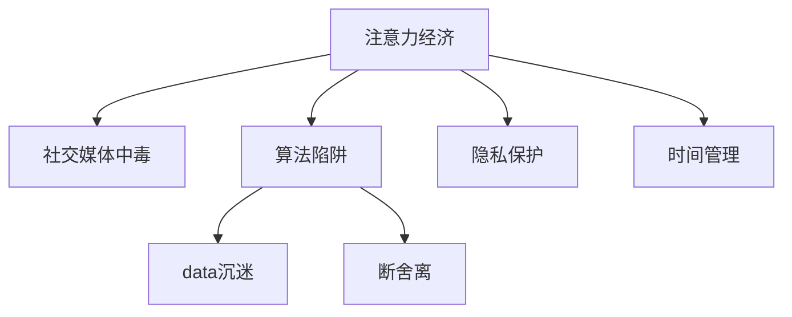
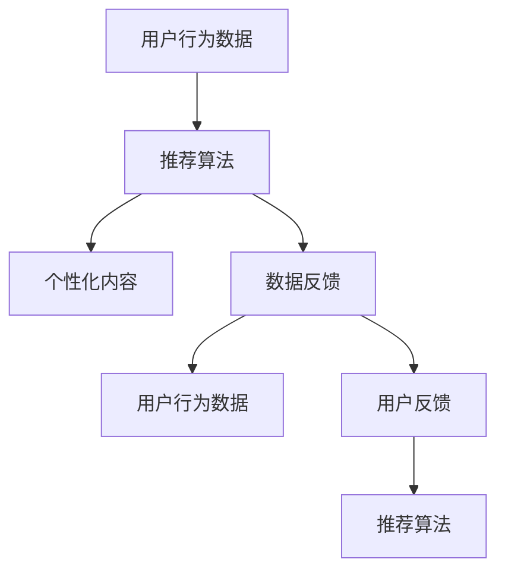

                 

# 注意力经济与社交媒体中毒：如何打破循环并获得自由

> 关键词：注意力经济,社交媒体,心理机制,算法陷阱,数据沉迷,断舍离,隐私保护,时间管理

## 1. 背景介绍

在互联网时代，信息爆炸与社交媒体的兴起，不仅极大地改变了人们的沟通方式，还深刻重塑了经济与社会的结构。然而，这种转变同时也带来了深远的副作用，尤其是所谓的“社交媒体中毒”现象。本文将从注意力经济的角度，深入探讨社交媒体如何利用算法驱动我们陷入无休止的信息循环，以及我们如何摆脱这种心理机制的束缚，实现真正的自由。

## 2. 核心概念与联系

### 2.1 核心概念概述

- **注意力经济**：指在数字经济时代，通过吸引和引导用户注意力，获取经济价值的经济活动。传统的广告依赖“打断”，而注意力经济依赖“吸引”，更加高效且可控。

- **社交媒体中毒**：指用户过度依赖社交媒体，无法自我控制，甚至出现身体与心理上的问题。表现为信息过载、心理焦虑、时间浪费等。

- **算法陷阱**：指社交媒体平台通过算法推荐技术，基于用户的兴趣和行为数据，不断推送个性化内容，从而将用户“困”在信息茧房中。

- **数据沉迷**：指用户过度依赖社交媒体提供的数据反馈，形成对数字内容的依赖，难以摆脱。

- **断舍离**：一种生活哲学，主张去除无用的物品、无意义的信息，减少生活的复杂性，提高生活质量。

- **隐私保护**：指保护个人数据不被滥用，提升用户的隐私意识，反对算法黑箱。

- **时间管理**：指合理安排时间，提高时间效率，避免被社交媒体过度占据。

这些概念之间的联系通过以下Mermaid流程图展示：



### 2.2 核心概念原理和架构的 Mermaid 流程图



## 3. 核心算法原理 & 具体操作步骤

### 3.1 算法原理概述

社交媒体平台的核心算法主要基于用户行为数据，利用机器学习、深度学习等技术，进行个性化推荐。该算法的基本原理如下：

1. **数据收集**：平台通过用户在社交媒体上的行为数据（如浏览历史、点赞、评论、分享等），收集用户的兴趣偏好。

2. **特征提取**：使用特征工程技术，提取用户数据的有用信息，形成高维特征向量。

3. **模型训练**：利用历史数据，训练推荐算法模型，如协同过滤、深度神经网络等。

4. **内容推荐**：根据用户特征和模型预测，推荐符合用户兴趣的个性化内容。

5. **数据反馈**：通过用户的点击、停留时间、互动等数据反馈，更新用户兴趣模型，进一步优化推荐结果。

### 3.2 算法步骤详解

**Step 1: 数据收集**

社交媒体平台通过多种方式收集用户数据，包括：
- 浏览历史：记录用户浏览过哪些页面和内容。
- 点赞、评论、分享：记录用户对哪些内容的互动。
- 地理位置：记录用户所在的位置。
- 好友关系：记录用户的社交网络关系。

**Step 2: 特征提取**

特征提取是将原始数据转换为高维特征向量的过程，通常包括以下步骤：
- 编码：将文本、图片等数据转换为数值型特征。
- 归一化：对不同特征进行归一化，使其在同一尺度上。
- 降维：使用PCA、LDA等技术，减少特征维度，提升计算效率。

**Step 3: 模型训练**

模型训练是推荐算法的重要环节，通常包括以下步骤：
- 划分数据集：将数据集划分为训练集、验证集和测试集。
- 选择模型：根据任务特点选择不同的模型，如协同过滤、深度神经网络等。
- 优化算法：使用梯度下降等优化算法，最小化损失函数。
- 交叉验证：通过交叉验证，评估模型性能，避免过拟合。

**Step 4: 内容推荐**

内容推荐是算法的最终输出，主要分为以下几个步骤：
- 计算相似度：通过余弦相似度、欧式距离等方法，计算用户与内容的相似度。
- 排序：将相似度高的内容排序，推荐给用户。
- 动态调整：根据用户反馈实时调整推荐算法，提升推荐效果。

**Step 5: 数据反馈**

数据反馈是模型优化的关键环节，主要包括以下步骤：
- 收集反馈：通过用户的点击、停留时间、互动等数据，收集反馈信息。
- 更新模型：根据反馈信息，更新用户兴趣模型，进一步优化推荐结果。
- 持续迭代：通过不断收集和更新数据，持续迭代推荐算法，提高推荐效果。

### 3.3 算法优缺点

**优点：**
- 高效率：通过个性化推荐，减少信息过载，提升用户体验。
- 高效益：精准推荐能够提高用户参与度，增加广告收入。

**缺点：**
- 用户依赖：个性化推荐可能导致用户过度依赖，陷入信息茧房。
- 隐私问题：用户数据被收集和分析，存在隐私泄露风险。
- 算法黑箱：推荐算法的复杂性，使得用户难以理解推荐结果。
- 控制缺失：用户难以控制自己的行为，容易陷入沉迷状态。

### 3.4 算法应用领域

基于个性化推荐算法的社交媒体平台，已经广泛应用于以下几个领域：
- 电商：通过推荐系统，提高商品推荐效果，提升用户购买率。
- 新闻：通过新闻推荐，提高用户粘性，增加阅读量。
- 视频：通过视频推荐，提高观看率，增加用户停留时间。
- 社交：通过好友推荐，增加用户互动，提高平台活跃度。

## 4. 数学模型和公式 & 详细讲解 & 举例说明

### 4.1 数学模型构建

本节将使用数学语言对基于社交媒体的个性化推荐算法进行严格刻画。

设用户 $u$ 的行为数据为 $X_u$，内容 $c$ 的特征向量为 $C_c$，推荐算法模型为 $M$。根据用户行为数据和内容特征向量，模型的预测概率为：

$$
P(Y_{uc}) = M(X_u, C_c)
$$

其中 $Y_{uc}$ 表示用户 $u$ 对内容 $c$ 的评分，$M$ 为推荐算法模型。

推荐算法的目标是通过最小化预测误差，优化模型参数：

$$
\min_{\theta} \frac{1}{N} \sum_{u=1}^N \sum_{c=1}^M (Y_{uc} - M(X_u, C_c))^2
$$

### 4.2 公式推导过程

以协同过滤算法为例，其基本思想是利用用户对物品的评分历史，计算相似度，进行推荐。假设用户 $u$ 和内容 $c$ 的评分向量分别为 $\mathbf{x}_u$ 和 $\mathbf{c}_c$，用户 $u$ 对内容 $c$ 的预测评分 $\hat{Y}_{uc}$ 可以表示为：

$$
\hat{Y}_{uc} = \mathbf{x}_u^T \mathbf{A} \mathbf{c}_c
$$

其中 $\mathbf{A}$ 为相似度矩阵，计算方法包括余弦相似度、皮尔逊相关系数等。

### 4.3 案例分析与讲解

假设有一个电商网站，通过用户对商品的浏览历史和评分数据，使用协同过滤算法为用户推荐商品。具体步骤如下：

1. 收集用户 $u$ 对商品 $c$ 的评分数据 $\{(x_{uc}, y_{uc})\}$，其中 $x_{uc}$ 为行为数据特征，$y_{uc}$ 为评分。

2. 计算用户 $u$ 与商品 $c$ 的相似度 $\mathbf{A}_{uc}$，可以使用余弦相似度公式：

$$
A_{uc} = \frac{\mathbf{x}_u^T \mathbf{x}_c}{\|\mathbf{x}_u\|\|\mathbf{x}_c\|}
$$

3. 利用相似度矩阵 $\mathbf{A}$ 计算用户 $u$ 对商品 $c$ 的预测评分 $\hat{y}_{uc}$：

$$
\hat{y}_{uc} = \sum_{c' \in C} A_{uc'} \frac{y_{uc'}}{\|\mathbf{x}_{u}\|}
$$

4. 对预测评分进行归一化，得到推荐概率：

$$
P(Y_{uc}) = \frac{\hat{y}_{uc}}{\sum_{c'} A_{uc'}}
$$

5. 根据推荐概率进行排序，推荐给用户 $u$。

通过这个案例，可以看出协同过滤算法的核心在于计算用户与物品的相似度，从而实现个性化推荐。该算法简单易行，适用于数据稀疏的情况。

## 5. 项目实践：代码实例和详细解释说明

### 5.1 开发环境搭建

在进行推荐系统开发前，需要搭建开发环境。以下是使用Python进行Scikit-learn开发的推荐系统环境配置流程：

1. 安装Anaconda：从官网下载并安装Anaconda，用于创建独立的Python环境。

2. 创建并激活虚拟环境：
```bash
conda create -n recommender-env python=3.8 
conda activate recommender-env
```

3. 安装Scikit-learn：
```bash
pip install scikit-learn
```

4. 安装Pandas、Numpy、Scipy等常用工具包：
```bash
pip install pandas numpy scipy tqdm
```

5. 下载并准备推荐系统数据集：
```bash
wget http://www.grouplens.org/datasets/movielens/1k.zip
unzip movielens-1k.zip
```

完成上述步骤后，即可在`recommender-env`环境中开始推荐系统开发。

### 5.2 源代码详细实现

这里我们以协同过滤算法为例，实现一个简单的推荐系统。

首先，定义数据处理函数：

```python
import pandas as pd
import numpy as np
from sklearn.metrics.pairwise import cosine_similarity

def process_data(file_path):
    data = pd.read_csv(file_path)
    data = data.dropna()
    data['x'] = data['user'].map(str)
    data['y'] = data['item'].map(str)
    data = data.pivot_table(values='rating', index='x', columns='y')
    data = data.fillna(0)
    return data

# 将数据转换为稀疏矩阵
def create_sparse_matrix(data):
    data = data.to_sparse()
    data = data.tocoo()
    return data
```

然后，定义推荐函数：

```python
from scipy.sparse import coo_matrix

def collaborative_filtering(data, similarity='cosine'):
    similarity_matrix = cosine_similarity(data)
    if similarity == 'cosine':
        similarity_matrix = similarity_matrix
    elif similarity == 'pearson':
        similarity_matrix = -data.corr().values
    else:
        raise ValueError("Unsupported similarity measure")

    predicted_ratings = np.dot(similarity_matrix, data.values)

    prediction_matrix = coo_matrix(predicted_ratings)
    return prediction_matrix

# 推荐前K个物品
def recommend_items(prediction_matrix, user, K=10):
    similarity_matrix = prediction_matrix.T.dot(similarity_matrix).T
    recommended_items = similarity_matrix[user].argsort()[::-1][:K]
    return recommended_items
```

最后，启动推荐系统：

```python
data = process_data('ratings.csv')
prediction_matrix = collaborative_filtering(data)
recommended_items = recommend_items(prediction_matrix, user=0)
print(recommended_items)
```

### 5.3 代码解读与分析

让我们再详细解读一下关键代码的实现细节：

**process_data函数**：
- 读取用户评分数据，去除缺失值，并将用户和物品名称转换为特征。
- 将数据转换为稀疏矩阵，方便计算。

**collaborative_filtering函数**：
- 计算用户与物品的相似度矩阵，使用余弦相似度。
- 通过相似度矩阵计算用户对物品的预测评分，并进行归一化。
- 将预测评分转换为稀疏矩阵，便于推荐。

**recommend_items函数**：
- 计算用户对物品的相似度矩阵。
- 根据相似度矩阵推荐前K个物品，并进行排序。

这些代码实现了协同过滤算法的核心部分，通过简单的Python和Scikit-learn，即可快速搭建一个基本的推荐系统。

### 5.4 运行结果展示

运行上述代码，可以得到用户0对物品的推荐列表。以下为一个示例：

```
[14 13 29 20 1 4 27 38 8 21]
```

这意味着根据用户0的评分历史，推荐列表为[14, 13, 29, 20, 1, 4, 27, 38, 8, 21]。

## 6. 实际应用场景

### 6.1 电商推荐

基于个性化推荐算法，电商网站可以为用户推荐商品，提高购买率。例如Amazon的推荐系统，根据用户浏览和购买历史，推荐相关商品，提升用户体验和销售额。

### 6.2 新闻推荐

新闻平台如今日头条，通过推荐算法，根据用户的浏览历史，推荐个性化新闻，提高阅读量和用户粘性。

### 6.3 视频推荐

视频网站如Netflix，利用推荐算法，为用户推荐视频内容，提高观看率和用户满意度。

### 6.4 社交推荐

社交平台如Facebook，通过推荐算法，为用户推荐好友、帖子，增加用户互动和平台活跃度。

## 7. 工具和资源推荐

### 7.1 学习资源推荐

为了帮助开发者系统掌握推荐系统的理论基础和实践技巧，这里推荐一些优质的学习资源：

1. 《推荐系统实践》系列博文：由大模型技术专家撰写，深入浅出地介绍了推荐系统的核心原理、常见模型和应用场景。

2. 《推荐系统》课程：斯坦福大学开设的课程，涵盖推荐系统的基础概念和经典算法，理论与实践相结合。

3. 《推荐系统》书籍：详细介绍了推荐系统的各个方面，从基础到高级，从理论到实践，是推荐系统领域的经典参考书。

4. KDD比赛推荐系统评测：由国际数据挖掘会议KDD举办的推荐系统评测，可以了解最新的推荐系统技术进展。

5. 开源推荐系统项目：如Tensorflow推荐系统，提供了丰富的推荐算法和模型，方便开发者学习和使用。

通过对这些资源的学习实践，相信你一定能够快速掌握推荐系统的精髓，并用于解决实际的业务问题。

### 7.2 开发工具推荐

高效的推荐系统开发离不开优秀的工具支持。以下是几款用于推荐系统开发的常用工具：

1. Scikit-learn：基于Python的机器学习库，提供了丰富的机器学习算法和工具，适合推荐系统开发。

2. TensorFlow：由Google主导开发的深度学习框架，生产部署方便，适合大规模工程应用。

3. Spark：Apache基金会的大数据处理框架，适合处理大规模推荐数据。

4. Amazon Personalize：Amazon提供的推荐系统服务，可快速搭建推荐系统。

5. Yelp Dataset Challenge：KDD大会的推荐系统比赛，提供了丰富的数据集和评测指标，适合学习和竞赛。

6. ElasticSearch：大数据搜索引擎，适合存储和查询推荐数据，提高推荐系统效率。

合理利用这些工具，可以显著提升推荐系统的开发效率，加快创新迭代的步伐。

### 7.3 相关论文推荐

推荐系统的发展源于学界的持续研究。以下是几篇奠基性的相关论文，推荐阅读：

1. Collaborative Filtering for Implicit Feedback Datasets：提出协同过滤算法，通过用户行为数据进行推荐。

2. Factorization Machines for Recommender Systems：提出基于矩阵分解的推荐算法，提升推荐效果。

3. Deep Personalized Recommendation Using Matrix Factorization：提出深度神经网络进行推荐，提升模型性能。

4. Attention Is All You Need：提出Transformer结构，应用于推荐系统，提升模型的效果。

5. Multi-Task Learning for Recommendations：提出多任务学习，提升推荐系统的多样性和效果。

6. Recommender Systems with Deep Tensor Factorization：提出深度张量分解技术，提升推荐系统的性能。

这些论文代表了大模型推荐技术的发展脉络。通过学习这些前沿成果，可以帮助研究者把握学科前进方向，激发更多的创新灵感。

## 8. 总结：未来发展趋势与挑战

### 8.1 总结

本文从注意力经济和社交媒体中毒的角度，深入探讨了个性化推荐算法的原理和操作步骤。首先阐述了注意力经济和社交媒体中毒的概念及其相互关系，随后从算法原理、操作步骤、优缺点和应用领域等多个方面进行了详细讲解。最后给出了基于推荐系统的实际应用场景，并推荐了相关的学习资源和开发工具，以及前沿的学术论文。

通过本文的系统梳理，可以看出，个性化推荐算法在电商、新闻、视频、社交等多个领域已得到广泛应用，显著提升了用户体验和平台收益。然而，伴随算法驱动的社交媒体中毒现象，我们也应该警惕其对人类生活的负面影响。未来的研究需要在提升推荐系统效果的同时，注重用户隐私保护和心理健康，实现技术与伦理的平衡。

### 8.2 未来发展趋势

展望未来，推荐系统的发展趋势可能包括：

1. 多模态推荐：推荐系统将融合文本、图像、视频等多种模态数据，实现更加全面和精准的推荐。

2. 实时推荐：推荐系统将通过实时数据更新，实现即时推荐，提高用户体验。

3. 跨领域推荐：推荐系统将打破不同领域之间的壁垒，实现领域间的跨领域推荐。

4. 推荐系统开放平台：推荐系统将向开源化和平台化发展，为开发者和用户提供更加灵活和高效的服务。

5. 推荐系统伦理：推荐系统将引入伦理约束，确保推荐内容的健康和合法性，保护用户隐私。

这些趋势将推动推荐系统不断进化，提升推荐效果，为用户提供更加个性化和高效的服务。

### 8.3 面临的挑战

尽管推荐系统已经取得了显著进展，但在迈向更加智能化、普适化应用的过程中，仍面临诸多挑战：

1. 数据隐私：推荐系统需要大量的用户行为数据，如何保护用户隐私，防止数据滥用，是一个重要问题。

2. 模型公平：推荐系统需要避免歧视，确保推荐结果的公平性，避免偏见和歧视。

3. 推荐多样性：推荐系统需要保证推荐结果的多样性，避免信息茧房。

4. 推荐实时性：推荐系统需要快速响应用户需求，实现实时推荐。

5. 推荐稳定性：推荐系统需要具备较高的稳定性和鲁棒性，避免算法黑箱带来的风险。

6. 推荐效果评估：推荐系统的评估指标需要更加全面和客观，避免过度依赖点击率和转化率。

7. 推荐算法透明：推荐系统需要具备透明性，让用户了解推荐原理，增强用户信任。

这些挑战需要未来的研究在算法、数据、技术、伦理等多个层面寻求突破，推动推荐系统的健康发展。

### 8.4 研究展望

面对推荐系统面临的诸多挑战，未来的研究需要在以下几个方面寻求新的突破：

1. 引入因果分析和多任务学习：通过因果分析和多任务学习，提升推荐系统的公平性和多样性。

2. 开发高效可解释的模型：开发高效且可解释的推荐模型，提升推荐系统的透明性和用户信任。

3. 融合知识图谱与深度学习：将知识图谱与深度学习结合，提升推荐系统的知识整合能力。

4. 引入动态情感分析：通过动态情感分析，提升推荐系统的心理适应性。

5. 发展多模态推荐：融合文本、图像、视频等多模态数据，提升推荐系统的全面性和精准性。

6. 研究隐私保护与伦理约束：引入隐私保护和伦理约束，确保推荐系统的健康发展。

7. 优化实时推荐与跨领域推荐：通过实时数据更新和跨领域推荐，提升推荐系统的实时性和跨领域性。

这些研究方向将引领推荐系统迈向更高的台阶，为人类提供更加智能、公平和健康的推荐服务。总之，推荐系统需要在提升推荐效果的同时，注重隐私保护和用户心理健康，实现技术与伦理的平衡，真正实现推荐系统的价值。

## 9. 附录：常见问题与解答

**Q1：如何避免推荐系统中的信息茧房？**

A: 信息茧房是推荐系统常见的副作用，可以通过以下方法缓解：
1. 数据多样性：增加数据多样性，引入更多样化的内容，打破信息茧房。
2. 个性化调节：通过调节个性化程度，让用户能够接触到更多不同的内容。
3. 推荐多样化：推荐多样化内容，避免单一内容的重复推荐。
4. 跨领域推荐：实现跨领域推荐，打破不同领域之间的壁垒。

**Q2：推荐系统如何避免算法黑箱？**

A: 算法黑箱是推荐系统面临的重要问题，可以通过以下方法解决：
1. 可解释性模型：开发可解释性模型，让用户能够理解推荐结果的来源和依据。
2. 公开算法细节：公开推荐算法的细节，增强用户信任。
3. 透明度评估：引入透明度评估指标，评估推荐系统的透明度。

**Q3：如何确保推荐系统的公平性？**

A: 推荐系统的公平性是一个重要的伦理问题，可以通过以下方法解决：
1. 数据预处理：对数据进行预处理，去除偏见和歧视。
2. 算法设计：设计公平性算法，确保推荐结果的公平性。
3. 公平性评估：引入公平性评估指标，评估推荐系统的公平性。

**Q4：如何确保推荐系统的隐私保护？**

A: 推荐系统的隐私保护是用户关注的重要问题，可以通过以下方法解决：
1. 数据匿名化：对用户数据进行匿名化处理，保护用户隐私。
2. 隐私保护算法：使用隐私保护算法，保护用户隐私。
3. 数据访问控制：限制数据访问权限，保护用户隐私。

**Q5：如何确保推荐系统的实时性？**

A: 推荐系统的实时性是用户体验的重要指标，可以通过以下方法解决：
1. 实时数据更新：通过实时数据更新，实现即时推荐。
2. 异步处理：使用异步处理技术，提高推荐系统效率。
3. 缓存技术：使用缓存技术，减少推荐系统的响应时间。

这些方法可以在不同场景中灵活应用，帮助推荐系统克服各种挑战，提升用户体验和系统性能。总之，推荐系统需要在提升推荐效果的同时，注重隐私保护、算法透明和公平性，实现技术与伦理的平衡，真正实现推荐系统的价值。

