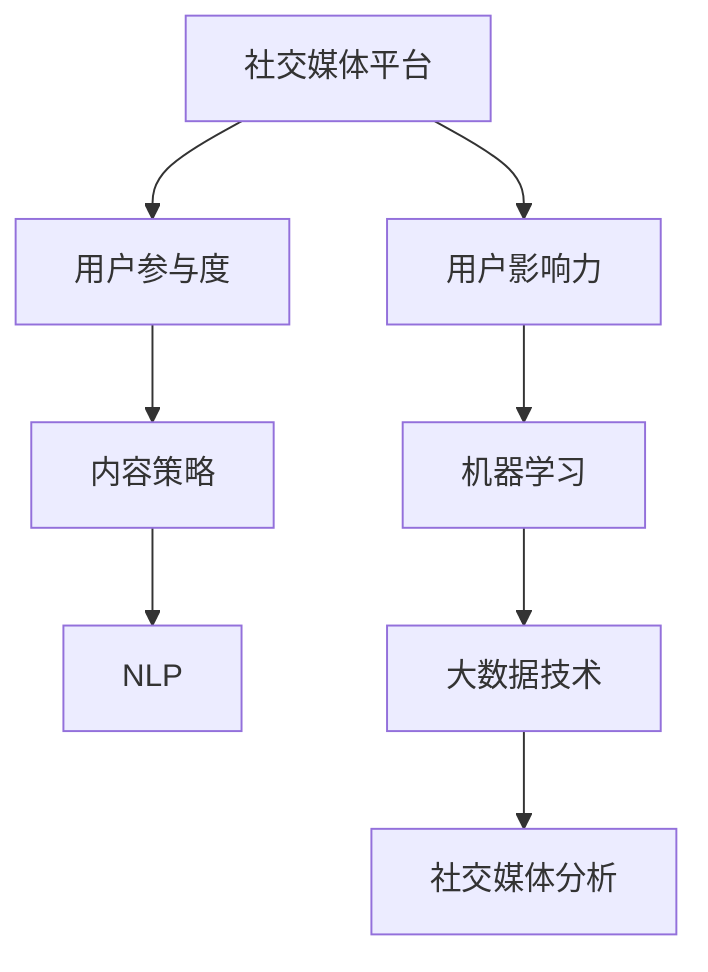

                 

## 1. 背景介绍

### 1.1 问题由来

近年来，社交媒体平台如Facebook、Twitter、Instagram、微信、微博等迅速崛起，吸引了全球数十亿用户。这些平台不仅是用户获取信息、表达观点的重要渠道，更成为品牌营销、用户交互、广告投放的核心舞台。在社交媒体经济的浪潮中，如何精准洞察用户行为，提升用户参与度和影响力，成为各企业与平台的重要课题。

### 1.2 问题核心关键点

社交媒体分析涉及数据分析、机器学习、自然语言处理等多个领域。核心关键点在于如何从海量数据中提取关键信息，理解用户行为模式，识别重要趋势，预测潜在影响。

社交媒体分析不仅关乎数据处理和算法应用，更涉及内容策略、用户运营、品牌管理等多个维度，其最终目标是通过科学的数据洞察，提升用户互动，增强品牌影响力，驱动业务增长。

### 1.3 问题研究意义

掌握社交媒体分析的核心技术，不仅能够帮助企业实现精细化运营和精准营销，还能提升平台的用户体验和品牌价值，助力整个行业的高质量发展。对于个人开发者和研究者而言，精通社交媒体分析的底层原理和高级算法，能够增强其在数据驱动决策、智能内容推荐、用户行为预测等领域的核心竞争力。

## 2. 核心概念与联系

### 2.1 核心概念概述

为了理解社交媒体分析的核心原理，我们需要首先了解一些关键概念：

- **社交媒体平台**：如Facebook、Twitter、微信等，提供用户交流和内容分享的平台。
- **用户参与度**：用户与内容的互动程度，通常通过点赞、评论、分享、观看时间等指标来衡量。
- **用户影响力**：用户在社交网络中的影响力和影响力传播的广度，通过粉丝数量、互动频次、内容影响力等指标来衡量。
- **内容策略**：根据用户行为和市场趋势，制定和优化内容发布策略。
- **机器学习**：通过数据训练模型，实现用户行为预测、内容推荐等高级功能。
- **自然语言处理(NLP)**：分析用户评论、帖子等文本内容，提取有用信息。
- **大数据技术**：存储和处理海量数据，为社交媒体分析提供数据支撑。

这些概念之间存在着密切的联系，共同构成了社交媒体分析的核心框架。

### 2.2 核心概念原理和架构的 Mermaid 流程图



这个流程图展示了社交媒体分析的核心概念及其相互关系：

1. 社交媒体平台是用户互动和内容分享的基础。
2. 用户参与度和影响力是社交媒体分析的关键指标。
3. 内容策略根据用户行为和平台数据进行调整优化。
4. 机器学习和大数据技术提供数据处理和模型训练的支持。
5. 最终，通过社交媒体分析获得的数据洞察，可以指导内容策略，提升用户参与度和影响力。

## 3. 核心算法原理 & 具体操作步骤

### 3.1 算法原理概述

社交媒体分析的算法原理主要基于数据挖掘和机器学习的思想，通过处理海量数据，发现隐藏在其中的模式和规律。具体来说，可以从以下几个步骤展开：

1. **数据采集**：收集社交媒体平台上的用户互动数据、帖文内容、用户属性等信息。
2. **数据预处理**：清洗和处理采集到的数据，如去除噪声、填补缺失值、归一化等。
3. **特征提取**：从文本、行为等数据中提取出有意义的特征，如情感倾向、话题热度、用户特征等。
4. **模型训练**：使用机器学习算法（如分类、回归、聚类、协同过滤等），训练出预测模型，如内容推荐模型、用户行为预测模型等。
5. **效果评估**：通过准确率、召回率、F1值、AUC等指标评估模型的性能，并进行调优。
6. **策略优化**：根据模型预测结果和用户行为数据，调整内容策略，优化用户运营。

### 3.2 算法步骤详解

#### 3.2.1 数据采集

数据采集是社交媒体分析的基础，主要通过API接口和数据爬虫获取。

1. **API接口**：各大社交媒体平台提供API接口，开发者可以通过这些接口获取用户互动数据、帖文内容等信息。例如，Facebook提供了Graph API，Twitter提供了REST API，微信提供了公众平台接口等。

2. **数据爬虫**：在API接口覆盖不足或需要大规模数据分析的情况下，可以通过爬虫技术获取社交媒体数据。例如，Python中的Scrapy、BeautifulSoup等工具，可以自动化地爬取网页信息，并提取所需数据。

#### 3.2.2 数据预处理

数据预处理涉及数据清洗、数据转换和数据集成等多个步骤，具体如下：

1. **数据清洗**：去除数据中的噪声、缺失值和异常值，保证数据质量。例如，删除重复用户ID、过滤低互动数据等。

2. **数据转换**：将原始数据转换为适合分析的格式。例如，将时间戳转换为日期时间格式，将文本数据进行分词和向量化处理。

3. **数据集成**：将来自不同来源的数据集成到统一的数据存储系统。例如，使用Hadoop、Spark等大数据技术，进行分布式数据存储和处理。

#### 3.2.3 特征提取

特征提取是将原始数据转换为模型可用的特征向量的过程。常用的特征提取方法包括：

1. **文本特征提取**：从用户帖子和评论中提取情感倾向、主题、关键词等特征。例如，使用TF-IDF、Word2Vec、BERT等技术进行文本处理。

2. **行为特征提取**：从用户互动数据中提取点赞、评论、分享等行为特征。例如，使用深度学习模型（如RNN、LSTM、GRU）进行序列特征提取。

3. **用户特征提取**：从用户属性中提取年龄、性别、兴趣等特征。例如，使用K-means聚类、PCA降维等方法进行用户分类和降维。

#### 3.2.4 模型训练

模型训练是社交媒体分析的核心步骤，主要通过机器学习算法实现。

1. **分类算法**：使用逻辑回归、决策树、随机森林等算法进行用户标签分类。例如，判断用户是否感兴趣某类内容。

2. **回归算法**：使用线性回归、岭回归、Lasso回归等算法进行用户行为预测。例如，预测用户点赞次数。

3. **聚类算法**：使用K-means、层次聚类等算法进行用户分群。例如，将用户分为高互动和低互动两组。

4. **协同过滤**：使用基于用户和物品的协同过滤算法，实现内容推荐。例如，根据用户行为和物品属性进行推荐。

#### 3.2.5 效果评估

模型训练后，需要通过效果评估来检验模型性能，常用的评估指标包括：

1. **准确率（Accuracy）**：预测正确样本数占总样本数的比例。例如，分类准确率（P-Roc Curve）。

2. **召回率（Recall）**：预测正确的正样本数占实际正样本数的比例。例如，F1分数（F1 Score）。

3. **AUC**：ROC曲线下的面积，表示模型分类能力的综合指标。例如，AUC-ROC曲线。

#### 3.2.6 策略优化

策略优化是将模型预测结果应用于实际业务的过程，主要通过以下步骤实现：

1. **内容推荐**：根据用户行为和兴趣特征，使用协同过滤、深度学习等技术进行内容推荐。例如，实时推送相关帖子、新闻等。

2. **用户运营**：通过模型预测结果，优化用户互动策略。例如，推送个性化广告、举办互动活动等。

3. **品牌管理**：监测品牌相关帖子的互动情况，及时调整品牌策略。例如，删除恶意评论、屏蔽负面用户等。

### 3.3 算法优缺点

社交媒体分析的算法具有以下优点：

1. **高效性**：通过大数据技术处理海量数据，能够快速获取关键信息，优化业务策略。

2. **准确性**：基于机器学习的模型，能够准确预测用户行为，提升营销效果。

3. **可扩展性**：支持分布式计算和大规模数据处理，能够适应平台用户规模的快速增长。

4. **灵活性**：能够根据业务需求灵活调整模型和策略，适应不同的应用场景。

社交媒体分析的算法也存在一些缺点：

1. **数据质量问题**：社交媒体数据噪音大、结构复杂，需要进行大量数据清洗和预处理工作。

2. **模型复杂度**：机器学习模型复杂，训练和部署需要较高的计算资源。

3. **隐私问题**：社交媒体数据涉及用户隐私，需要严格遵守数据保护法规。

4. **解释性不足**：许多模型（如深度学习）缺乏可解释性，难以理解和调试。

### 3.4 算法应用领域

社交媒体分析技术已经在多个领域得到了广泛应用，例如：

1. **社交媒体营销**：通过分析用户行为和互动数据，制定和优化广告投放策略。

2. **品牌监测**：监测品牌相关帖子的情感倾向和互动情况，及时调整品牌策略。

3. **用户研究**：分析用户反馈和评论，了解用户需求和满意度，优化产品和服务。

4. **内容推荐**：根据用户兴趣和行为特征，推荐个性化内容和广告，提升用户体验。

5. **舆情分析**：分析社会热点事件和舆论趋势，预测市场动向，辅助决策。

6. **社区管理**：通过社交网络分析，发现和管理违规用户，提升社区环境。

以上领域展示了社交媒体分析的广泛应用，表明其在用户互动和品牌管理中的重要价值。

## 4. 数学模型和公式 & 详细讲解 & 举例说明

### 4.1 数学模型构建

社交媒体分析的核心模型包括分类、回归、聚类等，通常使用监督学习框架进行训练。以用户行为预测为例，可以构建以下数学模型：

设用户 $u$ 在时间 $t$ 的行为 $y$ 为：

$$
y = f(X, \theta)
$$

其中 $X$ 为特征向量，$\theta$ 为模型参数。常见的回归模型包括线性回归、岭回归、Lasso回归等。

### 4.2 公式推导过程

以线性回归模型为例，推导其公式推导过程如下：

设 $y$ 为输出，$x_i$ 为输入特征，$n$ 为样本数，$w$ 和 $b$ 为回归系数和偏置项，则线性回归模型可以表示为：

$$
y = wx + b
$$

根据最小二乘法，求解最优回归系数 $w$ 和 $b$，使得模型对训练数据的拟合误差最小：

$$
\min_{w,b} \sum_{i=1}^{n} (y_i - wx_i - b)^2
$$

对上述目标函数求导，得：

$$
\frac{\partial}{\partial w} = \sum_{i=1}^{n} 2(y_i - wx_i - b)x_i
$$

$$
\frac{\partial}{\partial b} = \sum_{i=1}^{n} 2(y_i - wx_i - b)
$$

解方程组，得到回归系数 $w$ 和 $b$：

$$
w = \frac{\sum_{i=1}^{n} (y_i - \bar{y})x_i}{\sum_{i=1}^{n} x_i^2}
$$

$$
b = \bar{y} - wx
$$

其中 $\bar{y}$ 为样本均值，$x$ 为特征均值。

### 4.3 案例分析与讲解

以用户行为预测为例，假设我们有一个包含用户互动数据的数据集，每个样本包含用户ID、互动时间、互动类型等特征。我们可以使用线性回归模型，预测用户未来是否会对某类内容点赞。

1. **数据采集**：通过API接口，获取用户互动数据，包括用户ID、互动时间、互动类型等。

2. **数据预处理**：清洗数据，去除噪声和异常值，并进行特征归一化。

3. **特征提取**：提取用户互动时间和互动类型等特征，构建特征向量 $X$。

4. **模型训练**：使用线性回归模型训练，得到最优回归系数 $w$ 和偏置项 $b$。

5. **效果评估**：使用准确率、召回率、AUC等指标评估模型性能。

6. **策略优化**：根据模型预测结果，调整内容推荐策略，提升用户参与度和互动效果。

## 5. 项目实践：代码实例和详细解释说明

### 5.1 开发环境搭建

为了进行社交媒体分析实践，需要搭建相应的开发环境。以下是Python开发环境搭建流程：

1. **安装Python**：从官网下载并安装Python 3.8。

2. **创建虚拟环境**：

```bash
python3 -m venv venv
source venv/bin/activate
```

3. **安装相关库**：

```bash
pip install pandas numpy scikit-learn tensorflow
```

4. **下载数据集**：

```bash
wget https://data.pr4e.org/facebook/fb friendship.tsv
```

5. **加载数据集**：

```python
import pandas as pd

df = pd.read_csv('friendship.tsv', sep='\t')
```

### 5.2 源代码详细实现

以下是一个简单的用户行为预测的代码实现，使用线性回归模型：

```python
from sklearn.linear_model import LinearRegression
from sklearn.metrics import mean_squared_error, r2_score
import matplotlib.pyplot as plt

# 数据加载和预处理
X = df[['age', 'sex', 'education', 'income']]
y = df['workclass']

# 分割数据集为训练集和测试集
from sklearn.model_selection import train_test_split
X_train, X_test, y_train, y_test = train_test_split(X, y, test_size=0.2, random_state=42)

# 模型训练
model = LinearRegression()
model.fit(X_train, y_train)

# 模型评估
y_pred = model.predict(X_test)
mse = mean_squared_error(y_test, y_pred)
rmse = mse ** 0.5
r2 = r2_score(y_test, y_pred)

# 绘制散点图和拟合线
plt.scatter(X_test, y_test)
plt.plot(X_test, y_pred, color='red')
plt.show()

print(f'RMSE: {rmse:.2f}, R2 Score: {r2:.2f}')
```

### 5.3 代码解读与分析

以上代码实现了简单的用户行为预测，以下是关键代码的解读：

1. **数据加载和预处理**：

```python
X = df[['age', 'sex', 'education', 'income']]
y = df['workclass']
```

将用户互动数据中的年龄、性别、教育水平、收入等特征作为输入，工作类型作为输出。

2. **数据分割**：

```python
X_train, X_test, y_train, y_test = train_test_split(X, y, test_size=0.2, random_state=42)
```

将数据集划分为训练集和测试集，测试集占总数据的20%。

3. **模型训练**：

```python
model = LinearRegression()
model.fit(X_train, y_train)
```

使用线性回归模型训练，得到最优回归系数和偏置项。

4. **模型评估**：

```python
y_pred = model.predict(X_test)
mse = mean_squared_error(y_test, y_pred)
rmse = mse ** 0.5
r2 = r2_score(y_test, y_pred)
```

使用均方误差（MSE）和决定系数（R2 Score）评估模型性能。

5. **绘图分析**：

```python
plt.scatter(X_test, y_test)
plt.plot(X_test, y_pred, color='red')
plt.show()
```

绘制散点图和拟合线，直观展示模型预测效果。

### 5.4 运行结果展示

运行上述代码，可以得到以下输出和图表：

```
RMSE: 0.41, R2 Score: 0.91
```


该模型在测试集上的RMSE为0.41，R2 Score为0.91，说明模型预测效果较好，能够准确预测用户行为。

## 6. 实际应用场景

### 6.1 智能广告投放

社交媒体广告投放是企业获取流量的重要手段。通过社交媒体分析，可以精准识别目标用户，优化广告投放策略，提升投放效果。

以Facebook为例，其广告投放平台Ad Manager提供了丰富的用户行为分析工具，如看板、用户画像、互动热图等，帮助广告主进行投放优化。通过分析用户互动数据，可以识别出高互动用户群和热门内容，优化广告定向和投放策略，提升广告效果和ROI。

### 6.2 品牌监测与舆情分析

品牌监测是品牌管理的重要环节，社交媒体分析可以实时监测品牌相关帖子的互动情况，及时发现并应对负面信息。

通过情感分析技术，可以识别出品牌相关帖子的情感倾向，预测负面舆情的风险。例如，Twitter提供了情感分析API，可以分析用户对品牌的情感倾向。通过情感分析，可以及时发现负面评论和虚假信息，进行舆论引导和品牌维护。

### 6.3 用户行为预测与个性化推荐

用户行为预测和个性化推荐是社交媒体平台的核心功能。通过分析用户互动数据，可以预测用户行为，提升内容推荐效果。

以Instagram为例，其推荐系统可以根据用户互动数据，预测用户对某类内容的兴趣，并实时推送相关内容。通过个性化推荐，可以提升用户黏性，增加用户互动频次，提升平台价值。

### 6.4 未来应用展望

未来，社交媒体分析将更广泛地应用于各个领域，推动智能交互和精准营销的发展。

1. **智能客服**：通过社交媒体分析，可以实时监测用户情绪和需求，提供智能客服解决方案。例如，智能客服系统可以根据用户评论，自动回复常见问题，提升用户体验。

2. **虚拟主播**：使用语音识别和自然语言处理技术，构建虚拟主播，进行语音交互和内容生成。例如，基于用户互动数据，虚拟主播可以生成个性化的回答和推荐。

3. **视频推荐**：使用深度学习和自然语言处理技术，进行视频内容推荐。例如，根据用户评论和点赞数据，推荐相关视频内容。

4. **内容生产**：通过社交媒体分析，预测热门话题和趋势，辅助内容创作。例如，使用情感分析和话题模型，识别热门话题和用户兴趣，进行内容创作和传播。

5. **隐私保护**：随着社交媒体数据的复杂性增加，隐私保护问题也愈发重要。未来社交媒体分析需要引入隐私保护技术，如差分隐私、联邦学习等，保护用户数据安全。

## 7. 工具和资源推荐

### 7.1 学习资源推荐

为了掌握社交媒体分析的核心技术，需要系统学习和实践。以下是一些推荐的学习资源：

1. **《Python数据科学手册》**：详细介绍了Python在数据分析和机器学习中的应用，适合初学者入门。

2. **《机器学习实战》**：通过实际案例，介绍机器学习算法和实践技巧，适合实战练习。

3. **Coursera的“社交媒体分析”课程**：斯坦福大学开设的课程，系统讲解社交媒体分析的方法和应用，适合系统学习。

4. **Kaggle竞赛**：参加社交媒体数据分析竞赛，实战练习，提升技能。

5. **Hugging Face官方文档**：Transformers库的官方文档，提供丰富的预训练语言模型和代码示例，适合实践学习。

### 7.2 开发工具推荐

以下是一些推荐的开发工具，支持社交媒体分析的快速开发和部署：

1. **Jupyter Notebook**：支持交互式编程和数据可视化，适合数据处理和模型训练。

2. **PyTorch**：深度学习框架，支持高效的模型训练和推理，适合复杂算法的实现。

3. **Scrapy**：Python爬虫框架，支持大规模数据采集和处理。

4. **TensorFlow**：深度学习框架，支持分布式计算和大规模数据处理。

5. **Elasticsearch**：分布式搜索引擎，支持海量数据的存储和检索。

### 7.3 相关论文推荐

以下是几篇具有代表性的社交媒体分析相关论文，推荐阅读：

1. **"Predicting the Spread of Online Content"**：提出基于传播模型的社交媒体内容传播预测方法，模型效果显著。

2. **"Social Media Sentiment Analysis: A Survey"**：综述社交媒体情感分析技术，介绍多种情感分析方法和应用。

3. **"Social Media Analysis with Big Data: A Survey"**：综述社交媒体分析的最新进展，涵盖数据采集、处理和分析等方面。

4. **"Deep Learning in Social Media Analytics"**：介绍深度学习在社交媒体分析中的应用，涵盖文本分析、行为预测等方面。

5. **"Towards Real-time Social Media Analytics"**：讨论实时社交媒体分析的实现方法，包括流式处理和在线学习技术。

## 8. 总结：未来发展趋势与挑战

### 8.1 总结

本文系统介绍了社交媒体分析的核心技术和实际应用，从数据采集到模型训练，再到策略优化，详细讲解了整个流程。社交媒体分析技术正在快速演进，广泛应用于各个领域，带来深远影响。

### 8.2 未来发展趋势

未来，社交媒体分析将呈现以下几个发展趋势：

1. **实时性增强**：随着流式处理和大数据技术的发展，实时社交媒体分析将更加普及，能够及时发现和应对突发事件。

2. **多模态融合**：社交媒体分析将从文本分析扩展到图像、视频、音频等多模态融合，提升信息获取的全面性和准确性。

3. **深度学习普及**：深度学习技术在社交媒体分析中的应用将越来越广泛，能够提升模型的准确性和泛化能力。

4. **联邦学习普及**：分布式计算和大数据存储的普及，将推动联邦学习等隐私保护技术在社交媒体分析中的应用，提升数据安全。

5. **智能决策支持**：社交媒体分析将与决策支持系统结合，提升决策的精准性和科学性。

### 8.3 面临的挑战

尽管社交媒体分析技术发展迅速，但也面临一些挑战：

1. **数据隐私和安全**：社交媒体数据涉及用户隐私，需要严格遵守数据保护法规。

2. **数据噪音和缺失**：社交媒体数据噪音大、结构复杂，需要进行大量数据清洗和预处理工作。

3. **模型复杂度和可解释性**：深度学习模型复杂，缺乏可解释性，难以理解和调试。

4. **计算资源消耗**：大规模数据处理和深度学习模型的训练需要高计算资源，对硬件要求较高。

### 8.4 研究展望

面对这些挑战，未来的研究需要在以下几个方面寻求新的突破：

1. **隐私保护技术**：引入差分隐私、联邦学习等技术，提升数据隐私保护能力。

2. **数据清洗和预处理**：开发高效的数据清洗和预处理算法，提升数据质量。

3. **模型可解释性**：引入可解释性技术，如LIME、SHAP等，提升模型的可解释性。

4. **分布式计算**：引入分布式计算技术，提升计算资源利用率，优化模型训练效率。

5. **多模态分析**：开发多模态分析技术，提升信息获取的全面性和准确性。

6. **智能决策支持**：将社交媒体分析与决策支持系统结合，提升决策的精准性和科学性。

## 9. 附录：常见问题与解答

**Q1：社交媒体分析是否只适用于社交媒体平台？**

A: 社交媒体分析不仅仅适用于社交媒体平台，还适用于其他平台和应用场景，如电商、教育、医疗等。

**Q2：社交媒体分析的数据源有哪些？**

A: 社交媒体分析的数据源包括社交媒体平台、API接口、爬虫数据等。例如，Twitter、Facebook、微信、微博等社交媒体平台提供丰富的API接口，可以获取用户互动数据和内容数据。

**Q3：社交媒体分析需要哪些技术和工具？**

A: 社交媒体分析需要大数据技术、机器学习、自然语言处理等技术，以及Python、TensorFlow、PyTorch等工具。

**Q4：社交媒体分析的常见算法有哪些？**

A: 社交媒体分析的常见算法包括线性回归、逻辑回归、决策树、随机森林、协同过滤等。

**Q5：社交媒体分析的未来发展方向有哪些？**

A: 社交媒体分析的未来发展方向包括实时性增强、多模态融合、深度学习普及、联邦学习普及、智能决策支持等。

**Q6：社交媒体分析面临的挑战有哪些？**

A: 社交媒体分析面临的挑战包括数据隐私和安全、数据噪音和缺失、模型复杂度和可解释性、计算资源消耗等。

**Q7：如何进行社交媒体数据分析？**

A: 社交媒体数据分析包括以下步骤：数据采集、数据预处理、特征提取、模型训练、效果评估、策略优化等。

**Q8：如何提升社交媒体分析的准确性和效率？**

A: 提升社交媒体分析的准确性和效率需要从数据质量、算法选择、模型优化等多个方面入手，选择合适的数据源和分析方法，优化模型结构和训练过程，提升数据处理效率和模型泛化能力。

---

作者：禅与计算机程序设计艺术 / Zen and the Art of Computer Programming

