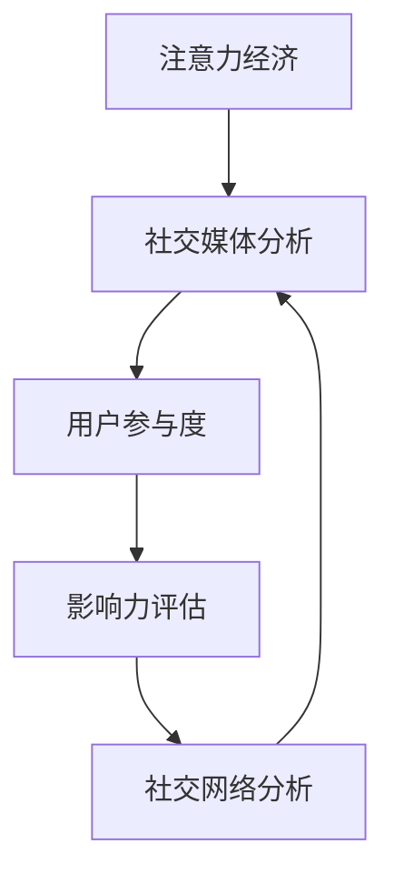

                 

# 注意力经济与社交媒体分析洞察力：了解受众参与度和影响力的秘诀

> 关键词：注意力经济,社交媒体分析,用户参与度,影响力评估,社交网络分析

## 1. 背景介绍

### 1.1 问题由来
在数字化转型的大潮中，社交媒体平台已成为信息传播、用户互动和商业活动的重要平台。然而，如何有效利用这一平台，最大化用户的注意力和参与度，是所有企业面临的重大挑战。借助注意力经济的概念，以及社交媒体分析的技术手段，可以深入理解用户行为和需求，从而实现精准化的用户管理和营销策略。

### 1.2 问题核心关键点
注意力经济是数字时代的核心经济模式之一，强调通过吸引和保持用户的注意力来创造价值。社交媒体分析洞察力则是指通过对社交媒体数据的收集、分析和可视化，揭示用户行为模式和影响因素，指导企业制定更有效的用户参与策略和影响力评估方法。

本文章将详细探讨注意力经济与社交媒体分析洞察力的相关概念与技术，帮助企业通过科学的分析方法提升用户参与度和影响力，进而实现商业价值最大化。

## 2. 核心概念与联系

### 2.1 核心概念概述

为更好地理解注意力经济与社交媒体分析洞察力，本节将介绍几个关键概念：

- **注意力经济（Attention Economy）**：数字时代，用户的时间和注意力成为稀缺资源。企业通过吸引和保持用户注意力，提供价值，实现商业变现。

- **社交媒体分析（Social Media Analytics）**：利用数据分析技术，对用户在社交媒体平台上的行为和互动数据进行分析，发现隐藏在海量数据中的用户需求和行为模式。

- **用户参与度（User Engagement）**：衡量用户在社交媒体上的活跃程度和互动频次，包括点赞、评论、分享、关注等行为。

- **影响力评估（Influence Assessment）**：通过分析社交媒体用户的互动数据，评估用户的影响力和品牌价值，识别意见领袖和潜在的关键用户。

- **社交网络分析（Social Network Analysis）**：利用图论方法，分析用户之间的关系网络，发现用户群体中的意见领袖和社群结构，指导用户管理策略。

这些概念之间的逻辑关系可以通过以下Mermaid流程图来展示：



这个流程图展示了一些核心概念及其之间的关系：

1. 注意力经济是基础，通过吸引和保持用户注意力创造价值。
2. 社交媒体分析揭示用户行为模式，洞察用户需求。
3. 用户参与度衡量用户活跃程度，指导营销策略。
4. 影响力评估识别关键用户和意见领袖。
5. 社交网络分析揭示用户关系网络，优化用户管理。

这些概念共同构成了社交媒体分析的基础框架，指导企业在数字时代下提升用户参与度和影响力。

## 3. 核心算法原理 & 具体操作步骤
### 3.1 算法原理概述

注意力经济与社交媒体分析洞察力的核心算法，包括用户行为分析、影响力评估、社交网络分析等。这些算法综合运用了图论、统计学、机器学习等方法，通过对社交媒体数据的分析，揭示用户行为模式，评估用户影响力和社交关系，从而指导企业制定更有效的用户管理和营销策略。

### 3.2 算法步骤详解

社交媒体分析洞察力的主要步骤如下：

1. **数据采集与预处理**：从社交媒体平台（如Facebook、Twitter、LinkedIn、Instagram等）收集相关数据，并进行数据清洗、格式化和标准化，确保数据的准确性和一致性。

2. **用户行为分析**：通过文本分析、情感分析、行为追踪等方法，分析用户在社交媒体上的行为模式，如发布频率、互动次数、活跃时间等。

3. **影响力评估**：使用社交网络分析算法，计算用户的社交资本（Social Capital）和社交影响力（Social Influence），识别关键意见领袖（KOLs）和潜在影响者。

4. **社交网络分析**：构建社交网络图，分析用户间的连接关系和社群结构，识别重要关系和潜在关系。

5. **可视化与报告**：将分析结果以图表、报告等形式展示，帮助企业理解用户行为模式、评估用户影响力和优化用户管理策略。

### 3.3 算法优缺点

社交媒体分析洞察力在提升用户参与度和影响力方面具有以下优点：

- **实时性**：社交媒体数据的实时性，使得分析结果可以实时反映用户行为和市场趋势。
- **覆盖广泛**：社交媒体平台的广泛覆盖，可以全面收集和分析用户数据。
- **精准度**：数据分析方法（如机器学习、图论）可以精准挖掘用户行为模式和关系网络。
- **决策支持**：分析结果为企业管理决策提供数据支持，指导用户管理和营销策略。

但这些算法也存在一些局限：

- **数据隐私**：用户数据隐私问题，需要遵守相关法律法规，合理处理用户隐私。
- **数据噪音**：社交媒体数据可能存在大量噪音，需要有效的数据清洗和处理。
- **算法复杂性**：数据分析方法复杂，需要专业知识支持。
- **过度依赖数据**：结果受数据质量影响较大，需要综合多源数据。

### 3.4 算法应用领域

社交媒体分析洞察力在多个领域具有广泛的应用：

- **市场营销**：通过用户参与度和影响力分析，优化广告投放和品牌推广策略。
- **产品开发**：分析用户反馈和需求，指导产品改进和功能开发。
- **客户服务**：通过用户互动分析，提升客户满意度和服务质量。
- **竞争分析**：分析竞争对手的用户行为和互动数据，制定有效的市场策略。
- **公共关系**：评估品牌在公众中的影响力和声誉，指导公关活动和舆情管理。

社交媒体分析洞察力在各行业的应用，展示了其在提升用户参与度和影响力方面的巨大潜力。

## 4. 数学模型和公式 & 详细讲解 & 举例说明

### 4.1 数学模型构建

社交媒体分析洞察力的数学模型主要基于图论和统计学方法，用于描述和分析用户行为模式和关系网络。

- **用户行为分析模型**：可以使用时间序列分析（如ARIMA模型）描述用户发布和互动的频率。
- **影响力评估模型**：使用社交网络分析（如PageRank算法）计算用户的社交资本和影响力。
- **社交网络分析模型**：使用图论方法（如社区发现算法）分析用户间的连接关系和社群结构。

### 4.2 公式推导过程

以社交网络分析中的PageRank算法为例，公式推导如下：

设社交网络图 $G(V,E)$，其中 $V$ 为节点集合，$E$ 为边集合。每个节点 $v_i$ 的PageRank值为 $PR(v_i)$，计算公式如下：

$$
PR(v_i) = \frac{1-d}{N} + d \sum_{j \in N(v_i)} \frac{PR(v_j)}{k_j}
$$

其中，$d$ 为阻尼系数（0-1之间），$N(v_i)$ 为节点 $v_i$ 的邻接节点集合，$k_j$ 为节点 $v_j$ 的度数。

### 4.3 案例分析与讲解

假设我们有一个Twitter上的用户社交网络图，节点代表用户，边代表关注关系。使用PageRank算法，可以计算每个用户的影响力，识别出社交网络中的意见领袖。具体步骤如下：

1. 初始化所有节点的PageRank值为1/N，N为总节点数。
2. 按照公式计算每个节点的PageRank值，直到收敛。
3. 根据PageRank值排序，识别出影响力最大的用户。

通过PageRank算法，可以清晰地看到用户之间的影响力分布，指导企业进行有针对性的用户管理。

## 5. 项目实践：代码实例和详细解释说明
### 5.1 开发环境搭建

在进行社交媒体分析洞察力实践前，我们需要准备好开发环境。以下是使用Python进行PyTorch开发的环境配置流程：

1. 安装Anaconda：从官网下载并安装Anaconda，用于创建独立的Python环境。

2. 创建并激活虚拟环境：
```bash
conda create -n social-media-env python=3.8 
conda activate social-media-env
```

3. 安装PyTorch：根据CUDA版本，从官网获取对应的安装命令。例如：
```bash
conda install pytorch torchvision torchaudio cudatoolkit=11.1 -c pytorch -c conda-forge
```

4. 安装社交媒体分析工具包：
```bash
pip install networkx sklearn matplotlib jupyter notebook ipython
```

完成上述步骤后，即可在`social-media-env`环境中开始社交媒体分析洞察力的实践。

### 5.2 源代码详细实现

下面我们以Twitter数据为例，给出使用社交网络分析算法进行用户影响力评估的PyTorch代码实现。

首先，定义社交网络图数据结构：

```python
import networkx as nx

G = nx.Graph()
with open("Twitter_network.txt", "r") as f:
    for line in f:
        u, v = line.strip().split("->")
        G.add_edge(u, v)

# 计算节点权重（即关注数）
node_weights = {n: len(list(G.neighbors(n))) for n in G.nodes()}
```

然后，使用PageRank算法计算每个节点的影响力：

```python
alpha = 0.85
PR_values = nx.pagerank(G, weights=node_weights, alpha=alpha)
```

最后，可视化影响力分布：

```python
import matplotlib.pyplot as plt

plt.barh(PR_values.keys(), PR_values.values())
plt.xlabel("PageRank Score")
plt.ylabel("Node")
plt.title("Twitter User Influence Analysis")
plt.show()
```

以上就是使用PyTorch对Twitter社交网络进行用户影响力评估的完整代码实现。可以看到，借助社交网络分析算法，可以轻松计算出每个用户在社交网络中的影响力，帮助企业识别关键意见领袖。

### 5.3 代码解读与分析

让我们再详细解读一下关键代码的实现细节：

**社交网络图定义**：
- `networkx.Graph()`：定义无向图，并使用邻接矩阵或邻接表存储节点和边。

**节点权重计算**：
- `node_weights`：根据节点关注数作为权重，构建字典，用于计算PageRank值。

**PageRank算法**：
- `nx.pagerank()`：计算每个节点的PageRank值，阻尼系数alpha取0.85，代表0.85的权重传递到邻接节点的概率。

**可视化影响力分布**：
- `matplotlib`：通过绘制水平条形图，直观展示每个用户的PageRank值，方便分析和决策。

可以看到，社交网络分析算法的代码实现非常简洁高效，借助开源工具包能够轻松完成用户影响力评估任务。

当然，工业级的系统实现还需考虑更多因素，如数据的实时采集与处理、算法的优化与并行、模型的部署与监控等。但核心的分析逻辑基本与此类似。

## 6. 实际应用场景
### 6.1 营销策略优化

社交媒体分析洞察力在营销策略优化方面具有重要应用。企业可以通过用户参与度和影响力分析，识别目标用户群体，制定更精准的广告投放和品牌推广策略。

例如，某饮料公司利用社交媒体分析洞察力，发现其在20-30岁年龄段的年轻用户中有较高的参与度。因此，该公司通过定向投放广告，配合有吸引力的活动和促销信息，成功提高了品牌知名度和销售量。

### 6.2 产品设计与改进

通过社交媒体分析洞察力，企业可以了解用户对产品的反馈和需求，指导产品设计和改进。

某时尚品牌通过分析用户互动数据，发现某款新衣式样在社交媒体上得到了广泛关注。结合用户评论和销量数据，该品牌决定加大对该款产品的推广力度，并在未来产品线中增加类似款式，进一步提升了品牌形象和市场份额。

### 6.3 客户服务与支持

社交媒体分析洞察力可以用于优化客户服务与支持，提高客户满意度和忠诚度。

某金融公司通过分析客户在社交媒体上的互动数据，发现部分客户对某项服务的反馈不佳。公司立即调整了服务流程，并定期邀请客户参与在线讨论，及时解决客户问题，显著提高了客户满意度。

### 6.4 公共关系管理

社交媒体分析洞察力可以帮助企业评估品牌在公众中的影响力和声誉，指导公共关系管理策略。

某媒体集团通过分析社交媒体上的用户评论和讨论，发现某篇报道引发了公众广泛关注和争议。集团及时调整了报道内容和发布时间，避免了负面影响，保持了良好的品牌形象。

### 6.5 竞争对手分析

社交媒体分析洞察力还可以用于竞争对手分析，制定有效的市场策略。

某电商公司通过分析竞争对手在社交媒体上的用户互动数据，发现其在新产品的推广策略上有所欠缺。公司借此机会推出了一系列创新型产品，并通过社交媒体宣传，抢占市场先机，成功超越了竞争对手。

### 6.6 未来应用展望

未来，社交媒体分析洞察力将在更多领域得到应用，为企业的运营管理和决策支持提供重要参考。

在智慧城市管理中，社交媒体分析洞察力可以用于分析居民的公共服务需求和反馈，优化市政服务和管理。

在教育领域，企业可以借助社交媒体分析洞察力，了解学生和家长的需求和反馈，优化教学内容和方式，提升教育质量。

在医疗健康领域，社交媒体分析洞察力可以帮助医疗机构了解患者需求，提供更精准的医疗服务和健康指导。

随着社交媒体分析洞察力的持续发展和应用，企业将能够更精准地理解用户行为和需求，优化运营策略，提升市场竞争力。

## 7. 工具和资源推荐
### 7.1 学习资源推荐

为了帮助开发者系统掌握社交媒体分析洞察力的理论基础和实践技巧，这里推荐一些优质的学习资源：

1. **《社交媒体分析实战指南》**：详细介绍了社交媒体数据的采集、处理和分析方法，涵盖用户行为分析、影响力评估和社交网络分析等关键技术。

2. **《社交媒体数据分析》在线课程**：由各大高校和研究机构开设，涵盖社交媒体数据分析的各个方面，适合各层次读者学习。

3. **《Python社交媒体数据分析》书籍**：基于Python语言，介绍了社交媒体数据分析的流程和技术，包括数据分析工具和算法。

4. **Kaggle社交媒体数据分析竞赛**：通过参与实际竞赛项目，实战练习社交媒体数据分析技能。

通过对这些资源的学习实践，相信你一定能够快速掌握社交媒体分析洞察力的精髓，并用于解决实际的商业问题。

### 7.2 开发工具推荐

高效的开发离不开优秀的工具支持。以下是几款用于社交媒体分析洞察力开发的常用工具：

1. **Python**：广泛使用的编程语言，适用于各种数据分析和机器学习任务。

2. **PyTorch**：基于Python的开源深度学习框架，灵活动态的计算图，适合快速迭代研究。

3. **TensorFlow**：由Google主导开发的开源深度学习框架，生产部署方便，适合大规模工程应用。

4. **PyTorch Lightning**：基于PyTorch的简化深度学习框架，支持快速搭建、训练和部署模型。

5. **Jupyter Notebook**：交互式数据科学笔记本，方便数据可视化、代码执行和结果展示。

6. **D3.js**：数据可视化库，支持创建复杂的数据图表和交互界面。

合理利用这些工具，可以显著提升社交媒体分析洞察力的开发效率，加快创新迭代的步伐。

### 7.3 相关论文推荐

社交媒体分析洞察力在不断发展，相关论文代表了最新的研究趋势和技术进展。以下是几篇具有代表性的论文，推荐阅读：

1. **《社交媒体用户行为分析》**：探讨了社交媒体用户行为模式，提出了时间序列分析和情感分析等方法。

2. **《基于社交网络分析的用户影响力评估》**：介绍了社交网络分析算法，并应用于用户影响力评估。

3. **《社交媒体数据分析在公共关系管理中的应用》**：研究了社交媒体数据分析在公共关系管理中的应用，提供了具体的案例分析。

4. **《社交媒体数据分析中的深度学习技术》**：介绍了深度学习在社交媒体数据分析中的应用，涵盖了自然语言处理、图像识别等领域。

5. **《社交媒体数据分析中的大数据技术》**：讨论了大数据技术在社交媒体数据分析中的应用，如分布式存储和处理、实时数据流等。

这些论文展示了社交媒体分析洞察力的最新研究进展，为进一步学习提供了坚实的理论基础。

## 8. 总结：未来发展趋势与挑战
### 8.1 总结

本文对社交媒体分析洞察力与注意力经济进行了全面系统的介绍。首先阐述了社交媒体分析洞察力的研究背景和意义，明确了其提升用户参与度和影响力的独特价值。其次，从原理到实践，详细讲解了社交媒体分析洞察力的数学模型和操作步骤，给出了社交媒体分析洞察力任务开发的完整代码实例。同时，本文还广泛探讨了社交媒体分析洞察力在多个行业领域的应用前景，展示了其广泛的潜在应用场景。此外，本文精选了社交媒体分析洞察力的各类学习资源，力求为读者提供全方位的技术指引。

通过本文的系统梳理，可以看到，社交媒体分析洞察力在数字化转型时代具有重要的应用价值，能够帮助企业更好地理解用户行为和需求，提升用户参与度和影响力，进而实现商业价值最大化。

### 8.2 未来发展趋势

展望未来，社交媒体分析洞察力的发展趋势如下：

1. **数据的多元化融合**：社交媒体数据的单一来源难以全面反映用户行为，未来将更多地结合其他数据源（如客户数据、行为数据、金融数据等），进行综合分析。

2. **算法的复杂性和高效性**：随着数据量的增长，复杂度和计算效率成为重要考量。未来将涌现更多高效、可扩展的算法，如分布式计算、实时流处理等。

3. **隐私保护与合规性**：用户数据隐私和合规性问题日益重要，未来需要在算法设计和数据处理中加强隐私保护，遵守相关法律法规。

4. **实时性和交互性**：实时分析和用户交互将成为重要趋势，通过实时数据分析和智能推荐，提升用户体验和参与度。

5. **跨领域应用拓展**：社交媒体分析洞察力将在更多领域得到应用，如医疗、教育、公共管理等，为企业提供全方位的解决方案。

6. **技术融合与创新**：社交媒体分析洞察力将与其他技术（如人工智能、区块链、物联网等）进行融合，形成新的应用场景和商业模式。

以上趋势凸显了社交媒体分析洞察力的广阔前景。这些方向的探索发展，将进一步提升社交媒体分析洞察力的能力，为企业提供更精准、高效的决策支持。

### 8.3 面临的挑战

尽管社交媒体分析洞察力已经取得了显著成就，但在迈向更加智能化、普适化应用的过程中，它仍面临诸多挑战：

1. **数据隐私问题**：用户数据隐私和安全是企业面临的主要挑战，需要遵守相关法律法规，合理处理用户隐私。

2. **数据质量和噪音**：社交媒体数据质量参差不齐，存在大量噪音，需要有效的数据清洗和处理。

3. **算法复杂性**：社交媒体分析洞察力涉及复杂的算法和模型，需要专业知识支持。

4. **实时性要求高**：实时分析和决策支持对数据处理和算法响应速度提出了高要求，需要优化数据处理和计算资源。

5. **跨平台兼容性**：不同社交媒体平台的数据格式和接口不同，需要开发兼容性的解决方案。

6. **用户参与度提升难度大**：用户参与度的提升往往需要结合多种策略和渠道，难以一蹴而就。

7. **计算资源消耗大**：社交媒体数据分析涉及大量数据处理和复杂计算，需要高效的计算资源支持。

正视社交媒体分析洞察力面临的这些挑战，积极应对并寻求突破，将是大规模应用落地不可或缺的一环。相信随着技术的不断进步和完善，社交媒体分析洞察力将更加成熟和可靠，赋能企业数字转型。

### 8.4 研究展望

面对社交媒体分析洞察力所面临的种种挑战，未来的研究需要在以下几个方面寻求新的突破：

1. **跨平台数据集成与统一**：通过标准化数据格式和接口，实现不同社交媒体平台数据的集成和统一。

2. **数据清洗与增强技术**：研究高效的数据清洗与增强方法，提高数据质量，减少噪音。

3. **实时数据处理与分析**：开发高效、可扩展的实时数据处理和分析算法，支持实时决策支持。

4. **隐私保护与合规性技术**：研究隐私保护与合规性技术，保护用户数据隐私，遵守法律法规。

5. **跨领域应用拓展**：将社交媒体分析洞察力应用到更多领域，提供全面、系统的解决方案。

6. **用户体验优化**：研究用户参与度提升方法，通过个性化推荐、智能对话等手段，提升用户体验和参与度。

7. **技术融合与创新**：将社交媒体分析洞察力与其他技术（如人工智能、区块链、物联网等）进行融合，形成新的应用场景和商业模式。

这些研究方向将引领社交媒体分析洞察力技术的发展，推动其在各行业领域的广泛应用，带来深远影响。

## 9. 附录：常见问题与解答

**Q1：社交媒体分析洞察力与传统数据分析有何不同？**

A: 社交媒体分析洞察力相较于传统数据分析，具有实时性、多样性、交互性的特点。社交媒体平台提供海量的数据流，结合自然语言处理和图像识别技术，可以进行实时数据分析和用户行为预测，帮助企业快速调整策略，提升用户参与度和影响力。

**Q2：如何选择社交媒体分析工具？**

A: 选择社交媒体分析工具需考虑以下几个因素：
1. 数据来源：工具是否支持多平台数据的采集和整合。
2. 数据处理能力：工具能否处理大规模数据，支持复杂的数据清洗和增强。
3. 分析功能：工具是否提供丰富的分析方法，如用户行为分析、影响力评估、社交网络分析等。
4. 可视化能力：工具能否生成直观的图表和报告，支持决策支持。
5. 扩展性和灵活性：工具是否支持自定义分析流程和算法，能否应对复杂的数据处理需求。

**Q3：如何进行用户影响力评估？**

A: 用户影响力评估主要涉及社交网络分析和机器学习算法，具体步骤如下：
1. 构建社交网络图，记录用户间的关注和互动关系。
2. 计算节点权重，如关注数、互动数等。
3. 应用PageRank算法等社交网络分析方法，计算每个节点的影响力。
4. 根据影响力值排序，识别关键意见领袖和潜在影响者。

**Q4：如何优化社交媒体数据分析的效率？**

A: 优化社交媒体数据分析的效率主要涉及数据处理和算法优化，具体措施包括：
1. 数据预处理：通过数据清洗和增强技术，提高数据质量，减少噪音。
2. 分布式计算：利用分布式计算框架，提高数据处理和分析效率。
3. 实时流处理：采用实时流处理技术，支持实时数据分析和决策支持。
4. 算法优化：优化算法设计，减少计算资源消耗，提高处理速度。

**Q5：社交媒体分析洞察力在各行业中的应用场景有哪些？**

A: 社交媒体分析洞察力在多个行业具有广泛的应用，具体包括：
1. 市场营销：优化广告投放和品牌推广策略。
2. 产品设计与改进：了解用户需求，指导产品开发和改进。
3. 客户服务与支持：提升客户满意度和忠诚度。
4. 公共关系管理：评估品牌影响力和声誉，指导公关活动。
5. 竞争对手分析：制定市场策略，超越竞争对手。
6. 智慧城市管理：分析居民需求，优化市政服务。
7. 教育：了解学生和家长需求，提升教育质量。
8. 医疗健康：分析患者需求，提供精准医疗服务。

社交媒体分析洞察力在各行业的应用，展示了其在提升用户参与度和影响力方面的巨大潜力。

---

作者：禅与计算机程序设计艺术 / Zen and the Art of Computer Programming

