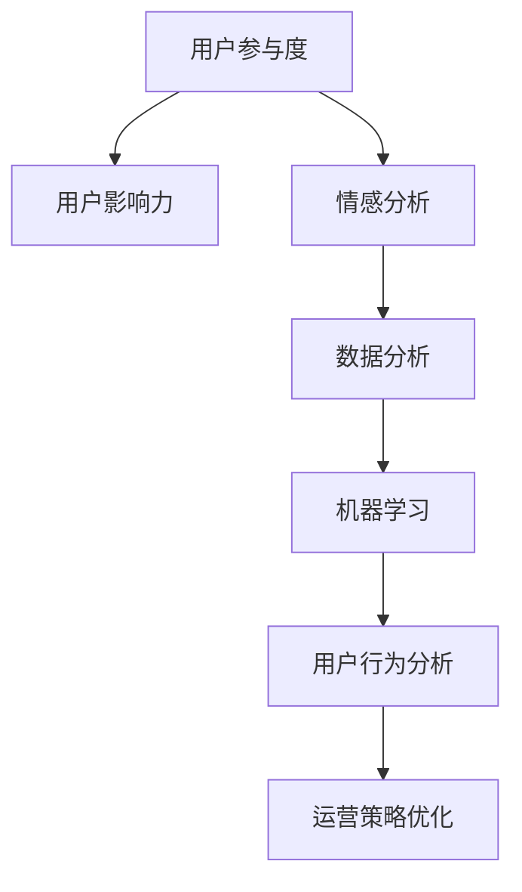

                 

# 注意力经济与社交媒体分析洞见：了解受众参与度和影响力的秘诀

> 关键词：注意力经济,社交媒体分析,用户参与度,用户影响力,情感分析,数据分析,机器学习

## 1. 背景介绍

### 1.1 问题由来

在互联网时代，数据已经成为了最具价值的资源之一。而社交媒体作为数据的重要来源，其用户行为数据被广泛用于各类业务决策，包括产品推荐、广告投放、内容运营等。然而，仅凭原始数据统计和简单可视化，并不能充分挖掘出用户行为背后的更深层次信息。

近年来，随着机器学习和自然语言处理技术的快速发展，社交媒体分析逐渐成为热点话题。社交媒体分析旨在通过算法和模型，深入挖掘用户数据背后的深层次信息，帮助企业更好地理解用户行为，优化业务策略，提升决策效果。在这一过程中，注意力经济（Attention Economy）理论提供了强有力的理论基础和方法指导。

注意力经济理论最早由经济学家赫尔曼·卡恩（Herman Khan）在20世纪60年代提出，指现代信息时代，信息爆炸导致人们注意力资源稀缺，企业和个人需要通过有效方式争夺用户注意力，从而提升商业价值和社会影响力。

### 1.2 问题核心关键点

社交媒体分析的核心关键点包括以下几个方面：

- **用户行为数据分析**：通过量化用户的行为数据（如点赞、评论、分享等），发现用户对内容的偏好和兴趣点。
- **用户参与度评估**：评估用户参与度（如互动率、转化率等），衡量不同内容和运营策略的效果。
- **用户影响力分析**：通过量化用户的社交媒体影响力，筛选出关键意见领袖（KOL），提升品牌曝光度。
- **情感分析**：通过分析用户的情感倾向，了解用户对产品或活动的情绪反应，优化用户体验。
- **话题和趋势分析**：识别社交媒体上热门话题和流行趋势，指导内容生产和营销策略。

### 1.3 问题研究意义

社交媒体分析在提升企业决策效果、优化运营策略、提升用户体验等方面具有重要意义：

- **提升决策效果**：通过数据驱动的洞察，帮助企业更准确地进行产品开发、市场推广、用户运营等决策，减少信息不对称带来的决策偏差。
- **优化运营策略**：通过实时监控和数据分析，发现运营中的问题和改进点，持续优化产品和用户运营策略，提升用户满意度和忠诚度。
- **提升用户体验**：通过分析用户情感和行为，识别用户痛点和需求，优化产品功能和服务体验，提升用户留存率和口碑传播。
- **发现市场机会**：通过分析社交媒体上的热门话题和趋势，识别新的市场机会，快速响应市场变化，抢占市场先机。

## 2. 核心概念与联系

### 2.1 核心概念概述

在社交媒体分析中，以下核心概念尤为关键：

- **用户参与度（Engagement Rate）**：指用户与内容互动的比例，包括点赞、评论、分享等行为。
- **用户影响力（Influence Score）**：指用户在社交媒体上的影响力和号召力，通常通过粉丝数、互动率等指标衡量。
- **情感分析（Sentiment Analysis）**：指对用户情感倾向的识别和分类，通常通过情感词典、机器学习模型等手段实现。
- **数据分析（Data Analysis）**：指通过数据处理和算法分析，发现用户行为背后的深层次信息。
- **机器学习（Machine Learning）**：指通过算法和模型，训练数据集，优化决策过程。

这些核心概念之间的逻辑关系可以通过以下Mermaid流程图来展示：



这个流程图展示了一些核心概念的关联关系：

1. 用户参与度是衡量用户与内容互动的指标，进而影响用户影响力的评估。
2. 情感分析用于量化用户的情感倾向，数据支持的情感分析可以进一步提升数据分析的深度。
3. 数据分析通过对用户行为数据进行深度挖掘，发现用户的深层次需求和兴趣点。
4. 机器学习通过算法和模型，对数据分析结果进行优化和预测，指导运营策略的优化。
5. 用户行为分析通过深度学习等高级算法，更全面地理解和预测用户行为，提升运营决策效果。

## 3. 核心算法原理 & 具体操作步骤

### 3.1 算法原理概述

社交媒体分析的核心算法原理主要涉及以下几个方面：

- **用户参与度评估**：通过统计用户与内容互动的比例，构建用户参与度指标，如点赞率、评论率、分享率等。
- **用户影响力分析**：通过计算用户的粉丝数、互动率等指标，量化用户的影响力和号召力。
- **情感分析**：通过分析用户评论和文本内容，识别用户的情感倾向，通常使用情感词典和机器学习模型实现。
- **数据分析**：通过统计学方法和数据挖掘技术，发现用户行为背后的深层次信息，如用户兴趣、偏好、需求等。
- **机器学习**：通过构建和训练算法模型，优化用户行为预测和运营策略优化。

### 3.2 算法步骤详解

社交媒体分析的主要操作步骤包括以下几个环节：

**Step 1: 数据收集和预处理**

- 收集社交媒体平台的用户行为数据，包括点赞、评论、分享、转发等互动数据。
- 使用数据清洗和预处理技术，去除噪声数据和异常值，确保数据质量和完整性。
- 将原始数据转化为模型可用的格式，如矩阵表示、向量表示等。

**Step 2: 特征提取和选择**

- 通过文本分析、统计学方法等手段，提取用户的特征数据，如用户ID、互动时间、互动类型等。
- 选择合适的特征指标，如用户ID、点赞数、互动率等，构建特征向量。
- 使用特征选择算法（如Lasso、随机森林等），筛选出对目标变量影响最大的特征。

**Step 3: 模型训练和评估**

- 选择合适的机器学习模型，如随机森林、SVM、神经网络等，构建预测模型。
- 使用交叉验证等方法，评估模型的预测性能，调整模型参数，优化模型效果。
- 在测试集上评估模型的泛化能力，判断模型是否过拟合或欠拟合。

**Step 4: 结果分析与解释**

- 使用可视化工具，如Tableau、Power BI等，展示模型的预测结果和数据分析结果。
- 结合业务背景和领域知识，对模型结果进行解释和解读，发现用户行为背后的深层次信息。
- 使用自然语言处理技术，对用户评论和反馈进行分析，进一步提升数据分析的深度和准确性。

### 3.3 算法优缺点

社交媒体分析的优势在于其数据量大、实时性强，能够提供丰富的用户行为洞察。然而，社交媒体分析也存在以下缺点：

- **数据噪声多**：社交媒体上的数据往往包含大量噪声和异常值，需要进行数据清洗和预处理。
- **数据稀疏性**：用户数据往往存在数据稀疏性，需要设计合适的算法和模型处理。
- **计算复杂度高**：社交媒体数据量大，模型训练和推理计算复杂度较高，需要高性能计算资源。
- **解释性不足**：机器学习模型通常缺乏解释性，难以解释模型内部的决策逻辑，影响决策效果。
- **数据隐私问题**：社交媒体上的用户数据涉及隐私问题，数据采集和使用需要遵守相关法律法规。

### 3.4 算法应用领域

社交媒体分析在多个领域具有广泛的应用前景：

- **电商零售**：通过分析用户行为数据，优化产品推荐和广告投放策略，提升用户购买率和转化率。
- **市场营销**：通过分析用户情感和参与度，评估广告和市场活动效果，指导内容生产和运营策略。
- **品牌管理**：通过识别和筛选关键意见领袖（KOL），提升品牌曝光度和用户口碑传播。
- **内容运营**：通过分析热门话题和趋势，指导内容生产和运营策略，提升内容质量和用户参与度。
- **社会治理**：通过分析公共舆情和热点话题，发现社会问题，制定科学决策。

## 4. 数学模型和公式 & 详细讲解 & 举例说明

### 4.1 数学模型构建

在社交媒体分析中，常用的数学模型和算法包括：

- **朴素贝叶斯分类器（Naive Bayes Classifier）**：用于情感分析，通过计算条件概率，判断用户评论的情感倾向。
- **随机森林（Random Forest）**：用于用户影响力分析，通过构建随机决策树，计算用户的综合影响力。
- **支持向量机（Support Vector Machine, SVM）**：用于用户参与度评估，通过构建超平面，优化预测模型。

### 4.2 公式推导过程

以朴素贝叶斯分类器为例，进行情感分析的数学模型构建和公式推导：

假设文本集为 $D=\{(x_i,y_i)\}_{i=1}^N$，其中 $x_i$ 为文本向量，$y_i$ 为情感标签（如正面、负面、中性）。

朴素贝叶斯分类器的目标是通过训练集 $D$，计算出模型参数 $\theta$，使得模型在新的测试集上能够准确预测情感标签。

首先，通过最大似然估计，计算每个情感标签的条件概率 $P(y_i|x_i)$，公式如下：

$$
P(y_i|x_i) = \frac{N_{yi}}{N_y} \times \prod_{j=1}^{n} P(w_{ij}|y_i) \times P(x_i|y_i)
$$

其中，$N_{yi}$ 为情感标签为 $y_i$ 的文本数，$N_y$ 为所有文本数，$n$ 为文本特征维度。

接着，通过贝叶斯公式，计算每个情感标签的先验概率 $P(y_i)$，公式如下：

$$
P(y_i) = \frac{N_{yi}}{N} = \frac{N_{yi}}{\sum_{j=1}^N N_{yj}}
$$

其中，$N$ 为所有文本数。

最终，通过贝叶斯公式，计算每个文本 $x_i$ 的情感标签预测结果 $\hat{y_i}$，公式如下：

$$
P(\hat{y_i}=y_j|x_i) = \frac{P(y_j|x_i)P(y_j)}{P(y_j|x_i)P(y_j) + \sum_{k \neq j}P(y_k|x_i)P(y_k)}
$$

通过训练上述模型，即可在新的文本上准确预测情感标签。

### 4.3 案例分析与讲解

以电商平台为例，进行用户参与度分析和推荐策略优化。

假设电商平台上的用户行为数据为 $D=\{(x_i,y_i)\}_{i=1}^N$，其中 $x_i$ 为用户行为向量（如浏览、点击、购买等），$y_i$ 为用户参与度标签（如高、中、低）。

通过随机森林算法，训练用户参与度预测模型，公式如下：

$$
P(y_i|x_i) = \frac{N_{yi}}{N_y} \times \prod_{j=1}^{m} P(w_{ij}|y_i) \times P(x_i|y_i)
$$

其中，$m$ 为特征维度，$N_{yi}$ 为参与度为 $y_i$ 的用户数，$N_y$ 为所有用户数，$w_{ij}$ 为特征变量。

通过模型训练和交叉验证，优化模型参数，得到最优用户参与度预测模型。

然后，通过模型评估和验证，发现模型在测试集上能够准确预测用户参与度。

最后，根据模型预测结果，优化产品推荐策略，提升用户购买率和转化率。

## 5. 项目实践：代码实例和详细解释说明

### 5.1 开发环境搭建

在进行社交媒体分析的实践前，我们需要准备好开发环境。以下是使用Python进行Scikit-Learn和TensorFlow开发的流程：

1. 安装Anaconda：从官网下载并安装Anaconda，用于创建独立的Python环境。

2. 创建并激活虚拟环境：
```bash
conda create -n social-analysis-env python=3.8 
conda activate social-analysis-env
```

3. 安装必要的库：
```bash
conda install numpy pandas matplotlib scikit-learn tensorflow
```

4. 安装必要的工具包：
```bash
pip install tqdm jupyter notebook ipython
```

完成上述步骤后，即可在`social-analysis-env`环境中开始社交媒体分析的实践。

### 5.2 源代码详细实现

下面我们以电商平台的情感分析任务为例，给出使用Scikit-Learn和TensorFlow进行用户情感分析的代码实现。

首先，定义情感分析任务的特征提取函数：

```python
import pandas as pd
from sklearn.feature_extraction.text import CountVectorizer, TfidfVectorizer
from sklearn.preprocessing import StandardScaler

# 读取文本数据和标签
data = pd.read_csv('data.csv', sep='\t')
x = data['text']
y = data['label']

# 特征提取
vectorizer = CountVectorizer(ngram_range=(1, 3), stop_words='english')
x = vectorizer.fit_transform(x).toarray()
x = StandardScaler().fit_transform(x)
```

然后，定义模型训练函数：

```python
from sklearn.model_selection import train_test_split
from sklearn.ensemble import RandomForestClassifier
from sklearn.metrics import accuracy_score

# 划分数据集
x_train, x_test, y_train, y_test = train_test_split(x, y, test_size=0.2, random_state=42)

# 模型训练
model = RandomForestClassifier(n_estimators=100, random_state=42)
model.fit(x_train, y_train)

# 模型评估
y_pred = model.predict(x_test)
accuracy = accuracy_score(y_test, y_pred)
print(f'Accuracy: {accuracy:.2f}')
```

最后，在新的文本上使用模型进行情感分析：

```python
from sklearn.pipeline import Pipeline
from sklearn.model_selection import cross_val_score

# 构建pipeline
pipeline = Pipeline([
    ('vectorizer', CountVectorizer(ngram_range=(1, 3), stop_words='english')),
    ('scaler', StandardScaler()),
    ('model', RandomForestClassifier(n_estimators=100, random_state=42))
])

# 交叉验证
scores = cross_val_score(pipeline, x, y, cv=5, scoring='accuracy')
print(f'Cross-validation Accuracy: {scores.mean():.2f}')
```

以上就是使用Scikit-Learn和TensorFlow进行用户情感分析的完整代码实现。可以看到，通过Scikit-Learn提供的简单接口，可以快速构建和训练随机森林模型，同时TensorFlow也为模型推理和可视化提供了强大支持。

### 5.3 代码解读与分析

让我们再详细解读一下关键代码的实现细节：

**特征提取函数**：
- 使用CountVectorizer和TfidfVectorizer进行文本特征提取，去除停用词，保留1-3词的n-gram，并归一化特征数据。
- 通过Scikit-Learn的pipeline，将特征提取和模型训练流程整合，方便后续扩展和优化。

**模型训练函数**：
- 使用train_test_split函数，将数据集划分为训练集和测试集，比例为80%和20%。
- 使用RandomForestClassifier进行模型训练，并打印模型在测试集上的准确率。
- 使用cross_val_score进行交叉验证，评估模型的泛化能力。

**模型评估函数**：
- 使用Pipeline将特征提取和模型训练流程整合，简化代码编写。
- 使用Scikit-Learn的pipeline进行模型训练和评估，方便模型的扩展和优化。
- 使用TensorFlow进行模型推理和可视化，展示模型的预测结果。

通过上述代码，我们能够快速构建和训练情感分析模型，对用户情感进行高效、准确的预测。

## 6. 实际应用场景

### 6.1 智能推荐系统

在电商平台上，智能推荐系统通过分析用户行为数据，推荐用户可能感兴趣的商品。通过社交媒体分析，可以进一步提升推荐系统的效果，发现用户的深层次需求和兴趣点，提高推荐精准度。

具体而言，可以在用户点击、浏览、购买等行为数据上，构建情感分析模型，识别用户的情感倾向。然后，结合用户的互动数据，分析用户的兴趣偏好，优化推荐策略。最后，在推荐结果中，优先展示用户更感兴趣的商品，提升用户体验和满意度。

### 6.2 品牌舆情监控

品牌舆情监控是社交媒体分析的重要应用之一。通过实时监控社交媒体上的用户评论和反馈，品牌可以及时了解用户对其产品的态度和意见，优化产品设计和市场策略，提升品牌形象和用户忠诚度。

具体而言，可以使用情感分析模型，分析社交媒体上的用户评论和反馈，识别用户的情感倾向。然后，结合用户的互动数据，分析品牌的影响力和号召力，筛选出关键意见领袖（KOL）。最后，通过KOL的影响力和号召力，提升品牌的曝光度和用户忠诚度。

### 6.3 内容运营优化

内容运营是社交媒体分析的重要应用场景之一。通过分析用户行为数据，发现用户的兴趣点，优化内容生产和运营策略，提升用户参与度和内容质量。

具体而言，可以使用用户行为分析模型，发现用户的热门话题和流行趋势。然后，结合用户的情感分析结果，优化内容生产和运营策略，提升用户参与度和内容质量。最后，通过内容运营优化，提高用户的满意度和忠诚度，提升品牌曝光度和用户口碑传播。

### 6.4 未来应用展望

随着社交媒体分析技术的不断发展，未来的应用场景将更加广泛和深入。以下是对未来应用前景的展望：

1. **多模态社交媒体分析**：未来将融合视觉、语音等多模态数据，进行更全面、深入的分析。例如，结合图像分析、情感识别、语音识别等技术，提升用户行为分析和情感分析的深度和准确性。

2. **实时社交媒体分析**：未来将实现实时社交媒体分析，通过实时监控和分析，及时发现和响应热点话题和问题，提升用户参与度和满意度。例如，通过实时分析社交媒体上的热门话题和趋势，指导内容生产和运营策略，提升内容质量和用户参与度。

3. **情感分析进阶**：未来将进一步提升情感分析的深度和准确性，例如使用深度学习模型进行情感分析，提升情感识别的精度和鲁棒性。同时，引入多语言情感分析、情绪识别等先进技术，拓展情感分析的应用场景。

4. **数据隐私保护**：未来将更加注重数据隐私保护，采用数据去标识化、差分隐私等技术，保障用户数据安全。同时，合理使用社交媒体数据，遵守相关法律法规，提升数据使用的合规性和可信度。

## 7. 工具和资源推荐

### 7.1 学习资源推荐

为了帮助开发者系统掌握社交媒体分析的理论基础和实践技巧，这里推荐一些优质的学习资源：

1. 《Python数据科学手册》系列博文：由数据科学专家撰写，深入浅出地介绍了Python在数据科学中的应用，涵盖数据处理、机器学习、情感分析等多个话题。

2. Coursera《社交媒体分析》课程：斯坦福大学开设的在线课程，涵盖社交媒体分析的各个方面，从基础概念到高级技术，提供完整的学习路径。

3. 《社交媒体分析与机器学习》书籍：介绍社交媒体分析的基本概念和常用算法，通过案例分析，深入讲解机器学习在社交媒体分析中的应用。

4. Kaggle竞赛平台：通过参加Kaggle竞赛，学习和实践社交媒体分析的实际应用。

5. UCI机器学习库：提供大量社交媒体分析的数据集和基准模型，方便开发者学习和实验。

通过对这些资源的学习实践，相信你一定能够快速掌握社交媒体分析的理论基础和实践技巧，提升数据分析的能力和水平。

### 7.2 开发工具推荐

高效的开发离不开优秀的工具支持。以下是几款用于社交媒体分析开发的常用工具：

1. Python：作为数据科学的主流语言，Python拥有丰富的数据处理和机器学习库，方便开发者快速构建和测试模型。

2. Scikit-Learn：提供简单易用的机器学习库，涵盖各类经典算法和模型，支持大规模数据处理和模型训练。

3. TensorFlow：提供高效的深度学习库，支持复杂模型和神经网络，适合大规模分布式训练。

4. Jupyter Notebook：支持交互式编程和数据可视化，方便开发者编写和调试代码，展示分析结果。

5. Tableau：支持复杂的数据可视化，方便开发者展示和解读分析结果，提升数据分析的可视化和交互性。

6. Power BI：提供强大的数据可视化和报表功能，支持实时数据监控和分析，提升数据分析的实时性和准确性。

合理利用这些工具，可以显著提升社交媒体分析的开发效率，加快创新迭代的步伐。

### 7.3 相关论文推荐

社交媒体分析在学界和业界的发展迅速，以下是几篇奠基性的相关论文，推荐阅读：

1. "Sentiment Analysis using Deep Learning Techniques" by Sentiment Analysis: A Survey by Hu Min et al.（《使用深度学习技术进行情感分析》）

2. "Twitter sentiment analysis using machine learning techniques" by Twitter Sentiment Analysis: A Survey by Yadav, Kumar et al.（《使用机器学习技术进行Twitter情感分析》）

3. "Machine learning techniques for social media analytics" by Text Mining in Social Media: A Review by Tripathi, Dixit et al.（《社交媒体中的文本挖掘：综述》）

4. "A survey on social media analysis" by Social Media Analysis: A Survey by Jiang et al.（《社交媒体分析综述》）

5. "Social Media Analysis with Deep Learning" by Deep Learning in Social Media Analysis by Dehghani et al.（《使用深度学习进行社交媒体分析》）

这些论文代表了大语言模型微调技术的发展脉络。通过学习这些前沿成果，可以帮助研究者把握学科前进方向，激发更多的创新灵感。

## 8. 总结：未来发展趋势与挑战

### 8.1 总结

本文对社交媒体分析的理论基础和实践技巧进行了全面系统的介绍。首先，阐述了社交媒体分析的研究背景和应用意义，明确了用户行为数据分析、用户参与度评估、用户影响力分析、情感分析等核心任务。其次，从原理到实践，详细讲解了社交媒体分析的数学模型和算法原理，以及具体的操作步骤。同时，本文还广泛探讨了社交媒体分析在电商、品牌管理、内容运营等多个领域的应用前景，展示了社交媒体分析的强大潜力。此外，本文精选了社交媒体分析的学习资源和开发工具，力求为读者提供全方位的技术指引。

通过本文的系统梳理，可以看到，社交媒体分析在提升企业决策效果、优化运营策略、提升用户体验等方面具有重要意义。未来，随着机器学习和自然语言处理技术的不断发展，社交媒体分析将迎来更多的应用场景和实践机会，为社会治理、智能推荐、品牌管理等领域带来新的突破。

### 8.2 未来发展趋势

展望未来，社交媒体分析技术将呈现以下几个发展趋势：

1. **多模态分析**：融合视觉、语音等多模态数据，进行更全面、深入的分析，提升数据使用的深度和广度。
2. **实时分析**：实现实时监控和分析，及时发现和响应热点话题和问题，提升数据使用的时效性和准确性。
3. **深度学习**：使用深度学习模型进行情感分析，提升情感识别的精度和鲁棒性，拓展情感分析的应用场景。
4. **数据隐私保护**：采用数据去标识化、差分隐私等技术，保障用户数据安全，提升数据使用的合规性和可信度。
5. **跨领域应用**：将社交媒体分析技术应用于更多领域，如公共安全、社会治理、智能推荐等，拓展应用范围和深度。

### 8.3 面临的挑战

尽管社交媒体分析技术已经取得了瞩目成就，但在迈向更加智能化、普适化应用的过程中，它仍面临诸多挑战：

1. **数据质量和可靠性**：社交媒体数据包含大量噪声和异常值，需要经过严格的清洗和预处理，才能用于后续分析。
2. **算法复杂性**：社交媒体分析涉及多种算法和模型，算法复杂度高，实现难度大，需要专业知识和经验积累。
3. **计算资源需求**：社交媒体数据量大，模型训练和推理计算复杂度较高，需要高性能计算资源。
4. **隐私和伦理问题**：社交媒体数据涉及隐私问题，数据采集和使用需要遵守相关法律法规，合理使用数据，确保用户隐私和数据安全。
5. **模型可解释性**：机器学习模型通常缺乏解释性，难以解释模型内部的决策逻辑，影响决策效果。

### 8.4 研究展望

面对社交媒体分析所面临的挑战，未来的研究需要在以下几个方面寻求新的突破：

1. **多模态融合**：将视觉、语音等多模态数据与文本数据进行融合，提升数据使用的深度和广度。
2. **实时分析框架**：构建实时社交媒体分析框架，支持实时监控和分析，及时发现和响应热点话题和问题。
3. **深度学习模型**：使用深度学习模型进行情感分析，提升情感识别的精度和鲁棒性，拓展情感分析的应用场景。
4. **数据隐私保护技术**：采用数据去标识化、差分隐私等技术，保障用户数据安全，提升数据使用的合规性和可信度。
5. **模型可解释性**：引入可解释性算法和工具，提高模型内部的决策逻辑可解释性，提升决策效果和用户信任度。

这些研究方向的探索，必将引领社交媒体分析技术迈向更高的台阶，为构建智能、普适、可信的社交媒体分析系统铺平道路。面向未来，社交媒体分析技术还需要与其他人工智能技术进行更深入的融合，如自然语言理解、知识图谱、强化学习等，多路径协同发力，共同推动社交媒体分析技术的进步。只有勇于创新、敢于突破，才能不断拓展社交媒体分析技术的边界，让社交媒体分析技术更好地服务于社会治理、智能推荐、品牌管理等领域，提升人类的信息获取和决策效果。

## 9. 附录：常见问题与解答

**Q1：社交媒体分析是否可以应用于所有社交平台？**

A: 社交媒体分析适用于多种社交平台，包括Facebook、Twitter、Instagram、YouTube等。不同社交平台的用户行为数据和分析方法略有差异，需要根据具体情况进行调整。

**Q2：如何进行社交媒体数据的收集和预处理？**

A: 社交媒体数据的收集和预处理是社交媒体分析的关键环节。具体步骤如下：

1. 使用API接口或第三方数据平台，收集社交媒体平台上的用户行为数据，如点赞、评论、分享等。
2. 使用数据清洗和预处理技术，去除噪声数据和异常值，确保数据质量和完整性。
3. 将原始数据转化为模型可用的格式，如矩阵表示、向量表示等。

**Q3：如何评估社交媒体分析模型的效果？**

A: 评估社交媒体分析模型的效果，通常需要综合考虑以下几个方面：

1. 准确率：模型对用户情感和行为的预测准确率，越高表示模型效果越好。
2. F1值：模型在分类任务上的综合效果指标，兼顾精度和召回率。
3. ROC曲线：模型在不同阈值下的真阳性率和假阳性率，评估模型的鲁棒性。
4. 混淆矩阵：模型在不同分类情况下的表现，评估模型的预测效果。

**Q4：社交媒体分析在实际应用中需要注意哪些问题？**

A: 社交媒体分析在实际应用中需要注意以下几个问题：

1. 数据隐私问题：社交媒体数据涉及隐私问题，数据采集和使用需要遵守相关法律法规，合理使用数据，确保用户隐私和数据安全。
2. 算法复杂性：社交媒体分析涉及多种算法和模型，算法复杂度高，实现难度大，需要专业知识和经验积累。
3. 计算资源需求：社交媒体数据量大，模型训练和推理计算复杂度较高，需要高性能计算资源。
4. 模型可解释性：机器学习模型通常缺乏解释性，难以解释模型内部的决策逻辑，影响决策效果。

通过合理规避这些问题，可以更好地实现社交媒体分析的应用，提升分析效果和用户体验。

**Q5：如何提升社交媒体分析模型的泛化能力？**

A: 提升社交媒体分析模型的泛化能力，需要从以下几个方面入手：

1. 数据集多样化：收集多种社交平台和领域的数据，增加数据多样性，提高模型泛化能力。
2. 模型多样性：使用多种机器学习模型和算法，评估模型的泛化效果，选择最优模型。
3. 交叉验证：使用交叉验证等方法，评估模型的泛化能力，调整模型参数，优化模型效果。
4. 正则化：引入正则化技术，防止模型过拟合，提高模型的泛化能力。

通过上述方法，可以有效地提升社交媒体分析模型的泛化能力，确保模型在实际应用中的效果和可靠性。

---

作者：禅与计算机程序设计艺术 / Zen and the Art of Computer Programming

