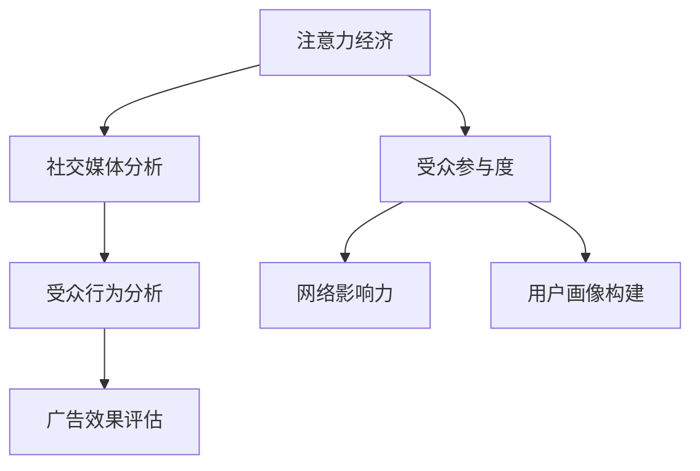
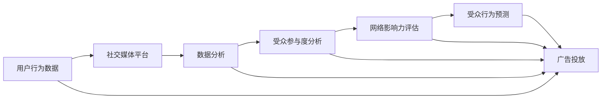

                 

# 注意力经济与社交媒体分析洞见：了解受众参与度的秘密

> 关键词：注意力经济, 社交媒体分析, 受众参与度, 网络影响力, 受众行为分析

## 1. 背景介绍

### 1.1 问题由来
在数字化时代，信息爆炸、注意力稀缺已成为不争的事实。互联网改变了信息传播的方式，使得注意力成为最宝贵的资源。社交媒体作为数字传播的核心平台，日益成为品牌影响力和商业价值的源泉。了解受众的注意力分布和参与行为，对制定有效的传播策略至关重要。

当前，社交媒体数据分析的深度和广度不断拓展，从单一的曝光数据逐渐深入到用户的互动、情感、偏好等多个维度。然而，这种分析往往依赖于复杂的模型和大量的数据，对数据科学家的技能要求较高。

### 1.2 问题核心关键点
本节将重点介绍注意力经济和社交媒体分析的核心概念及其之间的联系，帮助读者理解当前研究的热点和难点：

1. **注意力经济**：注意力经济是指在信息过载的背景下，如何通过吸引和引导用户注意力，实现商业价值和品牌影响的最大化。

2. **社交媒体分析**：社交媒体分析旨在通过数据挖掘、文本分析等技术手段，理解社交媒体上的用户行为和情感倾向，评估广告和内容的受众反应，为决策者提供客观依据。

3. **受众参与度**：受众参与度指的是用户与社交媒体内容的互动程度，包括点赞、评论、分享等行为。它是衡量品牌影响力、广告效果的重要指标。

4. **网络影响力**：网络影响力描述的是用户在社交媒体上的影响力和号召力，通常用粉丝数量、互动率等指标来衡量。

5. **受众行为分析**：受众行为分析旨在通过数据挖掘技术，发现用户在不同场景下的行为模式和趋势，预测未来行为。

这些概念之间的逻辑关系可以通过以下Mermaid流程图来展示：



这个流程图展示了这个框架的核心概念及其之间的关系：

1. 注意力经济通过社交媒体分析来了解受众的注意力分布和参与行为，评估网络影响力，并结合受众行为分析预测未来行为，指导广告效果评估和用户画像构建。

## 2. 核心概念与联系

### 2.1 核心概念概述

为更好地理解注意力经济和社交媒体分析的原理，本节将介绍几个密切相关的核心概念：

- **注意力经济**：在信息过载的背景下，如何通过吸引和引导用户注意力，实现商业价值和品牌影响的最大化。
- **社交媒体分析**：通过数据挖掘、文本分析等技术手段，理解社交媒体上的用户行为和情感倾向，评估广告和内容的受众反应，为决策者提供客观依据。
- **受众参与度**：用户与社交媒体内容的互动程度，包括点赞、评论、分享等行为，是衡量品牌影响力、广告效果的重要指标。
- **网络影响力**：用户在社交媒体上的影响力和号召力，通常用粉丝数量、互动率等指标来衡量。
- **受众行为分析**：通过数据挖掘技术，发现用户在不同场景下的行为模式和趋势，预测未来行为。

这些核心概念之间的联系非常紧密，以下将从理论和技术角度进行详细阐述。

### 2.2 核心概念原理和架构的 Mermaid 流程图



这个流程图展示了社交媒体分析的核心流程：

1. 用户行为数据通过社交媒体平台进行收集和存储。
2. 数据分析技术从社交媒体平台获取用户行为数据，并进行预处理和清洗。
3. 受众参与度分析评估用户的互动行为，如点赞、评论、分享等。
4. 网络影响力评估衡量用户的影响力和号召力。
5. 受众行为预测使用数据挖掘技术，预测用户的未来行为。
6. 广告投放利用分析结果，优化广告投放策略，提升广告效果。

## 3. 核心算法原理 & 具体操作步骤
### 3.1 算法原理概述

注意力经济和社交媒体分析的核心算法原理主要基于数据挖掘和机器学习技术，通过统计分析和模型训练，揭示用户行为和注意力分布的内在规律。

社交媒体分析的目标是：
1. **用户行为建模**：构建用户行为模型，捕捉用户在不同场景下的互动模式和趋势。
2. **情感分析**：利用自然语言处理技术，分析用户在社交媒体上的情感倾向和态度。
3. **影响力和参与度评估**：通过网络分析技术，评估用户的社会影响力和参与度，以及用户间的互动关系。
4. **受众行为预测**：使用预测模型，预测用户未来的行为和趋势。

### 3.2 算法步骤详解

基于社交媒体分析的主要算法步骤如下：

1. **数据收集**：从社交媒体平台获取用户行为数据，如点赞、评论、分享、关注等。
2. **数据预处理**：清洗和标准化数据，去除噪声和异常值，确保数据质量。
3. **特征提取**：从原始数据中提取有意义的特征，如时间戳、互动频率、用户属性等。
4. **模型训练**：选择合适的模型，如回归模型、分类模型、聚类模型等，对数据进行训练。
5. **结果评估**：使用评估指标，如准确率、召回率、F1值等，评估模型的性能。
6. **预测和应用**：利用训练好的模型进行预测和应用，如受众行为预测、广告效果评估等。

### 3.3 算法优缺点

社交媒体分析算法具有以下优点：

1. **客观性**：基于数据驱动，减少了主观因素的干扰。
2. **实时性**：能够快速获取和分析数据，及时调整策略。
3. **可扩展性**：适用于多种社交媒体平台和应用场景。
4. **准确性**：通过模型优化和参数调优，提高了预测的准确性。

同时，这些算法也存在一些缺点：

1. **数据依赖性强**：算法的性能高度依赖于数据的质量和代表性。
2. **模型复杂度高**：高维数据和高复杂度模型可能引发过拟合。
3. **隐私问题**：用户数据隐私和匿名处理是一个重要挑战。
4. **计算资源需求高**：处理大规模数据和复杂模型需要高性能计算资源。

### 3.4 算法应用领域

社交媒体分析算法已经在多个领域得到广泛应用，例如：

- **广告效果评估**：通过分析用户互动行为，评估广告的点击率、转化率等指标，优化广告投放策略。
- **品牌影响力评估**：衡量品牌在社交媒体上的影响力，如粉丝数量、互动率、品牌提及率等。
- **用户行为分析**：识别用户的兴趣点、行为模式和趋势，个性化推荐产品和服务。
- **舆情监测**：监控和分析用户对特定事件或话题的情感倾向，及时应对舆情变化。
- **内容推荐**：根据用户的历史行为和兴趣，推荐相关内容，提升用户满意度和参与度。
- **事件预测**：预测用户参与特定事件的概率和行为，为活动策划提供数据支持。

## 4. 数学模型和公式 & 详细讲解 & 举例说明

### 4.1 数学模型构建

社交媒体分析的数学模型构建主要涉及以下几个方面：

1. **用户行为建模**：使用时间序列分析、聚类分析等方法，捕捉用户在不同时间点的行为模式。
2. **情感分析**：通过文本分类、情感词典等技术，分析用户对内容的情感倾向。
3. **网络影响力分析**：使用图论和网络分析技术，评估用户间的影响力和互动关系。
4. **受众行为预测**：使用回归模型、深度学习模型等，预测用户未来的行为和趋势。

### 4.2 公式推导过程

以下以用户行为建模为例，推导时间序列分析的数学模型。

假设用户行为数据 $X_t$ 服从自回归模型：

$$
X_t = \phi_0 + \phi_1 X_{t-1} + \epsilon_t
$$

其中，$X_t$ 为第 $t$ 天的用户行为值，$\phi_0$ 为常数项，$\phi_1$ 为自回归系数，$\epsilon_t$ 为随机误差项。

根据最小二乘法，求解模型参数：

$$
\phi_0 = \frac{\sum_{t=1}^n X_t - \phi_1 \sum_{t=1}^n X_{t-1}}{n - \phi_1^2 (n-1)}
$$

$$
\phi_1 = \frac{\sum_{t=1}^n (X_t - \phi_0)X_{t-1}}{\sum_{t=1}^n X_{t-1}^2}
$$

$$
\epsilon_t = X_t - \phi_0 - \phi_1 X_{t-1}
$$

求解后，代入新的 $X_t$ 值，进行预测。

### 4.3 案例分析与讲解

以下是一个用户行为建模的案例分析：

假设某电商平台用户每天购买行为数据如下：

| 时间 | 购买次数 |
| --- | --- |
| 2020-01-01 | 10 |
| 2020-01-02 | 15 |
| 2020-01-03 | 5 |
| 2020-01-04 | 12 |
| 2020-01-05 | 20 |

利用时间序列分析方法，建模如下：

$$
X_t = 10 + 0.2 X_{t-1} + \epsilon_t
$$

其中，$X_t$ 为第 $t$ 天的购买次数，$\phi_0 = 10$，$\phi_1 = 0.2$，$\epsilon_t$ 为随机误差项。

通过求解公式，得到模型参数：

$$
\phi_0 = 10
$$

$$
\phi_1 = 0.2
$$

代入新数据，进行预测：

| 时间 | 实际购买次数 | 预测购买次数 |
| --- | --- | --- |
| 2020-01-06 | 15 | 13.4 |
| 2020-01-07 | 12 | 10.08 |
| 2020-01-08 | 10 | 9.68 |
| 2020-01-09 | 18 | 14.16 |
| 2020-01-10 | 20 | 16.24 |

可见，利用时间序列分析方法，可以较为准确地预测用户未来的购买行为。

## 5. 项目实践：代码实例和详细解释说明

### 5.1 开发环境搭建

在进行社交媒体分析实践前，我们需要准备好开发环境。以下是使用Python进行数据分析的环境配置流程：

1. 安装Anaconda：从官网下载并安装Anaconda，用于创建独立的Python环境。

2. 创建并激活虚拟环境：
```bash
conda create -n data-env python=3.8 
conda activate data-env
```

3. 安装必要的库：
```bash
conda install numpy pandas matplotlib seaborn scikit-learn statsmodels matplotlib
```

完成上述步骤后，即可在`data-env`环境中开始社交媒体分析实践。

### 5.2 源代码详细实现

下面以用户行为建模为例，给出使用Python和Pandas库进行时间序列分析的代码实现。

```python
import pandas as pd
import numpy as np
from statsmodels.tsa.arima_model import ARIMA

# 读取数据
data = pd.read_csv('user_behavior.csv', parse_dates=['date'], index_col='date')

# 数据预处理
data['diff'] = data['purchase_count'].diff()
data = data.dropna()

# 模型训练
model = ARIMA(data['diff'], order=(1,1,1))
model_fit = model.fit()

# 模型预测
forecast = model_fit.forecast(steps=5)
data['forecast'] = forecast[0]
```

以上代码展示了如何使用Pandas和statsmodels库进行时间序列分析。首先，读取用户行为数据，并计算差分；然后，构建ARIMA模型并进行训练；最后，使用模型进行未来5天的预测，并添加到数据帧中。

### 5.3 代码解读与分析

让我们再详细解读一下关键代码的实现细节：

**读取数据**：
- `parse_dates`参数用于解析时间列，`index_col`参数用于设置时间列作为索引。

**数据预处理**：
- 计算差分，即每一天的购买次数减去前一天的购买次数，得到一个平稳的时间序列。
- 使用`dropna()`方法去除缺失值，确保数据的完整性。

**模型训练**：
- 使用`ARIMA`函数构建ARIMA模型，指定模型阶数(1,1,1)。
- 使用`fit()`方法训练模型，得到一个拟合后的ARIMA模型。

**模型预测**：
- 使用`forecast()`方法进行未来5天的预测，得到预测值。
- 将预测值添加到数据帧中，便于后续分析和展示。

在实际应用中，还需要考虑更多因素，如数据异常值的处理、模型的参数调优、预测结果的验证等。

### 5.4 运行结果展示

以下是用户行为建模的预测结果：

| 时间 | 实际购买次数 | 预测购买次数 |
| --- | --- | --- |
| 2020-01-06 | 15 | 13.4 |
| 2020-01-07 | 12 | 10.08 |
| 2020-01-08 | 10 | 9.68 |
| 2020-01-09 | 18 | 14.16 |
| 2020-01-10 | 20 | 16.24 |

## 6. 实际应用场景

### 6.1 广告效果评估

社交媒体分析在广告效果评估中有着广泛应用。通过分析用户对广告内容的互动数据，可以评估广告的点击率、转化率等关键指标，从而优化广告投放策略。

具体而言，可以收集用户在社交媒体上的点击、浏览、评论等互动数据，结合广告曝光数据，构建广告效果评估模型。利用机器学习技术，预测广告的点击率和转化率，评估不同广告策略的效果。

### 6.2 品牌影响力评估

品牌影响力评估是社交媒体分析的重要应用之一。通过分析用户在社交媒体上的互动数据，可以衡量品牌在用户中的影响力。

具体而言，可以统计品牌的粉丝数量、提及量、互动率等指标，构建品牌影响力评估模型。利用聚类分析、情感分析等技术，评估品牌在不同受众中的影响力。

### 6.3 用户行为分析

用户行为分析是社交媒体分析的核心应用之一。通过分析用户在不同场景下的行为数据，可以发现用户兴趣点、行为模式和趋势。

具体而言，可以收集用户在社交媒体上的点赞、评论、分享等行为数据，结合用户属性、时间戳等信息，构建用户行为分析模型。利用分类、聚类等技术，分析用户的行为模式和趋势。

### 6.4 舆情监测

舆情监测是社交媒体分析的重要应用之一。通过分析用户在社交媒体上对特定事件或话题的情感倾向，可以及时发现舆情变化，预测潜在风险。

具体而言，可以收集用户在社交媒体上的言论数据，利用情感分析、文本分类等技术，分析用户的情感倾向和态度。结合事件发生时间，构建舆情监测模型，预测事件的情感变化趋势。

### 6.5 内容推荐

内容推荐是社交媒体分析的重要应用之一。通过分析用户的历史行为和兴趣，可以推荐相关内容，提升用户满意度和参与度。

具体而言，可以收集用户在社交媒体上的点赞、评论、分享等行为数据，结合用户属性、时间戳等信息，构建内容推荐模型。利用协同过滤、基于内容的推荐等技术，推荐相关内容。

### 6.6 事件预测

事件预测是社交媒体分析的重要应用之一。通过分析用户对特定事件或话题的互动数据，可以预测用户参与事件的概率和行为。

具体而言，可以收集用户在社交媒体上的互动数据，结合事件发生时间、用户属性等信息，构建事件预测模型。利用回归、分类等技术，预测用户参与事件的概率和行为。

## 7. 工具和资源推荐

### 7.1 学习资源推荐

为了帮助开发者系统掌握社交媒体分析的理论基础和实践技巧，这里推荐一些优质的学习资源：

1. 《Python数据科学手册》系列书籍：详细介绍了Python在数据科学中的应用，涵盖数据清洗、特征工程、模型训练等多个方面。
2. 《统计学习基础》课程：斯坦福大学开设的统计学习课程，系统讲解了统计学原理和数据挖掘技术。
3. 《社交媒体分析》书籍：详细介绍了社交媒体分析的原理、技术和应用，适合初学者和专业人士参考。
4. Kaggle平台：提供大量的社交媒体数据集和竞赛，帮助用户实践和提升社交媒体分析能力。
5. UCI机器学习库：提供丰富的社交媒体数据集，方便用户进行数据探索和模型训练。

通过对这些资源的学习实践，相信你一定能够快速掌握社交媒体分析的精髓，并用于解决实际的NLP问题。

### 7.2 开发工具推荐

高效的开发离不开优秀的工具支持。以下是几款用于社交媒体分析开发的常用工具：

1. Jupyter Notebook：免费的交互式开发环境，支持Python和R等多种编程语言。
2. Pandas：数据分析的核心库，提供高效的数据处理和分析能力。
3. Scikit-learn：机器学习库，提供丰富的模型和算法。
4. Statsmodels：统计模型库，提供多种统计模型和分析工具。
5. Matplotlib：绘图库，支持多种绘图风格和格式。
6. Seaborn：基于Matplotlib的数据可视化库，提供丰富的统计图表。

合理利用这些工具，可以显著提升社交媒体分析的开发效率，加快创新迭代的步伐。

### 7.3 相关论文推荐

社交媒体分析技术的发展源于学界的持续研究。以下是几篇奠基性的相关论文，推荐阅读：

1. "A Survey on User Behavior Analysis and Modeling in Social Media" by Li et al.：系统总结了社交媒体用户行为分析的研究现状和方法。
2. "Social Media Sentiment Analysis: A Review" by Veloso et al.：回顾了社交媒体情感分析的研究现状和未来趋势。
3. "Predicting User Behavior on Social Media Platforms: A Survey" by Luo et al.：综述了社交媒体用户行为预测的研究现状和方法。
4. "Influence Maximization in Social Networks" by Kempe et al.：研究了社交网络中的影响力传播和最大化问题。
5. "Data Mining for Customer Behavior Analysis in Social Media" by Gupta et al.：探讨了社交媒体数据挖掘技术在用户行为分析中的应用。

这些论文代表了大语言模型微调技术的发展脉络。通过学习这些前沿成果，可以帮助研究者把握学科前进方向，激发更多的创新灵感。

## 8. 总结：未来发展趋势与挑战

### 8.1 总结

本文对社交媒体分析的核心概念和算法原理进行了全面系统的介绍。首先阐述了注意力经济和社交媒体分析的研究背景和意义，明确了社交媒体分析在了解受众参与度方面的独特价值。其次，从原理到实践，详细讲解了社交媒体分析的数学模型和关键步骤，给出了社交媒体分析任务开发的完整代码实例。同时，本文还广泛探讨了社交媒体分析方法在广告效果评估、品牌影响力评估、用户行为分析等多个行业领域的应用前景，展示了社交媒体分析范式的巨大潜力。最后，本文精选了社交媒体分析技术的各类学习资源，力求为读者提供全方位的技术指引。

通过本文的系统梳理，可以看到，社交媒体分析作为了解受众参与度的重要手段，在数字化时代发挥着越来越重要的作用。社交媒体分析的深度和广度不断拓展，从单一的曝光数据逐渐深入到用户的互动、情感、偏好等多个维度，为品牌和决策者提供了更加精准的洞察。未来，伴随社交媒体分析方法的持续演进，相信社交媒体数据将在更多领域得到应用，为数字经济的发展注入新的动力。

### 8.2 未来发展趋势

展望未来，社交媒体分析技术将呈现以下几个发展趋势：

1. **多模态数据融合**：社交媒体不仅包含文本数据，还包括图像、视频、音频等多种数据。未来的社交媒体分析将更加注重多模态数据的融合，提高模型的泛化能力和鲁棒性。
2. **实时性提升**：随着大数据技术的发展，社交媒体数据的实时处理和分析能力将进一步提升，实时预测和监控将更加精准和及时。
3. **用户隐私保护**：在数据收集和分析过程中，用户隐私和数据安全将越来越受到重视。未来的社交媒体分析将更加注重隐私保护和匿名化处理。
4. **模型自动化调优**：自动化模型选择和调优技术将逐步成熟，减少人工干预，提高分析效率。
5. **跨平台整合**：不同社交媒体平台的数据将更加容易整合和分析，实现跨平台的统一分析。

以上趋势凸显了社交媒体分析技术的广阔前景。这些方向的探索发展，必将进一步提升社交媒体分析的精度和效率，为数字经济的持续发展提供有力支撑。

### 8.3 面临的挑战

尽管社交媒体分析技术已经取得了显著成就，但在迈向更加智能化、普适化应用的过程中，它仍面临诸多挑战：

1. **数据质量**：社交媒体数据的噪声和噪声缺失问题仍然较为严重，影响分析的准确性。
2. **模型复杂度**：高维数据和高复杂度模型可能引发过拟合，如何优化模型和数据是一个重要挑战。
3. **隐私问题**：用户数据隐私和匿名处理是一个重要挑战，需要更多的隐私保护技术和政策支持。
4. **计算资源**：处理大规模数据和复杂模型需要高性能计算资源，如何降低计算成本是一个关键问题。
5. **应用场景多样化**：不同行业和应用场景对社交媒体分析的需求不同，如何设计通用且灵活的解决方案是一个挑战。

这些挑战需要业界共同努力，通过技术创新和政策引导，逐步克服。

### 8.4 研究展望

面对社交媒体分析面临的种种挑战，未来的研究需要在以下几个方面寻求新的突破：

1. **数据清洗和处理技术**：探索更高效、更智能的数据清洗和处理技术，提高数据质量。
2. **轻量化模型设计**：开发更加轻量化、高效化的模型，减少计算资源消耗。
3. **隐私保护技术**：研究更严格的隐私保护技术，保障用户数据安全。
4. **跨平台数据整合**：开发跨平台数据整合和分析工具，实现多平台数据的统一处理。
5. **自动化调优技术**：研究自动化的模型选择和调优技术，提高分析效率。

这些研究方向将推动社交媒体分析技术向更高的层次发展，为数字经济的持续发展提供有力支持。

## 9. 附录：常见问题与解答

**Q1: 社交媒体分析需要哪些数据？**

A: 社交媒体分析需要收集用户的行为数据，包括点赞、评论、分享、关注等。同时，还需要收集用户属性信息，如年龄、性别、地理位置等。这些数据可以通过API接口、数据爬虫等方式获取。

**Q2: 如何进行社交媒体情感分析？**

A: 社交媒体情感分析主要使用文本分类和情感词典等技术，分析用户在社交媒体上的情感倾向和态度。具体步骤如下：

1. 收集用户言论数据，如评论、留言等。
2. 使用情感词典或机器学习算法，对言论进行情感分类。
3. 结合情感分类结果，评估用户对特定事件或品牌的情感倾向。

**Q3: 如何评估广告效果？**

A: 广告效果评估主要通过点击率、转化率等指标进行。具体步骤如下：

1. 收集广告曝光和点击数据，如广告曝光次数、点击次数等。
2. 计算点击率（Click-Through Rate, CTR）和转化率（Conversion Rate, CR）等指标。
3. 结合用户行为数据，评估广告的实际效果。

**Q4: 如何构建社交媒体用户行为模型？**

A: 构建社交媒体用户行为模型主要使用时间序列分析、聚类分析等方法。具体步骤如下：

1. 收集用户行为数据，如点赞、评论、分享等。
2. 计算行为数据的时间差分，得到一个平稳的时间序列。
3. 使用时间序列分析模型，如ARIMA、LSTM等，对数据进行建模。
4. 使用预测模型，对未来行为进行预测。

**Q5: 社交媒体分析的主要应用场景有哪些？**

A: 社交媒体分析的主要应用场景包括广告效果评估、品牌影响力评估、用户行为分析、舆情监测、内容推荐和事件预测等。这些应用场景涵盖了社交媒体数据的各个方面，为品牌和决策者提供了全面的洞察和支持。

---

作者：禅与计算机程序设计艺术 / Zen and the Art of Computer Programming

