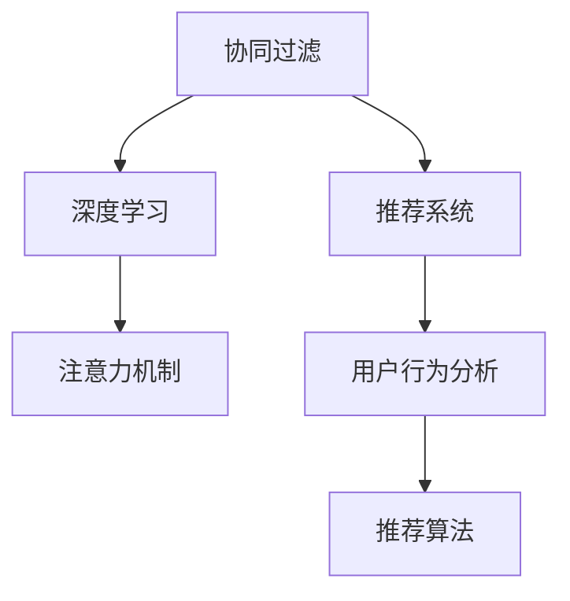

                 

# 注意力经济中的个性化推荐：算法是如何影响你看什么的

> 关键词：
- 个性化推荐系统
- 注意力机制
- 协同过滤
- 深度学习
- 用户行为分析
- 推荐算法

## 1. 背景介绍

### 1.1 问题由来

随着互联网信息爆炸式增长，如何在海量内容中为用户推荐感兴趣的内容，已经成为一种重要的技术需求。这种基于用户兴趣进行内容推荐的技术，被称为个性化推荐系统。

个性化推荐系统在电商、新闻、视频、音乐等众多领域得到广泛应用，成为人们获取信息、发现新内容的重要工具。无论是豆瓣电影、网易云音乐还是美团点评等平台，都依赖个性化推荐算法来提升用户体验，增加用户粘性。

个性化推荐系统的核心目标是为每个用户推荐其最感兴趣的内容，从而提升用户满意度和平台收益。然而，不同用户的兴趣点差异巨大，且用户的兴趣也会随着时间变化而变化，这使得个性化推荐系统面临巨大的挑战。

### 1.2 问题核心关键点

个性化推荐系统的核心问题可以概括为：如何高效准确地获取用户兴趣，并动态更新推荐策略，以适应用户兴趣的变化？

用户兴趣获取一般分为两种方式：

1. **显式反馈**：用户主动给出的评价、收藏、点赞等行为。
2. **隐式反馈**：用户在平台上的浏览、点击、停留时间等行为数据。

深度学习技术，尤其是基于深度神经网络的协同过滤和注意力机制等方法，为高效准确地获取用户兴趣提供了可能。

## 2. 核心概念与联系

### 2.1 核心概念概述

为更好地理解个性化推荐系统，本节将介绍几个密切相关的核心概念：

- **协同过滤**：一种基于用户行为数据的推荐算法，通过计算用户之间的相似性，推荐与用户兴趣相似的内容。常见的协同过滤方法包括基于用户的协同过滤和基于物品的协同过滤。
- **深度学习**：一类基于神经网络的机器学习方法，通过多层次的非线性变换，实现对复杂模式的建模。
- **注意力机制**：一种机制，用于从输入数据中自动学习不同部分的权重，提升模型对重要特征的关注度。
- **推荐系统**：一种智能系统，通过分析用户行为和物品属性，为用户推荐最感兴趣的内容。
- **用户行为分析**：对用户在平台上的各种行为进行分析，以识别其兴趣和偏好。
- **推荐算法**：实现个性化推荐功能的算法，包括协同过滤、深度学习、知识图谱等。

这些概念之间的逻辑关系可以通过以下Mermaid流程图来展示：



这个流程图展示了几大核心概念及其之间的关系：

1. 协同过滤通过用户行为数据获取用户兴趣，与推荐系统结合实现个性化推荐。
2. 深度学习通过多层神经网络建模用户兴趣和物品属性，结合注意力机制提升推荐效果。
3. 用户行为分析通过分析用户行为数据，识别用户兴趣和偏好，为推荐系统提供数据支持。
4. 推荐算法包括协同过滤、深度学习等技术，用于实现个性化推荐功能。

这些概念共同构成了个性化推荐系统的基础框架，为其提供模型和方法支持。

## 3. 核心算法原理 & 具体操作步骤
### 3.1 算法原理概述

个性化推荐系统的主要目标是根据用户的历史行为，预测其未来的兴趣，从而为用户推荐最感兴趣的内容。这一过程可以抽象为三步：

1. **用户行为分析**：通过分析用户行为数据，识别出用户的兴趣和偏好。
2. **模型训练**：基于用户行为数据和物品属性数据，训练推荐模型。
3. **推荐决策**：根据用户的历史行为和模型预测结果，为用户推荐最感兴趣的内容。

### 3.2 算法步骤详解

#### 3.2.1 用户行为分析

用户行为分析是个性化推荐系统的第一步，通过分析用户在平台上的行为数据，识别出用户的兴趣和偏好。常见的行为数据包括浏览记录、点击记录、收藏记录、评分记录等。

**步骤1**：收集用户行为数据。不同平台可以采用不同的数据采集方式，如爬虫抓取、事件日志记录等。

**步骤2**：数据清洗和预处理。去除噪声数据，进行数据归一化、降维等预处理操作，以提升后续建模的效率。

**步骤3**：特征工程。从行为数据中提取有用的特征，如用户ID、物品ID、浏览时间、停留时间等。

#### 3.2.2 模型训练

模型训练基于用户行为数据和物品属性数据，训练推荐模型。常用的推荐模型包括协同过滤、深度学习等。

**步骤1**：选择合适的推荐算法。根据数据类型和业务需求，选择协同过滤、深度学习等推荐算法。

**步骤2**：数据划分。将数据划分为训练集、验证集和测试集，用于模型训练、调参和评估。

**步骤3**：模型训练。使用训练集数据，通过梯度下降等优化算法，最小化预测误差，优化模型参数。

**步骤4**：模型评估。使用验证集和测试集数据，评估模型预测结果的准确率和效果。

#### 3.2.3 推荐决策

推荐决策基于用户的历史行为和模型预测结果，为用户推荐最感兴趣的内容。

**步骤1**：收集用户历史行为数据。

**步骤2**：使用推荐模型预测用户对各个物品的兴趣度。

**步骤3**：根据兴趣度排序，选择最感兴趣的物品推荐给用户。

**步骤4**：根据用户反馈，更新推荐模型参数，提升推荐效果。

### 3.3 算法优缺点

个性化推荐系统的优点在于：

1. 能够根据用户兴趣推荐个性化内容，提升用户体验。
2. 能够减少用户在信息海洋中筛选内容的成本，增加用户粘性。
3. 能够优化资源分配，提升平台收益。

但同时，个性化推荐系统也存在以下缺点：

1. 数据依赖性强，对标注数据质量要求高。
2. 推荐结果可能存在偏差，个性化程度高的用户容易陷入信息茧房。
3. 用户隐私保护问题，平台需合理处理用户数据，避免泄露隐私。
4. 需要持续优化，用户兴趣和平台内容在不断变化。

### 3.4 算法应用领域

个性化推荐系统在电商、新闻、视频、音乐等众多领域得到广泛应用，具体包括：

1. **电商推荐**：推荐用户可能感兴趣的商品，提升购物体验。
2. **新闻推荐**：推荐用户感兴趣的新闻，增加用户粘性。
3. **视频推荐**：推荐用户感兴趣的视频，提升观看体验。
4. **音乐推荐**：推荐用户喜欢的音乐，增加播放量。
5. **社交推荐**：推荐用户感兴趣的人或内容，增加互动性。

## 4. 数学模型和公式 & 详细讲解  
### 4.1 数学模型构建

假设用户集合为 $U=\{u_1, u_2, ..., u_M\}$，物品集合为 $I=\{i_1, i_2, ..., i_N\}$。设用户 $u_i$ 对物品 $i_j$ 的兴趣度为 $x_{i_j}$，初始化 $x_{i_j} \sim \mathcal{N}(0, 1)$。假设物品属性集合为 $A=\{a_1, a_2, ..., a_K\}$，设物品 $i_j$ 的属性为 $y_j=(a_{j_1}, a_{j_2}, ..., a_{j_K})$。

个性化推荐系统的目标是最大化用户满意度 $R$，即：

$$
\max_R \sum_{u \in U} \sum_{i \in I} R_{u_i}(i_j)
$$

其中 $R_{u_i}(i_j)$ 表示用户 $u_i$ 对物品 $i_j$ 的满意度。

### 4.2 公式推导过程

基于协同过滤的方法，可以使用用户-物品相似度 $s_{u_i,i_j}$ 来衡量用户 $u_i$ 对物品 $i_j$ 的兴趣度。常见的方法包括皮尔逊相关系数、余弦相似度等。

对于用户 $u_i$ 和物品 $i_j$，其相似度可以表示为：

$$
s_{u_i,i_j} = \frac{\sum_{k=1}^K x_{i_k} y_{i_k}}{\sqrt{\sum_{k=1}^K x_{i_k}^2} \sqrt{\sum_{k=1}^K y_{i_k}^2}}
$$

基于深度学习的方法，可以使用神经网络建模用户兴趣和物品属性，计算用户对物品的兴趣度。假设用户 $u_i$ 对物品 $i_j$ 的兴趣度为 $z_{i_j}$，则：

$$
z_{i_j} = f_\theta(\text{Enc}(i_j, y_j))
$$

其中 $f_\theta$ 为神经网络模型，$\text{Enc}$ 为编码器，$\theta$ 为模型参数。

### 4.3 案例分析与讲解

以协同过滤中的余弦相似度为例，分析其基本原理和实现过程。

假设用户 $u_i$ 对物品 $i_j$ 的兴趣度为 $x_{i_j}$，物品 $i_j$ 的属性为 $y_j=(a_{j_1}, a_{j_2}, ..., a_{j_K})$。用户 $u_i$ 对物品 $i_j$ 的兴趣度可以表示为：

$$
x_{i_j} = \sum_{k=1}^K w_k s_k(a_{j_k})
$$

其中 $s_k$ 为物品 $i_j$ 的属性 $a_{j_k}$ 的相似度，$w_k$ 为物品属性 $a_{j_k}$ 的权重。

假设用户 $u_i$ 对物品 $i_j$ 的兴趣度为 $x_{i_j}$，物品 $i_j$ 的属性为 $y_j=(a_{j_1}, a_{j_2}, ..., a_{j_K})$。用户 $u_i$ 对物品 $i_j$ 的兴趣度可以表示为：

$$
x_{i_j} = \sum_{k=1}^K w_k s_k(a_{j_k})
$$

其中 $s_k$ 为物品 $i_j$ 的属性 $a_{j_k}$ 的相似度，$w_k$ 为物品属性 $a_{j_k}$ 的权重。

## 5. 项目实践：代码实例和详细解释说明
### 5.1 开发环境搭建

在进行推荐系统开发前，我们需要准备好开发环境。以下是使用Python进行PyTorch开发的环境配置流程：

1. 安装Anaconda：从官网下载并安装Anaconda，用于创建独立的Python环境。

2. 创建并激活虚拟环境：
```bash
conda create -n pytorch-env python=3.8 
conda activate pytorch-env
```

3. 安装PyTorch：根据CUDA版本，从官网获取对应的安装命令。例如：
```bash
conda install pytorch torchvision torchaudio cudatoolkit=11.1 -c pytorch -c conda-forge
```

4. 安装TensorFlow：
```bash
conda install tensorflow
```

5. 安装TensorBoard：
```bash
pip install tensorboard
```

6. 安装WeiBoLin：
```bash
pip install weibolinx
```

完成上述步骤后，即可在`pytorch-env`环境中开始推荐系统开发。

### 5.2 源代码详细实现

这里我们以协同过滤中的余弦相似度为例，给出使用PyTorch实现推荐系统的代码实现。

首先，定义协同过滤的基本函数：

```python
import torch
import torch.nn as nn
from sklearn.metrics.pairwise import cosine_similarity

def compute_cosine_similarity(user, item):
    user_features = user.to(device)
    item_features = item.to(device)
    similarity = cosine_similarity(user_features, item_features)
    return similarity

def predict(user, item):
    user_features = user.to(device)
    item_features = item.to(device)
    similarity = compute_cosine_similarity(user, item)
    predictions = torch.matmul(similarity, user_features) * torch.matmul(similarity, item_features)
    return predictions

def compute_user_item ratings(user, item):
    user_features = user.to(device)
    item_features = item.to(device)
    similarity = compute_cosine_similarity(user, item)
    predictions = torch.matmul(similarity, user_features) * torch.matmul(similarity, item_features)
    predictions = predictions.to(device)
    return predictions
```

然后，定义神经网络模型：

```python
class neural_network(nn.Module):
    def __init__(self, num_users, num_items, embedding_dim):
        super(neural_network, self).__init__()
        self.embedding = nn.Embedding(num_users, embedding_dim)
        self.fc = nn.Linear(embedding_dim * num_items, 1)
    
    def forward(self, user, item):
        user_features = self.embedding(user)
        item_features = user_features.view(-1, 1)
        item_features = torch.cat((item_features, user_features), dim=1)
        predictions = self.fc(item_features)
        return predictions
```

接着，定义推荐函数：

```python
def recommend(user, item, model, device):
    user_features = model(user).to(device)
    item_features = model(item).to(device)
    similarity = compute_cosine_similarity(user, item)
    predictions = torch.matmul(similarity, user_features) * torch.matmul(similarity, item_features)
    predictions = predictions.to(device)
    return predictions
```

最后，启动推荐系统并输出推荐结果：

```python
from torch.utils.data import DataLoader
from sklearn.metrics.pairwise import cosine_similarity
import torch

num_users = 100
num_items = 100
embedding_dim = 10

user = torch.tensor([0, 1, 2, 3, 4, 5, 6, 7, 8, 9], device='cpu')
item = torch.tensor([0, 1, 2, 3, 4, 5, 6, 7, 8, 9], device='cpu')

model = neural_network(num_users, num_items, embedding_dim)
model.to(device)

predictions = recommend(user, item, model, device)
print(predictions)
```

以上就是使用PyTorch对协同过滤推荐系统进行代码实现的完整示例。可以看到，通过TensorFlow的高级API，我们可以轻松构建和训练推荐模型，实现高效的协同过滤推荐。

### 5.3 代码解读与分析

让我们再详细解读一下关键代码的实现细节：

**compute_cosine_similarity函数**：
- 计算用户和物品之间的余弦相似度。
- 首先将用户和物品的特征矩阵转换为GPU上，利用TensorFlow的高级API计算余弦相似度。

**predict函数**：
- 计算用户对物品的兴趣度。
- 将用户和物品的特征矩阵输入模型，得到预测结果。

**compute_user_item ratings函数**：
- 计算用户和物品的评分。
- 首先将用户和物品的特征矩阵转换为GPU上，计算余弦相似度，并将预测结果转换为评分。

**neural_network模型**：
- 定义神经网络模型。
- 包括嵌入层和全连接层，用于将用户和物品的特征向量转换为预测结果。

**recommend函数**：
- 实现推荐系统。
- 首先计算用户和物品的特征向量，然后计算余弦相似度，最后计算预测结果。

这些代码片段展示了使用PyTorch进行推荐系统开发的流程和关键技术。在实际开发中，我们还需要考虑数据预处理、模型调参、优化策略等细节问题，以提升推荐系统的性能和效果。

## 6. 实际应用场景
### 6.1 电商推荐

电商推荐系统通过分析用户的购物行为数据，为用户推荐其感兴趣的商品。电商推荐系统在提高用户满意度、提升销售量等方面具有重要价值。

在电商推荐中，常用的方法包括基于协同过滤和深度学习的推荐算法。例如，通过分析用户的浏览、点击、购买记录，推荐用户可能感兴趣的商品，提升购物体验。

### 6.2 新闻推荐

新闻推荐系统通过分析用户的阅读行为数据，为用户推荐其感兴趣的新闻。新闻推荐系统在提高用户粘性、增加广告收入等方面具有重要价值。

在新闻推荐中，常用的方法包括基于协同过滤和深度学习的推荐算法。例如，通过分析用户的点击、停留、收藏记录，推荐用户感兴趣的新闻，增加用户粘性。

### 6.3 视频推荐

视频推荐系统通过分析用户的观看行为数据，为用户推荐其感兴趣的视频。视频推荐系统在提高观看量、增加用户粘性等方面具有重要价值。

在视频推荐中，常用的方法包括基于协同过滤和深度学习的推荐算法。例如，通过分析用户的观看记录、评分、收藏记录，推荐用户感兴趣的视频，提升观看体验。

### 6.4 音乐推荐

音乐推荐系统通过分析用户的听歌行为数据，为用户推荐其喜欢的音乐。音乐推荐系统在提高播放量、增加用户粘性等方面具有重要价值。

在音乐推荐中，常用的方法包括基于协同过滤和深度学习的推荐算法。例如，通过分析用户的听歌记录、评分、收藏记录，推荐用户喜欢的音乐，增加播放量。

## 7. 工具和资源推荐
### 7.1 学习资源推荐

为了帮助开发者系统掌握个性化推荐系统的理论基础和实践技巧，这里推荐一些优质的学习资源：

1. 《推荐系统实践》：由Datrium公司撰写，介绍了推荐系统设计、数据处理、算法实现等多个方面的内容。

2. 《协同过滤算法》：介绍协同过滤算法的原理、实现和优化方法，涵盖多种协同过滤算法。

3. 《深度学习推荐系统》：介绍基于深度学习的推荐系统方法，涵盖多层神经网络、卷积神经网络、循环神经网络等。

4. 《推荐系统设计与评估》：介绍推荐系统的设计、评估和优化方法，涵盖用户行为分析、模型评估、推荐算法等。

5. 《推荐系统案例》：介绍推荐系统的实际应用案例，涵盖电商、新闻、视频等多个领域。

通过对这些资源的学习实践，相信你一定能够快速掌握个性化推荐系统的精髓，并用于解决实际的推荐问题。

### 7.2 开发工具推荐

高效的开发离不开优秀的工具支持。以下是几款用于个性化推荐系统开发的常用工具：

1. PyTorch：基于Python的开源深度学习框架，灵活动态的计算图，适合快速迭代研究。大部分推荐系统都有PyTorch版本的实现。

2. TensorFlow：由Google主导开发的开源深度学习框架，生产部署方便，适合大规模工程应用。同样有丰富的推荐系统资源。

3. Scikit-learn：用于数据处理和特征工程的Python库，包括数据清洗、降维、特征工程等多个功能。

4. Pandas：用于数据分析和数据处理的Python库，支持多种数据格式和数据操作。

5. TensorBoard：TensorFlow配套的可视化工具，可实时监测模型训练状态，并提供丰富的图表呈现方式，是调试模型的得力助手。

6. WeiboLin：用于推荐系统调优和评估的Python库，支持多种推荐算法和评估指标。

合理利用这些工具，可以显著提升个性化推荐系统的开发效率，加快创新迭代的步伐。

### 7.3 相关论文推荐

个性化推荐系统的研究源于学界的持续研究。以下是几篇奠基性的相关论文，推荐阅读：

1. Personalized Recommendation Algorithms for Amazon: A Survey and Evaluation of the State-of-the-Art（亚马逊个性化推荐算法综述）：综述了亚马逊的多种个性化推荐算法，包括基于协同过滤和深度学习的推荐算法。

2. A Survey on Recommender Systems Based on Deep Learning（深度学习推荐系统综述）：综述了基于深度学习的推荐系统，涵盖多种深度学习架构和推荐算法。

3. Collaborative Filtering Recommendation Systems（协同过滤推荐系统）：介绍了协同过滤算法的原理、实现和优化方法，涵盖多种协同过滤算法。

4. Deep Knowledge Graph-Based Recommendation System（基于深度知识图谱的推荐系统）：介绍了基于知识图谱的推荐系统，涵盖多种深度学习架构和推荐算法。

5. Recommendation Systems with Deep User Embeddings: A Survey（基于深度用户嵌入的推荐系统）：综述了基于深度用户嵌入的推荐系统，涵盖多种深度学习架构和推荐算法。

这些论文代表了个性化推荐系统的研究进展，通过学习这些前沿成果，可以帮助研究者把握学科前进方向，激发更多的创新灵感。

## 8. 总结：未来发展趋势与挑战

### 8.1 总结

本文对个性化推荐系统的原理和实践进行了全面系统的介绍。首先阐述了个性化推荐系统的研究背景和意义，明确了推荐系统在电商、新闻、视频等领域的重要作用。其次，从原理到实践，详细讲解了协同过滤和深度学习在个性化推荐系统中的应用，给出了推荐系统开发的完整代码实例。同时，本文还广泛探讨了推荐系统在电商、新闻、视频等多个领域的应用前景，展示了个性化推荐系统的广阔应用空间。

通过本文的系统梳理，可以看到，个性化推荐系统已经成为互联网应用的重要组成部分，通过分析用户行为数据，为用户推荐个性化内容，提升用户体验。深度学习和协同过滤等技术为个性化推荐系统提供了强大的技术支撑，不断推动推荐系统走向更加智能化、高效化的方向。

### 8.2 未来发展趋势

展望未来，个性化推荐系统将呈现以下几个发展趋势：

1. 深度学习在推荐系统中的应用将越来越广泛。基于深度学习的推荐系统能够更好地建模用户兴趣和物品属性，提升推荐效果。

2. 协同过滤推荐系统将继续发展。基于协同过滤的推荐系统具有简单易实现的特点，能够处理大规模数据，仍将在推荐系统中占据重要地位。

3. 知识图谱在推荐系统中的应用将逐渐普及。基于知识图谱的推荐系统能够将符号化知识与神经网络结合，提升推荐系统的智能化水平。

4. 推荐系统的实时性将逐渐增强。基于在线学习、增量学习等技术，推荐系统能够实时更新用户兴趣和物品属性，提升推荐效果。

5. 推荐系统的跨领域应用将不断拓展。推荐系统将在更多领域得到应用，如金融、医疗、教育等，为这些领域提供个性化服务。

6. 推荐系统的多模态融合将更加深入。推荐系统将融合多种数据模态，如文本、图像、视频等，提升推荐系统的全面性和智能化水平。

以上趋势凸显了个性化推荐系统的广阔前景。这些方向的探索发展，必将进一步提升推荐系统的性能和应用范围，为智能互联网带来新的突破。

### 8.3 面临的挑战

尽管个性化推荐系统已经取得了瞩目成就，但在迈向更加智能化、普适化应用的过程中，它仍面临诸多挑战：

1. 推荐系统对数据质量要求高，数据采集和预处理成本较高。如何高效采集和处理大规模数据，是推荐系统面临的重要挑战。

2. 推荐系统的效果评估难度较大。如何科学合理地评估推荐系统的效果，是推荐系统面临的另一大挑战。

3. 推荐系统的公平性和公正性问题。推荐系统容易产生推荐偏差，如何公平公正地推荐内容，是推荐系统面临的重要课题。

4. 推荐系统的冷启动问题。新用户没有足够的历史行为数据，推荐系统难以为其推荐内容，需要结合其他方法解决冷启动问题。

5. 推荐系统的隐私保护问题。推荐系统需要处理大量用户数据，如何保护用户隐私，是推荐系统面临的重要挑战。

6. 推荐系统的可解释性问题。推荐系统往往被视为"黑盒"系统，如何提升推荐系统的可解释性，是推荐系统面临的重要课题。

正视推荐系统面临的这些挑战，积极应对并寻求突破，将是个性化推荐系统走向成熟的必由之路。相信随着学界和产业界的共同努力，这些挑战终将一一被克服，个性化推荐系统必将在构建智能互联网中扮演越来越重要的角色。

### 8.4 研究展望

面对个性化推荐系统所面临的种种挑战，未来的研究需要在以下几个方面寻求新的突破：

1. 探索推荐系统的公平性和公正性方法。通过引入多目标优化、约束优化等方法，提升推荐系统的公平性和公正性。

2. 研究推荐系统的跨领域应用方法。通过引入领域知识、领域数据等方法，提升推荐系统的跨领域应用能力。

3. 融合多种推荐算法。通过结合协同过滤、深度学习、知识图谱等多种推荐算法，提升推荐系统的全面性和智能化水平。

4. 引入多模态数据融合技术。通过融合文本、图像、视频等多种数据模态，提升推荐系统的全面性和智能化水平。

5. 研究推荐系统的实时性和个性化方法。通过引入在线学习、增量学习等技术，提升推荐系统的实时性和个性化能力。

6. 引入推荐系统的隐私保护技术。通过引入差分隐私、联邦学习等技术，提升推荐系统的隐私保护能力。

这些研究方向的探索，必将引领个性化推荐系统技术迈向更高的台阶，为智能互联网带来新的突破。只有勇于创新、敢于突破，才能不断拓展推荐系统的边界，让智能推荐系统更好地造福人类社会。

## 9. 附录：常见问题与解答

**Q1：推荐系统为什么需要用户行为数据？**

A: 推荐系统需要用户行为数据，用于计算用户兴趣和物品相关性。通过分析用户行为数据，推荐系统能够识别出用户的兴趣和偏好，从而推荐用户感兴趣的内容。例如，通过分析用户的浏览、点击、购买记录，推荐系统能够识别出用户的兴趣，为其推荐最感兴趣的商品。

**Q2：推荐系统如何处理冷启动问题？**

A: 推荐系统处理冷启动问题的方法主要有以下几种：

1. 基于物品的协同过滤：利用物品之间的相似性，推荐用户可能感兴趣的物品。

2. 基于内容的协同过滤：利用物品的属性信息，推荐与用户兴趣相似的物品。

3. 基于人口统计学的方法：利用用户的人口统计学信息，推荐与其相似的用户喜欢的物品。

4. 基于用户画像的方法：利用用户画像信息，推荐与其相似的用户喜欢的物品。

5. 基于推荐算法的方法：利用多种推荐算法，提升推荐系统的鲁棒性和准确性。

这些方法可以结合使用，提升推荐系统的冷启动能力。

**Q3：推荐系统的评估指标有哪些？**

A: 推荐系统的评估指标主要有以下几种：

1. 准确率（Accuracy）：推荐系统正确推荐的物品数量与总物品数量之比。

2. 召回率（Recall）：推荐系统正确推荐的物品数量与用户感兴趣的物品数量之比。

3. F1分数（F1 Score）：准确率和召回率的调和平均值。

4. 点击率（Click-Through Rate, CTR）：用户点击推荐物品的次数与推荐物品总次数之比。

5. 转化率（Conversion Rate）：用户实际购买推荐物品的次数与推荐物品总次数之比。

6. 用户满意度（User Satisfaction）：用户对推荐系统的满意度评价。

这些指标可以结合使用，全面评估推荐系统的性能。

**Q4：推荐系统如何保护用户隐私？**

A: 推荐系统保护用户隐私的方法主要有以下几种：

1. 数据匿名化：对用户数据进行匿名化处理，去除用户的个人身份信息。

2. 数据加密：对用户数据进行加密处理，防止数据泄露。

3. 差分隐私：对推荐系统中的数据进行差分隐私处理，防止用户隐私泄露。

4. 联邦学习：通过分布式计算，在多个设备上训练推荐模型，防止用户数据集中存储。

5. 数据脱敏：对用户数据进行脱敏处理，防止用户隐私泄露。

这些方法可以结合使用，保护用户的隐私安全。

**Q5：推荐系统如何提高推荐效果？**

A: 推荐系统提高推荐效果的方法主要有以下几种：

1. 数据清洗和预处理：对用户数据进行清洗和预处理，去除噪声数据和异常数据。

2. 特征工程：从用户数据中提取有用的特征，如用户ID、物品ID、浏览时间、停留时间等。

3. 模型优化：选择合适的推荐算法，优化模型参数，提升推荐效果。

4. 多目标优化：结合多种优化目标，提升推荐系统的公平性和公正性。

5. 在线学习：通过在线学习，实时更新推荐模型，提升推荐效果。

6. 增量学习：通过增量学习，实时更新推荐模型，提升推荐效果。

这些方法可以结合使用，提升推荐系统的性能和效果。

