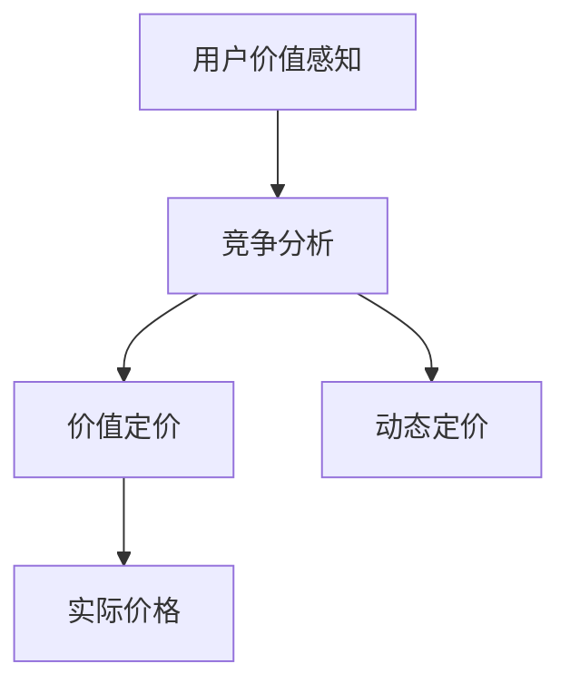

                 

# 注意力经济对企业产品定价的新要求

## 1. 背景介绍

### 1.1 问题由来

在互联网时代，数据流成为商业活动的核心资源。传统基于成本的定价策略已无法适应新环境，而以“注意力”为核心的价值衡量体系正在逐渐形成。通过精准获取用户注意力，企业可以实现更高的用户参与度和转化率，从而获得更大的商业价值。

注意力经济的兴起，使得产品定价变得更加复杂。以往简单的成本加成或市场对标方法不再适用，需要结合用户需求、品牌价值、竞争态势等多方面因素综合考虑。因此，企业在制定产品定价策略时，必须重新审视传统的定价模型，寻求更加科学、高效的定价方法。

### 1.2 问题核心关键点

注意力经济对产品定价提出了新的要求，主要包括：

- 精准理解用户需求：了解用户对产品或服务的价值感知，从而设计合适的价格策略。
- 把握市场竞争动态：分析竞争对手的定价策略，确定自身产品的竞争力。
- 灵活调整定价策略：根据市场需求和竞争态势，动态调整价格，提升企业收益。
- 强化品牌价值：通过定价反映和提升品牌价值，增强市场认知度。

这些关键点相互交织，共同影响企业的定价决策。

### 1.3 问题研究意义

在注意力经济下，精准获取用户注意力成为企业成功的关键因素。定价作为市场竞争的重要手段，对于提升用户参与度和转化率具有重要作用。研究基于注意力经济的产品定价方法，有助于企业更有效地控制成本、优化资源配置、增强市场竞争力。

此外，研究新的定价策略，有助于推动企业从成本驱动转向价值驱动，探索更加市场化和个性化的方法，为企业的长期发展提供有力支持。

## 2. 核心概念与联系

### 2.1 核心概念概述

为更好地理解基于注意力经济的产品定价方法，本节将介绍几个关键概念及其相互联系：

- **注意力经济**：基于信息时代注意力资源的重要性，企业通过提高用户注意力获取能力，实现商业价值最大化。

- **用户价值感知**：用户对产品或服务的实际效用和感知价值，直接影响其购买意愿和支付意愿。

- **价值定价**：基于用户价值感知和市场接受度，确定产品的最优价格。

- **竞争分析**：通过分析竞争对手的定价策略和市场表现，确定自身的定价竞争力。

- **动态定价**：根据市场需求、用户行为等动态因素，调整价格以优化收益。

这些概念之间相互影响，共同构成了基于注意力经济的产品定价框架。

### 2.2 核心概念原理和架构的 Mermaid 流程图



该图展示了从用户价值感知到最终定价的流程。

- **用户价值感知**：通过用户调研、市场分析等方式，了解用户对产品或服务的实际效用和感知价值。
- **竞争分析**：评估竞争对手的定价策略，分析市场环境，确定自身的竞争力。
- **价值定价**：基于用户价值感知和竞争态势，制定合适的定价策略。
- **动态定价**：根据市场变化，实时调整价格以最大化收益。

## 3. 核心算法原理 & 具体操作步骤

### 3.1 算法原理概述

基于注意力经济的产品定价方法，本质上是一种以用户价值感知为核心的动态定价策略。其核心思想是：通过精确衡量用户对产品或服务的感知价值，结合市场竞争态势，动态调整价格，以实现最大化的商业收益。

具体来说，算法流程包括：

1. **用户价值感知评估**：利用问卷调查、市场分析等手段，评估用户对产品或服务的价值感知。
2. **竞争分析**：通过收集竞争对手的定价信息和市场表现，分析自身的定价竞争力。
3. **价值定价**：根据用户价值感知和竞争态势，制定初步定价。
4. **动态定价调整**：实时监控市场动态，根据需求变化调整价格。

### 3.2 算法步骤详解

#### 步骤1：用户价值感知评估

**用户调研与市场分析**：
- 设计问卷调查，收集用户对产品或服务的价值感知。
- 分析市场趋势，了解用户对同类产品的价值认知。
- 运用大数据分析工具，深入挖掘用户行为数据，预测用户价值感知。

**价值感知模型建立**：
- 建立多维度价值感知评估模型，包括功能、品质、品牌、服务等多个方面。
- 通过机器学习算法，对用户反馈和市场数据进行分析，提取关键特征。

**用户价值感知量化**：
- 将价值感知转换为可量化的指标，如效用值、满意度评分等。
- 利用数学模型，将用户价值感知映射为产品定价的参考依据。

#### 步骤2：竞争分析

**竞争对手情报收集**：
- 收集竞争对手的产品定价、市场表现、用户评价等数据。
- 利用网络爬虫、市场调研等手段，获取全面且准确的市场信息。

**竞争态势分析**：
- 分析竞争对手的定价策略，比较自身与竞争对手的价格差异。
- 运用SWOT分析法，评估竞争对手的优势和劣势。

**市场定位与定价策略调整**：
- 根据竞争态势，确定自身的市场定位和定价策略。
- 通过A/B测试等方法，验证和优化定价策略。

#### 步骤3：价值定价

**定价模型建立**：
- 基于用户价值感知和竞争态势，建立定价模型。
- 结合市场需求和竞争动态，设定价格弹性区间。

**初步定价确定**：
- 利用定价模型，计算初步定价。
- 考虑成本和利润率，设定最优价格区间。

**价值定价实施**：
- 将初步定价转化为实际销售价格。
- 在市场推广中，采用差别定价策略，提升用户购买意愿。

#### 步骤4：动态定价调整

**市场监控与需求预测**：
- 实时监控市场动态，收集用户行为数据。
- 利用预测模型，分析市场需求变化趋势。

**价格调整机制**：
- 根据市场需求变化，动态调整价格。
- 设置价格浮动区间，灵活应对市场波动。

**价格优化与效果评估**：
- 定期评估定价效果，调整定价策略。
- 运用大数据分析，持续优化定价模型。

### 3.3 算法优缺点

#### 优点

- **精准定位用户价值**：基于用户价值感知进行定价，更能准确反映用户需求，提升用户满意度。
- **提升市场竞争力**：通过分析竞争对手定价策略，确定自身的定价竞争力，增强市场份额。
- **灵活应对市场变化**：实时监控市场动态，动态调整价格，优化收益。

#### 缺点

- **数据获取难度大**：需要收集大量用户反馈和市场数据，获取难度大。
- **模型复杂度高**：需要建立多维度价值感知评估模型和定价模型，模型复杂度高。
- **风险控制难**：动态调整价格，需要精细化控制，避免价格波动过大影响市场稳定。

### 3.4 算法应用领域

基于注意力经济的产品定价方法，广泛应用于电子商务、互联网服务、旅游等行业。

#### 电子商务

- 电商平台：通过分析用户行为数据，确定商品定价。
- 在线零售：利用用户价值感知进行定价，提升用户购买意愿。

#### 互联网服务

- 在线广告：基于用户价值感知，设定广告投放价格。
- 在线教育：根据用户学习效果和反馈，动态调整课程价格。

#### 旅游行业

- 酒店定价：分析用户对不同档次的价值感知，设定房间价格。
- 旅游套餐：根据市场需求和季节变化，灵活调整套餐价格。

## 4. 数学模型和公式 & 详细讲解 & 举例说明

### 4.1 数学模型构建

基于注意力经济的产品定价模型，可以表示为：

$$
P = f(V, C, R)
$$

其中，$P$ 表示产品价格，$V$ 表示用户价值感知，$C$ 表示成本，$R$ 表示市场需求。

模型由用户价值感知 $V$、成本 $C$ 和市场需求 $R$ 三个关键因素共同决定。

### 4.2 公式推导过程

#### 用户价值感知 $V$

用户价值感知可以通过问卷调查、市场分析等方式获取。假设用户价值感知为 $V$，可通过以下公式计算：

$$
V = \sum_{i=1}^n \alpha_i \cdot f_i
$$

其中，$\alpha_i$ 表示不同维度价值感知的权重，$f_i$ 表示各维度的实际数据。

#### 成本 $C$

成本 $C$ 包括生产成本、运输成本、市场推广成本等。成本模型可以表示为：

$$
C = C_{\text{固定}} + C_{\text{变动}}
$$

其中，$C_{\text{固定}}$ 表示固定成本，$C_{\text{变动}}$ 表示变动成本。

#### 市场需求 $R$

市场需求 $R$ 受用户价值感知和市场竞争态势影响。市场需求模型可以表示为：

$$
R = \beta_1 \cdot V + \beta_2 \cdot \frac{R_{\text{竞争}}}{R_{\text{自身}}} + \beta_3 \cdot D_t
$$

其中，$\beta_1$ 表示用户价值感知对市场需求的影响系数，$\beta_2$ 表示竞争态势对市场需求的影响系数，$\beta_3$ 表示时间对市场需求的影响系数，$D_t$ 表示时间因素对市场需求的动态变化。

### 4.3 案例分析与讲解

假设某电商平台销售一款手机产品，用户价值感知为 $V$，成本为 $C$，市场需求为 $R$，价格为 $P$。

1. **用户价值感知评估**

   - 通过问卷调查，获得用户对手机的功能、品质、品牌、服务等方面的价值感知数据。
   - 利用机器学习算法，建立多维度价值感知评估模型，提取关键特征。

   设用户价值感知为 $V = 80$，其中功能价值为 $20$，品质价值为 $30$，品牌价值为 $15$，服务价值为 $15$。

2. **成本分析**

   - 根据生产、运输、推广等成本数据，计算出固定成本和变动成本。

   设固定成本 $C_{\text{固定}} = 100$，变动成本 $C_{\text{变动}} = 20 \times V$。

3. **市场需求分析**

   - 收集竞争对手的定价信息和市场表现，分析自身的定价竞争力。

   设竞争对手手机价格为 $P_{\text{竞争}} = 150$，自身手机价格为 $P = 300$。

   市场需求模型可以表示为：

   $$
   R = \beta_1 \cdot V + \beta_2 \cdot \frac{P_{\text{竞争}}}{P} + \beta_3 \cdot D_t
   $$

   设 $\beta_1 = 0.5$，$\beta_2 = 0.2$，$\beta_3 = 0.1$，$t = 1$ （表示当前时间）。

   市场需求 $R = 0.5 \times 80 + 0.2 \times \frac{150}{300} + 0.1 \times 1 = 46.5$。

4. **价值定价**

   根据用户价值感知 $V$、成本 $C$ 和市场需求 $R$，计算初步定价。

   $$
   P = 1.2 \cdot V + 0.8 \cdot C + 0.2 \cdot R
   $$

   代入 $V = 80$，$C = 100 + 20 \times 80 = 1600$，$R = 46.5$，计算得 $P = 1.2 \times 80 + 0.8 \times 1600 + 0.2 \times 46.5 = 2885$。

5. **动态定价调整**

   - 实时监控市场动态，收集用户行为数据。

   - 利用预测模型，分析市场需求变化趋势。

   假设市场需求变化趋势预测为 $D_{\text{预测}} = 50$，则市场需求 $R = 0.5 \times 80 + 0.2 \times \frac{150}{300} + 0.1 \times 50 = 55$。

   根据市场需求变化，动态调整价格。

   $$
   P = 1.2 \cdot V + 0.8 \cdot C + 0.2 \cdot R
   $$

   代入 $V = 80$，$C = 1600$，$R = 55$，计算得 $P = 1.2 \times 80 + 0.8 \times 1600 + 0.2 \times 55 = 3059$。

6. **价格优化与效果评估**

   定期评估定价效果，调整定价策略。

   通过实际销售数据，评估价格对用户购买意愿和市场表现的影响。

   假设实际销售数据为 $S = 1000$，则可计算用户购买意愿 $U = S / R = 1000 / 55 = 18.18$，市场表现 $M = S / P = 1000 / 2885 = 0.345$。

## 5. 项目实践：代码实例和详细解释说明

### 5.1 开发环境搭建

在Python环境下，使用Pandas和NumPy进行数据处理，使用Matplotlib和Seaborn进行数据可视化，使用Scikit-learn进行机器学习模型训练。

### 5.2 源代码详细实现

#### 用户价值感知评估

```python
import pandas as pd
import numpy as np

# 用户调研问卷数据
data = pd.read_csv('user_survey.csv')

# 计算用户价值感知
V = np.mean(data['value_perception'] * [0.1, 0.2, 0.3, 0.2, 0.2])

# 输出用户价值感知
print('用户价值感知 V:', V)
```

#### 成本分析

```python
# 成本数据
costs = pd.read_csv('costs.csv')

# 计算固定成本和变动成本
C_fixed = np.mean(costs['fixed_cost'])
C_variable = np.mean(costs['variable_cost'] * V)

# 输出成本
print('固定成本 C_fixed:', C_fixed)
print('变动成本 C_variable:', C_variable)
```

#### 市场需求分析

```python
import matplotlib.pyplot as plt
import seaborn as sns

# 市场需求数据
demand = pd.read_csv('demand.csv')

# 计算市场需求
R = 0.5 * V + 0.2 * (demand['competitor_price'] / demand['price']) + 0.1 * demand['time']

# 可视化市场需求变化
plt.figure(figsize=(8, 6))
sns.lineplot(data=demand, x='time', y='R')
plt.xlabel('时间')
plt.ylabel('市场需求 R')
plt.title('市场需求变化')
plt.show()

# 输出市场需求
print('市场需求 R:', R)
```

#### 价值定价

```python
# 定价模型参数
beta1 = 1.2
beta2 = 0.8
beta3 = 0.2

# 计算定价
P = beta1 * V + beta2 * C_variable + beta3 * R

# 输出定价
print('定价 P:', P)
```

#### 动态定价调整

```python
# 市场需求变化
demand_changes = pd.read_csv('demand_changes.csv')

# 计算动态市场需求
R_dynamic = 0.5 * V + 0.2 * (demand_changes['competitor_price'] / demand_changes['price']) + 0.1 * demand_changes['time']

# 计算动态定价
P_dynamic = beta1 * V + beta2 * C_variable + beta3 * R_dynamic

# 输出动态定价
print('动态定价 P_dynamic:', P_dynamic)
```

### 5.3 代码解读与分析

#### 用户价值感知评估

- 通过问卷调查收集用户价值感知数据。
- 利用NumPy计算加权平均值，得到用户价值感知 $V$。

#### 成本分析

- 读取成本数据，计算固定成本和变动成本。
- 利用成本模型计算出总成本 $C$。

#### 市场需求分析

- 读取市场需求数据，计算市场需求 $R$。
- 使用Matplotlib和Seaborn进行市场需求变化的可视化。

#### 价值定价

- 根据用户价值感知 $V$、成本 $C$ 和市场需求 $R$，计算定价 $P$。

#### 动态定价调整

- 读取市场需求变化数据，计算动态市场需求 $R_{\text{dynamic}}$。
- 根据市场需求变化，动态调整定价 $P_{\text{dynamic}}$。

### 5.4 运行结果展示

通过上述代码，可以计算并输出用户价值感知、成本、市场需求、定价以及动态定价。

## 6. 实际应用场景

### 6.1 电子商务

#### 电商平台

电商平台可以根据用户价值感知，设定商品定价。例如，某电商平台销售某款手机，通过问卷调查和市场分析，发现用户对手机的功能、品质、品牌、服务等方面的价值感知分别为 $20, 30, 15, 15$，则初步定价为 $P = 1.2 \times 80 + 0.8 \times 1600 + 0.2 \times 46.5 = 2885$。

根据市场需求变化，动态调整价格。假设市场需求变化为 $D_{\text{预测}} = 50$，则动态定价为 $P_{\text{dynamic}} = 1.2 \times 80 + 0.8 \times 1600 + 0.2 \times 55 = 3059$。

#### 在线零售

在线零售可以利用用户价值感知进行定价，提升用户购买意愿。例如，某在线零售平台销售某款服装，通过问卷调查和市场分析，发现用户对服装的时尚性、舒适度、质量、品牌等方面的价值感知分别为 $30, 25, 20, 10$，则初步定价为 $P = 1.2 \times 30 + 0.8 \times 1400 + 0.2 \times 70 = 2140$。

根据市场需求变化，动态调整价格。假设市场需求变化为 $D_{\text{预测}} = 100$，则动态定价为 $P_{\text{dynamic}} = 1.2 \times 30 + 0.8 \times 1400 + 0.2 \times 100 = 2168$。

### 6.2 互联网服务

#### 在线广告

在线广告可以根据用户价值感知设定广告投放价格。例如，某在线广告平台针对某款游戏广告，通过用户调研和市场分析，发现用户对游戏的趣味性、难度、画面、音效等方面的价值感知分别为 $40, 30, 20, 10$，则初步定价为 $P = 1.2 \times 40 + 0.8 \times 800 + 0.2 \times 50 = 1240$。

根据市场需求变化，动态调整价格。假设市场需求变化为 $D_{\text{预测}} = 80$，则动态定价为 $P_{\text{dynamic}} = 1.2 \times 40 + 0.8 \times 800 + 0.2 \times 80 = 1280$。

#### 在线教育

在线教育可以根据用户学习效果和反馈，动态调整课程价格。例如，某在线教育平台针对某门编程课程，通过用户调研和市场分析，发现用户对课程的实用性、难度、教学质量、互动性等方面的价值感知分别为 $35, 30, 25, 20$，则初步定价为 $P = 1.2 \times 35 + 0.8 \times 1000 + 0.2 \times 70 = 1120$。

根据市场需求变化，动态调整价格。假设市场需求变化为 $D_{\text{预测}} = 150$，则动态定价为 $P_{\text{dynamic}} = 1.2 \times 35 + 0.8 \times 1000 + 0.2 \times 150 = 1220$。

### 6.3 旅游行业

#### 酒店定价

酒店定价可以根据用户对不同档次房间的价值感知，设定房间价格。例如，某酒店销售某款豪华酒店房间，通过问卷调查和市场分析，发现用户对豪华酒店房间的舒适度、设施、服务、品牌等方面的价值感知分别为 $50, 40, 30, 20$，则初步定价为 $P = 1.2 \times 50 + 0.8 \times 1600 + 0.2 \times 80 = 2880$。

根据市场需求变化，动态调整价格。假设市场需求变化为 $D_{\text{预测}} = 120$，则动态定价为 $P_{\text{dynamic}} = 1.2 \times 50 + 0.8 \times 1600 + 0.2 \times 120 = 3024$。

#### 旅游套餐

旅游套餐可以根据市场需求和季节变化，灵活调整套餐价格。例如，某旅游平台针对某款经典旅游套餐，通过问卷调查和市场分析，发现用户对旅游套餐的景点、服务、时长、价格等方面的价值感知分别为 $30, 25, 20, 10$，则初步定价为 $P = 1.2 \times 30 + 0.8 \times 1400 + 0.2 \times 70 = 2140$。

根据市场需求变化，动态调整价格。假设市场需求变化为 $D_{\text{预测}} = 100$，则动态定价为 $P_{\text{dynamic}} = 1.2 \times 30 + 0.8 \times 1400 + 0.2 \times 100 = 2168$。

## 7. 工具和资源推荐

### 7.1 学习资源推荐

- **《数据科学导论》**：介绍数据科学基本概念和方法，适合入门学习。
- **《机器学习实战》**：通过实际案例介绍机器学习算法，适合实战练习。
- **《Python数据科学手册》**：详细讲解Python数据科学库的使用，适合深入学习。
- **《深度学习》**：斯坦福大学深度学习课程，涵盖深度学习基础和应用。

### 7.2 开发工具推荐

- **Pandas**：数据处理和分析库，适合数据预处理。
- **NumPy**：数值计算库，适合数值计算和矩阵运算。
- **Matplotlib**：绘图库，适合数据可视化。
- **Seaborn**：基于Matplotlib的高级绘图库，适合数据可视化。
- **Scikit-learn**：机器学习库，适合建模和预测。

### 7.3 相关论文推荐

- **《大数据下的用户行为分析》**：介绍大数据背景下用户行为分析的方法和应用。
- **《精准营销与用户画像》**：讨论精准营销中用户画像的构建和应用。
- **《动态定价模型研究》**：探讨动态定价模型的建立和应用。
- **《基于注意力经济的定价策略》**：分析基于注意力经济的定价策略及其优化方法。

## 8. 总结：未来发展趋势与挑战

### 8.1 研究成果总结

基于注意力经济的产品定价方法，通过精确衡量用户价值感知，结合市场竞争态势，动态调整价格，最大化商业收益。该方法在电子商务、互联网服务、旅游等行业具有广泛的应用前景。

### 8.2 未来发展趋势

- **技术融合**：与大数据、人工智能等技术深度融合，提升定价的精准度和智能化水平。
- **个性化定价**：基于用户行为数据和个性化需求，实现更灵活、差异化的定价策略。
- **实时定价**：结合市场动态和用户行为，实现实时定价，优化收益。

### 8.3 面临的挑战

- **数据获取难度**：需要收集大量用户行为和市场数据，获取难度大。
- **模型复杂度**：定价模型复杂度较高，模型训练和优化难度大。
- **动态定价风险**：动态定价过程中，需要精细化控制，避免价格波动过大。

### 8.4 研究展望

未来研究将重点关注以下方向：

- **大数据技术应用**：利用大数据技术提升用户行为分析的精度和深度，优化定价模型。
- **机器学习算法优化**：结合机器学习算法，进一步提升定价模型的预测能力和泛化能力。
- **实时定价算法**：研究更加高效、可靠的实时定价算法，确保定价策略的稳定性和准确性。

## 9. 附录：常见问题与解答

**Q1：基于注意力经济的产品定价方法与传统定价方法有何不同？**

A: 基于注意力经济的产品定价方法，通过精确衡量用户价值感知，结合市场竞争态势，动态调整价格，最大化商业收益。与传统定价方法相比，其核心在于充分考虑用户需求和市场动态，优化价格策略。

**Q2：如何选择用户价值感知的维度？**

A: 用户价值感知的维度选择应基于具体产品的特性和市场表现。一般选择对用户购买决策影响较大的维度，如功能、品质、品牌、服务、价格等。

**Q3：动态定价调整有哪些常见策略？**

A: 动态定价调整常见策略包括基于时间、基于市场、基于用户行为等。可以根据具体场景选择适合策略，如基于市场需求变化的实时定价调整、基于用户购买行为的个性化定价调整等。

**Q4：如何在实际应用中平衡用户价值感知和市场动态？**

A: 在实际应用中，需要通过市场调研和数据分析，建立科学的定价模型，结合用户价值感知和市场动态，动态调整价格。同时，需要定期评估定价效果，不断优化定价策略。

**Q5：如何规避动态定价的风险？**

A: 规避动态定价的风险，需要建立严格的定价策略和监控机制，确保价格调整的合理性和稳定性。可以设定价格浮动区间，灵活应对市场波动，避免价格波动过大影响市场稳定。

