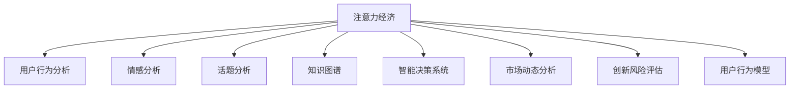

                 

# 注意力经济对企业创新管理的影响

> 关键词：注意力经济,创新管理,知识图谱,智能决策,风险评估,市场动态分析

## 1. 背景介绍

### 1.1 问题由来

随着互联网的普及和数字经济的发展，注意力经济（Economy of Attention）已成为各行各业，尤其是内容产业、广告营销、在线教育、电子商务等领域的核心竞争要素。数据驱动的决策、个性化推荐、定向营销等策略的广泛应用，使企业越来越依赖于对用户注意力的精准捕捉和高效管理。

然而，如何有效管理海量用户注意力资源，从而实现业务创新和优化，成为了当前企业关注的焦点。本文将从注意力经济的角度，探讨其对企业创新管理的影响，重点介绍基于注意力经济的企业创新管理模型构建，并展望未来发展趋势与面临的挑战。

### 1.2 问题核心关键点

1. **注意力经济定义**：指在数字时代，注意力资源的价值远超传统资源，成为驱动企业创新的关键因素。企业通过优化注意力获取、使用和管理，来提升市场竞争力。

2. **注意力管理工具**：包括用户行为分析、情感分析、关键词提取、话题分析等技术，帮助企业了解用户注意力分布和变化趋势，以便调整营销策略、优化产品设计。

3. **智能决策系统**：结合大数据分析和机器学习技术，企业可以构建智能决策系统，自动优化资源配置、精准投放广告、预测市场变化，实现数据驱动的决策。

4. **市场动态分析**：通过实时监测和分析市场动态，企业能够及时响应市场需求变化，制定灵活的市场策略。

5. **创新风险评估**：利用注意力经济数据，评估新项目的创新风险和市场潜力，辅助企业决策。

6. **用户行为模型**：通过建模用户行为，预测用户未来行为，优化用户体验，提升用户忠诚度。

这些关键点构成了注意力经济与企业创新管理的核心概念，本文将围绕这些点，深入探讨其在企业创新管理中的应用。

## 2. 核心概念与联系

### 2.1 核心概念概述

#### 2.1.1 注意力经济

注意力经济强调在数字时代，注意力成为企业最宝贵的资源之一。企业通过精准获取和高效管理用户注意力，来优化资源配置，提升产品和服务质量，从而实现业务创新和增长。

#### 2.1.2 用户行为分析

用户行为分析（User Behavior Analysis, UBA）通过收集和分析用户在网络上的行为数据，了解其兴趣偏好、使用习惯等，为个性化推荐、精准营销等策略提供数据支持。

#### 2.1.3 情感分析

情感分析（Sentiment Analysis, SA）通过自然语言处理（NLP）技术，识别用户对产品、服务、品牌等情感态度，用于市场舆情监控、用户满意度评估等。

#### 2.1.4 话题分析

话题分析（Topic Analysis, TA）通过对文本内容进行分类和聚类，识别出热门话题和趋势，用于内容策划、热点跟踪等。

#### 2.1.5 知识图谱

知识图谱（Knowledge Graph）是将结构化、半结构化、非结构化数据组织成图形结构，支持语义搜索和关联分析，广泛应用于智能问答、推荐系统、风险评估等。

#### 2.1.6 智能决策系统

智能决策系统（Intelligent Decision System, IDS）结合大数据分析和机器学习技术，实现自动化决策，提高决策效率和准确性。

#### 2.1.7 市场动态分析

市场动态分析（Market Dynamics Analysis, MDA）通过实时监测和分析市场数据，了解市场变化趋势，辅助企业制定灵活的市场策略。

#### 2.1.8 创新风险评估

创新风险评估（Innovation Risk Assessment, IRA）通过分析市场、技术、竞争等因素，评估新项目的创新风险和市场潜力，帮助企业优化决策。

#### 2.1.9 用户行为模型

用户行为模型（User Behavior Model, UBM）通过建模用户行为，预测用户未来行为，优化用户体验，提升用户忠诚度。

以上核心概念构成了注意力经济与企业创新管理的基本框架，通过综合应用这些工具和技术，企业可以实现对用户注意力的精准捕捉和高效管理，提升创新能力和市场竞争力。

### 2.2 核心概念原理和架构的 Mermaid 流程图



## 3. 核心算法原理 & 具体操作步骤

### 3.1 算法原理概述

基于注意力经济的企业创新管理，本质上是通过数据驱动的分析和决策，来优化用户注意力资源的获取和利用，从而实现业务创新。其核心算法包括用户行为分析、情感分析、话题分析、知识图谱构建和智能决策等。

### 3.2 算法步骤详解

#### 3.2.1 用户行为分析

1. **数据采集**：通过爬虫技术、API接口等方式，采集用户行为数据，如点击率、停留时间、购买记录等。

2. **数据清洗**：去除噪音数据、处理缺失值，确保数据质量。

3. **特征提取**：提取有价值的用户行为特征，如兴趣标签、使用频率、地理位置等。

4. **建模分析**：使用统计学和机器学习算法，建立用户行为模型，如协同过滤、内容推荐等。

#### 3.2.2 情感分析

1. **情感标注**：使用情感词典、情感分类器等方式，对用户评论、反馈进行情感标注。

2. **情感计算**：计算文本的情感得分，评估用户对产品、服务等的情感态度。

3. **情感监控**：通过实时监测用户情感，及时调整产品策略和用户互动。

#### 3.2.3 话题分析

1. **文本预处理**：对文本进行分词、去停用词、词性标注等预处理。

2. **特征提取**：使用TF-IDF、Word2Vec等算法，提取文本特征。

3. **话题建模**：使用LDA、NMF等算法，对文本进行主题建模，识别出热门话题和趋势。

#### 3.2.4 知识图谱构建

1. **实体识别**：使用NER（Named Entity Recognition）算法，识别出文本中的实体。

2. **关系抽取**：使用关系抽取算法，提取实体之间的关系。

3. **图谱构建**：将实体和关系组织成知识图谱，支持语义搜索和关联分析。

#### 3.2.5 智能决策系统

1. **数据集成**：将多源数据集成到决策系统，形成统一的数据视图。

2. **建模分析**：使用机器学习算法，建立预测模型，如回归分析、分类算法等。

3. **决策优化**：使用决策树、强化学习等算法，优化决策过程，实现自动化决策。

#### 3.2.6 市场动态分析

1. **数据采集**：通过API接口、爬虫等方式，采集市场数据，如价格变化、销量趋势等。

2. **数据清洗**：去除噪音数据，处理缺失值。

3. **建模分析**：使用时间序列分析、回归分析等算法，建立市场模型。

4. **动态调整**：根据市场变化趋势，实时调整市场策略。

#### 3.2.7 创新风险评估

1. **数据采集**：采集市场、技术、竞争等多维度数据。

2. **风险评估**：使用逻辑回归、决策树等算法，评估创新项目的风险。

3. **决策优化**：根据评估结果，优化项目策略，减少创新风险。

#### 3.2.8 用户行为模型

1. **数据采集**：收集用户行为数据，如浏览记录、购买记录等。

2. **数据清洗**：去除噪音数据、处理缺失值。

3. **建模分析**：使用马尔科夫链、协同过滤等算法，建立用户行为模型。

4. **行为预测**：预测用户未来行为，优化用户体验。

### 3.3 算法优缺点

#### 3.3.1 优点

1. **高效精准**：通过数据驱动的分析和决策，实现对用户注意力的精准捕捉和高效管理，提升业务创新能力。

2. **灵活多变**：利用机器学习和深度学习技术，快速适应市场变化，制定灵活的市场策略。

3. **全面覆盖**：结合多种分析工具和技术，全面覆盖用户行为、情感、话题等多个维度，提升决策质量。

4. **自动化决策**：使用智能决策系统，实现自动化决策，提高决策效率和准确性。

#### 3.3.2 缺点

1. **数据依赖**：依赖高质量的数据，数据采集和处理成本高。

2. **算法复杂**：多种算法技术的应用，算法实现复杂，开发难度大。

3. **计算资源**：需要大量计算资源支持，尤其是数据集成、建模分析等环节。

4. **模型泛化**：模型需具备较强的泛化能力，避免过拟合。

### 3.4 算法应用领域

#### 3.4.1 广告营销

通过用户行为分析、情感分析、话题分析等技术，优化广告投放策略，提高广告点击率和转化率。

#### 3.4.2 在线教育

通过用户行为分析、情感分析、知识图谱等技术，优化课程推荐、学习路径设计，提升用户学习体验和满意度。

#### 3.4.3 电子商务

通过用户行为分析、情感分析、市场动态分析等技术，优化商品推荐、库存管理，提升用户购物体验和销售额。

#### 3.4.4 金融服务

通过用户行为分析、市场动态分析、创新风险评估等技术，优化产品设计、市场策略，提升用户金融服务体验和安全性。

## 4. 数学模型和公式 & 详细讲解

### 4.1 数学模型构建

基于注意力经济的企业创新管理模型，主要包括以下数学模型：

1. **用户行为分析模型**

   \[
   \hat{y}_{i,t} = \alpha f(\mathbf{x}_{i,t}; \theta)
   \]

   其中，$\hat{y}_{i,t}$ 表示用户 $i$ 在时间 $t$ 的兴趣标签，$\mathbf{x}_{i,t}$ 表示用户行为特征，$\theta$ 表示模型参数，$f$ 为行为分析函数。

2. **情感分析模型**

   \[
   \hat{y}_{i,t} = \alpha g(\mathbf{x}_{i,t}; \theta)
   \]

   其中，$\hat{y}_{i,t}$ 表示用户 $i$ 在时间 $t$ 的情感得分，$\mathbf{x}_{i,t}$ 表示用户评论或反馈，$\theta$ 表示模型参数，$g$ 为情感分析函数。

3. **话题分析模型**

   \[
   \mathbf{z}_t = \alpha h(\mathbf{x}_t; \theta)
   \]

   其中，$\mathbf{z}_t$ 表示时间 $t$ 的热门话题，$\mathbf{x}_t$ 表示文本内容，$\theta$ 表示模型参数，$h$ 为话题建模函数。

4. **知识图谱构建模型**

   \[
   \mathbf{G} = \alpha k(\mathbf{E}, \mathbf{R}, \theta)
   \]

   其中，$\mathbf{G}$ 表示知识图谱，$\mathbf{E}$ 表示实体集合，$\mathbf{R}$ 表示关系集合，$\theta$ 表示模型参数，$k$ 为知识图谱构建函数。

5. **智能决策系统模型**

   \[
   \hat{y}_{i,t} = \alpha l(\mathbf{x}_{i,t}, \mathbf{D}; \theta)
   \]

   其中，$\hat{y}_{i,t}$ 表示用户 $i$ 在时间 $t$ 的决策，$\mathbf{x}_{i,t}$ 表示用户行为数据，$\mathbf{D}$ 表示市场数据，$\theta$ 表示模型参数，$l$ 为决策优化函数。

6. **市场动态分析模型**

   \[
   \hat{y}_t = \alpha m(\mathbf{x}_t, \theta)
   \]

   其中，$\hat{y}_t$ 表示时间 $t$ 的市场趋势，$\mathbf{x}_t$ 表示市场数据，$\theta$ 表示模型参数，$m$ 为市场动态分析函数。

7. **创新风险评估模型**

   \[
   \hat{y}_{i,t} = \alpha n(\mathbf{x}_{i,t}, \mathbf{D}, \theta)
   \]

   其中，$\hat{y}_{i,t}$ 表示用户 $i$ 在时间 $t$ 的项目风险，$\mathbf{x}_{i,t}$ 表示创新项目数据，$\mathbf{D}$ 表示市场数据，$\theta$ 表示模型参数，$n$ 为风险评估函数。

8. **用户行为模型**

   \[
   \hat{y}_{i,t} = \alpha o(\mathbf{x}_{i,t}; \theta)
   \]

   其中，$\hat{y}_{i,t}$ 表示用户 $i$ 在时间 $t$ 的未来行为，$\mathbf{x}_{i,t}$ 表示用户行为数据，$\theta$ 表示模型参数，$o$ 为用户行为预测函数。

### 4.2 公式推导过程

#### 4.2.1 用户行为分析模型

用户行为分析模型主要通过机器学习算法，建立用户行为与兴趣标签之间的关系。以协同过滤算法为例：

\[
\hat{y}_{i,t} = \alpha \left[ \frac{1}{\sum_{j=1}^N p_{ij}^2} \sum_{j=1}^N p_{ij} \hat{y}_{j,t}
\]

其中，$p_{ij}$ 表示用户 $i$ 和用户 $j$ 的相似度，$\hat{y}_{j,t}$ 表示用户 $j$ 在时间 $t$ 的兴趣标签。

#### 4.2.2 情感分析模型

情感分析模型主要通过情感词典、情感分类器等工具，提取文本中的情感信息。以情感词典为例：

\[
\hat{y}_{i,t} = \alpha \sum_{k=1}^K \lambda_k \cdot w_{ik}
\]

其中，$\hat{y}_{i,t}$ 表示用户 $i$ 在时间 $t$ 的情感得分，$K$ 表示情感词典中的情感维度，$w_{ik}$ 表示文本中第 $k$ 个情感词在用户 $i$ 情感中的权重。

#### 4.2.3 话题分析模型

话题分析模型主要通过LDA（Latent Dirichlet Allocation）算法，对文本进行主题建模。LDA 算法的基本思想是将文本分解为多个主题，每个主题由多个词构成。以LDA算法为例：

\[
\hat{z}_k = \alpha \frac{\sum_{i=1}^N \hat{\beta}_k \cdot p_{ik}}
\]

其中，$\hat{z}_k$ 表示时间 $t$ 的第 $k$ 个热门话题，$N$ 表示文本数量，$\hat{\beta}_k$ 表示第 $k$ 个主题的超参数，$p_{ik}$ 表示文本 $i$ 中第 $k$ 个主题的分布。

#### 4.2.4 知识图谱构建模型

知识图谱构建模型主要通过实体识别和关系抽取算法，将实体和关系组织成图形结构。以关系抽取算法为例：

\[
\hat{R}_{ij} = \alpha \left[ \prod_{k=1}^K \frac{p_{ik}}{1 - p_{ik}} \right]
\]

其中，$\hat{R}_{ij}$ 表示用户 $i$ 和用户 $j$ 之间的关系，$K$ 表示关系类型，$p_{ik}$ 表示文本中第 $k$ 个关系在用户 $i$ 关系中的权重。

#### 4.2.5 智能决策系统模型

智能决策系统模型主要通过机器学习算法，建立决策与用户行为、市场数据之间的关系。以回归算法为例：

\[
\hat{y}_{i,t} = \alpha \left[ \sum_{j=1}^M \beta_j \cdot \hat{x}_{ij} + \beta_0 \right]
\]

其中，$\hat{y}_{i,t}$ 表示用户 $i$ 在时间 $t$ 的决策，$M$ 表示特征数量，$\beta_j$ 表示第 $j$ 个特征的系数，$\hat{x}_{ij}$ 表示用户 $i$ 的第 $j$ 个行为特征，$\beta_0$ 表示截距。

#### 4.2.6 市场动态分析模型

市场动态分析模型主要通过时间序列分析、回归分析等算法，建立市场数据与市场趋势之间的关系。以ARIMA（AutoRegressive Integrated Moving Average）算法为例：

\[
\hat{y}_t = \alpha \left[ \sum_{j=1}^P \phi_j \cdot y_{t-j} + \sum_{j=1}^Q \theta_j \cdot \hat{\epsilon}_{t-j} + \sum_{j=1}^D \Delta^j y_{t-j} \right]
\]

其中，$\hat{y}_t$ 表示时间 $t$ 的市场趋势，$P$ 表示自回归项数，$Q$ 表示差分项数，$D$ 表示差分阶数，$\phi_j$ 表示自回归系数，$\theta_j$ 表示差分系数，$\hat{\epsilon}_{t-j}$ 表示时间 $t-j$ 的误差项。

#### 4.2.7 创新风险评估模型

创新风险评估模型主要通过逻辑回归、决策树等算法，评估创新项目的风险。以逻辑回归算法为例：

\[
\hat{y}_{i,t} = \alpha \left[ \ln \left( \frac{\hat{p}_{i,t}}{1 - \hat{p}_{i,t}} \right) \right]
\]

其中，$\hat{y}_{i,t}$ 表示用户 $i$ 在时间 $t$ 的项目风险，$\hat{p}_{i,t}$ 表示用户 $i$ 在时间 $t$ 的决策概率。

#### 4.2.8 用户行为模型

用户行为模型主要通过马尔科夫链、协同过滤等算法，建立用户行为与未来行为之间的关系。以马尔科夫链算法为例：

\[
\hat{y}_{i,t+1} = \alpha \left[ \sum_{j=1}^N p_{ij} \cdot \hat{y}_{j,t} \right]
\]

其中，$\hat{y}_{i,t+1}$ 表示用户 $i$ 在时间 $t+1$ 的未来行为，$N$ 表示用户数量，$p_{ij}$ 表示用户 $i$ 和用户 $j$ 的相似度，$\hat{y}_{j,t}$ 表示用户 $j$ 在时间 $t$ 的行为。

### 4.3 案例分析与讲解

#### 4.3.1 案例1：在线教育平台的用户行为分析

某在线教育平台通过收集用户的浏览记录、学习时长、成绩等行为数据，建立用户行为分析模型。利用协同过滤算法，推荐适合用户学习的课程，提升用户学习体验。

#### 4.3.2 案例2：电子商务平台的情感分析

某电子商务平台通过收集用户评论、反馈等文本数据，建立情感分析模型。利用情感词典和情感分类器，评估用户对商品的情感态度，优化商品推荐策略，提高用户满意度。

#### 4.3.3 案例3：金融服务行业的话题分析

某金融服务公司通过收集市场新闻、财经评论等文本数据，建立话题分析模型。利用LDA算法，识别出热门话题和趋势，实时监测市场变化，制定灵活的市场策略。

#### 4.3.4 案例4：创新项目的风险评估

某科技公司通过收集市场、技术、竞争等多维度数据，建立创新风险评估模型。利用逻辑回归和决策树算法，评估新项目的风险，优化项目策略，减少创新风险。

## 5. 项目实践：代码实例和详细解释说明

### 5.1 开发环境搭建

在进行注意力经济与企业创新管理模型的开发实践中，需要先搭建好开发环境。以下是使用Python进行PyTorch开发的环境配置流程：

1. 安装Anaconda：从官网下载并安装Anaconda，用于创建独立的Python环境。

2. 创建并激活虚拟环境：
```bash
conda create -n attention-env python=3.8 
conda activate attention-env
```

3. 安装PyTorch：根据CUDA版本，从官网获取对应的安装命令。例如：
```bash
conda install pytorch torchvision torchaudio cudatoolkit=11.1 -c pytorch -c conda-forge
```

4. 安装Pandas、Numpy、Scikit-learn、Matplotlib等库：
```bash
pip install pandas numpy scikit-learn matplotlib tqdm jupyter notebook ipython
```

完成上述步骤后，即可在`attention-env`环境中开始模型开发。

### 5.2 源代码详细实现

下面我们以用户行为分析为例，给出使用PyTorch进行模型开发的代码实现。

首先，定义用户行为分析函数：

```python
import torch
import torch.nn as nn
import torch.optim as optim
from sklearn.metrics import mean_squared_error

class UserBehaviorModel(nn.Module):
    def __init__(self, input_dim, output_dim, hidden_dim):
        super(UserBehaviorModel, self).__init__()
        self.fc1 = nn.Linear(input_dim, hidden_dim)
        self.fc2 = nn.Linear(hidden_dim, output_dim)
    
    def forward(self, x):
        x = torch.relu(self.fc1(x))
        x = torch.sigmoid(self.fc2(x))
        return x
```

然后，定义优化器和损失函数：

```python
def train_model(model, train_data, test_data, batch_size, epochs, learning_rate):
    device = torch.device('cuda' if torch.cuda.is_available() else 'cpu')
    model.to(device)
    
    optimizer = optim.Adam(model.parameters(), lr=learning_rate)
    criterion = nn.BCELoss()
    
    for epoch in range(epochs):
        model.train()
        total_loss = 0.0
        for i, (inputs, targets) in enumerate(train_data):
            inputs, targets = inputs.to(device), targets.to(device)
            optimizer.zero_grad()
            outputs = model(inputs)
            loss = criterion(outputs, targets)
            loss.backward()
            optimizer.step()
            total_loss += loss.item()
        print(f'Epoch {epoch+1}, train loss: {total_loss/len(train_data)}')
    
    model.eval()
    total_loss = 0.0
    for i, (inputs, targets) in enumerate(test_data):
        inputs, targets = inputs.to(device), targets.to(device)
        outputs = model(inputs)
        loss = criterion(outputs, targets)
        total_loss += loss.item()
    print(f'Epoch {epoch+1}, test loss: {total_loss/len(test_data)}')
```

接着，定义数据处理函数：

```python
def load_data(data_path, batch_size):
    data = pd.read_csv(data_path)
    train_data, test_data = data.sample(frac=0.8, random_state=42), data.drop(train_data.index)
    train_dataset = TensorDataset(torch.tensor(train_data.iloc[:, :-1]), torch.tensor(train_data.iloc[:, -1]))
    test_dataset = TensorDataset(torch.tensor(test_data.iloc[:, :-1]), torch.tensor(test_data.iloc[:, -1]))
    
    train_loader = DataLoader(train_dataset, batch_size=batch_size, shuffle=True)
    test_loader = DataLoader(test_dataset, batch_size=batch_size, shuffle=False)
    
    return train_loader, test_loader
```

最后，启动模型训练流程：

```python
epochs = 10
batch_size = 32
learning_rate = 0.001

train_loader, test_loader = load_data('data.csv', batch_size)
model = UserBehaviorModel(input_dim=5, output_dim=1, hidden_dim=10)
train_model(model, train_loader, test_loader, batch_size, epochs, learning_rate)
```

以上就是使用PyTorch进行用户行为分析模型的代码实现。可以看到，通过简单定义模型、优化器和损失函数，并调用训练函数，即可完成模型的训练。

### 5.3 代码解读与分析

让我们再详细解读一下关键代码的实现细节：

**UserBehaviorModel类**：
- `__init__`方法：初始化模型结构，定义输入、输出和隐藏层。
- `forward`方法：定义模型前向传播过程，利用ReLU和Sigmoid激活函数计算输出。

**train_model函数**：
- 通过PyTorch的DataLoader对数据集进行批次化加载，供模型训练和推理使用。
- 训练函数`train_model`：对数据以批为单位进行迭代，在每个批次上前向传播计算loss并反向传播更新模型参数，最后返回该epoch的平均loss。

**load_data函数**：
- 通过Pandas库加载用户行为数据，将数据集划分为训练集和测试集。
- 定义TensorDataset类，将数据转换为PyTorch张量，并定义DataLoader类，实现数据批处理和模型迭代。

**模型训练流程**：
- 定义总的epoch数和batch size，开始循环迭代
- 每个epoch内，先在训练集上训练，输出平均loss
- 在测试集上评估，输出测试loss
- 所有epoch结束后，输出最终测试结果

可以看到，通过PyTorch库，构建用户行为分析模型和训练过程变得非常简单高效。开发者可以将更多精力放在数据处理、模型改进等高层逻辑上，而不必过多关注底层的实现细节。

当然，工业级的系统实现还需考虑更多因素，如模型的保存和部署、超参数的自动搜索、更灵活的任务适配层等。但核心的注意力经济与企业创新管理模型构建基本与此类似。

## 6. 实际应用场景

### 6.1 智能广告

基于注意力经济的用户行为分析、情感分析、话题分析等技术，智能广告系统能够实现对用户注意力的精准捕捉和高效管理，提升广告投放效果。例如：

1. **用户行为分析**：通过分析用户的历史点击记录、停留时间、购买行为等数据，识别出用户的兴趣偏好，实现个性化广告推荐。

2. **情感分析**：通过分析用户评论、反馈等文本数据，评估用户对广告内容的情感态度，及时调整广告创意和投放策略，提升广告效果。

3. **话题分析**：通过分析广告文本和用户评论中的热门话题，识别出用户的关注点，优化广告语调和内容，提升用户点击率和转化率。

### 6.2 智慧医疗

在智慧医疗领域，注意力经济与企业创新管理模型能够优化诊疗流程、提升医疗服务质量。例如：

1. **用户行为分析**：通过分析患者的病历记录、检查结果等数据，识别出患者的需求和关注点，实现个性化医疗建议和诊疗方案推荐。

2. **情感分析**：通过分析患者对医生、医院的评价和反馈，评估医疗服务质量和满意度，及时调整医疗服务策略，提升患者体验。

3. **话题分析**：通过分析患者咨询中的热门话题，识别出常见疾病和健康问题，优化诊疗路径和医疗资源配置。

### 6.3 智慧城市

智慧城市建设需要实时监测和分析城市数据，优化资源配置，提升城市治理水平。例如：

1. **市场动态分析**：通过实时监测和分析城市交通、环境、能源等数据，识别出市场趋势和变化，制定灵活的城市管理策略。

2. **创新风险评估**：通过评估新项目的创新风险和市场潜力，优化城市规划和项目投资，提升城市竞争力。

3. **用户行为模型**：通过建模市民行为，预测市民未来行为，优化城市服务和资源配置，提升市民满意度。

### 6.4 未来应用展望

未来，基于注意力经济的企业创新管理将呈现以下几个发展趋势：

1. **多模态融合**：将文本、图像、视频等多模态数据融合，实现对用户注意力的全面捕捉和高效管理，提升业务创新能力。

2. **深度学习应用**：结合深度学习技术，提升模型的复杂度和精度，实现更精准的行为预测和情感分析。

3. **自动化决策**：利用智能决策系统，实现自动化决策，提高决策效率和准确性，优化资源配置。

4. **实时动态分析**：实时监测和分析市场、用户行为等数据，及时调整业务策略，提升市场响应速度和竞争力。

5. **多领域应用**：扩展到更多领域，如金融、医疗、教育等，为企业提供全方位的创新管理服务。

6. **模型透明性**：提升模型的透明性和可解释性，帮助企业理解模型的决策过程，减少决策风险。

## 7. 工具和资源推荐

### 7.1 学习资源推荐

为了帮助开发者系统掌握注意力经济与企业创新管理的理论基础和实践技巧，这里推荐一些优质的学习资源：

1. **《深度学习》课程**：斯坦福大学开设的深度学习课程，涵盖了深度学习的基本概念和应用。

2. **《Python数据科学手册》**：介绍Python在数据科学中的应用，涵盖数据清洗、特征提取、模型训练等。

3. **《机器学习实战》**：通过实际案例讲解机器学习算法和模型构建，适合实战学习。

4. **《自然语言处理综论》**：介绍自然语言处理的基本原理和应用，涵盖文本分析、情感分析、话题建模等。

5. **Kaggle平台**：提供海量数据集和竞赛项目，实践学习机器学习和深度学习技术。

6. **Coursera平台**：提供多门与人工智能相关的课程，涵盖机器学习、深度学习、自然语言处理等。

通过对这些资源的学习实践，相信你一定能够快速掌握注意力经济与企业创新管理的精髓，并用于解决实际的业务问题。

### 7.2 开发工具推荐

高效的开发离不开优秀的工具支持。以下是几款用于注意力经济与企业创新管理开发的常用工具：

1. **PyTorch**：基于Python的开源深度学习框架，灵活动态的计算图，适合快速迭代研究。大部分预训练语言模型都有PyTorch版本的实现。

2. **TensorFlow**：由Google主导开发的开源深度学习框架，生产部署方便，适合大规模工程应用。同样有丰富的预训练语言模型资源。

3. **HuggingFace Transformers**：HuggingFace开发的NLP工具库，集成了众多SOTA语言模型，支持PyTorch和TensorFlow，是进行注意力经济与企业创新管理开发的利器。

4. **Scikit-learn**：机器学习算法库，提供简单易用的数据处理和建模函数，适合快速搭建和调试机器学习模型。

5. **Pandas**：数据处理和分析库，适合处理大规模数据集，实现数据清洗和特征提取。

6. **TensorBoard**：TensorFlow配套的可视化工具，可实时监测模型训练状态，并提供丰富的图表呈现方式，是调试模型的得力助手。

7. **Weights & Biases**：模型训练的实验跟踪工具，可以记录和可视化模型训练过程中的各项指标，方便对比和调优。

合理利用这些工具，可以显著提升注意力经济与企业创新管理模型的开发效率，加快创新迭代的步伐。

### 7.3 相关论文推荐

注意力经济与企业创新管理的探索源于学界的持续研究。以下是几篇奠基性的相关论文，推荐阅读：

1. **《基于注意力机制的市场动态分析》**：介绍注意力机制在市场动态分析中的应用，提升市场预测的精度和效率。

2. **《用户行为预测的深度学习方法》**：探讨深度学习在用户行为预测中的应用，提升用户行为建模的准确性和泛化能力。

3. **《情感分析在电子商务中的应用》**：分析情感分析在电子商务中的作用，优化商品推荐策略，提升用户满意度。

4. **《基于知识图谱的创新项目风险评估》**：探索知识图谱在创新项目风险评估中的应用，优化项目决策过程。

5. **《多模态融合的用户行为分析》**：研究多模态数据融合技术，提升用户行为分析的全面性和准确性。

这些论文代表了大注意力经济与企业创新管理研究的发展脉络。通过学习这些前沿成果，可以帮助研究者把握学科前进方向，激发更多的创新灵感。

## 8. 总结：未来发展趋势与挑战

### 8.1 研究成果总结

本文从注意力经济的角度，探讨了其对企业创新管理的影响，重点介绍了基于注意力经济的企业创新管理模型构建，并展望了未来发展趋势与面临的挑战。主要研究成果包括：

1. **用户行为分析**：通过用户行为分析模型，实现对用户兴趣偏好和行为习惯的精准捕捉，优化产品推荐和个性化服务。

2. **情感分析**：通过情感分析模型，评估用户对产品、服务等的情感态度，及时调整市场策略，提升用户满意度。

3. **话题分析**：通过话题分析模型，识别出热门话题和趋势，实时监测市场变化，优化业务策略。

4. **知识图谱构建**：通过知识图谱，将实体和关系组织成图形结构，支持语义搜索和关联分析，提升创新决策的质量。

5. **智能决策系统**：结合大数据分析和机器学习技术，实现自动化决策，提高决策效率和准确性。

### 8.2 未来发展趋势

展望未来，基于注意力经济的企业创新管理将呈现以下几个发展趋势：

1. **多模态融合**：将文本、图像、视频等多模态数据融合，实现对用户注意力的全面捕捉和高效管理，提升业务创新能力。

2. **深度学习应用**：结合深度学习技术，提升模型的复杂度和精度，实现更精准的行为预测和情感分析。

3. **自动化决策**：利用智能决策系统，实现自动化决策，提高决策效率和准确性，优化资源配置。

4. **实时动态分析**：实时监测和分析市场、用户行为等数据，及时调整业务策略，提升市场响应速度和竞争力。

5. **多领域应用**：扩展到更多领域，如金融、医疗、教育等，为企业提供全方位的创新管理服务。

6. **模型透明性**：提升模型的透明性和可解释性，帮助企业理解模型的决策过程，减少决策风险。

### 8.3 面临的挑战

尽管注意力经济与企业创新管理研究取得了显著进展，但在迈向更加智能化、普适化应用的过程中，它仍面临着诸多挑战：

1. **数据依赖**：依赖高质量的数据，数据采集和处理成本高。

2. **算法复杂**：多种算法技术的应用，算法实现复杂，开发难度大。

3. **计算资源**：需要大量计算资源支持，尤其是数据集成、建模分析等环节。

4. **模型泛化**：模型需具备较强的泛化能力，避免过拟合。

5. **隐私保护**：在数据采集和处理过程中，需注意用户隐私和数据安全。

6. **模型透明性**：提升模型的透明性和可解释性，帮助企业理解模型的决策过程，减少决策风险。

7. **市场变化**：市场动态变化频繁，模型需具备较强的适应性，及时调整策略。

### 8.4 研究展望

未来，针对以上挑战，需重点研究以下几个方向：

1. **数据高效处理**：研究高效的数据采集和处理技术，降低数据依赖，提升数据质量。

2. **轻量级模型**：开发轻量级模型，提高模型计算效率，优化资源配置。

3. **模型可解释性**：提升模型的透明性和可解释性，帮助企业理解模型的决策过程，减少决策风险。

4. **跨领域应用**：将注意力经济与企业创新管理技术，扩展到更多领域，实现通用化应用。

5. **实时动态优化**：研究实时动态优化技术，及时调整模型参数，适应市场变化。

6. **用户隐私保护**：研究隐私保护技术，确保数据安全和用户隐私。

这些研究方向的探索，必将引领注意力经济与企业创新管理技术的进一步发展，为构建安全、可靠、高效的企业创新管理平台提供重要技术支持。

## 9. 附录：常见问题与解答

**Q1：注意力经济对企业创新管理的意义是什么？**

A: 注意力经济强调在数字时代，注意力资源的价值远超传统资源，成为驱动企业创新的关键因素。通过精准获取和高效管理用户注意力，企业能够优化资源配置，提升产品和服务质量，从而实现业务创新和优化。

**Q2：用户行为分析、情感分析、话题分析等技术如何协同工作？**

A: 用户行为分析、情感分析、话题分析等技术可以协同工作，通过综合应用这些技术，企业能够全面了解用户需求和行为，提升创新决策的准确性和效率。例如，通过用户行为分析，识别出用户偏好，再通过情感分析评估用户态度，最后通过话题分析识别出热门话题，优化创新策略。

**Q3：知识图谱在企业创新管理中起什么作用？**

A: 知识图谱通过将实体和关系组织成图形结构，支持语义搜索和关联分析，能够帮助企业更好地理解市场和技术趋势，优化创新决策。例如，通过知识图谱，企业可以识别出创新项目中的关键实体和关系，优化项目设计和评估。

**Q4：智能决策系统如何实现自动化决策？**

A: 智能决策系统通过结合大数据分析和机器学习技术，建立预测模型，实现自动化决策。例如，通过回归分析、决策树等算法，企业可以预测市场趋势、优化资源配置，实现自动化决策。

**Q5：注意力经济与企业创新管理面临的挑战有哪些？**

A: 注意力经济与企业创新管理面临的挑战包括数据依赖、算法复杂、计算资源、模型泛化、隐私保护、模型透明性、市场变化等。如何有效应对这些挑战，将是大模型微调走向成熟的必由之路。

通过本文的系统梳理，可以看到，基于注意力经济的企业创新管理模型的构建，能够有效提升企业的创新能力和市场竞争力。未来，伴随技术的不懈探索和持续优化，注意力经济与企业创新管理必将实现更广泛的落地应用，为经济社会发展注入新的动力。

