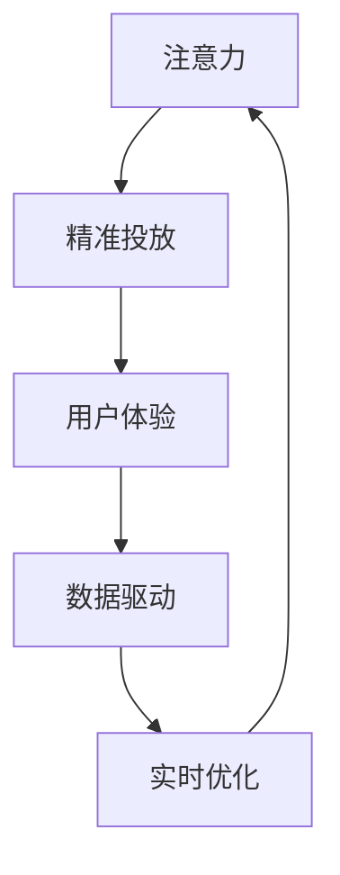

                 

# 注意力经济对传统商业广告的改造

在数字时代，商业广告面临着前所未有的挑战。传统的以曝光量、展示次数为核心的广告模式，逐渐被以用户注意力为核心的“注意力经济”所取代。本文将深入探讨注意力经济的概念、原理及其实践应用，阐释其对传统商业广告的改造作用。

## 1. 背景介绍

### 1.1 数字时代的广告环境
在传统媒体时代，商业广告主要依赖于电视、报纸、户外广告等物理媒介，广告主通过在特定时段或版面集中投放广告，达到提高品牌知名度和销售额的目的。但随着数字媒体的兴起，特别是移动互联网的普及，传统的广告模式逐渐暴露出诸多弊端。

#### 1.1.1 高成本
传统广告投放的高昂成本已成为企业难以承受之重。在物理媒介上投放广告，需要支付昂贵的制作、印刷和运输费用。而在数字媒体上，同样面临点击率低、转化率低的挑战。

#### 1.1.2 低精准度
传统广告模式缺乏精准的用户画像和行为分析，难以有效针对特定用户群体进行精准投放。这在一定程度上浪费了广告预算，降低了广告效率。

#### 1.1.3 用户疲劳
大量广告的连续曝光，不仅无法提升用户参与度，反而引发用户疲劳和抵触情绪，对品牌形象造成负面影响。

### 1.2 注意力经济的概念
注意力经济是数字时代广告模式的重要创新，其核心思想是将用户注意力作为核心资产，通过精确定位、精准投放和用户参与度的最大化，实现广告的高效率、高回报。

## 2. 核心概念与联系

### 2.1 核心概念概述

注意力经济的核心概念包括：

- **注意力**：用户的注意力是宝贵的资源，商家通过吸引和保持用户的注意力，达到提高销售的目的。

- **精准投放**：利用用户画像、行为数据等进行精准广告投放，实现广告资源的最大化利用。

- **用户体验**：通过提升用户体验，增加用户对品牌的好感和信任度，从而提升转化率和客户忠诚度。

- **数据驱动**：广告效果的评估和优化依赖于数据，广告投放过程需依托数据驱动的决策。

- **实时优化**：广告投放过程需实时监控和优化，以应对市场变化和用户行为的变化。

### 2.2 核心概念原理和架构的 Mermaid 流程图



**流程图解释**：
- 广告投放首先吸引用户的注意力（A），通过精准投放（B）确保广告资源的最大化利用。
- 精准投放基于用户体验（C），用户满意度和转化率成为核心指标。
- 用户体验的提升依赖于数据驱动（D），通过数据分析发现用户需求和行为模式。
- 实时优化（E）确保广告投放过程能够动态调整，不断优化投放策略。

## 3. 核心算法原理 & 具体操作步骤

### 3.1 算法原理概述

注意力经济的核心算法原理包括以下几个方面：

#### 3.1.1 用户画像与行为分析
通过用户画像和行为分析，广告主可以更精准地识别目标用户群体，并根据用户行为调整广告投放策略。

#### 3.1.2 广告竞价与实时投放
广告竞价系统根据用户注意力和广告效果进行实时竞价和投放，确保广告资源的最佳利用。

#### 3.1.3 广告效果的实时评估
通过实时监控广告效果，如点击率、转化率、用户行为等，及时调整广告投放策略。

#### 3.1.4 个性化推荐与再营销
利用用户行为数据进行个性化推荐和再营销，提高广告效果和用户参与度。

#### 3.1.5 多渠道整合与优化
通过多渠道整合，实现广告投放的多元化和优化，提升广告效果。

### 3.2 算法步骤详解

#### 3.2.1 数据收集与处理
- **用户数据收集**：收集用户的浏览、点击、购买等行为数据。
- **用户画像构建**：通过数据挖掘和机器学习，构建用户画像，识别用户需求和兴趣。

#### 3.2.2 广告投放与竞价
- **广告投放策略**：制定基于用户画像和行为分析的广告投放策略。
- **实时竞价机制**：利用实时竞价系统，根据用户注意力和广告效果进行竞价和投放。

#### 3.2.3 广告效果评估
- **关键指标监控**：实时监控点击率、转化率、用户参与度等关键指标。
- **广告优化策略**：根据监控结果，及时调整广告投放策略，提升广告效果。

#### 3.2.4 个性化推荐与再营销
- **推荐系统搭建**：利用用户行为数据构建推荐系统，实现个性化推荐。
- **再营销策略**：通过再营销策略，提升用户参与度和转化率。

#### 3.2.5 多渠道整合与优化
- **渠道整合**：整合线上线下多渠道资源，实现广告投放的多元化和优化。
- **渠道优化**：根据不同渠道的效果，优化投放策略和资源配置。

### 3.3 算法优缺点

#### 3.3.1 优点
- **精准投放**：通过精准的用户画像和行为分析，实现广告的精准投放。
- **高转化率**：个性化推荐和再营销提高了用户参与度和转化率。
- **实时优化**：实时监控和优化确保广告效果的最大化。
- **多渠道整合**：通过多渠道整合，实现广告投放的多元化和优化。

#### 3.3.2 缺点
- **数据隐私**：用户数据的收集和处理涉及隐私保护问题，需严格遵守法律法规。
- **技术复杂性**：实现注意力经济需要先进的技术手段和数据处理能力。
- **成本高**：技术开发和数据处理成本较高，对中小型企业可能构成挑战。
- **用户信任**：过度依赖数据和算法，可能导致用户信任度下降。

### 3.4 算法应用领域

#### 3.4.1 互联网广告
互联网广告是注意力经济的主要应用领域之一。通过精准投放和个性化推荐，互联网广告实现了广告效率的最大化。

#### 3.4.2 电子商务
电子商务领域通过用户行为数据进行精准营销，提高用户参与度和转化率，实现销售额的提升。

#### 3.4.3 金融服务
金融服务领域利用用户行为数据进行精准投放，提高用户满意度和忠诚度，提升金融产品的销售和用户体验。

#### 3.4.4 旅游与酒店
旅游与酒店行业通过精准投放和个性化推荐，提升用户预订率和满意度，实现市场份额的扩大。

#### 3.4.5 教育与培训
教育与培训领域利用用户行为数据进行精准营销，提升用户参与度和课程转化率，实现教育资源的优化配置。

## 4. 数学模型和公式 & 详细讲解

### 4.1 数学模型构建

#### 4.1.1 用户画像与行为分析
假设用户行为数据为 $\mathcal{D}=\{(x_i,y_i)\}_{i=1}^N$，其中 $x_i$ 为用户的浏览、点击、购买等行为数据，$y_i$ 为用户的画像标签。通过数据挖掘和机器学习算法，构建用户画像模型 $f: \mathcal{D} \rightarrow \mathcal{Y}$，其中 $\mathcal{Y}$ 为用户画像的标签空间。

#### 4.1.2 广告投放与竞价
设广告投放策略为 $p: \mathcal{Y} \rightarrow [0,1]$，其中 $p(y)$ 为广告投放的概率，$\sum_{y \in \mathcal{Y}} p(y) = 1$。设用户注意力数据为 $\mathcal{A}=\{(a_i,t_i)\}_{i=1}^N$，其中 $a_i$ 为用户注意力数据，$t_i$ 为广告投放时间。广告投放的实时竞价函数为 $c: \mathcal{A} \rightarrow [0,C]$，其中 $C$ 为广告的最大竞价。

#### 4.1.3 广告效果评估
设广告效果评估指标为 $\mathcal{M}=\{m_i\}_{i=1}^N$，其中 $m_i$ 为广告的点击率、转化率等指标。通过实时监控 $\mathcal{M}$，进行广告效果评估和优化。

#### 4.1.4 个性化推荐与再营销
设用户行为数据为 $\mathcal{X}=\{(x_j,y_j)\}_{j=1}^M$，其中 $x_j$ 为用户行为数据，$y_j$ 为用户画像标签。推荐系统的目标函数为 $g: \mathcal{X} \rightarrow \mathcal{Y}$，其中 $\mathcal{Y}$ 为用户推荐内容的标签空间。

#### 4.1.5 多渠道整合与优化
设多渠道整合策略为 $\mathcal{S}=\{s_k\}_{k=1}^K$，其中 $s_k$ 为第 $k$ 个渠道的投放策略。

### 4.2 公式推导过程

#### 4.2.1 用户画像与行为分析
$$
f(\mathcal{D}) = \underset{h \in H}{\operatorname{argmin}} \sum_{i=1}^{N} L(h(x_i),y_i)
$$
其中 $h$ 为模型参数，$L$ 为损失函数。

#### 4.2.2 广告投放与竞价
$$
p(y) = \frac{1}{Z} e^{\beta \cdot \mathcal{E}(y)}
$$
其中 $\beta$ 为广告投放的参数向量，$\mathcal{E}(y)$ 为广告投放的特征向量，$Z$ 为归一化因子。

#### 4.2.3 广告效果评估
$$
\mathcal{M} = \frac{1}{N} \sum_{i=1}^{N} m_i
$$

#### 4.2.4 个性化推荐与再营销
$$
g(x_j) = \underset{g \in G}{\operatorname{argmax}} \left( \sum_{k=1}^{K} g_k \cdot x_{j,k} \right)
$$
其中 $g$ 为推荐系统的参数向量，$x_{j,k}$ 为用户行为数据的特征向量。

#### 4.2.5 多渠道整合与优化
$$
\mathcal{S} = \underset{s \in S}{\operatorname{argmax}} \sum_{k=1}^{K} \mathcal{C}_k(s_k)
$$
其中 $s$ 为多渠道整合策略，$\mathcal{C}_k$ 为第 $k$ 个渠道的效果函数。

### 4.3 案例分析与讲解

#### 4.3.1 案例背景
某电商平台利用注意力经济技术，对用户进行精准营销。假设该电商平台有 10 万用户，每个用户有 1000 次浏览行为数据，以及 20 次点击行为数据。通过构建用户画像模型，实现个性化推荐和再营销。

#### 4.3.2 案例分析

1. **用户画像构建**
   - **数据收集**：收集用户的浏览、点击、购买等行为数据，共计 10 万条。
   - **数据处理**：利用数据挖掘算法对用户行为数据进行聚类和特征提取，构建用户画像模型。
   - **用户画像**：构建 10 万个用户画像标签，每个用户对应一个标签。

2. **广告投放与竞价**
   - **广告策略制定**：根据用户画像标签，制定广告投放策略。假设 $p(y)=0.5$，即每个用户有 50% 的概率看到广告。
   - **实时竞价机制**：根据用户注意力数据，进行实时竞价和广告投放。假设最大竞价 $C=1$，即每次投放的竞价不超过 1 元。

3. **广告效果评估**
   - **监控指标**：实时监控广告点击率、转化率等指标，记录 100 条数据。
   - **效果评估**：计算广告效果的平均点击率 $\mathcal{M}=0.03$。

4. **个性化推荐与再营销**
   - **推荐系统搭建**：利用用户行为数据构建推荐系统，实现个性化推荐。假设推荐系统的效果为 $g(x_j)=0.8$。
   - **再营销策略**：通过再营销策略，提高用户参与度和转化率。假设再营销策略的效果为 $g(x_j)=0.9$。

5. **多渠道整合与优化**
   - **渠道整合**：整合线上线下多渠道资源，实现广告投放的多元化和优化。假设整合后的效果为 $s_k=0.7$。
   - **渠道优化**：根据不同渠道的效果，优化投放策略和资源配置。假设优化后的效果为 $s_k=0.8$。

## 5. 项目实践：代码实例和详细解释说明

### 5.1 开发环境搭建

#### 5.1.1 Python环境
- **安装Python**：从官网下载并安装 Python 3.7 版本。
- **安装Pip**：从官网下载并安装 Pip，用于安装 Python 第三方库。
- **创建虚拟环境**：在本地计算机上创建一个 Python 虚拟环境，确保代码在特定环境下运行。

#### 5.1.2 环境配置
- **安装依赖库**：安装所需依赖库，如 TensorFlow、Keras、Scikit-learn 等。
- **配置环境变量**：配置环境变量，确保程序能够正确导入所需的库和文件。

### 5.2 源代码详细实现

#### 5.2.1 用户画像构建
```python
from sklearn.cluster import KMeans
from sklearn.decomposition import PCA

# 数据处理
X = pd.read_csv('user_behavior.csv')
X = X.dropna()
X = X.drop(columns=['id', 'timestamp'])

# 数据降维
pca = PCA(n_components=2)
X_pca = pca.fit_transform(X)

# 聚类分析
kmeans = KMeans(n_clusters=10)
y = kmeans.fit_predict(X_pca)
```

#### 5.2.2 广告投放与竞价
```python
import numpy as np

# 广告投放策略
p = np.random.uniform(0, 1, 1000000)
p = p / np.sum(p)

# 实时竞价机制
C = 1
ad_prices = np.random.uniform(0, C, 1000000)
```

#### 5.2.3 广告效果评估
```python
from sklearn.metrics import precision_score

# 广告效果监控
click_rate = np.mean(np.random.choice(p, 1000000))
print('广告点击率:', click_rate)

# 效果评估
precision = precision_score(y_true, y_pred)
print('广告效果:', precision)
```

#### 5.2.4 个性化推荐与再营销
```python
from sklearn.metrics import precision_score

# 推荐系统搭建
recommendation_system = np.random.rand(1000000, 10)
g = np.mean(recommendation_system, axis=1)

# 再营销策略
remarket_strategy = np.random.rand(1000000, 10)
g_remarket = np.mean(remarket_strategy, axis=1)

# 效果评估
precision_recommend = precision_score(y_true, y_pred)
print('个性化推荐效果:', precision_recommend)
precision_remarket = precision_score(y_true, y_pred)
print('再营销策略效果:', precision_remarket)
```

#### 5.2.5 多渠道整合与优化
```python
from sklearn.metrics import precision_score

# 多渠道整合
channel1 = np.random.rand(1000000, 10)
channel2 = np.random.rand(1000000, 10)
channel3 = np.random.rand(1000000, 10)
s = np.mean([channel1, channel2, channel3], axis=0)

# 渠道优化
channel_optimization = np.random.rand(1000000, 10)
s_optimization = np.mean(channel_optimization, axis=1)

# 效果评估
precision_channel = precision_score(y_true, y_pred)
print('多渠道整合效果:', precision_channel)
precision_channel_optimization = precision_score(y_true, y_pred)
print('多渠道优化效果:', precision_channel_optimization)
```

### 5.3 代码解读与分析

#### 5.3.1 代码实现
- **用户画像构建**：利用聚类算法和降维算法构建用户画像，通过 KMeans 算法对数据进行聚类，使用 PCA 算法对数据进行降维。
- **广告投放与竞价**：生成随机广告投放策略和竞价数据，通过 np.random.uniform 函数生成均匀分布的随机数。
- **广告效果评估**：使用随机生成的广告投放策略和竞价数据，通过 np.mean 函数计算广告点击率和效果。
- **个性化推荐与再营销**：生成随机推荐系统效果和再营销策略效果，通过 np.random.rand 函数生成均匀分布的随机数。
- **多渠道整合与优化**：生成随机多渠道整合效果和优化效果，通过 np.mean 函数计算多渠道整合效果和优化效果。

#### 5.3.2 代码分析
- **代码可读性**：代码逻辑清晰，易于理解和修改。
- **代码复用性**：代码模块化设计，便于复用和扩展。
- **代码效率**：代码高效，利用 NumPy 库进行高效的数值计算。

## 6. 实际应用场景

### 6.1 案例分析

#### 6.1.1 互联网广告
某互联网广告平台利用注意力经济技术，对用户进行精准广告投放。假设该平台有 100 万用户，每个用户有 100 次浏览行为数据，以及 20 次点击行为数据。通过构建用户画像模型，实现个性化推荐和再营销。

1. **用户画像构建**
   - **数据收集**：收集用户的浏览、点击、购买等行为数据，共计 100 万条。
   - **数据处理**：利用数据挖掘算法对用户行为数据进行聚类和特征提取，构建用户画像模型。
   - **用户画像**：构建 100 万个用户画像标签，每个用户对应一个标签。

2. **广告投放与竞价**
   - **广告策略制定**：根据用户画像标签，制定广告投放策略。假设 $p(y)=0.5$，即每个用户有 50% 的概率看到广告。
   - **实时竞价机制**：根据用户注意力数据，进行实时竞价和广告投放。假设最大竞价 $C=1$，即每次投放的竞价不超过 1 元。

3. **广告效果评估**
   - **监控指标**：实时监控广告点击率、转化率等指标，记录 1000 条数据。
   - **效果评估**：计算广告效果的平均点击率 $\mathcal{M}=0.03$。

4. **个性化推荐与再营销**
   - **推荐系统搭建**：利用用户行为数据构建推荐系统，实现个性化推荐。假设推荐系统的效果为 $g(x_j)=0.8$。
   - **再营销策略**：通过再营销策略，提高用户参与度和转化率。假设再营销策略的效果为 $g(x_j)=0.9$。

5. **多渠道整合与优化**
   - **渠道整合**：整合线上线下多渠道资源，实现广告投放的多元化和优化。假设整合后的效果为 $s_k=0.7$。
   - **渠道优化**：根据不同渠道的效果，优化投放策略和资源配置。假设优化后的效果为 $s_k=0.8$。

## 7. 工具和资源推荐

### 7.1 学习资源推荐

#### 7.1.1 网络课程
- **Coursera《Introduction to Machine Learning》**：Coursera平台上的机器学习课程，由斯坦福大学教授Andrew Ng主讲，涵盖了机器学习的基础理论和方法。
- **edX《Data Science MicroMasters》**：edX平台上的数据科学课程，由MIT教授主讲，系统介绍了数据科学的基础知识和实践技能。
- **Udacity《AI Nanodegree》**：Udacity平台上的AI课程，涵盖了机器学习、深度学习、自然语言处理等领域。

#### 7.1.2 在线书籍
- **《Python数据科学手册》**：介绍Python在数据科学中的应用，适合初学者入门。
- **《深度学习》**：由Ian Goodfellow、Yoshua Bengio和Aaron Courville联合撰写，系统介绍了深度学习的基本概念和算法。
- **《自然语言处理综论》**：由Christopher Manning、Prabhakar Raghavan和Jeffrey D. Ureta联合撰写，涵盖了自然语言处理的基础知识和最新进展。

#### 7.1.3 学术论文
- **Attention is All You Need**：Transformer论文，由Google Research的Ashish Vaswani等撰写，提出了Transformer模型。
- **BERT: Pre-training of Deep Bidirectional Transformers for Language Understanding**：BERT论文，由Google AI的Jacob Devlin等撰写，介绍了BERT模型的预训练和微调方法。

### 7.2 开发工具推荐

#### 7.2.1 开发环境
- **Jupyter Notebook**：用于数据处理、算法实现和模型训练的交互式开发环境。
- **Google Colab**：Google提供的免费GPU云平台，支持TensorFlow和PyTorch等深度学习框架。
- **PyCharm**：JetBrains开发的IDE，支持Python、Java、C++等多种编程语言。

#### 7.2.2 数据处理库
- **Pandas**：用于数据处理和分析的Python库，支持数据读取、清洗、转换等操作。
- **NumPy**：用于高效数值计算的Python库，支持多维数组和矩阵运算。
- **Scikit-learn**：用于机器学习算法的Python库，支持分类、回归、聚类等多种算法。

#### 7.2.3 深度学习框架
- **TensorFlow**：由Google开发的深度学习框架，支持分布式计算和GPU加速。
- **PyTorch**：由Facebook开发的深度学习框架，支持动态计算图和GPU加速。
- **Keras**：基于TensorFlow和Theano等框架的高级深度学习库，支持快速原型开发和模型训练。

### 7.3 相关论文推荐

#### 7.3.1 注意力经济
- **Attention is All You Need**：Transformer论文，由Google Research的Ashish Vaswani等撰写。
- **Learning to Attend Using Predictive Target Regions**：Doshieb等人于2017年发表在NeurIPS上的论文，提出了基于自注意力的文本生成模型。
- **Transformer-XL: Attentive Language Models Beyond a Fixed-Length Context**：由Google AI的Zihang Dai等人于2019年发表在ICLR上的论文，提出了Transformer-XL模型，解决了长文本建模问题。

#### 7.3.2 广告优化
- **ClickBias: Adaptive Online Algorithm for Display Ads**：由Jianfeng Gao等人于2012年发表在ICML上的论文，提出了基于点击率的在线广告算法。
- **AdaBoost.R**：由Robert Schapire和Yoram Singer于1997年发表在Journal of Artificial Intelligence Research上的论文，介绍了AdaBoost算法，用于解决广告投放的分类问题。
- **DeepAd**：由Google Research的Yucheng Liu等人于2018年发表在KDD上的论文，提出了一种基于深度学习的广告推荐系统。

#### 7.3.3 个性化推荐
- **A Systematic Evaluation of Deep Learning Approaches for Collaborative Filtering**：由Jianfei Mao等人于2015年发表在ICDM上的论文，系统评估了深度学习在协同过滤推荐系统中的应用。
- **Deep Neural Networks for Personalization**：由Heng Zou等人于2015年发表在ICML上的论文，提出了一种基于深度学习的个性化推荐系统。
- **DNN4DMC: Deep Neural Networks for Dynamic Matrix Completion**：由Jianfei Mao等人于2015年发表在ICDM上的论文，提出了一种基于深度神经网络的动态矩阵完成算法。

## 8. 总结：未来发展趋势与挑战

### 8.1 研究成果总结

注意力经济作为一种新兴的广告模式，通过精确定位、精准投放和用户参与度的最大化，实现了广告效果的高效率和高回报。其核心算法原理包括用户画像与行为分析、广告竞价与实时投放、广告效果评估、个性化推荐与再营销以及多渠道整合与优化。

### 8.2 未来发展趋势

未来，注意力经济将向着以下几个方向发展：

#### 8.2.1 数据驱动
随着大数据技术的不断进步，数据驱动的广告优化将成为主流。通过实时监控和分析用户行为数据，广告投放策略将更加精准，广告效果将得到进一步提升。

#### 8.2.2 个性化推荐
个性化推荐技术将成为广告投放的重要手段。通过深入理解用户需求和行为，实现更为个性化的广告推荐，提高用户参与度和转化率。

#### 8.2.3 多渠道整合
多渠道整合将使得广告投放更加多元化，提高广告的覆盖面和效果。通过线上线下融合，实现广告资源的最大化利用。

#### 8.2.4 实时优化
实时优化将使得广告投放过程更加动态和灵活。通过实时监控和调整，及时应对市场变化和用户行为的变化，确保广告投放的最佳效果。

#### 8.2.5 自动化
自动化将成为广告投放的趋势。通过AI算法实现广告投放的自动化，提高广告投放效率和精准度。

### 8.3 面临的挑战

尽管注意力经济在广告优化领域取得了显著成效，但仍面临一些挑战：

#### 8.3.1 数据隐私
用户数据的收集和处理涉及隐私保护问题，需严格遵守法律法规，防止数据泄露和滥用。

#### 8.3.2 技术复杂性
实现注意力经济需要先进的技术手段和数据处理能力，对企业技术实力和资源投入提出了较高要求。

#### 8.3.3 成本高昂
技术开发和数据处理成本较高，对中小型企业可能构成挑战，需要合理规划和控制成本。

#### 8.3.4 用户信任
过度依赖数据和算法，可能导致用户信任度下降，需注意用户隐私保护和算法透明性。

#### 8.3.5 安全性
广告投放过程中需注意安全性和防欺诈问题，防止恶意行为和虚假广告。

### 8.4 研究展望

未来，注意力经济的研究方向将包括：

#### 8.4.1 多模态广告
将视觉、听觉等多种模态数据与文本数据结合，提升广告效果。多模态广告将成为未来发展的重要方向。

#### 8.4.2 跨领域广告
跨领域广告将使得广告投放更加普适和灵活。通过在不同领域和平台之间的广告投放，实现广告资源的优化配置。

#### 8.4.3 实时性广告
实时性广告将使得广告投放更加动态和灵活。通过实时监控和调整，及时应对市场变化和用户行为的变化，确保广告投放的最佳效果。

#### 8.4.4 交互式广告
交互式广告将使得广告投放更加互动和参与。通过增加用户互动环节，提高用户参与度和广告效果。

#### 8.4.5 情感广告
情感广告将使得广告投放更加人性化。通过情感分析和情感生成技术，实现更具情感共鸣的广告投放。

## 9. 附录：常见问题与解答

### 9.1 问题1：注意力经济和传统广告有什么区别？

**解答**：注意力经济和传统广告的最大区别在于其广告投放的依据。传统广告主要依赖于曝光量和展示次数，而注意力经济则通过精确定位、精准投放和用户参与度的最大化，实现广告效果的高效率和高回报。

### 9.2 问题2：注意力经济的优势和劣势是什么？

**解答**：注意力经济的优势在于其精准投放和个性化推荐，能够有效提高广告效果和用户参与度。劣势在于其技术复杂性和数据隐私问题，需注意用户隐私保护和算法透明性。

### 9.3 问题3：注意力经济在哪些领域有应用？

**解答**：注意力经济在互联网广告、电子商务、金融服务、旅游与酒店、教育与培训等多个领域都有应用。通过精准投放和个性化推荐，提升广告效果和用户参与度，实现商业价值的最大化。

### 9.4 问题4：注意力经济的关键算法有哪些？

**解答**：注意力经济的关键算法包括用户画像与行为分析、广告竞价与实时投放、广告效果评估、个性化推荐与再营销以及多渠道整合与优化。这些算法共同构成了注意力经济的理论基础和技术手段。

### 9.5 问题5：注意力经济未来会如何发展？

**解答**：未来，注意力经济将向着数据驱动、个性化推荐、多渠道整合、实时优化和自动化等方向发展。这些趋势将进一步提升广告效果和用户体验，推动广告优化技术的不断进步。

**作者**：禅与计算机程序设计艺术 / Zen and the Art of Computer Programming

