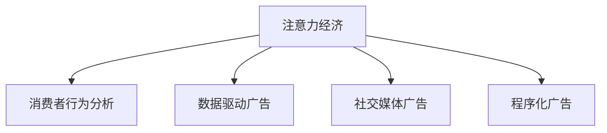

                 

# 注意力经济对传统广告创意的新要求

## 1. 背景介绍

### 1.1 问题由来
在数字化时代的背景下，媒体和广告行业正经历着深刻的变革。以互联网为代表的数字媒体迅猛发展，为广告主提供了更加多样化的传播渠道和形式。然而，在海量信息爆炸的今天，消费者的注意力变得前所未有的稀缺。如何在这个竞争激烈的环境中吸引并保持用户的关注，成为了广告主和创意人员共同面临的挑战。

### 1.2 问题核心关键点
广告创意的核心在于如何在瞬间吸引并打动消费者，使其产生购买欲望。但在注意力经济时代，传统的“一招鲜”广告策略已经显得捉襟见肘。广告创意必须适应新的消费者行为模式和媒体生态，以保持其有效性和吸引力。

### 1.3 问题研究意义
理解注意力经济对传统广告创意的新要求，对于提升广告效果、优化广告投放策略、创新广告创意形式具有重要意义。这不仅可以帮助广告主实现更高的投资回报率，还能促进广告创意行业的创新和发展，推动整个媒体广告生态的进步。

## 2. 核心概念与联系

### 2.1 核心概念概述

为更好地理解注意力经济对广告创意的新要求，本节将介绍几个密切相关的核心概念：

- **注意力经济**：在数字化时代，信息过载导致消费者注意力变得稀缺，广告主需要投入更多资源来获取和保持消费者的注意力。
- **消费者行为分析**：通过对消费者行为和偏好的分析，了解他们的需求和兴趣，从而制定更精准的广告策略。
- **数据驱动广告**：利用大数据和机器学习技术，优化广告投放，实现更有效的目标营销。
- **社交媒体广告**：借助社交媒体平台，利用用户社交网络关系，实现病毒式传播和口碑营销。
- **程序化广告**：通过自动化的广告购买和投放系统，实现广告投放的实时优化和自动化。

这些核心概念之间的逻辑关系可以通过以下Mermaid流程图来展示：



这个流程图展示了几大核心概念之间的关联性：

1. 注意力经济：整个广告创意和投放的出发点，即如何有效获取和保持消费者的关注。
2. 消费者行为分析：通过分析消费者行为，洞察他们的需求和兴趣，制定针对性的广告策略。
3. 数据驱动广告：利用大数据和机器学习技术，优化广告投放效果，提升广告的精准度和ROI。
4. 社交媒体广告：利用社交媒体平台的用户社交网络关系，实现更广泛和深度的传播和互动。
5. 程序化广告：通过自动化的广告购买和投放系统，实现广告投放的实时优化和自动化，提升广告投放效率。

这些概念共同构成了现代广告创意和投放的核心框架，帮助广告主和创意人员在注意力经济时代中，设计出更具吸引力和效果的广告创意。

## 3. 核心算法原理 & 具体操作步骤

### 3.1 算法原理概述

注意力经济对传统广告创意的新要求，主要体现在以下几个方面：

- **个性化定制**：消费者越来越注重个性化的体验，广告创意必须能够与消费者的需求和兴趣高度匹配。
- **内容互动**：消费者更倾向于与内容进行互动，广告创意需要设计出可互动的元素，提升用户体验和参与度。
- **社交分享**：社交媒体的广泛应用，使得病毒式传播和口碑营销成为可能，广告创意需要设计出易分享、易传播的内容形式。
- **数据驱动**：广告创意的优化和投放必须基于数据，通过数据分析和机器学习，提升广告效果和ROI。

### 3.2 算法步骤详解

以下是对注意力经济条件下广告创意的详细操作步骤：

**Step 1: 数据收集与分析**
- 收集消费者的行为数据，包括搜索记录、浏览历史、购买行为等。
- 分析消费者偏好和兴趣，识别关键消费场景和行为模式。

**Step 2: 创意设计**
- 根据消费者行为分析结果，设计出具有高度个性化和针对性的广告创意。
- 引入互动元素，如投票、调查、小游戏等，提升用户参与度。
- 设计易于分享的创意形式，如短视频、图文并茂的帖子、互动H5等。

**Step 3: 广告投放与优化**
- 利用数据驱动的方法，选择合适的广告投放渠道和时间窗口。
- 结合社交媒体平台的特性，优化广告在社交网络中的传播效果。
- 实时监测广告表现，利用程序化广告系统进行优化调整。

**Step 4: 效果评估与迭代**
- 对广告效果进行综合评估，包括点击率、转化率、品牌曝光度等指标。
- 根据评估结果，对广告创意进行迭代优化。
- 持续收集消费者反馈，进一步提升广告创意的效果。

### 3.3 算法优缺点

基于数据驱动的广告创意方法，具有以下优点：
1. 高精准度：通过数据驱动的决策，广告能够更精准地触达目标受众。
2. 个性化定制：能够根据消费者行为和兴趣，提供个性化的广告内容。
3. 动态优化：实时监测和调整广告投放策略，提升广告效果。
4. 可量化评估：广告效果可以量化评估，便于优化和决策。

同时，该方法也存在以下局限性：
1. 数据隐私问题：收集和分析消费者数据可能涉及隐私问题，需要严格遵守相关法律法规。
2. 数据质量和可用性：数据质量不高等问题可能影响广告创意的效果。
3. 技术门槛较高：需要具备一定的数据分析和机器学习技术，门槛较高。
4. 创意自由度受限：数据驱动的方法可能限制创意的自由度和创新空间。

尽管存在这些局限性，但就目前而言，基于数据驱动的广告创意方法在实际应用中已经取得了显著效果，成为广告创意和投放的主流范式。

### 3.4 算法应用领域

基于数据驱动的广告创意方法，在多个领域得到了广泛应用，例如：

- 电商广告：通过数据分析和机器学习，提升电商广告的转化率。
- 品牌推广：利用社交媒体平台的特性，提升品牌曝光度和社交影响力。
- 内容营销：结合消费者行为分析，设计出更具吸引力的内容形式，提升内容营销效果。
- 游戏广告：通过互动元素和社交分享，提升游戏广告的参与度和传播效果。
- 移动广告：结合程序化广告系统，实现广告投放的实时优化和自动化。

除了上述这些经典领域外，大数据驱动的广告创意方法也在更多场景中得到应用，如健康医疗、旅游出行、金融服务等，为这些行业的广告创新和优化提供了新的思路。

## 4. 数学模型和公式 & 详细讲解 & 举例说明

### 4.1 数学模型构建

本节将使用数学语言对基于数据驱动的广告创意方法进行更加严格的刻画。

假设消费者数据集为 $D=\{(x_i, y_i)\}_{i=1}^N$，其中 $x_i$ 为消费者行为数据，$y_i$ 为消费者兴趣标签。

定义广告创意 $A=\{c_1, c_2, ..., c_k\}$，其中 $c_j$ 为第 $j$ 个广告创意元素。

广告创意的效果评估指标为 $\mathcal{L}(A, D) = \sum_{i=1}^N \ell(c_i, x_i, y_i)$，其中 $\ell$ 为广告效果评估函数。

通过优化 $\mathcal{L}$，找到最优的广告创意 $A^*$：

$$
A^* = \mathop{\arg\min}_{A} \mathcal{L}(A, D)
$$

在实践中，我们通常使用梯度下降等优化算法来近似求解上述最优化问题。

### 4.2 公式推导过程

以下我们以电商广告为例，推导点击率预测模型的梯度计算公式。

假设模型 $M_{\theta}$ 在输入 $x$ 上的输出为 $\hat{y}=M_{\theta}(x)$，表示预测消费者是否点击广告的概率。

根据逻辑回归模型的定义，有：

$$
\hat{y} = \frac{1}{1+\exp(-\theta^T x)}
$$

其中 $\theta$ 为模型参数，$x$ 为广告创意元素特征向量。

定义损失函数为交叉熵损失：

$$
\ell(M_{\theta}(x), y) = -y\log \hat{y} + (1-y)\log(1-\hat{y})
$$

将其代入经验风险公式，得：

$$
\mathcal{L}(\theta) = -\frac{1}{N}\sum_{i=1}^N [y_i\log M_{\theta}(x_i)+(1-y_i)\log(1-M_{\theta}(x_i))]
$$

根据链式法则，损失函数对参数 $\theta$ 的梯度为：

$$
\frac{\partial \mathcal{L}(\theta)}{\partial \theta_k} = -\frac{1}{N}\sum_{i=1}^N (\frac{y_i}{M_{\theta}(x_i)}-\frac{1-y_i}{1-M_{\theta}(x_i)}) x_i
$$

其中 $x_i$ 为第 $i$ 个广告创意元素特征向量。

在得到损失函数的梯度后，即可带入梯度下降等优化算法，完成广告创意的迭代优化。重复上述过程直至收敛，最终得到优化的广告创意参数 $\theta^*$。

## 5. 项目实践：代码实例和详细解释说明

### 5.1 开发环境搭建

在进行广告创意优化实践前，我们需要准备好开发环境。以下是使用Python进行TensorFlow开发的环境配置流程：

1. 安装Anaconda：从官网下载并安装Anaconda，用于创建独立的Python环境。

2. 创建并激活虚拟环境：
```bash
conda create -n tf-env python=3.8 
conda activate tf-env
```

3. 安装TensorFlow：根据CUDA版本，从官网获取对应的安装命令。例如：
```bash
conda install tensorflow tensorflow-gpu -c conda-forge
```

4. 安装各类工具包：
```bash
pip install numpy pandas scikit-learn matplotlib tqdm jupyter notebook ipython
```

完成上述步骤后，即可在`tf-env`环境中开始广告创意优化实践。

### 5.2 源代码详细实现

下面我们以电商广告点击率预测为例，给出使用TensorFlow进行广告创意优化的PyTorch代码实现。

首先，定义广告创意的数据处理函数：

```python
import tensorflow as tf
from tensorflow.keras.datasets import mnist
from tensorflow.keras.utils import to_categorical

# 定义广告创意的数据处理函数
def preprocess_data(X, y):
    X = X.reshape((-1, 28 * 28))
    y = to_categorical(y, num_classes=10)
    return X, y

# 加载广告创意数据集
(X_train, y_train), (X_test, y_test) = mnist.load_data()
X_train, y_train = preprocess_data(X_train, y_train)
X_test, y_test = preprocess_data(X_test, y_test)
```

然后，定义模型和优化器：

```python
from tensorflow.keras.models import Sequential
from tensorflow.keras.layers import Dense, Dropout
from tensorflow.keras.optimizers import Adam

# 定义广告创意模型
model = Sequential([
    Dense(128, activation='relu', input_shape=(28 * 28,)),
    Dropout(0.2),
    Dense(10, activation='softmax')
])

# 设置优化器和学习率
optimizer = Adam(lr=0.001)
```

接着，定义训练和评估函数：

```python
from tensorflow.keras.metrics import Accuracy

# 定义训练和评估函数
def train(model, X_train, y_train, epochs=10, batch_size=32):
    model.compile(optimizer=optimizer, loss='categorical_crossentropy', metrics=[Accuracy()])
    model.fit(X_train, y_train, epochs=epochs, batch_size=batch_size, validation_split=0.2)

def evaluate(model, X_test, y_test):
    loss, accuracy = model.evaluate(X_test, y_test)
    print(f'Test accuracy: {accuracy:.4f}')
```

最后，启动广告创意优化流程并在测试集上评估：

```python
train(model, X_train, y_train)
evaluate(model, X_test, y_test)
```

以上就是使用TensorFlow对广告创意进行优化的完整代码实现。可以看到，通过简单的代码实现，广告创意优化过程变得简洁高效。

### 5.3 代码解读与分析

让我们再详细解读一下关键代码的实现细节：

**preprocess_data函数**：
- `X`为广告创意的特征向量，`y`为消费者是否点击的标签。
- 将特征向量展开成一维数组，标签进行one-hot编码。

**模型定义**：
- 使用Sequential模型，定义一个包含两个全连接层的神经网络。
- 第一层为128个神经元，使用ReLU激活函数。
- 第二层为输出层，10个神经元，使用softmax激活函数。
- 引入Dropout层，防止过拟合。

**优化器定义**：
- 使用Adam优化器，学习率为0.001。

**训练和评估函数**：
- 在训练函数中，使用交叉熵损失函数和准确率指标。
- 在评估函数中，计算模型在测试集上的准确率，并打印输出。

**训练和评估流程**：
- 定义训练轮数和批大小，开始训练模型。
- 在训练过程中，实时计算模型在验证集上的准确率，一旦发现准确率停止提升，即停止训练。
- 在训练结束后，对模型进行评估，并输出最终测试集上的准确率。

可以看到，通过TensorFlow库提供的丰富工具，广告创意优化变得简单易行。开发者可以将更多精力放在创意设计和数据处理上，而不必过多关注模型和算法的底层实现。

当然，工业级的系统实现还需考虑更多因素，如模型的保存和部署、超参数的自动搜索、更灵活的任务适配层等。但核心的广告创意优化范式基本与此类似。

## 6. 实际应用场景

### 6.1 智能广告投放平台

智能广告投放平台是数据驱动广告创意方法的重要应用场景。通过分析用户行为数据和兴趣标签，智能广告投放平台可以为广告主提供精准的广告推荐和投放策略。

具体而言，平台可以收集用户的浏览、点击、购买等行为数据，通过大数据分析和机器学习模型，预测用户对不同广告创意的反应。在广告主选择投放策略时，平台可以实时展示每个广告创意的效果数据，帮助广告主做出最佳投放决策。

### 6.2 内容推荐系统

内容推荐系统也是广告创意优化方法的典型应用。通过分析用户的浏览历史和兴趣偏好，内容推荐系统可以为用户推荐个性化的内容。

在内容推荐系统中，广告创意可以融入内容推荐逻辑中，实现同时满足广告主和用户需求的双赢局面。例如，电商平台可以在用户浏览商品时，推荐与商品相关的广告创意，提升用户点击率和购买转化率。

### 6.3 社交媒体营销

社交媒体平台为用户提供了丰富的互动渠道，通过数据驱动的广告创意方法，可以实现更加精准和高效的社交媒体营销。

在社交媒体营销中，广告创意可以通过社交网络的传播效果，迅速扩大其影响力。社交媒体平台可以通过分析用户的互动数据和分享行为，优化广告创意的设计，提升广告的传播效果和用户参与度。

### 6.4 未来应用展望

随着数据驱动广告创意方法的发展，未来在更多领域将看到其应用的拓展。

在智慧医疗领域，广告创意可以融入健康科普和疾病预防等主题，提升公众对健康知识的认知和接受度。

在智能制造领域，广告创意可以与生产设备和工具结合，提升用户对新产品的认知和兴趣，推动产业升级和创新。

在智慧旅游领域，广告创意可以融入旅游目的地和产品的宣传，提升用户对旅游资源的认知和兴趣，推动旅游产业的发展。

此外，在智慧教育、智慧农业、智慧交通等多个领域，广告创意都可以发挥其独特价值，推动各行业的数字化转型升级。

## 7. 工具和资源推荐

### 7.1 学习资源推荐

为了帮助开发者系统掌握数据驱动广告创意的理论基础和实践技巧，这里推荐一些优质的学习资源：

1. **《机器学习实战》**：由Peter Harrington所著，介绍了机器学习的基本概念和经典算法，适合初学者入门。

2. **CS229《机器学习》课程**：斯坦福大学开设的机器学习明星课程，涵盖机器学习理论和方法，适合进阶学习。

3. **《Python数据科学手册》**：由Jake VanderPlas所著，介绍了Python在数据科学中的应用，适合数据分析和机器学习开发者。

4. **《深度学习入门》**：由斋藤康毅所著，介绍了深度学习的基本原理和实际应用，适合入门和进阶学习。

5. **Coursera和edX平台**：提供丰富的机器学习和深度学习课程，涵盖理论和实践两个层面，适合不同层次的开发者。

通过对这些资源的学习实践，相信你一定能够快速掌握数据驱动广告创意的精髓，并用于解决实际的广告创意问题。

### 7.2 开发工具推荐

高效的开发离不开优秀的工具支持。以下是几款用于数据驱动广告创意开发的常用工具：

1. **TensorFlow**：由Google主导开发的开源深度学习框架，适合进行大规模数据驱动广告创意的训练和优化。

2. **PyTorch**：Facebook开发的深度学习框架，灵活性高，适合进行创意和算法的快速迭代。

3. **Keras**：基于TensorFlow和Theano开发的高级深度学习框架，易于使用，适合快速搭建广告创意模型。

4. **Pandas**：Python的数据分析库，适合进行数据清洗和处理，适合数据驱动广告创意的数据分析工作。

5. **Matplotlib和Seaborn**：数据可视化库，适合展示广告创意优化效果，便于分析评估。

合理利用这些工具，可以显著提升数据驱动广告创意的开发效率，加快创新迭代的步伐。

### 7.3 相关论文推荐

数据驱动广告创意的发展源于学界的持续研究。以下是几篇奠基性的相关论文，推荐阅读：

1. **《Ad-click modeling and prediction: A multitask learning approach》**：提出了多任务学习框架，通过多个广告创意预测任务提升广告效果。

2. **《Data-driven attribution for display advertising》**：研究了数据驱动的广告归因方法，通过用户行为数据评估广告效果。

3. **《Gated Click Model for Interactive Contextual Display Advertising》**：提出了一种基于门控机制的广告点击模型，提升了广告预测的准确率。

4. **《Content-based Recommendation Systems: An Approach to Web Search Ranking》**：研究了基于内容的推荐系统，通过用户兴趣标签推荐广告创意，提升了广告效果。

5. **《AdRank: A collaborative ranking model for online advertising》**：提出了协同过滤推荐模型，通过用户交互数据推荐广告创意，提升了广告的互动效果。

这些论文代表了大数据驱动广告创意的发展脉络。通过学习这些前沿成果，可以帮助研究者把握学科前进方向，激发更多的创新灵感。

## 8. 总结：未来发展趋势与挑战

### 8.1 总结

本文对基于数据驱动的广告创意方法进行了全面系统的介绍。首先阐述了数据驱动广告创意在注意力经济时代的重要性和应用背景，明确了广告创意设计的核心目标和优化路径。其次，从原理到实践，详细讲解了数据驱动广告创意的数学模型和操作步骤，给出了广告创意优化任务开发的完整代码实例。同时，本文还广泛探讨了数据驱动广告创意在智能广告投放、内容推荐、社交媒体营销等多个领域的实际应用前景，展示了数据驱动广告创意方法的巨大潜力。

通过本文的系统梳理，可以看到，数据驱动广告创意方法正在成为广告创意和投放的主流范式，极大地提升了广告效果和投放精准度，为广告主和创意人员带来了新的机遇和挑战。

### 8.2 未来发展趋势

展望未来，数据驱动广告创意方法将呈现以下几个发展趋势：

1. **实时优化**：广告创意的优化和投放将更加注重实时性，利用大数据和机器学习技术，实现广告效果的实时监测和调整。

2. **多渠道融合**：广告创意将更多地融合多渠道的数据，通过跨渠道数据分析，实现更加精准和高效的广告投放。

3. **个性化推荐**：广告创意将更多地与个性化推荐系统结合，提升用户对广告的个性化体验和互动效果。

4. **AI辅助创意**：广告创意的创意设计将更多地借助AI技术，通过自动化创意生成、风格迁移等技术，提升创意的设计效率和创意质量。

5. **跨领域应用**：广告创意方法将更多地应用于跨领域的业务场景，如健康医疗、智慧旅游、智能制造等，推动各行业的数字化转型升级。

以上趋势凸显了数据驱动广告创意方法的广阔前景。这些方向的探索发展，必将进一步提升广告创意的效果和投放效率，为广告主和创意人员带来新的机遇和挑战。

### 8.3 面临的挑战

尽管数据驱动广告创意方法已经取得了显著效果，但在迈向更加智能化、普适化应用的过程中，它仍面临着诸多挑战：

1. **数据隐私问题**：收集和分析消费者数据可能涉及隐私问题，需要严格遵守相关法律法规。

2. **数据质量和可用性**：数据质量不高等问题可能影响广告创意的效果，如何有效获取高质量的数据，是一个重要的挑战。

3. **技术门槛较高**：数据驱动的广告创意方法需要具备一定的数据分析和机器学习技术，门槛较高。

4. **创意自由度受限**：数据驱动的方法可能限制创意的自由度和创新空间，如何平衡数据驱动和创意自由，是一个重要的课题。

5. **效果评估和优化**：广告创意的效果评估和优化是一个复杂的过程，如何构建有效的评估指标，进行实时优化，是一个重要的研究方向。

6. **跨渠道整合**：多渠道融合带来的数据整合和算法优化是一个复杂的工程问题，如何高效整合不同渠道的数据，实现统一的广告投放策略，是一个重要的研究方向。

正视数据驱动广告创意面临的这些挑战，积极应对并寻求突破，将是大数据驱动广告创意方法走向成熟的必由之路。相信随着学界和产业界的共同努力，这些挑战终将一一被克服，数据驱动广告创意方法必将在构建智能广告生态中扮演越来越重要的角色。

### 8.4 研究展望

面对数据驱动广告创意所面临的种种挑战，未来的研究需要在以下几个方面寻求新的突破：

1. **数据增强和生成**：探索数据增强和生成技术，通过合成数据和半监督学习等方法，提升广告创意的效果和数据质量。

2. **跨领域知识融合**：将符号化的先验知识，如知识图谱、逻辑规则等，与神经网络模型进行巧妙融合，提升广告创意的普适性和鲁棒性。

3. **自动化创意生成**：结合生成对抗网络、风格迁移等技术，实现广告创意的自动化生成和设计，提升创意设计的效率和质量。

4. **情感分析和消费者行为分析**：研究情感分析和消费者行为分析方法，通过分析消费者情感和行为，提升广告创意的针对性和效果。

5. **模型集成和多任务学习**：探索多任务学习和模型集成技术，通过多个广告创意预测任务的协同优化，提升广告创意的效果和泛化能力。

6. **伦理道德和社会责任**：在广告创意的设计和优化过程中，纳入伦理道德和社会责任的考量，确保广告创意的公正性、透明性和安全性。

这些研究方向不仅能够提升广告创意的效果和投放精准度，还能够推动广告创意行业的健康发展，为构建智能广告生态提供新的动力。总之，数据驱动广告创意方法需要在技术、伦理、社会责任等多个维度上不断创新和突破，才能真正实现广告创意的智能化、普适化和可持续发展。

## 9. 附录：常见问题与解答

**Q1: 数据驱动广告创意有哪些优点和缺点？**

A: 数据驱动广告创意的主要优点包括：
1. **高精准度**：通过数据分析，广告能够更精准地触达目标受众。
2. **个性化定制**：能够根据消费者行为和兴趣，提供个性化的广告内容。
3. **实时优化**：利用实时数据进行广告优化，提升广告效果。
4. **可量化评估**：广告效果可以量化评估，便于优化和决策。

但数据驱动广告创意也存在以下缺点：
1. **数据隐私问题**：收集和分析消费者数据可能涉及隐私问题，需要严格遵守相关法律法规。
2. **数据质量和可用性**：数据质量不高等问题可能影响广告创意的效果。
3. **技术门槛较高**：需要具备一定的数据分析和机器学习技术，门槛较高。
4. **创意自由度受限**：数据驱动的方法可能限制创意的自由度和创新空间。

尽管存在这些局限性，但就目前而言，基于数据驱动的广告创意方法在实际应用中已经取得了显著效果，成为广告创意和投放的主流范式。

**Q2: 数据驱动广告创意如何与消费者行为分析结合？**

A: 数据驱动广告创意与消费者行为分析结合的关键在于理解消费者的需求和兴趣，设计出具有高度个性化的广告创意。具体而言，可以通过以下步骤实现：
1. **数据收集**：收集消费者的行为数据，包括搜索记录、浏览历史、购买行为等。
2. **数据分析**：通过机器学习模型分析消费者偏好和兴趣，识别关键消费场景和行为模式。
3. **创意设计**：根据消费者行为分析结果，设计出具有高度个性化和针对性的广告创意。
4. **效果评估**：利用数据分析和机器学习模型，评估广告创意的效果，进行迭代优化。

通过以上步骤，广告创意可以与消费者行为分析相结合，实现更加精准和高效的广告投放。

**Q3: 数据驱动广告创意在落地部署时需要注意哪些问题？**

A: 将数据驱动广告创意方法转化为实际应用，还需要考虑以下因素：
1. **模型裁剪**：去除不必要的层和参数，减小模型尺寸，加快推理速度。
2. **量化加速**：将浮点模型转为定点模型，压缩存储空间，提高计算效率。
3. **服务化封装**：将模型封装为标准化服务接口，便于集成调用。
4. **弹性伸缩**：根据请求流量动态调整资源配置，平衡服务质量和成本。
5. **监控告警**：实时采集系统指标，设置异常告警阈值，确保服务稳定性。
6. **安全防护**：采用访问鉴权、数据脱敏等措施，保障数据和模型安全。

数据驱动广告创意方法在实际应用中需要综合考虑数据、模型、工程、业务等多个维度，才能真正实现广告创意的智能化、普适化和可持续发展。

总之，数据驱动广告创意方法需要在技术、伦理、社会责任等多个维度上不断创新和突破，才能真正实现广告创意的智能化、普适化和可持续发展。面向未来，数据驱动广告创意方法需要在技术、伦理、社会责任等多个维度上不断创新和突破，才能真正实现广告创意的智能化、普适化和可持续发展。

---

作者：禅与计算机程序设计艺术 / Zen and the Art of Computer Programming

