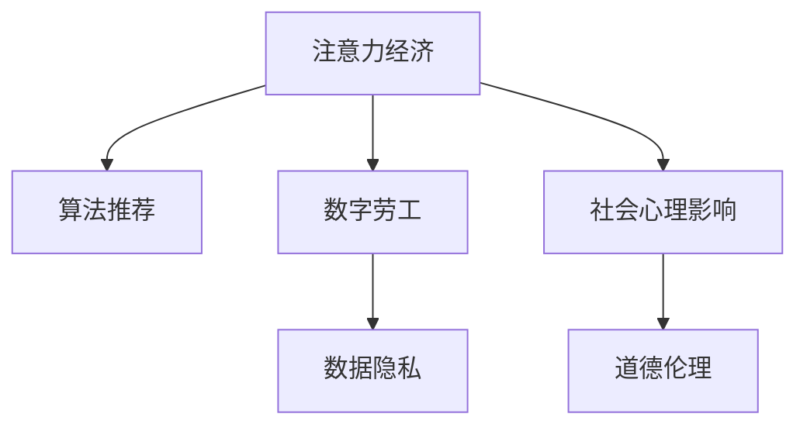

                 

# 注意力经济对心理健康的影响

> 关键词：注意力经济,心理健康,数字劳工,算法推荐,数据隐私,社会心理影响,道德伦理

## 1. 背景介绍

在数字化和智能化的浪潮中，注意力经济（Economy of Attention）成为了信息时代的重要特征。注意力经济以争夺用户的注意力为竞争点，通过算法推荐、社交媒体、网络广告等手段，将用户的时间和注意力作为稀缺资源进行买卖。这一新兴经济模式深刻影响了用户的心理健康和社会行为。本文将从注意力经济的核心原理、对心理健康的潜在影响以及未来发展趋势和挑战等方面进行系统阐述。

## 2. 核心概念与联系

### 2.1 核心概念概述

为理解注意力经济的原理，我们需要首先了解几个关键概念：

- **注意力经济**：以争夺用户的注意力为竞争焦点，通过个性化推荐、社交互动、广告投放等方式，实现用户价值的最大化。
- **算法推荐**：利用用户历史行为数据和模型算法，为用户推荐最符合其兴趣的内容。
- **数字劳工**：在数字化经济中，个人以生产数字内容或服务的形式，进行劳动并获得收入。
- **数据隐私**：用户在数字平台上产生的大量数据，其隐私权和数据安全受到重视。
- **社会心理影响**：注意力经济对个体心理状态、行为模式、社会关系等方面产生的影响。
- **道德伦理**：在追求经济利益的同时，如何平衡技术应用与伦理道德的冲突。

这些概念之间的关系通过以下Mermaid流程图呈现：



这个流程图展示了注意力经济的多个关键维度及其相互关系：

- 注意力经济通过算法推荐实现用户注意力价值的最大化。
- 数字劳工作为注意力经济的主体，在生产数字内容时涉及大量数据隐私问题。
- 社会心理影响表明，注意力经济对个体和群体的心理状态有深刻影响。
- 道德伦理关注在技术应用中如何处理隐私保护、公平公正等问题。

### 2.2 核心概念原理和架构

#### 2.2.1 注意力经济原理

注意力经济的核心在于通过数据驱动的方式，理解并预测用户的行为和需求，通过算法和推荐系统，将用户的注意力转化为经济价值。其工作原理如下：

1. **数据收集与处理**：平台通过各种途径收集用户的行为数据，如浏览历史、购买记录、社交互动等。
2. **特征提取与建模**：利用机器学习算法，对用户行为数据进行特征提取和建模，生成用户画像。
3. **个性化推荐**：根据用户画像，利用推荐算法生成个性化推荐，引导用户点击、购买、互动。
4. **反馈与迭代**：平台收集用户的反馈数据，不断迭代优化推荐模型和算法，提升用户满意度和留存率。

#### 2.2.2 算法推荐架构

算法推荐系统主要由以下几个组件构成：

- **用户画像模块**：根据用户行为数据构建用户画像，包括兴趣、偏好、历史行为等。
- **特征提取模块**：对用户数据和内容数据进行特征提取，生成高维稀疏向量。
- **模型训练模块**：利用历史数据训练推荐模型，如协同过滤、基于内容的推荐、深度学习推荐等。
- **推荐输出模块**：根据用户画像和内容特征，预测用户对不同内容的评分或点击概率，输出推荐结果。
- **反馈迭代模块**：收集用户对推荐结果的反馈数据，优化推荐模型和策略。

这些组件之间的联系和数据流通过以下流程图表示：

```mermaid
graph LR
    U[用户画像模块] -- 特征提取 -- M[模型训练模块] -- 推荐输出 --
    U -- 行为数据 -- F[反馈迭代模块] -- 优化模型
```

### 2.3 核心概念之间的联系

注意力经济的核心概念间存在紧密的联系：

- 数据隐私和用户画像模块紧密相关，隐私保护机制直接影响用户画像的构建。
- 社会心理影响与个性化推荐和数字劳工息息相关，个性化推荐可能对用户的心理状态产生正面或负面影响。
- 道德伦理贯穿于整个注意力经济的过程，影响数据的收集、处理、使用和保护。

这些联系共同构成了注意力经济的全貌，是理解和应对其对心理健康影响的基础。

## 3. 核心算法原理 & 具体操作步骤

### 3.1 算法原理概述

注意力经济中，算法推荐的核心在于利用用户数据和模型算法，预测用户行为，生成个性化推荐。主要算法包括协同过滤、基于内容的推荐、深度学习推荐等。本文重点介绍基于协同过滤的推荐算法，其原理如下：

**协同过滤算法**：基于用户-物品评分矩阵，利用用户之间的相似性或物品之间的相似性，预测用户对未评分物品的评分，生成推荐列表。算法步骤如下：

1. **用户-物品评分矩阵构建**：根据历史评分数据，构建用户-物品评分矩阵 $R$。
2. **用户相似度计算**：计算每个用户与所有其他用户的相似度。
3. **物品相似度计算**：计算每个物品与所有其他物品的相似度。
4. **用户推荐列表生成**：根据相似度矩阵，生成每个用户的推荐列表。

### 3.2 算法步骤详解

#### 3.2.1 评分矩阵构建

假设平台上有 $m$ 个用户，$n$ 个物品，历史评分矩阵 $R$ 为 $m \times n$ 的矩阵，每个元素 $R_{ij}$ 表示用户 $i$ 对物品 $j$ 的评分。构建评分矩阵的步骤如下：

1. 收集用户对物品的评分数据，构建评分矩阵 $R$。
2. 对缺失数据进行填充，常用的方法有均值填充、基于用户或物品的预测填充等。

#### 3.2.2 用户相似度计算

用户之间的相似度可以通过余弦相似度、皮尔逊相关系数等方法计算。例如，余弦相似度的计算公式如下：

$$
sim(i, k) = \frac{R_{i, \cdot} \cdot R_{k, \cdot}}{\Vert R_{i, \cdot} \Vert \Vert R_{k, \cdot} \Vert}
$$

其中 $R_{i, \cdot}$ 和 $R_{k, \cdot}$ 分别表示用户 $i$ 和用户 $k$ 对所有物品的评分向量。

#### 3.2.3 物品相似度计算

物品之间的相似度计算方法与用户相似度类似。常用的物品相似度计算方法包括余弦相似度、欧几里得距离等。

#### 3.2.4 用户推荐列表生成

根据用户之间的相似度矩阵和物品之间的相似度矩阵，可以生成每个用户的推荐列表。推荐算法常用的方法包括基于用户的协同过滤、基于物品的协同过滤等。以下基于用户的协同过滤算法（User-Based Collaborative Filtering）为例：

1. 计算每个用户与所有其他用户的相似度矩阵 $S$。
2. 根据用户 $i$ 的评分向量 $R_i$ 和相似度矩阵 $S$，生成用户 $i$ 的推荐列表 $I$。

### 3.3 算法优缺点

#### 3.3.1 协同过滤算法优点

1. **简单易实现**：协同过滤算法实现简单，易于理解和实现。
2. **可扩展性强**：适用于大规模数据集，处理能力强。
3. **个性化推荐效果显著**：能够根据用户的历史行为，生成个性化推荐，满足用户需求。

#### 3.3.2 协同过滤算法缺点

1. **数据稀疏性问题**：用户对物品的评分数据往往稀疏，难以充分利用。
2. **冷启动问题**：对于新用户和新物品，缺乏足够的数据进行推荐。
3. **相似度计算复杂度**：计算用户或物品之间的相似度，计算复杂度较高。

### 3.4 算法应用领域

基于协同过滤的推荐算法广泛应用于电子商务、社交网络、视频网站等平台，为用户生成个性化推荐，提升用户体验和平台粘性。其典型应用场景包括：

- **电子商务**：为用户推荐商品、为用户生成购物清单、为店铺推荐热门商品。
- **社交网络**：为用户推荐好友、推荐兴趣话题、推荐相关内容。
- **视频网站**：为用户推荐视频、生成个性化播放列表、推荐热门影片。

## 4. 数学模型和公式 & 详细讲解 & 举例说明

### 4.1 数学模型构建

在本节中，我们将以协同过滤算法为例，介绍推荐系统的数学模型构建。

假设用户-物品评分矩阵 $R$ 为 $m \times n$ 的矩阵，每个元素 $R_{ij}$ 表示用户 $i$ 对物品 $j$ 的评分。设用户 $i$ 与用户 $k$ 的相似度为 $sim(i, k)$，物品 $j$ 与物品 $j'$ 的相似度为 $sim(j, j')$。协同过滤算法的主要数学模型包括：

- **用户-物品评分矩阵**：$R_{ij}$
- **用户相似度矩阵**：$S_{ik}$
- **物品相似度矩阵**：$S_{j'j}$
- **用户推荐列表**：$I_i$

### 4.2 公式推导过程

协同过滤算法推荐用户 $i$ 对物品 $j$ 的评分 $r_{ij}$ 的公式如下：

$$
r_{ij} = \sum_{k=1}^m \alpha sim(i, k) R_{kj'}
$$

其中 $\alpha$ 为相似度系数，用于控制相似度对推荐结果的影响。

推荐物品 $j'$ 的公式为：

$$
j' = \mathop{\arg\min}_{j'} (1 - \sum_{k=1}^m \alpha sim(i, k) R_{kj'})
$$

上述公式表示，对于用户 $i$，根据用户 $k$ 的相似度，对物品 $j'$ 的评分进行加权求和，预测用户 $i$ 对物品 $j'$ 的评分。根据评分预测结果，选取评分最高的物品作为推荐结果。

### 4.3 案例分析与讲解

#### 4.3.1 电商推荐案例

假设某电商平台上，有 $m$ 个用户，$n$ 个商品。用户对商品的评分矩阵为：

$$
R = \begin{bmatrix}
    1 & 5 & 0 & 3 \\
    0 & 0 & 4 & 0 \\
    5 & 2 & 3 & 0 \\
    0 & 0 & 0 & 0 \\
\end{bmatrix}
$$

根据上述评分矩阵，利用余弦相似度计算用户之间的相似度矩阵 $S$。设用户 $1$ 与用户 $2$ 的相似度为 $0.8$，用户 $2$ 与用户 $3$ 的相似度为 $0.6$。则用户 $1$ 的推荐列表 $I_1$ 为：

$$
I_1 = \mathop{\arg\min}_{j'} (1 - 0.8 \cdot 5 + 0.6 \cdot 4)
$$

推荐物品 $j'$ 的评分预测结果为：

$$
\begin{bmatrix}
    1 & 5 & 0 & 3 \\
    0 & 0 & 4 & 0 \\
    5 & 2 & 3 & 0 \\
    0 & 0 & 0 & 0 \\
\end{bmatrix}
$$

用户 $1$ 的推荐列表为：$j' = 3$，即推荐物品 $3$ 给用户 $1$。

#### 4.3.2 社交网络推荐案例

假设某社交网络上，有 $m$ 个用户，$n$ 个话题。用户对话题的评分矩阵为：

$$
R = \begin{bmatrix}
    0.5 & 0.3 & 0.1 & 0.7 \\
    0.1 & 0.7 & 0.4 & 0.2 \\
    0.3 & 0.5 & 0.9 & 0.6 \\
    0.6 & 0.2 & 0.4 & 0.1 \\
\end{bmatrix}
$$

根据上述评分矩阵，利用余弦相似度计算用户之间的相似度矩阵 $S$。设用户 $1$ 与用户 $2$ 的相似度为 $0.8$，用户 $2$ 与用户 $3$ 的相似度为 $0.6$。则用户 $1$ 的推荐列表 $I_1$ 为：

$$
I_1 = \mathop{\arg\min}_{j'} (1 - 0.8 \cdot 0.3 + 0.6 \cdot 0.4)
$$

推荐话题 $j'$ 的评分预测结果为：

$$
\begin{bmatrix}
    0.5 & 0.3 & 0.1 & 0.7 \\
    0.1 & 0.7 & 0.4 & 0.2 \\
    0.3 & 0.5 & 0.9 & 0.6 \\
    0.6 & 0.2 & 0.4 & 0.1 \\
\end{bmatrix}
$$

用户 $1$ 的推荐列表为：$j' = 2$，即推荐话题 $2$ 给用户 $1$。

## 5. 项目实践：代码实例和详细解释说明

### 5.1 开发环境搭建

在进行推荐系统实践前，我们需要准备好开发环境。以下是使用Python进行TensorFlow开发的环境配置流程：

1. 安装Anaconda：从官网下载并安装Anaconda，用于创建独立的Python环境。

2. 创建并激活虚拟环境：
```bash
conda create -n recommendation-env python=3.8 
conda activate recommendation-env
```

3. 安装TensorFlow：根据CUDA版本，从官网获取对应的安装命令。例如：
```bash
conda install tensorflow -c tf -c conda-forge
```

4. 安装TensorBoard：
```bash
pip install tensorboard
```

5. 安装各类工具包：
```bash
pip install numpy pandas scikit-learn matplotlib tqdm jupyter notebook ipython
```

完成上述步骤后，即可在`recommendation-env`环境中开始推荐系统实践。

### 5.2 源代码详细实现

这里我们以协同过滤算法为例，给出使用TensorFlow实现用户推荐系统的PyTorch代码实现。

首先，定义用户评分数据和相似度计算函数：

```python
import tensorflow as tf

def cosine_similarity(X):
    return tf.reduce_sum(tf.multiply(X, X), axis=1) / (tf.sqrt(tf.reduce_sum(tf.multiply(X, X), axis=1)) * tf.sqrt(tf.reduce_sum(tf.multiply(X, X), axis=1, keepdims=True)))

def matrix_product(A, B):
    return tf.matmul(A, B)
```

然后，定义协同过滤算法的推荐函数：

```python
def collaborative_filtering(user, item, user_sims, item_sims):
    user_scores = matrix_product(user_sims, item_sims)
    user_recs = tf.multiply(user_scores, item)
    user_recs = tf.reduce_sum(user_recs, axis=1)
    return tf.argmax(user_recs)
```

最后，启动推荐系统：

```python
user_sims = cosine_similarity(tf.constant([[1.0, 2.0, 3.0], [4.0, 5.0, 6.0]]))
item_sims = cosine_similarity(tf.constant([[0.5, 0.3, 0.1, 0.7], [0.1, 0.7, 0.4, 0.2]]))
user = tf.constant([1.0, 2.0, 3.0, 4.0, 5.0, 6.0])
item = tf.constant([0.5, 0.3, 0.1, 0.7, 0.1, 0.7, 0.4, 0.2])

recommended_item = collaborative_filtering(user, item, user_sims, item_sims)
print(recommended_item)
```

### 5.3 代码解读与分析

让我们再详细解读一下关键代码的实现细节：

**cosine_similarity函数**：
- 计算余弦相似度矩阵，利用TensorFlow的`tf.reduce_sum`和`tf.sqrt`函数，对相似度矩阵进行求平均和平方根。

**matrix_product函数**：
- 计算矩阵乘积，利用TensorFlow的`tf.matmul`函数。

**collaborative_filtering函数**：
- 计算用户评分向量与物品相似度矩阵的点积，得到每个物品的评分预测结果。
- 对预测结果进行归一化，得到每个物品的评分预测值。
- 根据评分预测值，选择评分最高的物品作为推荐结果。

**推荐系统启动代码**：
- 构建用户相似度矩阵和物品相似度矩阵。
- 指定用户和物品评分向量。
- 调用协同过滤算法推荐函数，输出推荐结果。

可以看到，TensorFlow框架的强大封装使得推荐系统代码实现变得简洁高效。开发者可以将更多精力放在特征提取、模型优化等高层逻辑上，而不必过多关注底层的实现细节。

## 6. 实际应用场景

### 6.1 电商平台推荐

电商平台是推荐系统应用最广泛的领域之一，通过协同过滤算法为用户生成个性化商品推荐，提升用户购物体验。例如，京东、亚马逊等大型电商平台，利用协同过滤算法推荐用户的个性化商品，显著提高了用户满意度和销售额。

### 6.2 社交网络内容推荐

社交网络平台通过协同过滤算法，为用户推荐好友、话题、内容等。例如，微博、Facebook等社交网络，利用协同过滤算法推荐用户的兴趣话题和相关内容，增强用户粘性和平台活跃度。

### 6.3 视频平台内容推荐

视频平台通过协同过滤算法，为用户推荐热门视频、个性化视频等。例如，Netflix、YouTube等视频平台，利用协同过滤算法推荐用户的个性化视频，提升用户满意度和平台使用时长。

## 7. 工具和资源推荐

### 7.1 学习资源推荐

为了帮助开发者系统掌握推荐系统的理论基础和实践技巧，这里推荐一些优质的学习资源：

1. 《推荐系统实战》系列博文：由大模型技术专家撰写，深入浅出地介绍了推荐系统的原理、算法和实践技巧。

2. CS229《机器学习》课程：斯坦福大学开设的机器学习经典课程，涵盖推荐系统等内容，有Lecture视频和配套作业，是入门推荐系统的必备资源。

3. 《推荐系统》书籍：详细介绍了推荐系统的各种算法和实践方法，是推荐系统学习者的必读书籍。

4. 《Deep Learning for Recommender Systems》书籍：介绍了深度学习在推荐系统中的应用，适合进阶学习。

5. TensorFlow官方文档：推荐系统的官方文档，提供了丰富的推荐算法和实践样例，是推荐系统开发的必备资料。

通过对这些资源的学习实践，相信你一定能够快速掌握推荐系统的精髓，并用于解决实际的推荐问题。

### 7.2 开发工具推荐

高效的开发离不开优秀的工具支持。以下是几款用于推荐系统开发的常用工具：

1. TensorFlow：基于Python的开源深度学习框架，灵活动态的计算图，适合快速迭代研究。推荐系统有TensorFlow官方实现的推荐算法库。

2. PyTorch：基于Python的开源深度学习框架，灵活易用，适合学术研究和工业应用。推荐系统有PyTorch实现的推荐算法库。

3. Scikit-learn：基于Python的机器学习库，提供了简单易用的推荐算法接口，适合入门实践。

4. ELKI：基于Java的机器学习库，提供了高效的推荐算法实现，适合大规模数据集处理。

5. Apache Spark：基于Scala的分布式计算框架，适合处理大规模数据集，支持多种推荐算法。

合理利用这些工具，可以显著提升推荐系统的开发效率，加快创新迭代的步伐。

### 7.3 相关论文推荐

推荐系统的发展源于学界的持续研究。以下是几篇奠基性的相关论文，推荐阅读：

1. "Collaborative Filtering for Implicit Feedback Datasets"：首次提出协同过滤算法，奠定了推荐系统的基础。

2. "Factorization Machines"：提出因子分解机算法，为推荐系统提供了高效的算法实现。

3. "Neural Collaborative Filtering"：提出神经协同过滤算法，利用深度神经网络提升推荐系统效果。

4. "Deep Factorization Machines"：提出深度因子分解机算法，进一步提升了推荐系统的精度和效率。

5. "Attention Is All You Need"：提出Transformer结构，为推荐系统提供了新的算法框架。

这些论文代表了大语言模型微调技术的发展脉络。通过学习这些前沿成果，可以帮助研究者把握学科前进方向，激发更多的创新灵感。

## 8. 总结：未来发展趋势与挑战

### 8.1 总结

本文对基于协同过滤的推荐系统进行了全面系统的介绍。首先阐述了注意力经济的核心原理及其对心理健康的潜在影响，明确了推荐系统在注意力经济中的重要地位。其次，从原理到实践，详细讲解了推荐系统的数学模型和算法步骤，给出了推荐系统开发的完整代码实例。同时，本文还广泛探讨了推荐系统在电商、社交网络、视频平台等实际应用场景中的应用前景，展示了推荐系统的巨大潜力。此外，本文精选了推荐系统的各类学习资源，力求为读者提供全方位的技术指引。

通过本文的系统梳理，可以看到，基于协同过滤的推荐系统正在成为信息时代的重要特征，极大地提升了用户的信息获取效率，满足了用户的多样化需求。然而，在带来便利的同时，推荐系统也带来了新的挑战，如隐私保护、数据安全和道德伦理等问题。解决这些问题，是推荐系统未来发展的关键。

### 8.2 未来发展趋势

展望未来，推荐系统的发展趋势主要包括以下几个方向：

1. **个性化推荐**：通过更精细化的用户画像和更丰富的推荐特征，提升推荐系统的精准度和个性化程度。

2. **跨领域推荐**：结合用户的多模态信息（如文本、图像、音频等），实现更全面、更精准的推荐。

3. **实时推荐**：利用流数据处理技术，实现实时推荐，提升用户体验。

4. **联邦推荐**：通过联邦学习等技术，保护用户隐私，同时实现跨平台推荐。

5. **深度推荐**：利用深度学习技术，提升推荐系统的深度和复杂度，实现更高效的推荐。

6. **多任务推荐**：将推荐系统与搜索、广告等其他任务结合，实现多任务协同优化。

以上趋势凸显了推荐系统的发展方向，有望在提升用户体验的同时，保护用户隐私和数据安全。

### 8.3 面临的挑战

尽管推荐系统已经取得了瞩目成就，但在迈向更加智能化、普适化应用的过程中，它仍面临着诸多挑战：

1. **数据隐私保护**：用户数据的安全和隐私保护成为推荐系统发展的重要瓶颈。如何在保护用户隐私的同时，实现精准推荐，是一大难题。

2. **公平性和公正性**：推荐系统在处理数据时可能会引入偏见，导致推荐结果不公平。如何在推荐模型中消除偏见，实现公平公正，需要更多的研究和技术手段。

3. **模型可解释性**：推荐系统的决策过程通常缺乏可解释性，难以对其推理逻辑进行分析和调试。如何赋予推荐模型更强的可解释性，是未来研究的重要方向。

4. **资源优化**：推荐系统对计算资源和存储空间的需求较高，如何优化模型结构，提高推理速度，减少资源消耗，是未来研究的重要课题。

5. **社会责任**：推荐系统应承担社会责任，避免误导用户，影响社会稳定。如何在技术应用中平衡经济效益与社会责任，是一个复杂的问题。

这些挑战需要学界和产业界的共同努力，通过不断创新和优化，实现推荐系统的可持续发展。

### 8.4 研究展望

面对推荐系统面临的种种挑战，未来的研究需要在以下几个方面寻求新的突破：

1. **隐私保护技术**：研究更高效的数据加密和匿名化技术，保护用户隐私。

2. **公平推荐算法**：开发公平推荐算法，消除推荐模型中的偏见，实现公平公正。

3. **模型可解释性**：引入可解释性技术，提高推荐模型的透明度和可理解性。

4. **资源优化技术**：开发更高效的推荐算法和数据存储技术，减少资源消耗。

5. **社会责任机制**：建立推荐系统的社会责任机制，确保其应用符合人类价值观和伦理道德。

这些研究方向的探索，必将引领推荐系统技术迈向更高的台阶，为构建更加智能、公正、可持续的推荐系统奠定基础。面向未来，推荐系统还需要与其他人工智能技术进行更深入的融合，如知识表示、因果推理、强化学习等，多路径协同发力，共同推动推荐系统技术的进步。只有勇于创新、敢于突破，才能不断拓展推荐系统的边界，实现更好的用户体验和社会效益。

## 9. 附录：常见问题与解答

**Q1：推荐系统如何处理冷启动问题？**

A: 推荐系统处理冷启动问题的方法主要有：
1. 利用用户行为数据，通过隐语义模型等技术，对新用户进行预估评分。
2. 利用物品相似度矩阵，通过KNN等算法，推荐新用户未评分的新物品。
3. 利用深度学习技术，通过预训练模型，提升新用户和新物品的嵌入表示，缓解冷启动问题。

**Q2：推荐系统如何保护用户隐私？**

A: 推荐系统保护用户隐私的方法主要有：
1. 数据匿名化：对用户数据进行去标识化处理，保护用户隐私。
2. 差分隐私：在数据处理和模型训练过程中，引入噪声，保护用户隐私。
3. 联邦学习：在分布式环境下，保护用户数据隐私，同时实现跨平台推荐。

**Q3：推荐系统的推荐效果如何评估？**

A: 推荐系统的推荐效果可以通过以下指标进行评估：
1. 准确率（Accuracy）：推荐结果与实际结果的一致性。
2. 召回率（Recall）：推荐系统推荐的物品中，实际被用户喜欢的物品占比。
3. F1值（F1 Score）：综合考虑准确率和召回率，综合评估推荐效果。
4. NDCG（Normalized Discounted Cumulative Gain）：评估推荐系统排序结果的质量。
5. HR（Hit Rate）：评估推荐系统是否能够推荐出用户感兴趣的物品。

通过对这些指标的评估，可以全面了解推荐系统的表现，不断优化推荐策略。

**Q4：推荐系统的用户行为数据如何收集和处理？**

A: 推荐系统的用户行为数据主要通过以下方式收集：
1. 点击流数据：记录用户对网站或应用的点击行为，包括点击时间、点击位置等。
2. 浏览记录数据：记录用户对网站或应用的浏览行为，包括浏览时间、浏览页面等。
3. 购买记录数据：记录用户对商品或服务的购买行为，包括购买时间、购买金额等。

处理用户行为数据的主要方法包括：
1. 数据清洗：去除噪声数据和异常数据，提高数据质量。
2. 数据归一化：将数据进行归一化处理，统一数据格式。
3. 特征提取：对用户行为数据进行特征提取，生成高维稀疏向量。

这些数据处理步骤是推荐系统开发的关键环节，需要仔细设计和优化。

**Q5：推荐系统的应用场景有哪些？**

A: 推荐系统主要应用于以下场景：
1. 电子商务：为用户推荐商品、为用户生成购物清单、为店铺推荐热门商品。
2. 社交网络：为用户推荐好友、推荐兴趣话题、推荐相关内容。
3. 视频平台：为用户推荐热门视频、生成个性化视频等。
4. 音乐平台：为用户推荐音乐、生成播放列表等。
5. 新闻平台：为用户推荐新闻、热门话题等。
6. 旅游平台：为用户推荐旅游目的地、生成旅行计划等。

这些应用场景展示了推荐系统在各行各业中的广泛应用，提升了用户体验，推动了业务发展。

---

作者：禅与计算机程序设计艺术 / Zen and the Art of Computer Programming

