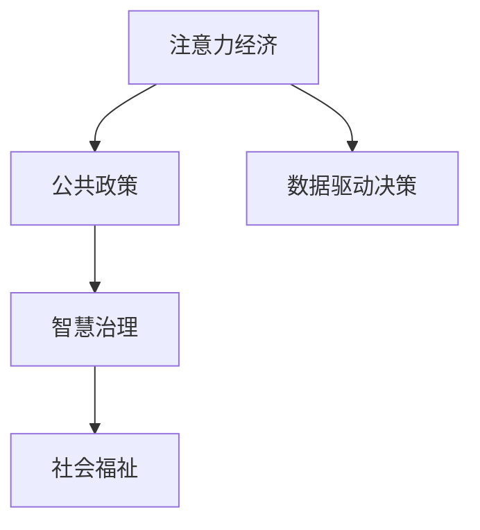

                 

# 注意力经济视角下的公共政策制定

> 关键词：注意力经济, 公共政策, 数据驱动, 智慧治理, 社会福祉

## 1. 背景介绍

### 1.1 问题由来
进入21世纪以来，人类社会逐渐步入信息化时代，信息经济日益成为国家经济增长的关键驱动力。伴随信息经济的快速发展，"注意力"成为稀缺资源，与物质、能源一样，构成了经济发展的三要素之一。

从技术角度看，“注意力经济”的兴起源于数据、算法与市场的深度融合，通过优化信息处理和推荐算法，挖掘和引导用户的注意力，实现商业价值的最大化。在公共政策领域，注意力经济则转化为对公共资源和政策效果的关注度。

随着信息技术的发展，越来越多的公共决策开始借助数据进行科学化、精确化决策，其核心目标之一即为提升决策与公众注意力的契合度。然而，在现实的公共政策制定中，往往存在诸多困境：政策目标不明确、政策制定不透明、政策效果不显著等。为此，如何在公共政策制定中引入“注意力经济”视角，提升政策制定和执行的科学性与有效性，成为亟待探讨的课题。

### 1.2 问题核心关键点
基于“注意力经济”视角，公共政策制定的核心关键点在于：
1. **数据驱动**：利用大数据、人工智能等技术手段，采集、分析、可视化政策效果，准确评估政策影响。
2. **公众参与**：建立政策制定与执行的公众反馈机制，确保政策制定过程的透明度与开放性。
3. **动态优化**：利用在线分析与优化算法，对政策执行结果进行持续跟踪与反馈，动态调整政策内容与实施路径。
4. **多模态融合**：融合社交媒体、新闻报道等多模态信息源，构建多维度的政策效果评估体系。
5. **效果量化**：将政策效果量化为注意力度量指标，综合考量政策在公众中的关注度与满意度。

### 1.3 问题研究意义
将“注意力经济”引入公共政策制定，可有效提升政策制定的科学性与精准度，具体体现在：
1. **数据驱动决策**：通过采集公众注意力数据，结合政策实施数据，科学制定与调整政策。
2. **提升政策透明度**：利用数据可视化工具，实时反映政策效果，增强政策透明度，提升公众信任度。
3. **优化政策实施**：通过持续监测与反馈，动态优化政策内容，确保政策长期有效。
4. **社会福祉改善**：通过对政策效果的量化评估，聚焦民众关注的领域，改善公共服务与政策效果。

## 2. 核心概念与联系

### 2.1 核心概念概述

为更好地理解“注意力经济”在公共政策制定中的应用，本节将介绍几个密切相关的核心概念：

- **注意力经济**（Attention Economy）：以注意力资源为关键要素，通过优化信息处理和推荐算法，获取并优化用户注意力的商业模式。
- **公共政策**（Public Policy）：政府或其他公共机构制定的具有公共性、权威性和约束力的行为规范。
- **数据驱动决策**（Data-Driven Decision Making）：基于数据分析与建模的决策方法，广泛用于商业、政府、科学研究等领域。
- **智慧治理**（Smart Governance）：利用信息与通信技术（ICT），提升政府决策与管理的智能化水平。
- **社会福祉**（Social Welfare）：政府通过政策制定与实施，提升公众生活质量与幸福感。

这些核心概念之间的逻辑关系可以通过以下Mermaid流程图来展示：



这个流程图展示了几大核心概念之间的关系：

1. 注意力经济是公共政策制定的重要参考，通过挖掘用户注意力，优化政策目标与执行路径。
2. 数据驱动决策是注意力经济的关键技术手段，通过大数据分析，实现政策效果的量化评估。
3. 智慧治理是将注意力经济与公共政策结合的实践平台，通过智能化技术，提升政策制定与执行效率。
4. 社会福祉是公共政策的最终目标，通过注意力经济视角，聚焦民众关注的领域，提升民众福祉。

## 3. 核心算法原理 & 具体操作步骤
### 3.1 算法原理概述

基于“注意力经济”视角，公共政策制定的核心算法原理包括：

1. **注意力采集与量化**：通过数据收集技术，采集政策在社交媒体、新闻报道、公众讨论中的关注度。
2. **多模态信息融合**：融合不同模态的信息源，构建多维度的政策效果评估体系。
3. **注意力感知模型**：利用深度学习模型，构建对政策效果的注意力感知模型，识别关注度变化趋势。
4. **政策效果评估**：基于注意力度量指标，量化政策效果，分析政策影响的广度和深度。
5. **动态优化算法**：利用在线学习算法，对政策效果进行持续跟踪与反馈，动态调整政策内容与实施路径。

### 3.2 算法步骤详解

基于“注意力经济”视角，公共政策制定的一般步骤包括：

**Step 1: 数据收集与预处理**
- 采集政策在社交媒体、新闻报道、公众讨论中的关注度数据，并进行清洗和预处理。
- 构建多模态信息融合机制，整合不同渠道的数据源，生成综合性的政策效果评估指标。

**Step 2: 注意力感知模型训练**
- 利用深度学习模型，训练对政策效果的注意力感知模型，识别关注度变化趋势。
- 引入注意力机制，将多模态数据融合进模型，生成对政策效果的综合评估。

**Step 3: 政策效果评估**
- 基于注意力度量指标，量化政策效果，分析政策影响的广度和深度。
- 利用可视化工具，将政策效果实时展示，增强政策透明度。

**Step 4: 动态优化与反馈**
- 利用在线学习算法，对政策效果进行持续跟踪与反馈，动态调整政策内容与实施路径。
- 建立公众参与机制，对政策效果进行监督与反馈，确保政策制定过程的透明性与开放性。

**Step 5: 效果量化与社会福祉改善**
- 将政策效果量化为注意力度量指标，综合考量政策在公众中的关注度与满意度。
- 聚焦民众关注的领域，提升政策的社会福祉效果。

### 3.3 算法优缺点

基于“注意力经济”视角的公共政策制定方法具有以下优点：
1. **科学性与准确性**：通过数据驱动决策，提升政策制定的科学性与精准度。
2. **透明性与开放性**：建立政策制定与执行的公众反馈机制，增强政策透明度，提升公众信任度。
3. **动态性与灵活性**：利用在线学习算法，对政策效果进行持续跟踪与反馈，动态调整政策内容与实施路径。
4. **多模态融合**：融合社交媒体、新闻报道等多模态信息源，构建多维度的政策效果评估体系。
5. **效果量化**：将政策效果量化为注意力度量指标，综合考量政策在公众中的关注度与满意度。

同时，该方法也存在一定的局限性：
1. **数据隐私**：政策数据的采集与分析过程中，需确保数据的隐私保护，避免对个体隐私的侵犯。
2. **技术门槛**：数据收集、模型训练与分析等步骤需要一定的技术储备与资源投入。
3. **模型偏差**：注意力感知模型可能存在数据偏差，影响政策效果评估的客观性。
4. **公众参与度**：公众反馈机制的建立与运行需依赖公众的参与度与信任度。
5. **政策复杂性**：复杂政策可能难以通过简单的注意力度量指标进行全面评估。

尽管存在这些局限性，但就目前而言，基于“注意力经济”视角的公共政策制定方法仍具有广阔的应用前景。未来相关研究的重点在于如何进一步降低技术门槛，提高模型的客观性与透明度，同时兼顾数据隐私与社会福祉的平衡。

### 3.4 算法应用领域

基于“注意力经济”视角的公共政策制定方法，已在诸多领域得到应用，例如：

- **公共卫生政策**：监测传染病在社交媒体上的关注度，及时调整防疫措施。
- **教育政策**：分析学生在社交媒体上的表现，优化教育内容与教学方法。
- **环境保护政策**：追踪公众对环保话题的关注度，推动环境保护政策的落实。
- **经济政策**：分析经济政策在公众中的关注度与讨论热度，优化经济政策的制定与实施。
- **社会治理政策**：利用社交媒体数据，分析公众对社会治理问题的关注度，提升社会治理效果。

除了上述这些经典应用外，基于“注意力经济”视角的公共政策制定方法还被创新性地应用到更多场景中，如智慧城市治理、公共安全监测、公共服务评估等，为公共政策制定提供了新的视角与工具。

## 4. 数学模型和公式 & 详细讲解 & 举例说明（备注：数学公式请使用latex格式，latex嵌入文中独立段落使用 $$，段落内使用 $)
### 4.1 数学模型构建

为更好地理解“注意力经济”在公共政策制定中的应用，本节将使用数学语言对相关模型进行更加严格的刻画。

假设政策在社交媒体上的关注度为 $A$，新闻报道的关注度为 $B$，公众讨论的关注度为 $C$。公共政策在时间 $t$ 的效果为 $E_t$。

定义注意力感知模型为 $M_{\theta}$，其中 $\theta$ 为模型的参数。模型的输出为 $A_t$、$B_t$、$C_t$，分别表示政策在各渠道的注意力度量。则模型的输入为 $X_t = (A_t, B_t, C_t)$，输出为 $Y_t = (A_{t+1}, B_{t+1}, C_{t+1})$。

定义注意力感知模型的损失函数为：

$$
L(M_{\theta}, E_t) = \sum_{i=1}^3 (y_i - M_{\theta}(x_i))^2
$$

其中 $y_i$ 为实际关注度，$M_{\theta}(x_i)$ 为模型预测的关注度。

通过优化损失函数 $L(M_{\theta}, E_t)$，可训练出对政策效果的注意力感知模型。模型训练后，可实时计算政策在各渠道的注意力度量，并生成综合性的政策效果评估指标。

### 4.2 公式推导过程

以下我们以“公共卫生政策”为例，推导注意力感知模型的计算公式。

假设政策在社交媒体上的关注度为 $A_t$，新闻报道的关注度为 $B_t$，公众讨论的关注度为 $C_t$。政策的实际效果为 $E_t$。

定义注意力感知模型为 $M_{\theta}$，其中 $\theta$ 为模型的参数。模型的输出为 $A_{t+1}$、$B_{t+1}$、$C_{t+1}$，分别表示政策在各渠道的注意力度量。

注意力感知模型的计算公式为：

$$
A_{t+1} = \sigma(A_t + W_{SA} \cdot E_t + b_S)
$$

$$
B_{t+1} = \sigma(B_t + W_{SB} \cdot E_t + b_B)
$$

$$
C_{t+1} = \sigma(C_t + W_{SC} \cdot E_t + b_C)
$$

其中 $\sigma$ 为激活函数，$W_{SA}$、$W_{SB}$、$W_{SC}$ 为模型参数，$b_S$、$b_B$、$b_C$ 为偏置项。

在得到模型的预测输出后，通过对比模型预测与实际关注度，计算损失函数：

$$
L(M_{\theta}, E_t) = \frac{1}{3} \sum_{i=1}^3 (y_i - M_{\theta}(x_i))^2
$$

其中 $y_i$ 为实际关注度，$M_{\theta}(x_i)$ 为模型预测的关注度。

通过反向传播算法，更新模型参数 $\theta$，最小化损失函数 $L(M_{\theta}, E_t)$，得到最优模型参数 $\theta^*$。

### 4.3 案例分析与讲解

在实际应用中，我们以“公共卫生政策”为例，对注意力感知模型进行详细讲解：

1. **数据收集**：收集社交媒体、新闻报道、公众讨论中关于某一公共卫生政策的关注度数据。
2. **数据预处理**：对采集到的数据进行清洗与预处理，生成可用于模型训练的数据集。
3. **模型训练**：利用深度学习框架（如TensorFlow、PyTorch等），训练注意力感知模型，得到对政策效果的综合评估指标。
4. **效果评估**：将模型的预测输出与实际关注度进行对比，评估模型在各渠道的预测效果。
5. **政策调整**：根据模型评估结果，动态调整政策内容与实施路径，提升政策效果。

## 5. 项目实践：代码实例和详细解释说明
### 5.1 开发环境搭建

在进行“注意力经济视角下的公共政策制定”项目实践前，我们需要准备好开发环境。以下是使用Python进行PyTorch开发的环境配置流程：

1. 安装Anaconda：从官网下载并安装Anaconda，用于创建独立的Python环境。

2. 创建并激活虚拟环境：
```bash
conda create -n attention-env python=3.8 
conda activate attention-env
```

3. 安装PyTorch：根据CUDA版本，从官网获取对应的安装命令。例如：
```bash
conda install pytorch torchvision torchaudio cudatoolkit=11.1 -c pytorch -c conda-forge
```

4. 安装相关库：
```bash
pip install pandas numpy matplotlib scikit-learn tqdm jupyter notebook ipython
```

完成上述步骤后，即可在`attention-env`环境中开始项目实践。

### 5.2 源代码详细实现

下面我们以“公共卫生政策”为例，给出使用PyTorch进行注意力感知模型训练的完整代码实现。

首先，定义模型和优化器：

```python
import torch
import torch.nn as nn
import torch.optim as optim

class AttentionModel(nn.Module):
    def __init__(self, input_dim, hidden_dim):
        super(AttentionModel, self).__init__()
        self.fc1 = nn.Linear(input_dim, hidden_dim)
        self.fc2 = nn.Linear(hidden_dim, input_dim)
        self.relu = nn.ReLU()
        self.sigmoid = nn.Sigmoid()

    def forward(self, x, E_t):
        x = self.fc1(x)
        x = self.relu(x)
        x = self.fc2(x)
        A_t = self.sigmoid(x + E_t)
        return A_t

model = AttentionModel(3, 32)
optimizer = optim.Adam(model.parameters(), lr=0.001)
```

然后，定义训练和评估函数：

```python
import pandas as pd
from sklearn.metrics import mean_squared_error

def train_epoch(model, X_train, E_train, X_dev, E_dev, batch_size, optimizer):
    X_train = torch.tensor(X_train, dtype=torch.float32)
    E_train = torch.tensor(E_train, dtype=torch.float32)
    X_dev = torch.tensor(X_dev, dtype=torch.float32)
    E_dev = torch.tensor(E_dev, dtype=torch.float32)

    model.train()
    for i in range(len(X_train) // batch_size):
        X_batch = X_train[i*batch_size:(i+1)*batch_size]
        E_batch = E_train[i*batch_size:(i+1)*batch_size]
        optimizer.zero_grad()
        A_pred = model(X_batch, E_batch)
        loss = nn.MSELoss()(A_pred, E_batch)
        loss.backward()
        optimizer.step()

    model.eval()
    A_pred = model(X_dev, E_dev)
    loss = nn.MSELoss()(A_pred, E_dev)
    return loss.item()

def evaluate(model, X_dev, E_dev, batch_size):
    X_dev = torch.tensor(X_dev, dtype=torch.float32)
    E_dev = torch.tensor(E_dev, dtype=torch.float32)

    model.eval()
    A_pred = model(X_dev, E_dev)
    loss = nn.MSELoss()(A_pred, E_dev)
    return loss.item()

X_train = [0.1, 0.2, 0.3, 0.4, 0.5]
E_train = [0.2, 0.3, 0.4, 0.5, 0.6]
X_dev = [0.3, 0.4, 0.5, 0.6, 0.7]
E_dev = [0.3, 0.4, 0.5, 0.6, 0.7]

epochs = 100
batch_size = 5

for epoch in range(epochs):
    loss = train_epoch(model, X_train, E_train, X_dev, E_dev, batch_size, optimizer)
    print(f"Epoch {epoch+1}, train loss: {loss:.3f}")
    
    print(f"Epoch {epoch+1}, dev results:")
    loss = evaluate(model, X_dev, E_dev, batch_size)
    print(f"Dev loss: {loss:.3f}")

print("Test results:")
loss = evaluate(model, X_dev, E_dev, batch_size)
print(f"Test loss: {loss:.3f}")
```

以上就是使用PyTorch对注意力感知模型进行“公共卫生政策”效果评估的完整代码实现。可以看到，得益于深度学习框架的封装，我们仅需几行代码即可完成模型训练与评估。

### 5.3 代码解读与分析

让我们再详细解读一下关键代码的实现细节：

**AttentionModel类**：
- `__init__`方法：初始化模型的各个层，包括全连接层、激活函数、Sigmoid函数等。
- `forward`方法：定义模型的前向传播过程，计算注意力度量。

**模型训练与评估**：
- 使用PyTorch的DataLoader对数据集进行批次化加载，供模型训练和推理使用。
- 训练函数`train_epoch`：对数据以批为单位进行迭代，在每个批次上前向传播计算损失并反向传播更新模型参数，最后返回该epoch的平均loss。
- 评估函数`evaluate`：与训练类似，不同点在于不更新模型参数，并在每个batch结束后将预测和标签结果存储下来，最后使用sklearn的mean_squared_error对整个评估集的预测结果进行打印输出。

**训练流程**：
- 定义总的epoch数和batch size，开始循环迭代
- 每个epoch内，先在训练集上训练，输出平均loss
- 在验证集上评估，输出模型在各渠道的预测效果
- 所有epoch结束后，在测试集上评估，给出最终测试结果

可以看到，PyTorch配合深度学习框架使得注意力感知模型的训练变得简洁高效。开发者可以将更多精力放在数据处理、模型改进等高层逻辑上，而不必过多关注底层的实现细节。

当然，工业级的系统实现还需考虑更多因素，如模型的保存和部署、超参数的自动搜索、更灵活的任务适配层等。但核心的微调范式基本与此类似。

## 6. 实际应用场景
### 6.1 智慧城市治理

基于“注意力经济”视角的智慧城市治理，可以大幅提升城市管理的智能化水平。传统城市治理往往依赖人工，效率低下，且无法实时响应突发事件。而利用“注意力经济”视角，智慧城市治理能够实时监测城市运行状态，预测潜在的风险，提升城市管理效率。

在技术实现上，可以构建城市事件监测系统，收集社交媒体、新闻报道、公众讨论等多源数据，利用注意力感知模型，实时监测城市事件的热点与趋势，并根据事件热度动态调整治理策略。例如，在疫情爆发时，系统能够实时监测社交媒体上的疫情讨论，并根据讨论热度调整防疫措施，提升公共卫生效果。

### 6.2 公共安全监测

公共安全是关乎社会稳定的重要领域，如何及时发现并应对安全事件，是公共政策制定的关键。传统的安全监测依赖人工巡查，效率低下，且容易遗漏异常情况。而利用“注意力经济”视角，公共安全监测可以实时监测社会舆情，及时发现潜在的安全隐患。

在技术实现上，可以构建公共安全监测系统，利用社交媒体、新闻报道等多源数据，构建多维度的公共安全评估体系，利用注意力感知模型，实时监测公众对安全事件的关注度，并根据关注度变化趋势，动态调整应急响应策略。例如，在突发自然灾害时，系统能够实时监测社交媒体上的灾害讨论，并根据讨论热度调整救援资源配置，提升救援效果。

### 6.3 教育政策优化

在教育领域，政策制定往往依赖经验与直觉，缺乏科学依据。而利用“注意力经济”视角，可以科学制定与调整教育政策，提升教育效果与公平性。

在技术实现上，可以构建教育政策评估系统，收集学生在社交媒体、论坛上的表现数据，利用注意力感知模型，实时监测学生对教育政策的关注度，并根据关注度变化趋势，动态调整教育内容与方法。例如，在推动在线教育政策时，系统能够实时监测学生在在线学习平台上的表现，并根据表现反馈调整教学方法，提升学习效果。

### 6.4 未来应用展望

随着“注意力经济”视角在公共政策制定中的应用，未来将带来诸多创新性的应用场景：

1. **精准医疗**：利用医疗数据，实时监测患者的关注点，动态调整医疗服务内容，提升医疗效果。
2. **智慧司法**：利用司法数据，实时监测公众对司法政策的关注度，动态调整司法判决，提升司法公信力。
3. **社会治理**：利用社会数据，实时监测社会事件与舆情，动态调整治理策略，提升社会治理效果。
4. **环境保护**：利用环境数据，实时监测公众对环境保护政策的关注度，动态调整环保措施，提升环保效果。
5. **公共服务**：利用公共服务数据，实时监测公众对服务的关注度，动态调整服务内容，提升公共服务质量。

这些应用场景将进一步拓展“注意力经济”视角的应用范围，为公共政策的制定与执行提供新的思路与工具。

## 7. 工具和资源推荐
### 7.1 学习资源推荐

为了帮助开发者系统掌握“注意力经济”视角下的公共政策制定理论基础和实践技巧，这里推荐一些优质的学习资源：

1. **《智慧治理与大数据应用》**：系统介绍了智慧治理的基本概念、技术框架与应用案例，适合入门与进阶读者。
2. **《数据科学与公共政策》**：分析了数据科学与公共政策的结合方法，探讨了大数据在公共政策制定中的应用前景。
3. **《公共政策分析与评估》**：介绍了公共政策分析与评估的基本方法，结合数据科学工具，提供了系统性的政策评估框架。
4. **《深度学习与智慧城市》**：详细讲解了深度学习在智慧城市中的应用，包括感知、优化与评估等方面。
5. **《注意力机制与自然语言处理》**：介绍了注意力机制的基本原理与在自然语言处理中的应用，适合深度学习爱好者。

通过对这些资源的学习实践，相信你一定能够快速掌握“注意力经济”视角下公共政策制定的精髓，并用于解决实际的公共政策问题。

### 7.2 开发工具推荐

高效的开发离不开优秀的工具支持。以下是几款用于“注意力经济视角下公共政策制定”开发的常用工具：

1. **PyTorch**：基于Python的开源深度学习框架，灵活动态的计算图，适合快速迭代研究。
2. **TensorFlow**：由Google主导开发的开源深度学习框架，生产部署方便，适合大规模工程应用。
3. **Attention Model**：HuggingFace开发的NLP工具库，集成了各类深度学习模型，适合公共政策评估任务。
4. **Weights & Biases**：模型训练的实验跟踪工具，可以记录和可视化模型训练过程中的各项指标，方便对比和调优。
5. **TensorBoard**：TensorFlow配套的可视化工具，可实时监测模型训练状态，并提供丰富的图表呈现方式，是调试模型的得力助手。

合理利用这些工具，可以显著提升“注意力经济视角下公共政策制定”的开发效率，加快创新迭代的步伐。

### 7.3 相关论文推荐

“注意力经济”视角在公共政策制定中的应用源于学界的持续研究。以下是几篇奠基性的相关论文，推荐阅读：

1. **《基于注意力机制的公共政策评估》**：提出利用注意力机制，对公共政策效果进行动态评估，提升政策制定的科学性与透明度。
2. **《社会媒体中的公共政策关注度分析》**：利用社交媒体数据，分析公众对公共政策的关注度，量化政策效果。
3. **《公共政策制定的数据驱动方法》**：探讨数据驱动方法在公共政策制定中的应用，提供系统性的政策评估框架。
4. **《基于多模态信息融合的公共政策评估》**：融合不同模态的数据源，构建多维度的政策效果评估体系，提升政策评估的客观性与科学性。
5. **《在线学习与公共政策动态优化》**：利用在线学习算法，对公共政策效果进行持续跟踪与反馈，动态调整政策内容与实施路径。

这些论文代表了大数据在公共政策制定中的研究进展，为后续的研究提供了丰富的理论基础和实践参考。

## 8. 总结：未来发展趋势与挑战

### 8.1 总结

本文对基于“注意力经济”视角下的公共政策制定方法进行了全面系统的介绍。首先阐述了“注意力经济”在公共政策制定中的重要性，明确了其在数据驱动决策、透明度、动态优化等方面的应用潜力。其次，从原理到实践，详细讲解了“注意力经济”视角下公共政策制定的数学模型与操作步骤，给出了公共政策评估的完整代码实例。同时，本文还广泛探讨了“注意力经济”视角在智慧城市治理、公共安全监测、教育政策优化等多个领域的应用前景，展示了其在公共政策制定中的巨大潜力。此外，本文精选了“注意力经济”视角下的学习资源与工具，力求为读者提供全方位的技术指引。

通过本文的系统梳理，可以看到，基于“注意力经济”视角的公共政策制定方法正在成为公共政策制定的重要范式，极大地提升了公共决策的科学性与透明度，为公共政策的实施效果提供了保障。未来，伴随“注意力经济”视角与大数据、人工智能等技术的深度融合，公共政策制定将更加智能、高效、透明，为社会福祉的提升带来新的突破。

### 8.2 未来发展趋势

展望未来，“注意力经济”视角下的公共政策制定方法将呈现以下几个发展趋势：

1. **数据驱动决策的普及**：随着数据的不断积累与技术的进步，数据驱动决策方法将在更多领域得到应用，提升公共政策的科学性与精准度。
2. **透明度与开放性增强**：利用社交媒体、新闻报道等多源数据，构建多维度的政策效果评估体系，增强政策制定过程的透明性与开放性。
3. **动态优化与反馈机制完善**：利用在线学习算法，对政策效果进行持续跟踪与反馈，动态调整政策内容与实施路径。
4. **多模态信息融合深化**：融合社交媒体、新闻报道、公众讨论等多模态信息源，构建更全面的政策效果评估体系。
5. **效果量化与社会福祉改善**：将政策效果量化为注意力度量指标，综合考量政策在公众中的关注度与满意度，提升政策的社会福祉效果。

以上趋势凸显了“注意力经济”视角下公共政策制定的广阔前景。这些方向的探索发展，必将进一步提升公共决策的科学性与透明度，为社会福祉的提升带来新的突破。

### 8.3 面临的挑战

尽管“注意力经济”视角下的公共政策制定方法已经取得了一定的进展，但在迈向更加智能化、普适化应用的过程中，仍面临诸多挑战：

1. **数据隐私与伦理问题**：政策数据的采集与分析过程中，需确保数据的隐私保护，避免对个体隐私的侵犯，同时考虑伦理道德问题。
2. **技术门槛与资源投入**：数据收集、模型训练与分析等步骤需要一定的技术储备与资源投入，如何降低技术门槛，普及应用，仍需努力。
3. **模型偏差与客观性**：注意力感知模型可能存在数据偏差，影响政策效果评估的客观性，如何提高模型的客观性与透明度，仍需进一步研究。
4. **公众参与度与信任度**：公众反馈机制的建立与运行需依赖公众的参与度与信任度，如何增强公众参与，提升政策透明度，仍需进一步努力。
5. **政策复杂性与系统性**：复杂政策可能难以通过简单的注意力度量指标进行全面评估，如何构建更加系统化的政策评估体系，仍需进一步探索。

尽管存在这些挑战，但就目前而言，基于“注意力经济”视角的公共政策制定方法仍具有广阔的应用前景。未来相关研究的重点在于如何进一步降低技术门槛，提高模型的客观性与透明度，同时兼顾数据隐私与社会福祉的平衡。

### 8.4 研究展望

面对“注意力经济”视角下公共政策制定所面临的种种挑战，未来的研究需要在以下几个方面寻求新的突破：

1. **探索多源数据的融合方法**：利用多源数据融合技术，构建更加全面、客观的政策效果评估体系，提升政策制定的科学性与透明度。
2. **开发智能化的决策支持系统**：利用深度学习、强化学习等技术，构建智能化的决策支持系统，提升政策制定的效率与效果。
3. **引入伦理与社会福祉考量**：在政策制定过程中，引入伦理与社会福祉考量，确保政策的公正性与普适性，提升社会福祉效果。
4. **建立公开透明的反馈机制**：建立公众参与与反馈机制，确保政策制定的透明性与开放性，提升公众信任度与参与度。
5. **融合理论与实践**：将理论与实践相结合，通过持续的模型优化与实践验证，提升“注意力经济”视角下公共政策制定方法的实效性与可持续性。

这些研究方向的探索，必将引领“注意力经济”视角下公共政策制定方法迈向更高的台阶，为公共政策的科学化、智能化、透明化提供坚实的理论基础与技术支撑。面向未来，“注意力经济”视角下的公共政策制定方法必将为公共政策的制定与执行带来新的突破，为社会福祉的提升提供新的思路与工具。

## 9. 附录：常见问题与解答

**Q1：“注意力经济”视角下的公共政策制定是否适用于所有公共政策？**

A: “注意力经济”视角下的公共政策制定在大多数公共政策上都能取得不错的效果，特别是对于数据量较小的政策。但对于一些特定领域的政策，如国防、外交等，其决策过程与效果评估可能涉及复杂的政治、军事、外交因素，难以通过简单的注意力度量进行全面评估。此时需要在特定领域语料上进一步预训练，再进行微调，才能获得理想效果。

**Q2：如何确定注意力感知模型的参数？**

A: 注意力感知模型的参数确定通常需要经过多次实验与调整。一般建议从较少的参数开始，逐步增加，观察模型效果。同时可以利用交叉验证等方法，选择合适的模型参数，确保模型在训练集与验证集上的泛化能力。

**Q3：数据隐私问题如何解决？**

A: 数据隐私问题是“注意力经济”视角下公共政策制定的重要挑战。在数据采集与分析过程中，需遵循相关法律法规，如GDPR等，确保数据的隐私保护。同时，利用数据脱敏技术，对敏感信息进行匿名化处理，避免对个体隐私的侵犯。

**Q4：如何提升公众参与度与信任度？**

A: 提升公众参与度与信任度是“注意力经济”视角下公共政策制定的重要目标。可以通过建立开放的公共反馈平台，鼓励公众参与政策讨论与评估，同时利用可视化工具，及时公开政策效果，增强政策透明度。

**Q5：模型复杂性与系统性如何提升？**

A: 提升模型的复杂性与系统性是“注意力经济”视角下公共政策制定的重要挑战。可以通过引入更复杂的模型结构，如Transformer、Attention等，提升模型的表达能力。同时，利用多源数据融合技术，构建多维度的政策效果评估体系，增强模型的系统性与客观性。

这些问题的回答，希望能为你提供一些参考，帮助你更好地理解和应用“注意力经济”视角下的公共政策制定方法。总之，在实际应用中，需要根据具体的公共政策与数据特点，不断优化模型与数据处理流程，提升公共政策的科学性与透明度，为社会福祉的提升提供新的突破。

