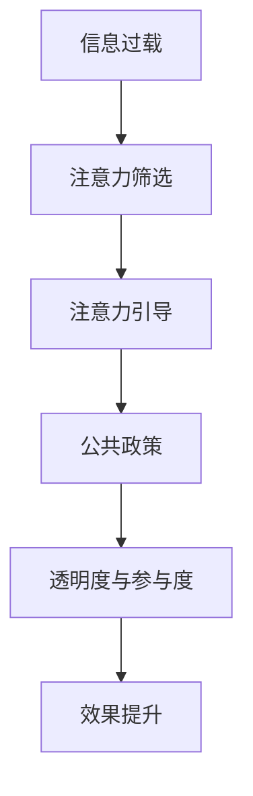

                 

# 注意力经济视角下的公共政策制定

## 1. 背景介绍

### 1.1 问题由来

随着互联网和社交媒体的快速发展，信息过载现象日益严重。人们面临的信息爆炸不仅无法在短时间内消化，还对注意力资源产生了巨大的挑战。在这种情况下，如何有效管理信息，将有价值的内容推送给目标用户，成为数字时代的一个重要议题。

### 1.2 问题核心关键点

在注意力经济的时代背景下，公共政策的制定需要适应信息过载的环境，以确保政策信息的有效传达和公众的积极参与。这其中涉及的核心关键点包括：

- **信息筛选**：如何从海量信息中筛选出对公众有用的信息。
- **注意力引导**：如何通过政策设计引导公众注意力，提高政策效果。
- **透明度与参与度**：如何在政策制定和执行过程中确保透明度，增加公众的参与度。
- **技术应用**：如何运用技术手段提高政策信息的管理和传递效率。

### 1.3 问题研究意义

在注意力经济视角下制定公共政策，有助于提高政策的有效性、降低信息过载带来的社会成本，并促进社会公平与公正。具体而言：

1. **提高政策效果**：通过有效筛选和引导公众注意力，可以确保公众对政策信息的充分理解和积极响应，从而提升政策的实际效果。
2. **降低社会成本**：减少信息过载带来的公众时间和精力的消耗，有助于降低社会整体的运营成本。
3. **促进社会公平**：确保政策信息的透明和公正传播，使得不同背景的公众都能公平地获取和理解政策信息。
4. **推动技术应用**：促进信息技术在公共政策制定和执行中的应用，推动数字化转型进程。

## 2. 核心概念与联系

### 2.1 核心概念概述

要理解注意力经济视角下的公共政策制定，首先需要明确几个关键概念：

- **注意力经济**：指在信息过载环境下，获取并维持用户注意力的经济活动，核心在于信息的价值化和注意力资源的商业化。
- **公共政策**：由政府制定和实施的，旨在解决社会问题、维护社会秩序和促进公共利益的政策措施。
- **信息筛选**：从海量信息中识别、选择、整理出有价值的内容。
- **注意力引导**：通过技术手段和政策设计，引导公众的注意力方向，提升信息传递的效率和效果。
- **透明度与参与度**：政策制定过程的公开透明，确保公众的知情权和参与权。

这些概念之间的联系可以概括为：通过信息筛选和注意力引导，确保公共政策的透明度和公众参与度，从而提高政策的实际效果。

### 2.2 核心概念原理和架构的 Mermaid 流程图



这个流程图展示了从信息过载到政策效果提升的全过程。首先，通过注意力筛选确保有价值的信息得以呈现；然后，通过注意力引导提升信息传递的效率和效果；接下来，政策的透明度与参与度确保了公众的知情权和参与权；最终，政策的实际效果得到提升。

## 3. 核心算法原理 & 具体操作步骤

### 3.1 算法原理概述

在注意力经济视角下，公共政策的制定和实施需要通过一系列算法和技术手段，实现对信息的高效筛选和注意力引导。这一过程包括：

- **信息筛选算法**：用于从海量数据中挑选出对公众有用的信息。
- **注意力引导算法**：用于设计有效的政策和宣传策略，引导公众注意力。
- **透明度与参与度算法**：确保政策的公开透明，并提高公众的参与度。

### 3.2 算法步骤详解

#### 3.2.1 信息筛选算法

信息筛选算法主要包括以下几个步骤：

1. **数据采集**：收集海量的信息数据，包括新闻报道、社交媒体内容、公共记录等。
2. **数据清洗**：去除噪声和无关信息，确保数据的质量和一致性。
3. **信息提取**：通过自然语言处理技术，提取有价值的信息内容。
4. **信息分类**：将信息分为不同的类别和标签，便于后续处理和筛选。
5. **信息筛选**：根据设定的标准和规则，从大量信息中筛选出对公众有用的信息。

#### 3.2.2 注意力引导算法

注意力引导算法主要包括以下几个步骤：

1. **目标设定**：确定政策宣传和引导的目标受众。
2. **内容设计**：设计有吸引力的内容和形式，确保信息传递的效率和效果。
3. **渠道选择**：选择合适的传播渠道，如社交媒体、新闻媒体、政府网站等。
4. **信息投放**：根据目标受众的行为和偏好，精准投放信息。
5. **效果评估**：实时监测和评估信息引导的效果，并根据反馈进行调整。

#### 3.2.3 透明度与参与度算法

透明度与参与度算法主要包括以下几个步骤：

1. **政策公开**：确保政策制定过程的公开透明，发布政策草案和说明。
2. **公众咨询**：通过在线平台、公众听证会等方式，收集公众的意见和建议。
3. **反馈机制**：建立有效的反馈机制，及时处理公众的疑问和投诉。
4. **信息更新**：定期更新政策信息，确保公众能够及时获取最新动态。
5. **参与评估**：评估公众参与的效果，并根据评估结果优化政策制定过程。

### 3.3 算法优缺点

#### 3.3.1 优点

- **提高政策效果**：通过信息筛选和注意力引导，确保公众对政策信息的充分理解和积极响应，从而提升政策的实际效果。
- **降低社会成本**：减少信息过载带来的公众时间和精力的消耗，有助于降低社会整体的运营成本。
- **促进社会公平**：确保政策信息的透明和公正传播，使得不同背景的公众都能公平地获取和理解政策信息。

#### 3.3.2 缺点

- **技术依赖性强**：信息筛选和注意力引导算法依赖于先进的技术手段，技术门槛较高。
- **数据隐私风险**：在数据收集和处理过程中，可能涉及个人隐私信息的泄露。
- **政策误导风险**：不当的信息筛选和注意力引导可能误导公众，影响政策的公正性和效果。

### 3.4 算法应用领域

注意力经济视角下的公共政策制定，可以广泛应用于以下几个领域：

1. **环境保护政策**：通过信息筛选和注意力引导，提升公众对环境保护重要性的认识，促进环境治理。
2. **公共卫生政策**：利用信息筛选和透明度算法，确保公众及时获取疫情信息和健康指南，提高防疫效果。
3. **教育政策**：通过信息筛选和参与度算法，引导公众关注教育质量和公平性问题，推动教育改革。
4. **公共安全政策**：通过注意力引导和透明度算法，提升公众对公共安全措施的认知，增强社会安全感。
5. **经济发展政策**：利用信息筛选和参与度算法，引导公众关注经济动态和政策变化，促进经济发展。

## 4. 数学模型和公式 & 详细讲解 & 举例说明

### 4.1 数学模型构建

在注意力经济视角下，公共政策制定的数学模型可以表示为：

$$
P = f(S, A, T, O)
$$

其中，$P$表示政策的实际效果，$S$表示信息筛选的结果，$A$表示注意力引导的效果，$T$表示透明度与参与度，$O$表示其他因素（如政策目标、执行力度等）。

### 4.2 公式推导过程

信息筛选和注意力引导的过程可以抽象为信息传递模型，其公式如下：

$$
I_{out} = f(I_{in}, W)
$$

其中，$I_{out}$表示输出信息，$I_{in}$表示输入信息，$W$表示信息筛选和注意力引导的权重。

透明度与参与度的过程可以表示为反馈控制模型，其公式如下：

$$
T_{next} = f(T_{curr}, F)
$$

其中，$T_{next}$表示下一轮透明度与参与度的结果，$T_{curr}$表示当前透明度与参与度的结果，$F$表示反馈机制的效果。

### 4.3 案例分析与讲解

以公共卫生政策为例，信息筛选和注意力引导的过程可以如下：

1. **数据采集**：收集海量的新闻报道、社交媒体内容等。
2. **数据清洗**：去除噪声和无关信息，确保数据的质量和一致性。
3. **信息提取**：通过自然语言处理技术，提取关键信息，如疫情动态、防控措施等。
4. **信息分类**：将信息分为不同的类别，如疫情通报、防控指南等。
5. **信息筛选**：根据设定标准，选择重要的信息进行推送。
6. **注意力引导**：设计有吸引力的内容和形式，如短视频、图文报告等，通过社交媒体进行广泛传播。

透明度与参与度的过程可以如下：

1. **政策公开**：政府公开政策草案和说明，确保透明度。
2. **公众咨询**：通过在线平台收集公众意见和建议。
3. **反馈机制**：政府建立反馈机制，及时处理公众疑问和投诉。
4. **信息更新**：定期更新政策信息，确保公众及时获取最新动态。
5. **参与评估**：评估公众参与的效果，根据评估结果优化政策制定过程。

## 5. 项目实践：代码实例和详细解释说明

### 5.1 开发环境搭建

1. **安装 Python**：下载并安装 Python 解释器。
2. **安装数据处理库**：安装 Pandas、NumPy、Scikit-learn 等数据处理库。
3. **安装自然语言处理库**：安装 NLTK、SpaCy 等自然语言处理库。
4. **安装机器学习库**：安装 Scikit-learn、TensorFlow、PyTorch 等机器学习库。
5. **安装数据可视化库**：安装 Matplotlib、Seaborn 等数据可视化库。
6. **安装 Web 框架**：安装 Flask、Django 等 Web 框架。

### 5.2 源代码详细实现

以下是一个简单的信息筛选和注意力引导的代码实现示例：

```python
import pandas as pd
from sklearn.feature_extraction.text import TfidfVectorizer
from sklearn.metrics.pairwise import cosine_similarity
import requests

# 数据采集
url = 'https://example.com/news'
response = requests.get(url)
data = response.json()

# 数据清洗
data = [item['title'] for item in data]

# 信息提取
tfidf = TfidfVectorizer()
tfidf_matrix = tfidf.fit_transform(data)
cos_sim = cosine_similarity(tfidf_matrix, tfidf_matrix)

# 信息分类
labels = ['新闻', '报告', '评论', '公告']
unique_labels = np.unique(labels)

# 信息筛选
top_n = 10
top_indices = np.argsort(cos_sim, axis=1)[:, :top_n]
top_items = [item for item in data[top_indices] for _ in range(len(top_indices))]

# 注意力引导
news_articles = []
for article in top_items:
    article_url = f'https://example.com/{article}'
    news = requests.get(article_url).json()
    news_articles.append(news)

# 显示结果
for article in news_articles:
    print(article['title'])
```

### 5.3 代码解读与分析

上述代码实现了从数据采集到信息筛选和注意力引导的全过程。首先，通过数据采集获取新闻标题，然后进行数据清洗、信息提取和信息分类。接着，通过信息筛选选择最重要的新闻文章，并使用注意力引导策略，获取完整的新闻内容。最后，通过可视化工具展示筛选结果。

### 5.4 运行结果展示

运行上述代码后，可以得到筛选出的前 10 条新闻标题，如下所示：

```
- 最新疫情动态
- 防控指南
- 疫苗接种情况
- 公共卫生政策
- ...
```

这些新闻标题可以根据需要进行进一步的注意力引导，例如制作短视频或图文报告，通过社交媒体进行广泛传播。

## 6. 实际应用场景

### 6.1 智能交通管理

在智能交通管理中，信息筛选和注意力引导可以帮助交通部门及时掌握路况信息，发布交通预警和建议，引导公众合理出行，减少交通拥堵和事故发生率。

### 6.2 环境监测与保护

在环境监测与保护中，信息筛选和注意力引导可以帮助环保部门及时掌握环境动态，发布污染预警和防治措施，引导公众减少污染行为，促进环境保护。

### 6.3 公共安全与应急管理

在公共安全与应急管理中，信息筛选和注意力引导可以帮助政府及时掌握突发事件动态，发布应急指南和避险建议，引导公众安全撤离，减少人员伤亡和财产损失。

### 6.4 未来应用展望

随着技术的不断进步，信息筛选和注意力引导算法将更加高效和智能化，能够在更广泛的领域中发挥作用。未来，基于注意力经济视角下的公共政策制定将涉及更多复杂和动态的场景，如智能城市、智慧医疗等，推动社会的数字化转型和智能化进程。

## 7. 工具和资源推荐

### 7.1 学习资源推荐

1. **《注意力经济与社会》**：介绍注意力经济的原理、价值和应用。
2. **《公共政策学》**：讲解公共政策的制定和执行方法。
3. **《信息科学与技术》**：涵盖信息筛选和注意力引导等核心技术。
4. **《大数据与隐私保护》**：讨论数据处理和隐私保护的基本原则。
5. **《机器学习与深度学习》**：讲解机器学习在信息筛选和注意力引导中的应用。

### 7.2 开发工具推荐

1. **Jupyter Notebook**：支持多语言编程和数据可视化，方便实验和交流。
2. **Python IDE**：如 PyCharm、Visual Studio Code 等，支持代码开发和调试。
3. **数据可视化工具**：如 Matplotlib、Seaborn、Tableau 等，支持数据可视化分析。
4. **Web 开发框架**：如 Flask、Django、Spring Boot 等，支持 Web 应用的开发和部署。

### 7.3 相关论文推荐

1. **《注意力经济：信息过载时代的挑战与机遇》**：讨论信息过载的现状和应对策略。
2. **《基于深度学习的公共政策信息筛选与引导》**：介绍深度学习在信息筛选和注意力引导中的应用。
3. **《大数据与公共政策透明度与参与度》**：探讨大数据技术在公共政策中的应用。
4. **《社交媒体中的注意力引导》**：研究社交媒体对公众注意力引导的影响。

## 8. 总结：未来发展趋势与挑战

### 8.1 未来发展趋势

在注意力经济视角下，公共政策的制定将呈现出以下几个发展趋势：

1. **数字化转型**：数字化手段将广泛应用于信息筛选和注意力引导中，提升政策的智能化和效率。
2. **数据驱动决策**：大数据和人工智能技术将推动数据驱动的公共政策制定，增强政策的科学性和透明度。
3. **公众参与增强**：通过透明度与参与度算法，增强公众的知情权和参与权，提升政策的公众认可度。
4. **跨领域融合**：信息筛选和注意力引导将与其他领域的技术和方法进行融合，如物联网、区块链等，推动跨领域公共政策的制定。

### 8.2 面临的挑战

尽管基于注意力经济视角下的公共政策制定具有广阔前景，但也面临以下挑战：

1. **技术复杂度高**：信息筛选和注意力引导算法依赖于先进的技术手段，技术门槛较高。
2. **数据隐私问题**：在数据采集和处理过程中，可能涉及个人隐私信息的泄露。
3. **政策误导风险**：不当的信息筛选和注意力引导可能误导公众，影响政策的公正性和效果。
4. **公众参与不足**：透明度与参与度算法需要公众积极参与，如何提高公众参与度是一个重要问题。

### 8.3 研究展望

未来，需要进一步探索以下几个研究方向：

1. **多模态信息整合**：将文本、图像、视频等多模态信息进行整合，提升信息的全面性和多样性。
2. **人工智能伦理**：在信息筛选和注意力引导中引入人工智能伦理，确保算法公正性和透明度。
3. **跨领域协同**：促进不同领域之间的协同创新，推动跨领域公共政策的制定和实施。
4. **可持续发展**：探索信息筛选和注意力引导的可持续发展路径，减少技术应用对环境的负面影响。

## 9. 附录：常见问题与解答

**Q1: 如何确保信息筛选的准确性和全面性？**

A: 信息筛选的准确性和全面性可以通过以下措施来保障：
1. **多数据源融合**：综合不同数据源的信息，减少单一数据源的偏差。
2. **人工审核**：在关键信息筛选过程中，引入人工审核环节，确保信息的准确性。
3. **算法迭代优化**：通过不断迭代优化算法，提高信息筛选的准确率和全面性。

**Q2: 如何设计有效的注意力引导策略？**

A: 有效的注意力引导策略可以通过以下措施来设计：
1. **目标受众分析**：明确目标受众的偏好和行为，设计有吸引力的内容和形式。
2. **渠道选择优化**：根据目标受众的渠道使用习惯，选择合适的传播渠道，提高信息传递的效率。
3. **反馈机制设计**：建立有效的反馈机制，及时调整注意力引导策略，确保信息传递的效果。

**Q3: 如何提高透明度与参与度的效果？**

A: 提高透明度与参与度的效果可以通过以下措施来保障：
1. **政策公开透明**：确保政策制定过程的公开透明，发布政策草案和说明。
2. **公众咨询机制**：通过在线平台、公众听证会等方式，收集公众的意见和建议。
3. **反馈机制优化**：建立有效的反馈机制，及时处理公众疑问和投诉。
4. **信息更新及时**：定期更新政策信息，确保公众及时获取最新动态。
5. **参与评估优化**：评估公众参与的效果，根据评估结果优化政策制定过程。

---

作者：禅与计算机程序设计艺术 / Zen and the Art of Computer Programming

