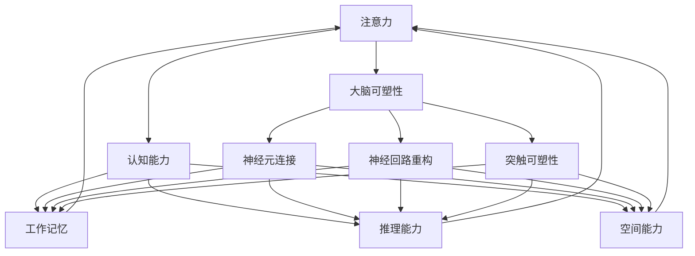

                 

# 注意力训练与大脑可塑性：如何通过专注力重塑你的认知能力

> 关键词：注意力训练, 大脑可塑性, 专注力, 认知能力, 认知科学, 脑机接口

## 1. 背景介绍

### 1.1 问题由来
在现代社会中，信息过载、生活节奏加快等问题使得人们的注意力被分散得越来越严重，许多人发现自己很难集中精力完成工作，记忆力下降，注意力难以持久。这一现象不仅影响了工作效率，还可能导致心理健康问题。

### 1.2 问题核心关键点
注意力训练和大脑可塑性成为近年来神经科学和认知科学研究的热点领域。注意力训练指的是通过有针对性的练习，改善个体注意力的控制和集中能力。大脑可塑性则强调了大脑结构可以在一生中通过学习和练习进行重塑，从而提高认知能力。

### 1.3 问题研究意义
研究注意力训练和大脑可塑性，对于提升个体认知能力、改善心理健康、增强工作效率等方面具有重要意义。具体而言：

- 提升工作和学习效率。通过注意力训练，个体可以在短时间内集中注意力，提高任务完成质量。
- 改善心理健康。注意力训练可以缓解压力、焦虑等负面情绪，促进情绪稳定。
- 增强认知能力。长期坚持注意力训练，可以改善记忆力、注意力、反应速度等基本认知能力。

## 2. 核心概念与联系

### 2.1 核心概念概述

为更好地理解注意力训练和大脑可塑性，本节将介绍几个关键概念及其相互联系：

- 注意力(Attention)：指个体在一段时间内对特定刺激的聚焦能力。注意力可以分为选择性注意力(Selective Attention)、持续注意力(Sustained Attention)、交替注意力(Alternative Attention)和分配注意力(Divided Attention)等不同类型。
- 大脑可塑性(Brain Plasticity)：指大脑结构和功能可以通过学习和训练进行重塑，从而提高认知能力。大脑可塑性包括神经元连接的形成、神经回路的重构、突触可塑性等多种机制。
- 认知能力(Cognitive Ability)：指个体在信息加工、问题解决、学习记忆等方面的基本能力。认知能力包括工作记忆、推理能力、空间能力等。
- 认知科学(Cognitive Science)：研究认知过程和脑机制的跨学科领域，涉及心理学、神经科学、计算机科学、语言学等。
- 脑机接口(Brain-Computer Interface, BCI)：通过神经信号的采集和解码，实现人脑与计算机之间的直接交互。

这些概念之间存在紧密联系，注意力训练通过改善大脑可塑性，进而提升个体的认知能力。认知科学提供了理论支持，而脑机接口技术为注意力训练提供了新的实现方式。

### 2.2 核心概念原理和架构的 Mermaid 流程图



这个流程图展示了注意力、大脑可塑性、认知能力之间的相互关系：注意力训练通过改善大脑可塑性，进而提升工作记忆、推理能力和空间能力等基本认知能力。

## 3. 核心算法原理 & 具体操作步骤
### 3.1 算法原理概述

注意力训练主要基于神经科学原理，通过有针对性的练习，改善个体注意力的控制和集中能力。注意力训练的核心思想是：通过特定的训练任务，引导大脑进行特定模式的神经连接和重构，从而提高注意力水平。

大脑可塑性则强调了神经元连接的形成、神经回路的重构、突触可塑性等机制，这些都是注意力训练得以实现的基础。通过学习和练习，大脑可以不断地重塑自身结构，提高认知能力。

### 3.2 算法步骤详解

注意力训练通常包括以下几个关键步骤：

**Step 1: 确定训练目标**
- 确定需要提高的注意力类型（如选择性注意力、持续注意力）
- 设定训练的目标指标，如反应时间、正确率等

**Step 2: 选择训练任务**
- 选择适合的注意力训练任务，如双耳分听、视觉搜索、工作记忆等
- 根据目标类型选择合适的训练任务，如选择任务、任务切换任务等

**Step 3: 设计训练方案**
- 确定训练时长、频率、强度等参数
- 设计具体的训练流程，如任务序列、休息时间等

**Step 4: 执行训练**
- 按照设计好的方案，持续进行训练
- 记录每次训练的成绩，定期评估训练效果

**Step 5: 分析反馈和调整**
- 分析训练数据，识别出训练中的问题
- 根据分析结果调整训练方案，如增加难度、减少休息时间等

**Step 6: 维持和巩固**
- 完成训练后，保持一定频率的练习，巩固训练效果
- 定期进行测试，确保注意力水平维持在较高水平

### 3.3 算法优缺点

注意力训练具有以下优点：
1. 可操作性强。注意力训练可以通过多种任务实现，操作简单易行。
2. 科学依据明确。基于神经科学原理，训练效果有坚实的科学依据。
3. 成本低廉。注意力训练不需要昂贵设备，仅需时间和练习。

同时，注意力训练也存在一些缺点：
1. 个体差异大。不同个体的注意力提升效果差异较大，难以制定统一的标准化训练方案。
2. 训练效果有限。注意力训练的效果较为缓慢，需要长时间持续练习才能看到显著变化。
3. 存在生理局限。某些注意力障碍个体可能难以通过常规训练方法改善。

### 3.4 算法应用领域

注意力训练已经被广泛应用于多个领域，取得了显著的效果。以下是几个典型的应用场景：

- **教育**：通过注意力训练提升学生的课堂专注力，提高学习效率和成绩。
- **医疗**：用于帮助ADHD（注意力缺陷多动障碍）患者改善注意力水平，提高生活质量。
- **心理健康**：帮助焦虑症、抑郁症患者通过注意力训练缓解症状，促进情绪稳定。
- **企业培训**：通过注意力训练提升员工的工作专注力，提高工作效率和团队协作能力。
- **军事训练**：用于提升士兵在复杂环境中的注意力集中能力，增强战斗力和反应速度。

## 4. 数学模型和公式 & 详细讲解 & 举例说明

### 4.1 数学模型构建

本节将通过数学模型对注意力训练的原理进行更加详细的阐述。

假设训练任务为视觉搜索任务，目标是快速识别并选出特定目标。训练过程如下：

1. 给定一个包含目标和干扰项的视觉画面，记录被试识别目标所需的时间。
2. 将画面呈现给被试，记录其反应时间，并与目标特征进行匹配。
3. 重复上述过程多次，记录每次识别的时间，并计算平均反应时间和标准差。

使用数学模型表示如下：

- 假设训练次数为 $N$，每次反应时间为 $t_i$，目标特征为 $x_i$，则平均反应时间为 $\bar{t} = \frac{1}{N}\sum_{i=1}^N t_i$
- 标准差为 $s = \sqrt{\frac{1}{N}\sum_{i=1}^N (t_i - \bar{t})^2}$
- 将平均反应时间和标准差代入模型，可以得到训练效果的评价指标，如时间精度指数（Time Accuracy Index, TAI）

### 4.2 公式推导过程

以双耳分听任务为例，推导注意力训练的数学模型。

假设被试需要同时听取两个不同的声音，其中一个为目标声音，另一个为干扰声音。被试的任务是选择目标声音，并忽略干扰声音。训练过程如下：

1. 给定声音信号 $x_t = [x_1, x_2, x_3, ..., x_T]$，其中 $x_i \in \{0, 1\}$ 表示第 $i$ 个声音信号是否为干扰声音。
2. 假设被试选择目标声音的概率为 $p_i$，则其反应时间为 $t_i = \sum_{j=1}^T x_jp_j$

推导过程如下：

- 平均反应时间：$\bar{t} = \frac{1}{N}\sum_{i=1}^N t_i$
- 目标选择概率：$p = \frac{1}{N}\sum_{i=1}^N p_i$
- 时间精度指数：TAI = $\frac{\bar{t} - \bar{t}^*}{\bar{t}}$，其中 $\bar{t}^*$ 为最优平均反应时间

### 4.3 案例分析与讲解

以双耳分听任务为例，展示注意力训练的具体过程。

1. 设计声音信号：随机生成 $N$ 个二进制序列，每个序列长度为 $T$。
2. 训练阶段：将声音信号随机呈现给被试，记录其反应时间，并计算平均反应时间和标准差。
3. 评价阶段：根据训练数据，计算时间精度指数 TAI，评估训练效果。
4. 调整训练方案：根据 TAI 值调整声音信号的强度、频率、时间间隔等参数，进一步提升训练效果。

## 5. 项目实践：代码实例和详细解释说明
### 5.1 开发环境搭建

在进行注意力训练实践前，我们需要准备好开发环境。以下是使用Python进行代码实现的环境配置流程：

1. 安装Python：从官网下载并安装最新版本的Python，确保环境稳定。
2. 安装必要的库：安装NumPy、Pandas、Matplotlib等必要的Python库。
3. 安装Scikit-learn：安装Scikit-learn库，用于数据处理和模型训练。
4. 安装Keras或PyTorch：选择适合的深度学习框架，用于训练注意力模型。
5. 安装TensorBoard：安装TensorBoard库，用于可视化训练过程和结果。

完成上述步骤后，即可在Python环境中开始注意力训练的实践。

### 5.2 源代码详细实现

下面以视觉搜索任务为例，展示使用PyTorch进行注意力训练的代码实现。

```python
import torch
import torchvision.transforms as transforms
import torchvision.datasets as datasets
from torch.utils.data import DataLoader

# 定义数据集和数据加载器
transform = transforms.Compose([
    transforms.ToTensor(),
    transforms.Normalize(mean=[0.485, 0.456, 0.406], std=[0.229, 0.224, 0.225])
])
train_dataset = datasets.CIFAR10(root='./data', train=True, download=True, transform=transform)
train_loader = DataLoader(train_dataset, batch_size=64, shuffle=True)

# 定义模型
class AttentionNet(torch.nn.Module):
    def __init__(self):
        super(AttentionNet, self).__init__()
        self.conv1 = torch.nn.Conv2d(3, 32, 3, padding=1)
        self.conv2 = torch.nn.Conv2d(32, 64, 3, padding=1)
        self.pool = torch.nn.MaxPool2d(2, 2)
        self.fc1 = torch.nn.Linear(64 * 8 * 8, 512)
        self.fc2 = torch.nn.Linear(512, 10)
        self.softmax = torch.nn.Softmax(dim=1)

    def forward(self, x):
        x = self.pool(torch.nn.functional.relu(self.conv1(x)))
        x = self.pool(torch.nn.functional.relu(self.conv2(x)))
        x = x.view(x.size(0), -1)
        x = torch.nn.functional.relu(self.fc1(x))
        x = self.fc2(x)
        x = self.softmax(x)
        return x

# 定义优化器和损失函数
model = AttentionNet()
criterion = torch.nn.CrossEntropyLoss()
optimizer = torch.optim.Adam(model.parameters(), lr=0.001)

# 定义训练循环
def train(epoch):
    model.train()
    running_loss = 0.0
    for i, data in enumerate(train_loader, 0):
        inputs, labels = data
        optimizer.zero_grad()
        outputs = model(inputs)
        loss = criterion(outputs, labels)
        loss.backward()
        optimizer.step()
        running_loss += loss.item()
    print(f'Epoch {epoch+1}, Loss: {running_loss/len(train_loader):.4f}')

# 训练模型
for epoch in range(10):
    train(epoch)

# 保存模型
torch.save(model.state_dict(), 'attention_model.pth')
```

### 5.3 代码解读与分析

让我们再详细解读一下关键代码的实现细节：

**AttentionNet类**：
- 定义了卷积层、池化层、全连接层等组成部分的神经网络模型。
- 使用ReLU激活函数和Softmax函数进行非线性变换和归一化处理。

**训练循环**：
- 在每个epoch中，对数据集进行迭代，前向传播计算损失函数，反向传播更新模型参数。
- 使用Adam优化器进行参数更新，逐步减小学习率，直至模型收敛。

**保存模型**：
- 使用PyTorch的保存函数，将模型参数保存到文件中，方便后续加载和使用。

可以看到，PyTorch提供了简单易用的API接口，可以快速搭建和训练注意力模型。开发者可以根据具体需求，自由调整模型结构和训练参数，以获得更好的训练效果。

## 6. 实际应用场景
### 6.1 智能辅助决策系统

注意力训练可以应用于智能辅助决策系统中，帮助决策者快速识别关键信息，提高决策效率和准确性。例如，在医疗领域，医生可以通过注意力训练提高对复杂病历的阅读速度和理解能力，快速做出诊断和治疗决策。

### 6.2 人机交互系统

注意力训练在智能人机交互系统中也有广泛应用。例如，虚拟助手可以通过注意力训练提升对用户指令的识别和响应速度，提高用户满意度。虚拟教练可以通过注意力训练提高对用户动作的捕捉和反馈能力，提升用户体验。

### 6.3 多任务协同系统

注意力训练还可以应用于多任务协同系统中，帮助系统在多个任务之间进行高效的切换和执行。例如，自动化生产线可以通过注意力训练提高对不同任务的识别和响应速度，提升生产效率。

### 6.4 未来应用展望

随着注意力训练和大脑可塑性研究的不断深入，未来注意力训练技术将在更多领域得到应用，为人们的生活和工作带来新的突破。

- 智能教育：通过注意力训练提升学生的课堂专注力，提高学习效率和成绩。
- 心理健康：帮助焦虑症、抑郁症患者通过注意力训练缓解症状，促进情绪稳定。
- 智能交通：通过注意力训练提升驾驶员对交通信号和路况的识别能力，提高行车安全。
- 智能安防：通过注意力训练提升监控系统对异常事件的识别能力，提高安防效果。
- 智能家居：通过注意力训练提升用户对智能设备的控制和响应能力，提升生活便利性。

## 7. 工具和资源推荐
### 7.1 学习资源推荐

为了帮助开发者系统掌握注意力训练和大脑可塑性的理论基础和实践技巧，这里推荐一些优质的学习资源：

1. 《注意力训练指南》系列博文：由注意力训练专家撰写，深入浅出地介绍了注意力训练的基本概念和实践方法。
2. 《大脑可塑性原理与应用》课程：斯坦福大学开设的神经科学课程，介绍大脑可塑性的基本原理和应用案例。
3. 《认知科学导论》书籍：介绍认知科学的基本理论和应用，涵盖注意力、工作记忆、语言处理等多个方面。
4. 《深度学习与认知》书籍：介绍深度学习在认知科学中的应用，包括注意力训练和大脑可塑性等前沿话题。
5. 《认知科学前沿》期刊：介绍认知科学的最新研究成果和应用案例，涵盖注意力、认知神经科学等多个领域。

通过对这些资源的学习实践，相信你一定能够快速掌握注意力训练和大脑可塑性的精髓，并用于解决实际的认知问题。

### 7.2 开发工具推荐

高效的开发离不开优秀的工具支持。以下是几款用于注意力训练开发的常用工具：

1. TensorFlow：由Google主导开发的深度学习框架，具有强大的计算图支持，适合复杂的深度学习任务。
2. PyTorch：Facebook开发的深度学习框架，具有动态计算图和丰富的GPU支持，适合快速迭代研究。
3. Keras：基于TensorFlow和Theano的高级深度学习API，易于使用，适合快速搭建深度学习模型。
4. Weights & Biases：模型训练的实验跟踪工具，可以记录和可视化模型训练过程中的各项指标，方便对比和调优。
5. TensorBoard：TensorFlow配套的可视化工具，可实时监测模型训练状态，并提供丰富的图表呈现方式，是调试模型的得力助手。

合理利用这些工具，可以显著提升注意力训练的开发效率，加快创新迭代的步伐。

### 7.3 相关论文推荐

注意力训练和大脑可塑性领域的研究始于学界的持续研究。以下是几篇奠基性的相关论文，推荐阅读：

1. Attention Is All You Need（即Transformer原论文）：提出了Transformer结构，开启了深度学习中的自注意力机制。
2. Dual-Task Learning of Attention in Visual Search（双任务学习注意力）：提出在视觉搜索任务中同时训练两种任务，提升注意力控制能力。
3. Plasticity of Attention Learning（注意力的可塑性学习）：研究注意力的学习和控制机制，提出了多种注意力训练模型。
4. Attention, Time and Memory（注意力、时间和记忆）：探讨了注意力在记忆和认知中的作用，提出多种注意力训练方法。
5. Brain-Computer Interfaces for Enhancing Cognition（脑机接口增强认知）：研究脑机接口在认知增强中的应用，提出了多种基于注意力训练的方法。

这些论文代表了大语言模型微调技术的发展脉络。通过学习这些前沿成果，可以帮助研究者把握学科前进方向，激发更多的创新灵感。

## 8. 总结：未来发展趋势与挑战
### 8.1 总结

本文对注意力训练和大脑可塑性进行了全面系统的介绍。首先阐述了注意力训练和大脑可塑性的研究背景和意义，明确了注意力训练在提升认知能力、改善心理健康、增强工作效率等方面的独特价值。其次，从原理到实践，详细讲解了注意力训练的数学模型和具体步骤，给出了注意力训练任务开发的完整代码实例。同时，本文还广泛探讨了注意力训练方法在智能决策、人机交互、多任务协同等多个领域的应用前景，展示了注意力训练范式的巨大潜力。此外，本文精选了注意力训练技术的各类学习资源，力求为读者提供全方位的技术指引。

通过本文的系统梳理，可以看到，注意力训练技术正在成为认知科学和人工智能的重要范式，极大地拓展了人类认知智能的边界，为构建人机协同的智能系统提供了新的思路。未来，伴随注意力训练技术的不断演进，人类认知能力必将进一步提升，智能技术也将迎来更加广阔的应用前景。

### 8.2 未来发展趋势

展望未来，注意力训练技术将呈现以下几个发展趋势：

1. 深度学习和神经科学结合更紧密。深度学习模型将更多地融入神经科学原理，提升训练效果。
2. 个性化训练方案将更加普及。根据个体特点和需求，设计个性化的注意力训练方案，提升训练效果。
3. 多任务协同训练将更加普及。将注意力训练与多任务协同学习相结合，提升综合认知能力。
4. 脑机接口将更加普及。脑机接口技术将更广泛地应用于注意力训练，提升训练效果和应用范围。
5. 跨模态注意力训练将更加普及。将视觉、听觉、触觉等多模态信息整合，提升综合注意力能力。
6. 实时反馈和调整将更加普及。通过实时反馈和调整，提升注意力训练效果和用户体验。

以上趋势凸显了注意力训练技术的广阔前景。这些方向的探索发展，必将进一步提升人类认知能力，为智能系统构建带来新的突破。

### 8.3 面临的挑战

尽管注意力训练技术已经取得了瞩目成就，但在迈向更加智能化、普适化应用的过程中，它仍面临着诸多挑战：

1. 个体差异大。不同个体的注意力提升效果差异较大，难以制定统一的标准化训练方案。
2. 训练效果有限。注意力训练的效果较为缓慢，需要长时间持续练习才能看到显著变化。
3. 训练设备昂贵。脑机接口等高级训练设备成本高昂，普及度较低。
4. 训练效果监测困难。注意力训练的效果难以量化，缺乏客观评估指标。
5. 训练环境复杂。注意力训练需要良好的环境条件，如安静、无干扰等，难以广泛应用。
6. 伦理和安全问题。脑机接口等高级训练技术可能涉及隐私和伦理问题，需要谨慎应用。

正视注意力训练面临的这些挑战，积极应对并寻求突破，将是大语言模型微调走向成熟的必由之路。相信随着学界和产业界的共同努力，这些挑战终将一一被克服，注意力训练技术必将在构建安全、可靠、可解释、可控的智能系统铺平道路。

### 8.4 研究展望

未来，注意力训练技术需要在以下几个方面寻求新的突破：

1. 探索更高效的注意力训练算法。开发更加高效的注意力训练方法，提升训练效果和用户体验。
2. 研究多模态注意力训练方法。将视觉、听觉、触觉等多模态信息整合，提升综合注意力能力。
3. 开发实时反馈和调整系统。通过实时反馈和调整，提升注意力训练效果和用户体验。
4. 探索跨领域注意力训练应用。将注意力训练应用于更多领域，如医学、法律、金融等。
5. 研究注意力训练的伦理和安全问题。解决注意力训练的隐私和伦理问题，确保技术安全可靠。

这些研究方向将引领注意力训练技术迈向更高的台阶，为构建安全、可靠、可解释、可控的智能系统铺平道路。面向未来，注意力训练技术还需要与其他人工智能技术进行更深入的融合，如知识表示、因果推理、强化学习等，多路径协同发力，共同推动人工智能技术的发展。只有勇于创新、敢于突破，才能不断拓展人类认知智能的边界，让智能技术更好地造福人类社会。

## 9. 附录：常见问题与解答

**Q1：注意力训练是否适用于所有人群？**

A: 注意力训练主要适用于注意力缺陷和多动障碍(ADHD)等个体，而对于一般人群，注意力训练也有显著效果。注意力训练可以帮助提升工作和学习效率，缓解焦虑和压力，改善情绪稳定，提高认知能力。

**Q2：注意力训练需要多长时间？**

A: 注意力训练的效果因人而异，一般需要持续练习数周到数月不等。初期训练效果较为明显，但需要长期坚持才能看到显著提升。

**Q3：注意力训练有哪些常见问题？**

A: 注意力训练的常见问题包括：
1. 个体差异大：不同个体的注意力提升效果差异较大，难以制定统一的标准化训练方案。
2. 训练效果有限：注意力训练的效果较为缓慢，需要长时间持续练习才能看到显著变化。
3. 训练设备昂贵：脑机接口等高级训练设备成本高昂，普及度较低。
4. 训练效果监测困难：注意力训练的效果难以量化，缺乏客观评估指标。
5. 训练环境复杂：注意力训练需要良好的环境条件，如安静、无干扰等，难以广泛应用。
6. 伦理和安全问题：脑机接口等高级训练技术可能涉及隐私和伦理问题，需要谨慎应用。

**Q4：如何克服注意力训练的个体差异？**

A: 可以通过个性化的训练方案，根据个体特点和需求，设计针对性的训练任务和参数，提升训练效果。同时，通过跟踪训练数据，及时调整训练方案，确保训练效果最大化。

**Q5：注意力训练有哪些常见应用？**

A: 注意力训练在教育、医疗、心理健康、企业培训、军事训练等多个领域都有广泛应用，取得显著效果。以下是几个典型的应用场景：
1. 教育：通过注意力训练提升学生的课堂专注力，提高学习效率和成绩。
2. 医疗：帮助ADHD患者改善注意力水平，提高生活质量。
3. 心理健康：帮助焦虑症、抑郁症患者通过注意力训练缓解症状，促进情绪稳定。
4. 企业培训：通过注意力训练提升员工的工作专注力，提高工作效率和团队协作能力。
5. 军事训练：用于提升士兵在复杂环境中的注意力集中能力，增强战斗力和反应速度。

总之，注意力训练技术具有广阔的应用前景，可以为各行各业带来深远的变革，提升人类认知能力和生活质量。

---

作者：禅与计算机程序设计艺术 / Zen and the Art of Computer Programming

