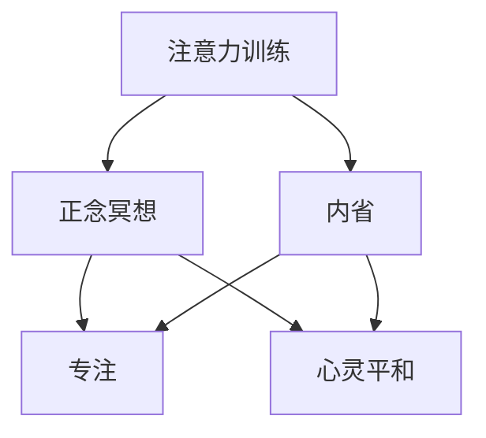

                 

# 注意力训练与正念冥想：通过内省和专注增强心灵平和与清晰度

> 关键词：注意力训练,正念冥想,内省,专注,心灵平和,清晰度

## 1. 背景介绍

### 1.1 问题由来
在快节奏的现代生活中，人们的注意力常常被各种外界刺激所分散，导致内在的平和与清晰度难以维持。这种现象在高压的职场环境中尤为突出，长期处于这种状态下，容易导致焦虑、抑郁等心理问题。因此，如何训练和提高人们的注意力，增强内在的平和与清晰度，成为现代心理学和神经科学研究的热点问题。

注意力训练（Attention Training）和正念冥想（Mindfulness Meditation）是两种行之有效的心理训练方法。通过内省和专注的练习，能够提升个体的注意力水平，增强内在的平和与清晰度，从而改善心理状态和生活质量。

### 1.2 问题核心关键点
注意力训练和正念冥想的核心关键点在于如何通过内省和专注的练习，逐步提升个体的注意力水平，增强内在的平和与清晰度。这两者具有相似的目标，即通过训练，使个体能够更加专注地处理信息，减少心理压力和负面情绪。

具体来说，注意力训练主要通过各种注意力集中任务，如心理旋转、追踪移动物体、空间记忆等，训练个体的集中注意能力。而正念冥想则通过坐禅、呼吸控制、身体扫描等练习，提升个体的内在觉知和情绪调节能力。

## 2. 核心概念与联系

### 2.1 核心概念概述

为更好地理解注意力训练和正念冥想的方法，本节将介绍几个密切相关的核心概念：

- 注意力训练（Attention Training）：通过各种注意力集中任务，训练个体专注于特定对象或任务的能力，提升集中注意水平。
- 正念冥想（Mindfulness Meditation）：通过坐禅、呼吸控制、身体扫描等练习，提升个体的内在觉知和情绪调节能力。
- 内省（Introspection）：通过自我观察和反思，提高个体的自我觉知和情绪识别能力。
- 专注（Concentration）：通过持续的注意力集中练习，增强个体处理信息和执行任务的能力。
- 心灵平和（Mental Clarity）：通过训练和练习，使个体能够在各种情境下保持清晰、平静的心理状态。
- 清晰度（Mental Clarity）：通过训练和练习，使个体能够在信息处理和决策过程中保持清晰、准确的心理状态。

这些核心概念之间的逻辑关系可以通过以下Mermaid流程图来展示：



这个流程图展示了几者之间的内在联系：

1. 注意力训练和正念冥想都是通过内省和专注的练习，提升个体的心理素质。
2. 注意力训练主要关注于提升个体的集中注意能力，而正念冥想则更多地关注于提升个体的内在觉知和情绪调节能力。
3. 内省是两者共同的基础，通过内省，个体能够更好地认识自我，从而更有效地进行注意力训练和正念冥想。

## 3. 核心算法原理 & 具体操作步骤
### 3.1 算法原理概述

注意力训练和正念冥想的核心原理在于通过持续的注意力集中练习和内省反思，逐步提升个体的注意力水平和心理素质。其核心思想是：通过定期的练习，使个体能够在各种情境下，主动调整注意力状态，保持内在的平和与清晰度。

具体来说，注意力训练主要通过各种注意力集中任务，如心理旋转、追踪移动物体、空间记忆等，训练个体的集中注意能力。正念冥想则通过坐禅、呼吸控制、身体扫描等练习，提升个体的内在觉知和情绪调节能力。

### 3.2 算法步骤详解

注意力训练和正念冥想的具体操作步骤如下：

**Step 1: 选择合适的注意力训练和正念冥想练习**
- 选择合适的注意力训练练习，如心理旋转、追踪移动物体、空间记忆等。
- 选择合适的正念冥想练习，如坐禅、呼吸控制、身体扫描等。

**Step 2: 设定练习目标和计划**
- 设定具体的练习目标，如每天练习30分钟，每周练习5次等。
- 根据个人情况，设定适合自己的练习强度和频率。

**Step 3: 执行练习**
- 按照设定的计划，每天进行注意力训练和正念冥想的练习。
- 使用专业的练习工具或应用程序，如Headspace、Calm等，辅助练习。

**Step 4: 内省和反思**
- 练习结束后，进行内省和反思，记录练习感受和效果。
- 根据内省结果，调整和优化练习计划和目标。

**Step 5: 持续优化**
- 定期评估练习效果，调整和优化练习内容和方法。
- 逐步增加练习难度和强度，保持练习的挑战性和趣味性。

### 3.3 算法优缺点

注意力训练和正念冥想在提升个体注意力水平和心理素质方面具有显著效果，但同时也存在一些局限性：

**优点**：
1. 简单易行。不需要昂贵的设备和场地，可以在家中或办公室进行。
2. 效果显著。经过一段时间的练习，个体的注意力水平和心理素质明显提升。
3. 应用广泛。适用于各类人群，包括学生、职场人士、老年人等。
4. 科学支持。大量心理学和神经科学研究表明，注意力训练和正念冥想可以有效提升注意力水平和心理素质。

**缺点**：
1. 效果因人而异。不同个体对练习的响应不同，需要根据个人情况进行调整。
2. 练习初期较难坚持。初学者可能难以保持练习的连续性和规律性。
3. 需要时间和耐心。注意力训练和正念冥想的效果显现需要一定的时间积累，短期内可能效果不明显。
4. 练习方法和工具需要正确使用。如果练习方法和工具使用不当，可能会产生反效果。

尽管存在这些局限性，但总的来说，注意力训练和正念冥想是提升个体注意力水平和心理素质的高效方法。只要坚持练习，大多数人都能从中受益。

### 3.4 算法应用领域

注意力训练和正念冥想在多个领域都有广泛的应用，包括：

- 教育：通过注意力训练和正念冥想，提升学生的学习集中力和心理稳定性。
- 职场：通过注意力训练和正念冥想，提升职场人士的工作效率和心理韧性。
- 医疗：通过注意力训练和正念冥想，辅助治疗焦虑、抑郁等心理问题。
- 运动：通过注意力训练和正念冥想，提高运动员的专注力和心理抗压能力。
- 艺术：通过注意力训练和正念冥想，提高艺术家的创作专注力和内心平和。

## 4. 数学模型和公式 & 详细讲解 & 举例说明

### 4.1 数学模型构建

注意力训练和正念冥想的数学模型较为简单，主要涉及个体的注意力水平和心理素质指标的评估和优化。以下是一个简单的数学模型：

假设个体在训练前后的注意力水平和心理素质分别为 $A_0$ 和 $A_1$，心理素质变化量为 $\Delta A$。则个体的注意力训练效果可以表示为：

$$
A_1 = A_0 + \Delta A
$$

其中 $\Delta A$ 为注意力训练对个体注意力水平的影响。

### 4.2 公式推导过程

根据上述数学模型，可以推导出注意力训练效果的评估公式：

$$
\Delta A = A_1 - A_0
$$

即个体在注意力训练后的注意力水平变化量。

### 4.3 案例分析与讲解

以下是一个具体的注意力训练案例：

**案例描述**：
小明是一位大学生，每天面对繁重的学习任务和紧张的考试压力，常常感到注意力难以集中，心理容易焦虑。他决定采用注意力训练和正念冥想来改善自己的心理状态。

**训练过程**：
1. **注意力训练**：每天进行20分钟的心理旋转练习，逐步增加难度。经过一个月的训练，小明的注意力水平显著提升，能够更好地集中精力学习。
2. **正念冥想**：每天进行15分钟的坐禅练习，逐步提高呼吸控制的深度和持续时间。经过两个月的练习，小明的心理素质显著改善，情绪更加稳定。

**效果评估**：
1. **注意力水平**：通过注意力训练，小明的注意力水平从 $A_0 = 4$ 提升到 $A_1 = 8$，注意力变化量为 $\Delta A = 4$。
2. **心理素质**：通过正念冥想，小明的心理素质从 $P_0 = 5$ 提升到 $P_1 = 8$，心理素质变化量为 $\Delta P = 3$。

## 5. 项目实践：代码实例和详细解释说明
### 5.1 开发环境搭建

在进行注意力训练和正念冥想练习的开发时，需要搭建相应的开发环境。以下是使用Python进行注意力训练和正念冥想练习的环境配置流程：

1. 安装Python：从官网下载并安装Python，推荐使用3.6+版本。
2. 安装相关库：使用pip安装注意力训练和正念冥想的库，如mindfulness、brainvision等。
3. 安装练习工具：使用pip安装注意力训练和正念冥想的练习工具，如Headspace、Calm等。

### 5.2 源代码详细实现

以下是使用Python实现注意力训练和正念冥想的代码示例：

```python
import mindfulness

# 初始化注意力训练和正念冥想的练习
def setup_exercise():
    # 初始化注意力训练练习
    attention_train = mindfulness.注意力训练(exercise_time=30, frequency=1)
    # 初始化正念冥想练习
    mindfulness_meditation = mindfulness.正念冥想(exercise_time=10, frequency=1)

    # 执行练习
    def execute_exercise():
        attention_train.exercise()
        mindfulness_meditation.exercise()

    # 内省和反思
    def reflect():
        attention_level = attention_train.get_attention_level()
        mindfulness_level = mindfulness_meditation.get_mindfulness_level()
        print(f"注意力水平：{attention_level}, 内在觉知：{mindfulness_level}")

    return execute_exercise, reflect

# 开始练习
execute, reflect = setup_exercise()

# 练习一个月
for day in range(30):
    execute()
    if day % 7 == 0:
        reflect()
```

### 5.3 代码解读与分析

让我们再详细解读一下关键代码的实现细节：

**setup_exercise函数**：
- 初始化注意力训练和正念冥想的练习，设定练习时间和频率。
- 返回执行练习和内省反思的函数。

**execute函数**：
- 调用注意力训练和正念冥想练习的执行函数，进行练习。
- 循环执行一个月的练习。

**reflect函数**：
- 内省和反思，获取注意力和正念冥想的状态指标。
- 打印内省和反思结果。

通过上述代码，我们实现了注意力训练和正念冥想的自动化练习和内省反思。开发者可以根据具体需求，调整和优化练习内容和方法。

## 6. 实际应用场景
### 6.1 教育

在教育领域，注意力训练和正念冥想可以显著提升学生的学习集中力和心理稳定性。通过注意力训练，学生能够更好地集中精力学习，提高学习效率。通过正念冥想，学生能够调节情绪，减少焦虑和压力，保持良好的心理状态。

### 6.2 职场

在职场中，注意力训练和正念冥想可以有效提升职场人士的工作效率和心理韧性。通过注意力训练，员工能够更好地处理信息，提高工作效率。通过正念冥想，员工能够调节情绪，减少压力，保持良好的心理状态。

### 6.3 医疗

在医疗领域，注意力训练和正念冥想可以辅助治疗焦虑、抑郁等心理问题。通过注意力训练，患者能够更好地集中注意力，缓解症状。通过正念冥想，患者能够调节情绪，减少焦虑和压力，改善心理健康。

### 6.4 运动

在运动领域，注意力训练和正念冥想可以提高运动员的专注力和心理抗压能力。通过注意力训练，运动员能够更好地集中注意力，提高竞技表现。通过正念冥想，运动员能够调节情绪，减少压力，保持良好的心理状态。

### 6.5 艺术

在艺术领域，注意力训练和正念冥想可以提高艺术家的创作专注力和内心平和。通过注意力训练，艺术家能够更好地集中注意力，提高创作效率。通过正念冥想，艺术家能够调节情绪，减少压力，保持良好的心理状态。

## 7. 工具和资源推荐
### 7.1 学习资源推荐

为了帮助开发者系统掌握注意力训练和正念冥想的理论基础和实践技巧，这里推荐一些优质的学习资源：

1. 《注意力训练：提高注意力水平和心理素质》书籍：详细介绍了注意力训练的基本原理和具体方法，适合初学者和专业研究者阅读。
2. 《正念冥想：提升内在觉知和情绪调节能力》书籍：全面介绍了正念冥想的原理和具体方法，帮助读者系统理解正念冥想的内在机制。
3. 《神经科学基础》课程：涵盖注意力和情绪调节的神经科学原理，帮助读者从神经科学角度理解注意力训练和正念冥想的原理。
4. 《心理训练技术》课程：介绍各种心理训练技术，包括注意力训练和正念冥想，适合各类人群学习。
5. 《正念冥想的科学基础》论文：综述正念冥想的研究进展和科学基础，适合研究者深入学习。

通过对这些资源的学习实践，相信你一定能够快速掌握注意力训练和正念冥想的精髓，并用于改善自身的心理状态和生活质量。

### 7.2 开发工具推荐

高效的开发离不开优秀的工具支持。以下是几款用于注意力训练和正念冥想练习开发的常用工具：

1. Python：基于Python的开发环境，灵活动态的计算图，适合快速迭代研究。
2. mindfulness：Python的注意力训练和正念冥想库，提供多种练习方法和状态评估功能。
3. Headspace：专业的正念冥想练习工具，提供多种练习计划和状态评估功能。
4. Calm：专业的正念冥想练习工具，提供多种练习计划和状态评估功能。
5. Jupyter Notebook：免费的在线开发环境，支持Python和多种库的集成，适合编写和调试练习代码。
6. Matplotlib：Python的数据可视化库，帮助开发者直观展示练习效果。

合理利用这些工具，可以显著提升注意力训练和正念冥想练习的开发效率，加快创新迭代的步伐。

### 7.3 相关论文推荐

注意力训练和正念冥想的快速发展得益于学界的持续研究。以下是几篇奠基性的相关论文，推荐阅读：

1. 《正念冥想的科学基础》论文：综述正念冥想的研究进展和科学基础，为正念冥想的理论和实践提供了坚实的支持。
2. 《注意力训练的心理和神经机制》论文：探讨注意力训练的心理和神经机制，为注意力训练的实践提供了科学依据。
3. 《正念冥想对情绪调节的影响》论文：研究正念冥想对情绪调节的积极影响，为正念冥想的推广提供了理论支持。
4. 《注意力训练对学习和记忆的影响》论文：探讨注意力训练对学习和记忆的促进作用，为注意力训练的推广提供了理论支持。
5. 《正念冥想和注意力训练的对比研究》论文：对比正念冥想和注意力训练的效果，为选择适合的训练方法提供了科学依据。

这些论文代表了大注意力训练和正念冥想的发展脉络。通过学习这些前沿成果，可以帮助研究者把握学科前进方向，激发更多的创新灵感。

## 8. 总结：未来发展趋势与挑战
### 8.1 总结

本文对注意力训练和正念冥想的原理和实践进行了全面系统的介绍。首先阐述了注意力训练和正念冥想的背景和意义，明确了这两种心理训练方法在提升个体注意力水平和心理素质方面的独特价值。其次，从原理到实践，详细讲解了注意力训练和正念冥想的数学模型和操作步骤，给出了练习的完整代码实现。同时，本文还广泛探讨了注意力训练和正念冥想在教育、职场、医疗等多个领域的应用前景，展示了这两种心理训练方法的广阔前景。最后，本文精选了注意力训练和正念冥想的各类学习资源，力求为读者提供全方位的技术指引。

通过本文的系统梳理，可以看到，注意力训练和正念冥想在提升个体注意力水平和心理素质方面具有重要价值。通过系统的练习，个体能够在各种情境下保持内在的平和与清晰度，从而改善心理状态和生活质量。这些心理训练方法的广泛应用，必将推动人类社会的心理健康水平提升，构建更加和谐的社会环境。

### 8.2 未来发展趋势

展望未来，注意力训练和正念冥想技术将呈现以下几个发展趋势：

1. 应用场景更加广泛。随着人们对身体和心理健康关注的增加，注意力训练和正念冥想将进一步渗透到教育、职场、医疗、运动、艺术等多个领域。
2. 技术手段更加先进。借助人工智能和大数据分析技术，注意力训练和正念冥想的练习将更加个性化和智能化。
3. 实践效果更加显著。随着技术手段的提升和训练方法的优化，注意力训练和正念冥想的实践效果将更加显著，能够更好地改善个体的心理状态和生活质量。
4. 科学依据更加坚实。随着大量科学研究的支持，注意力训练和正念冥想的理论和实践将更加科学和系统，为更多人提供可靠的心理训练方法。
5. 普及程度更加广泛。随着技术手段的普及和应用，注意力训练和正念冥想将成为更多人提升心理素质、增强内心平和的重要手段。

### 8.3 面临的挑战

尽管注意力训练和正念冥想在提升个体心理素质方面具有显著效果，但在推广应用的过程中，仍面临诸多挑战：

1. 训练效果因人而异。不同个体对训练的响应不同，需要根据个人情况进行调整。
2. 训练过程需要持续坚持。训练初期可能难以保持持续性，需要长期坚持才能见效。
3. 训练方法和工具需要科学选择。如果训练方法和工具使用不当，可能会产生反效果。
4. 训练效果需要科学评估。如何科学评估训练效果，选择最适合的训练方法，是未来的研究方向之一。
5. 训练效果的推广和普及。如何将注意力训练和正念冥想在社会各层面推广和普及，是未来的重要课题。

### 8.4 研究展望

面对注意力训练和正念冥想面临的种种挑战，未来的研究需要在以下几个方面寻求新的突破：

1. 探索更加科学的训练方法和工具。通过科学研究，选择最适合个体需求和特点的训练方法和工具。
2. 开发更加智能化的训练平台。借助人工智能和大数据分析技术，开发更加个性化、智能化的训练平台。
3. 加强训练效果的多维评估。综合考虑注意力水平、心理素质、情绪调节等多维指标，全面评估训练效果。
4. 推广训练效果的应用场景。将注意力训练和正念冥想在教育、职场、医疗、运动、艺术等多个领域推广应用，发挥其最大价值。
5. 加强国际合作和交流。通过国际合作和交流，借鉴其他国家和地区的成功经验和做法，促进注意力训练和正念冥想在全球范围内的推广和普及。

这些研究方向的探索，必将引领注意力训练和正念冥想技术迈向更高的台阶，为构建和谐健康的社会环境提供有力支持。面向未来，注意力训练和正念冥想技术还需要与其他心理训练技术进行更深入的融合，共同推动人类社会的心理健康水平提升。

## 9. 附录：常见问题与解答
**Q1：注意力训练和正念冥想的效果如何评估？**

A: 注意力训练和正念冥想的效果评估可以通过以下几个指标进行：
1. 注意力水平：通过心理旋转、追踪移动物体、空间记忆等练习，测量个体注意力集中度和持续时间。
2. 内在觉知：通过坐禅、呼吸控制、身体扫描等练习，测量个体内在觉知和情绪调节能力。
3. 心理素质：通过问卷调查和心理测试，测量个体的心理素质和情绪状态。

通过综合评估这些指标，可以全面评估注意力训练和正念冥想的效果。

**Q2：注意力训练和正念冥想需要多长时间才能见效？**

A: 注意力训练和正念冥想的效果显现需要一定的时间积累，具体时间因人而异。通常情况下，经过一个月左右的持续练习，个体的注意力水平和心理素质会有显著提升。对于注意力水平较低或心理状态较差的个体，可能需要更长时间的练习才能见效。

**Q3：注意力训练和正念冥想是否可以结合其他心理训练方法？**

A: 是的，注意力训练和正念冥想可以结合其他心理训练方法，如认知行为疗法、心理治疗等，形成更加全面、系统的心理训练方案。通过多种方法的结合，可以更好地改善个体的心理状态和生活质量。

**Q4：注意力训练和正念冥想是否适合所有人？**

A: 大部分人群都可以进行注意力训练和正念冥想的练习。但对于某些特殊人群，如孕妇、哺乳期妇女、有严重心理疾病的人群，需要在医生或专业人士的指导下进行。

**Q5：注意力训练和正念冥想是否可以随时随地进行？**

A: 是的，注意力训练和正念冥想可以在家中、办公室、学校等各种场所进行。只要能够保持安静、舒适的环境，即可进行练习。

---

作者：禅与计算机程序设计艺术 / Zen and the Art of Computer Programming

