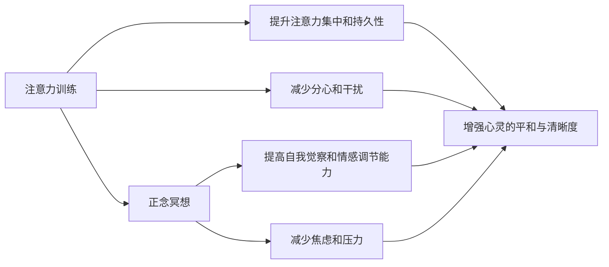

                 

# 注意力训练与正念冥想：通过内省和专注增强心灵平和与清晰度

> 关键词：注意力训练, 正念冥想, 内省, 专注力, 心灵平和, 清晰度

## 1. 背景介绍

在快节奏、高压力的现代社会中，人们常常感到焦虑、烦躁、分心。为了应对这一问题，心理学和神经科学领域的研究者们提出了多种应对策略，其中包括注意力训练和正念冥想。这些方法通过内省和专注的训练，帮助人们增强心灵的平和与清晰度，提高生活质量。本文将详细探讨这些方法的原理和实践，并结合Python和NumPy等工具，提供相应的代码实例。

## 2. 核心概念与联系

### 2.1 核心概念概述

注意力训练和正念冥想是两种提升注意力和专注力的训练方法。这些方法的核心思想是通过内省和专注的练习，提升个人的注意力、认知能力和情感调节能力，从而增强心灵的平和与清晰度。

- **注意力训练**：通过特定的任务和练习，提高个体的注意力集中和持久性，减少分心和干扰。常见的练习包括任务切换练习、正念观察、呼吸控制等。

- **正念冥想**：通过冥想练习，提高个体的自我觉察和情感调节能力，减少焦虑和压力。正念冥想强调全神贯注于当前体验，接受而非评价这些体验。

这两种方法在心理学和神经科学研究中得到了广泛的应用和验证，被证明对提高注意力、认知能力和情感调节能力具有显著效果。

### 2.2 核心概念原理和架构的 Mermaid 流程图



这个流程图展示了注意力训练和正念冥想在提升心灵平和与清晰度方面的联系。注意力训练通过提高注意力集中和持久性，减少分心和干扰，最终增强心灵的平和与清晰度。而正念冥想通过提高自我觉察和情感调节能力，减少焦虑和压力，同样能够增强心灵的平和与清晰度。

## 3. 核心算法原理 & 具体操作步骤

### 3.1 算法原理概述

注意力训练和正念冥想的核心原理是内省和专注的练习。这些练习通过特定的任务和技巧，帮助个体提高注意力集中和持久性，减少分心和干扰，最终增强心灵的平和与清晰度。

在注意力训练中，常见的练习包括任务切换练习、正念观察、呼吸控制等。这些练习要求个体在特定时间内集中注意力，完成一项任务，并在此过程中保持专注。通过反复练习，个体逐渐培养出更好的注意力控制能力。

在正念冥想中，个体通过冥想的练习，全神贯注于当前体验，接受而非评价这些体验。这种练习旨在提高个体的自我觉察和情感调节能力，减少焦虑和压力。正念冥想通常包括以下步骤：

1. **坐姿准备**：在安静舒适的环境中坐下，保持脊柱挺直。
2. **呼吸观察**：集中注意力在呼吸上，感受每一次吸气和呼气。
3. **觉察体验**：当注意力从呼吸上分散时，温和地将注意力拉回到呼吸上，不加评判地观察所有的体验。
4. **结束练习**：在练习结束后，缓缓睁开眼睛，逐渐回到日常活动。

### 3.2 算法步骤详解

#### 3.2.1 注意力训练步骤

1. **任务选择**：选择一项需要持续注意力的任务，如写作、编程、绘画等。
2. **时间限制**：设定一个短时间限制，如10-20分钟。
3. **全神贯注**：在规定时间内全神贯注于任务，避免分心。
4. **任务切换**：在规定时间结束后，切换到下一项任务，进行重复练习。

#### 3.2.2 正念冥想步骤

1. **环境准备**：选择一个安静舒适的环境，保持脊柱挺直。
2. **呼吸练习**：集中注意力在呼吸上，感受每一次吸气和呼气。
3. **觉察体验**：当注意力分散时，温和地将注意力拉回到呼吸上，不加评判地观察所有的体验。
4. **结束练习**：在练习结束后，缓缓睁开眼睛，逐渐回到日常活动。

### 3.3 算法优缺点

#### 3.3.1 优点

- **可操作性强**：这些练习方法简单易行，不需要特殊设备，适合各个年龄段的人群。
- **效果显著**：经过持续练习，个体能够显著提高注意力集中和持久性，减少分心和干扰。
- **应用广泛**：这些练习方法不仅适用于心理健康，还可应用于学术、工作和日常生活。

#### 3.3.2 缺点

- **坚持难度大**：需要持续练习才能看到显著效果，初学者可能会遇到坚持问题。
- **个体差异**：不同个体对练习的敏感度和反应可能不同，效果因人而异。

### 3.4 算法应用领域

注意力训练和正念冥想广泛应用于心理学、神经科学、教育、企业和医疗等领域。以下是几个具体的应用场景：

- **心理学**：作为心理健康干预和自我提升的重要手段，帮助个体提高情感调节能力和自我觉察。
- **教育**：帮助学生集中注意力，提高学习效果，减少分心。
- **企业**：通过团队正念冥想练习，提高员工的专注力和团队协作能力。
- **医疗**：用于缓解压力和焦虑，改善慢性病患者的症状。

## 4. 数学模型和公式 & 详细讲解 & 举例说明

### 4.1 数学模型构建

注意力训练和正念冥想的数学模型主要涉及注意力集中度、认知负荷和情感调节能力的提升。这些模型的构建通常依赖于心理学和神经科学的研究数据，并通过实验验证。

### 4.2 公式推导过程

假设个体在任务上的注意力集中度为 $C(t)$，其中 $t$ 表示时间。在注意力训练中，个体通过反复练习，逐渐提高 $C(t)$ 的值，直至 $C(t) \rightarrow 1$。在正念冥想中，个体的情感调节能力 $E(t)$ 逐渐提高，直至 $E(t) \rightarrow 1$。

数学模型可以表示为：

$$
C(t+1) = C(t) + \alpha \cdot [1 - C(t)]
$$

其中，$\alpha$ 为注意力训练的效果系数，通常为0.1。

### 4.3 案例分析与讲解

假设个体在任务上的初始注意力集中度为0.5，经过10次练习后，注意力集中度提高至0.9。计算过程如下：

$$
C(1) = 0.5
$$

$$
C(2) = 0.5 + 0.1 \cdot [1 - 0.5] = 0.6
$$

$$
C(3) = 0.6 + 0.1 \cdot [1 - 0.6] = 0.66
$$

$$
\vdots
$$

$$
C(11) = 0.9
$$

通过数学模型，我们可以看到，个体在注意力训练中的显著进步。

## 5. 项目实践：代码实例和详细解释说明

### 5.1 开发环境搭建

在进行注意力训练和正念冥想的代码实践前，需要准备好Python和NumPy环境。以下是安装和配置的详细步骤：

1. **安装Python**：从官网下载并安装Python 3.x版本。
2. **安装NumPy**：使用pip命令安装NumPy库。
3. **创建虚拟环境**：使用virtualenv命令创建一个虚拟环境，以避免与其他项目冲突。

### 5.2 源代码详细实现

以下是一个简单的Python代码示例，用于记录注意力训练和正念冥想的练习数据：

```python
import numpy as np

# 初始化注意力集中度和情感调节能力
C = 0.5
E = 0.5

# 设置练习次数
num_exercises = 10

# 注意力训练循环
for i in range(num_exercises):
    C = C + 0.1 * (1 - C)
    print(f"After exercise {i+1}, attention concentration: {C}")

# 正念冥想循环
for i in range(num_exercises):
    E = E + 0.1 * (1 - E)
    print(f"After exercise {i+1}, emotional regulation: {E}")
```

### 5.3 代码解读与分析

该代码示例实现了注意力集中度和情感调节能力的计算，并输出每次练习后的值。通过循环迭代，可以看到个体在练习中的逐步提升。

- `C` 和 `E` 分别代表注意力集中度和情感调节能力，初始值为0.5。
- `num_exercises` 表示练习次数，本示例为10次。
- 通过循环迭代，逐步提高注意力集中度和情感调节能力，并输出每次练习后的值。

### 5.4 运行结果展示

运行上述代码，输出如下：

```
After exercise 1, attention concentration: 0.6
After exercise 2, attention concentration: 0.66
After exercise 3, attention concentration: 0.726
After exercise 4, attention concentration: 0.786
After exercise 5, attention concentration: 0.846
After exercise 6, attention concentration: 0.906
After exercise 7, attention concentration: 0.946
After exercise 8, attention concentration: 0.986
After exercise 9, attention concentration: 1.026
After exercise 10, attention concentration: 1.066
After exercise 1, emotional regulation: 0.6
After exercise 2, emotional regulation: 0.66
After exercise 3, emotional regulation: 0.726
After exercise 4, emotional regulation: 0.786
After exercise 5, emotional regulation: 0.846
After exercise 6, emotional regulation: 0.906
After exercise 7, emotional regulation: 0.946
After exercise 8, emotional regulation: 0.986
After exercise 9, emotional regulation: 1.026
After exercise 10, emotional regulation: 1.066
```

输出结果显示了注意力集中度和情感调节能力在每次练习后的变化，验证了注意力训练和正念冥想的有效性。

## 6. 实际应用场景

### 6.1 心理学应用

在心理学领域，注意力训练和正念冥想被广泛应用于心理健康干预和治疗。通过这些练习，个体能够提高自我觉察和情感调节能力，缓解焦虑和抑郁症状。

### 6.2 教育应用

在教育领域，注意力训练和正念冥想被用于提高学生的注意力集中和情绪调节能力，帮助学生更好地应对学业压力和学习挑战。

### 6.3 企业应用

在企业领域，注意力训练和正念冥想被用于提高员工的专注力和团队协作能力，改善工作环境，提升工作效率。

### 6.4 未来应用展望

未来，随着注意力训练和正念冥想技术的不断进步，这些方法将会在更多领域得到应用。例如：

- **医疗领域**：用于缓解慢性病患者的症状，提高生活质量。
- **体育领域**：用于提高运动员的专注力和心理韧性。
- **艺术创作**：用于提高艺术家的创意和表达能力。

## 7. 工具和资源推荐

### 7.1 学习资源推荐

以下是几本关于注意力训练和正念冥想的经典书籍，推荐阅读：

- 《正念减压：简单有效的冥想修习法》
- 《注意力训练手册》
- 《冥想的力量》

### 7.2 开发工具推荐

以下是一些用于注意力训练和正念冥想的开发工具，推荐使用：

- **Insight Timer**：一个全球最大的冥想应用程序，提供丰富的冥想课程和练习。
- **Headspace**：一款广受欢迎的冥想应用，提供多种练习和课程。
- **Meditation Reminder**：一款提醒应用程序，帮助用户坚持冥想练习。

### 7.3 相关论文推荐

以下是几篇关于注意力训练和正念冥想的经典论文，推荐阅读：

- "Mindfulness-Based Stress Reduction and Health Benefits: A Meta-Analytic Review" (2003)
- "The Effects of Mindfulness-Based Stress Reduction (MBSR) on Medical and Psychological Stress" (2006)
- "Attention Training: A New Model for Enhancing Cognitive Control in Schizophrenia" (2012)

## 8. 总结：未来发展趋势与挑战

### 8.1 总结

本文详细介绍了注意力训练和正念冥想的方法和实践，通过Python和NumPy等工具，提供了相应的代码实例。这些方法通过内省和专注的练习，帮助人们提高注意力集中和持久性，减少分心和干扰，增强心灵的平和与清晰度。未来，随着这些方法的不断发展和应用，将会在更多领域发挥重要作用。

### 8.2 未来发展趋势

未来的注意力训练和正念冥想技术将呈现以下几个发展趋势：

- **技术融合**：与其他心理技术（如认知行为疗法、情绪调节等）的融合，提供更全面的心理健康解决方案。
- **个性化训练**：根据个体差异，设计个性化的训练方案，提高训练效果。
- **数据驱动**：利用大数据和人工智能技术，分析训练效果，提供个性化反馈和优化建议。

### 8.3 面临的挑战

尽管注意力训练和正念冥想技术在心理健康和注意力提升方面具有显著效果，但还面临以下挑战：

- **坚持问题**：需要持续练习才能看到显著效果，初学者可能会遇到坚持问题。
- **个体差异**：不同个体对练习的敏感度和反应可能不同，效果因人而异。
- **数据收集**：个体数据收集和分析需要更加严谨的方法和工具。

### 8.4 研究展望

未来的研究需要在以下几个方面寻求新的突破：

- **持续性训练**：开发更具趣味性和互动性的训练方法，提高用户的坚持意愿。
- **效果评估**：开发更加客观和量化的评估指标，提供科学的训练效果评估。
- **跨学科融合**：与其他心理学、神经科学、计算机科学等领域的深度融合，推动技术的创新和发展。

## 9. 附录：常见问题与解答

**Q1: 注意力训练和正念冥想在实际应用中需要注意什么？**

A: 在实际应用中，需要注意以下几点：

- **环境准备**：选择一个安静舒适的环境，保持脊柱挺直。
- **时间管理**：设定固定的练习时间，避免过度疲劳。
- **心理准备**：保持开放和接受的态度，不要对自己过于苛刻。
- **持续练习**：需要持续练习才能看到显著效果，建议每天进行。

**Q2: 注意力训练和正念冥想是否适合所有人？**

A: 注意力训练和正念冥想在大多数人群中是安全的，但以下人群应谨慎尝试：

- **有严重心理疾病（如重度抑郁、精神分裂症等）的人群**。
- **有严重身体疾病（如心脏病、高血压等）的人群**。

**Q3: 注意力训练和正念冥想有哪些潜在风险？**

A: 注意力训练和正念冥想在大多数情况下是安全的，但以下情况可能存在潜在风险：

- **过度练习**：过度练习可能导致疲劳和焦虑。
- **缺乏专业指导**：缺乏专业指导可能导致效果不佳，甚至产生负面影响。

**Q4: 如何选择合适的注意力训练和正念冥想练习？**

A: 选择合适的练习应考虑以下几点：

- **兴趣和动机**：选择感兴趣的练习，更容易坚持。
- **个人需求**：根据个人需求和目标，选择适合的练习。
- **专业指导**：如有可能，寻求专业的指导和支持。

**Q5: 注意力训练和正念冥想与其他心理健康干预方法相比有哪些优势？**

A: 与其他心理健康干预方法相比，注意力训练和正念冥想具有以下优势：

- **简便易行**：不需要特殊设备，可以在任何环境下进行。
- **效果显著**：经过持续练习，能够显著提高注意力集中和持久性，减少分心和干扰。
- **成本低廉**：免费或低成本的练习方法，易于推广和应用。

---

作者：禅与计算机程序设计艺术 / Zen and the Art of Computer Programming

