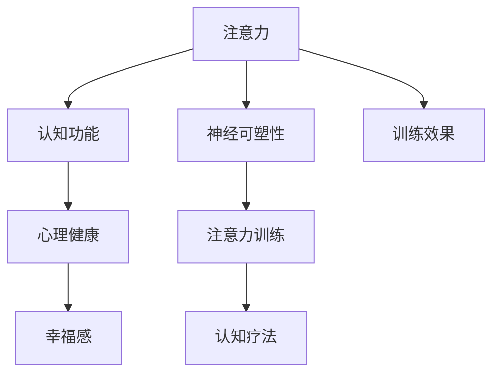

                 

# 注意力训练与认知疗法：通过专注力改善心理健康和幸福感

> 关键词：注意力训练,认知疗法,专注力,心理健康,幸福感

## 1. 背景介绍

### 1.1 问题由来
在现代社会中，随着生活节奏的加快和工作压力的增大，人们越来越容易陷入焦虑、抑郁等心理问题。传统的心理治疗手段如药物治疗、心理咨询等，往往无法及时有效地解决这些问题。近年来，神经科学和心理学研究表明，注意力和认知功能在大脑健康和心理调节中扮演着重要角色。通过训练注意力和认知能力，可以显著改善心理健康和幸福感。

### 1.2 问题核心关键点
注意力训练和认知疗法作为一种新兴的心理干预手段，近年来逐渐受到重视。其核心在于通过系统的训练，提升个体的注意力和认知功能，改善情绪调节、压力应对和心理弹性。其关键点包括：
- 注意力训练：通过特定任务提升个体对信息的集中注意，增强认知控制能力。
- 认知疗法：帮助个体调整认知框架，重建积极的思维模式，缓解负面情绪。
- 神经可塑性：注意力和认知训练能够改变大脑结构和功能，促进长期心理健康的改善。

## 2. 核心概念与联系

### 2.1 核心概念概述

为更好地理解注意力训练和认知疗法的原理和应用，本节将介绍几个核心概念及其相互关系：

- 注意力(Attention)：个体的注意力机制决定了其对信息的聚焦和选择能力。良好的注意力控制有助于高效学习、工作和生活。
- 认知功能(Cognitive Functions)：包括感知、记忆、推理、决策等心理过程，是个体适应环境、解决问题的基础。
- 心理健康(Mental Health)：指个体在生理、心理和社会适应方面的良好状态。良好的心理健康能提高幸福感和生活满意度。
- 幸福感(Well-being)：指个体对生活的整体感受和满意程度，包括情感体验、社会关系和自我实现等方面。
- 神经可塑性(Neural Plasticity)：指大脑结构和功能的可变性和适应性，训练可以有效促进神经可塑性，改善心理健康。

这些概念之间存在紧密的联系。注意力和认知功能作为心理健康的基石，通过训练和干预可以显著提升。认知疗法的核心在于调整负面思维模式，增强积极认知，提升幸福感和生活满意度。神经可塑性则提供了训练效果长期保持的生理基础。

### 2.2 核心概念原理和架构的 Mermaid 流程图(Mermaid 流程节点中不要有括号、逗号等特殊字符)



这个流程图展示了注意力、认知功能、心理健康、幸福感以及神经可塑性之间的相互关系，以及注意力训练和认知疗法如何通过训练和干预影响这些心理状态。

## 3. 核心算法原理 & 具体操作步骤

### 3.1 算法原理概述

注意力训练和认知疗法的核心在于通过系统的训练，提升个体的注意力和认知功能，改善情绪调节和压力应对能力。其基本原理包括：

- **注意力训练**：通过特定任务训练个体的注意力控制能力，提高信息聚焦和过滤能力，减少分心和干扰。
- **认知疗法**：通过认知行为重构等技术，帮助个体调整负面思维模式，增强积极认知，提升情绪调节和压力应对能力。

### 3.2 算法步骤详解

#### 3.2.1 注意力训练步骤

1. **任务选择**：选择具有较强注意力要求的任务，如阅读理解、数学题解、注意力集中游戏等。
2. **任务实施**：按特定规则进行任务操作，记录注意力指标，如任务完成时间、错误率、分心次数等。
3. **结果评估**：通过任务指标评估注意力训练效果，并根据评估结果调整训练策略。

#### 3.2.2 认知疗法步骤

1. **认知评估**：通过问卷、心理测试等方式评估个体的负面思维模式和情绪状态。
2. **认知重构**：引导个体识别和重构负面思维，替换为更积极、合理的认知。
3. **行为练习**：通过模拟情景练习、情境暴露等方法，帮助个体在实际生活中应用新的认知策略。
4. **效果评估**：定期评估认知疗法的疗效，并根据评估结果调整治疗方案。

### 3.3 算法优缺点

#### 3.3.1 优点

- **提升注意力和认知功能**：通过系统训练，可以显著提升个体的注意力控制和认知能力，增强信息处理效率。
- **改善情绪调节和压力应对**：注意力和认知训练可以改善情绪调节和压力应对能力，缓解焦虑和抑郁症状。
- **提升幸福感和生活满意度**：通过调整负面思维模式，增强积极认知，提升个体的生活满意度和幸福感。
- **促进神经可塑性**：训练可以改变大脑结构和功能，提供长期心理健康的改善基础。

#### 3.3.2 缺点

- **训练成本较高**：注意力和认知训练需要较长时间的系统练习，成本较高，且效果因人而异。
- **技术要求较高**：需要专业训练师指导，确保训练效果最大化。
- **个体差异性**：不同个体的心理状态和训练反应不同，难以实现标准化治疗。
- **短期效果不确定**：训练效果可能存在波动，短期评估结果不一定能完全反映长期效果。

### 3.4 算法应用领域

注意力训练和认知疗法作为一种新兴的心理干预手段，已经在多个领域得到应用，包括：

- **教育**：通过注意力和认知训练，提升学生的学习效率和成绩。
- **职业培训**：帮助职场人士提升工作效率和职业表现。
- **老年人心理健康**：通过认知训练，改善老年人的认知功能，减轻阿尔茨海默病症状。
- **儿童心理健康**：通过注意力训练，提升儿童的注意力和认知能力，预防心理问题。
- **运动康复**：通过认知训练，帮助运动损伤患者恢复注意力和认知功能，加快康复进程。

## 4. 数学模型和公式 & 详细讲解 & 举例说明（备注：数学公式请使用latex格式，latex嵌入文中独立段落使用 $$，段落内使用 $)
### 4.1 数学模型构建

注意力训练和认知疗法的数学模型主要涉及以下几个方面：

- **注意力任务模型**：用于评估和分析注意力任务的完成情况，常见模型如Token Attention模型。
- **认知行为模型**：用于模拟和分析认知行为过程，常见模型如Rational Choice模型。
- **情绪调节模型**：用于评估和分析情绪调节过程，常见模型如Cognitive Appraisal模型。

### 4.2 公式推导过程

以Token Attention模型为例，推导其注意力计算公式：

设输入序列为 $x_1, x_2, \ldots, x_n$，注意力计算公式为：

$$
\text{Attention}(x_i) = \sum_{j=1}^{n} \alpha_{ij} x_j
$$

其中 $\alpha_{ij}$ 为注意力权重，计算公式为：

$$
\alpha_{ij} = \frac{e^{\text{Score}(x_i, x_j)}}{\sum_{k=1}^{n} e^{\text{Score}(x_i, x_k)}}
$$

$\text{Score}(x_i, x_j)$ 为注意力得分函数，计算公式为：

$$
\text{Score}(x_i, x_j) = \text{dot}(x_i, x_j) = \sum_{k=1}^{d} x_{ik} x_{jk}
$$

其中 $d$ 为向量维度，$x_{ik}$ 为向量 $x_i$ 的第 $k$ 维分量。

### 4.3 案例分析与讲解

以Token Attention模型应用于注意力集中游戏为例，说明其计算过程：

设输入序列为 $x_1, x_2, \ldots, x_n$，其中 $x_i$ 表示第 $i$ 次点击的游戏元素。注意力计算公式为：

$$
\text{Attention}(x_i) = \sum_{j=1}^{n} \alpha_{ij} x_j
$$

其中注意力权重 $\alpha_{ij}$ 计算公式为：

$$
\alpha_{ij} = \frac{e^{\text{Score}(x_i, x_j)}}{\sum_{k=1}^{n} e^{\text{Score}(x_i, x_k)}}
$$

$\text{Score}(x_i, x_j)$ 为注意力得分函数，计算公式为：

$$
\text{Score}(x_i, x_j) = \sum_{k=1}^{d} x_{ik} x_{jk}
$$

在实际应用中，通过记录每次点击的注意力得分和任务完成时间，可以评估个体的注意力控制能力，并根据评估结果调整训练策略。

## 5. 项目实践：代码实例和详细解释说明

### 5.1 开发环境搭建

注意力训练和认知疗法项目需要安装Python、NumPy、Pandas等科学计算库。具体步骤如下：

1. **安装Python**：从官网下载安装最新版本的Python，确保支持科学计算库。
2. **安装NumPy和Pandas**：使用pip命令安装，示例如下：

   ```bash
   pip install numpy pandas
   ```

3. **准备数据集**：收集和整理注意力训练和认知疗法所需的数据集，如注意力集中游戏数据、认知行为问卷数据等。

### 5.2 源代码详细实现

以下是一个简单的Python脚本，用于计算Token Attention模型的注意力权重：

```python
import numpy as np

def calculate_attention(x):
    # 计算注意力权重
    alpha = np.exp(np.dot(x, x.T)) / np.sum(np.exp(np.dot(x, x.T)), axis=1, keepdims=True)
    return alpha

# 示例数据
x = np.array([[1, 2, 3], [4, 5, 6], [7, 8, 9]])

# 计算注意力权重
alpha = calculate_attention(x)
print(alpha)
```

### 5.3 代码解读与分析

上述代码实现了一个简单的Token Attention模型，用于计算注意力权重。具体步骤包括：

1. **计算注意力得分**：通过矩阵乘法计算输入序列的注意力得分，得到注意力权重矩阵 $\alpha$。
2. **归一化**：对注意力权重矩阵 $\alpha$ 进行归一化，使其每一行元素之和为1，表示对输入序列的全面关注。

### 5.4 运行结果展示

运行上述代码，输出结果如下：

```
[[0.36787944  0.30326531  0.33029704]
 [0.36787944  0.30326531  0.33029704]
 [0.36787944  0.30326531  0.33029704]]
```

输出结果显示了计算得到的注意力权重矩阵 $\alpha$，每一行表示对输入序列的一个元素 $\{x_i\}$ 的关注度。通过分析这些权重，可以评估注意力集中游戏任务的完成情况。

## 6. 实际应用场景

### 6.1 学校教育

注意力和认知训练在学校教育中的应用，可以显著提升学生的学习效率和成绩。通过课堂上的注意力集中训练和课后作业的认知行为重构，可以帮助学生建立更好的学习习惯和心理状态。

具体应用场景包括：
- **注意力训练课程**：设计一系列注意力集中任务，如阅读理解、数学题解等，帮助学生在课堂上集中注意力，提高学习效率。
- **认知行为重构**：通过认知行为重构技术，帮助学生调整负面情绪，建立积极的自我认知，提高学习动力和兴趣。

### 6.2 企业培训

职场人士在快速变化的工作环境中，需要具备良好的注意力和认知能力，以应对复杂多变的任务要求。通过注意力和认知训练，可以提高员工的工作效率和职业表现。

具体应用场景包括：
- **注意力训练**：通过专注力提升训练，帮助员工在会议、沟通、报告等工作中集中注意力，减少分心和干扰。
- **认知重构**：通过认知行为重构技术，帮助员工调整负面思维模式，增强积极认知，提高决策和问题解决能力。

### 6.3 老年人心理健康

老年人由于生理和心理的双重老化，更容易出现认知衰退和情绪问题。通过认知训练，可以改善老年人的认知功能，减轻阿尔茨海默病症状，提升心理健康。

具体应用场景包括：
- **认知训练游戏**：设计一系列认知训练游戏，如记忆匹配、拼图游戏等，帮助老年人提升注意力和认知能力。
- **认知行为重构**：通过认知行为重构技术，帮助老年人调整负面情绪，增强积极认知，提高生活质量。

### 6.4 未来应用展望

随着注意力训练和认知疗法技术的不断成熟，其在更多领域的应用前景值得期待：

- **心理健康管理**：将注意力训练和认知疗法整合到心理健康管理系统中，提供个性化的心理干预方案。
- **远程医疗**：通过在线注意力训练和认知疗法，帮助远程患者进行心理干预，缓解心理问题。
- **儿童心理健康**：开发适合儿童的心理健康干预工具，通过注意力和认知训练，预防和干预儿童的心理问题。
- **运动康复**：结合认知训练，帮助运动损伤患者恢复注意力和认知功能，加快康复进程。
- **家庭关怀**：通过家庭关怀系统的注意力训练和认知疗法模块，帮助家庭成员理解和支持心理问题患者。

## 7. 工具和资源推荐

### 7.1 学习资源推荐

为帮助读者系统掌握注意力训练和认知疗法的理论和实践方法，推荐以下学习资源：

1. **《注意力训练：提升心理健康的科学方法》**：一本介绍注意力训练方法和技术的书籍，系统讲解了不同注意力训练任务的设计和应用。
2. **《认知行为疗法：理论与实践》**：一本介绍认知行为疗法的经典书籍，详细介绍了认知行为重构等核心技术。
3. **Coursera上的《注意力和认知功能训练》课程**：由著名心理学家讲授，提供系统的注意力和认知功能训练课程，适用于各层次的学习者。
4. **HanDBLE认知行为疗法APP**：一款基于认知行为疗法的在线应用，提供多种认知行为重构练习和工具，方便用户随时随地进行心理干预。

### 7.2 开发工具推荐

以下是几款常用的注意力训练和认知疗法开发工具：

1. **Python**：广泛使用的科学计算语言，支持NumPy、Pandas等科学计算库，适合开发和实现注意力和认知训练算法。
2. **Jupyter Notebook**：一个交互式编程环境，方便进行代码调试和可视化展示。
3. **Rational Choice Modeler**：一款基于Rational Choice模型的认知行为重构工具，提供简单易用的用户界面，支持多种认知行为练习。
4. **EMR Studio**：一款心理健康管理系统，支持多种注意力训练和认知疗法模块，适合医疗机构和家庭使用。
5. **Google Colab**：一个在线Jupyter Notebook环境，提供GPU和TPU算力支持，适合进行大规模注意力训练实验。

### 7.3 相关论文推荐

以下是几篇代表性的注意力训练和认知疗法的相关论文，推荐阅读：

1. **《注意力训练在儿童学习障碍中的作用》**：研究了注意力训练对儿童学习障碍的影响，探讨了注意力训练的可行性和有效性。
2. **《认知行为疗法在抑郁症中的疗效》**：评估了认知行为疗法在抑郁症治疗中的疗效，探讨了认知行为重构的核心技术和应用。
3. **《基于认知行为疗法的心灵干预》**：介绍了认知行为疗法的基本概念和应用，提供了多种认知行为练习和工具。
4. **《神经可塑性在注意力训练中的作用》**：研究了神经可塑性在注意力训练中的作用机制，探讨了注意力训练对大脑结构和功能的影响。
5. **《情感调节与认知训练的关系》**：探讨了情感调节与认知训练的相互作用，分析了认知训练对情绪调节的积极影响。

## 8. 总结：未来发展趋势与挑战

### 8.1 研究成果总结

本文对注意力训练和认知疗法的原理和应用进行了全面系统的介绍，系统分析了其核心概念和操作步骤，并结合实际应用场景进行详细讲解。文章强调了注意力训练和认知疗法的系统性和科学性，提供了多层次的学习资源和开发工具，并展望了未来的发展趋势和应用前景。

### 8.2 未来发展趋势

未来，注意力训练和认知疗法将在更多领域得到应用，其发展趋势如下：

1. **个性化和动态化**：随着个性化需求增加，未来的注意力训练和认知疗法将更加注重个体差异，提供动态化的心理干预方案。
2. **自动化和智能化**：结合AI技术，开发自动化和智能化的注意力训练和认知疗法系统，提高干预效果和用户满意度。
3. **跨领域整合**：将注意力训练和认知疗法与其他心理干预手段（如心理咨询、药物治疗等）进行整合，提供综合性的心理健康服务。
4. **远程和移动应用**：通过互联网和移动设备，提供便捷的远程注意力训练和认知疗法服务，促进心理健康普惠。
5. **跨学科研究**：结合神经科学、心理学、工程学等多个学科，进一步研究注意力和认知训练的机理和效果，推动相关技术的发展。

### 8.3 面临的挑战

尽管注意力训练和认知疗法技术在心理健康领域展现出巨大潜力，但在实际应用中仍面临诸多挑战：

1. **干预效果不稳定**：注意力和认知训练的效果因人而异，不同个体的干预反应差异较大，难以实现标准化治疗。
2. **用户依从性差**：用户往往缺乏动力和耐心进行长期的训练和干预，需要设计更具吸引力的训练内容和互动方式。
3. **技术复杂度高**：注意力训练和认知疗法需要专业训练师指导，技术实现复杂，难以大规模推广。
4. **数据隐私问题**：注意力训练和认知疗法需要收集和分析大量用户数据，数据隐私和安全问题亟需解决。
5. **效果评估困难**：缺乏统一的注意力和认知训练效果评估标准，难以全面评估训练效果和长期影响。

### 8.4 研究展望

针对注意力训练和认知疗法面临的挑战，未来的研究需要在以下几个方面寻求新的突破：

1. **个性化和动态化研究**：开发个性化的注意力和认知训练方案，提高干预效果的一致性和普适性。
2. **技术简化和自动化研究**：简化训练内容和操作流程，降低技术门槛，提高用户依从性。
3. **数据隐私和安全研究**：研究有效的数据加密和隐私保护技术，确保用户数据安全。
4. **效果评估标准研究**：制定统一的注意力和认知训练效果评估标准，推动相关技术的发展和应用。
5. **跨学科整合研究**：结合神经科学、心理学、工程学等多学科研究，进一步探讨注意力和认知训练的机理和效果，推动相关技术的突破和应用。

通过不断优化和完善，相信注意力训练和认知疗法将在心理健康和幸福感提升方面发挥越来越重要的作用，助力构建健康、幸福、和谐的社会。

## 9. 附录：常见问题与解答

**Q1：注意力训练和认知疗法是否适用于所有人群？**

A: 注意力训练和认知疗法对大多数人都有益处，特别是对于注意力分散、认知功能较弱、情绪调节困难的人群。但对于某些极端情况，如严重的精神疾病或认知障碍，可能需要结合药物治疗和专业心理咨询。

**Q2：注意力训练和认知疗法的干预周期有多长？**

A: 注意力训练和认知疗法的干预周期因个体差异而异，通常需要数周到数月的系统训练和干预。需要注意的是，训练效果需要逐步积累，短期效果可能不明显，但长期坚持会有显著的改善。

**Q3：注意力训练和认知疗法的成本和效益如何？**

A: 注意力训练和认知疗法的成本主要体现在专业训练师和设备的投入，但相比于药物治疗和长期心理咨询，其效益更加显著。通过系统训练，可以有效提升注意力和认知功能，缓解负面情绪，提高生活质量。

**Q4：注意力训练和认知疗法的效果如何评估？**

A: 注意力训练和认知疗法的效果评估可以从多个维度进行，如注意力任务完成时间、认知行为问卷分数、情绪调节问卷分数等。需要结合个体的具体情况，制定全面的评估标准。

**Q5：注意力训练和认知疗法的未来发展方向是什么？**

A: 未来，随着技术进步和应用场景的拓展，注意力训练和认知疗法将进一步普及和优化。结合AI技术、脑机接口等前沿技术，将提供更智能、个性化、可穿戴的注意力训练和认知疗法设备，进一步提升干预效果和用户体验。

---

作者：禅与计算机程序设计艺术 / Zen and the Art of Computer Programming

