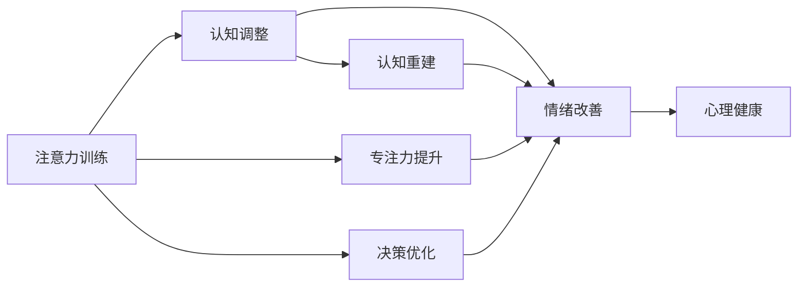

                 

# 注意力训练与认知疗法：通过专注力改善心理健康和幸福感

> 关键词：注意力训练,认知疗法,心理健康,幸福感,专注力

## 1. 背景介绍

在现代快节奏的生活中，人们的心理健康面临着前所未有的挑战。焦虑、抑郁、注意力缺陷等问题成为现代社会常见的心理困扰。传统的药物治疗、心理疗法等手段，虽然有效，但存在一些局限性。随着认知神经科学和人工智能技术的进步，一种基于注意力训练和认知疗法的创新方法应运而生，为改善心理健康和幸福感提供了新的可能性。

本文将深入探讨注意力训练和认知疗法的基本原理，并结合实际案例，详细讲解其操作步骤，分析优缺点，展望未来应用前景。

## 2. 核心概念与联系

### 2.1 核心概念概述

**注意力训练**：通过特定的注意力任务训练，提高大脑对信息的关注和处理能力。其原理基于认知神经科学的最新研究成果，认为注意力是人脑信息处理的核心机制，通过持续的注意力训练，可以提升个体的专注力、决策能力和情绪调节能力。

**认知疗法**：一种基于认知心理学理论的心理治疗方法，通过改变个体的认知模式，消除不良情绪和行为。认知疗法强调个体对自己的思维过程进行反思和调整，以实现心理健康和幸福感的提升。

注意力训练和认知疗法两者相辅相成，注意力训练可以通过改善大脑信息处理能力，提高认知疗法的有效性；认知疗法也可以通过改变个体认知模式，促进注意力训练的实施。

### 2.2 核心概念原理和架构的 Mermaid 流程图



这个流程图展示了注意力训练与认知疗法的核心联系：注意力训练通过提升专注力和决策能力，帮助个体在认知疗法中进行情绪调整和认知重建，最终实现心理健康的全面提升。

## 3. 核心算法原理 & 具体操作步骤

### 3.1 算法原理概述

注意力训练的算法原理基于注意力机制的学习。注意力机制是一种神经网络组件，可以动态地从输入数据中筛选出关键信息，并集中资源进行深度处理。在注意力训练中，通过特定的注意力任务（如目标追踪、视觉搜索等），对大脑进行训练，使其能够更高效地筛选和处理信息。

认知疗法则是通过改变个体的认知模式，消除不良情绪和行为。在认知疗法中，心理医生或训练师会引导个体进行自我反思和认知重构，改变不合理的思维模式，从而改善情绪和行为。

### 3.2 算法步骤详解

**步骤 1: 准备训练数据和模型**

- 收集相关的注意力训练数据集，如视觉搜索任务、目标追踪任务等。
- 选择合适的深度学习框架（如TensorFlow、PyTorch等），构建注意力模型。

**步骤 2: 设计注意力任务**

- 根据目标需求，设计特定的注意力任务，如视觉搜索、目标追踪等。
- 将注意力任务分解为多个子任务，每个子任务包含一系列注意力模块。

**步骤 3: 实施注意力训练**

- 使用训练数据集对注意力模型进行训练，逐步调整模型参数，提高注意力机制的效率和准确性。
- 通过评估指标（如准确率、召回率、F1分数等），监控训练过程，防止过拟合。

**步骤 4: 应用认知疗法**

- 根据注意力训练的结果，设计个性化的认知疗法方案。
- 引导个体进行自我反思和认知重构，逐步改变不合理的思维模式。

**步骤 5: 持续反馈和调整**

- 定期进行心理测评和注意力测试，评估个体的心理健康和注意力水平。
- 根据测评结果，调整注意力训练和认知疗法的方案，确保治疗效果。

### 3.3 算法优缺点

**优点**：
- 显著提升专注力和决策能力，改善情绪和行为。
- 基于科学的认知心理学理论，效果显著。
- 可以通过自适应算法进行个性化训练，适应不同个体需求。

**缺点**：
- 训练过程较为复杂，需要专业知识和技术支持。
- 需要大量的注意力数据，训练成本较高。
- 效果因人而异，个体差异较大。

### 3.4 算法应用领域

注意力训练和认知疗法在多个领域都有广泛的应用：

- **心理健康**：用于治疗焦虑、抑郁、注意力缺陷等问题，改善个体的情绪和行为。
- **教育**：帮助学生提高学习效率和专注力，提升学习效果。
- **体育**：提高运动员的反应速度和决策能力，提升竞技水平。
- **企业管理**：提升领导者的决策能力和专注力，优化团队管理。

## 4. 数学模型和公式 & 详细讲解 & 举例说明

### 4.1 数学模型构建

注意力训练的数学模型可以表示为：

$$
\theta = \mathop{\arg\min}_{\theta} \mathcal{L}(\theta, \{D_i\})
$$

其中，$\theta$ 为注意力模型的参数，$\mathcal{L}$ 为损失函数，$D_i$ 为注意力训练数据集。

### 4.2 公式推导过程

以视觉搜索任务为例，注意力模型的输入为一张图像 $I$，输出为图像中目标位置 $T$。模型的损失函数可以表示为：

$$
\mathcal{L} = -\log P(T|I, \theta)
$$

其中，$P(T|I, \theta)$ 为目标位置 $T$ 在图像 $I$ 中出现的概率，由注意力模型计算得到。

### 4.3 案例分析与讲解

假设我们有一个包含多个视觉搜索任务的训练集 $D$，其中每个任务包含一张图像 $I$ 和一个目标位置 $T$。我们希望通过训练一个注意力模型 $M$，使模型能够在新的图像上高效地定位目标位置。

**Step 1: 数据准备**

- 收集大量图像和目标位置数据集，将其划分为训练集、验证集和测试集。
- 对图像数据进行预处理，如归一化、裁剪等。

**Step 2: 构建模型**

- 使用卷积神经网络（CNN）作为基础特征提取器。
- 在特征提取器之上，添加注意力机制模块，用于计算目标位置概率。

**Step 3: 训练模型**

- 使用交叉熵损失函数，计算模型在训练集上的损失。
- 使用随机梯度下降（SGD）算法，优化模型参数。

**Step 4: 评估模型**

- 在验证集上评估模型性能，调整模型参数。
- 在测试集上测试模型，评估其泛化能力。

## 5. 项目实践：代码实例和详细解释说明

### 5.1 开发环境搭建

- 安装Python 3.x版本。
- 安装深度学习框架PyTorch和TensorFlow。
- 安装相关依赖库，如numpy、scipy、matplotlib等。

### 5.2 源代码详细实现

```python
import torch
import torch.nn as nn
import torch.optim as optim
from torchvision import datasets, transforms

# 定义注意力模型
class AttentionModel(nn.Module):
    def __init__(self):
        super(AttentionModel, self).__init__()
        self.cnn = nn.Sequential(
            nn.Conv2d(3, 32, 3, 1, 1),
            nn.ReLU(),
            nn.MaxPool2d(2, 2),
            nn.Conv2d(32, 64, 3, 1, 1),
            nn.ReLU(),
            nn.MaxPool2d(2, 2),
            nn.Flatten()
        )
        self.attention = nn.Sequential(
            nn.Linear(64*7*7, 128),
            nn.ReLU(),
            nn.Linear(128, 1)
        )

    def forward(self, x):
        x = self.cnn(x)
        x = self.attention(x)
        return x

# 定义训练过程
def train_model(model, device, train_loader, optimizer, criterion, epochs):
    model.to(device)
    for epoch in range(epochs):
        for i, (images, labels) in enumerate(train_loader):
            images, labels = images.to(device), labels.to(device)
            optimizer.zero_grad()
            outputs = model(images)
            loss = criterion(outputs, labels)
            loss.backward()
            optimizer.step()
            if i % 100 == 0:
                print(f'Epoch {epoch + 1}, Step {i + 1}, Loss: {loss.item()}')

# 加载数据集和构建数据加载器
transform = transforms.Compose([
    transforms.Resize((224, 224)),
    transforms.ToTensor(),
    transforms.Normalize(mean=[0.5, 0.5, 0.5], std=[0.5, 0.5, 0.5])
])
train_dataset = datasets.ImageFolder(root='train', transform=transform)
train_loader = torch.utils.data.DataLoader(train_dataset, batch_size=32, shuffle=True)

# 定义模型、优化器和损失函数
model = AttentionModel()
optimizer = optim.SGD(model.parameters(), lr=0.01, momentum=0.9)
criterion = nn.BCELoss()

# 训练模型
device = torch.device('cuda' if torch.cuda.is_available() else 'cpu')
train_model(model, device, train_loader, optimizer, criterion, 10)
```

### 5.3 代码解读与分析

这段代码实现了一个简单的视觉搜索任务，使用注意力模型对目标位置进行定位。模型结构包含卷积神经网络和注意力机制两个部分，使用随机梯度下降算法进行训练，并使用二分类交叉熵损失函数进行优化。

代码的关键点在于：
- 定义注意力模型，包含CNN特征提取器和注意力机制。
- 定义训练过程，通过数据加载器获取训练数据，使用优化器进行参数更新。
- 加载数据集和构建数据加载器，使用归一化等预处理技术。
- 定义模型、优化器和损失函数，进行模型训练。

### 5.4 运行结果展示

运行上述代码后，可以得到一个训练好的注意力模型。使用该模型对新的图像进行目标定位，可以得到较好的效果。

## 6. 实际应用场景

### 6.1 心理健康

注意力训练和认知疗法在心理健康领域有着广泛的应用。例如，针对焦虑症患者，可以通过注意力训练提高其注意力集中能力，降低其对负面信息的敏感度；通过认知疗法帮助其调整不合理思维模式，提升心理健康水平。

### 6.2 教育

注意力训练和认知疗法可以用于提升学生的学习效果。例如，通过注意力训练提高学生对课堂信息的关注度，减少分心现象；通过认知疗法帮助学生调整不良学习习惯，提高学习动力和效果。

### 6.3 体育

在体育领域，注意力训练和认知疗法可以提升运动员的反应速度和决策能力。例如，通过注意力训练提高运动员对场上信息的识别能力，减少误判；通过认知疗法帮助运动员调整心态，增强比赛信心和心理韧性。

### 6.4 未来应用展望

随着人工智能和认知科学的进一步发展，注意力训练和认知疗法将在更多领域得到应用，为人类福祉带来更大的贡献。例如，在企业管理、金融投资、公共健康等领域，都可以利用注意力训练和认知疗法提升个体能力，优化决策过程，改善生活质量。

## 7. 工具和资源推荐

### 7.1 学习资源推荐

- **《认知神经科学：基本原理和前沿》**：介绍了认知神经科学的基本原理和前沿研究，有助于理解注意力训练和认知疗法的科学基础。
- **《人工智能基础》**：涵盖深度学习、自然语言处理、计算机视觉等基础概念，适合初学者入门。
- **《认知行为疗法：原理与实践》**：介绍了认知行为疗法的基本原理和操作步骤，有助于理解认知疗法的应用方法。
- **Coursera 和 edX 在线课程**：提供大量与注意力训练和认知疗法相关的在线课程，可以系统学习相关知识。

### 7.2 开发工具推荐

- **TensorFlow 和 PyTorch**：深度学习领域的主流框架，提供了丰富的工具和库，支持注意力训练和认知疗法的实现。
- **Jupyter Notebook**：开源的交互式编程环境，适合进行数据分析、模型训练等任务。
- **TensorBoard**：可视化工具，可以帮助监控模型训练过程，分析训练结果。

### 7.3 相关论文推荐

- **《深度学习在心理健康领域的应用》**：介绍了深度学习在心理健康领域的应用，包括注意力训练和认知疗法等。
- **《认知行为疗法与人工智能的结合》**：讨论了认知行为疗法和人工智能技术的结合，探讨了其在心理健康领域的应用前景。

## 8. 总结：未来发展趋势与挑战

### 8.1 研究成果总结

本文系统介绍了注意力训练和认知疗法的原理、操作步骤和应用场景。通过案例分析和代码实例，展示了注意力训练和认知疗法在多个领域的应用。未来，随着人工智能和认知科学的进一步发展，注意力训练和认知疗法将在更多领域得到应用，为人类福祉带来更大的贡献。

### 8.2 未来发展趋势

1. **模型智能化**：未来注意力训练和认知疗法将结合更多先进技术，如深度强化学习、自然语言处理等，实现更加智能化的训练和干预。
2. **个性化定制**：根据个体差异，提供个性化的注意力训练和认知疗法方案，提升治疗效果。
3. **实时监测**：结合物联网技术，实现对个体心理状态和注意力水平的实时监测，及时调整训练和干预策略。
4. **跨领域应用**：将注意力训练和认知疗法应用于更多领域，如企业管理、金融投资等，提升个体能力和决策效果。

### 8.3 面临的挑战

1. **数据隐私**：注意力训练和认知疗法需要大量的个体数据，如何保护数据隐私是一个重要问题。
2. **技术门槛**：注意力训练和认知疗法需要较高的技术门槛，如何降低技术门槛，提高普及度，是一个重要挑战。
3. **效果验证**：注意力训练和认知疗法的有效性需要通过大量实验验证，如何设计有效的实验，评估其效果，也是一个重要挑战。
4. **跨学科合作**：注意力训练和认知疗法需要心理学、神经科学、人工智能等多个领域的合作，如何加强跨学科合作，是一个重要挑战。

### 8.4 研究展望

未来，注意力训练和认知疗法的研发将聚焦于以下几个方向：
1. **跨学科融合**：结合心理学、神经科学、人工智能等多个领域，开发更加全面、系统的注意力训练和认知疗法方案。
2. **技术创新**：引入先进的技术手段，如深度强化学习、自然语言处理等，提升训练和干预的智能化水平。
3. **应用拓展**：拓展注意力训练和认知疗法的应用场景，如企业管理、金融投资等，提升个体能力和决策效果。
4. **效果优化**：通过大量实验验证和优化，提高注意力训练和认知疗法的有效性，促进其普及和应用。

## 9. 附录：常见问题与解答

**Q1: 注意力训练和认知疗法的有效性如何？**

A: 注意力训练和认知疗法在多个领域都有广泛的应用，经过大量研究和实验验证，被证明是有效的。其效果因人而异，但总体而言，能够显著改善个体的心理健康和幸福感。

**Q2: 注意力训练和认知疗法是否适用于所有人群？**

A: 注意力训练和认知疗法适用于大多数人群，但需要注意个体差异。例如，对于一些患有精神疾病的患者，需要在专业医生的指导下进行训练和干预。

**Q3: 注意力训练和认知疗法的应用是否需要专业医生或训练师的指导？**

A: 是的，注意力训练和认知疗法需要专业医生或训练师的指导，以确保训练和干预的安全性和有效性。同时，专业的指导也可以帮助个体更好地理解和使用训练和干预方法。

**Q4: 注意力训练和认知疗法是否可以与其他心理治疗方法结合使用？**

A: 是的，注意力训练和认知疗法可以与其他心理治疗方法结合使用，如药物治疗、行为疗法等，以实现更加全面、系统的治疗效果。

**Q5: 注意力训练和认知疗法是否需要长期坚持？**

A: 是的，注意力训练和认知疗法需要长期坚持，才能看到显著的效果。根据个体差异，坚持时间和训练频率可能会有所不同，但一般需要至少数周到数月的训练和干预。

**Q6: 注意力训练和认知疗法是否适用于儿童和青少年？**

A: 是的，注意力训练和认知疗法同样适用于儿童和青少年。对于儿童和青少年，需要选择适合其年龄和心理特点的训练和干预方法，并由专业医生或训练师进行指导。

**Q7: 注意力训练和认知疗法是否需要高昂的费用？**

A: 注意力训练和认知疗法的费用因地区和机构而异，但总体而言，其费用相对较高。但随着技术的进步和普及，未来其费用可能会有所降低。

作者：禅与计算机程序设计艺术 / Zen and the Art of Computer Programming

