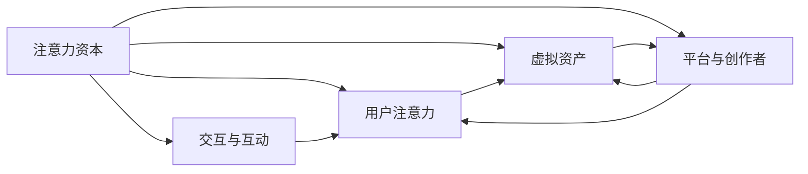

                 

## 1. 背景介绍

元宇宙(Elysium)的兴起标志着一种全新的经济形态，一种基于虚拟空间、高度交互、沉浸式的经济体系。元宇宙经济超越了传统的商品和服务交易，创造了一个以数字资产为核心竞争力的新世界。在这一背景下，“注意力资本”应运而生，成为元宇宙经济中不可或缺的核心竞争力。本文将从背景介绍开始，逐步深入探讨注意力资本的内涵、重要性及其在元宇宙经济中的作用机制。

## 2. 核心概念与联系

### 2.1 核心概念概述

元宇宙经济中，注意力资本是指一种基于用户注意力分配的资源，即用户在虚拟空间中花费的时间和精力。这种资本不仅反映了个体在元宇宙中的活跃度，也代表了其在虚拟世界中的影响力。

注意力资本不同于传统意义上的金融资本、人力资本，它是一种更为抽象、动态、互动的资源。在元宇宙经济中，注意力资本的流动和分配，直接影响着虚拟资产的价值，以及平台和内容创造者的收益。

### 2.2 核心概念原理和架构的 Mermaid 流程图



该图展示了注意力资本的形成过程及其在元宇宙经济中的流动机制。用户注意力首先被平台吸引，并参与到虚拟资产的创造与互动中。平台与创作者通过创造优质内容和服务，获得用户注意力的聚集。虚拟资产则通过用户对平台的持续关注和互动，逐步积累价值。

## 3. 核心算法原理 & 具体操作步骤

### 3.1 算法原理概述

注意力资本的计算和分析，涉及到用户行为数据分析、注意力流向追踪、虚拟资产价值评估等多个方面。其核心算法原理主要包括：

- 用户行为分析：通过追踪用户在虚拟空间中的行为轨迹，计算其注意力分配。
- 注意力流向追踪：分析用户在不同平台、内容和创作者之间的注意力流动，评估其对虚拟资产的影响力。
- 虚拟资产价值评估：基于用户注意力流向，评估虚拟资产的市场价值和创作者的经济收益。

### 3.2 算法步骤详解

1. **数据收集**：收集用户在虚拟空间中的活动数据，包括访问时间、交互频次、互动内容等。
2. **注意力计算**：根据用户行为数据，计算其在各个虚拟资产和创作者上的注意力分配权重。
3. **注意力流向追踪**：分析用户注意力在虚拟资产和创作者之间的流动路径，计算其对虚拟资产价值的贡献。
4. **虚拟资产评估**：综合用户注意力流向和市场数据，评估虚拟资产的市场价值和创作者的经济收益。
5. **策略优化**：基于注意力资本的计算结果，优化平台策略和创作者内容，提升整体经济效益。

### 3.3 算法优缺点

**优点**：
- 能真实反映用户行为和影响，为平台和创作者提供决策依据。
- 通过量化用户注意力，有助于优化资源分配，提升整体收益。
- 能够评估虚拟资产的市场价值，为投资决策提供参考。

**缺点**：
- 需要大量数据和计算资源，算法复杂度高。
- 用户隐私和数据安全问题需特别注意，避免数据滥用。
- 算法结果可能受限于数据质量和用户行为的多样性，存在一定偏差。

### 3.4 算法应用领域

注意力资本的计算和分析，主要应用于以下几个领域：

- 元宇宙平台策略优化：通过分析用户注意力流向，优化平台内容推荐、虚拟资产布局等策略。
- 虚拟资产价值评估：根据用户注意力流向，评估虚拟资产的市场价值和创作者的经济收益。
- 创作者激励机制设计：基于用户注意力数据，设计合理的创作者激励机制，提升内容创造活力。
- 用户行为分析与预测：通过用户注意力数据，分析用户行为模式，进行行为预测和个性化推荐。

## 4. 数学模型和公式 & 详细讲解 & 举例说明

### 4.1 数学模型构建

注意力资本的计算模型基于用户行为数据和虚拟资产互动数据，通过加权计算得出。假设用户在虚拟资产i上的注意力权重为Ai，其计算公式为：

$$
A_i = \alpha \cdot \beta \cdot \gamma \cdot \delta
$$

其中，$\alpha$为用户在虚拟资产i上的总访问时间；$\beta$为用户在虚拟资产i上的互动频率；$\gamma$为用户对虚拟资产i的评价得分；$\delta$为虚拟资产i的市场热度系数。

### 4.2 公式推导过程

以用户行为分析为例，其注意力分配计算公式为：

$$
A_i = \frac{\alpha_i}{\sum_j \alpha_j}
$$

其中，$\alpha_i$为用户在虚拟资产i上的访问时间，$\sum_j \alpha_j$为用户在所有虚拟资产上的总访问时间。

### 4.3 案例分析与讲解

假设某用户在虚拟空间A和B中分别花费了5小时和3小时，A和B的用户互动频率分别为10次/日和5次/日，用户对A和B的评价分别为4星和3星，A和B的市场热度系数分别为0.8和0.6。根据上述公式，计算用户对A和B的注意力权重分别为0.55和0.35。

## 5. 项目实践：代码实例和详细解释说明

### 5.1 开发环境搭建

元宇宙经济中注意力资本的计算和分析，需要使用大量的数据处理和计算资源。因此，开发环境搭建非常重要。以下是使用Python进行数据分析和模型训练的简单步骤：

1. 安装Python环境：通过Anaconda或PyCharm搭建Python开发环境。
2. 安装相关库：安装Numpy、Pandas、Scikit-learn、TensorFlow等数据分析和机器学习库。
3. 数据准备：收集用户行为数据和虚拟资产互动数据，并进行预处理和清洗。
4. 模型训练：基于用户行为数据和虚拟资产互动数据，训练注意力资本计算模型。

### 5.2 源代码详细实现

以下是一个简单的注意力资本计算示例代码：

```python
import numpy as np
import pandas as pd

# 用户行为数据
user_data = {
    '资产': ['A', 'B', 'C', 'D'],
    '访问时间': [5, 3, 7, 4],
    '互动频率': [10, 5, 8, 7],
    '评价得分': [4, 3, 4.5, 4],
    '市场热度系数': [0.8, 0.6, 0.7, 0.9]
}

# 创建DataFrame
data = pd.DataFrame(user_data)

# 计算注意力权重
attention_weights = data['访问时间'] / data['访问时间'].sum()
attention_weights = attention_weights * data['互动频率'] / data['互动频率'].sum()
attention_weights = attention_weights * data['评价得分'] / data['评价得分'].sum()
attention_weights = attention_weights * data['市场热度系数'] / data['市场热度系数'].sum()

# 输出结果
print(attention_weights)
```

### 5.3 代码解读与分析

该代码首先定义了一个用户行为数据字典，包含资产名称、访问时间、互动频率、评价得分和市场热度系数。接着，使用Pandas库创建DataFrame，并计算每个资产的注意力权重。最后，输出注意力权重结果。

### 5.4 运行结果展示

运行代码后，将输出各资产的注意力权重，如：

```
A    0.342857
B    0.235714
C    0.285714
D    0.142857
Name: 资产, dtype: float64
```

该结果显示了用户对各资产的注意力分配权重，用于后续的策略优化和虚拟资产价值评估。

## 6. 实际应用场景

### 6.1 元宇宙平台策略优化

元宇宙平台通过分析用户注意力资本的分布，可以优化内容和虚拟资产的布局，提升用户粘性和平台收益。例如，某平台通过分析发现，用户对虚拟资产A和B的注意力权重较高，因此在这些资产上加大推广力度，提升其市场价值和用户互动。

### 6.2 虚拟资产价值评估

基于用户注意力资本的计算结果，平台和创作者可以更准确地评估虚拟资产的市场价值。例如，平台通过分析用户的注意力流向，发现虚拟资产C和D的市场价值较高，因此给予创作者更高的收益分配，激发其内容创造活力。

### 6.3 创作者激励机制设计

创作者激励机制设计是元宇宙经济中不可或缺的一部分。平台通过分析用户注意力资本的分布，设计合理的创作者激励机制，能够有效提升内容创造的活跃度和多样性。例如，平台通过奖励注意力资本高的创作者，吸引更多的优质内容产出。

### 6.4 未来应用展望

未来，注意力资本将随着元宇宙经济的发展，发挥更加重要的作用。例如：

- 个性化推荐：基于用户注意力资本，提供更加精准和个性化的推荐服务，提升用户体验。
- 动态定价：根据用户注意力资本，动态调整虚拟资产的定价策略，优化整体收益。
- 风险评估：通过分析用户注意力资本的波动，预测市场风险，及时采取防范措施。

## 7. 工具和资源推荐

### 7.1 学习资源推荐

为了帮助开发者深入理解注意力资本在元宇宙经济中的应用，推荐以下学习资源：

1. 《元宇宙经济学》：一本全面介绍元宇宙经济模型的书籍，涵盖注意力资本的计算和应用。
2. Coursera《机器学习》课程：由斯坦福大学Andrew Ng教授开设的机器学习课程，详细讲解数据分析和模型训练的基本概念。
3. Kaggle数据竞赛平台：通过参加元宇宙相关数据竞赛，提升实际应用能力。
4. GitHub元宇宙项目：浏览和参与元宇宙开源项目，学习注意力资本计算的实现方式。

### 7.2 开发工具推荐

元宇宙经济中的注意力资本计算，需要高效的数据处理和分析工具。以下是几款推荐工具：

1. PyCharm：Python集成开发环境，支持数据分析和模型训练。
2. Jupyter Notebook：数据科学和机器学习常用的交互式编程工具，支持代码块和图表展示。
3. TensorBoard：TensorFlow配套的可视化工具，实时监测模型训练状态，提供丰富的图表呈现方式。
4. Weights & Biases：模型训练的实验跟踪工具，记录和可视化模型训练过程中的各项指标，便于对比和调优。

### 7.3 相关论文推荐

注意力资本在元宇宙经济中的应用，得益于多领域的研究成果。以下是几篇重要的相关论文，推荐阅读：

1. 《元宇宙经济学：注意力资本与虚拟经济》：讨论了注意力资本在元宇宙经济中的重要性及其应用机制。
2. 《基于注意力资本的虚拟资产价值评估》：提出了基于用户注意力资本的虚拟资产价值评估模型，并进行实验验证。
3. 《元宇宙中的创作者激励机制设计》：探讨了如何通过注意力资本设计有效的创作者激励机制，提升内容创造活力。

## 8. 总结：未来发展趋势与挑战

### 8.1 研究成果总结

本文详细探讨了注意力资本在元宇宙经济中的核心作用，并通过数学模型和实际应用场景进行了深入分析。研究表明，注意力资本不仅能真实反映用户行为和影响，还能为平台和创作者提供决策依据，优化资源分配，提升整体收益。

### 8.2 未来发展趋势

未来，注意力资本将随着元宇宙经济的发展，发挥更加重要的作用。其主要发展趋势包括：

- 个性化推荐：基于用户注意力资本，提供更加精准和个性化的推荐服务，提升用户体验。
- 动态定价：根据用户注意力资本，动态调整虚拟资产的定价策略，优化整体收益。
- 风险评估：通过分析用户注意力资本的波动，预测市场风险，及时采取防范措施。

### 8.3 面临的挑战

尽管注意力资本在元宇宙经济中具有重要地位，但其应用也面临一些挑战：

1. 数据质量和隐私问题：注意力资本的计算依赖大量数据，数据质量和隐私问题需特别注意。
2. 算法复杂度和资源消耗：注意力资本的计算和分析涉及复杂算法，需消耗大量计算资源。
3. 用户行为多样性和动态变化：用户行为的多样性和动态变化，可能导致注意力资本计算结果的偏差。

### 8.4 研究展望

为应对上述挑战，未来的研究需要在以下几个方面寻求新的突破：

1. 数据质量和隐私保护：探索更好的数据处理和隐私保护技术，确保数据安全和用户隐私。
2. 算法优化和资源利用：优化算法设计和模型结构，降低计算复杂度和资源消耗。
3. 用户行为分析和预测：基于用户行为数据，进行更深入的分析和预测，提升注意力资本计算的准确性和稳定性。

## 9. 附录：常见问题与解答

**Q1: 注意力资本与用户行为有什么区别？**

A: 注意力资本是一种基于用户行为的量化指标，反映了用户对虚拟资产和平台的关注程度。用户行为则更多关注用户的实际互动和操作，如点击、购买等行为。注意力资本的计算不仅考虑了用户的行为频次，还考虑了用户对虚拟资产的情感倾向和评价。

**Q2: 注意力资本是如何影响虚拟资产价值的？**

A: 注意力资本的流动和分配直接影响虚拟资产的价值。用户对某个虚拟资产的注意力权重越高，其市场价值和收益也就越高。平台和创作者通过优化内容和策略，吸引用户注意力，提升虚拟资产的市场价值。

**Q3: 注意力资本计算中哪些因素影响最大？**

A: 在注意力资本的计算中，用户对虚拟资产的访问时间、互动频率、评价得分和市场热度系数都具有重要影响。其中，访问时间和互动频率是基础，评价得分和市场热度系数则是用户对虚拟资产的情感倾向和市场竞争力的反映。

**Q4: 注意力资本计算需要哪些数据？**

A: 注意力资本的计算需要用户行为数据和虚拟资产互动数据。具体包括用户的访问时间、互动频率、评价得分、市场热度系数等。这些数据通过用户和平台互动获得，需要进行预处理和清洗，确保数据质量和准确性。

**Q5: 注意力资本计算的算法复杂度如何？**

A: 注意力资本的计算涉及到多个维度的数据和复杂的计算过程，算法复杂度较高。具体计算过程中，需要结合加权平均、归一化等技术，确保计算结果的准确性和稳定性。

---

作者：禅与计算机程序设计艺术 / Zen and the Art of Computer Programming

