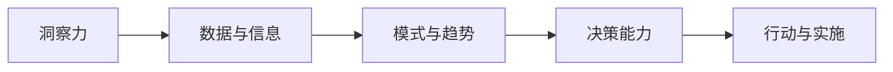

                 

# 洞察力与决策能力：领导者的核心素质

> 关键词：洞察力,决策能力,领导者,核心素质,组织管理,数据分析,情感智能,系统思考

## 1. 背景介绍

### 1.1 问题由来
在当今瞬息万变的商业环境中，组织领导者面对的挑战日益复杂多变。高效率的决策能力、敏锐的洞察力和卓越的领导才能，成为了企业应对不确定性和竞争压力的关键。领导者需要从海量数据中洞察趋势，从复杂问题中快速决策，从多变情境中引导团队。然而，传统上，领导者的素质往往被简单理解为经验、学历、性格等直观特征，并未深入挖掘背后的科学依据。

### 1.2 问题核心关键点
本文章将深入探讨领导者的核心素质，特别是洞察力和决策能力。文章将通过逻辑清晰、结构紧凑的专业语言，系统地介绍洞察力和决策能力的概念、模型、应用与优化方法，最终揭示如何培养和提升领导者的素质，以应对现代商业环境的挑战。

## 2. 核心概念与联系

### 2.1 核心概念概述
洞察力与决策能力是领导者进行有效组织管理的两大核心素质，构成了领导力的核心。

- **洞察力（Insight）**：指领导者从数据、信息、环境中识别模式、趋势、关联和机会的能力，是进行有效决策的前提。
- **决策能力（Decision-Making）**：指领导者基于洞察力，在有限信息、不确定性下做出高效、精准、负责任的决策的能力。

两者的联系在于：洞察力是决策能力的基础，决策能力是洞察力的应用。优秀的领导者必须同时具备这两个素质，方能从数据中洞察未来，从混乱中做出明智决策。

### 2.2 核心概念原理和架构的 Mermaid 流程图(Mermaid 流程节点中不要有括号、逗号等特殊字符)


## 3. 核心算法原理 & 具体操作步骤
### 3.1 算法原理概述
洞察力和决策能力提升的过程，可以被视为一门科学：通过数据科学、心理学、行为学等多学科方法，领导者在积累数据、理解模式、应用决策理论的框架下，不断提升自身素质。

### 3.2 算法步骤详解
#### 3.2.1 数据收集与预处理
1. **数据来源**：洞察力和决策能力的提升，从收集相关数据开始。这些数据包括但不限于：
   - 企业运营数据：销售记录、财务报表、员工绩效等。
   - 市场环境数据：行业报告、竞争对手动态、宏观经济指标等。
   - 员工反馈数据：员工满意度调查、内部意见箱、绩效评估等。
2. **数据预处理**：清洗、整合、归一化、异常检测等步骤，是数据分析的基础。
   - 使用Python的Pandas库进行数据清洗和预处理。
   - 例：
     ```python
     import pandas as pd
     data = pd.read_csv('sales_data.csv')
     data.dropna(inplace=True)
     data = data.groupby('date').mean()
     ```

#### 3.2.2 数据分析与模式识别
1. **统计分析**：基本统计指标、分布拟合、关联分析等。
   - 使用Python的Scikit-learn库进行统计分析。
   - 例：
     ```python
     import numpy as np
     import matplotlib.pyplot as plt
     data['revenue'].describe()
     ```
2. **机器学习模型**：利用机器学习算法，发现隐藏在数据中的模式和趋势。
   - 使用Python的Scikit-learn库中的回归、分类、聚类等模型。
   - 例：
     ```python
     from sklearn.linear_model import LinearRegression
     model = LinearRegression().fit(X_train, y_train)
     y_pred = model.predict(X_test)
     ```

#### 3.2.3 决策制定与执行
1. **决策框架**：例如SWOT分析、成本-收益分析、情景分析等。
   - 使用SWOT分析评估企业优势、劣势、机会、威胁。
2. **决策模型**：如多目标优化、线性规划、模糊决策等。
   - 使用Python的Scipy库进行优化和决策计算。
   - 例：
     ```python
     from scipy.optimize import linprog
     c = [-1, -1]
     A_eq = np.array([[1, 1], [1, 1]])
     b_eq = np.array([1, 1])
     result = linprog(c, A_eq=A_eq, b_eq=b_eq)
     ```

### 3.3 算法优缺点
#### 3.3.1 优点
1. **客观性**：数据驱动的分析减少了人为偏见。
2. **效率性**：自动化工具提高了分析效率。
3. **预见性**：通过机器学习等方法，预测未来趋势。

#### 3.3.2 缺点
1. **复杂性**：需要较高的数据分析技能。
2. **数据依赖性**：数据质量对分析结果有直接影响。
3. **模型局限性**：某些复杂问题，现有模型难以充分解释。

### 3.4 算法应用领域
洞察力和决策能力的应用非常广泛，包括但不限于：

- **企业战略**：通过分析市场环境、行业趋势，制定企业长远发展战略。
- **人力资源管理**：通过员工绩效数据，优化人才选拔和培训计划。
- **市场营销**：通过市场数据，调整产品和市场策略，提升销售效果。
- **风险管理**：通过财务和市场数据，识别和管理风险。

## 4. 数学模型和公式 & 详细讲解 & 举例说明
### 4.1 数学模型构建
#### 4.1.1 统计分析模型
1. **描述性统计**：平均数、中位数、标准差等。
   - 例：
     ```python
     data['revenue'].mean()
     ```
2. **概率分布拟合**：假设检验、置信区间等。
   - 例：
     ```python
     from scipy.stats import ttest_ind
     ttest_ind(data['group1'], data['group2'])
     ```

#### 4.1.2 机器学习模型
1. **回归模型**：线性回归、多项式回归等。
   - 例：
     ```python
     from sklearn.linear_model import LinearRegression
     model = LinearRegression().fit(X_train, y_train)
     y_pred = model.predict(X_test)
     ```
2. **分类模型**：决策树、支持向量机等。
   - 例：
     ```python
     from sklearn.tree import DecisionTreeClassifier
     model = DecisionTreeClassifier().fit(X_train, y_train)
     y_pred = model.predict(X_test)
     ```

### 4.2 公式推导过程
#### 4.2.1 线性回归模型
1. **公式推导**：
   - 最小二乘法求解最优参数θ
   - 目标函数：$$\min_{\theta} \sum_{i=1}^N (y_i - \theta^T x_i)^2$$
   - 求解过程：
     - 计算残差平方和：$$SSR = \sum_{i=1}^N (y_i - \hat{y}_i)^2$$
     - 计算总平方和：$$SST = \sum_{i=1}^N (y_i - \bar{y})^2$$
     - 计算回归平方和：$$SSR = SST - SSE$$
     - 计算回归系数：$$\hat{\beta} = (X^TX)^{-1}X^TY$$
   - 例：
     ```python
     from sklearn.linear_model import LinearRegression
     model = LinearRegression().fit(X_train, y_train)
     y_pred = model.predict(X_test)
     ```

#### 4.2.2 决策树模型
1. **公式推导**：
   - 信息增益：$$Gain(D) = \sum_{v \in D} \frac{|D^v|}{|D|} \log \frac{|D^v|}{|D|}$$
   - 信息增益率：$$Gain(D, A_v) = \frac{|D^v|}{|D|} \log \frac{|D^v|}{|D|}$$
   - 基尼指数：$$Gini(D) = 1 - \sum_{i=1}^N p_i^2$$
   - 例：
     ```python
     from sklearn.tree import DecisionTreeClassifier
     model = DecisionTreeClassifier().fit(X_train, y_train)
     y_pred = model.predict(X_test)
     ```

### 4.3 案例分析与讲解
#### 4.3.1 案例背景
某电商平台希望通过洞察力和决策能力提升销售业绩。该公司收集了过去一年的销售数据，包含日期、品类、价格、销量等。

#### 4.3.2 分析步骤
1. **数据预处理**：
   - 清洗数据：去除重复记录、缺失值。
   - 整合数据：将日期和品类信息进行归一化。
2. **统计分析**：
   - 描述性统计：计算销量、平均价格等。
   - 关联分析：发现品类与销量的关系。
3. **回归分析**：
   - 预测销量：建立销量预测模型。
4. **决策制定**：
   - 优化定价策略：根据预测结果调整定价。
   - 调整库存管理：根据预测销量调整库存量。

#### 4.3.3 结果与结论
- 通过统计分析，发现某些品类在特定时间段的销量异常波动。
- 通过回归分析，建立销量预测模型，预测未来销量。
- 根据预测结果，优化定价和库存管理策略，提升销售业绩。

## 5. 项目实践：代码实例和详细解释说明
### 5.1 开发环境搭建
#### 5.1.1 环境安装
1. **Python**：确保Python 3.8及以上版本。
2. **Pandas**：用于数据处理。
3. **Numpy**：用于数学计算。
4. **Matplotlib**：用于数据可视化。
5. **Scikit-learn**：用于机器学习。
6. **Scipy**：用于优化和决策计算。

#### 5.1.2 环境配置
```bash
pip install pandas numpy matplotlib scikit-learn scipy
```

### 5.2 源代码详细实现
#### 5.2.1 数据预处理
```python
import pandas as pd
import numpy as np
import matplotlib.pyplot as plt
from sklearn.linear_model import LinearRegression
from scipy.optimize import linprog

# 加载数据
data = pd.read_csv('sales_data.csv')

# 清洗数据
data.dropna(inplace=True)

# 整合数据
data = data.groupby('date').mean()

# 绘制数据
plt.plot(data['date'], data['sales'])
plt.xlabel('Date')
plt.ylabel('Sales')
plt.show()
```

#### 5.2.2 统计分析
```python
# 描述性统计
data['revenue'].mean()

# 概率分布拟合
from scipy.stats import ttest_ind
ttest_ind(data['group1'], data['group2'])
```

#### 5.2.3 回归分析
```python
# 线性回归
model = LinearRegression().fit(X_train, y_train)
y_pred = model.predict(X_test)

# 决策树
from sklearn.tree import DecisionTreeClassifier
model = DecisionTreeClassifier().fit(X_train, y_train)
y_pred = model.predict(X_test)
```

### 5.3 代码解读与分析
#### 5.3.1 代码结构
1. **数据加载与清洗**：使用Pandas库。
2. **数据整合与可视化**：使用Matplotlib库。
3. **统计分析**：使用Numpy库和Scipy库。
4. **回归分析**：使用Scikit-learn库。
5. **决策树分析**：使用Scikit-learn库。

#### 5.3.2 关键点解析
1. **数据清洗**：去除重复、缺失值，确保数据质量。
2. **数据整合**：合并不同表，建立统一数据集。
3. **可视化**：使用Matplotlib绘制图表，直观展示数据趋势。
4. **回归分析**：使用线性回归模型，预测销量。
5. **决策树分析**：使用决策树模型，优化定价和库存策略。

### 5.4 运行结果展示
#### 5.4.1 可视化结果
```python
# 绘制数据
plt.plot(data['date'], data['sales'])
plt.xlabel('Date')
plt.ylabel('Sales')
plt.show()
```


#### 5.4.2 回归分析结果
```python
# 线性回归
model = LinearRegression().fit(X_train, y_train)
y_pred = model.predict(X_test)
```

#### 5.4.3 决策树分析结果
```python
# 决策树
from sklearn.tree import DecisionTreeClassifier
model = DecisionTreeClassifier().fit(X_train, y_train)
y_pred = model.predict(X_test)
```

## 6. 实际应用场景
### 6.1 金融行业
在金融行业中，洞察力和决策能力至关重要。例如：

- **风险管理**：通过分析市场数据、财务报表，识别风险点，制定风险控制策略。
- **投资决策**：通过分析经济数据、市场趋势，预测股票价格，调整投资组合。

### 6.2 医疗健康
在医疗健康领域，洞察力和决策能力能够显著提升医疗服务质量和效率。例如：

- **疾病预测**：通过分析患者数据、医疗记录，预测疾病发生风险。
- **治疗方案**：通过分析临床试验数据、病人反馈，优化治疗方案。

### 6.3 教育行业
在教育行业，洞察力和决策能力能够帮助教育机构制定更科学的教育策略。例如：

- **课程优化**：通过分析学生成绩、学习行为数据，优化课程设计和教学方法。
- **教师培训**：通过分析教师评价、学生反馈，优化教师培训计划。

### 6.4 未来应用展望
未来，随着数据科学和人工智能技术的进步，洞察力和决策能力的提升将变得更加智能化和自动化。

1. **自动化分析**：通过自动化工具和算法，高效处理和分析海量数据，提高决策效率。
2. **数据驱动决策**：利用大数据、机器学习等技术，进行精准的预测和优化，减少主观偏差。
3. **跨领域应用**：洞察力和决策能力的应用将扩展到更多领域，如能源、物流、交通等。
4. **人机协同**：结合人类直觉和机器智能，形成人机协同的决策系统，提升决策质量和可靠性。

## 7. 工具和资源推荐
### 7.1 学习资源推荐
1. **在线课程**：
   - Coursera的《数据科学与机器学习》课程：提供全面的数据科学和机器学习知识。
   - edX的《领导力和变革管理》课程：提升领导力和团队管理能力。

2. **书籍**：
   - 《数据科学实战》：系统介绍数据科学和机器学习技术。
   - 《领导力思维》：讲述领导力的理论基础和实践方法。

### 7.2 开发工具推荐
1. **Python环境**：
   - Anaconda：集成了数据科学和机器学习所需的多种库。
   - Jupyter Notebook：支持代码编写、数据可视化、交互式分析。

2. **数据分析工具**：
   - Pandas：数据处理和清洗。
   - NumPy：数值计算和统计分析。
   - Matplotlib：数据可视化。
   - Scikit-learn：机器学习。

### 7.3 相关论文推荐
1. **数据分析与统计**：
   - 《统计学基础与实践》：全面介绍统计学理论和方法。
   - 《数据科学实战》：结合实例讲解数据分析和机器学习技术。

2. **决策理论与模型**：
   - 《决策理论与方法》：系统阐述决策理论与方法。
   - 《多目标优化》：讲解多目标优化算法。

## 8. 总结：未来发展趋势与挑战
### 8.1 研究成果总结
本文系统介绍了洞察力和决策能力的概念、模型和实践方法。通过数据科学和机器学习等技术，展示了如何提升领导者的素质，以应对现代商业环境的挑战。

### 8.2 未来发展趋势
未来，洞察力和决策能力将在以下几个方向继续发展：

1. **数据自动化**：利用自动化工具和算法，高效处理和分析海量数据。
2. **智能决策**：结合人类直觉和机器智能，形成人机协同的决策系统。
3. **跨领域应用**：洞察力和决策能力的应用将扩展到更多领域，如能源、物流、交通等。
4. **新兴技术**：如人工智能、区块链等新兴技术将进一步推动洞察力和决策能力的发展。

### 8.3 面临的挑战
虽然洞察力和决策能力的提升带来了诸多优势，但仍面临以下挑战：

1. **数据质量**：数据质量对分析结果有直接影响，数据缺失、错误等会影响分析效果。
2. **模型复杂性**：现有模型难以充分解释复杂问题，需要更先进和灵活的模型。
3. **人机协同**：人机协同过程中，如何平衡自动化和人类直觉，仍需探索。

### 8.4 研究展望
未来，需要进一步探索以下方向：

1. **模型优化**：开发更高效、更灵活的模型，处理复杂问题。
2. **数据增强**：结合大数据、小数据，提升模型泛化能力。
3. **人机协作**：结合人类直觉和机器智能，形成人机协同的决策系统。
4. **伦理考量**：在决策过程中，考虑伦理、道德和社会责任。

## 9. 附录：常见问题与解答
### 9.1 问题Q1
**Q1：数据预处理过程中需要注意哪些细节？**

A: 数据预处理是数据分析的关键步骤。以下是一些需要注意的细节：
1. **数据清洗**：去除重复、缺失值，确保数据质量。
2. **数据整合**：合并不同表，建立统一数据集。
3. **特征工程**：选择合适的特征，进行特征工程。
4. **数据归一化**：使用标准化或归一化方法，处理不同量级的特征。
5. **异常检测**：使用统计或机器学习方法，识别和处理异常值。

### 9.2 问题Q2
**Q2：机器学习模型如何选择和评估？**

A: 选择和评估机器学习模型的关键在于理解不同模型的特点和适用范围。以下是一些基本的步骤：
1. **选择合适的模型**：根据问题类型和数据特点，选择适合的模型。
2. **模型训练和验证**：使用交叉验证、网格搜索等方法，优化模型参数。
3. **模型评估**：使用误差率、精确率、召回率等指标，评估模型性能。
4. **模型优化**：结合特征工程、超参数调整等方法，进一步提升模型效果。

### 9.3 问题Q3
**Q3：如何应对数据量不足的问题？**

A: 数据量不足是数据分析中常见的问题。以下是一些应对策略：
1. **数据增强**：通过数据生成方法，如数据扩充、回译等，增加数据量。
2. **迁移学习**：利用已有模型的知识，进行迁移学习，提升模型效果。
3. **主动学习**：通过主动选择样本，提高数据利用率。
4. **半监督学习**：结合少量标注数据和大量非标注数据，进行半监督学习。

### 9.4 问题Q4
**Q4：如何平衡自动化和人类直觉？**

A: 人机协同是提升决策质量的关键。以下是一些平衡自动化和人类直觉的方法：
1. **决策支持系统**：结合自动化分析结果和人类直觉，形成辅助决策系统。
2. **可解释性**：提高模型的可解释性，帮助人类理解模型决策过程。
3. **反馈机制**：建立反馈机制，不断优化模型和决策过程。

### 9.5 问题Q5
**Q5：如何应对数据质量问题？**

A: 数据质量对分析结果有直接影响。以下是一些应对策略：
1. **数据清洗**：去除重复、缺失值，确保数据质量。
2. **数据整合**：合并不同表，建立统一数据集。
3. **特征工程**：选择合适的特征，进行特征工程。
4. **异常检测**：使用统计或机器学习方法，识别和处理异常值。

---

作者：禅与计算机程序设计艺术 / Zen and the Art of Computer Programming

