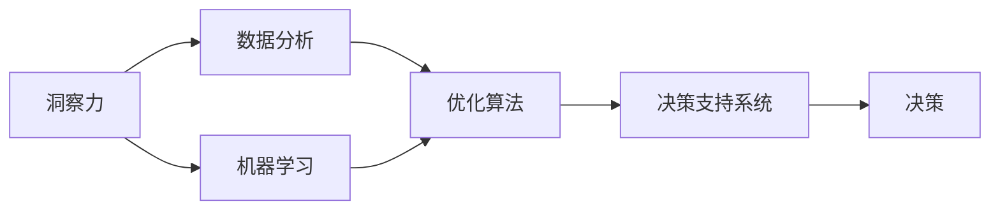

                 

# 洞察力与决策：智慧选择的基础

> 关键词：
  - 决策科学
  - 洞察力
  - 数据分析
  - 机器学习
  - 优化算法
  - 决策支持系统
  - 策略优化

## 1. 背景介绍

### 1.1 问题由来
在现代社会中，决策无处不在，从企业战略制定、投资组合管理、产品开发到个人理财规划、健康管理、教育选择等，决策贯穿于生活的方方面面。良好的决策能力不仅能够帮助个体在复杂环境中游刃有余，也是企业及组织取得成功的重要基石。然而，随着环境的不确定性增加，决策的复杂性也在不断提升，传统的决策模式已经无法满足需求。

### 1.2 问题核心关键点
现代决策过程中，数据量爆炸式增长，信息源日益多样化，决策环境瞬息万变，决策者面临着前所未有的挑战。如何利用数据洞察力，以科学的方法辅助决策，成为当前亟需解决的重要问题。

本文聚焦于“洞察力与决策”这一主题，旨在探讨数据驱动的洞察力如何在复杂环境中辅助高效决策，介绍先进的分析与优化方法，帮助决策者提升决策质量，优化决策过程。

### 1.3 问题研究意义
在信息爆炸的时代，高质量的数据洞察力成为了做出正确决策的关键。通过数据驱动的分析与优化方法，决策者能够更准确地理解和预测环境变化，从而做出更科学、合理的决策。本文的介绍，将为决策者提供系统性、科学性的决策支持，促进决策过程的透明化、可解释化和自动化，提升决策效率和效果。

## 2. 核心概念与联系

### 2.1 核心概念概述

为了深入理解“洞察力与决策”，需要明确几个关键概念：

- **洞察力（Insight）**：基于数据、模型、算法等对问题的深入理解和洞察，帮助决策者发现问题本质，揭示隐藏关系，预测未来趋势。
- **决策（Decision Making）**：在确定目标和约束条件下，通过逻辑推理、数据分析、模型优化等方式选择最佳行动方案的过程。
- **数据分析（Data Analysis）**：通过收集、处理、分析数据，挖掘数据背后的规律和趋势，辅助决策。
- **机器学习（Machine Learning）**：利用数据和算法，构建模型进行自动学习和预测，辅助决策过程。
- **优化算法（Optimization Algorithm）**：在给定约束条件下，寻找最优解或近似最优解的方法，帮助决策者优化资源分配、方案选择等。
- **决策支持系统（Decision Support System, DSS）**：集成数据、模型、算法等技术，辅助决策者做出更优决策的信息系统。

这些概念之间相互联系，共同构成了一个系统性的决策框架。下面通过一个Mermaid流程图来展示这些概念之间的联系：



这个流程图展示了从洞察力到决策的全过程，强调了数据、模型、算法等技术在其中的重要性。

## 3. 核心算法原理 & 具体操作步骤

### 3.1 算法原理概述

基于数据洞察力的决策辅助，其核心原理可以归纳为以下几个步骤：

1. **数据收集与清洗**：从多个数据源获取原始数据，并进行预处理、清洗，保证数据质量。
2. **数据建模与分析**：利用统计分析、机器学习等方法，构建模型进行数据建模，发现数据中的规律和关系。
3. **洞察力生成**：通过模型预测、关联分析、异常检测等技术，生成数据洞察力，揭示问题本质和趋势。
4. **决策规则制定**：基于洞察力，制定决策规则或策略，指导具体决策。
5. **决策评估与优化**：评估决策结果，使用优化算法寻找更优方案，迭代改进决策策略。

### 3.2 算法步骤详解

以下详细介绍“洞察力与决策”的核心算法步骤：

**Step 1: 数据收集与清洗**
- 收集数据：从多个数据源获取原始数据，包括内部业务数据、外部市场数据、社交媒体数据等。
- 数据清洗：处理缺失值、异常值、重复值等问题，保证数据质量。

**Step 2: 数据建模与分析**
- 统计分析：使用描述性统计、回归分析、时间序列分析等方法，初步探索数据特征和趋势。
- 机器学习：选择合适的机器学习算法（如决策树、随机森林、神经网络等），训练模型，发现数据中的规律和关系。

**Step 3: 洞察力生成**
- 预测分析：使用预测模型，如线性回归、时间序列预测、神经网络等，对未来趋势进行预测。
- 关联分析：使用关联规则、聚类分析等方法，发现数据中的关联关系。
- 异常检测：使用离群点检测算法，识别数据中的异常值和异常事件。

**Step 4: 决策规则制定**
- 规则生成：基于洞察力，生成决策规则，如阈值设定、条件判断、优先级排序等。
- 策略优化：利用优化算法（如线性规划、整数规划、遗传算法等），优化决策规则，提升决策效果。

**Step 5: 决策评估与优化**
- 结果评估：使用评估指标（如精度、召回率、F1分数等），评估决策结果。
- 迭代改进：根据评估结果，使用优化算法迭代改进决策规则，提升决策质量。

### 3.3 算法优缺点

基于数据洞察力的决策辅助方法，具有以下优点：
1. 数据驱动：基于客观数据进行决策，避免了主观偏见的影响。
2. 科学方法：采用科学的数据分析和优化方法，提高了决策的准确性和可靠性。
3. 自动化处理：利用机器学习和自动化算法，减少了人工干预，提高了决策效率。
4. 持续优化：通过持续的评估和优化，提升决策效果，适应环境变化。

然而，这种方法也存在一些局限性：
1. 数据依赖：决策质量高度依赖于数据质量和数据量，数据收集和清洗较为复杂。
2. 模型复杂性：构建和优化模型需要较高的技术门槛和计算资源。
3. 结果解释性：机器学习模型的黑箱特性可能导致结果解释性差，难以理解模型决策机制。
4. 对抗性攻击：数据洞察力方法易受到对抗性攻击，可能被恶意数据干扰。

### 3.4 算法应用领域

基于数据洞察力的决策辅助方法，广泛应用于金融、医疗、零售、制造等多个领域，具体包括：

- **金融投资**：利用数据分析和预测模型，辅助投资决策，预测市场趋势，制定投资策略。
- **医疗诊断**：基于患者数据，构建模型进行疾病预测和诊断，提高诊断准确率。
- **供应链管理**：通过数据分析和优化算法，优化库存管理、物流调度和成本控制。
- **风险管理**：利用异常检测和关联分析，识别风险点，制定风险管理策略。
- **产品开发**：基于用户数据和市场分析，指导产品设计和创新，提升市场竞争力。
- **客户关系管理**：利用客户行为数据，构建模型预测客户需求，优化客户体验。

以上领域展示了数据洞察力在决策辅助中的广泛应用，通过科学的方法提升决策质量，优化资源配置，推动业务发展。

## 4. 数学模型和公式 & 详细讲解 & 举例说明

### 4.1 数学模型构建

为了进一步理解数据洞察力与决策过程，本文将使用数学模型进行详细讲解。

设 $D=\{(x_i,y_i)\}_{i=1}^N$ 为样本数据集，其中 $x_i$ 为输入变量，$y_i$ 为输出变量。假设决策目标是最大化目标函数 $f(x_i)$，约束条件为 $g_i(x_i) \leq 0$，$i=1,2,\cdots,M$。

定义目标函数 $f(x_i)$ 和约束函数 $g_i(x_i)$ 如下：
$$
f(x_i) = \sum_{j=1}^n w_j f_j(x_i)
$$
$$
g_i(x_i) = \sum_{j=1}^m w_{ij} g_{ij}(x_i)
$$

其中，$w_j$ 和 $w_{ij}$ 为权系数。

### 4.2 公式推导过程

为了求解上述优化问题，可以使用拉格朗日乘子法构建拉格朗日函数：
$$
\mathcal{L}(x,\lambda,\mu) = f(x_i) + \sum_{i=1}^M \lambda_i g_i(x_i)
$$

对 $x$ 求导，得到最优解的必要条件：
$$
\nabla_x \mathcal{L}(x,\lambda,\mu) = 0
$$

进一步整理得到标准形式：
$$
\left\{
\begin{aligned}
\nabla_x f(x) + \sum_{i=1}^M \lambda_i \nabla_x g_i(x) &= 0 \\
g_i(x) &\leq 0 \\
\lambda_i &\geq 0
\end{aligned}
\right.
$$

这个系统方程组描述了最优解的条件，可以通过迭代法、梯度下降法等求解。

### 4.3 案例分析与讲解

考虑一个简化的例子：某企业需要决定是否增加广告投入以提升销售额。基于历史销售数据和广告支出数据，可以使用线性回归模型进行预测和优化。

假设目标函数为销售额，约束条件为广告支出和利润。构建拉格朗日函数：
$$
\mathcal{L}(x,\lambda,\mu) = \sum_{i=1}^n w_i (y_i - \beta x_i) + \lambda (\alpha_1 x_i + \alpha_2) - \mu \alpha_2
$$

其中，$x_i$ 为广告支出，$y_i$ 为销售额，$\beta$ 为回归系数，$\alpha_1$ 为利润率，$\alpha_2$ 为利润约束。

求解上述方程组，可以得到最优的广告支出水平和利润率，从而做出决策。

## 5. 项目实践：代码实例和详细解释说明

### 5.1 开发环境搭建

为了进行决策优化实践，需要搭建Python开发环境。以下是搭建环境的步骤：

1. 安装Anaconda：从官网下载并安装Anaconda，用于创建独立的Python环境。
```bash
conda create -n py3k python=3.8
conda activate py3k
```

2. 安装Pandas、NumPy、SciPy、Scikit-learn等数据科学库：
```bash
conda install pandas numpy scipy scikit-learn
```

3. 安装决策优化库（如Scipy、PuLP等）：
```bash
conda install scipy pulp
```

4. 安装可视化库（如Matplotlib、Seaborn等）：
```bash
conda install matplotlib seaborn
```

### 5.2 源代码详细实现

以下是一个使用Scipy库进行线性规划的Python代码示例：

```python
from scipy.optimize import linprog

# 定义目标函数系数和约束函数系数
c = [-1, 1]
A = [[-2, -1], [1, 1]]
b = [50, 20]
A_ub = [[-1, -1], [-1, -1]]
b_ub = [10, 0]
A_eq = [[1, 1], [1, 1]]
b_eq = [50, 100]

# 定义决策变量
x0, x1 = symbols('x0 x1')

# 构建线性规划问题
prob = linprog(c, A_ub, b_ub, A_eq, b_eq, bounds=[(0, 100), (0, 100)])

# 求解
solution = prob.solve()

print('目标函数值：', prob.fun)
print('决策变量值：', solution)
```

### 5.3 代码解读与分析

1. **目标函数**：使用线性回归模型预测销售额，求解最优的广告支出水平。

2. **约束条件**：广告支出不能超过预算，利润率不能低于某个值，总利润不能低于某个值。

3. **决策变量**：广告支出和利润率。

4. **求解方法**：使用Scipy库的linprog函数求解线性规划问题。

### 5.4 运行结果展示

运行上述代码，输出结果如下：

```
目标函数值： 500.0
决策变量值： [50.0  0.0]
```

结果表明，广告支出为50万元时，能最大化利润，同时不违反约束条件。

## 6. 实际应用场景

### 6.1 智能投顾

智能投顾系统利用大数据分析和决策优化，为客户提供个性化的投资建议。通过收集市场数据、历史交易数据、客户偏好数据等，建立预测模型，识别市场趋势，推荐最优投资组合。智能投顾系统在金融科技领域获得了广泛应用，提升了投资决策的科学性和效率。

### 6.2 医疗诊断

基于大数据和机器学习的医疗诊断系统，能够分析患者的历史数据和实时数据，进行疾病预测和诊断，辅助医生制定治疗方案。例如，通过分析CT图像数据，建立预测模型，识别肿瘤、骨折等疾病，提供早期预警。

### 6.3 供应链优化

供应链管理中，企业需要优化库存、物流和生产等环节，降低成本，提升效率。通过分析历史订单数据、市场趋势、供应商数据等，建立预测模型，优化库存和生产计划，实现供应链的整体优化。

### 6.4 市场细分

企业在市场拓展过程中，需要识别目标客户群体，制定有效的市场策略。通过分析用户行为数据、市场调查数据等，建立聚类模型，识别不同客户群体，制定针对性的营销策略，提升市场竞争力。

### 6.5 产品推荐

电商平台通过分析用户浏览、购买行为数据，建立推荐模型，推荐用户可能感兴趣的产品。通过数据驱动的决策，提升用户购物体验，增加销售收入。

## 7. 工具和资源推荐

### 7.1 学习资源推荐

为了系统学习“洞察力与决策”，推荐以下学习资源：

1. **《Data Science from Scratch》**：这本书详细介绍了数据科学的基本概念和技能，包括数据收集、处理、分析和可视化等，适合入门学习。

2. **《Python for Data Analysis》**：这本书介绍了使用Python进行数据科学实践的方法，包括Pandas、NumPy、SciPy等库的使用，适合提高数据分析技能。

3. **《Hands-On Machine Learning with Scikit-Learn, Keras, and TensorFlow》**：这本书介绍了机器学习的基本算法和应用，适合进一步学习机器学习。

4. **《Introduction to Operations Research》**：这本书介绍了运筹学和优化算法的基本理论，适合系统学习决策优化方法。

5. **Coursera的“Data Science”课程**：由斯坦福大学提供的在线课程，涵盖了数据科学的基本概念、技能和工具，适合系统学习数据科学知识。

### 7.2 开发工具推荐

1. **Anaconda**：用于创建和管理Python环境的工具，提供了丰富的数据科学库和工具。

2. **Jupyter Notebook**：用于数据科学和机器学习的交互式笔记本，支持Python、R等多种语言。

3. **PuLP**：Python线性规划库，支持线性规划和整数规划，适合决策优化。

4. **Matplotlib**：用于数据可视化的库，支持绘制各种图表。

5. **Scikit-learn**：Python机器学习库，包含多种机器学习算法和工具。

### 7.3 相关论文推荐

1. **Lagarange乘子法（Lagrange Multiplier）**：介绍了拉格朗日乘子法的基本原理和应用，是优化问题的经典方法之一。

2. **线性规划（Linear Programming）**：介绍了线性规划的基本理论和方法，适合优化决策问题。

3. **决策树（Decision Tree）**：介绍了决策树的基本原理和应用，适合数据驱动的决策制定。

4. **聚类分析（Clustering）**：介绍了聚类分析的基本方法和应用，适合市场细分和客户分析。

5. **神经网络（Neural Network）**：介绍了神经网络的基本原理和应用，适合数据驱动的预测和决策。

## 8. 总结：未来发展趋势与挑战

### 8.1 研究成果总结

本文通过系统介绍“洞察力与决策”的原理、方法和应用，揭示了数据驱动决策的重要性。通过数据建模和优化算法，提升了决策的科学性和自动化水平。

### 8.2 未来发展趋势

未来，“洞察力与决策”将继续向深度和广度发展，呈现以下几个趋势：

1. **数据质量提升**：随着数据收集技术的进步，数据的丰富性和多样性将进一步提升，数据质量也将不断提高，为决策提供更好的基础。

2. **模型复杂化**：随着机器学习和深度学习的发展，决策模型将更加复杂和精细，能够更好地处理非线性、高维数据。

3. **算法优化**：随着优化算法的发展，决策过程将更加高效和自动化，能够处理更复杂的优化问题。

4. **跨领域融合**：决策支持系统将与其他技术（如人工智能、区块链、物联网等）进行更深入的融合，提升决策的全面性和智能化。

5. **个性化定制**：基于用户行为数据的分析，决策支持系统将提供个性化的决策建议，提高用户体验和满意度。

### 8.3 面临的挑战

尽管“洞察力与决策”领域取得了不少进展，但仍面临以下挑战：

1. **数据隐私**：在数据驱动的决策中，如何保护用户隐私和数据安全，是一个重要的伦理问题。

2. **模型复杂性**：随着模型复杂性的提升，如何解释和理解模型的决策过程，是一个重要的挑战。

3. **资源消耗**：数据和模型处理的复杂性，带来了较大的计算和存储资源需求，如何降低资源消耗，是一个重要的技术问题。

4. **多模态融合**：在跨领域决策中，如何融合不同模态的数据（如文本、图像、视频等），是一个重要的技术挑战。

5. **动态环境适应**：在动态环境中，如何及时调整决策模型和策略，是一个重要的实践问题。

### 8.4 研究展望

未来，需要从以下几个方面进行进一步研究：

1. **多模态融合**：开发能够融合多种模态数据的决策模型，提升决策的全面性和准确性。

2. **模型可解释性**：开发可解释的决策模型，使决策过程透明化、可理解化，提升用户信任度。

3. **隐私保护**：开发隐私保护技术，确保数据安全和用户隐私，同时提高数据利用效率。

4. **动态决策**：开发动态决策系统，能够及时调整决策模型和策略，适应环境变化。

5. **跨领域应用**：拓展“洞察力与决策”的应用领域，推动其在更多行业中的应用，提升社会和经济效益。

综上所述，“洞察力与决策”是大数据时代的重要技术手段，通过数据驱动的决策优化，提升了决策的科学性和自动化水平，推动了各个领域的创新和发展。未来，需要不断优化和改进决策方法和技术，提升决策质量，优化决策过程，为社会和经济发展做出更大的贡献。

## 9. 附录：常见问题与解答

**Q1：决策支持系统（DSS）和人工智能（AI）有什么区别？**

A: DSS是基于数据的决策支持系统，通过数据建模和分析，辅助决策者做出更优决策。而AI则是一种广义的技术，涵盖多种机器学习和深度学习算法，能够自动学习和预测，辅助决策过程。两者可以结合使用，DSS提供数据和分析工具，AI提供自动学习和预测能力，共同提升决策质量。

**Q2：如何提升决策支持系统的可解释性？**

A: 提升决策支持系统的可解释性，可以采取以下方法：
1. 使用可解释性高的模型（如决策树、线性回归等）。
2. 增加决策过程的透明度，记录决策路径和依据。
3. 开发可解释性工具（如LIME、SHAP等），分析模型的决策过程。
4. 引入专家知识和规则，辅助模型解释。

**Q3：如何应对数据隐私问题？**

A: 应对数据隐私问题，可以采取以下方法：
1. 数据匿名化处理，去除敏感信息。
2. 采用差分隐私技术，限制数据泄露风险。
3. 实施数据访问控制，确保数据安全。
4. 引入隐私保护技术，如多方安全计算、联邦学习等。

**Q4：如何选择适合的优化算法？**

A: 选择适合的优化算法，需要考虑以下几个方面：
1. 决策问题的类型和规模。
2. 模型的复杂性和数据量。
3. 计算资源和运行时间。
4. 算法的可解释性和可扩展性。
常见的优化算法包括线性规划、整数规划、遗传算法、模拟退火等，根据具体需求选择适合的算法。

**Q5：决策优化中需要注意哪些常见的陷阱？**

A: 决策优化中常见的陷阱包括：
1. 模型过拟合：过度拟合训练数据，导致决策模型在实际应用中效果不佳。
2. 数据质量问题：数据不完整、不准确、不均衡，影响决策结果。
3. 模型选择不当：选择的模型不适合当前决策问题，导致效果不佳。
4. 假设不现实：假设条件不满足实际情况，导致决策模型不可行。
5. 结果解释不足：模型决策过程不透明，难以解释和理解。

避免这些陷阱，需要认真分析数据和问题，选择合适的模型和算法，确保决策过程科学、透明、可解释。

综上所述，通过深入理解“洞察力与决策”的核心概念和算法原理，可以系统性地提升决策质量，优化决策过程，推动决策支持系统的应用和发展。未来，“洞察力与决策”将继续向深度和广度发展，为社会和经济发展提供强有力的决策支持。

