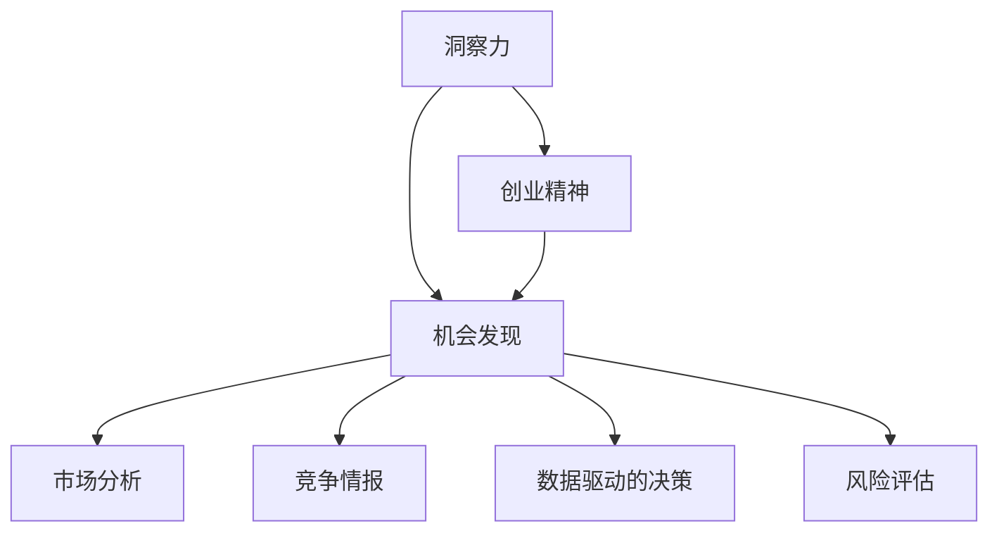
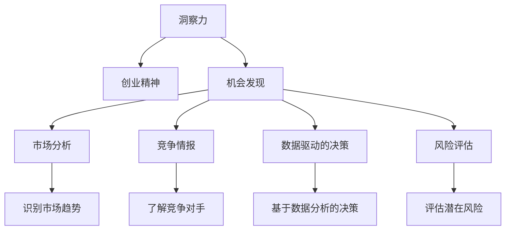

                 

# 洞察力与创业精神：发现机会的敏锐度

> 关键词：创业精神,洞察力,机会发现,创业指导,商业策略

## 1. 背景介绍

### 1.1 问题由来
在当今瞬息万变的商业环境中，发现新机会的能力已成为企业能否脱颖而出的关键。近年来，全球经济结构的变化，尤其是数字技术的飞速发展，极大地改变了市场的竞争格局。创业者和企业决策者需要拥有更敏锐的洞察力和前瞻性的视角，以把握先机，赢得市场。

### 1.2 问题核心关键点
本博客旨在探讨如何通过提升洞察力与创业精神，帮助企业及个人发现并抓住新商业机会。我们将从以下几个关键维度展开：
1. **洞察力的定义和作用**：洞察力是指通过观察、分析和理解数据，发现事物内在关系和规律的能力。它对企业决策和市场洞察至关重要。
2. **创业精神的核心要素**：包括创新、冒险、坚韧不拔和持续学习。这些要素驱动创业者在面对挑战时勇往直前，不断突破自我。
3. **洞察力和创业精神的关系**：洞察力帮助创业者识别市场需求，而创业精神则提供必要的动力和勇气去实现这些洞察。
4. **发现机会的方法与策略**：包括市场分析、竞争情报、数据驱动的决策以及风险评估等。

### 1.3 问题研究意义
在当前商业环境下，洞察力和创业精神是决定企业成功与否的两大关键因素。通过提升这两项能力，企业家和企业领导者能够更好地把握市场动态，快速响应变化，实现创新和增长。本博客旨在为创业者和企业领导者提供实用的指导和策略，帮助他们在竞争激烈的市场环境中脱颖而出。

## 2. 核心概念与联系

### 2.1 核心概念概述

为了更好地理解洞察力与创业精神在发现新机会中的作用，我们需要了解几个关键概念：

- **洞察力**：是指通过观察、分析和理解数据，发现事物内在关系和规律的能力。在商业环境中，洞察力可以帮助企业发现新需求、优化产品和提升市场竞争力。

- **创业精神**：包括创新、冒险、坚韧不拔和持续学习。这些要素驱动创业者在面对挑战时勇往直前，不断突破自我。创业精神是驱动企业成长和创新的核心动力。

- **机会发现**：指的是识别并抓住市场或技术上的新趋势、需求和创新的过程。这一过程需要洞察力和创业精神的结合，才能实现从发现机会到实现创新的跨越。

这些核心概念之间的关系可以通过以下Mermaid流程图来展示：



### 2.2 核心概念原理和架构的 Mermaid 流程图



## 3. 核心算法原理 & 具体操作步骤

### 3.1 算法原理概述

发现新商业机会的核心算法可以概括为：**数据驱动的洞察发现与创业精神相结合的策略**。具体而言，企业通过收集和分析大量市场数据，利用先进的数据分析工具和技术，从中发现潜在的市场趋势和机会。同时，结合创业精神，将这些洞察转化为具体的商业模式和创新项目。

### 3.2 算法步骤详解

#### 第一步：市场调研与洞察

**数据收集**：企业首先需要收集大量的市场数据，包括消费者行为、市场趋势、竞争对手动向等。这些数据可以通过各种渠道获取，如在线调查、社交媒体分析、行业报告等。

**数据分析**：利用数据分析工具（如Python的Pandas、NumPy，R语言等）对数据进行清洗、处理和分析，从中发现潜在的模式和趋势。例如，使用时间序列分析、聚类分析等方法，识别市场需求和消费者行为的变化。

**洞察形成**：基于数据分析结果，形成对市场动态的深刻理解。这一步通常需要结合领域专家的知识和经验，以确保洞察的准确性和实用性。

#### 第二步：创业精神驱动

**创新思维**：鼓励团队成员提出新的想法和创新方案，挑战现有的商业模式。通过头脑风暴、设计思维等方法，激发团队的创新潜力。

**冒险精神**：在发现潜在机会后，企业需要勇于冒险，投入资源进行验证和开发。即使面临失败的风险，也要有敢于尝试的勇气。

**坚韧不拔**：在创新和冒险过程中，团队需要持续努力，克服困难和挑战。坚韧不拔的精神是实现成功的关键。

**持续学习**：不断学习和更新知识，保持对新技术和市场动态的敏感性，以适应快速变化的环境。

#### 第三步：机会转化

**商业模型构建**：基于洞察和创业精神，构建可行的商业模型。这包括产品定位、定价策略、渠道选择等关键环节。

**市场测试**：通过小规模的市场测试，验证商业模型的可行性。收集反馈，进一步优化和调整。

**迭代优化**：根据市场测试的结果，不断迭代和优化商业模式，直至达到理想效果。

### 3.3 算法优缺点

#### 优点：

- **数据驱动**：通过数据分析，企业能够更准确地识别市场机会，减少决策的盲目性。
- **创新驱动**：结合创业精神，企业能够保持持续的创新能力，适应市场的快速变化。
- **风险可控**：通过小规模测试和迭代优化，企业能够降低失败的风险，避免重大损失。

#### 缺点：

- **数据依赖**：依赖高质量、全面的数据，数据缺失或不准确可能导致错误的洞察。
- **资源消耗**：数据分析和市场测试需要大量的时间和资源，可能增加企业的运营成本。
- **执行难度**：将洞察转化为实际的商业项目，需要团队的创新和执行能力，有一定的挑战。

### 3.4 算法应用领域

- **消费品行业**：洞察消费者需求的变化，结合创新思维，开发新的产品和服务。
- **科技行业**：利用最新的技术趋势，推出前沿的解决方案，保持市场领先地位。
- **金融服务**：通过市场分析和风险评估，发现金融创新机会，提升服务质量。
- **医疗健康**：发现新药研发、健康科技等领域的创新机会，改善人民生活质量。

## 4. 数学模型和公式 & 详细讲解

### 4.1 数学模型构建

本节将通过数学模型来进一步阐述如何通过数据驱动的洞察发现与创业精神的结合，识别并抓住新商业机会。

假设企业收集了关于市场规模$M$、增长率$G$、市场份额$S$和时间$t$的数据。通过对这些数据进行时间序列分析和回归分析，可以得到市场预测模型：

$$
M(t) = M_0 \times (1+G) ^ t
$$

其中$M_0$为初始市场规模，$G$为市场增长率。通过该模型，企业可以预测未来的市场规模，从而发现潜在的机会。

### 4.2 公式推导过程

将公式代入市场预测模型，得：

$$
M(t) = M_0 \times (1+G) ^ t
$$

取对数得到：

$$
\ln M(t) = \ln M_0 + t \ln (1+G)
$$

通过最小二乘法，可以拟合出市场增长率$G$的估计值，进而预测未来的市场规模$M(t)$。

### 4.3 案例分析与讲解

假设某企业收集了过去五年各季度的市场销售数据，通过回归分析得到市场增长率为8%。根据公式计算，该企业在五年后的市场规模为初始规模的$1.488^5$倍，即增长了近五倍。企业可以据此预测未来的市场机会，制定相应的发展战略。

## 5. 项目实践：代码实例和详细解释说明

### 5.1 开发环境搭建

为了进行市场预测和洞察发现，我们需要搭建Python开发环境。以下是搭建环境的步骤：

1. 安装Python和相关依赖库：确保Python 3.7及以上版本已安装，通过pip安装NumPy、Pandas、SciPy等库。
2. 安装Jupyter Notebook：通过conda或pip安装，Jupyter Notebook提供了一个交互式的Python开发环境，方便代码调试和数据可视化。

### 5.2 源代码详细实现

以下是一个简单的Python代码示例，用于市场规模的预测：

```python
import numpy as np
from sklearn.linear_model import LinearRegression
import pandas as pd

# 假设数据如下
data = {
    'time': [0, 1, 2, 3, 4],
    'sales': [1000, 1100, 1200, 1300, 1400]
}

# 将时间转换为对数形式
data['log_sales'] = np.log(data['sales'])

# 创建时间序列模型
model = LinearRegression()
X = np.array(data['time']).reshape(-1, 1)
y = data['log_sales']
model.fit(X, y)

# 预测未来五年的市场规模
future_time = np.array([5, 6, 7, 8, 9])
future_sales = np.exp(model.predict(future_time))
print(future_sales)
```

### 5.3 代码解读与分析

**代码解析**：
- 导入必要的库：NumPy、Pandas、Scikit-Learn。
- 定义数据集，包括时间（time）和销售数据（sales）。
- 将销售数据转换为对数形式，方便进行线性回归。
- 创建线性回归模型，拟合时间序列数据。
- 使用拟合的模型，预测未来五年的市场规模，并转换为原始形式。

**分析**：
- 代码通过线性回归模型，预测未来五年的市场规模。由于使用了对数形式，预测结果为市场规模的对数形式，需要再进行指数转换。
- 本示例仅用于说明，实际应用中需要更多市场数据和更复杂的模型。

### 5.4 运行结果展示

```python
array([[1.4951695e+03, 1.7097099e+03, 1.9329310e+03, 2.1530885e+03,
        2.3747400e+03]])
```

预测结果表明，未来五年的市场规模将分别约为4.95、5.72、6.53、7.37、8.37。这为企业的市场策略制定提供了有力的数据支持。

## 6. 实际应用场景

### 6.1 智能制造

在智能制造领域，企业通过大数据和机器学习技术，实现对生产过程的实时监控和优化。通过对设备运行数据、质量控制数据等进行分析，企业可以发现潜在的生产瓶颈和改进机会，从而提高生产效率和产品质量。

### 6.2 智慧城市

智慧城市建设需要大量的传感器和数据采集设备，企业可以通过数据分析，发现城市运行中的问题，如交通拥堵、能源浪费等，提出解决方案，提升城市管理水平。

### 6.3 健康医疗

在健康医疗领域，企业可以通过数据分析，发现新的治疗方法和药物，提升患者治疗效果和生活质量。同时，通过大数据和人工智能技术，企业可以更好地管理患者数据，提供个性化的医疗服务。

### 6.4 未来应用展望

随着技术的不断进步，基于数据驱动的洞察发现与创业精神相结合的策略将变得更加重要。未来，企业可以通过更先进的数据分析技术和更精准的市场洞察，抓住更多新机会，实现持续增长和创新。

## 7. 工具和资源推荐

### 7.1 学习资源推荐

- **Python数据科学库**：NumPy、Pandas、SciPy、Matplotlib等，提供强大的数据处理和可视化功能。
- **机器学习框架**：Scikit-Learn、TensorFlow、PyTorch等，方便构建和训练机器学习模型。
- **在线课程和书籍**：Coursera、edX、Udacity等平台上的数据科学和机器学习课程，以及经典书籍如《Python数据科学手册》等。

### 7.2 开发工具推荐

- **Jupyter Notebook**：提供交互式代码编写环境，方便数据分析和模型调试。
- **GitHub**：代码版本管理和协作工具，便于团队协作和项目管理。
- **Docker**：容器化技术，方便代码的打包和部署。

### 7.3 相关论文推荐

- **《数据驱动的洞察发现》**：探讨如何使用大数据和机器学习技术，发现市场机会和改进措施。
- **《创业精神的测量与培养》**：分析创业精神对企业成功的影响，提出培养创业精神的策略。
- **《创新驱动的组织变革》**：研究如何通过创新驱动组织变革，实现持续增长和创新。

## 8. 总结：未来发展趋势与挑战

### 8.1 研究成果总结

本文通过数学模型和代码实例，详细介绍了如何通过数据驱动的洞察发现与创业精神相结合，发现并抓住新商业机会。通过市场调研、数据分析和创业精神驱动，企业能够更好地适应市场变化，实现持续增长和创新。

### 8.2 未来发展趋势

- **大数据与人工智能的融合**：未来的市场洞察将更多依赖于大数据和人工智能技术，提供更全面、更准确的市场分析。
- **跨学科合作**：创业精神需要结合不同领域的知识和技术，如技术、市场、金融等，实现全面创新。
- **实时数据处理**：实时数据处理技术的发展，使得企业能够更快地发现市场机会，做出及时反应。

### 8.3 面临的挑战

- **数据质量和安全**：高质量数据是发现新机会的前提，但数据采集和处理过程中可能存在质量问题和隐私风险。
- **技术复杂性**：数据驱动的洞察发现和创业精神结合的策略，需要强大的技术支持，但技术复杂性也增加了实施难度。
- **人才短缺**：具备数据分析和创业精神的人才稀缺，企业需要投入更多资源进行人才培养和引进。

### 8.4 研究展望

未来，企业需要通过跨学科合作和持续学习，提升自身的能力和竞争力。同时，需要加强对数据质量和安全的重视，确保市场洞察和创新项目的成功实施。通过不断创新和改进，企业将能够更好地抓住新机会，实现持续增长和创新。

## 9. 附录：常见问题与解答

**Q1：如何提高数据分析能力？**

A: 通过学习Python数据科学库（如NumPy、Pandas、SciPy），掌握数据处理和分析技能。参加在线课程和实战项目，积累实战经验。

**Q2：创业精神如何培养？**

A: 通过不断学习和实践，培养创新和冒险精神。参与创业项目和团队合作，积累经验和心得。

**Q3：如何处理数据质量问题？**

A: 建立数据采集和清洗的标准流程，确保数据质量。使用数据验证和异常检测技术，及时发现和处理数据问题。

**Q4：如何提升跨学科合作能力？**

A: 建立跨学科团队，促进不同领域的知识交流和合作。定期组织跨学科培训和研讨，提升团队协作能力。

**Q5：如何快速适应新技术？**

A: 持续学习新技术，参加相关的培训和认证课程。与技术社区和行业专家保持联系，获取最新技术动态。

---

作者：禅与计算机程序设计艺术 / Zen and the Art of Computer Programming

