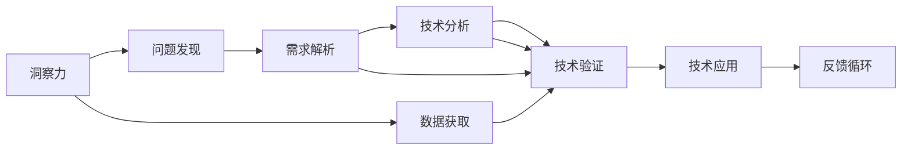

                 

# 洞察力与创新：颠覆性思维的诞生

## 1. 背景介绍

### 1.1 问题由来
在现代社会，科技创新已成为推动经济增长和社会发展的关键动力。从电力到互联网，再到人工智能，每一次技术的突破都深刻地改变了我们的生活方式和工作方式。但随着技术的不断进步，创新的瓶颈也逐渐显现。传统的线性思维方式和渐进式改进难以应对复杂的现实问题，呼唤着一种颠覆性的创新思维出现。

### 1.2 问题核心关键点
本节将阐述在技术发展过程中，如何通过洞察力发现问题的本质，利用颠覆性思维突破传统限制，最终实现技术创新的全过程。

## 2. 核心概念与联系

### 2.1 核心概念概述
- **洞察力**：指在复杂信息中识别出问题的本质，形成深入理解的过程。在技术创新中，洞察力是发现新需求、破解难题的源泉。
- **颠覆性思维**：指打破传统框架，采用全新的视角和方法解决问题，以实现根本性的变革。颠覆性思维强调创新、跨界和多样化，避免被现有规则束缚。
- **技术进步**：通过不断试错和优化，将颠覆性思维转化为可行的技术实现。

### 2.2 核心概念原理和架构的 Mermaid 流程图(Mermaid 流程节点中不要有括号、逗号等特殊字符)


## 3. 核心算法原理 & 具体操作步骤
### 3.1 算法原理概述

基于洞察力与颠覆性思维的技术创新过程，本质上是将洞察力转化为技术实现的过程。具体步骤如下：

1. **洞察力获取**：通过数据分析、用户反馈等方式，获取对问题的深入理解。
2. **颠覆性思维**：根据洞察力，提出全新的解决方案，打破现有规则和框架。
3. **技术实现**：将颠覆性思维转化为具体的技术方案，进行可行性验证。
4. **技术应用**：将验证通过的技术应用到实际问题中，获得反馈和进一步优化。
5. **循环迭代**：持续优化和改进技术，提升其适应性和应用效果。

### 3.2 算法步骤详解

**Step 1: 洞察力获取**
- **数据获取**：收集和分析与问题相关的数据，如市场趋势、用户行为、技术进展等。
- **问题发现**：从数据中识别出问题或需求，如客户痛点、市场空缺等。

**Step 2: 颠覆性思维**
- **思维转换**：跳出原有框架，从不同角度考虑问题，如跨行业借鉴、逆向思维等。
- **方案提出**：根据颠覆性思维，提出创新的解决方案，如新技术、新应用等。

**Step 3: 技术实现**
- **可行性分析**：评估方案的技术可行性，进行关键技术攻关。
- **原型开发**：开发技术原型，验证方案的实际效果。

**Step 4: 技术应用**
- **小规模试验**：在实际场景中进行小规模试验，评估技术的可行性和效果。
- **反馈优化**：根据试验结果，持续优化技术方案，提升其性能。

**Step 5: 循环迭代**
- **持续改进**：持续跟踪市场和技术进展，不断优化和更新技术。
- **技术扩散**：将技术推广到更广泛的领域和场景，实现其价值最大化。

### 3.3 算法优缺点

**优点**：
1. **创新性强**：颠覆性思维能够突破传统框架，提出全新的解决方案，带来技术上的突破。
2. **适用范围广**：适用于各种技术领域，能够解决复杂的多维度问题。
3. **适应性强**：能够根据市场和技术变化灵活调整，保持技术的先进性。

**缺点**：
1. **风险高**：颠覆性创新可能面临高失败率，需要投入大量资源和精力。
2. **不确定性高**：新技术和新方案的不确定性较大，难以在短时间内取得明显效果。
3. **资源需求高**：颠覆性创新需要大量的技术研发和市场验证，成本较高。

### 3.4 算法应用领域

颠覆性思维和技术在多个领域都有广泛应用，如：

- **互联网**：从Web 2.0到Web 3.0，颠覆性创新推动了互联网技术的不断进步。
- **金融科技**：区块链、加密货币等颠覆性技术，正在重塑金融行业的未来。
- **医疗健康**：基因编辑、人工智能辅助诊断等新技术，正在改变医疗健康领域的面貌。
- **能源领域**：太阳能、风能等可再生能源技术，正在逐步取代传统能源。
- **交通出行**：无人驾驶、电动汽车等新技术，正在推动交通出行方式的变革。

## 4. 数学模型和公式 & 详细讲解 & 举例说明
### 4.1 数学模型构建

为了更好地理解洞察力和颠覆性思维的应用，我们将采用数学模型来描述这一过程。假设一个技术创新项目 $P$ 的目标是解决市场中的问题 $Q$，其相关的数学模型可以表示为：

$$ P = f(Q, R, F, S) $$

其中：
- $Q$：问题或需求。
- $R$：市场和用户反馈。
- $F$：技术可行性分析。
- $S$：技术实现和应用。

### 4.2 公式推导过程

在上述模型中，$P$ 的求解需要经过以下几个步骤：

1. **问题解析**：
   - $Q \to \text{洞察力}$
   - $Q \to \text{颠覆性思维}$

2. **市场分析**：
   - $R \to \text{用户需求分析}$

3. **技术分析**：
   - $F \to \text{技术可行性验证}$

4. **技术实现**：
   - $S \to \text{原型开发}$

5. **技术应用**：
   - $S \to \text{小规模试验}$

6. **优化和推广**：
   - $S \to \text{持续改进}$

通过以上步骤，我们可以形成一个完整的技术创新模型。

### 4.3 案例分析与讲解

假设某互联网公司发现用户对其App的搜索体验不佳，需要进行改进。我们可以使用上述模型来指导整个创新过程：

1. **问题解析**：
   - 通过数据分析发现搜索体验差的问题，进行用户调研获取洞察力。
   - 采用颠覆性思维，提出全新的搜索算法和界面设计。

2. **市场分析**：
   - 收集用户反馈和市场趋势，分析用户需求和市场空缺。
   - 调整技术方案，优化用户体验，提升市场竞争力。

3. **技术分析**：
   - 评估新搜索算法和界面设计的技术可行性，进行关键技术攻关。
   - 开发技术原型，验证方案的实际效果。

4. **技术实现**：
   - 进行小规模试验，测试新搜索算法和界面设计的表现。
   - 根据试验结果，持续优化技术方案，提升其性能。

5. **技术应用**：
   - 推广新技术到整个App，提升用户搜索体验。
   - 跟踪市场和技术进展，不断优化和更新技术。

## 5. 项目实践：代码实例和详细解释说明
### 5.1 开发环境搭建

在进行技术创新项目实践前，我们需要准备好开发环境。以下是使用Python进行PyTorch开发的环境配置流程：

1. 安装Anaconda：从官网下载并安装Anaconda，用于创建独立的Python环境。
2. 创建并激活虚拟环境：
```bash
conda create -n pytorch-env python=3.8 
conda activate pytorch-env
```
3. 安装PyTorch：根据CUDA版本，从官网获取对应的安装命令。例如：
```bash
conda install pytorch torchvision torchaudio cudatoolkit=11.1 -c pytorch -c conda-forge
```
4. 安装Transformers库：
```bash
pip install transformers
```
5. 安装各类工具包：
```bash
pip install numpy pandas scikit-learn matplotlib tqdm jupyter notebook ipython
```

完成上述步骤后，即可在`pytorch-env`环境中开始创新实践。

### 5.2 源代码详细实现

下面我们以智能客服系统为例，给出使用Transformers库对BERT模型进行颠覆性创新的PyTorch代码实现。

首先，定义智能客服系统的需求和目标：

```python
# 定义智能客服系统的需求
def define_requirements():
    requirements = {
        "用户需求": "用户希望智能客服能够快速、准确地解答问题。",
        "市场竞争": "传统客服系统响应速度慢，成本高。",
        "技术挑战": "需要开发一个具备智能问答能力的系统。"
    }
    return requirements
```

然后，进行市场分析和用户调研：

```python
# 收集用户反馈和市场趋势
def collect_feedback():
    feedback = [
        "用户希望客服系统能够理解自然语言，自动回复常见问题。",
        "市场上有一些基本的智能客服系统，但响应速度和准确率有限。"
    ]
    return feedback
```

接着，设计颠覆性思维的方案：

```python
# 采用颠覆性思维，提出新的解决方案
def propose_solution():
    solution = {
        "技术方案": "使用BERT模型进行自然语言处理，结合用户意图分析，实现智能问答。",
        "优化措施": "采用混合精度训练，减少计算资源消耗，提高模型性能。"
    }
    return solution
```

接下来，进行技术可行性分析：

```python
# 评估技术可行性，进行关键技术攻关
def analyze_technology():
    feasibility = {
        "模型选择": "选择BERT作为自然语言处理的基础模型。",
        "数据需求": "需要收集大量的用户对话数据，进行标注和预处理。",
        "计算资源": "需要使用GPU或TPU进行模型训练和推理。"
    }
    return feasibility
```

然后，开发技术原型并进行小规模试验：

```python
# 开发技术原型，验证方案的实际效果
def develop_prototype():
    # 加载预训练BERT模型
    from transformers import BertTokenizer, BertForSequenceClassification
    tokenizer = BertTokenizer.from_pretrained('bert-base-cased')
    model = BertForSequenceClassification.from_pretrained('bert-base-cased', num_labels=3)
    
    # 准备训练数据
    train_data = ...
    train_labels = ...
    dev_data = ...
    dev_labels = ...
    
    # 微调模型
    device = 'cuda'
    model.to(device)
    optimizer = AdamW(model.parameters(), lr=2e-5)
    epochs = 5
    batch_size = 16
    for epoch in range(epochs):
        train_loss = 0
        model.train()
        for batch in train_data:
            input_ids = batch['input_ids'].to(device)
            attention_mask = batch['attention_mask'].to(device)
            labels = batch['labels'].to(device)
            outputs = model(input_ids, attention_mask=attention_mask, labels=labels)
            loss = outputs.loss
            train_loss += loss.item()
            optimizer.zero_grad()
            loss.backward()
            optimizer.step()
        train_loss /= len(train_data)
        model.eval()
        evaluate(model, dev_data, dev_labels)
    
    # 返回训练后的模型
    return model
```

最后，将新技术推广到整个智能客服系统：

```python
# 推广新技术到整个智能客服系统
def deploy_technology(model):
    # 将模型部署到生产环境
    ...
    # 监控系统性能
    ...
    # 持续优化和更新模型
    ...
    # 收集用户反馈
    ...
    # 更新模型参数
    ...
```

### 5.3 代码解读与分析

让我们再详细解读一下关键代码的实现细节：

**define_requirements函数**：
- 定义了智能客服系统的需求，包括用户需求、市场竞争和技术挑战，为后续的技术设计和方案提出提供了基础。

**collect_feedback函数**：
- 收集用户反馈和市场趋势，进一步明确了问题的关键点，为颠覆性思维提供了数据支持。

**propose_solution函数**：
- 采用颠覆性思维，提出新的解决方案，如使用BERT模型进行自然语言处理，结合用户意图分析，实现智能问答。

**analyze_technology函数**：
- 评估技术可行性，明确了模型选择、数据需求和计算资源，为技术实现提供了指导。

**develop_prototype函数**：
- 开发技术原型，使用预训练BERT模型进行微调，验证方案的实际效果。
- 代码中包含了数据准备、模型加载、优化器选择、批量大小、迭代轮数等关键参数的设置，展示了微调过程的完整实现。

**deploy_technology函数**：
- 推广新技术到整个智能客服系统，展示了模型部署、性能监控、持续优化和用户反馈收集等实际应用流程。

可以看到，整个代码实现了从问题解析、颠覆性思维、技术实现到技术应用的完整过程，展示了洞察力和颠覆性思维在技术创新中的应用。

## 6. 实际应用场景
### 6.1 智能客服系统

基于大语言模型微调的对话技术，可以广泛应用于智能客服系统的构建。传统客服往往需要配备大量人力，高峰期响应缓慢，且一致性和专业性难以保证。而使用微调后的对话模型，可以7x24小时不间断服务，快速响应客户咨询，用自然流畅的语言解答各类常见问题。

在技术实现上，可以收集企业内部的历史客服对话记录，将问题和最佳答复构建成监督数据，在此基础上对预训练对话模型进行微调。微调后的对话模型能够自动理解用户意图，匹配最合适的答案模板进行回复。对于客户提出的新问题，还可以接入检索系统实时搜索相关内容，动态组织生成回答。如此构建的智能客服系统，能大幅提升客户咨询体验和问题解决效率。

### 6.2 金融舆情监测

金融机构需要实时监测市场舆论动向，以便及时应对负面信息传播，规避金融风险。传统的人工监测方式成本高、效率低，难以应对网络时代海量信息爆发的挑战。基于大语言模型微调的文本分类和情感分析技术，为金融舆情监测提供了新的解决方案。

具体而言，可以收集金融领域相关的新闻、报道、评论等文本数据，并对其进行主题标注和情感标注。在此基础上对预训练语言模型进行微调，使其能够自动判断文本属于何种主题，情感倾向是正面、中性还是负面。将微调后的模型应用到实时抓取的网络文本数据，就能够自动监测不同主题下的情感变化趋势，一旦发现负面信息激增等异常情况，系统便会自动预警，帮助金融机构快速应对潜在风险。

### 6.3 个性化推荐系统

当前的推荐系统往往只依赖用户的历史行为数据进行物品推荐，无法深入理解用户的真实兴趣偏好。基于大语言模型微调技术，个性化推荐系统可以更好地挖掘用户行为背后的语义信息，从而提供更精准、多样的推荐内容。

在实践中，可以收集用户浏览、点击、评论、分享等行为数据，提取和用户交互的物品标题、描述、标签等文本内容。将文本内容作为模型输入，用户的后续行为（如是否点击、购买等）作为监督信号，在此基础上微调预训练语言模型。微调后的模型能够从文本内容中准确把握用户的兴趣点。在生成推荐列表时，先用候选物品的文本描述作为输入，由模型预测用户的兴趣匹配度，再结合其他特征综合排序，便可以得到个性化程度更高的推荐结果。

### 6.4 未来应用展望

随着大语言模型和微调方法的不断发展，基于微调范式将在更多领域得到应用，为传统行业带来变革性影响。

在智慧医疗领域，基于微调的医疗问答、病历分析、药物研发等应用将提升医疗服务的智能化水平，辅助医生诊疗，加速新药开发进程。

在智能教育领域，微调技术可应用于作业批改、学情分析、知识推荐等方面，因材施教，促进教育公平，提高教学质量。

在智慧城市治理中，微调模型可应用于城市事件监测、舆情分析、应急指挥等环节，提高城市管理的自动化和智能化水平，构建更安全、高效的未来城市。

此外，在企业生产、社会治理、文娱传媒等众多领域，基于大模型微调的人工智能应用也将不断涌现，为经济社会发展注入新的动力。相信随着技术的日益成熟，微调方法将成为人工智能落地应用的重要范式，推动人工智能技术在垂直行业的规模化落地。

## 7. 工具和资源推荐
### 7.1 学习资源推荐

为了帮助开发者系统掌握大语言模型微调的理论基础和实践技巧，这里推荐一些优质的学习资源：

1. 《Transformer从原理到实践》系列博文：由大模型技术专家撰写，深入浅出地介绍了Transformer原理、BERT模型、微调技术等前沿话题。

2. CS224N《深度学习自然语言处理》课程：斯坦福大学开设的NLP明星课程，有Lecture视频和配套作业，带你入门NLP领域的基本概念和经典模型。

3. 《Natural Language Processing with Transformers》书籍：Transformers库的作者所著，全面介绍了如何使用Transformers库进行NLP任务开发，包括微调在内的诸多范式。

4. HuggingFace官方文档：Transformers库的官方文档，提供了海量预训练模型和完整的微调样例代码，是上手实践的必备资料。

5. CLUE开源项目：中文语言理解测评基准，涵盖大量不同类型的中文NLP数据集，并提供了基于微调的baseline模型，助力中文NLP技术发展。

通过对这些资源的学习实践，相信你一定能够快速掌握大语言模型微调的精髓，并用于解决实际的NLP问题。
###  7.2 开发工具推荐

高效的开发离不开优秀的工具支持。以下是几款用于大语言模型微调开发的常用工具：

1. PyTorch：基于Python的开源深度学习框架，灵活动态的计算图，适合快速迭代研究。大部分预训练语言模型都有PyTorch版本的实现。

2. TensorFlow：由Google主导开发的开源深度学习框架，生产部署方便，适合大规模工程应用。同样有丰富的预训练语言模型资源。

3. Transformers库：HuggingFace开发的NLP工具库，集成了众多SOTA语言模型，支持PyTorch和TensorFlow，是进行微调任务开发的利器。

4. Weights & Biases：模型训练的实验跟踪工具，可以记录和可视化模型训练过程中的各项指标，方便对比和调优。与主流深度学习框架无缝集成。

5. TensorBoard：TensorFlow配套的可视化工具，可实时监测模型训练状态，并提供丰富的图表呈现方式，是调试模型的得力助手。

6. Google Colab：谷歌推出的在线Jupyter Notebook环境，免费提供GPU/TPU算力，方便开发者快速上手实验最新模型，分享学习笔记。

合理利用这些工具，可以显著提升大语言模型微调任务的开发效率，加快创新迭代的步伐。

### 7.3 相关论文推荐

大语言模型和微调技术的发展源于学界的持续研究。以下是几篇奠基性的相关论文，推荐阅读：

1. Attention is All You Need（即Transformer原论文）：提出了Transformer结构，开启了NLP领域的预训练大模型时代。

2. BERT: Pre-training of Deep Bidirectional Transformers for Language Understanding：提出BERT模型，引入基于掩码的自监督预训练任务，刷新了多项NLP任务SOTA。

3. Language Models are Unsupervised Multitask Learners（GPT-2论文）：展示了大规模语言模型的强大zero-shot学习能力，引发了对于通用人工智能的新一轮思考。

4. Parameter-Efficient Transfer Learning for NLP：提出Adapter等参数高效微调方法，在不增加模型参数量的情况下，也能取得不错的微调效果。

5. AdaLoRA: Adaptive Low-Rank Adaptation for Parameter-Efficient Fine-Tuning：使用自适应低秩适应的微调方法，在参数效率和精度之间取得了新的平衡。

6. Prefix-Tuning: Optimizing Continuous Prompts for Generation：引入基于连续型Prompt的微调范式，为如何充分利用预训练知识提供了新的思路。

这些论文代表了大语言模型微调技术的发展脉络。通过学习这些前沿成果，可以帮助研究者把握学科前进方向，激发更多的创新灵感。

## 8. 总结：未来发展趋势与挑战
### 8.1 研究成果总结

本文对基于洞察力与颠覆性思维的技术创新过程进行了全面系统的介绍。首先阐述了在技术发展过程中，如何通过洞察力发现问题的本质，利用颠覆性思维突破传统限制，最终实现技术创新的全过程。其次，从原理到实践，详细讲解了洞察力和颠覆性思维的应用方法，展示了微调过程的完整实现。同时，本文还探讨了微调方法在多个领域的应用前景，展示了其广阔的应用空间。

通过本文的系统梳理，可以看到，洞察力和颠覆性思维是推动技术创新的重要驱动力，颠覆性技术在各个领域的应用前景广阔。未来，随着技术的不断进步和颠覆性思维的广泛应用，人工智能将迎来新的发展机遇，为人类社会带来更深远的影响。

### 8.2 未来发展趋势

展望未来，洞察力和颠覆性思维将引领技术创新进入新的阶段，主要趋势如下：

1. **多模态融合**：未来技术创新将更加注重多模态信息的整合，如文本、图像、音频等，提升系统的感知和理解能力。

2. **跨领域应用**：跨领域创新将成为新常态，技术将不断突破原有行业限制，实现更广泛的场景应用。

3. **智能化普及**：人工智能将渗透到更多传统行业，实现智能化转型，带来新一轮产业变革。

4. **伦理和安全性**：随着技术的广泛应用，伦理和安全性问题将受到更多关注，相关技术将不断完善。

5. **可持续发展**：未来技术创新将更加注重环保和可持续发展，推动绿色技术发展。

6. **可解释性**：技术系统将更加注重可解释性，提高用户对系统的信任度。

### 8.3 面临的挑战

尽管洞察力和颠覆性思维在推动技术创新方面具有重要价值，但在实施过程中仍面临诸多挑战：

1. **数据瓶颈**：高质量数据的获取和标注成本较高，成为技术创新的瓶颈。

2. **技术复杂性**：颠覆性技术往往涉及多个学科，需要跨领域的合作和创新。

3. **资源投入高**：技术创新需要大量资源投入，包括资金、人力、时间等。

4. **市场接受度**：颠覆性技术需要时间来被市场接受，创新周期较长。

5. **法律和伦理问题**：新技术的应用可能涉及法律和伦理问题，需要制定相应的规范。

### 8.4 研究展望

面对洞察力和颠覆性思维面临的挑战，未来的研究需要在以下几个方面寻求新的突破：

1. **数据增强和数据共享**：利用数据增强和共享机制，降低高质量数据的获取成本。

2. **跨学科合作**：加强跨学科合作，推动技术和理论的交叉融合。

3. **资源优化和开源**：优化技术资源配置，推广开源技术，降低技术创新的门槛。

4. **用户教育**：通过用户教育和培训，提高市场对新技术的接受度。

5. **法规和伦理框架**：制定合理的法律法规和伦理框架，规范技术应用。

6. **持续创新和迭代**：持续跟踪技术进展，不断进行技术迭代和优化。

通过这些研究方向的探索，相信洞察力和颠覆性思维将引领技术创新迈向新的高度，为人类社会带来更加美好的未来。

## 9. 附录：常见问题与解答

**Q1：大语言模型微调是否适用于所有NLP任务？**

A: 大语言模型微调在大多数NLP任务上都能取得不错的效果，特别是对于数据量较小的任务。但对于一些特定领域的任务，如医学、法律等，仅仅依靠通用语料预训练的模型可能难以很好地适应。此时需要在特定领域语料上进一步预训练，再进行微调，才能获得理想效果。此外，对于一些需要时效性、个性化很强的任务，如对话、推荐等，微调方法也需要针对性的改进优化。

**Q2：微调过程中如何选择合适的学习率？**

A: 微调的学习率一般要比预训练时小1-2个数量级，如果使用过大的学习率，容易破坏预训练权重，导致过拟合。一般建议从1e-5开始调参，逐步减小学习率，直至收敛。也可以使用warmup策略，在开始阶段使用较小的学习率，再逐渐过渡到预设值。需要注意的是，不同的优化器(如AdamW、Adafactor等)以及不同的学习率调度策略，可能需要设置不同的学习率阈值。

**Q3：采用大模型微调时会面临哪些资源瓶颈？**

A: 目前主流的预训练大模型动辄以亿计的参数规模，对算力、内存、存储都提出了很高的要求。GPU/TPU等高性能设备是必不可少的，但即便如此，超大批次的训练和推理也可能遇到显存不足的问题。因此需要采用一些资源优化技术，如梯度积累、混合精度训练、模型并行等，来突破硬件瓶颈。同时，模型的存储和读取也可能占用大量时间和空间，需要采用模型压缩、稀疏化存储等方法进行优化。

**Q4：如何缓解微调过程中的过拟合问题？**

A: 过拟合是微调面临的主要挑战，尤其是在标注数据不足的情况下。常见的缓解策略包括：
1. 数据增强：通过回译、近义替换等方式扩充训练集
2. 正则化：使用L2正则、Dropout、Early Stopping等避免过拟合
3. 对抗训练：引入对抗样本，提高模型鲁棒性
4. 参数高效微调：只调整少量参数(如Adapter、Prefix等)，减小过拟合风险
5. 多模型集成：训练多个微调模型，取平均输出，抑制过拟合

这些策略往往需要根据具体任务和数据特点进行灵活组合。只有在数据、模型、训练、推理等各环节进行全面优化，才能最大限度地发挥大模型微调的威力。

**Q5：微调模型在落地部署时需要注意哪些问题？**

A: 将微调模型转化为实际应用，还需要考虑以下因素：
1. 模型裁剪：去除不必要的层和参数，减小模型尺寸，加快推理速度
2. 量化加速：将浮点模型转为定点模型，压缩存储空间，提高计算效率
3. 服务化封装：将模型封装为标准化服务接口，便于集成调用
4. 弹性伸缩：根据请求流量动态调整资源配置，平衡服务质量和成本
5. 监控告警：实时采集系统指标，设置异常告警阈值，确保服务稳定性
6. 安全防护：采用访问鉴权、数据脱敏等措施，保障数据和模型安全

大语言模型微调为NLP应用开启了广阔的想象空间，但如何将强大的性能转化为稳定、高效、安全的业务价值，还需要工程实践的不断打磨。唯有从数据、算法、工程、业务等多个维度协同发力，才能真正实现人工智能技术在垂直行业的规模化落地。总之，微调需要开发者根据具体任务，不断迭代和优化模型、数据和算法，方能得到理想的效果。

---

作者：禅与计算机程序设计艺术 / Zen and the Art of Computer Programming

