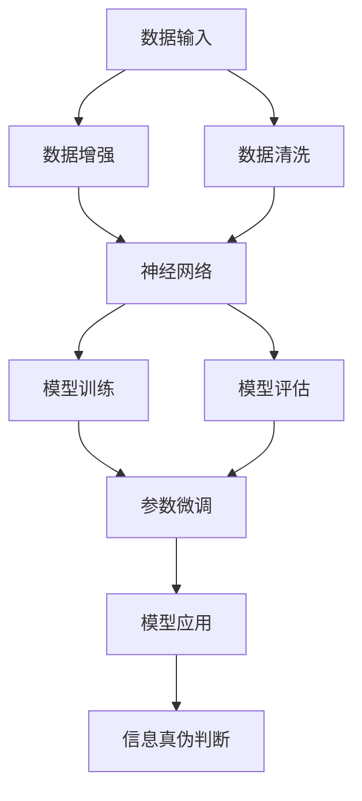

                 

# 洞察力与批判性思维：辨别信息真伪的能力

> 关键词：信息真伪,深度学习,神经网络,统计学,数据处理,机器学习

## 1. 背景介绍

在当今信息爆炸的时代，面对海量的数据和纷繁复杂的信息，人们如何在海量数据中寻找真实、有价值的信息，成为了一个亟待解决的问题。在这个过程中，深度学习和人工智能技术，尤其是神经网络和机器学习技术，提供了强大的数据分析和处理能力，为信息真伪的辨别提供了新的视角和工具。本文旨在从深度学习的角度，探讨如何通过构建和训练深度学习模型，提升人们辨别信息真伪的能力。

## 2. 核心概念与联系

### 2.1 核心概念概述

为了更好地理解如何通过深度学习技术辨别信息真伪，我们将首先介绍几个核心概念：

- **深度学习**：一种利用神经网络模型进行数据分析和处理的技术。深度学习模型通过多层非线性变换，可以学习和提取复杂的数据特征。

- **神经网络**：一种由多个层次组成的计算模型，每一层包含多个神经元，用于处理和传递信息。深度学习模型通常包含多个隐藏层，可以自动提取和学习输入数据的高层次特征。

- **统计学**：深度学习模型的训练和性能评估通常依赖于统计学原理，如最大似然估计、交叉验证等。

- **数据处理**：深度学习模型需要大量标注数据进行训练，数据处理技术如数据增强、数据清洗等对模型性能至关重要。

- **机器学习**：深度学习是机器学习的一种，通过让模型从数据中学习规律，实现对新数据的预测和分类。

### 2.2 核心概念原理和架构的 Mermaid 流程图(Mermaid 流程节点中不要有括号、逗号等特殊字符)



## 3. 核心算法原理 & 具体操作步骤

### 3.1 算法原理概述

深度学习模型可以应用于信息真伪辨别任务，主要基于以下几个原理：

- **特征提取**：深度学习模型通过多层非线性变换，自动学习输入数据的复杂特征，能够从海量数据中提取出对信息真伪判别有用的特征。

- **规律学习**：模型通过大量的标注数据进行训练，能够学习到数据之间的规律和关联，从而实现对新数据的预测和分类。

- **异常检测**：在训练过程中，模型能够学习到数据中的正常模式和异常模式，通过检测新数据的异常特征，可以判断其是否为真伪信息。

### 3.2 算法步骤详解

深度学习模型辨别信息真伪的过程主要包括以下几个步骤：

**Step 1: 数据准备**

- 收集和预处理数据。数据包括文本、图片、音频等多种形式。
- 将数据划分为训练集、验证集和测试集。

**Step 2: 模型构建**

- 选择合适的神经网络架构，如卷积神经网络(CNN)、循环神经网络(RNN)、Transformer等。
- 设计合适的模型结构，包括输入层、隐藏层、输出层等。

**Step 3: 模型训练**

- 使用标注数据进行模型训练，优化模型参数。
- 应用正则化技术，如L2正则、Dropout等，防止过拟合。

**Step 4: 模型评估**

- 在验证集上评估模型性能，选择最优模型。
- 计算模型的准确率、召回率、F1分数等指标。

**Step 5: 模型应用**

- 将训练好的模型应用于新的数据，进行信息真伪判断。
- 对判断结果进行后处理，如加权、阈值化等。

### 3.3 算法优缺点

深度学习模型辨别信息真伪有以下优点：

- **高效**：通过大量标注数据的训练，深度学习模型能够高效地从数据中提取特征和规律。
- **自动学习**：模型能够自动学习和适应复杂的数据分布，不需要手工设计特征。
- **可扩展**：模型可以通过增加层数、节点数等方式，不断提升性能。

但深度学习模型也存在一些缺点：

- **需要大量数据**：深度学习模型通常需要大量的标注数据进行训练，数据获取成本较高。
- **模型复杂**：深度学习模型结构复杂，训练和推理过程需要较高的计算资源。
- **可解释性差**：深度学习模型通常被视为"黑盒"模型，难以解释其内部工作机制。

### 3.4 算法应用领域

深度学习模型在信息真伪辨别领域有着广泛的应用，如：

- **新闻验证**：通过深度学习模型对新闻文本进行自动验证，判断其真伪。
- **图像识别**：通过深度学习模型对图片进行图像识别，判断其是否为伪造图片。
- **视频分析**：通过深度学习模型对视频进行分析，判断其是否为伪造视频。
- **音频识别**：通过深度学习模型对音频进行识别，判断其是否为伪造音频。
- **社交网络监控**：通过深度学习模型对社交网络数据进行监控，识别和屏蔽虚假信息。

## 4. 数学模型和公式 & 详细讲解 & 举例说明

### 4.1 数学模型构建

假设我们的深度学习模型是一个二分类模型，用于判断信息为真伪。模型输入为 $x$，输出为 $y$，模型的预测结果为 $y' = f(x; \theta)$，其中 $\theta$ 为模型参数。我们的目标是最大化模型在测试集上的准确率。

### 4.2 公式推导过程

对于二分类问题，我们通常使用交叉熵损失函数，表示为：

$$
L(y, y') = -(y \log y' + (1-y) \log (1-y'))
$$

在模型训练过程中，我们希望最小化损失函数 $L$，即：

$$
\theta^* = \arg\min_{\theta} L(y, y')
$$

使用梯度下降算法，模型的更新公式为：

$$
\theta \leftarrow \theta - \eta \nabla_{\theta}L(y, y')
$$

其中 $\eta$ 为学习率。

### 4.3 案例分析与讲解

以图像识别为例，假设我们有一张图片 $x$，通过卷积神经网络模型进行特征提取，得到特征向量 $h$。将特征向量 $h$ 输入全连接层，输出结果 $y'$。我们希望最大化模型在训练集上的准确率，可以使用交叉熵损失函数进行训练。

## 5. 项目实践：代码实例和详细解释说明

### 5.1 开发环境搭建

为了搭建深度学习项目，我们需要准备以下开发环境：

1. 安装Python：Python是深度学习的主要编程语言，建议安装最新版本。
2. 安装TensorFlow或PyTorch：TensorFlow和PyTorch是目前最常用的深度学习框架，根据个人偏好进行选择。
3. 安装相关库：如numpy、pandas、scikit-learn等。

### 5.2 源代码详细实现

以使用TensorFlow进行图像识别项目为例，具体代码实现如下：

```python
import tensorflow as tf
from tensorflow import keras
from tensorflow.keras import layers

# 加载数据集
(train_images, train_labels), (test_images, test_labels) = keras.datasets.mnist.load_data()

# 数据预处理
train_images = train_images / 255.0
test_images = test_images / 255.0

# 构建模型
model = keras.Sequential([
    layers.Flatten(input_shape=(28, 28)),
    layers.Dense(128, activation='relu'),
    layers.Dense(10)
])

# 编译模型
model.compile(optimizer='adam',
              loss=tf.keras.losses.SparseCategoricalCrossentropy(from_logits=True),
              metrics=['accuracy'])

# 训练模型
model.fit(train_images, train_labels, epochs=5)

# 评估模型
test_loss, test_acc = model.evaluate(test_images, test_labels, verbose=2)

# 输出结果
print('Test accuracy:', test_acc)
```

### 5.3 代码解读与分析

以上代码实现了使用TensorFlow进行图像识别的全过程。具体来说，我们首先加载MNIST数据集，然后进行数据预处理，将像素值缩放到0-1之间。接着，我们构建了一个包含两个全连接层的神经网络模型，使用ReLU激活函数。最后，我们编译模型，选择Adam优化器和交叉熵损失函数，进行训练和评估。

## 6. 实际应用场景

### 6.1 新闻验证

深度学习模型可以用于新闻验证，通过自动判断新闻是否为真伪，为新闻媒体提供可信度保障。具体来说，我们可以使用文本分类模型对新闻标题和正文进行自动验证，识别其中的虚假信息。

### 6.2 图像识别

深度学习模型可以用于图像识别，通过自动判断图片是否为伪造图片，为网络安全提供保障。具体来说，我们可以使用卷积神经网络对图片进行特征提取，判断其中是否存在明显的篡改痕迹。

### 6.3 视频分析

深度学习模型可以用于视频分析，通过自动判断视频是否为伪造视频，为网络安全提供保障。具体来说，我们可以使用视频处理技术对视频进行帧提取，使用深度学习模型对每一帧进行特征提取，判断其中是否存在篡改痕迹。

### 6.4 社交网络监控

深度学习模型可以用于社交网络监控，通过自动识别和屏蔽虚假信息，为社交网络提供安全保障。具体来说，我们可以使用自然语言处理技术对社交网络数据进行文本分类，识别其中的虚假信息。

## 7. 工具和资源推荐

### 7.1 学习资源推荐

为了帮助开发者掌握深度学习技术，以下是一些推荐的学习资源：

1. 《深度学习》书籍：由Ian Goodfellow等编写，是深度学习领域的经典教材。
2. TensorFlow官方文档：TensorFlow的官方文档提供了详细的API参考和示例代码。
3. PyTorch官方文档：PyTorch的官方文档提供了详细的API参考和示例代码。
4. Kaggle：Kaggle是一个数据科学竞赛平台，提供了大量的数据集和挑战题目。
5. Coursera：Coursera是一个在线学习平台，提供深度学习相关课程。

### 7.2 开发工具推荐

深度学习模型的开发离不开各种工具的支持。以下是一些常用的开发工具：

1. Jupyter Notebook：Jupyter Notebook是一个交互式编程环境，方便开发者进行代码调试和实验。
2. GitHub：GitHub是一个代码托管平台，方便开发者进行代码版本控制和协作开发。
3. Docker：Docker是一个容器化技术，方便开发者进行模型部署和运行。

### 7.3 相关论文推荐

深度学习模型在信息真伪辨别领域的研究成果如下：

1. "Deepfake Video Detection with an Ensemble of Pre-trained Models"：提出使用多个预训练模型进行深度伪造视频检测。
2. "A Survey on Deepfake Detection with Deep Learning"：对深度伪造检测的深度学习算法进行了全面的综述。
3. "A Multimodal Approach to Detecting Deepfakes in the Wild"：提出使用多模态数据进行深度伪造检测。
4. "A Two-Stage Convolutional Neural Network for Faking Image Detection"：提出使用两阶段卷积神经网络进行图像检测。

## 8. 总结：未来发展趋势与挑战

### 8.1 研究成果总结

深度学习模型在信息真伪辨别领域已经取得了显著成果，但仍然面临诸多挑战：

- **数据需求高**：深度学习模型需要大量的标注数据进行训练，数据获取成本较高。
- **模型复杂**：深度学习模型结构复杂，训练和推理过程需要较高的计算资源。
- **可解释性差**：深度学习模型通常被视为"黑盒"模型，难以解释其内部工作机制。

### 8.2 未来发展趋势

深度学习模型在信息真伪辨别领域的发展趋势如下：

- **数据增强**：深度学习模型需要更多的数据进行训练，数据增强技术可以有效地扩充数据集。
- **轻量级模型**：轻量级模型可以在资源受限的设备上运行，具有更好的可扩展性和实用性。
- **多模态融合**：深度学习模型可以与图像、音频、文本等多种模态数据进行融合，提升信息真伪判断的准确性。

### 8.3 面临的挑战

深度学习模型在信息真伪辨别领域仍面临诸多挑战：

- **数据获取成本高**：深度学习模型需要大量的标注数据进行训练，数据获取成本较高。
- **模型计算资源需求高**：深度学习模型结构复杂，训练和推理过程需要较高的计算资源。
- **模型可解释性差**：深度学习模型通常被视为"黑盒"模型，难以解释其内部工作机制。

### 8.4 研究展望

深度学习模型在信息真伪辨别领域的研究展望如下：

- **数据增强技术**：通过数据增强技术扩充数据集，提升模型泛化能力。
- **轻量级模型研究**：研究轻量级模型，提升模型部署效率。
- **多模态融合**：研究多模态数据融合技术，提升信息真伪判断的准确性。
- **模型可解释性**：研究可解释性强的模型，提升模型的可信度。

## 9. 附录：常见问题与解答

**Q1: 深度学习模型在信息真伪辨别领域的应用前景如何？**

A: 深度学习模型在信息真伪辨别领域有着广泛的应用前景，可以用于新闻验证、图像识别、视频分析、社交网络监控等场景。深度学习模型能够自动学习和提取复杂的数据特征，提高信息真伪判断的准确性和效率。

**Q2: 深度学习模型在训练过程中需要注意哪些问题？**

A: 深度学习模型在训练过程中需要注意以下问题：

- **数据质量**：标注数据需要高质量，避免数据噪声对模型训练的影响。
- **正则化**：使用正则化技术，如L2正则、Dropout等，防止过拟合。
- **学习率**：选择合适学习率，避免过大或过小的学习率导致模型训练效果不佳。

**Q3: 深度学习模型在实际应用中需要注意哪些问题？**

A: 深度学习模型在实际应用中需要注意以下问题：

- **模型部署**：选择合适的模型部署方式，如TensorFlow Serving、PyTorch Serving等。
- **模型调优**：根据实际应用场景，对模型进行调优，如参数剪枝、量化加速等。
- **模型监控**：实时监控模型运行状态，发现并解决问题，确保模型稳定运行。

---

作者：禅与计算机程序设计艺术 / Zen and the Art of Computer Programming

