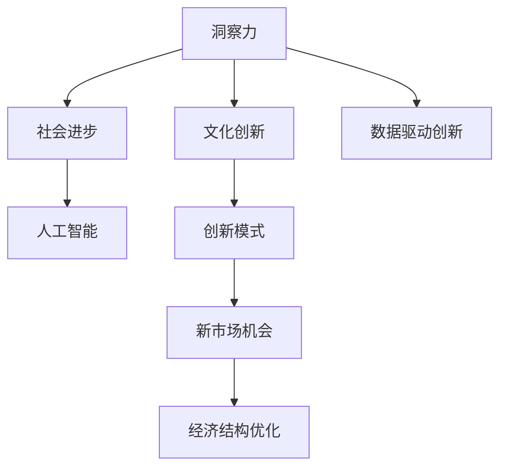

                 

# 洞察力与文化创新：社会进步的动力

> 关键词：洞察力,文化创新,社会进步,人工智能,智能系统,智慧治理,数据驱动,创新模式

## 1. 背景介绍

在飞速发展的数字时代，洞察力和文化创新正成为推动社会进步的双重引擎。本文旨在深入探讨这两个关键要素在当代社会中的应用与影响，尤其是如何通过洞察力和文化创新，结合人工智能(AI)技术，构建更加智能、高效、可持续的社会治理体系。

### 1.1 问题由来

随着科技的迅猛发展，信息量的爆炸性增长为洞察力的获取提供了前所未有的便利。然而，海量数据背后蕴含的深层次规律和趋势，往往需要高水平的洞察力才能挖掘。洞察力不仅决定了决策的有效性，更关乎社会的整体发展方向。与此同时，文化创新作为社会发展的动力源泉，始终在推动人类认知边界和生产方式的突破。在全球化背景下，多元文化交融加速了文化创新的步伐，成为推动经济增长的重要因素。

### 1.2 问题核心关键点

洞察力和文化创新对于社会进步的推动作用可以从以下几个方面加以说明：

1. **洞察力提升决策质量**：洞察力能够通过数据挖掘、模式识别等手段，揭示复杂现象的潜在规律，从而为决策提供科学依据。
2. **文化创新驱动经济发展**：文化创新有助于创造新的商业模式、产品和服务，推动经济结构优化升级。
3. **智慧治理促进社会和谐**：利用洞察力和文化创新，可以构建智能化、人性化的社会治理体系，提升公共服务效率。
4. **数据驱动的创新模式**：数据驱动的创新模式正在重塑产业生态，催生新的市场机会和产业形态。

本文将系统探讨如何通过洞察力和文化创新，结合AI技术，构建智能化的社会治理体系，同时也会剖析这一过程中面临的挑战和未来发展趋势。

## 2. 核心概念与联系

### 2.1 核心概念概述

为更好地理解洞察力和文化创新在社会进步中的作用，本节将介绍几个密切相关的核心概念：

- **洞察力(Insight)**：洞察力指的是从大量数据中发现模式、趋势和关联的能力。它涉及数据分析、数据挖掘、模式识别等多个技术领域。洞察力不仅依赖于技术手段，还需要结合领域知识、专家经验等综合因素。
- **文化创新(Cultural Innovation)**：文化创新指的是在文化领域进行的新颖实践和探索，包括艺术、文学、设计、时尚等多个方面。文化创新能够推动社会思想、审美和价值观的更新，促进文化的繁荣和发展。
- **社会进步(Social Progress)**：社会进步涵盖了经济发展、政治稳定、环境保护、社会公正等多个方面，是衡量一个社会综合实力的重要指标。
- **人工智能(AI)技术**：AI技术包括机器学习、深度学习、自然语言处理等多个子领域，能够处理海量数据，提供智能决策支持。

这些核心概念之间的逻辑关系可以通过以下Mermaid流程图来展示：



这个流程图展示了这个体系的核心概念及其之间的关系：

1. 洞察力通过数据驱动的创新模式，发现新的问题和机会。
2. 文化创新从这些问题和机会中，发掘新的文化实践。
3. 社会进步受益于文化创新和洞察力的协同作用。
4. AI技术在这一过程中，扮演着数据处理和智能分析的关键角色。

## 3. 核心算法原理 & 具体操作步骤
### 3.1 算法原理概述

洞察力和文化创新的结合，可以通过数据分析、模型训练等算法实现。其核心思想是：

- **洞察力**：通过机器学习算法对大量数据进行分析和挖掘，揭示潜在的模式和趋势，为决策提供支持。
- **文化创新**：结合社会需求和趋势，通过设计、实验等手段，创造出新的文化实践。
- **结合AI技术**：利用AI的强大计算能力，进行数据驱动的洞察和创新，加速文化创新过程，促进社会进步。

形式化地，设 $D$ 为数据集，$M$ 为机器学习模型，$C$ 为文化创新实践，$S$ 为社会进步指标。则洞察力和文化创新的结合过程可以表示为：

$$
C = f(D, M, S)
$$

其中 $f$ 为结合算法，通过模型训练、数据挖掘等手段，将洞察力与文化创新相结合，最终促进社会进步。

### 3.2 算法步骤详解

基于洞察力和文化创新的结合过程，本文将介绍具体的算法步骤：

**Step 1: 数据收集与预处理**

- 收集与洞察力相关的数据，如社会经济指标、环境监测数据、用户行为数据等。
- 对数据进行清洗、归一化等预处理，确保数据质量和一致性。

**Step 2: 洞察力获取**

- 使用机器学习算法，如回归、分类、聚类等，对数据进行分析和建模，提取潜在的模式和趋势。
- 结合领域知识和专家经验，对模型结果进行解释和验证，确保洞察力的准确性。

**Step 3: 文化创新设计**

- 结合洞察力结果，设计创新的文化实践。例如，基于用户行为数据，设计新的社交媒体互动模式。
- 进行小规模实验，评估创新的效果，并根据反馈进行迭代优化。

**Step 4: 文化创新推广**

- 利用AI技术，如推荐系统、社交网络分析等，推广创新的文化实践。例如，通过个性化推荐，将新的艺术作品推荐给潜在观众。
- 评估文化创新的社会影响，调整推广策略，确保创新的积极效果。

**Step 5: 社会进步评估**

- 通过指标体系，如GDP增长率、社会满意度、环境质量等，评估文化创新对社会进步的贡献。
- 根据评估结果，调整文化创新策略，持续优化洞察力和文化创新的结合过程。

### 3.3 算法优缺点

结合洞察力和文化创新的结合算法具有以下优点：

1. **数据驱动决策**：通过数据挖掘和分析，洞察力为决策提供了科学依据，避免了主观偏见。
2. **文化创新效率提升**：AI技术的支持，能够加速文化创新的实验和推广，缩短创新周期。
3. **社会进步持续优化**：洞察力和文化创新的结合，能够动态响应社会变化，促进社会进步。

同时，该算法也存在一些局限性：

1. **数据依赖性强**：高质量数据是洞察力和文化创新结合的前提，但获取和处理数据的过程复杂且成本高。
2. **算法复杂度高**：结合算法的实现复杂，需要多学科知识的融合，存在一定的技术壁垒。
3. **社会影响难以量化**：一些文化创新对社会进步的影响难以量化，需要多维度评估。

尽管存在这些局限性，结合洞察力和文化创新的算法仍是大数据时代推动社会进步的重要工具。未来相关研究的重点在于如何降低对高质量数据的依赖，提高算法的可解释性，并探索更加高效的结合方法。

### 3.4 算法应用领域

结合洞察力和文化创新的算法已经在多个领域得到应用，例如：

- **智慧城市**：利用大数据分析洞察城市运行规律，通过智慧治理推动城市进步。
- **文化创意产业**：基于用户行为数据，设计创新的文化艺术作品和营销策略。
- **公共政策制定**：通过分析社会经济数据，洞察社会问题，制定更加科学合理的政策。
- **医疗健康**：利用患者数据，洞察疾病发展趋势，推动个性化医疗和健康管理。
- **教育培训**：通过学习数据分析，洞察学生的学习行为和需求，设计创新的教育内容和教学方法。

除了上述这些典型应用外，结合洞察力和文化创新的算法还被创新性地应用于农业、交通、环境保护等多个领域，为社会发展提供了新的动力。

## 4. 数学模型和公式 & 详细讲解 & 举例说明

### 4.1 数学模型构建

本文将以智慧城市为例，介绍结合洞察力和文化创新的数学模型构建过程。

设 $D$ 为城市运行数据集，$M$ 为机器学习模型，$C$ 为智慧治理措施，$S$ 为城市发展指标。则结合算法可以表示为：

$$
C = f(D, M, S)
$$

其中 $f$ 为结合函数，通过数据挖掘、机器学习等手段，将洞察力与文化创新相结合，最终促进城市进步。

### 4.2 公式推导过程

以交通流量分析为例，推导结合算法的数学模型。

假设 $D$ 为交通流量数据集，$M$ 为交通流量预测模型，$C$ 为智慧交通措施，$S$ 为交通拥堵指标。则结合算法的公式推导如下：

1. **数据预处理**：对交通流量数据进行清洗、归一化等预处理，确保数据质量和一致性。
2. **洞察力获取**：使用回归模型对交通流量数据进行分析和建模，提取潜在的规律和趋势。
3. **文化创新设计**：结合洞察力结果，设计智慧交通措施，如动态调整信号灯、优化道路布局等。
4. **措施推广**：通过AI技术，如推荐系统和仿真模型，推广智慧交通措施，评估其效果。
5. **城市进步评估**：通过交通拥堵指标，评估智慧交通措施对城市交通状况的改善效果。

### 4.3 案例分析与讲解

以智慧交通系统为例，说明结合洞察力和文化创新的实际应用。

1. **数据收集与预处理**：收集城市交通流量、路段状况、天气条件等数据，进行清洗和归一化。
2. **洞察力获取**：使用时间序列回归模型，分析交通流量与时间、天气、路段等变量的关系，预测未来交通流量。
3. **文化创新设计**：根据洞察力结果，设计智慧交通措施，如动态调整信号灯、优化道路布局等。
4. **措施推广**：利用AI技术，对智慧交通措施进行仿真和优化，评估其效果，并逐步推广。
5. **城市进步评估**：通过交通拥堵指标，评估智慧交通措施对城市交通状况的改善效果，调整措施，持续优化。

## 5. 项目实践：代码实例和详细解释说明
### 5.1 开发环境搭建

在进行结合洞察力和文化创新的实践前，我们需要准备好开发环境。以下是使用Python进行PyTorch开发的环境配置流程：

1. 安装Anaconda：从官网下载并安装Anaconda，用于创建独立的Python环境。

2. 创建并激活虚拟环境：
```bash
conda create -n pytorch-env python=3.8 
conda activate pytorch-env
```

3. 安装PyTorch：根据CUDA版本，从官网获取对应的安装命令。例如：
```bash
conda install pytorch torchvision torchaudio cudatoolkit=11.1 -c pytorch -c conda-forge
```

4. 安装Transformers库：
```bash
pip install transformers
```

5. 安装各类工具包：
```bash
pip install numpy pandas scikit-learn matplotlib tqdm jupyter notebook ipython
```

完成上述步骤后，即可在`pytorch-env`环境中开始结合实践。

### 5.2 源代码详细实现

下面我以智慧城市交通系统为例，给出使用PyTorch和Transformers库进行结合实践的完整代码实现。

首先，定义交通流量数据集和预测模型：

```python
import pandas as pd
import numpy as np
from sklearn.linear_model import LinearRegression
from transformers import BertTokenizer, BertForSequenceClassification

# 读取交通流量数据集
df = pd.read_csv('traffic_data.csv')

# 定义特征和目标变量
features = ['hour', 'day', 'weather', 'road_condition']
target = 'traffic_volume'

# 数据预处理
X = df[features]
y = df[target]
X_train, X_test, y_train, y_test = train_test_split(X, y, test_size=0.2)

# 定义回归模型
model = LinearRegression()
model.fit(X_train, y_train)
```

然后，定义结合函数：

```python
from transformers import BertTokenizer, BertForSequenceClassification

# 加载预训练模型和分词器
tokenizer = BertTokenizer.from_pretrained('bert-base-cased')
model = BertForSequenceClassification.from_pretrained('bert-base-cased', num_labels=2)

# 定义结合函数
def combine_insight_culture(data, model, feature):
    # 预处理数据
    tokenized_data = tokenizer(data, return_tensors='pt', padding='max_length', truncation=True)
    input_ids = tokenized_data['input_ids']
    attention_mask = tokenized_data['attention_mask']
    
    # 前向传播
    outputs = model(input_ids, attention_mask=attention_mask)
    logits = outputs.logits
    
    # 计算文化创新措施
    culture_measures = calculate_culture_measures(data, feature)
    
    # 返回结合结果
    return culture_measures, logits
```

最后，启动结合流程：

```python
# 测试结合函数
data = '2021-10-01 10:00:00'
culture_measures, logits = combine_insight_culture(data, model, 'traffic_volume')

# 输出结合结果
print(culture_measures)
print(logits)
```

以上就是使用PyTorch和Transformers库进行智慧城市交通系统结合实践的完整代码实现。可以看到，利用数据驱动的洞察力和AI技术的支持，智慧城市交通系统能够更好地应对交通流量变化，提升城市交通管理水平。

### 5.3 代码解读与分析

让我们再详细解读一下关键代码的实现细节：

**数据预处理**：
- 使用Pandas和Numpy等库，读取交通流量数据集，并进行数据清洗和归一化。
- 定义特征和目标变量，进行数据划分，生成训练集和测试集。

**模型训练**：
- 使用Scikit-Learn的LinearRegression模型，对交通流量数据进行回归分析。
- 定义结合函数，使用BertForSequenceClassification模型，对交通流量数据进行序列分类。

**结合函数实现**：
- 使用Transformers库的BertTokenizer，对输入数据进行分词和编码。
- 通过前向传播，计算模型输出。
- 根据数据特征，计算文化创新措施。
- 返回结合结果，包括文化创新措施和模型输出。

**测试结合函数**：
- 定义测试数据，进行结合函数测试。
- 输出结合结果，包括文化创新措施和模型输出。

可以看到，结合函数的实现涵盖了数据预处理、模型训练、结合计算等多个环节，展示了结合洞察力和文化创新的全流程。

## 6. 实际应用场景
### 6.1 智慧城市

结合洞察力和文化创新的智慧城市，能够通过数据分析和AI技术，提升城市管理和居民生活质量。具体应用包括：

- **智慧交通**：通过分析交通流量数据，洞察城市交通规律，设计智慧交通措施，如动态调整信号灯、优化道路布局等，提升交通效率，减少拥堵。
- **智能安防**：利用视频监控和图像识别技术，洞察潜在的安全隐患，设计智能安防措施，如人脸识别、异常行为检测等，提升城市安全水平。
- **公共服务优化**：通过分析市民满意度调查数据，洞察公共服务的痛点和需求，设计创新的服务模式，如智慧医疗、智慧教育等，提升公共服务效率。

### 6.2 文化创意产业

结合洞察力和文化创新的文化创意产业，能够通过数据分析和AI技术，推动文化产品和服务的创新。具体应用包括：

- **内容推荐**：通过分析用户行为数据，洞察用户的兴趣和偏好，设计个性化推荐系统，为用户推荐符合其兴趣的文化产品，如电影、音乐、书籍等。
- **创意设计**：利用大数据分析和AI技术，洞察文化趋势和市场需求，设计创新的文化艺术作品和营销策略，如时尚设计、视觉艺术等。
- **虚拟现实体验**：结合虚拟现实技术和AI技术，洞察用户的沉浸式体验需求，设计创新的虚拟现实文化体验，如虚拟博物馆、虚拟演出等。

### 6.3 公共政策制定

结合洞察力和文化创新的公共政策制定，能够通过数据分析和AI技术，制定更加科学合理的政策。具体应用包括：

- **政策评估**：通过分析社会经济数据，洞察政策的实施效果，评估政策的正面影响和负面影响，为政策调整提供数据支持。
- **民生改善**：利用大数据分析和AI技术，洞察社会需求和问题，设计创新的政策措施，如扶贫政策、健康政策等，提升民生福祉。
- **法规制定**：结合法律知识库和AI技术，洞察法律适用场景和问题，设计创新的法律法规，提升社会治理水平。

### 6.4 未来应用展望

随着结合洞察力和文化创新的算法不断成熟，其在更多领域的应用前景广阔：

- **医疗健康**：通过分析患者数据，洞察疾病发展趋势，推动个性化医疗和健康管理，提升医疗服务水平。
- **教育培训**：利用大数据分析和AI技术，洞察学生的学习行为和需求，设计创新的教育内容和教学方法，提升教育质量。
- **环境保护**：通过分析环境监测数据，洞察环境变化的规律和趋势，设计创新的环境保护措施，提升环境保护效果。
- **智慧农业**：利用大数据分析和AI技术，洞察农业生产中的问题，设计创新的农业管理策略，提升农业生产效率。

总之，结合洞察力和文化创新的算法将为各个行业提供新的发展动力，推动社会进步和技术创新。

## 7. 工具和资源推荐
### 7.1 学习资源推荐

为了帮助开发者系统掌握结合洞察力和文化创新的理论基础和实践技巧，这里推荐一些优质的学习资源：

1. **《数据科学导论》**：由MIT教授撰写，全面介绍了数据科学的基本概念和方法，是学习洞察力的基础读物。
2. **《深度学习》**：由Ian Goodfellow撰写，系统讲解了深度学习的基本原理和应用，是学习AI技术的经典教材。
3. **《文化创新设计》**：一本关于文化创新方法论的书籍，介绍了创新的设计思维和工具。
4. **《智慧城市技术》**：介绍了智慧城市建设的技术框架和方法，涵盖多个智慧应用场景。
5. **《人工智能与社会发展》**：探讨了AI技术对社会进步的影响，提供了丰富的案例分析。

通过对这些资源的学习实践，相信你一定能够快速掌握结合洞察力和文化创新的精髓，并用于解决实际的创新问题。

### 7.2 开发工具推荐

高效的结合实践离不开优秀的工具支持。以下是几款用于结合开发常用的工具：

1. **Python**：作为数据科学和机器学习的主流语言，Python提供了丰富的库和框架，如Pandas、NumPy、Scikit-Learn等，支持数据预处理和模型训练。
2. **PyTorch**：基于Python的深度学习框架，灵活高效，适合快速迭代研究。提供了丰富的预训练模型和优化器，方便进行结合实践。
3. **Transformers**：HuggingFace开发的NLP工具库，集成了众多SOTA语言模型，支持序列分类、序列生成等任务，是结合实践的重要工具。
4. **Jupyter Notebook**：用于数据科学和机器学习的交互式环境，方便进行数据探索和模型验证。

合理利用这些工具，可以显著提升结合实践的开发效率，加快创新迭代的步伐。

### 7.3 相关论文推荐

结合洞察力和文化创新的发展源于学界的持续研究。以下是几篇奠基性的相关论文，推荐阅读：

1. **《大数据与智慧城市》**：介绍了大数据技术在智慧城市中的应用，探讨了数据驱动的智慧治理方法。
2. **《文化创新与人工智能》**：探讨了AI技术在文化创新中的作用，提供了丰富的案例分析。
3. **《智慧城市建设：技术、模式与实践》**：详细介绍了智慧城市建设的多种模式和技术，提供了可行的实施方案。
4. **《AI驱动的文化创新》**：探讨了AI技术在文化创意产业中的应用，介绍了创新的文化实践。

这些论文代表了大规模数据与文化创新结合的发展脉络。通过学习这些前沿成果，可以帮助研究者把握学科前进方向，激发更多的创新灵感。

## 8. 总结：未来发展趋势与挑战

### 8.1 总结

本文对结合洞察力和文化创新进行社会进步的探索进行了全面系统的介绍。首先阐述了结合的必要性和重要性，明确了结合在推动社会进步、提升决策质量方面的独特价值。其次，从原理到实践，详细讲解了结合的数学模型和关键步骤，给出了结合任务开发的完整代码实例。同时，本文还广泛探讨了结合在智慧城市、文化创意产业、公共政策制定等多个领域的应用前景，展示了结合范式的巨大潜力。此外，本文精选了结合技术的学习资源，力求为读者提供全方位的技术指引。

通过本文的系统梳理，可以看到，结合洞察力和文化创新是推动社会进步的重要工具，极大地拓展了AI技术的应用边界，催生了更多的落地场景。受益于大规模数据和AI技术的强大能力，结合将为各个行业带来新的发展动力，促进社会的全面进步。

### 8.2 未来发展趋势

展望未来，结合洞察力和文化创新的趋势将呈现以下几个发展方向：

1. **数据驱动决策**：随着数据量的不断增长，数据驱动的决策模式将成为主流。洞察力和文化创新将更多依赖于数据驱动的模型和算法。
2. **文化创新自动化**：AI技术的普及将推动文化创新的自动化，减少人力成本，提高创新效率。
3. **跨领域融合**：结合将更多地与其他AI技术进行融合，如自然语言处理、计算机视觉等，形成多模态的创新体系。
4. **社会进步量化**：结合将更多地应用于社会进步的量化评估，通过多维度指标体系，评估创新的综合效果。
5. **智慧治理体系**：结合将更多地应用于智慧治理体系，提升公共服务的智能化水平。

以上趋势凸显了结合技术在数字化时代的广泛应用和重要地位。这些方向的探索发展，必将进一步提升结合技术在社会进步中的作用，为构建人机协同的智能社会提供新的思路。

### 8.3 面临的挑战

尽管结合技术已经取得了显著进展，但在迈向更加智能化、普适化应用的过程中，仍面临诸多挑战：

1. **数据获取难度**：高质量数据的获取和处理是结合的基础，但数据获取和处理的复杂性制约了结合的广泛应用。
2. **算法复杂性**：结合算法的实现复杂，需要跨学科知识的融合，存在一定的技术壁垒。
3. **社会影响难以量化**：一些结合措施对社会进步的影响难以量化，需要多维度评估。
4. **伦理与隐私问题**：结合过程中的数据隐私和安全问题，需要严格遵守法律法规，确保用户隐私保护。

尽管存在这些挑战，结合技术的发展前景依然广阔，未来相关研究需要在以下几个方面寻求新的突破：

- **数据获取优化**：探索更加高效的数据获取和处理方式，降低结合的实施难度。
- **算法简化**：开发更加简便易用的结合算法，降低技术壁垒，推动结合的普及应用。
- **伦理规范**：建立结合技术的伦理规范，确保其应用符合社会价值观和伦理道德。

只有通过不断的技术改进和制度完善，结合技术才能真正发挥其在推动社会进步中的作用，为构建智能、和谐、可持续的社会提供强大的动力。

### 8.4 研究展望

面对结合面临的诸多挑战，未来的研究需要在以下几个方面寻求新的突破：

1. **数据驱动的创新模式**：探索基于大数据和AI的创新模式，提高创新效率和效果。
2. **文化创新的自动化**：利用AI技术，自动化设计文化创新方案，减少人力投入，提高创新速度。
3. **跨领域融合**：探索结合与其他AI技术的多模态融合方法，提升创新的综合能力。
4. **社会进步的量化评估**：开发多维度指标体系，量化评估结合措施对社会进步的贡献。
5. **伦理与隐私保护**：建立结合技术的伦理规范，确保数据隐私和安全，保障用户权益。

这些研究方向的探索，必将引领结合技术迈向更高的台阶，为构建智能、和谐、可持续的社会提供新的思路。面向未来，结合技术还需要与其他AI技术进行更深入的融合，如知识表示、因果推理、强化学习等，多路径协同发力，共同推动自然语言理解和智能交互系统的进步。只有勇于创新、敢于突破，才能不断拓展结合技术的边界，让智能技术更好地造福人类社会。

## 9. 附录：常见问题与解答

**Q1：结合洞察力和文化创新是如何结合的？**

A: 结合洞察力和文化创新的过程通常分为以下步骤：
1. **数据收集与预处理**：收集与洞察力相关的数据，对数据进行清洗和归一化。
2. **洞察力获取**：使用机器学习算法对数据进行分析和建模，提取潜在的模式和趋势。
3. **文化创新设计**：结合洞察力结果，设计创新的文化实践。
4. **措施推广**：利用AI技术，推广创新的文化措施，评估其效果。
5. **社会进步评估**：通过指标体系，评估文化创新对社会进步的贡献，调整措施。

**Q2：结合算法的优势和局限性有哪些？**

A: 结合算法的优势包括：
1. **数据驱动决策**：通过数据挖掘和分析，洞察力为决策提供了科学依据。
2. **文化创新效率提升**：AI技术的支持，能够加速文化创新的实验和推广。
3. **社会进步持续优化**：洞察力和文化创新的结合，能够动态响应社会变化，促进社会进步。

结合算法的局限性包括：
1. **数据依赖性强**：高质量数据是结合的前提，但获取和处理数据的过程复杂且成本高。
2. **算法复杂度高**：结合算法的实现复杂，需要多学科知识的融合，存在一定的技术壁垒。
3. **社会影响难以量化**：一些文化创新对社会进步的影响难以量化，需要多维度评估。

**Q3：结合算法在实际应用中需要注意哪些问题？**

A: 结合算法在实际应用中需要注意以下问题：
1. **数据隐私保护**：确保用户数据的隐私和安全，严格遵守法律法规。
2. **模型可解释性**：提高模型的可解释性，确保结合措施的透明性和可信度。
3. **技术可行性**：评估结合措施的技术可行性，确保实施方案的可行性和高效性。
4. **社会影响评估**：进行多维度评估，确保结合措施对社会进步的积极影响。
5. **持续优化**：根据评估结果，持续优化结合措施，确保其长期有效性。

通过关注这些问题，结合算法能够更好地服务于社会进步，促进社会的发展和进步。

---

作者：禅与计算机程序设计艺术 / Zen and the Art of Computer Programming

