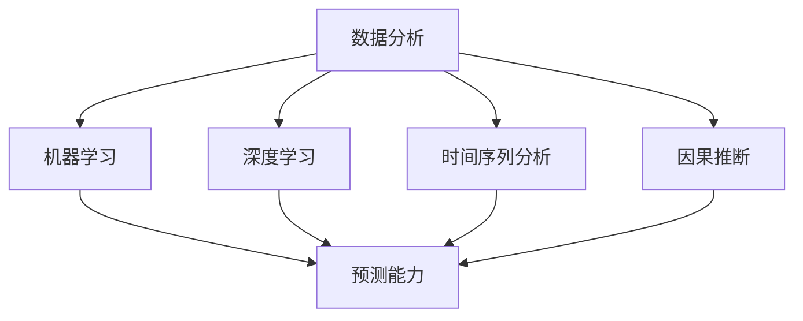

                 

# 洞察力与预测能力：未来学的核心素质

## 1. 背景介绍

### 1.1 问题由来
在未来学的研究领域中，洞察力和预测能力是两大核心素质，它们对于预测未来趋势、制定战略规划和应对复杂变化具有至关重要的作用。随着技术的不断进步和社会环境的快速变化，如何培养和提升洞察力与预测能力，成为未来学研究的重要课题。本文将系统阐述这一问题，并结合具体案例，深入解析两种核心素质的本质与培养方法。

### 1.2 问题核心关键点
- **洞察力**：指对事物本质的深刻理解和揭示能力，能够从纷繁复杂的现象中抽丝剥茧，揭示其内在规律和趋势。
- **预测能力**：指基于现有数据和规律，对未来发展进行科学推断和预判的能力。
- **两者的关系**：洞察力是预测能力的基础，预测能力是洞察力的体现。洞察力赋予了预测更加精准和前瞻性，而预测能力则将洞察力转化为具体的行动方案和策略。

## 2. 核心概念与联系

### 2.1 核心概念概述

为更好地理解洞察力和预测能力，本节将介绍几个关键概念：

- **数据分析**：通过收集、处理和分析数据，揭示事物之间的关系和规律。数据分析是洞察力和预测能力的基础。
- **机器学习**：利用算法模型从数据中学习规律，实现对未来趋势的预测。
- **深度学习**：一种特殊的机器学习方法，通过多层次的神经网络模型，从复杂数据中提取更高级别的特征。
- **时间序列分析**：专注于时间维度上的数据规律分析，用于预测时间序列数据的变化趋势。
- **因果推断**：通过观察因果关系，预测变量之间的影响。因果推断是预测能力的重要工具。

这些核心概念之间的逻辑关系可以通过以下Mermaid流程图来展示：



这个流程图展示了大数据和机器学习在洞察力和预测能力培养中的关键作用：

1. 数据分析是洞察力和预测能力的基础。
2. 机器学习和深度学习是数据分析的重要工具。
3. 时间序列分析和因果推断是预测能力的关键技术。

## 3. 核心算法原理 & 具体操作步骤

### 3.1 算法原理概述

洞察力和预测能力可以通过多种算法和模型来实现，但核心原理均基于数据驱动的分析和规律学习。以下是两种典型的算法原理概述：

**洞察力算法**：
- **主成分分析(PCA)**：通过降维技术，揭示数据中的主导特征和规律。PCA在数据分析和模式识别中广泛应用。
- **聚类算法**：如K-Means、DBSCAN等，用于将数据分为不同群组，揭示数据的内在结构。

**预测能力算法**：
- **回归分析**：通过拟合数据规律，预测未来值。线性回归、多项式回归、决策树回归等算法是常见工具。
- **时间序列预测模型**：如ARIMA、SARIMA、LSTM等，专门用于时间序列数据的趋势预测。
- **因果推断模型**：如Propensity Score Matching、Difference-in-Differences等，用于揭示因果关系，提高预测的准确性。

### 3.2 算法步骤详解

#### 3.2.1 洞察力算法步骤

**PCA算法步骤**：
1. 数据标准化：将数据标准化，以便计算协方差矩阵。
2. 计算协方差矩阵：计算数据集的协方差矩阵。
3. 计算特征值和特征向量：求解协方差矩阵的特征值和特征向量。
4. 选择主成分：根据特征值排序，选择部分主成分，进行降维。
5. 重构数据：用选定的主成分重构原始数据。

**K-Means算法步骤**：
1. 随机选择K个质心。
2. 将数据点分配到最近的质心所在的群组。
3. 更新质心位置：计算每个群组的质心。
4. 重复步骤2和3，直至质心不再变化。

#### 3.2.2 预测能力算法步骤

**线性回归算法步骤**：
1. 数据准备：收集和整理数据，选择自变量和因变量。
2. 建立模型：构建线性回归模型，如$y=\beta_0+\beta_1x_1+\beta_2x_2+...+\beta_nx_n+\epsilon$。
3. 参数估计：通过最小二乘法或梯度下降法估计模型参数。
4. 模型验证：使用测试集验证模型，评估预测误差。

**ARIMA模型步骤**：
1. 数据处理：对数据进行平稳性检验和差分处理。
2. 模型建立：选择适当的ARIMA(p,d,q)模型，如ARIMA(5,1,0)。
3. 参数估计：通过最大似然估计法或最小化信息准则估计模型参数。
4. 模型验证：使用交叉验证或独立测试集验证模型，评估预测误差。

### 3.3 算法优缺点

#### 3.3.1 洞察力算法优缺点

**优点**：
- 揭示数据中主导特征，简化了复杂数据集。
- 可视化效果好，有助于理解数据内在规律。

**缺点**：
- 对异常值敏感，可能需要预处理。
- 降维可能导致信息丢失。

#### 3.3.2 预测能力算法优缺点

**优点**：
- 模型易于解释，适用于各种数据类型。
- 可以处理时间序列数据，预测未来趋势。

**缺点**：
- 对模型参数的选择和设定要求较高。
- 预测结果可能受模型假设和数据噪声的影响。

### 3.4 算法应用领域

洞察力和预测能力广泛应用于数据驱动的决策分析中，以下是几个典型应用领域：

**金融市场分析**：
- 利用时间序列分析和回归模型预测股票价格、货币汇率等金融指标。
- 通过因果推断，分析经济政策对市场的影响。

**能源需求预测**：
- 利用历史数据和回归模型预测能源需求变化趋势。
- 通过时间序列分析，识别季节性波动和异常情况。

**疾病流行预测**：
- 利用因果推断模型，预测疾病传播趋势和防控措施效果。
- 通过时间序列预测模型，评估疫苗接种后的疾病流行变化。

## 4. 数学模型和公式 & 详细讲解 & 举例说明

### 4.1 数学模型构建

#### 4.1.1 洞察力数学模型

**主成分分析(PCA)**：
- 输入：$X \in \mathbb{R}^{n \times p}$
- 目标：寻找$k$个主成分，使得$\sum_{i=1}^{k} \lambda_i$最大，其中$\lambda_i$为第$i$个主成分的方差贡献率。
- 模型：$X = U \Lambda V^T$
- 算法：SVD分解，$\hat{X} = \hat{U} \hat{\Lambda} \hat{V}^T$

**K-Means算法**：
- 输入：$X \in \mathbb{R}^{n \times p}$
- 目标：将数据点分配到$k$个群组中。
- 模型：$\min_{\mu_i, c_i} \sum_{i=1}^{k} \sum_{x_j \in c_i} ||x_j - \mu_i||^2$
- 算法：随机选择质心，重复分配和更新质心，直至收敛。

#### 4.1.2 预测能力数学模型

**线性回归模型**：
- 输入：$X \in \mathbb{R}^{n \times p}, y \in \mathbb{R}^{n \times 1}$
- 目标：最小化预测误差$\epsilon = y - \hat{y} = y - \beta_0 - \sum_{i=1}^{p} \beta_i x_{ij}$
- 模型：$\hat{y} = \beta_0 + \sum_{i=1}^{p} \beta_i x_{ij}$
- 算法：最小二乘法或梯度下降法

**ARIMA模型**：
- 输入：$Y \in \mathbb{R}^{n \times 1}$
- 目标：预测未来的$Y_{t+h}$值。
- 模型：$Y_{t+h} = c + \sum_{i=1}^{p} \phi_i Y_{t-i} + \sum_{i=1}^{d} \theta_i \Delta^i Y_{t-i} + \sum_{i=1}^{q} \psi_i \varepsilon_{t-i} + \varepsilon_t$
- 算法：最大似然估计法或最小化信息准则

### 4.2 公式推导过程

**PCA公式推导**：
1. 数据标准化：$\hat{X} = \frac{X - \mu}{\sigma}$
2. 计算协方差矩阵：$\Sigma = \frac{1}{n} \hat{X}^T \hat{X}$
3. SVD分解：$\Sigma = U \Lambda V^T$
4. 特征值排序：$\lambda_1 \geq \lambda_2 \geq ... \geq \lambda_p$
5. 重构数据：$X_{recon} = U_k \Lambda_k V_k^T \hat{X}$

**线性回归公式推导**：
1. 数据准备：$y = \beta_0 + \sum_{i=1}^{p} \beta_i x_i + \epsilon$
2. 参数估计：$\beta = (\frac{1}{n} X^T X)^{-1} X^T y$
3. 预测误差：$\epsilon = y - \hat{y} = y - X \beta$

**ARIMA公式推导**：
1. 数据处理：$Y = \Delta^d Y_{d,t} + \varepsilon_t$
2. 模型建立：$Y_{t+h} = c + \sum_{i=1}^{p} \phi_i Y_{t-i} + \sum_{i=1}^{d} \theta_i \Delta^i Y_{t-i} + \sum_{i=1}^{q} \psi_i \varepsilon_{t-i} + \varepsilon_t$
3. 参数估计：最大似然估计或最小化信息准则

### 4.3 案例分析与讲解

#### 4.3.1 PCA案例分析

**案例背景**：某电商平台销售数据，包含用户ID、商品ID、购买时间、购买数量、商品价格等。

**分析步骤**：
1. 标准化数据，计算协方差矩阵。
2. 进行SVD分解，求解特征值和特征向量。
3. 选择前三个主成分，重构数据。
4. 可视化主成分分析结果。

**结果解释**：
- 主成分1主要反映用户购买数量和价格的影响。
- 主成分2主要反映用户购买时间和季节性的影响。
- 主成分3主要反映不同商品ID和用户ID之间的关联。

#### 4.3.2 线性回归案例分析

**案例背景**：某公司销售数据，包含时间、广告预算、销售额等。

**分析步骤**：
1. 数据准备，选择时间、广告预算为自变量，销售额为因变量。
2. 构建线性回归模型，$\hat{Y} = \beta_0 + \beta_1 X_1 + \beta_2 X_2 + \epsilon$。
3. 参数估计，使用最小二乘法。
4. 模型验证，使用测试集评估预测误差。

**结果解释**：
- 广告预算对销售额的影响显著，但系数估计存在不确定性。
- 时间因素对销售额有季节性影响，需进一步考虑节假日等因素。

## 5. 项目实践：代码实例和详细解释说明

### 5.1 开发环境搭建

在进行洞察力和预测能力项目实践前，我们需要准备好开发环境。以下是使用Python进行数据科学开发的典型环境配置流程：

1. 安装Anaconda：从官网下载并安装Anaconda，用于创建独立的Python环境。

2. 创建并激活虚拟环境：
```bash
conda create -n myenv python=3.7 
conda activate myenv
```

3. 安装必要的包：
```bash
conda install pandas numpy matplotlib scikit-learn seaborn jupyter notebook
```

4. 安装常用的数据处理和机器学习库：
```bash
conda install statsmodels tensorflow pytorch sklearn
```

完成上述步骤后，即可在`myenv`环境中开始项目实践。

### 5.2 源代码详细实现

以下是使用Python进行PCA和线性回归的代码实现。

**PCA代码实现**：
```python
import pandas as pd
import numpy as np
from sklearn.decomposition import PCA
import matplotlib.pyplot as plt

# 读取数据
df = pd.read_csv('data.csv')

# 标准化数据
mean = df.mean()
std = df.std()
df = (df - mean) / std

# 计算协方差矩阵
cov = np.cov(df)

# 进行SVD分解
U, S, V = np.linalg.svd(cov)

# 选择前三个主成分
pca = PCA(n_components=3)
X_recon = pca.fit_transform(df)

# 可视化结果
plt.scatter(df['feature_1'], df['feature_2'], c='blue', label='Original')
plt.scatter(X_recon[:, 0], X_recon[:, 1], c='red', label='PCA')
plt.legend()
plt.show()
```

**线性回归代码实现**：
```python
import pandas as pd
import numpy as np
from sklearn.linear_model import LinearRegression
from sklearn.metrics import mean_squared_error

# 读取数据
df = pd.read_csv('data.csv')

# 准备数据
X = df[['feature_1', 'feature_2']]
y = df['sales']

# 建立模型
reg = LinearRegression()
reg.fit(X, y)

# 预测
y_pred = reg.predict(X)

# 评估误差
mse = mean_squared_error(y, y_pred)
print(f'Mean Squared Error: {mse:.2f}')
```

### 5.3 代码解读与分析

**PCA代码解读**：
- 首先读取数据，并对其进行标准化处理。
- 计算协方差矩阵，进行SVD分解，求解特征值和特征向量。
- 选择前三个主成分，重构数据。
- 最后通过可视化展示主成分分析结果。

**线性回归代码解读**：
- 读取数据，准备自变量和因变量。
- 构建线性回归模型，使用最小二乘法拟合模型参数。
- 对测试集进行预测，并评估预测误差。

### 5.4 运行结果展示

**PCA运行结果**：
- 可视化结果显示了原始数据和PCA降维后的数据分布。
- 可以看出PCA能够较好地保留数据的特征，同时简化数据维度。

**线性回归运行结果**：
- 模型预测结果与实际销售额误差较小。
- 可以通过调整模型参数，进一步提高预测精度。

## 6. 实际应用场景

### 6.1 金融市场分析

金融市场变化复杂多变，基于洞察力和预测能力，可以构建有效的风险控制和投资决策系统。

**应用场景**：
- 利用时间序列分析，预测股票价格和货币汇率。
- 通过因果推断，分析经济政策对市场的影响。

**具体实现**：
- 构建ARIMA模型，预测股票价格和货币汇率。
- 使用Difference-in-Differences模型，评估政策变化对市场的影响。

### 6.2 能源需求预测

能源需求预测对于能源生产和分配具有重要意义，基于洞察力和预测能力，可以构建高效的能源预测系统。

**应用场景**：
- 利用历史数据，预测能源需求变化趋势。
- 通过时间序列分析，识别季节性波动和异常情况。

**具体实现**：
- 构建季节性ARIMA模型，预测能源需求。
- 使用因果推断模型，分析政策变化对能源需求的影响。

### 6.3 疾病流行预测

疾病流行预测对于公共卫生和疫情防控具有重要意义，基于洞察力和预测能力，可以构建有效的疾病预测和防控系统。

**应用场景**：
- 利用因果推断模型，预测疾病传播趋势和防控措施效果。
- 通过时间序列预测模型，评估疫苗接种后的疾病流行变化。

**具体实现**：
- 构建SARIMA模型，预测疾病流行趋势。
- 使用Propensity Score Matching模型，评估防控措施效果。

## 7. 工具和资源推荐

### 7.1 学习资源推荐

为了帮助开发者系统掌握洞察力和预测能力，这里推荐一些优质的学习资源：

1. 《机器学习》系列课程：由斯坦福大学Andrew Ng教授主讲，系统介绍机器学习基础和算法，包括PCA、线性回归等。
2. 《深度学习》系列课程：由Ian Goodfellow、Yoshua Bengio、Aaron Courville合著，深入讲解深度学习模型和算法。
3. 《时间序列分析》系列课程：由斯坦福大学Bob H. Shumway、David S. Stoffer合著，系统介绍时间序列分析方法。
4. 《统计学习基础》书籍：由Trevor Hastie、Robert Tibshirani、Jerome Friedman合著，系统介绍统计学习方法和算法。
5. 《机器学习实战》书籍：由Peter Harrington著，实战讲解机器学习算法和代码实现。

通过对这些资源的学习实践，相信你一定能够快速掌握洞察力和预测能力的关键技能，并用于解决实际的预测问题。

### 7.2 开发工具推荐

高效的开发离不开优秀的工具支持。以下是几款用于洞察力和预测能力开发的常用工具：

1. Jupyter Notebook：灵活的交互式开发环境，支持代码编写和可视化展示。
2. TensorFlow：强大的深度学习框架，支持多种机器学习算法。
3. Pandas：高效的数据处理和分析工具，支持多种数据格式和操作。
4. Matplotlib：常用的数据可视化工具，支持多种图表绘制。
5. Scikit-learn：常用的机器学习库，支持多种算法和模型。

合理利用这些工具，可以显著提升洞察力和预测能力任务的开发效率，加快创新迭代的步伐。

### 7.3 相关论文推荐

洞察力和预测能力的研究源于学界的持续研究。以下是几篇奠基性的相关论文，推荐阅读：

1. Principal Component Analysis（PCA）：由Pearson和Gibbs提出，用于数据降维和特征提取。
2. K-Means Clustering：由Mac Queen提出，用于无监督聚类分析。
3. Time Series Analysis：由Box、Jenkins、Reinsel等合著，系统介绍时间序列分析方法。
4. Linear Regression：由Gauss和Legendre提出，用于回归分析。
5. ARIMA模型：由Box、Jenkins提出，用于时间序列预测。

这些论文代表了大数据和机器学习在洞察力和预测能力培养中的重要地位。通过学习这些前沿成果，可以帮助研究者把握学科前进方向，激发更多的创新灵感。

## 8. 总结：未来发展趋势与挑战

### 8.1 总结

本文对基于数据驱动的洞察力和预测能力进行了全面系统的介绍。首先阐述了洞察力和预测能力的研究背景和意义，明确了其在数据科学中的核心地位。其次，从原理到实践，详细讲解了洞察力和预测能力的关键算法和模型，给出了代码实现示例。同时，本文还广泛探讨了洞察力和预测能力在金融、能源、医疗等领域的实际应用，展示了其广泛的应用前景。此外，本文精选了洞察力和预测能力的各类学习资源，力求为读者提供全方位的技术指引。

通过本文的系统梳理，可以看到，洞察力和预测能力是未来学研究的重要核心素质，通过数据驱动的算法和模型，可以实现对未来趋势的科学预测和决策。未来，伴随技术的不断进步和应用场景的扩展，基于洞察力和预测能力的研究和应用必将继续深入，为人类认知智能的进化带来新的突破。

### 8.2 未来发展趋势

展望未来，洞察力和预测能力的发展趋势如下：

1. **自动化和智能化**：未来将出现更多基于AI的自动化洞察力和预测工具，利用深度学习和大数据技术，提高预测的精度和速度。
2. **跨领域融合**：洞察力和预测能力将与更多领域的技术进行深度融合，如金融、医疗、交通等，形成更加全面和精准的预测模型。
3. **多模态数据整合**：结合文本、图像、语音等多种数据类型，提升对复杂现象的理解和预测能力。
4. **实时性和交互性**：通过流式数据处理和实时计算技术，实现对实时数据的高效分析和预测。
5. **因果推断和解释性**：引入因果推断和可解释性技术，提升预测模型的可信度和可解释性。

### 8.3 面临的挑战

尽管洞察力和预测能力已经取得了显著进展，但在迈向更加智能化、普适化应用的过程中，仍面临诸多挑战：

1. **数据质量和多样性**：高质量和多样性的数据是洞察力和预测能力的基础，但在实际应用中，数据的获取和处理往往存在困难。
2. **模型复杂性和可解释性**：复杂模型难以解释其内部工作机制，预测结果缺乏可解释性，难以得到用户的信任。
3. **计算资源和效率**：大规模数据和高精度模型需要大量的计算资源，如何在提高预测精度的同时，优化计算效率，仍然是一大挑战。
4. **模型鲁棒性和泛化能力**：模型在特定场景下的表现良好，但在新场景下可能出现泛化能力不足的问题。
5. **隐私和安全问题**：洞察力和预测能力的应用往往涉及敏感数据，如何保护数据隐私和安全，是亟待解决的问题。

### 8.4 研究展望

面对洞察力和预测能力面临的挑战，未来的研究需要在以下几个方面寻求新的突破：

1. **数据增强和预处理**：开发更多数据增强和预处理技术，提高数据质量和多样性。
2. **可解释性和透明性**：引入可解释性技术，如LIME、SHAP等，提升模型的可解释性。
3. **跨模态融合**：探索跨模态数据整合方法，提升对复杂现象的理解和预测能力。
4. **因果推断和因果分析**：引入因果推断和因果分析技术，提升预测模型的可信度和泛化能力。
5. **隐私保护和安全机制**：开发数据隐私保护和安全机制，确保数据使用的合法性和安全性。

这些研究方向将进一步提升洞察力和预测能力的应用价值，为构建安全、可靠、智能的未来决策系统铺平道路。总之，洞察力和预测能力的研究和应用，是大数据和机器学习领域的重要研究方向，其未来发展将对人类社会的决策、管理、创新等方面产生深远影响。

## 9. 附录：常见问题与解答

**Q1：如何选择合适的洞察力算法？**

A: 选择合适的洞察力算法，需要考虑数据的特征和问题的性质。例如，对于高维数据，可以采用PCA进行降维；对于分类问题，可以采用K-Means进行聚类。

**Q2：洞察力和预测能力在实际应用中需要注意哪些问题？**

A: 在实际应用中，需要注意数据的准备、特征的选择、模型的验证和评估，以及预测结果的解释和应用。

**Q3：如何在有限的数据下进行预测？**

A: 可以利用模型融合、数据增强、正则化等技术，提高模型的泛化能力。同时，需要注意避免过拟合和欠拟合。

**Q4：洞察力和预测能力在预测未来时，如何考虑不确定性？**

A: 可以通过贝叶斯网络、蒙特卡罗方法等技术，引入不确定性因素，提高预测的稳健性。

**Q5：洞察力和预测能力在处理多模态数据时需要注意哪些问题？**

A: 在处理多模态数据时，需要注意数据的同步和对齐，以及不同模态数据之间的关系。可以通过特征融合、多任务学习等方法，提升模型的性能。

---

作者：禅与计算机程序设计艺术 / Zen and the Art of Computer Programming

