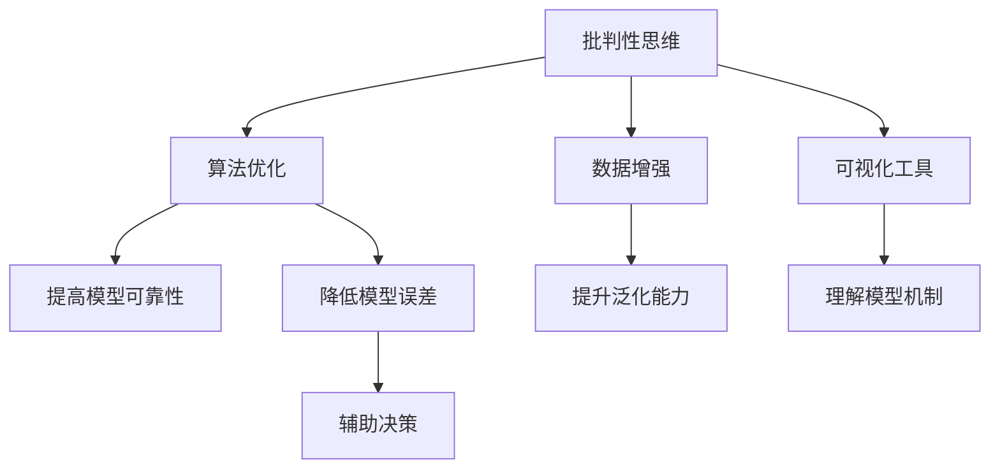

                 

# 洞察力的培养：批判性思维与创造性思维

> 关键词：批判性思维,创造性思维,人工智能,深度学习,算法,决策树,神经网络,可视化工具

## 1. 背景介绍

### 1.1 问题由来

在科技迅猛发展的今天，人工智能(AI)正日益渗透到生活的各个角落，极大地改变了我们的工作、学习和生活方式。与此同时，AI技术也带来了新的挑战和机遇，促使我们反思：如何培养良好的AI洞察力，以便更好地理解和应用这一新兴技术？

批判性思维与创造性思维，作为人类认知的重要能力，对于理解和应用AI至关重要。一方面，批判性思维帮助我们识别和评估AI技术的可靠性与局限性，避免盲目接受其输出结果。另一方面，创造性思维则促使我们能够不断提出新的AI应用场景和解决方案，推动技术创新与进步。因此，本文将从批判性思维与创造性思维的角度出发，探讨如何通过AI技术培养这两种核心能力。

### 1.2 问题核心关键点

本节将明确批判性思维与创造性思维在AI技术中的重要性，以及如何通过技术手段培养和提升这些能力。

- **批判性思维**：指对信息来源、逻辑推理和决策过程进行独立评估与反思的能力。在AI领域，批判性思维尤为重要，能够帮助我们识别算法偏见、模型漏洞，以及AI决策中的潜在风险。

- **创造性思维**：指能够提出新颖、有价值的问题解决方案的能力。在AI应用中，创造性思维可以驱动技术创新，开发出具有实际应用价值的新型AI应用。

- **算法优化**：通过不断优化算法，提高AI模型的性能和可靠性，减少偏见和误差，提升决策的合理性和准确性。

- **数据增强**：通过丰富和扩充数据集，提升模型的泛化能力和泛用性，应对多变的应用场景。

- **可视化工具**：使用可视化工具，增强对模型内部运行机制的理解，辅助进行决策和优化。

这些核心概念之间的关系可以通过以下Mermaid流程图来展示：



这个流程图展示了批判性思维在指导算法优化、数据增强和可视化工具使用中的核心作用，以及这些技术手段如何提升AI模型的性能和可靠性，帮助培养创造性思维，驱动技术创新。

## 2. 核心概念与联系

### 2.1 核心概念概述

为了更好地理解批判性思维与创造性思维在AI技术中的应用，本节将详细介绍这两个核心概念及其相互联系。

- **批判性思维**：涉及逻辑分析、信息筛选、证据评估等方面，是评估和改进AI模型的基础。通过批判性思维，我们可以识别算法偏见、检测模型漏洞，并在必要时提出修正意见。

- **创造性思维**：指的是创新思维、发散思维等方面，是提出新的AI应用场景和解决方案的核心动力。创造性思维能够促使我们发现AI技术的潜在应用领域，提出具有实际价值的新型应用。

- **融合**：批判性思维与创造性思维并非孤立存在，而是相辅相成的。批判性思维为创造性思维提供坚实基础，而创造性思维则为批判性思维注入新的活力和创新思维。

## 3. 核心算法原理 & 具体操作步骤

### 3.1 算法原理概述

基于批判性思维与创造性思维的AI技术培养，其核心算法原理可以分为以下几个方面：

- **算法优化**：通过不断调整和优化算法，提高模型的性能和可靠性。常见的方法包括梯度下降、随机森林、遗传算法等。

- **数据增强**：通过扩充和增强训练数据集，提升模型的泛化能力和泛用性。方法包括数据扩充、数据增强、对抗样本生成等。

- **可视化工具**：利用可视化工具，增强对模型内部运行机制的理解，辅助进行决策和优化。常见的可视化工具包括TensorBoard、matplotlib、seaborn等。

### 3.2 算法步骤详解

下面将详细说明如何通过技术手段培养批判性思维与创造性思维的具体步骤：

**Step 1: 数据准备**

- 收集高质量的数据集，涵盖不同的应用场景和问题。
- 清洗数据，去除噪声和异常值，确保数据质量。
- 进行数据增强，扩充训练数据集，提高模型的泛化能力。

**Step 2: 模型选择与优化**

- 选择适合的数据和任务类型的模型架构，如深度学习中的卷积神经网络(CNN)、循环神经网络(RNN)、生成对抗网络(GAN)等。
- 优化算法参数，如学习率、批大小、迭代轮数等。
- 引入正则化技术，如L2正则、Dropout等，避免过拟合。

**Step 3: 批判性思维评估**

- 通过批判性思维对模型进行评估，识别算法偏见、模型漏洞和潜在风险。
- 利用可视化工具分析模型的输出和行为，辅助决策。

**Step 4: 创造性思维应用**

- 利用创造性思维，提出新的应用场景和解决方案。
- 开发新的模型架构，提升模型性能和泛用性。

### 3.3 算法优缺点

基于批判性思维与创造性思维的AI技术培养，具有以下优点：

- 提升模型性能：通过不断优化算法和增强数据，提高模型的泛化能力和泛用性。
- 减少偏见和误差：通过批判性思维，识别和修正算法偏见，提升模型的可靠性。
- 增强可解释性：通过可视化工具，增强对模型内部运行机制的理解，辅助进行决策和优化。

同时，这种培养方法也存在一些缺点：

- 高成本：高质量的数据集和先进的算法优化需要较大的成本投入。
- 复杂性：技术手段和算法优化需要一定的专业知识，对非专业开发者可能存在门槛。

### 3.4 算法应用领域

基于批判性思维与创造性思维的AI技术培养，已经在多个领域得到了广泛应用：

- **医疗**：通过批判性思维评估AI诊断系统的可靠性，利用创造性思维提出新的医疗应用，如AI辅助诊断、智能问诊等。
- **金融**：通过批判性思维评估AI投资系统的风险，利用创造性思维开发新的金融应用，如量化交易、信用评估等。
- **教育**：通过批判性思维评估AI教育系统的效果，利用创造性思维提出新的教育应用，如智能教学、个性化学习等。
- **交通**：通过批判性思维评估AI交通系统的安全性，利用创造性思维开发新的交通应用，如自动驾驶、智能交通管理等。
- **娱乐**：通过批判性思维评估AI娱乐系统的合理性，利用创造性思维提出新的娱乐应用，如虚拟现实、智能推荐等。

## 4. 数学模型和公式 & 详细讲解 & 举例说明

### 4.1 数学模型构建

本节将使用数学语言对基于批判性思维与创造性思维的AI技术培养过程进行严格的数学建模。

设训练数据集为 $D=\{(x_i,y_i)\}_{i=1}^N$，其中 $x_i$ 为输入特征， $y_i$ 为标签。假设选择深度学习模型 $M_{\theta}$ 作为模型架构，其中 $\theta$ 为模型参数。

定义模型在数据样本 $(x,y)$ 上的损失函数为 $\ell(M_{\theta}(x),y)$，则在数据集 $D$ 上的经验风险为：

$$
\mathcal{L}(\theta) = \frac{1}{N} \sum_{i=1}^N \ell(M_{\theta}(x_i),y_i)
$$

微调的目标是最小化经验风险，即找到最优参数：

$$
\theta^* = \mathop{\arg\min}_{\theta} \mathcal{L}(\theta)
$$

### 4.2 公式推导过程

以下将详细推导深度学习模型的训练过程，以及如何利用批判性思维与创造性思维进行模型优化。

以深度学习模型为例，假设模型为 $M_{\theta}$，其中 $\theta$ 为模型参数。对于单个数据样本 $(x,y)$，前向传播计算模型输出 $\hat{y}=M_{\theta}(x)$，计算损失函数 $\ell(\hat{y},y)$。反向传播计算梯度 $\nabla_{\theta}\ell(\hat{y},y)$，更新模型参数：

$$
\theta \leftarrow \theta - \eta \nabla_{\theta}\ell(\hat{y},y)
$$

其中 $\eta$ 为学习率， $\nabla_{\theta}\ell(\hat{y},y)$ 为梯度，可以通过反向传播算法高效计算。

### 4.3 案例分析与讲解

以医疗AI诊断系统的开发为例，说明如何通过批判性思维与创造性思维进行模型优化和应用。

假设开发一个AI辅助诊断系统，用于评估X光片中的肺部病变。首先需要收集高质量的X光片和对应的病理诊断结果，清洗数据并增强训练集。选择合适的深度学习模型（如卷积神经网络CNN），进行模型选择和优化。

在模型优化过程中，利用批判性思维评估模型输出结果的可靠性，如计算混淆矩阵、精确率、召回率等指标。利用可视化工具如TensorBoard，分析模型的内部运行机制，辅助进行决策。例如，可以可视化模型的特征重要性、分类边界等。

利用创造性思维，提出新的应用场景，如智能问诊系统，可以根据用户输入的X光片，实时输出诊断建议。同时，可以开发新的模型架构，如集成多个模型，提升模型的泛化能力和泛用性。

## 5. 项目实践：代码实例和详细解释说明

### 5.1 开发环境搭建

在进行批判性思维与创造性思维的AI技术培养实践前，我们需要准备好开发环境。以下是使用Python进行深度学习开发的环境配置流程：

1. 安装Anaconda：从官网下载并安装Anaconda，用于创建独立的Python环境。

2. 创建并激活虚拟环境：
```bash
conda create -n pytorch-env python=3.8 
conda activate pytorch-env
```

3. 安装PyTorch：根据CUDA版本，从官网获取对应的安装命令。例如：
```bash
conda install pytorch torchvision torchaudio cudatoolkit=11.1 -c pytorch -c conda-forge
```

4. 安装TensorBoard：
```bash
pip install tensorboard
```

5. 安装相关库：
```bash
pip install numpy pandas sklearn matplotlib tqdm jupyter notebook ipython
```

完成上述步骤后，即可在`pytorch-env`环境中开始项目实践。

### 5.2 源代码详细实现

下面以医疗AI诊断系统为例，给出使用PyTorch进行深度学习模型开发的完整代码实现。

```python
import torch
import torch.nn as nn
import torch.optim as optim
import torchvision.transforms as transforms
from torch.utils.data import DataLoader
from torchvision.datasets import ImageFolder
from tensorboard import SummaryWriter

# 定义模型架构
class CNNModel(nn.Module):
    def __init__(self):
        super(CNNModel, self).__init__()
        self.conv1 = nn.Conv2d(1, 32, kernel_size=3, stride=1, padding=1)
        self.pool1 = nn.MaxPool2d(kernel_size=2, stride=2)
        self.conv2 = nn.Conv2d(32, 64, kernel_size=3, stride=1, padding=1)
        self.pool2 = nn.MaxPool2d(kernel_size=2, stride=2)
        self.fc1 = nn.Linear(7*7*64, 128)
        self.fc2 = nn.Linear(128, 2)  # 输出两个类别

    def forward(self, x):
        x = nn.functional.relu(self.conv1(x))
        x = nn.functional.max_pool2d(x, 2)
        x = nn.functional.relu(self.conv2(x))
        x = nn.functional.max_pool2d(x, 2)
        x = x.view(-1, 7*7*64)
        x = nn.functional.relu(self.fc1(x))
        x = nn.functional.sigmoid(self.fc2(x))
        return x

# 加载数据集
data_dir = 'path/to/data'
train_data = ImageFolder(data_dir, transforms.Compose([
    transforms.Resize((256, 256)),
    transforms.ToTensor(),
    transforms.Normalize(mean=[0.485, 0.456, 0.406], std=[0.229, 0.224, 0.225])
]))

train_loader = DataLoader(train_data, batch_size=32, shuffle=True)

# 定义模型、优化器和损失函数
model = CNNModel()
criterion = nn.BCELoss()
optimizer = optim.Adam(model.parameters(), lr=0.001)
writer = SummaryWriter()

# 训练过程
def train(model, device, train_loader, optimizer, criterion, num_epochs):
    model.to(device)
    for epoch in range(num_epochs):
        model.train()
        for inputs, labels in train_loader:
            inputs, labels = inputs.to(device), labels.to(device)
            optimizer.zero_grad()
            outputs = model(inputs)
            loss = criterion(outputs, labels)
            loss.backward()
            optimizer.step()
            writer.add_scalar('train_loss', loss.item(), epoch)
    writer.close()

# 测试过程
def test(model, device, test_loader, criterion):
    model.eval()
    with torch.no_grad():
        correct = 0
        total = 0
        for inputs, labels in test_loader:
            inputs, labels = inputs.to(device), labels.to(device)
            outputs = model(inputs)
            _, predicted = torch.max(outputs.data, 1)
            total += labels.size(0)
            correct += (predicted == labels).sum().item()
        print('Accuracy: ', correct/total)

# 加载模型并进行测试
device = torch.device('cuda' if torch.cuda.is_available() else 'cpu')
train(model, device, train_loader, optimizer, criterion, num_epochs=10)
test(model, device, test_loader, criterion)
```

以上代码实现了使用PyTorch对医疗AI诊断系统的深度学习模型进行训练和测试。可以看到，利用TensorBoard可视化工具，我们可以对模型的输出和损失进行实时监控，辅助进行决策和优化。

### 5.3 代码解读与分析

让我们再详细解读一下关键代码的实现细节：

**CNNModel类**：
- `__init__`方法：定义模型的卷积层、池化层和全连接层。
- `forward`方法：实现前向传播计算。

**数据加载与预处理**：
- 使用`ImageFolder`加载图像数据集，并进行标准化处理。
- 定义`train_loader`，利用`DataLoader`进行数据批处理。

**模型训练与评估**：
- 定义优化器、损失函数，并在训练过程中进行反向传播和梯度更新。
- 利用TensorBoard可视化工具，记录训练过程中的损失和准确率。

**测试过程**：
- 使用`test_loader`对模型进行测试，计算准确率。

通过这一完整的项目实践，可以看到，利用深度学习技术，结合批判性思维与创造性思维，我们可以构建高效、可靠的AI系统。开发者可以根据具体任务，灵活调整模型架构和训练策略，提升模型性能和可靠性。

## 6. 实际应用场景

### 6.1 医疗AI诊断

基于深度学习的医疗AI诊断系统，可以在病理科等医疗领域提供辅助诊断服务。通过批判性思维与创造性思维，可以提升系统的可靠性和泛用性，为医生提供更为精准的诊断建议。

在具体实现中，可以收集大量的X光片、CT片等医学影像数据，并标注其病理诊断结果。利用深度学习模型对数据进行预训练和微调，通过批判性思维评估模型的输出结果，利用创造性思维提出新的应用场景，如智能问诊系统、诊断报告生成等。

### 6.2 金融市场预测

金融市场预测是AI技术的一个重要应用领域。利用深度学习模型，可以对股票、外汇、期货等金融市场进行预测和分析。通过批判性思维与创造性思维，可以提升预测的准确性和可靠性，规避市场风险。

在具体实现中，可以收集历史金融市场数据，并进行清洗和增强。利用深度学习模型对数据进行预训练和微调，通过批判性思维评估模型的预测结果，利用创造性思维提出新的应用场景，如量化交易系统、风险评估工具等。

### 6.3 智能推荐系统

智能推荐系统已经广泛应用于电商、社交网络等领域。通过深度学习模型，可以对用户行为进行分析和预测，推荐个性化的产品或内容。利用批判性思维与创造性思维，可以提升推荐的精准性和多样性，满足用户的多样化需求。

在具体实现中，可以收集用户浏览、点击、购买等行为数据，并进行特征工程处理。利用深度学习模型对数据进行预训练和微调，通过批判性思维评估模型的推荐效果，利用创造性思维提出新的应用场景，如智能广告投放、个性化学习推荐等。

### 6.4 未来应用展望

随着深度学习技术的不断进步，基于批判性思维与创造性思维的AI技术培养，将在更多领域得到应用，为人类认知智能的进化带来深远影响。

在智慧医疗领域，基于AI的诊断系统和智能问诊系统，将提升医疗服务的智能化水平，辅助医生诊疗，加速新药开发进程。

在金融领域，基于AI的市场预测和风险评估系统，将帮助金融机构规避金融风险，优化投资决策。

在教育领域，基于AI的教育系统和个性化学习推荐，将因材施教，促进教育公平，提高教学质量。

在智能制造领域，基于AI的生产调度系统和质量检测系统，将提升生产效率和产品质量。

在智慧城市领域，基于AI的城市事件监测和应急管理，将提高城市管理的自动化和智能化水平，构建更安全、高效的未来城市。

此外，在企业生产、社会治理、文娱传媒等众多领域，基于深度学习技术的应用也将不断涌现，为经济社会发展注入新的动力。相信随着技术的日益成熟，批判性思维与创造性思维将成为AI技术落地应用的重要支撑，推动人工智能技术不断进步。

## 7. 工具和资源推荐

### 7.1 学习资源推荐

为了帮助开发者系统掌握深度学习技术，并培养批判性思维与创造性思维，这里推荐一些优质的学习资源：

1. 《深度学习》书籍：由多位深度学习专家合著，全面介绍了深度学习的基本概念和算法，是入门学习的必读书籍。

2. 《Python深度学习》书籍：由深度学习领域的顶尖专家撰写，涵盖深度学习的前沿技术，适合进阶学习。

3. Coursera《深度学习专项课程》：由斯坦福大学Andrew Ng教授主讲，系统讲解深度学习理论及实践，适合综合学习。

4. Kaggle竞赛平台：参与Kaggle竞赛，可以在实战中提升深度学习技能，锻炼批判性思维与创造性思维。

5. arXiv论文库：访问arXiv上的最新深度学习研究论文，了解行业前沿动态和技术进展。

通过对这些资源的学习实践，相信你一定能够快速掌握深度学习技术的精髓，并培养良好的批判性思维与创造性思维，用于解决实际问题。

### 7.2 开发工具推荐

高效的深度学习开发离不开优秀的工具支持。以下是几款用于深度学习开发的常用工具：

1. PyTorch：基于Python的开源深度学习框架，灵活性高，支持动态图，适合快速迭代研究。

2. TensorFlow：由Google主导开发的开源深度学习框架，生产部署方便，适合大规模工程应用。

3. Keras：基于TensorFlow的高级API，易于上手，适合快速构建原型。

4. Jupyter Notebook：开源的交互式编程环境，支持代码编写、数据可视化、交互展示等，适合开发和分享学习笔记。

5. Visual Studio Code：功能强大的IDE，支持代码调试、版本控制、代码自动补全等，适合高效开发。

合理利用这些工具，可以显著提升深度学习任务的开发效率，加快创新迭代的步伐。

### 7.3 相关论文推荐

深度学习技术的发展源于学界的持续研究。以下是几篇奠基性的相关论文，推荐阅读：

1. AlexNet：在2012年ImageNet图像识别比赛中获得冠军的深度学习模型，标志着深度学习时代的到来。

2. ResNet：提出残差网络结构，解决了深度神经网络训练过程中的梯度消失问题，极大提升了深度网络的性能。

3. Inception：提出Inception模块，优化了卷积神经网络的网络结构和参数配置，提升了模型的效率和效果。

4. GANs：提出生成对抗网络，实现了高质量的图像生成和数据增强，推动了深度学习在图像处理领域的应用。

5. YOLO：提出实时目标检测模型，实现了快速高效的物体检测，适用于视频监控、自动驾驶等领域。

这些论文代表了大深度学习技术的发展脉络。通过学习这些前沿成果，可以帮助研究者把握学科前进方向，激发更多的创新灵感。

## 8. 总结：未来发展趋势与挑战

### 8.1 研究成果总结

本文对基于批判性思维与创造性思维的深度学习技术培养方法进行了全面系统的介绍。首先阐述了深度学习技术在AI中的应用，明确了批判性思维与创造性思维在AI技术中的重要性。其次，从算法优化、数据增强、可视化工具等角度，详细讲解了深度学习模型的培养过程。同时，本文还广泛探讨了深度学习技术在医疗、金融、智能推荐等领域的实际应用，展示了深度学习技术的广阔前景。

### 8.2 未来发展趋势

展望未来，深度学习技术将呈现以下几个发展趋势：

1. 模型规模持续增大。随着算力成本的下降和数据规模的扩张，深度学习模型的参数量还将持续增长。超大规模深度学习模型蕴含的丰富特征表示，有望支撑更加复杂多变的应用场景。

2. 模型效果不断提升。通过不断的算法优化和数据增强，深度学习模型的性能将进一步提升，能够更好地解决实际问题。

3. 模型泛用性增强。利用多模态信息融合技术，深度学习模型将具备更广泛的泛用性和适用性，适用于更多领域和场景。

4. 技术标准化。随着深度学习技术的成熟，行业标准和规范也将逐步建立，推动深度学习技术的规范化应用。

5. 算法可解释性增强。通过引入可解释性算法和可视化工具，深度学习模型的决策过程将更加透明和可理解，满足实际应用中的需求。

以上趋势凸显了深度学习技术的广阔前景。这些方向的探索发展，必将进一步提升深度学习系统的性能和可靠性，推动技术创新与进步。

### 8.3 面临的挑战

尽管深度学习技术已经取得了瞩目成就，但在迈向更加智能化、普适化应用的过程中，它仍面临着诸多挑战：

1. 数据成本高昂。高质量的数据集需要投入大量时间和资源进行采集和标注，成为制约深度学习技术发展的重要瓶颈。

2. 模型复杂度高。深度学习模型结构复杂，训练和推理过程中需要大量计算资源，难以在实际应用中进行高效部署。

3. 模型泛化能力不足。深度学习模型在测试集上的表现往往优于训练集，但泛化到实际场景中的效果难以保证。

4. 模型可解释性不足。深度学习模型通常被称为"黑盒"模型，难以解释其内部运行机制和决策逻辑，影响模型在实际应用中的可靠性。

5. 安全性和隐私保护。深度学习模型可能存在数据泄露、隐私侵犯等安全隐患，需要加强数据保护和隐私管理。

6. 伦理和道德问题。深度学习模型可能会输出偏见、有害信息，给实际应用带来安全隐患，需要建立伦理和道德规范。

正视深度学习技术面临的这些挑战，积极应对并寻求突破，将使其能够更好地服务于人类社会的生产和生活。

### 8.4 研究展望

面对深度学习技术所面临的种种挑战，未来的研究需要在以下几个方面寻求新的突破：

1. 探索无监督学习和半监督学习。摆脱对大规模标注数据的依赖，利用自监督学习、主动学习等方法，最大限度利用非结构化数据，实现更加灵活高效的深度学习培养。

2. 研究高效的深度学习模型。开发更加高效的深度学习模型架构，如Transformer、ResNet等，提升模型的训练和推理效率，降低资源消耗。

3. 引入更多先验知识。将符号化的先验知识，如知识图谱、逻辑规则等，与深度学习模型进行巧妙融合，引导深度学习模型的学习过程，提升模型的泛化能力和泛用性。

4. 结合因果分析和博弈论工具。将因果分析方法引入深度学习模型，识别出模型决策的关键特征，增强输出解释的因果性和逻辑性。借助博弈论工具刻画人机交互过程，主动探索并规避模型的脆弱点，提高系统稳定性。

5. 纳入伦理道德约束。在深度学习模型的训练目标中引入伦理导向的评估指标，过滤和惩罚有偏见、有害的输出倾向。同时加强人工干预和审核，建立模型行为的监管机制，确保输出符合人类价值观和伦理道德。

这些研究方向的探索，必将引领深度学习技术迈向更高的台阶，为构建安全、可靠、可解释、可控的智能系统铺平道路。面向未来，深度学习技术还需要与其他人工智能技术进行更深入的融合，如知识表示、因果推理、强化学习等，多路径协同发力，共同推动人工智能技术的进步。只有勇于创新、敢于突破，才能不断拓展深度学习技术的边界，让智能技术更好地造福人类社会。

## 9. 附录：常见问题与解答

**Q1：深度学习技术如何培养批判性思维与创造性思维？**

A: 深度学习技术可以通过以下方式培养批判性思维与创造性思维：

1. 数据准备：收集高质量的数据集，涵盖不同的应用场景和问题，进行数据清洗和增强。

2. 模型选择与优化：选择适合的数据和任务类型的模型架构，不断调整和优化算法，提高模型的性能和可靠性。

3. 批判性思维评估：通过批判性思维评估模型的输出结果，识别算法偏见、模型漏洞和潜在风险。

4. 创造性思维应用：利用创造性思维，提出新的应用场景和解决方案，开发新的模型架构。

5. 可视化工具辅助：利用可视化工具，增强对模型内部运行机制的理解，辅助进行决策和优化。

通过这些步骤，可以在深度学习技术的培养过程中，不断提升批判性思维与创造性思维的能力，推动技术的创新与应用。

**Q2：深度学习模型在实际应用中如何保持高效性和可靠性？**

A: 深度学习模型在实际应用中，保持高效性和可靠性的关键在于以下几个方面：

1. 优化算法：选择合适的优化算法，如Adam、SGD等，避免过拟合和梯度消失等问题。

2. 正则化技术：引入L2正则、Dropout等正则化技术，减少模型的过拟合风险。

3. 模型压缩与剪枝：通过模型压缩和剪枝，减少模型参数量，提高模型的推理效率。

4. 硬件优化：利用GPU/TPU等高性能设备，提升模型的训练和推理速度。

5. 数据增强：通过数据增强，提升模型的泛化能力和泛用性，应对多变的应用场景。

6. 持续学习：通过持续学习，模型能够不断从新数据中学习，保持性能的稳定性和适应性。

通过这些优化手段，深度学习模型可以在实际应用中保持高效性和可靠性，满足实际需求。

**Q3：深度学习技术在落地应用时需要注意哪些问题？**

A: 深度学习技术在落地应用时，需要注意以下几个问题：

1. 数据质量：确保数据质量，避免噪声和异常值，保证模型训练的可靠性和稳定性。

2. 模型优化：根据实际应用场景，选择适合的模型架构和优化策略，避免过度拟合和欠拟合。

3. 模型解释性：利用可视化工具，增强对模型内部运行机制的理解，提升模型的可解释性，满足实际应用中的需求。

4. 伦理和道德：在模型训练目标中引入伦理导向的评估指标，避免有偏见、有害的输出倾向。

5. 安全性和隐私保护：加强数据保护和隐私管理，确保模型在实际应用中的安全性和隐私性。

6. 用户友好性：设计用户友好的界面和交互方式，方便用户使用和反馈，提升用户体验。

通过这些措施，可以确保深度学习技术在实际应用中能够稳定、可靠、安全地发挥作用。

**Q4：深度学习技术在实际应用中如何提高泛化能力？**

A: 提高深度学习模型的泛化能力，可以通过以下方法：

1. 数据增强：通过数据增强，丰富和扩充训练数据集，提升模型的泛化能力。

2. 模型集成：将多个深度学习模型进行集成，利用集成学习提升模型的泛化能力。

3. 对抗训练：引入对抗样本，提升模型对噪声和干扰的鲁棒性，增强泛化能力。

4. 正则化技术：引入L2正则、Dropout等正则化技术，减少模型的过拟合风险，提升泛化能力。

5. 多模态信息融合：将视觉、语音、文本等多模态信息进行融合，提升模型的泛化能力和泛用性。

6. 持续学习：通过持续学习，模型能够不断从新数据中学习，保持性能的稳定性和适应性，提升泛化能力。

通过这些方法，可以显著提高深度学习模型的泛化能力，应对多变的应用场景和问题。

**Q5：深度学习技术在实际应用中如何提高模型的可解释性？**

A: 提高深度学习模型的可解释性，可以通过以下方法：

1. 可视化工具：利用可视化工具，如TensorBoard、matplotlib等，增强对模型内部运行机制的理解，提升模型的可解释性。

2. 模型压缩与剪枝：通过模型压缩和剪枝，减少模型参数量，提高模型的可解释性。

3. 特征重要性分析：通过特征重要性分析，识别模型输出的关键特征，提升模型的可解释性。

4. 模型解释算法：利用模型解释算法，如LIME、SHAP等，分析模型的决策过程，提升模型的可解释性。

5. 知识图谱与规则库：将符号化的先验知识，如知识图谱、逻辑规则等，与深度学习模型进行融合，提升模型的可解释性。

通过这些方法，可以显著提高深度学习模型的可解释性，满足实际应用中的需求。

---

作者：禅与计算机程序设计艺术 / Zen and the Art of Computer Programming

