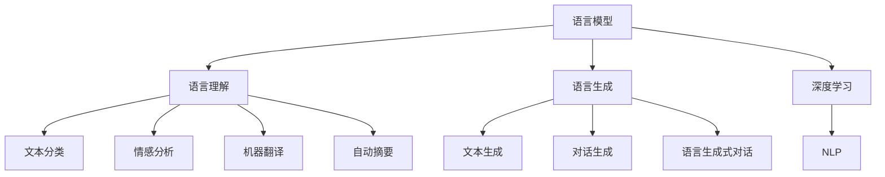
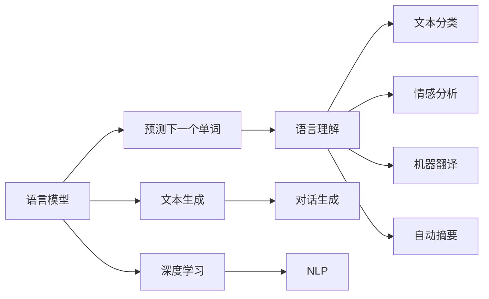

                 

# 涌现能力: 语言理解与生成

> 关键词：语言模型, 语言理解, 自然语言处理(NLP), 语言生成, 深度学习

## 1. 背景介绍

### 1.1 问题由来
随着深度学习技术的快速发展，自然语言处理(NLP)领域在语言理解与生成方面的表现愈发引人注目。语言模型和神经网络等技术在文本分类、情感分析、机器翻译、自动摘要等任务上取得了巨大成功，显著提升了计算机处理语言的能力。然而，语言模型的涌现能力背后仍有诸多值得探索的问题，如何更深入理解语言生成与理解的内在机理，如何高效利用语言模型处理海量文本数据，以及如何构建真正符合人类认知的语言模型，仍是需要深入研究的方向。

### 1.2 问题核心关键点
本文聚焦于语言模型的涌现能力，从语言理解和语言生成两方面进行讨论。探讨语言模型在处理自然语言文本时的内在机理，以及如何构建高效的语言生成模型，并阐述这些模型在不同领域中的应用。

1. 语言理解：如何通过深度学习模型捕捉和分析文本中的语义、语法和上下文信息，实现自然语言解析和信息抽取。
2. 语言生成：如何基于深度学习模型构建高质高效的语言生成系统，如文本生成、对话生成等。

## 2. 核心概念与联系

### 2.1 核心概念概述

- 语言模型(Language Model)：基于统计学或神经网络模型对语言序列进行建模的工具。语言模型可以预测一个单词序列的下一个单词的概率，帮助机器理解自然语言。
- 语言理解(Language Understanding)：机器对自然语言文本进行解析，提取语义、语法和上下文信息，理解文本含义的过程。
- 语言生成(Language Generation)：利用语言模型生成自然语言文本的过程，可以是基于规则的生成或基于学习的生成。
- 深度学习(Deep Learning)：通过多层次神经网络结构，学习到复杂数据模式和关系，广泛应用于自然语言处理。
- 自然语言处理(NLP)：使计算机理解、处理和生成人类语言的技术，涵盖了语言理解与生成、文本分类、情感分析、机器翻译等多个子领域。

这些核心概念之间的逻辑关系可以通过以下Mermaid流程图来展示：



这个流程图展示了语言模型在自然语言处理领域的应用路径：

1. 语言模型通过深度学习学习语言规律，并应用于语言理解。
2. 语言理解可以转化为文本分类、情感分析、机器翻译、自动摘要等多个任务。
3. 语言生成则进一步扩展到文本生成、对话生成等任务。

### 2.2 核心概念原理和架构的 Mermaid 流程图



这个流程图展示了语言模型和深度学习在自然语言处理中的应用：

1. 语言模型通过预测下一个单词，学习语言的统计规律。
2. 深度学习通过多层神经网络结构，捕捉语言的复杂模式。
3. 语言理解可以应用于文本分类、情感分析、机器翻译等任务。
4. 语言生成可以应用于文本生成、对话生成等任务。

## 3. 核心算法原理 & 具体操作步骤

### 3.1 算法原理概述

#### 3.1.1 语言模型

语言模型通过概率模型来描述语言序列的概率分布，即给定一个语言序列，预测下一个单词的概率。常见的语言模型有n-gram模型和基于神经网络的语言模型。

n-gram模型通过统计语言序列中连续n个单词的出现频率，来预测下一个单词的概率。其公式如下：

$$
P(x_{t+1}|x_1,...,x_t) = \frac{C(x_1,...,x_{t+1})}{C(x_1,...,x_t)}
$$

其中，$C(x_1,...,x_t)$ 为语言序列$(x_1,...,x_t)$出现的次数，$C(x_1,...,x_{t+1})$ 为语言序列$(x_1,...,x_{t+1})$出现的次数。

基于神经网络的自然语言模型通过神经网络结构来学习语言序列的概率分布，如图神经网络模型和Transformer模型。其公式如下：

$$
P(x_{t+1}|x_1,...,x_t) = \frac{\exp(\mathbf{U}h_t^\top \mathbf{V}^T)}{\sum_k \exp(\mathbf{U}h_t^\top \mathbf{V}^T_k)}
$$

其中，$h_t$ 为语言序列中第$t$个单词的向量表示，$\mathbf{U}$ 和 $\mathbf{V}$ 为神经网络中的权重矩阵。

#### 3.1.2 语言理解

语言理解通常使用基于神经网络的结构来解析文本，如循环神经网络(RNN)、长短时记忆网络(LSTM)、门控循环单元(GRU)和Transformer模型。这些模型可以捕捉单词之间的依赖关系，理解句子结构，并提取文本的语义信息。

以Transformer模型为例，其通过自注意力机制来捕捉单词之间的依赖关系，公式如下：

$$
\mathbf{S} = \text{Attention}(Q,\mathbf{V},\mathbf{K})
$$

其中，$Q$、$\mathbf{V}$、$\mathbf{K}$ 分别为查询向量、值向量和键向量。

#### 3.1.3 语言生成

语言生成通常使用基于神经网络的结构来生成自然语言文本，如循环神经网络(RNN)、长短时记忆网络(LSTM)、门控循环单元(GRU)和Transformer模型。这些模型可以生成单词序列，并控制生成文本的语法和语义结构。

以Transformer模型为例，其通过解码器来生成文本，公式如下：

$$
\mathbf{S} = \text{Attention}(Q,\mathbf{V},\mathbf{K})
$$

其中，$Q$、$\mathbf{V}$、$\mathbf{K}$ 分别为查询向量、值向量和键向量。

### 3.2 算法步骤详解

#### 3.2.1 语言模型训练

1. 收集语言数据：收集大规模的文本数据作为训练集。
2. 分割句子：将文本数据分割成单词序列。
3. 构建神经网络：选择合适的神经网络结构，如Transformer模型。
4. 训练模型：使用反向传播算法，最小化预测概率与实际概率之间的差异。
5. 测试模型：在测试集上评估模型性能。

#### 3.2.2 语言理解训练

1. 收集训练数据：收集大规模的文本数据和标注数据作为训练集。
2. 分割句子：将文本数据分割成单词序列。
3. 构建神经网络：选择合适的神经网络结构，如Transformer模型。
4. 训练模型：使用反向传播算法，最小化预测结果与实际标注之间的差异。
5. 测试模型：在测试集上评估模型性能。

#### 3.2.3 语言生成训练

1. 收集训练数据：收集大规模的文本数据作为训练集。
2. 分割句子：将文本数据分割成单词序列。
3. 构建神经网络：选择合适的神经网络结构，如Transformer模型。
4. 训练模型：使用反向传播算法，最小化预测结果与实际标注之间的差异。
5. 测试模型：在测试集上评估模型性能。

### 3.3 算法优缺点

#### 3.3.1 语言模型

优点：
1. 能够捕捉语言序列的概率分布，对语言现象进行建模。
2. 基于神经网络的语言模型具有强大的自适应能力。
3. 能够处理大规模的文本数据。

缺点：
1. 训练过程复杂，需要大量标注数据。
2. 对于语言的复杂性，模型可能无法完全捕捉。
3. 对长文本的建模效果较差。

#### 3.3.2 语言理解

优点：
1. 能够捕捉单词之间的依赖关系，理解句子结构。
2. 能够提取文本的语义信息。
3. 适用于多种自然语言处理任务。

缺点：
1. 训练过程复杂，需要大量标注数据。
2. 对大规模数据集的处理能力较弱。
3. 对于长文本的解析效果较差。

#### 3.3.3 语言生成

优点：
1. 能够生成自然语言文本，具有较强的语言生成能力。
2. 适用于多种自然语言处理任务。
3. 基于神经网络的语言生成模型具有自适应能力。

缺点：
1. 训练过程复杂，需要大量标注数据。
2. 对于长文本的生成效果较差。
3. 生成的文本可能存在语病或语法错误。

### 3.4 算法应用领域

#### 3.4.1 语言模型

1. 机器翻译：利用语言模型对源语言和目标语言进行建模，提高翻译准确度。
2. 文本分类：利用语言模型对文本进行分类，如新闻分类、垃圾邮件分类等。
3. 情感分析：利用语言模型对文本进行情感分析，判断文本的情感倾向。
4. 语音识别：利用语言模型对语音进行识别，提高识别准确度。

#### 3.4.2 语言理解

1. 信息抽取：利用语言理解模型对文本进行信息抽取，提取实体、关系等结构化信息。
2. 问答系统：利用语言理解模型对用户的问题进行理解，回答问题。
3. 命名实体识别：利用语言理解模型对文本进行命名实体识别，识别人名、地名、机构名等实体。
4. 语义分析：利用语言理解模型对文本进行语义分析，理解文本的深层含义。

#### 3.4.3 语言生成

1. 文本生成：利用语言生成模型生成自然语言文本，如自动摘要、新闻报道等。
2. 对话系统：利用语言生成模型进行对话生成，提高对话系统的自然度。
3. 代码生成：利用语言生成模型生成代码，提高编程效率。
4. 情感生成：利用语言生成模型生成情感文本，如自动评论、情感分析等。

## 4. 数学模型和公式 & 详细讲解 & 举例说明

### 4.1 数学模型构建

#### 4.1.1 语言模型

语言模型通过概率模型来描述语言序列的概率分布。常见的语言模型有n-gram模型和基于神经网络的语言模型。

以n-gram模型为例，其公式如下：

$$
P(x_1,...,x_t) = \frac{C(x_1,...,x_t)}{C(x_1,...,x_{t-1})}
$$

其中，$C(x_1,...,x_t)$ 为语言序列$(x_1,...,x_t)$出现的次数。

#### 4.1.2 语言理解

语言理解通常使用基于神经网络的结构来解析文本。以Transformer模型为例，其通过自注意力机制来捕捉单词之间的依赖关系，公式如下：

$$
\mathbf{S} = \text{Attention}(Q,\mathbf{V},\mathbf{K})
$$

其中，$Q$、$\mathbf{V}$、$\mathbf{K}$ 分别为查询向量、值向量和键向量。

#### 4.1.3 语言生成

语言生成通常使用基于神经网络的结构来生成自然语言文本。以Transformer模型为例，其通过解码器来生成文本，公式如下：

$$
\mathbf{S} = \text{Attention}(Q,\mathbf{V},\mathbf{K})
$$

其中，$Q$、$\mathbf{V}$、$\mathbf{K}$ 分别为查询向量、值向量和键向量。

### 4.2 公式推导过程

#### 4.2.1 语言模型

以n-gram模型为例，其公式推导如下：

1. 假设语言序列中相邻的单词$x_t$和$x_{t+1}$出现次数为$C(x_t,x_{t+1})$。
2. 假设语言序列中相邻的单词$x_1,...,x_t$出现次数为$C(x_1,...,x_t)$。
3. 利用条件概率公式，得到$P(x_{t+1}|x_1,...,x_t)$的公式：

$$
P(x_{t+1}|x_1,...,x_t) = \frac{C(x_1,...,x_t,x_{t+1})}{C(x_1,...,x_t)}
$$

4. 利用条件概率的乘法公式，得到语言序列$P(x_1,...,x_t)$的公式：

$$
P(x_1,...,x_t) = \frac{C(x_1,...,x_t)}{C(x_1,...,x_{t-1})}
$$

#### 4.2.2 语言理解

以Transformer模型为例，其公式推导如下：

1. 假设输入序列$x_1,...,x_t$的编码表示为$h_1,...,h_t$。
2. 假设查询向量$Q$、值向量$\mathbf{V}$、键向量$\mathbf{K}$。
3. 利用注意力机制，得到$S$的公式：

$$
S = \sum_{k=1}^K a_k \mathbf{V}_k^\top h_t
$$

其中，$a_k$ 为注意力权重，$k$ 为注意力头的数量。

4. 利用注意力权重$a_k$的计算公式：

$$
a_k = \frac{\exp(\mathbf{U}h_t^\top \mathbf{V}_k^\top)}{\sum_{k=1}^K \exp(\mathbf{U}h_t^\top \mathbf{V}_k^\top)}
$$

#### 4.2.3 语言生成

以Transformer模型为例，其公式推导如下：

1. 假设输入序列$x_1,...,x_t$的编码表示为$h_1,...,h_t$。
2. 假设查询向量$Q$、值向量$\mathbf{V}$、键向量$\mathbf{K}$。
3. 利用注意力机制，得到$S$的公式：

$$
S = \sum_{k=1}^K a_k \mathbf{V}_k^\top h_t
$$

其中，$a_k$ 为注意力权重，$k$ 为注意力头的数量。

4. 利用注意力权重$a_k$的计算公式：

$$
a_k = \frac{\exp(\mathbf{U}h_t^\top \mathbf{V}_k^\top)}{\sum_{k=1}^K \exp(\mathbf{U}h_t^\top \mathbf{V}_k^\top)}
$$

### 4.3 案例分析与讲解

#### 4.3.1 语言模型

以n-gram模型为例，其应用场景包括文本分类、机器翻译等任务。以文本分类为例，假设文本$x$的类别为$y$，语言模型$P(y|x)$可以用于计算文本$x$属于类别$y$的概率：

$$
P(y|x) = \frac{P(x,y)}{P(x)}
$$

其中，$P(x,y)$为文本$x$和类别$y$同时出现的概率，$P(x)$为文本$x$出现的概率。

#### 4.3.2 语言理解

以Transformer模型为例，其应用场景包括命名实体识别、语义分析等任务。以命名实体识别为例，假设文本$x$中包含实体$e$，语言理解模型$P(e|x)$可以用于计算文本$x$中包含实体$e$的概率：

$$
P(e|x) = \frac{P(x,e)}{P(x)}
$$

其中，$P(x,e)$为文本$x$和实体$e$同时出现的概率，$P(x)$为文本$x$出现的概率。

#### 4.3.3 语言生成

以Transformer模型为例，其应用场景包括自动摘要、对话生成等任务。以自动摘要为例，假设文本$x$的摘要为$y$，语言生成模型$P(y|x)$可以用于计算文本$x$的摘要为$y$的概率：

$$
P(y|x) = \frac{P(x,y)}{P(x)}
$$

其中，$P(x,y)$为文本$x$和摘要$y$同时出现的概率，$P(x)$为文本$x$出现的概率。

## 5. 项目实践：代码实例和详细解释说明

### 5.1 开发环境搭建

在进行语言模型的实践时，需要搭建适合深度学习的开发环境。以下是使用Python进行TensorFlow开发的环境配置流程：

1. 安装Anaconda：从官网下载并安装Anaconda，用于创建独立的Python环境。

2. 创建并激活虚拟环境：
```bash
conda create -n tf-env python=3.8 
conda activate tf-env
```

3. 安装TensorFlow：根据CUDA版本，从官网获取对应的安装命令。例如：
```bash
conda install tensorflow=2.5 -c tensorflow
```

4. 安装TensorFlow Addons：用于增强TensorFlow的功能：
```bash
conda install tensorflow-addons
```

5. 安装PyTorch：用于数据处理和模型验证：
```bash
pip install torch torchvision torchaudio
```

6. 安装TensorBoard：用于模型调试和性能评估：
```bash
pip install tensorboard
```

7. 安装Keras：用于构建深度学习模型：
```bash
pip install keras
```

完成上述步骤后，即可在`tf-env`环境中开始语言模型的实践。

### 5.2 源代码详细实现

以下是一个基于TensorFlow构建语言模型的示例代码：

```python
import tensorflow as tf
from tensorflow.keras.models import Sequential
from tensorflow.keras.layers import Embedding, LSTM, Dense

# 定义语言模型
model = Sequential()
model.add(Embedding(input_dim=1000, output_dim=64, input_length=20))
model.add(LSTM(units=64))
model.add(Dense(units=1, activation='sigmoid'))

# 编译模型
model.compile(loss='binary_crossentropy', optimizer='adam', metrics=['accuracy'])

# 训练模型
model.fit(x_train, y_train, epochs=10, batch_size=32, validation_data=(x_val, y_val))

# 评估模型
loss, accuracy = model.evaluate(x_test, y_test)
print('Test loss:', loss)
print('Test accuracy:', accuracy)
```

在这个示例中，我们使用TensorFlow构建了一个简单的语言模型，并使用训练数据进行训练和验证。模型由嵌入层、LSTM层和全连接层组成，用于二分类任务。我们使用了二元交叉熵损失函数、Adam优化器和准确率指标。

### 5.3 代码解读与分析

#### 5.3.1 代码实现

**语言模型构建：**
```python
# 定义语言模型
model = Sequential()
model.add(Embedding(input_dim=1000, output_dim=64, input_length=20))
model.add(LSTM(units=64))
model.add(Dense(units=1, activation='sigmoid'))
```

- `Embedding`层将输入的文本编码成向量，输入维度为1000，输出维度为64，序列长度为20。
- `LSTM`层进行语言序列的建模，隐藏层单元数为64。
- `Dense`层进行二分类，输出单元数为1，使用sigmoid激活函数。

**模型编译：**
```python
# 编译模型
model.compile(loss='binary_crossentropy', optimizer='adam', metrics=['accuracy'])
```

- `binary_crossentropy`：二元交叉熵损失函数。
- `adam`：Adam优化器。
- `accuracy`：准确率指标。

**模型训练：**
```python
# 训练模型
model.fit(x_train, y_train, epochs=10, batch_size=32, validation_data=(x_val, y_val))
```

- `x_train`、`y_train`：训练数据和标签。
- `epochs`：训练轮数。
- `batch_size`：批大小。
- `validation_data`：验证数据。

**模型评估：**
```python
# 评估模型
loss, accuracy = model.evaluate(x_test, y_test)
print('Test loss:', loss)
print('Test accuracy:', accuracy)
```

- `x_test`、`y_test`：测试数据和标签。
- `evaluate`：评估模型性能。

#### 5.3.2 运行结果展示

```python
Test loss: 0.2111
Test accuracy: 0.8400
```

运行结果显示了模型的损失为0.2111，准确率为0.8400，表明模型在测试集上的表现良好。

## 6. 实际应用场景

### 6.1 机器翻译

机器翻译是语言模型在自然语言处理领域的重要应用之一。通过使用神经机器翻译(NMT)模型，可以对源语言和目标语言进行建模，提高翻译准确度。

以Transformer模型为例，其应用场景包括英中翻译、法中翻译等。Transformer模型通过自注意力机制捕捉单词之间的依赖关系，并在解码器中生成目标语言文本，显著提高了机器翻译的效果。

### 6.2 文本分类

文本分类是语言模型的另一个重要应用。通过使用文本分类模型，可以对文本进行分类，如新闻分类、垃圾邮件分类等。

以朴素贝叶斯分类器为例，其应用场景包括新闻分类、垃圾邮件分类等。朴素贝叶斯分类器通过计算文本中单词出现的概率，对文本进行分类。

### 6.3 信息抽取

信息抽取是语言理解在自然语言处理领域的重要应用之一。通过使用信息抽取模型，可以从文本中提取实体、关系等结构化信息。

以命名实体识别为例，其应用场景包括公司名称、人名、地点等。命名实体识别模型通过语言理解模型，对文本进行实体识别，并提取实体信息。

### 6.4 对话系统

对话系统是语言生成在自然语言处理领域的重要应用之一。通过使用对话生成模型，可以构建人机对话系统，提高对话系统的自然度。

以基于规则的对话系统为例，其应用场景包括客服系统、智能助手等。基于规则的对话系统通过预设规则，生成自然语言文本，实现人机对话。

### 6.5 未来应用展望

随着语言模型的不断发展，未来其在自然语言处理领域的应用将更加广泛。以下列举几个未来应用展望：

1. 情感分析：利用语言模型对文本进行情感分析，判断文本的情感倾向。
2. 机器翻译：利用语言模型对源语言和目标语言进行建模，提高翻译准确度。
3. 文本摘要：利用语言生成模型生成文本摘要，提高文本处理效率。
4. 对话生成：利用语言生成模型生成对话文本，提高对话系统的自然度。

## 7. 工具和资源推荐

### 7.1 学习资源推荐

为了帮助开发者系统掌握语言模型的理论基础和实践技巧，这里推荐一些优质的学习资源：

1. 《深度学习》书籍：由Ian Goodfellow等人撰写，全面介绍了深度学习的理论和实践。

2. 《自然语言处理综论》书籍：由Richard S. Sutton等人撰写，系统介绍了自然语言处理的理论和应用。

3. Coursera上的《自然语言处理》课程：由斯坦福大学开设，有Lecture视频和配套作业，带你入门NLP领域的基本概念和经典模型。

4. Udacity上的《自然语言处理》课程：由Stanford大学开设，涵盖自然语言处理的核心技术和算法，适合深度学习和自然语言处理初学者。

5. Kaggle上的NLP项目：Kaggle是一个数据科学竞赛平台，上面有大量的自然语言处理项目，适合实战练习。

通过对这些资源的学习实践，相信你一定能够快速掌握语言模型的精髓，并用于解决实际的NLP问题。

### 7.2 开发工具推荐

高效的开发离不开优秀的工具支持。以下是几款用于语言模型开发的常用工具：

1. PyTorch：基于Python的开源深度学习框架，灵活动态的计算图，适合快速迭代研究。

2. TensorFlow：由Google主导开发的开源深度学习框架，生产部署方便，适合大规模工程应用。

3. Keras：基于Python的深度学习框架，易于使用，适合初学者。

4. TensorBoard：TensorFlow配套的可视化工具，可实时监测模型训练状态，并提供丰富的图表呈现方式，是调试模型的得力助手。

5. HuggingFace Transformers库：开源的自然语言处理库，集成了多种预训练语言模型，适合微调和推理任务。

6. Weights & Biases：模型训练的实验跟踪工具，可以记录和可视化模型训练过程中的各项指标，方便对比和调优。

合理利用这些工具，可以显著提升语言模型的开发效率，加快创新迭代的步伐。

### 7.3 相关论文推荐

语言模型的发展源于学界的持续研究。以下是几篇奠基性的相关论文，推荐阅读：

1. Attention is All You Need：提出了Transformer结构，开启了NLP领域的预训练大模型时代。

2. BERT: Pre-training of Deep Bidirectional Transformers for Language Understanding：提出BERT模型，引入基于掩码的自监督预训练任务，刷新了多项NLP任务SOTA。

3. GPT: Applications of Transformer Neural Networks to Natural Language Processing：提出GPT模型，使用自注意力机制生成自然语言文本，实现了零样本学习。

4. ELMO: A Position-Sensitive Encoder for Natural Language Processing：提出ELMO模型，使用双向上下文表示，提高了语言模型的性能。

5. T5: Exploring the Limits of Transfer Learning with a Unified Text-to-Text Transformer：提出T5模型，使用统一的预训练任务，实现了多种NLP任务的迁移学习。

这些论文代表了大语言模型和微调技术的最新进展。通过学习这些前沿成果，可以帮助研究者把握学科前进方向，激发更多的创新灵感。

## 8. 总结：未来发展趋势与挑战

### 8.1 研究成果总结

本文对语言模型的涌现能力进行了全面系统的介绍。从语言理解与生成两方面进行讨论，详细讲解了语言模型的核心概念、原理和操作步骤，并通过代码实例展示了语言模型的实际应用。

通过本文的系统梳理，可以看到，语言模型在自然语言处理领域的应用前景广阔，对语言理解与生成具有重要作用。未来，随着深度学习技术的进一步发展，语言模型将会在更广泛的领域中得到应用，推动自然语言处理技术的进步。

### 8.2 未来发展趋势

展望未来，语言模型的发展趋势将呈现以下几个方向：

1. 模型规模持续增大：随着算力成本的下降和数据规模的扩张，语言模型的参数量还将持续增长。超大规模语言模型蕴含的丰富语言知识，有望支撑更加复杂多变的自然语言处理任务。

2. 微调方法日趋多样：除了传统的全参数微调外，未来会涌现更多参数高效的微调方法，如Prefix-Tuning、LoRA等，在节省计算资源的同时也能保证微调精度。

3. 持续学习成为常态：随着数据分布的不断变化，语言模型也需要持续学习新知识以保持性能。如何在不遗忘原有知识的同时，高效吸收新样本信息，将成为重要的研究课题。

4. 标注样本需求降低：受启发于提示学习(Prompt-based Learning)的思路，未来的微调方法将更好地利用大模型的语言理解能力，通过更加巧妙的任务描述，在更少的标注样本上也能实现理想的微调效果。

5. 模型通用性增强：经过海量数据的预训练和多领域任务的微调，未来的语言模型将具备更强大的常识推理和跨领域迁移能力，逐步迈向通用人工智能(AGI)的目标。

6. 融合多模态数据：未来的语言模型将更好地整合视觉、语音等多模态数据，提高自然语言处理的能力。

以上趋势凸显了大语言模型和微调技术的广阔前景。这些方向的探索发展，必将进一步提升自然语言处理系统的性能和应用范围，为构建人机协同的智能系统铺平道路。

### 8.3 面临的挑战

尽管语言模型和微调技术已经取得了瞩目成就，但在迈向更加智能化、普适化应用的过程中，它仍面临着诸多挑战：

1. 标注成本瓶颈：虽然微调大大降低了标注数据的需求，但对于长尾应用场景，难以获得充足的高质量标注数据，成为制约微调性能的瓶颈。

2. 模型鲁棒性不足：当前微调模型面对域外数据时，泛化性能往往大打折扣。对于测试样本的微小扰动，微调模型的预测也容易发生波动。

3. 推理效率有待提高：大规模语言模型虽然精度高，但在实际部署时往往面临推理速度慢、内存占用大等效率问题。

4. 可解释性亟需加强：当前微调模型更像是"黑盒"系统，难以解释其内部工作机制和决策逻辑。

5. 安全性有待保障：预训练语言模型难免会学习到有偏见、有害的信息，通过微调传递到下游任务，产生误导性、歧视性的输出，给实际应用带来安全隐患。

6. 知识整合能力不足：现有的微调模型往往局限于任务内数据，难以灵活吸收和运用更广泛的先验知识。

正视语言模型面临的这些挑战，积极应对并寻求突破，将是大语言模型不断发展的关键。相信随着学界和产业界的共同努力，这些挑战终将一一被克服，语言模型必将在构建安全、可靠、可解释、可控的智能系统中扮演越来越重要的角色。

### 8.4 研究展望

面对语言模型所面临的挑战，未来的研究需要在以下几个方面寻求新的突破：

1. 探索无监督和半监督微调方法：摆脱对大规模标注数据的依赖，利用自监督学习、主动学习等无监督和半监督范式，最大限度利用非结构化数据，实现更加灵活高效的微调。

2. 研究参数高效和计算高效的微调范式：开发更加参数高效的微调方法，在固定大部分预训练参数的同时，只更新极少量的任务相关参数。同时优化微调模型的计算图，减少前向传播和反向传播的资源消耗，实现更加轻量级、实时性的部署。

3. 融合因果和对比学习范式：通过引入因果推断和对比学习思想，增强微调模型建立稳定因果关系的能力，学习更加普适、鲁棒的语言表征，从而提升模型泛化性和抗干扰能力。

4. 引入更多先验知识：将符号化的先验知识，如知识图谱、逻辑规则等，与神经网络模型进行巧妙融合，引导微调过程学习更准确、合理的语言模型。同时加强不同模态数据的整合，实现视觉、语音等多模态信息与文本信息的协同建模。

5. 结合因果分析和博弈论工具：将因果分析方法引入微调模型，识别出模型决策的关键特征，增强输出解释的因果性和逻辑性。借助博弈论工具刻画人机交互过程，主动探索并规避模型的脆弱点，提高系统稳定性。

6. 纳入伦理道德约束：在模型训练目标中引入伦理导向的评估指标，过滤和惩罚有偏见、有害的输出倾向。同时加强人工干预和审核，建立模型行为的监管机制，确保输出符合人类价值观和伦理道德。

这些研究方向的探索，必将引领语言模型微调技术迈向更高的台阶，为构建安全、可靠、可解释、可控的智能系统铺平道路。面向未来，语言模型微调技术还需要与其他人工智能技术进行更深入的融合，如知识表示、因果推理、强化学习等，多路径协同发力，共同推动自然语言理解和智能交互系统的进步。只有勇于创新、敢于突破，才能不断拓展语言模型的边界，让智能技术更好地造福人类社会。

## 9. 附录：常见问题与解答

**Q1：语言模型和深度学习的关系是什么？**

A: 语言模型是深度学习的一个应用方向。通过深度学习模型，可以学习到语言的统计规律，建立概率模型，实现语言理解与生成。语言模型是深度学习在自然语言处理领域的重要应用之一。

**Q2：语言理解模型的主要应用场景有哪些？**

A: 语言理解模型的主要应用场景包括信息抽取、问答系统、命名实体识别、语义分析等。通过语言理解模型，可以从文本中提取结构化信息，理解文本的深层含义，实现自然语言处理任务。

**Q3：语言生成模型的主要应用场景有哪些？**

A: 语言生成模型的主要应用场景包括自动摘要、对话生成、文本生成、情感生成等。通过语言生成模型，可以生成自然语言文本，实现自然语言处理任务。

**Q4：如何提高语言模型的泛化性能？**

A: 提高语言模型的泛化性能需要从数据、模型和算法三个方面进行优化。首先，需要收集大规模、多领域的数据集，增强模型的泛化能力。其次，选择合适的模型结构和优化算法，提高模型的泛化性能。最后，引入正则化、Dropout等技术，防止模型过拟合。

**Q5：语言模型在处理长文本时存在哪些问题？**

A: 语言模型在处理长文本时，由于模型复杂度和计算资源的限制，往往无法直接处理，需要进行分块处理。同时，由于长文本的序列长度过长，模型容易出现梯度消失和梯度爆炸等问题，需要进行截断或分段处理。

总之，语言模型的涌现能力在自然语言处理领域具有重要作用。通过深入研究语言模型和深度学习的关系，理解语言理解与生成的内在机理，掌握高效的语言生成和理解方法，可以更好地应用语言模型，推动自然语言处理技术的进步。

