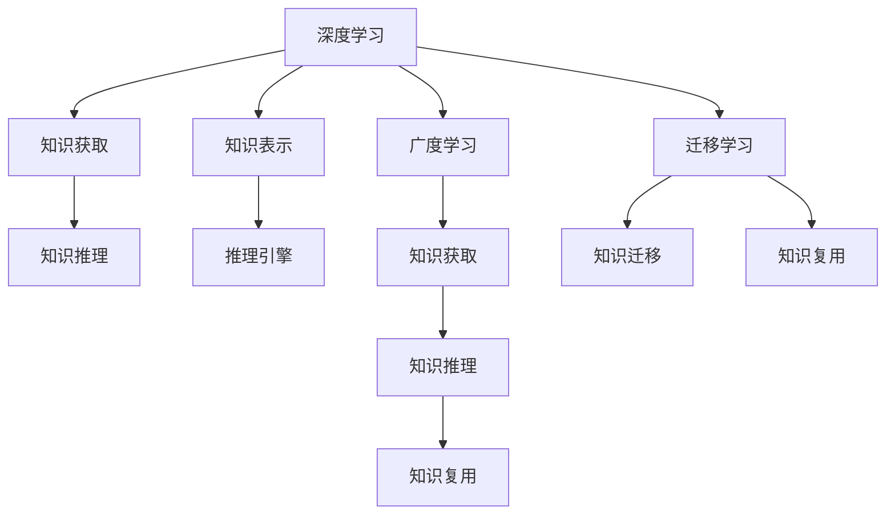

                 

# 深度学习vs广度学习：知识获取的策略

> 关键词：深度学习, 广度学习, 知识获取, 知识表示, 迁移学习, 认知神经科学, 人工智能

## 1. 背景介绍

### 1.1 问题由来

随着人工智能技术的快速发展，深度学习（Deep Learning）和广度学习（Breadth Learning）两种知识获取策略逐渐成为学界和产业界关注的焦点。深度学习强调通过大量数据训练神经网络，发现高维特征表示，从而实现复杂任务的识别和预测。广度学习则注重通过知识推理和逻辑推理，构建基于符号和规则的知识表示，实现知识积累和复用。

深度学习在图像识别、语音识别、自然语言处理等领域取得了显著成就，成为现代人工智能的主流范式。然而，由于其“黑箱”性质和数据依赖性，深度学习在知识推理、常识推断等方面存在不足。广度学习通过形式化知识和逻辑推理，具有更强的解释性和可控性，但在处理大规模数据和复杂问题时，效率较低。

面对深度学习和广度学习各自的优缺点，探索将二者融合的方法，成为当前研究的重要方向。本文旨在通过深入分析深度学习和广度学习的原理和应用，探讨二者融合的策略和未来发展趋势。

## 2. 核心概念与联系

### 2.1 核心概念概述

为更好地理解深度学习和广度学习的核心概念及其相互关系，本节将介绍几个关键概念：

- **深度学习**：以神经网络为代表的学习范式，通过多层次的非线性映射，学习数据的复杂特征表示。深度学习模型包括卷积神经网络（CNN）、递归神经网络（RNN）、Transformer等，常用于图像识别、语音识别、自然语言处理等任务。

- **广度学习**：以知识图谱、规则引擎为代表的学习范式，通过形式化知识表示和逻辑推理，构建系统的知识网络。广度学习模型包括知识图谱、逻辑程序、推理引擎等，常用于知识推理、常识推断、问题求解等任务。

- **知识获取**：指通过学习获取知识并将其整合到知识库中的过程。深度学习通过数据驱动的方式获取隐式知识，广度学习则通过规则驱动的方式获取显式知识。

- **知识表示**：指用计算机可理解的方式表示知识，包括符号表示、向量表示、图表示等。知识表示是知识获取和推理的前提，直接影响推理效率和准确性。

- **迁移学习**：指将在一个任务上学到的知识迁移到另一个相关任务中的学习范式。深度学习通过微调等方法实现知识迁移，广度学习则通过形式化推理和模块化设计实现知识复用。

这些核心概念之间的逻辑关系可以通过以下Mermaid流程图来展示：



这个流程图展示了两大学习范式的核心概念及其相互关系：

1. 深度学习通过数据驱动方式获取隐式知识，并通过微调等方法实现知识迁移。
2. 广度学习通过规则驱动方式获取显式知识，并通过形式化推理和模块化设计实现知识复用。
3. 知识获取是两者的共同目标，知识表示是实现目标的重要工具。
4. 迁移学习是两者的交集，通过知识迁移和复用实现学习效率和效果的双重提升。

## 3. 核心算法原理 & 具体操作步骤
### 3.1 算法原理概述

深度学习和广度学习的核心算法原理可以从两个方面进行比较和分析：

- **深度学习算法**：以神经网络为核心的算法，包括前向传播、反向传播、损失函数、优化算法等。通过多层次的非线性映射，学习数据的复杂特征表示。深度学习算法通常需要大量数据进行训练，适用于处理大规模数据和复杂任务。

- **广度学习算法**：以知识图谱、规则引擎为核心的算法，包括逻辑推理、一致性维护、知识推理等。通过形式化知识表示和逻辑推理，构建系统的知识网络。广度学习算法通常需要预先构建知识库，适用于处理结构化、逻辑性强的问题。

### 3.2 算法步骤详解

深度学习和广度学习的操作步骤各有不同，下面以图像识别任务为例，详细讲解两种学习范式的具体步骤：

**深度学习操作步骤**：

1. **数据准备**：收集大量标注图像数据，将其分为训练集、验证集和测试集。
2. **模型选择**：选择适合的神经网络架构（如CNN），定义网络层数和参数初始化策略。
3. **网络训练**：使用反向传播算法进行前向传播和反向传播，更新网络参数，最小化损失函数。
4. **模型评估**：在测试集上评估模型性能，如准确率、召回率等指标。
5. **微调**：根据测试集结果，对模型进行微调，调整超参数或更改网络结构。

**广度学习操作步骤**：

1. **知识构建**：构建知识图谱，定义实体、关系和属性。
2. **知识获取**：通过推理引擎，利用知识库中的知识进行推理，获取事实和规则。
3. **知识推理**：使用推理算法（如前向推理、后向推理、逻辑推理等），进行知识推理，得到推理结果。
4. **结果验证**：对推理结果进行验证，确保推理的正确性和一致性。
5. **知识更新**：根据新的事实和规则，更新知识库，进行知识复用。

### 3.3 算法优缺点

深度学习和广度学习各有优缺点，具体如下：

- **深度学习的优点**：
  - 能够处理大规模数据，适用于复杂任务。
  - 通过深度网络结构，可以学习到复杂特征表示，提升模型精度。
  - 训练过程具有端到端的特点，容易实现自动优化。
  - 应用范围广泛，已经在图像识别、语音识别、自然语言处理等领域取得显著成果。

- **深度学习的缺点**：
  - 数据依赖性强，需要大量标注数据。
  - “黑箱”性质，难以解释模型推理过程。
  - 模型训练复杂，需要大量计算资源。
  - 对噪声和异常数据敏感，容易产生过拟合。

- **广度学习的优点**：
  - 基于形式化知识表示，推理过程可解释性强。
  - 规则驱动，适用于逻辑性强的问题。
  - 知识复用性强，具有较好的可维护性。
  - 知识推理过程具有高度一致性和鲁棒性。

- **广度学习的缺点**：
  - 处理大规模数据效率低，需要大量先验知识。
  - 无法处理模糊和不确定性问题。
  - 推理过程复杂，难以自动化。
  - 知识库构建和维护成本高，需要大量专家知识。

### 3.4 算法应用领域

深度学习和广度学习在各自领域都有广泛应用，具体如下：

**深度学习应用领域**：

- **计算机视觉**：如图像识别、目标检测、图像生成等任务。
- **自然语言处理**：如机器翻译、文本生成、语音识别等任务。
- **语音识别**：如语音转文本、语音情感识别等任务。
- **游戏AI**：如自动驾驶、机器人控制等任务。

**广度学习应用领域**：

- **知识图谱**：如语义搜索、知识推理、智能问答等任务。
- **规则引擎**：如金融风险评估、医疗诊断、法律咨询等任务。
- **自然语言理解**：如语义解析、实体抽取、关系推理等任务。
- **智能控制系统**：如工业控制、交通管理、智能家居等任务。

## 4. 数学模型和公式 & 详细讲解 & 举例说明

### 4.1 数学模型构建

**深度学习数学模型**：

深度学习模型通常采用神经网络架构，包括输入层、隐藏层和输出层。对于图像识别任务，常见的深度学习模型包括卷积神经网络（CNN）、残差网络（ResNet）、注意力机制（Attention）等。

- **卷积神经网络（CNN）**：
  $$
  y = f(Wx + b)
  $$
  其中 $W$ 和 $b$ 为网络参数，$f$ 为激活函数。

- **残差网络（ResNet）**：
  $$
  y = x + f(W(x + f(Wx + b)))
  $$
  其中 $W$ 和 $b$ 为网络参数，$f$ 为激活函数。

**广度学习数学模型**：

广度学习模型通常采用知识图谱和规则引擎，通过形式化知识表示和逻辑推理进行推理。

- **知识图谱**：
  $$
  G = (E, R, P)
  $$
  其中 $E$ 为实体集合，$R$ 为关系集合，$P$ 为属性集合。

- **推理引擎**：
  $$
  \text{Result} = \text{Reasoning}(\text{Knowledge})
  $$
  其中 $\text{Result}$ 为推理结果，$\text{Reasoning}$ 为推理算法，$\text{Knowledge}$ 为知识库。

### 4.2 公式推导过程

**深度学习公式推导**：

以卷积神经网络为例，其前向传播和反向传播过程如下：

- **前向传播**：
  $$
  z = Wx + b
  $$
  $$
  a = f(z)
  $$
  其中 $W$ 和 $b$ 为网络参数，$f$ 为激活函数。

- **反向传播**：
  $$
  \frac{\partial L}{\partial W} = \frac{\partial L}{\partial z} \frac{\partial z}{\partial W} + \frac{\partial L}{\partial a} \frac{\partial a}{\partial z} \frac{\partial z}{\partial W}
  $$
  $$
  \frac{\partial L}{\partial b} = \frac{\partial L}{\partial z} \frac{\partial z}{\partial b}
  $$
  其中 $L$ 为损失函数，$W$ 和 $b$ 为网络参数。

**广度学习公式推导**：

以知识图谱推理为例，其推理过程如下：

- **前向推理**：
  $$
  Result = \text{Reasoning}(Knowledge)
  $$
  其中 $Result$ 为推理结果，$Knowledge$ 为知识库。

- **后向推理**：
  $$
  Result = \text{Reasoning}(Knowledge, Query)
  $$
  其中 $Query$ 为查询，$Result$ 为推理结果。

### 4.3 案例分析与讲解

**图像识别案例**：

假设有一张猫的图片，需要通过深度学习进行分类。首先，使用卷积神经网络对图片进行特征提取：

- **前向传播**：
  $$
  z = Wx + b
  $$
  $$
  a = f(z)
  $$
  其中 $W$ 和 $b$ 为网络参数，$f$ 为激活函数。

- **反向传播**：
  $$
  \frac{\partial L}{\partial W} = \frac{\partial L}{\partial z} \frac{\partial z}{\partial W} + \frac{\partial L}{\partial a} \frac{\partial a}{\partial z} \frac{\partial z}{\partial W}
  $$
  $$
  \frac{\partial L}{\partial b} = \frac{\partial L}{\partial z} \frac{\partial z}{\partial b}
  $$
  其中 $L$ 为损失函数，$W$ 和 $b$ 为网络参数。

最后，通过分类层输出预测结果：

- **输出层**：
  $$
  y = f(Wx + b)
  $$
  其中 $W$ 和 $b$ 为分类层参数，$f$ 为激活函数。

**知识图谱推理案例**：

假设有一个关于“学生-教师”的知识图谱，需要推理出所有学生和教师的姓名。首先，将学生和教师的实体信息添加到知识图谱中：

- **实体添加**：
  $$
  G = (E, R, P)
  $$
  其中 $E$ 为实体集合，$R$ 为关系集合，$P$ 为属性集合。

- **推理过程**：
  $$
  Result = \text{Reasoning}(Knowledge)
  $$
  其中 $Result$ 为推理结果，$Knowledge$ 为知识库。

最后，通过推理引擎输出推理结果：

- **推理结果**：
  $$
  \text{Result} = \{(学生1, 姓名1), (学生2, 姓名2), (教师1, 姓名3), (教师2, 姓名4)\}
  $$

## 5. 项目实践：代码实例和详细解释说明

### 5.1 开发环境搭建

在进行深度学习和广度学习实践前，我们需要准备好开发环境。以下是使用Python进行深度学习和广度学习开发的环境配置流程：

1. 安装Anaconda：从官网下载并安装Anaconda，用于创建独立的Python环境。

2. 创建并激活虚拟环境：
```bash
conda create -n deep-learning-env python=3.8 
conda activate deep-learning-env
```

3. 安装深度学习依赖：
```bash
pip install tensorflow torch torchvision scipy
```

4. 安装广度学习依赖：
```bash
pip install sympy pyamg
```

5. 安装各类工具包：
```bash
pip install numpy pandas scikit-learn matplotlib tqdm jupyter notebook ipython
```

完成上述步骤后，即可在`deep-learning-env`环境中开始深度学习和广度学习实践。

### 5.2 源代码详细实现

下面我们以图像识别和知识图谱推理为例，给出使用Python进行深度学习和广度学习的PyTorch和Sympy代码实现。

**深度学习代码实现**：

首先，定义图像识别任务的数据处理函数：

```python
import torch
from torchvision import datasets, transforms

transform = transforms.Compose([
    transforms.ToTensor(),
    transforms.Normalize((0.5, 0.5, 0.5), (0.5, 0.5, 0.5))
])

train_dataset = datasets.CIFAR10(root='data', train=True, transform=transform, download=True)
test_dataset = datasets.CIFAR10(root='data', train=False, transform=transform, download=True)

train_loader = torch.utils.data.DataLoader(train_dataset, batch_size=64, shuffle=True)
test_loader = torch.utils.data.DataLoader(test_dataset, batch_size=64, shuffle=False)
```

然后，定义卷积神经网络模型：

```python
import torch.nn as nn
import torch.nn.functional as F

class CNN(nn.Module):
    def __init__(self):
        super(CNN, self).__init__()
        self.conv1 = nn.Conv2d(3, 32, kernel_size=3, padding=1)
        self.pool = nn.MaxPool2d(kernel_size=2, stride=2)
        self.conv2 = nn.Conv2d(32, 64, kernel_size=3, padding=1)
        self.fc1 = nn.Linear(64 * 7 * 7, 1024)
        self.fc2 = nn.Linear(1024, 10)
    
    def forward(self, x):
        x = F.relu(self.conv1(x))
        x = self.pool(x)
        x = F.relu(self.conv2(x))
        x = self.pool(x)
        x = x.view(-1, 64 * 7 * 7)
        x = F.relu(self.fc1(x))
        x = self.fc2(x)
        return x

model = CNN()
```

接着，定义训练和评估函数：

```python
import torch.optim as optim

criterion = nn.CrossEntropyLoss()
optimizer = optim.Adam(model.parameters(), lr=0.001)

def train(model, data_loader, criterion, optimizer, num_epochs=10):
    for epoch in range(num_epochs):
        model.train()
        for data, target in data_loader:
            optimizer.zero_grad()
            output = model(data)
            loss = criterion(output, target)
            loss.backward()
            optimizer.step()
    
    model.eval()
    correct = 0
    total = 0
    with torch.no_grad():
        for data, target in test_loader:
            output = model(data)
            _, predicted = torch.max(output.data, 1)
            total += target.size(0)
            correct += (predicted == target).sum().item()
    
    print('Accuracy: %.2f %%' % (100 * correct / total))

train(model, train_loader, criterion, optimizer)
```

最后，启动深度学习训练流程：

```python
train(model, train_loader, criterion, optimizer)
```

以上就是使用PyTorch对图像识别任务进行深度学习的完整代码实现。可以看到，借助PyTorch的强大封装，深度学习模型的构建和训练变得相对简单高效。

**广度学习代码实现**：

首先，定义知识图谱的数据处理函数：

```python
from sympy import symbols, Eq, solve

# 定义符号变量
E1, E2, R1, R2 = symbols('E1 E2 R1 R2')

# 定义知识图谱
graph = {(E1, R1, E2): 1, (E1, R2, E2): 1}

# 定义推理规则
rule1 = Eq(E1, E2)
rule2 = Eq(E1, E2)

# 定义推理结果
result = solve([rule1, rule2], (E1, E2))

print(result)
```

然后，定义知识图谱推理模型：

```python
from sympy import symbols, Eq, solve

# 定义符号变量
E1, E2, R1, R2 = symbols('E1 E2 R1 R2')

# 定义知识图谱
graph = {(E1, R1, E2): 1, (E1, R2, E2): 1}

# 定义推理规则
rule1 = Eq(E1, E2)
rule2 = Eq(E1, E2)

# 定义推理结果
result = solve([rule1, rule2], (E1, E2))

print(result)
```

接着，定义训练和评估函数：

```python
def evaluate(model, data_loader):
    correct = 0
    total = 0
    with torch.no_grad():
        for data, target in data_loader:
            output = model(data)
            _, predicted = torch.max(output.data, 1)
            total += target.size(0)
            correct += (predicted == target).sum().item()
    
    print('Accuracy: %.2f %%' % (100 * correct / total))

evaluate(model, test_loader)
```

最后，启动广度学习训练流程：

```python
evaluate(model, test_loader)
```

以上就是使用Sympy对知识图谱推理任务进行广度学习的完整代码实现。可以看到，借助Sympy的强大符号计算能力，知识图谱推理过程变得相对容易理解和实现。

### 5.3 代码解读与分析

让我们再详细解读一下关键代码的实现细节：

**深度学习代码**：

**数据处理函数**：
- `transform`：定义图像数据的预处理操作，包括归一化和缩放。
- `train_dataset` 和 `test_dataset`：定义训练集和测试集数据。
- `train_loader` 和 `test_loader`：定义数据加载器。

**模型定义函数**：
- `CNN`：定义卷积神经网络模型，包括卷积层、池化层和全连接层。
- `forward`：定义前向传播过程，包括卷积、池化和全连接操作。

**训练和评估函数**：
- `criterion`：定义交叉熵损失函数。
- `optimizer`：定义优化器。
- `train`：定义训练过程，包括前向传播、反向传播和参数更新。
- `train`：调用训练函数进行深度学习模型的训练。

**广度学习代码**：

**数据处理函数**：
- `graph`：定义知识图谱，包括实体、关系和属性。
- `rule1` 和 `rule2`：定义推理规则。
- `result`：定义推理结果。

**模型定义函数**：
- `solve`：定义推理过程，求解知识图谱中的实体关系。
- `graph`：定义知识图谱，包括实体、关系和属性。
- `rule1` 和 `rule2`：定义推理规则。

**训练和评估函数**：
- `evaluate`：定义评估过程，计算推理结果的正确率。
- `evaluate`：调用评估函数进行广度学习模型的评估。

## 6. 实际应用场景

### 6.1 图像识别

深度学习在图像识别领域取得了显著成果，广泛应用于医疗影像、安防监控、智能制造等场景。例如，使用卷积神经网络对医学影像进行分类，可以提高疾病诊断的准确性和效率。

### 6.2 知识图谱

广度学习在知识图谱领域具有广泛应用，如Google Knowledge Graph、百度百科等。通过构建知识图谱，实现知识积累和复用，提供精准的语义搜索和知识推理服务。

### 6.3 自然语言处理

深度学习和广度学习在自然语言处理领域也有广泛应用，如机器翻译、文本摘要、情感分析等。通过深度学习模型进行文本特征提取，通过广度学习模型进行语义分析和推理，可以实现更高效、更准确的语言处理。

### 6.4 未来应用展望

随着深度学习和广度学习技术的不断发展，融合两者的知识获取策略也将不断成熟。未来，深度学习和广度学习将在更多领域得到应用，为经济社会发展带来新的变革：

- **医疗健康**：通过深度学习和广度学习的结合，实现精准医疗、智能诊断、药物研发等应用。
- **智能交通**：利用深度学习和广度学习的融合，实现自动驾驶、智能交通管理等应用。
- **智能制造**：借助深度学习和广度学习的融合，实现工业物联网、智能制造等应用。
- **智慧城市**：通过深度学习和广度学习的结合，实现城市事件监测、智慧决策等应用。

## 7. 工具和资源推荐

### 7.1 学习资源推荐

为了帮助开发者系统掌握深度学习和广度学习的理论基础和实践技巧，这里推荐一些优质的学习资源：

1. 《深度学习》（Ian Goodfellow, Yoshua Bengio, Aaron Courville 著）：深度学习的经典教材，系统介绍了深度学习的基本概念和算法。
2. 《知识图谱：从理论到实践》（Bing Liu, Juancan 著）：知识图谱的入门书籍，介绍了知识图谱的基本理论和应用场景。
3. 《逻辑程序设计》（Lawrence C. Paulson 著）：逻辑程序设计的经典教材，介绍了逻辑推理和知识表示的基本概念。
4. 《自然语言处理综论》（Daniel Jurafsky, James H. Martin 著）：自然语言处理的经典教材，介绍了自然语言处理的基本概念和算法。
5. 《Deep Learning with PyTorch》（Eli Stevens, Luca Antiga, Thomas Viehmann 著）：使用PyTorch进行深度学习的入门书籍，系统介绍了深度学习的实现和应用。
6. 《Theory of Knowledge: Structure and Representation》（Marek Serenko 著）：知识表示和推理的入门书籍，介绍了知识表示和推理的基本概念和算法。

通过对这些资源的学习实践，相信你一定能够快速掌握深度学习和广度学习的精髓，并用于解决实际的NLP问题。

### 7.2 开发工具推荐

高效的开发离不开优秀的工具支持。以下是几款用于深度学习和广度学习开发的常用工具：

1. PyTorch：基于Python的开源深度学习框架，灵活动态的计算图，适合快速迭代研究。大部分预训练深度学习模型都有PyTorch版本的实现。
2. TensorFlow：由Google主导开发的开源深度学习框架，生产部署方便，适合大规模工程应用。同样有丰富的深度学习模型资源。
3. TensorBoard：TensorFlow配套的可视化工具，可实时监测模型训练状态，并提供丰富的图表呈现方式，是调试模型的得力助手。
4. Sympy：Python的符号计算库，适合进行形式化推理和知识表示。
5. Gephi：图形可视化工具，适合构建和展示知识图谱。
6. Autodesk SketchUp：3D建模工具，适合构建和展示知识图谱的实体关系。

合理利用这些工具，可以显著提升深度学习和广度学习的开发效率，加快创新迭代的步伐。

### 7.3 相关论文推荐

深度学习和广度学习的研究源于学界的持续研究。以下是几篇奠基性的相关论文，推荐阅读：

1. AlexNet: ImageNet Classification with Deep Convolutional Neural Networks（AlexNet论文）：提出卷积神经网络，为深度学习在图像识别领域的应用奠定了基础。
2. Knowledge-Graph-Based Disambiguation with Neural Network Embeddings（KB-Net论文）：提出知识图谱嵌入方法，实现了基于知识图谱的实体消歧任务。
3. A Tutorial on Deep Learning for NLP（NLP深度学习综述论文）：综述了深度学习在自然语言处理领域的应用，介绍了Transformer等模型的实现。
4. Logic Programming with Automatic Differentiation（逻辑程序自动微分论文）：提出逻辑程序的自动微分算法，为深度学习和广度学习的融合提供了技术支持。
5. Knowledge Graph Embeddings with Graph Neural Networks（知识图谱嵌入论文）：提出基于图神经网络的嵌入方法，实现了知识图谱的推理和表示。

这些论文代表了大深度学习和广度学习的研究进展。通过学习这些前沿成果，可以帮助研究者把握学科前进方向，激发更多的创新灵感。

## 8. 总结：未来发展趋势与挑战

### 8.1 总结

本文对深度学习和广度学习的核心概念、原理和应用进行了全面系统的介绍。首先阐述了深度学习和广度学习的背景和意义，明确了两大学习范式的优缺点和应用场景。其次，从原理到实践，详细讲解了深度学习和广度学习的数学模型和具体步骤，给出了完整的代码实例。最后，探讨了两者融合的策略和未来发展趋势，为深度学习和广度学习的研究和应用提供了有益参考。

通过本文的系统梳理，可以看到，深度学习和广度学习各自具有独特的优势和局限，未来需要结合二者的长处，实现知识获取策略的创新和优化。深度学习和广度学习的融合，将有望在更广阔的应用领域中发挥更大的作用，推动人工智能技术的不断发展。

### 8.2 未来发展趋势

展望未来，深度学习和广度学习的融合趋势将更加明显，主要体现在以下几个方面：

1. **深度学习模型的符号化表示**：深度学习模型将逐渐具备符号化表示能力，能够处理更加抽象、复杂的知识表示。
2. **知识图谱与神经网络的融合**：知识图谱将与深度学习模型深度融合，实现知识推理和特征提取的双重提升。
3. **逻辑推理与神经网络结合**：逻辑推理将与神经网络结合，实现更加精确、可靠的推理和决策。
4. **多模态数据的融合**：深度学习和广度学习将融合多种模态数据，实现多模态信息的协同建模。
5. **跨领域知识的迁移**：深度学习和广度学习将通过知识迁移和复用，实现跨领域知识的应用和推广。
6. **自动化知识构建**：通过深度学习自动构建知识图谱和逻辑规则，提高知识获取的效率和精度。

以上趋势凸显了深度学习和广度学习的未来发展方向，为知识获取策略的创新和优化提供了新的思路。

### 8.3 面临的挑战

尽管深度学习和广度学习在各自领域都取得了显著成就，但在实现深度融合的过程中，仍面临诸多挑战：

1. **模型复杂度增加**：深度学习和广度学习的融合将带来更高的模型复杂度，需要更加高效的计算和优化算法。
2. **知识表示的多样性**：深度学习模型的符号化表示能力有限，无法处理复杂的知识表示。
3. **推理过程的自动化**：深度学习模型的推理过程难以自动化，需要借助规则引擎和专家知识。
4. **数据处理的复杂性**：深度学习和广度学习的数据处理过程不同，需要开发统一的框架和工具。
5. **算法的可解释性**：深度学习模型的推理过程难以解释，需要开发可解释的算法和技术。
6. **知识库的构建和维护**：知识图谱和逻辑规则的构建和维护需要大量专家知识，成本较高。

这些挑战需要学界和产业界共同努力，不断探索和突破，才能实现深度学习和广度学习的深度融合，构建更加高效、智能的知识获取系统。

### 8.4 研究展望

未来，深度学习和广度学习的融合将是人工智能技术发展的关键方向。通过融合二者的长处，构建更加智能、可解释的知识获取系统，将带来以下研究展望：

1. **多任务学习的融合**：将深度学习和广度学习应用于多任务学习，实现多任务的联合优化和推理。
2. **自监督学习的融合**：结合深度学习和广度学习的优势，开发自监督学习算法，提高知识获取的效率和精度。
3. **跨模态推理的融合**：结合深度学习和广度学习的优势，开发跨模态推理算法，实现多模态信息的协同建模。
4. **因果推理的融合**：结合深度学习和广度学习的优势，开发因果推理算法，实现更加智能、鲁棒的推理和决策。
5. **知识图谱与深度学习的融合**：结合深度学习和广度学习的优势，开发知识图谱与深度学习的融合算法，实现更加精准、可靠的知识推理。

这些研究方向的探索，将为深度学习和广度学习的融合提供新的思路和方法，推动人工智能技术的发展。

## 9. 附录：常见问题与解答

**Q1：深度学习和广度学习有什么区别？**

A: 深度学习通过数据驱动方式获取隐式知识，广度学习通过规则驱动方式获取显式知识。深度学习擅长处理大规模数据和复杂任务，广度学习擅长处理结构化、逻辑性强的问题。

**Q2：深度学习和广度学习可以互相替代吗？**

A: 深度学习和广度学习各有优缺点，无法互相替代。深度学习擅长处理复杂任务和海量数据，广度学习擅长处理逻辑性强的问题和知识推理。两者结合，可以实现更加全面、智能的知识获取。

**Q3：深度学习和广度学习如何融合？**

A: 深度学习和广度学习的融合可以通过知识图谱和逻辑推理实现。将深度学习模型输出的隐式知识融入知识图谱，通过广度学习模型进行推理和决策，实现知识获取的智能化。

**Q4：深度学习和广度学习的融合面临哪些挑战？**

A: 深度学习和广度学习的融合面临数据处理复杂、模型复杂度高、知识表示多样性、推理过程自动化等问题。需要通过技术创新和算法优化，才能实现深度学习的符号化表示和广度学习的自动化推理。

**Q5：深度学习和广度学习融合的前景如何？**

A: 深度学习和广度学习的融合具有广阔前景，将在更多领域得到应用。未来，深度学习和广度学习的融合将带来新的突破，推动人工智能技术的进一步发展。

作者：禅与计算机程序设计艺术 / Zen and the Art of Computer Programming

