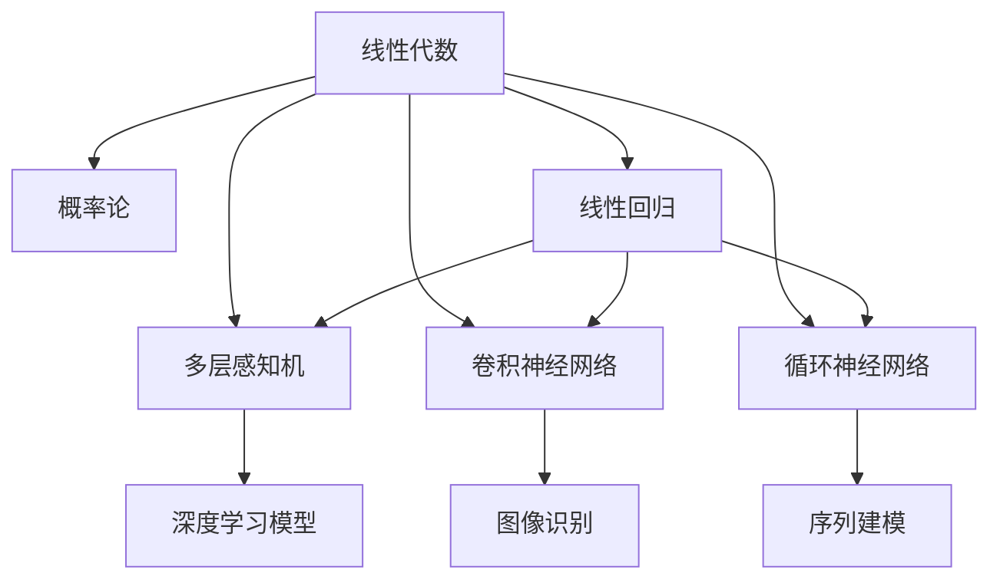

                 

## 1. 背景介绍

### 1.1 问题由来
深度学习模型中蕴含着深厚的数学理论基础，线性代数和概率论是其中最为重要的两大学科。线性代数用于描述模型的结构和数据传递，概率论则用于刻画模型的行为和预测。本文将深入讲解这两门学科在深度学习中的应用，帮助读者理解和掌握深度学习的核心数学原理。

### 1.2 问题核心关键点
深度学习中的数学基础主要围绕线性代数和概率论展开。线性代数为模型提供了参数优化、矩阵运算和特征变换等工具；概率论则构成了模型学习、训练和预测的数学基础，提供贝叶斯推断、最大似然估计、正则化等核心概念。深入理解这两门学科，能够为深度学习模型的设计和优化提供坚实的理论支撑。

## 2. 核心概念与联系

### 2.1 核心概念概述

为更好地理解线性代数和概率论在深度学习中的应用，本节将介绍几个关键的概念及其相互联系：

- **线性代数**：以向量空间、矩阵运算、特征值分析等为核心内容，描述深度学习模型中数据的表示和变换。
- **概率论**：以概率分布、贝叶斯推断、最大似然估计、正则化等为核心内容，描述深度学习模型中的学习过程和预测行为。
- **线性回归**：以梯度下降、最小二乘法等为核心内容，是深度学习中最早使用的模型之一，展示了线性代数和概率论的结合。
- **多层感知机(Multilayer Perceptron, MLP)**：是深度学习的基础模型之一，结合了线性代数中的矩阵运算和概率论中的误差函数、反向传播算法。
- **卷积神经网络(Convolutional Neural Network, CNN)**：利用线性代数中的卷积运算，对图像、语音等数据进行特征提取，体现了线性代数在数据变换中的应用。
- **循环神经网络(Recurrent Neural Network, RNN)**：通过概率论中的序列建模，捕捉时间序列数据的内在联系，展示了概率论在序列预测中的应用。

这些核心概念之间的逻辑关系可以通过以下Mermaid流程图来展示：



这个流程图展示了线性代数和概率论在深度学习中的应用脉络：

1. 线性代数和概率论构成了深度学习模型的基础。
2. 线性回归、多层感知机、卷积神经网络和循环神经网络等经典模型，分别展示了不同应用场景下的线性代数和概率论的结合。
3. 最终，这些模型的组合构成了深度学习模型的通用框架。

## 3. 核心算法原理 & 具体操作步骤

### 3.1 算法原理概述

在深度学习中，线性代数和概率论的原理通过模型参数的优化和学习过程得以体现。以下将详细阐述这一过程。

- **线性代数**：线性代数提供了矩阵、向量等数据结构，以及矩阵乘法、矩阵分解、特征值分析等数学工具，为模型参数的优化和学习提供了数学基础。
- **概率论**：概率论提供了概率分布、贝叶斯推断、最大似然估计等核心概念，用于描述模型参数的学习过程和预测行为。

### 3.2 算法步骤详解

以线性回归模型为例，详细说明线性代数和概率论在模型构建和训练过程中的应用。

**Step 1: 数据准备**
- 准备训练数据集 $(x_1, y_1), (x_2, y_2), ..., (x_n, y_n)$，其中 $x_i \in \mathbb{R}^m$ 为输入特征向量，$y_i \in \mathbb{R}$ 为输出标签。

**Step 2: 构建模型**
- 假设模型形式为 $y_i = \theta^T x_i + \epsilon_i$，其中 $\theta \in \mathbb{R}^m$ 为模型参数，$\epsilon_i$ 为随机噪声。

**Step 3: 定义损失函数**
- 定义均方误差损失函数：$\mathcal{L}(\theta) = \frac{1}{2n} \sum_{i=1}^n (y_i - \theta^T x_i)^2$。

**Step 4: 参数优化**
- 使用梯度下降算法对模型参数进行优化：$\theta_{t+1} = \theta_t - \eta \nabla_{\theta} \mathcal{L}(\theta_t)$，其中 $\eta$ 为学习率，$\nabla_{\theta} \mathcal{L}(\theta_t)$ 为损失函数对参数 $\theta$ 的梯度。

**Step 5: 迭代训练**
- 重复执行Step 3和Step 4，直至模型收敛或达到预设迭代次数。

**Step 6: 预测和评估**
- 使用训练好的模型对新数据进行预测，评估模型预测的准确性和误差。

### 3.3 算法优缺点

线性代数和概率论在深度学习中应用广泛，但也存在一些局限性：

**优点**：
- 提供强大的数学工具，支持深度学习模型的构建和优化。
- 理论和实践均经过多次验证，具有较高的可靠性和普适性。

**缺点**：
- 模型构建和优化过程较为复杂，需要较高的数学和编程能力。
- 部分模型可能需要较高的计算资源和时间，存在一定的计算瓶颈。

### 3.4 算法应用领域

线性代数和概率论在深度学习中的应用领域非常广泛，包括但不限于：

- 图像识别：通过卷积运算提取图像特征，利用线性代数和概率论进行特征组合和分类。
- 自然语言处理(NLP)：使用嵌入技术将文本转化为向量，利用线性代数和概率论进行语言建模和理解。
- 语音识别：将语音信号转换为频谱特征向量，利用线性代数和概率论进行特征提取和分类。
- 推荐系统：利用矩阵分解和概率论模型，对用户行为进行建模和预测。
- 强化学习：通过概率论中的马尔可夫决策过程和价值函数，优化智能体的策略。

## 4. 数学模型和公式 & 详细讲解 & 举例说明

### 4.1 数学模型构建

在深度学习中，线性代数和概率论的数学模型主要分为以下几个方面：

- **线性代数模型**：涉及矩阵、向量、特征值等数据结构，以及矩阵乘法、矩阵分解、特征值分析等运算。
- **概率论模型**：涉及概率分布、贝叶斯推断、最大似然估计、正则化等概念。

### 4.2 公式推导过程

以下以多层感知机(Multilayer Perceptron, MLP)为例，推导其数学模型和参数优化过程。

**多层感知机模型**
- 假设输入层有 $m$ 个神经元，隐藏层有 $h$ 个神经元，输出层有 $n$ 个神经元。
- 模型参数 $\theta$ 包括输入层到隐藏层的权重矩阵 $W_h \in \mathbb{R}^{h \times m}$，隐藏层到输出层的权重矩阵 $W_n \in \mathbb{R}^{n \times h}$，隐藏层的偏置向量 $b_h \in \mathbb{R}^{h}$ 和输出层的偏置向量 $b_n \in \mathbb{R}^{n}$。
- 模型定义如下：
  $$
  h_i = \sigma(z_i) = \sigma(W_h x_i + b_h)
  $$
  $$
  y_j = \theta_j = \sigma(z_j) = \sigma(W_n h_i + b_n)
  $$
  其中 $\sigma$ 为激活函数，如 sigmoid、ReLU 等。

**均方误差损失函数**
- 假设输出层有 $n$ 个神经元，输入和输出的真实值分别为 $x_i$ 和 $y_i$，定义均方误差损失函数：
  $$
  \mathcal{L}(\theta) = \frac{1}{2n} \sum_{i=1}^n (y_i - \theta_i)^2
  $$

**梯度下降算法**
- 使用梯度下降算法优化模型参数：
  $$
  \theta_{t+1} = \theta_t - \eta \nabla_{\theta} \mathcal{L}(\theta_t)
  $$
  其中 $\nabla_{\theta} \mathcal{L}(\theta_t)$ 为损失函数对参数 $\theta$ 的梯度，可利用反向传播算法计算。

**反向传播算法**
- 反向传播算法通过链式法则计算损失函数对模型参数的梯度：
  $$
  \frac{\partial \mathcal{L}}{\partial z_j} = \frac{\partial \mathcal{L}}{\partial \theta_j} \frac{\partial \theta_j}{\partial z_j} = \nabla_{\theta} \mathcal{L} \sigma'(z_j)
  $$
  $$
  \frac{\partial \mathcal{L}}{\partial z_i} = \frac{\partial \mathcal{L}}{\partial z_j} \frac{\partial z_j}{\partial h_i} = \frac{\partial \mathcal{L}}{\partial z_j} W_n
  $$

### 4.3 案例分析与讲解

以卷积神经网络(Convolutional Neural Network, CNN)为例，展示线性代数和概率论在图像识别中的应用。

**卷积神经网络模型**
- 卷积层利用卷积运算提取图像特征，通过卷积核 $W_k \in \mathbb{R}^{k \times k \times c \times m}$ 和偏置向量 $b_k \in \mathbb{R}^{k \times k \times 1 \times m}$，对输入特征图 $x_i \in \mathbb{R}^{d \times d \times c}$ 进行卷积运算：
  $$
  y_k = W_k * x_i + b_k
  $$
- 池化层利用最大池化或平均池化对特征图进行降维：
  $$
  y_l = \max_{i,j} y_k[i,j]
  $$

**图像分类任务**
- 假设输出层有 $n$ 个神经元，输入和输出的真实值分别为 $x_i$ 和 $y_i$，定义均方误差损失函数：
  $$
  \mathcal{L}(\theta) = \frac{1}{2n} \sum_{i=1}^n (y_i - \theta_i)^2
  $$

**梯度下降算法**
- 使用梯度下降算法优化模型参数：
  $$
  \theta_{t+1} = \theta_t - \eta \nabla_{\theta} \mathcal{L}(\theta_t)
  $$
  其中 $\nabla_{\theta} \mathcal{L}(\theta_t)$ 为损失函数对参数 $\theta$ 的梯度，可利用反向传播算法计算。

**反向传播算法**
- 反向传播算法通过链式法则计算损失函数对模型参数的梯度：
  $$
  \frac{\partial \mathcal{L}}{\partial W_k} = \nabla_{\theta} \mathcal{L} \sum_{i,j} x_i[i,j] y_k[i,j]
  $$
  $$
  \frac{\partial \mathcal{L}}{\partial b_k} = \nabla_{\theta} \mathcal{L}
  $$

## 5. 项目实践：代码实例和详细解释说明

### 5.1 开发环境搭建

在进行深度学习项目实践前，我们需要准备好开发环境。以下是使用Python进行TensorFlow和Keras开发的Python虚拟环境配置流程：

1. 安装Anaconda：从官网下载并安装Anaconda，用于创建独立的Python环境。

2. 创建并激活虚拟环境：
```bash
conda create -n tensorflow-env python=3.7
conda activate tensorflow-env
```

3. 安装TensorFlow和Keras：
```bash
conda install tensorflow keras
```

4. 安装各类工具包：
```bash
pip install numpy pandas scikit-learn matplotlib tqdm jupyter notebook ipython
```

完成上述步骤后，即可在`tensorflow-env`环境中开始深度学习项目实践。

### 5.2 源代码详细实现

下面我们以线性回归模型为例，给出使用Keras进行构建和训练的PyTorch代码实现。

```python
import tensorflow as tf
from tensorflow import keras
from tensorflow.keras import layers

# 准备数据
x_train = np.array([[1, 2], [2, 3], [3, 4], [4, 5], [5, 6]])
y_train = np.array([2, 3, 4, 5, 6])
x_test = np.array([[10, 20], [20, 30]])
y_test = np.array([20, 30])

# 定义模型
model = keras.Sequential([
    layers.Dense(1, input_dim=2)
])

# 编译模型
model.compile(optimizer=tf.train.AdamOptimizer(learning_rate=0.01), 
              loss='mse', metrics=['mae'])

# 训练模型
model.fit(x_train, y_train, epochs=100, verbose=0)

# 预测并评估模型
y_pred = model.predict(x_test)
print('Mean Absolute Error:', keras.metrics.mean_absolute_error(y_test, y_pred))
```

以上代码展示了使用TensorFlow和Keras进行线性回归模型训练和评估的完整过程。

### 5.3 代码解读与分析

让我们再详细解读一下关键代码的实现细节：

**数据准备**
- `x_train`, `y_train`, `x_test`, `y_test` 分别表示训练集和测试集的数据。

**模型定义**
- 使用Keras的 `Sequential` 模型定义一层全连接层，其中 `Dense(1, input_dim=2)` 表示输入维度为2，输出维度为1的线性层。

**模型编译**
- 使用 `AdamOptimizer` 优化器，学习率为0.01，均方误差损失函数，均方误差作为评估指标。

**模型训练**
- 使用 `fit` 方法进行模型训练，训练100个epoch，不输出训练过程。

**模型评估**
- 使用 `predict` 方法对测试集进行预测，并计算均方误差。

## 6. 实际应用场景

### 6.1 图像识别

卷积神经网络(CNN)在图像识别领域表现出色，利用线性代数中的卷积运算和矩阵分解技术，对图像进行特征提取和分类。典型的应用包括物体识别、人脸识别、医疗影像分析等。

### 6.2 自然语言处理(NLP)

通过嵌入技术将文本转化为向量，利用线性代数中的矩阵运算和概率论中的语言模型，对文本进行理解、生成和分类。典型的应用包括机器翻译、文本摘要、情感分析等。

### 6.3 语音识别

将语音信号转换为频谱特征向量，利用线性代数中的矩阵运算和概率论中的序列建模，对语音进行特征提取和分类。典型的应用包括语音识别、语音合成、语音情感识别等。

### 6.4 推荐系统

利用矩阵分解和概率论模型，对用户行为进行建模和预测，推荐合适的商品或服务。典型的应用包括电商推荐、视频推荐、新闻推荐等。

### 6.5 强化学习

通过概率论中的马尔可夫决策过程和价值函数，优化智能体的策略，实现自动驾驶、机器人控制等应用。

## 7. 工具和资源推荐

### 7.1 学习资源推荐

为了帮助开发者系统掌握深度学习中的数学基础，这里推荐一些优质的学习资源：

1. 《Deep Learning》系列书籍：由Ian Goodfellow、Yoshua Bengio和Aaron Courville联合撰写，全面介绍了深度学习的理论基础和实践方法。

2. CS231n《深度学习与计算机视觉》课程：斯坦福大学开设的深度学习课程，包含大量实战项目，适合实战练习。

3. CS224n《自然语言处理与深度学习》课程：斯坦福大学开设的NLP课程，涵盖深度学习在NLP中的应用，适合理论学习。

4. Kaggle：数据科学竞赛平台，包含大量深度学习项目和数据集，适合项目实践和经验积累。

5. GitHub：开源社区，包含大量深度学习项目的源代码和文档，适合学习和借鉴。

通过这些资源的学习实践，相信你一定能够全面掌握深度学习中的数学基础，并应用于实际项目中。

### 7.2 开发工具推荐

高效的开发离不开优秀的工具支持。以下是几款用于深度学习开发的常用工具：

1. TensorFlow：由Google主导开发的开源深度学习框架，生产部署方便，适合大规模工程应用。

2. PyTorch：由Facebook开发的开源深度学习框架，灵活高效，适合研究和原型开发。

3. Keras：Keras提供了高级API，使得深度学习模型的构建更加简洁和快速，适合快速迭代开发。

4. Weights & Biases：模型训练的实验跟踪工具，可以记录和可视化模型训练过程中的各项指标，方便对比和调优。

5. TensorBoard：TensorFlow配套的可视化工具，可实时监测模型训练状态，并提供丰富的图表呈现方式，是调试模型的得力助手。

6. Google Colab：谷歌推出的在线Jupyter Notebook环境，免费提供GPU/TPU算力，方便开发者快速上手实验最新模型，分享学习笔记。

合理利用这些工具，可以显著提升深度学习项目开发效率，加快创新迭代的步伐。

### 7.3 相关论文推荐

深度学习中的数学基础研究源于学界的持续研究。以下是几篇奠基性的相关论文，推荐阅读：

1. He et al., "Delving deep into rectifiers: Surpassing human-level performance on ImageNet classification", ICLR 2016。

2. LeCun et al., "Gradient-based learning applied to document recognition", Proceedings of the IEEE, 1998。

3. Hinton et al., "A fast learning algorithm for deep belief nets", Neural Computation, 2006。

4. Kingma et al., "Adam: A method for stochastic optimization", Journal of Machine Learning Research, 2015。

5. Goodfellow et al., "Generative Adversarial Nets", NIPS 2014。

这些论文代表了大深度学习的发展脉络。通过学习这些前沿成果，可以帮助研究者把握学科前进方向，激发更多的创新灵感。

## 8. 总结：未来发展趋势与挑战

### 8.1 总结

本文对深度学习中的数学基础进行了全面系统的介绍。首先阐述了线性代数和概率论在深度学习中的应用背景和重要性，明确了其在模型构建和训练中的核心作用。其次，从原理到实践，详细讲解了线性代数和概率论在深度学习中的算法原理和具体操作步骤。同时，本文还探讨了线性代数和概率论在实际应用场景中的广泛应用，展示了其深厚的数学底蕴。

通过本文的系统梳理，可以看到，线性代数和概率论在深度学习中扮演着不可或缺的角色。它们不仅提供了强大的数学工具，支持模型优化和训练，还构成了模型学习、预测和推理的数学基础，为深度学习模型提供理论支撑。随着深度学习的不断发展，线性代数和概率论的理论研究也将不断深入，推动模型性能和应用范围的提升。

### 8.2 未来发展趋势

展望未来，线性代数和概率论在深度学习中的应用将继续深化：

1. 模型复杂度提升。未来，随着深度学习模型的规模和复杂度不断提高，线性代数和概率论在模型设计和优化中的作用将更加重要。

2. 理论与实践融合。线性代数和概率论的理论研究将更加紧密地与深度学习实践相结合，为模型的优化和改进提供更多数学依据。

3. 新模型和新算法。线性代数和概率论将不断创新，涌现更多高效、鲁棒的深度学习模型和算法，提高模型性能和泛化能力。

4. 跨学科融合。线性代数和概率论与其他学科（如机器学习、计算机视觉、自然语言处理等）的融合将更加深入，推动多学科的协同发展。

5. 应用场景拓展。线性代数和概率论在更多领域的应用将不断拓展，如智能交通、金融科技、医疗健康等，为现实世界的复杂问题提供解决方案。

以上趋势凸显了线性代数和概率论在深度学习中的巨大潜力。这些方向的探索发展，必将进一步提升深度学习模型的性能和应用范围，为人类认知智能的进化带来深远影响。

### 8.3 面临的挑战

尽管线性代数和概率论在深度学习中取得了显著成果，但也面临着一些挑战：

1. 理论瓶颈。现有理论尚难以全面解释深度学习模型中的复杂现象，存在一些尚未解决的理论问题。

2. 计算瓶颈。大模型的训练和推理需要巨大的计算资源，线性代数和概率论的复杂性也带来计算效率问题。

3. 应用复杂性。线性代数和概率论在实际应用中的复杂性，导致部分算法难以在实际工程中落地。

4. 数据需求。深度学习模型需要大量高质量的数据，线性代数和概率论的数学表达可能限制数据处理的灵活性。

5. 可解释性。深度学习模型的"黑盒"特性导致其难以解释，线性代数和概率论的数学表达也存在一定局限性。

6. 安全性。深度学习模型可能存在安全漏洞，线性代数和概率论的数学表达也可能受到攻击。

正视这些挑战，积极应对并寻求突破，将是线性代数和概率论未来发展的关键。只有勇于创新、敢于突破，才能不断拓展深度学习的边界，让模型更好地服务于现实世界。

### 8.4 研究展望

面对线性代数和概率论在深度学习中面临的挑战，未来的研究需要在以下几个方面寻求新的突破：

1. 探索新的数学工具和方法。开发更高效、更灵活的数学工具，支持更复杂、更高效的深度学习模型。

2. 改进算法和优化技术。研究更高效、更鲁棒的算法和优化技术，提高模型的训练效率和泛化能力。

3. 加强理论研究。深入研究线性代数和概率论的理论基础，探索更多新的数学理论和方法。

4. 融合跨学科知识。将线性代数和概率论与其他学科的知识进行融合，推动跨学科的协同创新。

5. 关注实际应用。深入研究深度学习模型在实际应用中的问题，开发更多具有实用价值的深度学习模型和算法。

这些研究方向将引领线性代数和概率论的不断发展，为深度学习技术的未来进步提供更多动力。

## 9. 附录：常见问题与解答

**Q1: 线性代数和概率论在深度学习中的作用是什么？**

A: 线性代数为深度学习模型提供了数据结构、数学工具和计算方法，支持模型的构建和优化。概率论构成了模型学习、训练和预测的数学基础，提供贝叶斯推断、最大似然估计、正则化等核心概念。

**Q2: 线性代数和概率论在深度学习中如何应用？**

A: 线性代数在深度学习中的应用主要包括矩阵运算、卷积运算、矩阵分解等，支持模型的构建和优化。概率论在深度学习中的应用主要包括概率分布、贝叶斯推断、最大似然估计等，支持模型的学习、训练和预测。

**Q3: 线性代数和概率论在实际应用中面临哪些挑战？**

A: 线性代数和概率论在实际应用中面临计算效率、模型复杂性、数据需求、可解释性、安全性等挑战，需要在理论和实践上进行深入研究。

**Q4: 线性代数和概率论未来可能的发展方向是什么？**

A: 未来，线性代数和概率论将在模型复杂度提升、理论研究、算法优化、跨学科融合等方面继续发展，推动深度学习技术的进步。

**Q5: 如何提高深度学习模型的可解释性？**

A: 提高深度学习模型的可解释性需要结合多学科知识，如符号推理、因果推断、逻辑推理等，同时开发更多可解释性的模型和算法，如符号执行模型、因果解释模型等。

作者：禅与计算机程序设计艺术 / Zen and the Art of Computer Programming

