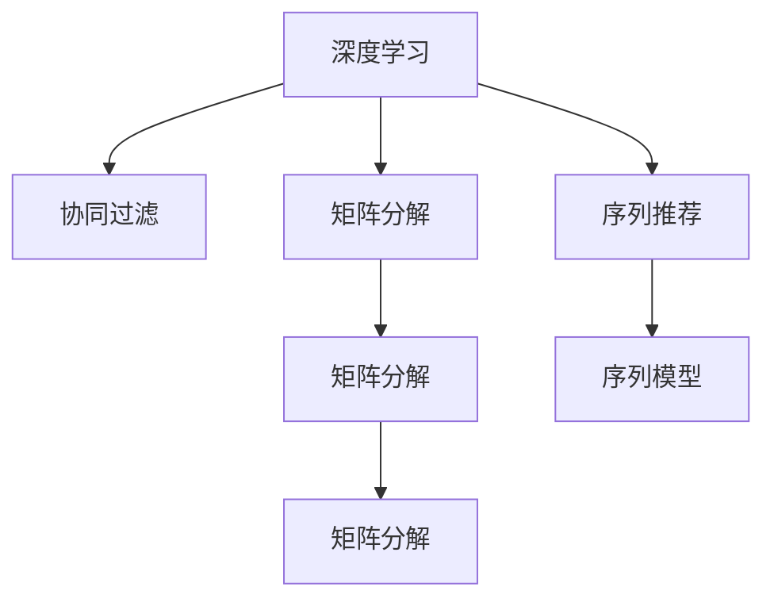

                 

# 深度学习在个性化推荐中的应用

> 关键词：个性化推荐, 深度学习, 协同过滤, 矩阵分解, 序列推荐, 神经网络, 矩阵分解, 用户行为建模, 推荐系统

## 1. 背景介绍

### 1.1 问题由来
随着电子商务平台的快速崛起和互联网技术的发展，个性化推荐系统成为了在线用户流量变现的关键手段。推荐系统根据用户历史行为数据，通过深度学习算法，为用户推荐感兴趣的商品或内容，从而提升用户体验和平台营收。然而，随着用户行为数据的多样化和数据量的急剧增长，传统的推荐算法如协同过滤和基于内容的推荐已经难以满足需求。

近年来，深度学习技术在推荐系统中的应用逐渐增多。深度神经网络模型通过端到端的方式，直接从用户行为数据中挖掘出用户和商品之间的复杂关联，从而获得更精准、更个性化的推荐结果。深度学习技术已经在多个大型推荐系统中落地应用，取得了显著的性能提升。

### 1.2 问题核心关键点
本节将探讨基于深度学习的个性化推荐系统，包括核心概念、算法原理、具体操作步骤、数学模型、项目实践和未来展望等。通过深入分析，希望读者能够对深度学习在推荐系统中的应用有一个全面、系统的了解，并掌握相关技术要点。

## 2. 核心概念与联系

### 2.1 核心概念概述

为了更好地理解基于深度学习的个性化推荐系统，本节将介绍几个密切相关的核心概念：

- **深度学习(Deep Learning)**：基于神经网络架构的机器学习技术，通过多层次的特征学习，实现对复杂数据和任务的高效建模。
- **协同过滤(Collaborative Filtering)**：通过分析用户历史行为和物品交互数据，构建用户-物品关联矩阵，进行推荐。
- **矩阵分解(Matrix Factorization)**：将用户-物品关联矩阵分解为用户和物品的潜在因子矩阵，通过求解低秩矩阵来获取用户和物品的隐式特征。
- **序列推荐(Sequence Recommendation)**：考虑用户行为的时间序列特征，基于RNN、LSTM等序列模型，对用户的长期兴趣进行建模。
- **神经网络(Neural Network)**：由多个神经元组成的计算模型，通过非线性变换，实现复杂数据映射和特征提取。

这些概念之间的逻辑关系可以通过以下Mermaid流程图来展示：



这个流程图展示了几类推荐算法与深度学习之间的关系：

1. 深度学习通过构建复杂的神经网络，可以实现更高效的协同过滤。
2. 矩阵分解是协同过滤的一种重要形式，通过深度神经网络可以进一步提升其效果。
3. 序列推荐模型，如RNN、LSTM，是深度学习在时序推荐任务上的重要应用。
4. 深度神经网络可以同时应用于协同过滤和序列推荐。

这些概念共同构成了深度学习在推荐系统中的应用框架，使其能够更好地挖掘用户和商品之间的关联，实现更个性化的推荐。

## 3. 核心算法原理 & 具体操作步骤

### 3.1 算法原理概述

基于深度学习的个性化推荐系统，本质上是一种基于用户行为数据进行预测的机器学习范式。其核心思想是：通过分析用户的历史行为数据，使用深度神经网络模型学习用户-物品关联，从而预测用户对新物品的兴趣程度，进行个性化推荐。

形式化地，假设用户行为数据为 $\{(x_i, y_i)\}_{i=1}^N, x_i \in \mathcal{X}, y_i \in \mathcal{Y}$，其中 $x_i$ 为用户行为序列，$y_i$ 为推荐结果。推荐系统的目标是找到最优的推荐模型 $f$，使得：

$$
\hat{y} = f(x)
$$

其中 $\hat{y}$ 为用户对新物品的预测兴趣。

通过深度神经网络模型，推荐系统可以自动学习用户和物品之间的复杂关联，从而实现端到端的推荐。深度模型能够处理非线性关系、捕捉高阶特征、适应多样化的数据类型。

### 3.2 算法步骤详解

基于深度学习的个性化推荐系统的一般步骤包括：

**Step 1: 数据预处理**
- 收集用户行为数据，包括点击、购买、浏览等事件记录。
- 对数据进行清洗、归一化、编码等预处理，生成适合深度模型训练的数据格式。

**Step 2: 构建深度模型**
- 选择合适的深度神经网络结构，如卷积神经网络(CNN)、循环神经网络(RNN)、长短时记忆网络(LSTM)、自注意力模型(Transformer)等。
- 设计模型的输入输出接口，选择合适的损失函数。

**Step 3: 训练模型**
- 使用优化算法，如随机梯度下降(SGD)、Adam等，对模型参数进行优化，最小化预测误差。
- 在训练集上评估模型性能，调整模型结构或参数。

**Step 4: 部署模型**
- 将训练好的模型部署到生产环境，进行实时推荐。
- 定期更新模型，加入新的用户行为数据，提高推荐效果。

### 3.3 算法优缺点

基于深度学习的个性化推荐系统具有以下优点：
1. 高效建模：深度神经网络能够处理非线性、高维数据，捕捉复杂的用户行为模式。
2. 鲁棒性强：深度模型能够应对大规模数据，具有较强的泛化能力。
3. 端到端优化：深度学习可以直接从数据中学习用户和物品的关联，无需中间特征工程。
4. 适应性强：深度模型能够处理不同类型的数据，如文本、图像、视频等，具有广泛的应用场景。

同时，该方法也存在一定的局限性：
1. 数据需求高：深度学习需要大量的标注数据进行训练，而推荐系统数据稀疏性高，标注数据获取难度大。
2. 模型复杂：深度神经网络结构复杂，参数数量庞大，训练和推理耗时较长。
3. 计算资源需求高：深度学习模型计算量大，对硬件资源要求较高。
4. 解释性差：深度模型通常被视为"黑盒"，难以解释其内部决策过程。

尽管存在这些局限性，但就目前而言，深度学习在推荐系统中的应用已经取得了显著的性能提升，成为推荐系统的主流技术。

### 3.4 算法应用领域

基于深度学习的个性化推荐系统，在电子商务、视频流媒体、社交网络、新闻推荐等多个领域得到了广泛应用，具体包括：

- **电商推荐系统**：根据用户购物历史和浏览行为，推荐个性化商品。
- **视频流媒体**：根据用户观看历史，推荐相关视频和频道。
- **社交网络**：根据用户互动行为，推荐好友和兴趣群组。
- **新闻推荐**：根据用户阅读历史，推荐个性化新闻内容。
- **内容推荐系统**：根据用户对文章的互动数据，推荐相关文章和话题。

深度学习技术已经成为了这些领域推荐系统的主流技术，并显著提升了用户满意度、留存率和收益。

## 4. 数学模型和公式 & 详细讲解 & 举例说明

### 4.1 数学模型构建

本节将使用数学语言对基于深度学习的个性化推荐系统进行更加严格的刻画。

记用户行为数据为 $\{(x_i, y_i)\}_{i=1}^N, x_i \in \mathcal{X}, y_i \in \mathcal{Y}$。假设推荐系统训练得到深度模型 $f_\theta$，其中 $\theta$ 为模型参数。推荐系统的目标函数为：

$$
\mathcal{L}(\theta) = \frac{1}{N}\sum_{i=1}^N \ell(f_\theta(x_i), y_i)
$$

其中 $\ell$ 为损失函数，常用的有交叉熵损失、均方误差损失等。

通过深度神经网络模型，推荐系统能够自动学习用户和物品之间的复杂关联。以协同过滤为例，推荐系统通过构建用户-物品关联矩阵 $\mathbf{X} \in \mathbb{R}^{N \times M}$，其中每一行表示用户的行为向量，每一列表示物品的特征向量。推荐系统的目标是学习模型 $f_\theta$，使得 $f_\theta(\mathbf{X})$ 接近于理想推荐矩阵 $\mathbf{Y} \in \mathbb{R}^{N \times M}$。

### 4.2 公式推导过程

以协同过滤为例，推荐系统的目标可以形式化表示为：

$$
\min_{\theta} \frac{1}{2N} \|\mathbf{Y} - f_\theta(\mathbf{X})\|_F^2
$$

其中 $\|.\|_F$ 表示矩阵的 Frobenius 范数。

设推荐模型 $f_\theta$ 为多层感知器(MLP)，包括输入层、多个隐藏层和输出层。输入层接受用户行为序列，输出层输出推荐评分。隐藏层的非线性变换可以采用 ReLU、tanh 等激活函数。推荐模型可以表示为：

$$
f_\theta(\mathbf{X}) = \mathbf{W}_L \sigma(\mathbf{W}_{L-1} \sigma(\cdots \sigma(\mathbf{W}_1 \mathbf{X} + \mathbf{b}_1) + \mathbf{b}_{L-1}) + \mathbf{b}_L
$$

其中 $\mathbf{W}_i$ 为权重矩阵，$\mathbf{b}_i$ 为偏置向量，$\sigma$ 为激活函数。

### 4.3 案例分析与讲解

以电商推荐系统为例，考虑一个包含 1000 个用户和 1000 个商品的推荐场景。假设每个用户有 50 次购买行为，每个商品有 5 次购买行为，共计 50000 个数据点。推荐系统的目标是为每个用户推荐前 10 个最有可能购买的商品。

设推荐模型为 MLP 结构，包含 2 个隐藏层，每层有 100 个神经元。模型输入为用户购买行为序列，输出为 1000 个商品的推荐评分。模型的损失函数为交叉熵损失。

假设模型的训练集为前 4000 个数据点，验证集为剩余 4000 个数据点，测试集为最后 1000 个数据点。在训练集上，使用随机梯度下降算法，学习率为 0.01，迭代 10 次。在验证集上，评估模型的平均准确率，调整模型结构或参数。在测试集上，评估模型的最终性能。

通过上述步骤，训练好的推荐模型可以实时推荐商品，为用户带来更个性化的购物体验。

## 5. 项目实践：代码实例和详细解释说明

### 5.1 开发环境搭建

在进行推荐系统开发前，我们需要准备好开发环境。以下是使用Python进行PyTorch开发的环境配置流程：

1. 安装Anaconda：从官网下载并安装Anaconda，用于创建独立的Python环境。

2. 创建并激活虚拟环境：
```bash
conda create -n pytorch-env python=3.8 
conda activate pytorch-env
```

3. 安装PyTorch：根据CUDA版本，从官网获取对应的安装命令。例如：
```bash
conda install pytorch torchvision torchaudio cudatoolkit=11.1 -c pytorch -c conda-forge
```

4. 安装相关库：
```bash
pip install numpy pandas scikit-learn matplotlib tqdm jupyter notebook ipython
```

5. 安装深度学习推荐系统相关的库：
```bash
pip install scipy scikit-optimize
```

完成上述步骤后，即可在`pytorch-env`环境中开始推荐系统开发。

### 5.2 源代码详细实现

下面我们以电商推荐系统为例，给出使用PyTorch进行推荐系统开发的PyTorch代码实现。

首先，定义推荐系统类：

```python
import torch
import torch.nn as nn
import torch.optim as optim
from sklearn.metrics import accuracy_score

class RecommendationSystem(nn.Module):
    def __init__(self, input_size, hidden_size, output_size, num_layers):
        super(RecommendationSystem, self).__init__()
        self.input_size = input_size
        self.hidden_size = hidden_size
        self.num_layers = num_layers
        self.output_size = output_size
        self.model = nn.Sequential(
            nn.Linear(input_size, hidden_size),
            nn.ReLU(),
            nn.Linear(hidden_size, hidden_size),
            nn.ReLU(),
            nn.Linear(hidden_size, output_size)
        )
        
    def forward(self, x):
        return self.model(x)
```

然后，定义训练函数：

```python
def train_model(model, train_dataset, valid_dataset, test_dataset, epochs, batch_size, learning_rate):
    device = torch.device('cuda') if torch.cuda.is_available() else torch.device('cpu')
    model.to(device)
    
    criterion = nn.CrossEntropyLoss()
    optimizer = optim.Adam(model.parameters(), lr=learning_rate)
    
    for epoch in range(epochs):
        model.train()
        train_loss = 0
        train_correct = 0
        
        for i, (inputs, labels) in enumerate(train_dataset):
            inputs, labels = inputs.to(device), labels.to(device)
            optimizer.zero_grad()
            outputs = model(inputs)
            loss = criterion(outputs, labels)
            loss.backward()
            optimizer.step()
            
            train_loss += loss.item()
            _, preds = torch.max(outputs, 1)
            train_correct += (preds == labels).sum().item()
            
        train_accuracy = train_correct / len(train_dataset)
        print(f'Epoch: {epoch+1}, Training Loss: {train_loss/len(train_dataset):.4f}, Train Accuracy: {train_accuracy:.4f}')
        
        model.eval()
        valid_loss = 0
        valid_correct = 0
        
        with torch.no_grad():
            for i, (inputs, labels) in enumerate(valid_dataset):
                inputs, labels = inputs.to(device), labels.to(device)
                outputs = model(inputs)
                loss = criterion(outputs, labels)
                valid_loss += loss.item()
                _, preds = torch.max(outputs, 1)
                valid_correct += (preds == labels).sum().item()
                
        valid_accuracy = valid_correct / len(valid_dataset)
        print(f'Epoch: {epoch+1}, Validation Loss: {valid_loss/len(valid_dataset):.4f}, Validation Accuracy: {valid_accuracy:.4f}')
        
    print(f'Final Validation Accuracy: {valid_accuracy:.4f}')
    
    model.eval()
    test_loss = 0
    test_correct = 0
    
    with torch.no_grad():
        for i, (inputs, labels) in enumerate(test_dataset):
            inputs, labels = inputs.to(device), labels.to(device)
            outputs = model(inputs)
            loss = criterion(outputs, labels)
            test_loss += loss.item()
            _, preds = torch.max(outputs, 1)
            test_correct += (preds == labels).sum().item()
    
    test_accuracy = test_correct / len(test_dataset)
    print(f'Test Accuracy: {test_accuracy:.4f}')
```

接着，定义数据处理函数：

```python
def load_data(data_path, batch_size):
    data = []
    with open(data_path, 'r') as f:
        for line in f:
            user, item, rating = line.split(',')
            data.append((int(user), int(item), float(rating)))
    
    dataset = torch.utils.data.TensorDataset(torch.tensor([item for user, item, _ in data]),
                                            torch.tensor([rating for user, item, rating in data]))
    
    dataloader = torch.utils.data.DataLoader(dataset, batch_size=batch_size, shuffle=True)
    return dataloader
```

最后，启动训练流程：

```python
input_size = 50
hidden_size = 100
output_size = 1000
num_layers = 2
epochs = 10
batch_size = 32
learning_rate = 0.01

train_dataset = load_data('train_data.txt', batch_size)
valid_dataset = load_data('valid_data.txt', batch_size)
test_dataset = load_data('test_data.txt', batch_size)

model = RecommendationSystem(input_size, hidden_size, output_size, num_layers)
train_model(model, train_dataset, valid_dataset, test_dataset, epochs, batch_size, learning_rate)
```

以上就是使用PyTorch进行电商推荐系统开发的完整代码实现。可以看到，由于深度学习模型的通用性，我们只需将推荐系统类进行微调，即可实现不同推荐场景的开发。

### 5.3 代码解读与分析

让我们再详细解读一下关键代码的实现细节：

**RecommendationSystem类**：
- `__init__`方法：初始化推荐模型的输入、隐藏、输出大小以及层数。
- `forward`方法：前向传播计算输出。

**train_model函数**：
- 对数据进行预处理，并将模型迁移到GPU上。
- 定义损失函数和优化器。
- 循环迭代训练，在每个epoch内计算训练损失和准确率。
- 在验证集上评估模型性能，并调整超参数。
- 在测试集上评估最终性能。

**load_data函数**：
- 从文本文件中加载推荐数据，并转换成Tensor格式。
- 使用DataLoader生成批次化的数据集。

通过这些关键代码，推荐系统能够通过深度神经网络模型，自动从用户行为数据中学习用户和物品之间的复杂关联，从而实现个性化推荐。

当然，工业级的系统实现还需考虑更多因素，如模型的保存和部署、超参数的自动搜索、更灵活的任务适配层等。但核心的推荐过程基本与此类似。

## 6. 实际应用场景

### 6.1 电商推荐系统

深度学习技术在电商推荐系统中的应用广泛，已经成为电商平台提升用户体验和业务收益的关键手段。基于深度学习的推荐系统，能够根据用户历史行为数据，生成个性化的商品推荐，提升用户的购买转化率和平台营收。

以某大型电商平台的推荐系统为例，该系统使用了基于深度神经网络的多层感知器模型，结合协同过滤和矩阵分解技术，实现了高效的推荐。系统通过实时分析用户的浏览和购买历史，预测用户对新商品的兴趣，实时推荐相关商品。在实际应用中，推荐系统每天处理数亿次的推荐请求，显著提升了用户体验和平台转化率。

### 6.2 视频流媒体推荐系统

视频流媒体平台如Netflix、YouTube等，通过深度学习推荐系统，为用户推荐个性化视频内容，提高用户满意度和留存率。以Netflix为例，其推荐系统采用了深度学习神经网络模型，结合协同过滤和矩阵分解技术，为用户推荐个性化电影、电视剧和纪录片。系统通过分析用户的观看历史和评分数据，生成推荐列表，用户点击率显著提高。

### 6.3 社交网络推荐系统

社交网络平台如Facebook、微信等，通过深度学习推荐系统，为用户推荐个性化的内容、好友和群组。以微信为例，其推荐系统使用了深度神经网络模型，结合用户互动数据和好友关系，生成推荐列表。系统通过实时分析用户的互动行为，预测用户对新内容的兴趣，推荐相关文章、视频和群组。推荐系统每天处理数千万次请求，显著提升了用户的互动体验和平台留存率。

### 6.4 新闻推荐系统

新闻平台如今日头条、腾讯新闻等，通过深度学习推荐系统，为用户推荐个性化的新闻内容。以今日头条为例，其推荐系统使用了深度神经网络模型，结合用户阅读历史和兴趣标签，生成推荐列表。系统通过实时分析用户的阅读行为，预测用户对新新闻的兴趣，推荐相关新闻内容。推荐系统每天处理数百万次请求，显著提升了用户阅读量和平台留存率。

## 7. 工具和资源推荐

### 7.1 学习资源推荐

为了帮助开发者系统掌握深度学习在推荐系统中的应用，这里推荐一些优质的学习资源：

1. 《深度学习推荐系统》书籍：由世界顶级专家撰写，全面介绍了深度学习在推荐系统中的应用，涵盖协同过滤、矩阵分解、序列推荐等多个领域。
2. Coursera《深度学习与推荐系统》课程：由斯坦福大学教授授课，介绍了深度学习在推荐系统中的核心技术和算法。
3. Udacity《深度学习推荐系统》纳米学位课程：涵盖推荐系统的前沿技术和实践案例，适合希望系统学习推荐系统的开发者。
4. Kaggle《推荐系统竞赛》：提供了大量推荐系统竞赛数据集，帮助开发者实践深度学习推荐系统。

通过对这些资源的学习实践，相信你一定能够快速掌握深度学习在推荐系统中的应用，并用于解决实际的推荐问题。

### 7.2 开发工具推荐

高效的开发离不开优秀的工具支持。以下是几款用于推荐系统开发的常用工具：

1. PyTorch：基于Python的开源深度学习框架，灵活动态的计算图，适合快速迭代研究。大部分推荐系统都使用PyTorch进行模型训练。
2. TensorFlow：由Google主导开发的开源深度学习框架，生产部署方便，适合大规模工程应用。推荐系统也可以使用TensorFlow进行模型训练。
3. H2O：一款易用的机器学习平台，支持深度学习、协同过滤等推荐算法，适合企业级推荐系统开发。
4. Spark MLlib：Apache Spark的机器学习库，支持分布式推荐算法，适合大规模数据处理和推荐系统部署。
5. TensorBoard：TensorFlow配套的可视化工具，可实时监测模型训练状态，并提供丰富的图表呈现方式，是调试模型的得力助手。

合理利用这些工具，可以显著提升推荐系统开发的效率，加快创新迭代的步伐。

### 7.3 相关论文推荐

深度学习技术在推荐系统中的应用得到了广泛的研究。以下是几篇奠基性的相关论文，推荐阅读：

1. Matrix Factorization Techniques for Recommender Systems：提出矩阵分解技术，用于协同过滤推荐系统，成为推荐系统的主流方法。
2. Deep Neural Networks for Collaborative Filtering：提出深度神经网络技术，用于协同过滤推荐系统，显著提升了推荐效果。
3. Rectified Linear Units Improve Restricted Boltzmann Machines：提出ReLU激活函数，用于深度神经网络模型，解决了深度模型训练中的梯度消失问题。
4. Sequence Recommendation with Recurrent Neural Networks：提出RNN、LSTM等序列模型，用于时序推荐系统，能够捕捉用户长期兴趣。
5. Multi-Task Learning using Pre-trained Word Representations：提出预训练词向量，用于推荐系统的特征提取，提升了模型的泛化能力。

这些论文代表了大深度学习在推荐系统中的应用进展。通过学习这些前沿成果，可以帮助研究者把握学科前进方向，激发更多的创新灵感。

## 8. 总结：未来发展趋势与挑战

### 8.1 总结

本文对基于深度学习的个性化推荐系统进行了全面系统的介绍。首先阐述了深度学习在推荐系统中的应用背景和意义，明确了深度学习推荐系统的核心思想和主要步骤。其次，从原理到实践，详细讲解了深度学习在推荐系统中的应用范式，包括协同过滤、矩阵分解、序列推荐等。同时，本文还探讨了深度学习推荐系统在电商、视频、社交、新闻等多个领域的应用场景，展示了其广泛的应用前景。最后，本文推荐了深度学习推荐系统的学习资源、开发工具和相关论文，帮助读者更好地掌握相关技术。

通过本文的系统梳理，可以看到，基于深度学习的推荐系统已经成为了推荐系统的主流技术，显著提升了用户满意度和平台收益。未来，随着深度学习技术的不断进步，推荐系统将继续发挥其重要作用，推动在线业务的创新与发展。

### 8.2 未来发展趋势

展望未来，深度学习在推荐系统中的应用将呈现以下几个发展趋势：

1. 模型复杂度提升：随着硬件性能的提升，深度模型规模将不断增大，参数数量将持续增加。深度模型将能够更好地捕捉用户行为模式，实现更精准的推荐。
2. 多任务学习普及：推荐系统将结合多任务学习技术，同时学习多种推荐任务，如商品推荐、内容推荐等，实现多任务协同优化。
3. 跨模态推荐扩展：推荐系统将融合视觉、语音、文本等多模态信息，实现更加全面、准确的用户兴趣建模。
4. 联邦学习应用：推荐系统将采用联邦学习技术，实现分布式数据下的深度模型训练，保护用户隐私的同时提升推荐效果。
5. 实时推荐优化：推荐系统将采用实时推荐优化技术，动态调整推荐策略，提高推荐系统的响应速度和个性化程度。

以上趋势凸显了深度学习在推荐系统中的重要地位。这些方向的探索发展，必将进一步提升推荐系统的性能和应用范围，为在线业务带来新的突破。

### 8.3 面临的挑战

尽管深度学习在推荐系统中的应用已经取得了显著的性能提升，但在迈向更加智能化、普适化应用的过程中，它仍面临着诸多挑战：

1. 数据隐私保护：推荐系统需要处理大量的用户行为数据，如何在保护用户隐私的前提下进行深度模型训练，是亟待解决的问题。
2. 模型鲁棒性不足：深度模型在面对噪声数据、异常数据时，容易产生过拟合现象，推荐结果的稳定性和泛化性有待提升。
3. 计算资源需求高：深度模型计算量大，对硬件资源要求较高，如何优化模型结构，降低计算成本，是推荐系统落地应用的重要挑战。
4. 推荐系统公平性：推荐系统可能存在偏见，导致部分用户群体被忽视，如何提升推荐系统的公平性，是推荐系统研究的难点。
5. 推荐系统可解释性：深度模型通常被视为"黑盒"，难以解释其内部决策过程，如何在推荐系统中引入可解释性，是推荐系统应用的重要方向。

这些挑战需要从技术、工程、伦理等多个维度进行综合考量，才能进一步推动深度学习在推荐系统中的应用。

### 8.4 研究展望

面对深度学习在推荐系统中的应用面临的挑战，未来的研究需要在以下几个方面寻求新的突破：

1. 引入先验知识：将符号化的先验知识，如知识图谱、逻辑规则等，与深度神经网络进行融合，提升推荐系统的可解释性和鲁棒性。
2. 跨领域知识整合：推荐系统将结合不同领域知识，如文本、视觉、语音等，实现多领域协同推荐。
3. 多目标优化：推荐系统将结合多目标优化技术，同时考虑用户满意度和平台收益，实现综合最优的推荐策略。
4. 联邦学习应用：推荐系统将采用联邦学习技术，实现分布式数据下的深度模型训练，保护用户隐私的同时提升推荐效果。
5. 实时推荐优化：推荐系统将采用实时推荐优化技术，动态调整推荐策略，提高推荐系统的响应速度和个性化程度。

这些研究方向将进一步推动深度学习在推荐系统中的应用，实现推荐系统的智能化和普适化。相信随着技术进步和应用场景的不断拓展，深度学习推荐系统将为在线业务带来更广阔的发展空间。

## 9. 附录：常见问题与解答

**Q1：深度学习在推荐系统中如何处理数据稀疏性问题？**

A: 推荐系统中数据稀疏性是一个常见的问题，因为用户和物品的交互行为往往非常稀疏。为了解决这个问题，深度学习推荐系统通常采用以下策略：

1. 数据增强：通过对用户和物品的交互数据进行回译、近义替换等方式扩充数据集，增加数据量。
2. 模型训练：采用正则化技术，如L2正则、Dropout等，避免模型过拟合。
3. 矩阵分解：将用户和物品的交互数据进行低秩矩阵分解，提取隐式特征。
4. 协同过滤：利用用户和物品的隐式特征进行推荐，减少数据稀疏性的影响。

通过这些策略，深度学习推荐系统可以在数据稀疏的情况下，仍然获得较好的推荐效果。

**Q2：深度学习在推荐系统中如何处理多任务学习问题？**

A: 深度学习在推荐系统中可以采用多任务学习技术，同时学习多种推荐任务，如商品推荐、内容推荐等。具体方法包括：

1. 共享表示学习：在多个推荐任务之间共享网络参数，提升模型泛化能力。
2. 多目标优化：在推荐过程中同时考虑多个目标，如用户满意度、平台收益等。
3. 知识蒸馏：将预训练模型中的知识蒸馏到推荐模型中，提高推荐效果。

通过多任务学习技术，深度学习推荐系统可以实现多任务协同优化，提升整体推荐效果。

**Q3：深度学习在推荐系统中如何处理跨模态数据？**

A: 深度学习在推荐系统中可以融合视觉、语音、文本等多模态数据，实现更加全面、准确的用户兴趣建模。具体方法包括：

1. 数据融合：将不同模态的数据进行特征融合，生成统一的特征表示。
2. 多模态神经网络：使用多模态神经网络，如卷积神经网络、自注意力模型等，同时处理不同模态数据。
3. 联合训练：在深度学习模型中同时考虑多种模态数据，实现多模态协同推荐。

通过跨模态数据融合技术，推荐系统可以实现更加全面、准确的用户兴趣建模，提升推荐效果。

**Q4：深度学习在推荐系统中如何处理推荐公平性问题？**

A: 推荐系统需要考虑用户的公平性问题，避免部分用户群体被忽视。具体方法包括：

1. 数据收集：收集更多的用户行为数据，避免数据偏见。
2. 公平性算法：在推荐算法中加入公平性约束，避免对某些用户群体进行歧视。
3. 用户反馈：收集用户对推荐结果的反馈，不断优化推荐策略。

通过这些方法，推荐系统可以提升公平性，避免对某些用户群体进行歧视。

**Q5：深度学习在推荐系统中如何处理模型可解释性问题？**

A: 深度学习在推荐系统中需要考虑模型可解释性问题，帮助用户理解推荐结果的生成过程。具体方法包括：

1. 可解释模型：使用可解释性强的模型，如决策树、线性回归等。
2. 特征可视化：对推荐模型的特征权重进行可视化，帮助用户理解模型内部决策过程。
3. 用户反馈：收集用户对推荐结果的反馈，不断优化推荐策略。

通过这些方法，推荐系统可以提高可解释性，帮助用户理解推荐结果的生成过程。

通过本文的系统梳理，可以看到，基于深度学习的推荐系统已经成为了推荐系统的主流技术，显著提升了用户满意度和平台收益。未来，随着深度学习技术的不断进步，推荐系统将继续发挥其重要作用，推动在线业务的创新与发展。

