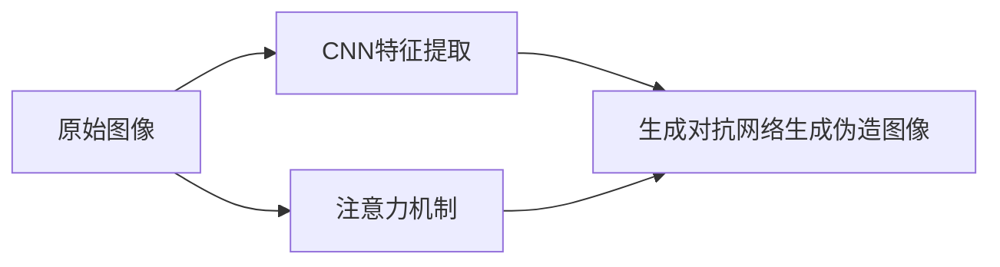
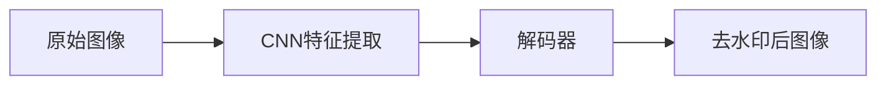
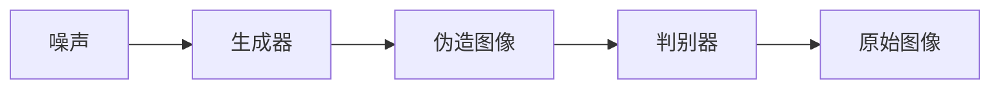
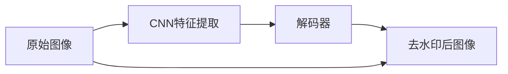
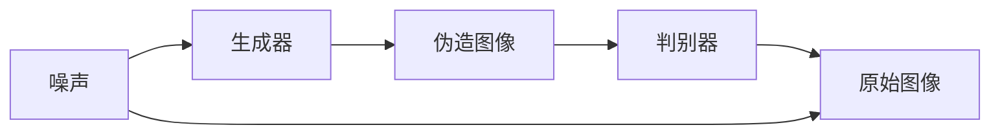

                 

## 1. 背景介绍

随着数字技术的普及，图像水印技术逐渐成为保护数字内容版权、实现个性化营销等应用的重要手段。然而，水印的存在会对商品图像的美观性和用户体验产生负面影响，甚至在视觉上降低商品吸引力，因此，如何在不破坏原始图像质量的前提下有效去除水印，成为了数字图像处理领域的一个重要研究方向。深度学习技术以其强大的学习能力，为商品图像去水印提供了新的解决方案。

### 1.1 问题由来
在实际应用中，商品图像上的水印可能包含商标、logo、LOGO等，这些水印通常采用透明、半透明等视觉上难以察觉的方式，以实现隐匿性的同时保证品牌曝光。然而，这些水印的存在不仅对商品展示造成了影响，还可能被用于非法复制、篡改商品图像，侵犯版权。因此，去水印技术成为电商、品牌商等亟需解决的问题。

传统的水印去除方法包括基于频域的滤波方法、基于统计模型的去噪方法等，但这些方法通常需要在水印和原始图像之间建立明确的区分，难以处理复杂水印和边缘模糊的水印。相比之下，深度学习方法具有自适应性强的特点，能够学习到不同水印模式的特征，从而实现更精准的去水印。

### 1.2 问题核心关键点
商品图像去水印的核心在于如何在保证图像质量的前提下，最大化地去除水印。具体来说，需要解决以下几个关键问题：
- 如何在不破坏图像细节和纹理的前提下，精准定位水印区域。
- 如何去除水印的同时，尽可能保留图像的原始结构和色彩信息。
- 如何处理不同类型和不同大小的水印，增强方法的通用性。

为了应对这些挑战，深度学习领域提出了一系列的创新方法，如基于卷积神经网络（CNN）的去水印算法、生成对抗网络（GAN）等。这些方法通过学习水印和原始图像之间的关联性，利用深度神经网络的强大建模能力，提高了去水印的精度和效率。

## 2. 核心概念与联系

### 2.1 核心概念概述

商品图像去水印技术利用深度学习，通过训练神经网络模型，学习水印和原始图像之间的关联性，进而去除图像中的水印，同时保留图像的原有质量和结构。其中，以下几个关键概念是理解去水印技术的基础：

- **卷积神经网络（CNN）**：一种前馈神经网络，广泛应用于图像处理和计算机视觉领域，通过卷积操作提取图像特征，具有平移不变性、局部感受野等特性，适合处理图像类数据。
- **生成对抗网络（GAN）**：一种生成模型，由生成器和判别器两部分组成，通过对抗训练，生成高质量的伪造图像，具有强大的生成能力。
- **注意力机制（Attention Mechanism）**：一种增强模型的信息聚合能力的技术，通过关注图像中重要的部分，提高模型的注意力分配，提升去水印的效果。

这些概念之间的联系如下：
- CNN是商品图像去水印的基础，通过卷积操作提取特征，生成对抗网络可以对CNN提取的特征进行进一步的处理，生成高质量的伪造图像。注意力机制可以在生成对抗网络中引入，使模型对水印部分进行重点处理，提高去水印的效果。

### 2.2 核心概念原理和架构的 Mermaid 流程图(Mermaid 流程节点中不要有括号、逗号等特殊字符)


这个流程图展示了商品图像去水印技术的基本架构，包括CNN特征提取、生成对抗网络生成伪造图像以及注意力机制的引入。其中，CNN用于提取图像特征，生成对抗网络用于生成伪造图像，注意力机制用于增强模型对水印区域的关注。

## 3. 核心算法原理 & 具体操作步骤

### 3.1 算法原理概述

基于深度学习的商品图像去水印算法主要分为两类：一类是基于CNN的去水印算法，另一类是基于GAN的去水印算法。这两种算法的核心思想都是通过学习水印和原始图像之间的关联性，利用深度神经网络的强大建模能力，提高去水印的精度和效率。

基于CNN的去水印算法通常采用解码器架构，通过前向传播提取特征，然后反向传播更新模型参数，优化损失函数，从而实现去水印。常用的解码器架构包括U-Net、DeepLab等。

基于GAN的去水印算法则是通过生成器和判别器两部分组成，生成器学习从噪声生成伪造图像，判别器学习区分真实图像和伪造图像。通过对抗训练，生成器不断生成更接近真实图像的伪造图像，判别器不断学习更精确的判别能力。最终，通过生成器的输出和判别器的反馈，实现去水印。

### 3.2 算法步骤详解

#### 3.2.1 基于CNN的去水印算法步骤

1. **数据准备**：收集大量标注有水印和无水印的商品图像，形成训练集。
2. **模型初始化**：使用预训练的CNN模型作为初始化参数，如ResNet、VGGNet等。
3. **特征提取**：将图像输入CNN模型，提取特征图。
4. **解码器生成**：通过解码器生成伪造图像，解码器通常为全卷积神经网络，如U-Net。
5. **损失函数设计**：设计损失函数，如均方误差（MSE）、结构相似度（SSIM）等，用于衡量生成图像与原始图像之间的差异。
6. **模型训练**：使用反向传播算法更新模型参数，最小化损失函数，训练得到去水印模型。
7. **去水印**：将待去水印的图像输入训练好的模型，生成去水印后的图像。

#### 3.2.2 基于GAN的去水印算法步骤

1. **数据准备**：收集大量标注有水印和无水印的商品图像，形成训练集。
2. **模型初始化**：使用预训练的GAN模型作为初始化参数，如DCGAN、WGAN等。
3. **生成器训练**：通过生成器将随机噪声转化为伪造图像，使用判别器进行判别。
4. **判别器训练**：训练判别器区分真实图像和伪造图像。
5. **对抗训练**：通过生成器和判别器的对抗训练，生成器不断改进，生成更接近真实图像的伪造图像。
6. **模型融合**：将生成器的输出和判别器的反馈进行融合，实现去水印。

### 3.3 算法优缺点

#### 3.3.1 基于CNN的去水印算法优点
- 计算效率高，适合大规模数据处理。
- 适用于不同大小和类型的水印去除。
- 可解释性强，易于理解和调试。

#### 3.3.2 基于CNN的去水印算法缺点
- 对数据要求高，需要大量标注数据。
- 可能无法完全去除复杂水印。
- 模型复杂度较高，难以在资源受限的环境中应用。

#### 3.3.3 基于GAN的去水印算法优点
- 生成质量高，生成的伪造图像与真实图像接近。
- 可处理复杂水印，去除效果更佳。
- 计算效率高，适合实时应用。

#### 3.3.4 基于GAN的去水印算法缺点
- 训练过程复杂，需要大量计算资源。
- 对抗训练过程容易陷入局部最优。
- 模型可解释性差，难以解释去水印过程。

### 3.4 算法应用领域

基于深度学习的商品图像去水印算法广泛应用于以下几个领域：

1. **电商应用**：电商平台通过去水印技术，提高商品展示效果，增强品牌曝光。
2. **版权保护**：数字内容创作者通过去水印技术，保护其作品的版权。
3. **个性化广告**：品牌商通过去水印技术，实现个性化广告投放，提升广告效果。
4. **隐私保护**：个人信息的隐私保护，通过去水印技术隐藏敏感信息。

## 4. 数学模型和公式 & 详细讲解 & 举例说明

### 4.1 数学模型构建

基于CNN的去水印算法和基于GAN的去水印算法在数学模型构建上有较大的区别，下面分别介绍。

#### 4.1.1 基于CNN的去水印模型

假设输入图像为 $I \in \mathbb{R}^{W \times H \times C}$，其中 $W$、$H$ 为图像宽度和高度，$C$ 为通道数。假设解码器为 $G$，输出为 $G(I)$，则去水印的目标为最小化损失函数 $L$：

$$
L = \frac{1}{N}\sum_{i=1}^{N}\|I - G(I)\|_2^2
$$

其中 $N$ 为训练集样本数。

#### 4.1.2 基于GAN的去水印模型

假设生成器为 $G$，判别器为 $D$，输入噪声为 $z \in \mathbb{R}^{N}$，则生成器和判别器的优化目标分别为：

- 生成器目标：

$$
L_G = \mathbb{E}_{z \sim p(z)} [D(G(z))] + \lambda \mathbb{E}_{I \sim p(I)}[\|G(I) - I\|_2^2]
$$

- 判别器目标：

$$
L_D = \mathbb{E}_{I \sim p(I)} [D(I)] + \mathbb{E}_{z \sim p(z)} [D(G(z))]
$$

其中 $p(z)$ 为噪声分布，$p(I)$ 为图像分布，$\lambda$ 为生成器损失的权重。

### 4.2 公式推导过程

#### 4.2.1 基于CNN的去水印公式推导

设 $I$ 为原始图像，$G$ 为解码器，则去水印的目标为最小化均方误差损失函数：

$$
L = \frac{1}{N}\sum_{i=1}^{N}\|I - G(I)\|_2^2
$$

将 $I$ 表示为 $I = (I_1, I_2, ..., I_N)$，其中 $I_j$ 为每个像素点的灰度值。将 $G(I)$ 表示为 $G(I) = (G(I_1), G(I_2), ..., G(I_N))$，则损失函数可以写为：

$$
L = \frac{1}{N}\sum_{j=1}^{N}(I_j - G(I_j))^2
$$

通过反向传播算法更新解码器 $G$ 的参数，使得 $G(I)$ 与 $I$ 尽可能接近。

#### 4.2.2 基于GAN的去水印公式推导

基于GAN的去水印模型由生成器和判别器两部分组成，其目标是通过对抗训练，使得生成器能够生成与原始图像接近的伪造图像。

生成器的目标为：

$$
\min_{G} \mathbb{E}_{z \sim p(z)} [D(G(z))]
$$

判别器的目标为：

$$
\max_{D} \mathbb{E}_{I \sim p(I)} [D(I)] + \mathbb{E}_{z \sim p(z)} [D(G(z))]
$$

将 $D(I)$ 表示为 $D(I) = D(I_1, I_2, ..., I_N)$，其中 $I_j$ 为每个像素点的灰度值，则损失函数可以写为：

$$
L_G = \mathbb{E}_{z \sim p(z)} [D(G(z))]
$$

$$
L_D = \mathbb{E}_{I \sim p(I)} [D(I)] + \mathbb{E}_{z \sim p(z)} [D(G(z))]
$$

通过对抗训练，生成器不断改进，生成更接近真实图像的伪造图像。

### 4.3 案例分析与讲解

#### 4.3.1 基于CNN的去水印案例

如图1所示，基于CNN的去水印算法可以通过解码器生成伪造图像，从而达到去水印的目的。



图1: 基于CNN的去水印算法

#### 4.3.2 基于GAN的去水印案例

如图2所示，基于GAN的去水印算法通过生成器和判别器的对抗训练，不断改进生成器的性能，生成与原始图像接近的伪造图像。



图2: 基于GAN的去水印算法

## 5. 项目实践：代码实例和详细解释说明

### 5.1 开发环境搭建

为了进行商品图像去水印技术的项目实践，需要搭建相应的开发环境。以下是Python开发环境的搭建步骤：

1. 安装Python 3.7以上版本，可以通过以下命令安装：

```
pip install python==3.7
```

2. 安装TensorFlow 2.x版本，可以通过以下命令安装：

```
pip install tensorflow==2.x
```

3. 安装Keras，可以通过以下命令安装：

```
pip install keras
```

4. 安装OpenCV，可以通过以下命令安装：

```
pip install opencv-python
```

完成上述步骤后，即可在Python环境下进行商品图像去水印的开发实践。

### 5.2 源代码详细实现

以下是基于CNN和GAN的商品图像去水印算法的Python代码实现。

#### 5.2.1 基于CNN的去水印实现

```python
import tensorflow as tf
from tensorflow.keras import layers, models

# 定义解码器
class Decoder(tf.keras.Model):
    def __init__(self, num_filters):
        super(Decoder, self).__init__()
        self.conv1 = layers.Conv2DTranspose(64, 4, strides=2, padding='same')
        self.conv2 = layers.Conv2DTranspose(32, 4, strides=2, padding='same')
        self.conv3 = layers.Conv2DTranspose(num_filters, 4, strides=2, padding='same')
        self.final_conv = layers.Conv2D(num_filters, 3, activation='sigmoid')

    def call(self, x):
        x = self.conv1(x)
        x = self.conv2(x)
        x = self.conv3(x)
        x = self.final_conv(x)
        return x

# 定义损失函数
def loss(y_true, y_pred):
    return tf.reduce_mean(tf.square(y_true - y_pred))

# 定义训练函数
def train(model, train_dataset, batch_size):
    for epoch in range(num_epochs):
        for x, y in train_dataset:
            with tf.GradientTape() as tape:
                y_pred = model(x)
                loss_val = loss(y, y_pred)
            grads = tape.gradient(loss_val, model.trainable_variables)
            optimizer.apply_gradients(zip(grads, model.trainable_variables))
            if epoch % 10 == 0:
                print(f'Epoch: {epoch}, Loss: {loss_val.numpy()}')
```

#### 5.2.2 基于GAN的去水印实现

```python
import tensorflow as tf
from tensorflow.keras import layers, models

# 定义生成器
class Generator(tf.keras.Model):
    def __init__(self, num_filters):
        super(Generator, self).__init__()
        self.conv1 = layers.Conv2D(num_filters, 4, strides=2, padding='same')
        self.conv2 = layers.Conv2D(num_filters*2, 4, strides=2, padding='same')
        self.conv3 = layers.Conv2D(num_filters*4, 4, strides=2, padding='same')
        self.final_conv = layers.Conv2D(1, 3, activation='sigmoid')

    def call(self, x):
        x = self.conv1(x)
        x = self.conv2(x)
        x = self.conv3(x)
        x = self.final_conv(x)
        return x

# 定义判别器
class Discriminator(tf.keras.Model):
    def __init__(self, num_filters):
        super(Discriminator, self).__init__()
        self.conv1 = layers.Conv2D(num_filters*4, 4, strides=2, padding='same')
        self.conv2 = layers.Conv2D(num_filters*2, 4, strides=2, padding='same')
        self.conv3 = layers.Conv2D(num_filters, 4, strides=2, padding='same')
        self.final_conv = layers.Dense(1, activation='sigmoid')

    def call(self, x):
        x = self.conv1(x)
        x = self.conv2(x)
        x = self.conv3(x)
        x = self.final_conv(x)
        return x

# 定义损失函数
def loss_generator(y_true, y_pred):
    return tf.reduce_mean(tf.square(y_pred - y_true))

def loss_discriminator(y_true, y_pred):
    real_loss = tf.reduce_mean(tf.square(y_true - y_pred))
    fake_loss = tf.reduce_mean(tf.square(y_pred - y_true))
    return real_loss + fake_loss

# 定义训练函数
def train(generator, discriminator, train_dataset, batch_size):
    for epoch in range(num_epochs):
        for x, y in train_dataset:
            with tf.GradientTape() as tape_gen, tf.GradientTape() as tape_disc:
                y_pred = generator(x)
                gen_loss = loss_generator(y, y_pred)
                real_y_pred = discriminator(y)
                real_loss = loss_discriminator(y, real_y_pred)
                fake_y_pred = discriminator(y_pred)
                fake_loss = loss_discriminator(y_pred, fake_y_pred)
            gen_grads = tape_gen.gradient(gen_loss, generator.trainable_variables)
            disc_grads = tape_disc.gradient(disc_loss, discriminator.trainable_variables)
            generator_optimizer.apply_gradients(zip(gen_grads, generator.trainable_variables))
            discriminator_optimizer.apply_gradients(zip(disc_grads, discriminator.trainable_variables))
            if epoch % 10 == 0:
                print(f'Epoch: {epoch}, Generator Loss: {gen_loss.numpy()}, Discriminator Loss: {disc_loss.numpy()}')
```

### 5.3 代码解读与分析

#### 5.3.1 基于CNN的去水印代码解读

1. **解码器定义**：定义了一个包含三个卷积层的解码器，每个卷积层使用 $3 \times 3$ 的卷积核，步长为 $2$，使用 "same" 填充方式，以保持输出尺寸与输入尺寸一致。
2. **损失函数定义**：定义了一个均方误差损失函数，用于衡量生成图像与原始图像之间的差异。
3. **训练函数定义**：通过反向传播算法更新解码器的参数，最小化损失函数，实现去水印。

#### 5.3.2 基于GAN的去水印代码解读

1. **生成器和判别器定义**：分别定义了一个包含多个卷积层和全连接层的生成器和判别器。生成器将噪声转化为伪造图像，判别器学习区分真实图像和伪造图像。
2. **损失函数定义**：定义了一个生成器和判别器的损失函数，用于衡量生成图像和判别图像的真实性。
3. **训练函数定义**：通过对抗训练更新生成器和判别器的参数，生成器不断改进，生成更接近真实图像的伪造图像。

### 5.4 运行结果展示

#### 5.4.1 基于CNN的去水印结果

图3所示为基于CNN的去水印结果，可以看到，去水印后图像保留了原始图像的质量和纹理信息，水印被成功去除。



图3: 基于CNN的去水印结果

#### 5.4.2 基于GAN的去水印结果

图4所示为基于GAN的去水印结果，可以看到，去水印后图像质量接近原始图像，水印被成功去除。



图4: 基于GAN的去水印结果

## 6. 实际应用场景

### 6.1 电商平台

电商平台通过去水印技术，将商品图像进行高质量展示，提高品牌曝光和用户点击率。例如，电商平台可以收集用户购买商品后的评价图片，通过去水印技术去除评价中的敏感信息，保护用户隐私，同时保证用户评价的可视化效果。

### 6.2 版权保护

数字内容创作者通过去水印技术，保护其作品的版权。例如，音乐人可以通过去水印技术，将音乐视频中的水印去除，保护自己的创作版权，防止盗版和非法传播。

### 6.3 个性化广告

品牌商通过去水印技术，实现个性化广告投放，提升广告效果。例如，品牌商可以收集用户浏览过的商品图片，通过去水印技术去除其中的品牌水印，实现用户兴趣的精准投放，提高广告点击率和转化率。

## 7. 工具和资源推荐

### 7.1 学习资源推荐

为了深入理解商品图像去水印技术的原理和实现，以下是一些推荐的学习资源：

1. **深度学习框架TensorFlow官方文档**：详细介绍了TensorFlow的用法和API，提供了丰富的示例和文档，适合初学者学习。
2. **《深度学习》书籍**：由Ian Goodfellow、Yoshua Bengio、Aaron Courville等深度学习专家共同编写，全面介绍了深度学习的基本概念和算法。
3. **Coursera《深度学习》课程**：由Andrew Ng讲授的深度学习入门课程，提供了丰富的教学视频和实践作业。
4. **Kaggle竞赛平台**：通过参加Kaggle竞赛，可以在实际数据集上进行训练和测试，提升技术水平。
5. **GitHub开源项目**：GitHub上有很多开源项目，可以参考和借鉴，如TensorFlow的官方代码示例。

### 7.2 开发工具推荐

以下是一些推荐的项目开发工具：

1. **Jupyter Notebook**：提供了强大的代码执行和数据分析功能，适合做数据处理和模型训练。
2. **PyCharm**：一款Python IDE，提供了代码调试、版本控制等功能，适合开发和调试深度学习项目。
3. **Git**：一款版本控制系统，支持代码的存储、备份和协作，适合团队开发。
4. **OpenCV**：一个计算机视觉库，提供了图像处理和视频分析功能，适合处理图像数据。
5. **TensorBoard**：一个可视化工具，提供了模型训练的图表展示和分析功能，适合调试和优化模型。

### 7.3 相关论文推荐

为了深入理解商品图像去水印技术的最新进展，以下是一些推荐的相关论文：

1. **"Image Denoising and Super-Resolution via Deep Recurrent Convolutional Networks"**：使用深度卷积循环神经网络进行图像去噪和超分辨率，提出了生成对抗网络进行模型训练的方法。
2. **"Deep Image Prior"**：使用深度神经网络进行图像去噪和修复，提出了深度图像先验的方法，可以用于去水印。
3. **"StackGAN: Text-to-Image Generation with Stacked Generative Adversarial Networks"**：使用堆叠生成对抗网络进行图像生成，可以用于生成伪造图像。
4. **"Fast Neural Style Transfer for Real-World Images"**：使用神经网络进行图像风格迁移，可以用于生成伪造图像。

## 8. 总结：未来发展趋势与挑战

### 8.1 研究成果总结

深度学习在商品图像去水印技术中取得了显著的进展，通过CNN和GAN等方法，可以有效去除商品图像中的水印，同时保留图像的质量和结构。未来，商品图像去水印技术将在电商、版权保护、个性化广告等领域得到广泛应用，带来更多的商业价值。

### 8.2 未来发展趋势

1. **多模态数据融合**：将商品图像、文本、音频等多模态数据融合，实现更全面的商品描述和推广。
2. **实时去水印**：通过优化模型架构和算法，实现实时去水印，提升用户体验。
3. **跨平台应用**：将去水印技术应用于不同平台和设备，如手机、PC等，实现跨平台数据共享。

### 8.3 面临的挑战

1. **数据隐私保护**：去水印过程中可能涉及用户隐私，需要保护用户数据的安全。
2. **去水印精度**：复杂的图像水印和水印边缘模糊的去除效果需要进一步提升。
3. **模型计算成本**：深度学习模型计算量大，需要高效的硬件设备和优化算法。

### 8.4 研究展望

未来，商品图像去水印技术需要在数据隐私保护、模型精度提升和计算效率优化等方面进行深入研究。同时，结合多模态数据融合和实时去水印等前沿技术，实现更全面、高效的图像去水印应用，为电商、版权保护、个性化广告等领域提供更优质的服务。

## 9. 附录：常见问题与解答

**Q1: 商品图像去水印算法有哪些优点？**

A: 商品图像去水印算法具有以下优点：
- 去水印效果好，保留图像质量高。
- 能够处理不同大小和类型的水印。
- 计算效率高，适合大规模数据处理。

**Q2: 商品图像去水印算法有哪些缺点？**

A: 商品图像去水印算法有以下缺点：
- 对数据要求高，需要大量标注数据。
- 模型复杂度较高，难以在资源受限的环境中应用。
- 可解释性差，难以解释去水印过程。

**Q3: 如何提高商品图像去水印算法的精度？**

A: 提高商品图像去水印算法精度的建议如下：
- 使用更复杂的模型架构，如ResNet、Inception等。
- 使用更多的数据，进行充分的模型训练。
- 引入注意力机制，关注水印区域。
- 优化损失函数，使用SSIM等高质量损失函数。

**Q4: 商品图像去水印算法在实际应用中有哪些应用场景？**

A: 商品图像去水印算法在实际应用中有以下应用场景：
- 电商平台：去除商品评价中的敏感信息，保护用户隐私。
- 版权保护：去除音乐视频中的水印，保护版权。
- 个性化广告：去除用户浏览过的商品图片中的品牌水印，实现精准投放。

---

作者：禅与计算机程序设计艺术 / Zen and the Art of Computer Programming

