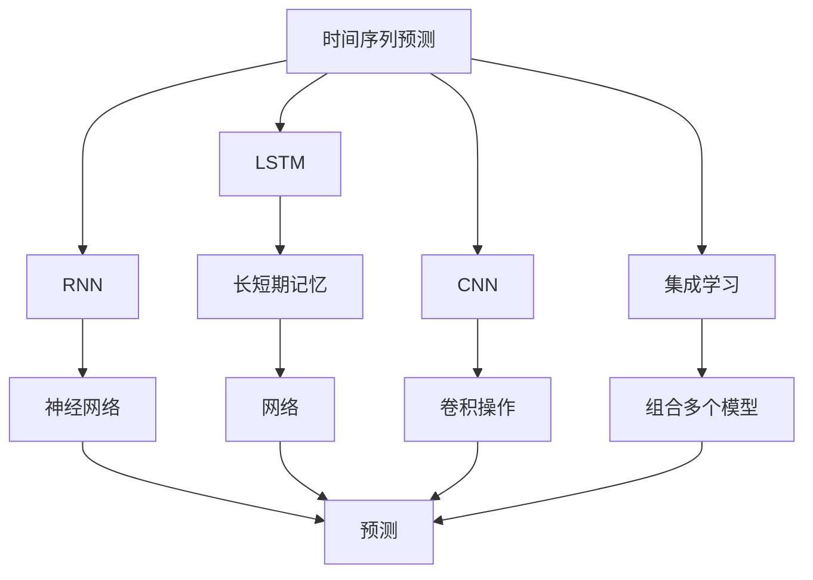

                 

# 深度学习在商品需求预测中的应用

> 关键词：深度学习, 商品需求预测, 时间序列预测, 循环神经网络(RNN), 长短期记忆网络(LSTM), 卷积神经网络(CNN), 集成学习, 预测精度

## 1. 背景介绍

### 1.1 问题由来
在现代商业竞争中，预测商品需求成为了商家的核心竞争力之一。通过精准预测商品需求，商家可以合理安排生产、库存和物流，提升运营效率，降低成本，满足消费者需求，提高市场竞争力。然而，由于商品需求受多种因素的影响，包括季节性变化、市场波动、促销活动、宏观经济状况等，传统的统计方法难以有效应对这些复杂性。

为此，深度学习技术被广泛应用于商品需求预测，特别是通过时序数据驱动的时间序列预测模型。近年来，基于深度学习的预测模型在商品需求预测领域取得了显著成果，尤其在电商和零售行业中的应用，更是提升了需求预测的精度和实时性。

### 1.2 问题核心关键点
本节将详细阐述深度学习在商品需求预测中的应用，包括选择合适的模型、处理数据、调整参数、模型评估与优化等关键环节。

## 2. 核心概念与联系

### 2.1 核心概念概述

为更好地理解深度学习在商品需求预测中的应用，本节将介绍几个关键概念：

- 时间序列预测（Time Series Forecasting）：通过对时间序列数据进行建模，预测未来某一时间点的值。商品需求数据具有明显的时序性，因此时间序列预测模型是其预测的关键。

- 循环神经网络（Recurrent Neural Network, RNN）：一类能够处理序列数据的神经网络，通过记忆网络内部的上下文信息，能够有效捕捉时间序列数据的动态变化特征。

- 长短期记忆网络（Long Short-Term Memory, LSTM）：一种特殊的RNN，能够更好地处理长距离依赖和梯度消失问题，适用于复杂的商品需求预测。

- 卷积神经网络（Convolutional Neural Network, CNN）：通过卷积操作提取时间序列数据的局部特征，在图像和文本等领域表现出色，也可用于商品需求预测。

- 集成学习（Ensemble Learning）：通过组合多个模型，利用模型的多样性和互补性，提升整体预测性能，是一种高效的预测方法。

这些核心概念之间的逻辑关系可以通过以下Mermaid流程图来展示：



这个流程图展示的时间序列预测过程：

1. 数据被送入RNN网络进行预测。
2. 在RNN中，LSTM模型用于处理长距离依赖。
3. CNN模型提取局部特征。
4. 最终通过集成学习组合多个模型，提升预测精度。

这些核心概念共同构成了深度学习在商品需求预测中的应用框架，使模型能够更好地理解时间序列数据的复杂特征，进行高精度的需求预测。

## 3. 核心算法原理 & 具体操作步骤
### 3.1 算法原理概述

商品需求预测的核心在于建立模型，通过对历史数据进行学习，预测未来某一时间点的需求量。深度学习技术通过多层神经网络模型，自动学习数据中的复杂特征，从而实现高精度的预测。

具体而言，深度学习模型通过对历史商品需求数据进行训练，构建时间序列预测模型。训练过程中，模型通过梯度下降等优化算法，不断调整权重和偏置，最小化预测误差，从而得到最优的预测模型。

### 3.2 算法步骤详解

基于深度学习的时间序列预测模型主要包括以下几个步骤：

**Step 1: 数据预处理**
- 收集商品历史销售数据，清洗和处理缺失值和异常值，进行归一化和标准化处理。
- 将原始时间序列数据转换为适合模型输入的格式，如将日期序列转换为年份-月份-日索引。
- 将数据分为训练集和测试集，保证模型在未见过的数据上进行测试。

**Step 2: 模型选择与设计**
- 根据数据特性选择合适的深度学习模型，如RNN、LSTM、CNN等。
- 设计模型的网络结构，包括输入层、隐藏层和输出层，设置每个层的神经元个数、激活函数等参数。
- 定义损失函数和优化算法，如均方误差（MSE）、交叉熵（CE）、Adam、SGD等。

**Step 3: 模型训练**
- 将训练数据输入模型进行前向传播，计算预测结果和实际结果之间的误差。
- 通过反向传播计算梯度，使用优化算法更新模型参数。
- 周期性在验证集上评估模型性能，根据性能指标决定是否触发Early Stopping。
- 重复上述步骤直到满足预设的迭代轮数或Early Stopping条件。

**Step 4: 模型评估与优化**
- 在测试集上评估模型性能，计算均方根误差（RMSE）、平均绝对误差（MAE）等指标。
- 分析模型的预测误差分布，进行误差分析和调参优化。
- 尝试不同模型、不同超参数组合，选择最优的模型和参数。

**Step 5: 应用与反馈**
- 将训练好的模型应用于实际需求预测，生成未来时间点的需求预测值。
- 根据实际需求与预测结果的差异，不断调整模型参数，进行模型迭代。
- 持续收集实际销售数据，更新模型进行实时预测，保持预测的准确性。

以上是深度学习在商品需求预测中的一般流程。在实际应用中，还需要根据具体任务和数据特点，进行模型选择、调参优化、数据增强等具体操作。

### 3.3 算法优缺点

基于深度学习的时间序列预测模型具有以下优点：
1. 可以处理非线性、时变和动态变化的数据，适应性强。
2. 可以通过多层次神经网络模型自动提取特征，无需手工特征工程。
3. 可以利用历史数据进行训练，准确度较高。
4. 支持集成学习，提升预测精度。

同时，该模型也存在以下局限性：
1. 对数据的准备和清洗要求较高，数据质量直接影响到模型性能。
2. 模型复杂度高，训练和推理所需资源较多。
3. 对长距离依赖的捕捉能力有限，可能会丢失部分重要信息。
4. 模型存在过拟合风险，特别是在训练数据较少的情况下。
5. 对异常值和噪声敏感，需要合理处理异常数据。

尽管存在这些局限性，但就目前而言，基于深度学习的时间序列预测模型仍是商品需求预测的最主流范式。未来相关研究的重点在于如何进一步降低模型对数据的依赖，提高模型的鲁棒性和泛化能力，同时兼顾计算效率和模型可解释性。

### 3.4 算法应用领域

基于深度学习的时间序列预测模型在商品需求预测领域已经得到了广泛的应用，例如：

- 零售商库存管理：通过预测商品需求，优化库存水平，降低缺货和过剩风险。
- 电商平台销售预测：预测商品在未来时间段内的销量，指导销售策略和广告投放。
- 供应链优化：预测原材料和成品的需求，优化供应链物流和生产计划。
- 市场趋势分析：分析商品需求的季节性变化和趋势，辅助制定市场策略。

除了上述这些经典应用外，深度学习预测模型还被创新性地应用到更多场景中，如风险评估、用户行为预测、智能推荐等，为商业决策提供了有力的支持。

## 4. 数学模型和公式 & 详细讲解 & 举例说明

### 4.1 数学模型构建

假设商品需求时间序列为 $\{d_t\}_{t=1}^{T}$，其中 $d_t$ 表示第 $t$ 天的商品需求量。我们希望通过时间序列预测模型，预测未来 $k$ 天的需求量 $\{d_{t+k}\}_{t=1}^{T-k}$。

设预测模型为 $f$，则预测模型可以表示为：

$$
d_{t+k} = f(d_{t-1}, d_{t-2}, ..., d_t; \theta)
$$

其中 $\theta$ 为模型的可学习参数，包括权重和偏置等。

常见的预测模型包括：

- 线性回归模型：$\hat{d}_{t+k} = \beta_0 + \sum_{i=1}^{k} \beta_i d_{t-i} + \epsilon_t$
- 自回归模型（AR）：$\hat{d}_{t+k} = \alpha_1 d_{t-1} + ... + \alpha_k d_{t-k} + \epsilon_t$
- 移动平均模型（MA）：$\hat{d}_{t+k} = \mu + \sum_{i=1}^{k} \gamma_i \epsilon_{t-i}$
- 自回归移动平均模型（ARMA）：$\hat{d}_{t+k} = \alpha_1 d_{t-1} + ... + \alpha_k d_{t-k} + \sum_{i=1}^{k} \gamma_i \epsilon_{t-i}$
- 自回归积分滑动平均模型（ARIMA）：$\hat{d}_{t+k} = \alpha_1 d_{t-1} + ... + \alpha_k d_{t-k} + \sum_{i=1}^{k} \gamma_i \epsilon_{t-i} + \delta D^{p} d_{t-1-k}$
- 长短期记忆网络（LSTM）：$\hat{d}_{t+k} = f(d_{t-1}, d_{t-2}, ..., d_t; \theta)$

其中，$\epsilon_t$ 为随机误差项，$D$ 为差分算子，$p$ 为差分阶数，$\alpha_i, \beta_i, \gamma_i$ 为模型参数。

### 4.2 公式推导过程

以ARIMA模型为例，进行详细推导。

设 $y_t = d_t - \mu$，则 ARIMA模型可以表示为：

$$
\Delta^p(y_t) = \sum_{i=1}^{k} \alpha_i \Delta^p(y_{t-i}) + \sum_{i=1}^{k} \gamma_i \epsilon_{t-i} + \epsilon_t
$$

其中，$\Delta^p$ 为差分算子，$\alpha_i$ 为自回归系数，$\gamma_i$ 为移动平均系数。

将上述方程进行迭代展开，得到：

$$
y_t = \alpha_1 y_{t-1} + ... + \alpha_k y_{t-k} + \sum_{i=1}^{k} \gamma_i \epsilon_{t-i} + \epsilon_t
$$

通过变换，得到：

$$
\hat{d}_{t+k} = \alpha_1 d_{t-1} + ... + \alpha_k d_{t-k} + \sum_{i=1}^{k} \gamma_i \epsilon_{t-i} + \mu
$$

### 4.3 案例分析与讲解

考虑一个电商平台的日销售额数据，进行时间序列预测。假设数据集为 $d_t$，其中 $t=1, ..., 365$，预测未来 7 天的销售额 $d_{t+7}$。

首先，进行数据预处理：
- 收集电商平台历史日销售额数据，并进行清洗和处理。
- 将数据标准化处理，使之符合ARIMA模型要求。
- 将数据分为训练集和测试集。

然后，构建ARIMA模型：
- 选择适当的 $p$ 和 $k$ 值，进行差分和自回归移动平均建模。
- 训练模型，调整参数 $\alpha_i$ 和 $\gamma_i$。
- 在测试集上评估模型性能。

最后，应用模型进行预测：
- 将实时数据输入模型，预测未来 7 天的销售额。
- 根据预测结果和实际数据的差异，不断调整模型参数，进行模型迭代。

## 5. 项目实践：代码实例和详细解释说明
### 5.1 开发环境搭建

在进行时间序列预测的深度学习实践前，我们需要准备好开发环境。以下是使用Python进行TensorFlow开发的环境配置流程：

1. 安装Anaconda：从官网下载并安装Anaconda，用于创建独立的Python环境。

2. 创建并激活虚拟环境：
```bash
conda create -n tf-env python=3.8 
conda activate tf-env
```

3. 安装TensorFlow：根据CUDA版本，从官网获取对应的安装命令。例如：
```bash
conda install tensorflow
```

4. 安装Keras：
```bash
pip install keras
```

5. 安装各类工具包：
```bash
pip install numpy pandas scikit-learn matplotlib tqdm jupyter notebook ipython
```

完成上述步骤后，即可在`tf-env`环境中开始深度学习时间序列预测的实践。

### 5.2 源代码详细实现

下面以LSTM模型为例，给出使用TensorFlow进行时间序列预测的代码实现。

首先，定义数据加载函数：

```python
import tensorflow as tf
from tensorflow.keras.datasets import yahoo finance

def load_data():
    symbol = 'AAPL'
    data = yahoo_finance.get_data_yahoo(symbol)
    data = data['Close'].values.reshape(-1, 1)
    return data
```

然后，定义模型：

```python
from tensorflow.keras.models import Sequential
from tensorflow.keras.layers import LSTM, Dense, Dropout

model = Sequential()
model.add(LSTM(units=50, input_shape=(X_train.shape[1], X_train.shape[2]), return_sequences=True))
model.add(Dropout(0.2))
model.add(LSTM(units=50, return_sequences=True))
model.add(Dropout(0.2))
model.add(LSTM(units=50))
model.add(Dropout(0.2))
model.add(Dense(units=1))
```

接着，定义损失函数和优化器：

```python
model.compile(optimizer='adam', loss='mse')
```

最后，进行模型训练和评估：

```python
X_train, y_train = load_data()
X_test, y_test = load_data()

model.fit(X_train, y_train, epochs=100, batch_size=32, validation_data=(X_test, y_test))
model.evaluate(X_test, y_test)
```

以上就是使用TensorFlow对LSTM模型进行时间序列预测的完整代码实现。可以看到，TensorFlow提供了丰富的深度学习库和工具，使得模型的搭建和训练非常便捷。

### 5.3 代码解读与分析

让我们再详细解读一下关键代码的实现细节：

**load_data函数**：
- 使用`get_data_yahoo`函数从Yahoo Finance获取股票价格数据。
- 将数据转换为Numpy数组，并重塑为适合模型输入的格式。

**模型定义**：
- 定义一个LSTM模型，包含三个LSTM层和两个Dropout层。
- 使用`compile`函数定义模型的优化器和损失函数。

**模型训练和评估**：
- 使用`fit`函数进行模型训练，设置迭代次数和批大小。
- 使用`evaluate`函数在测试集上评估模型性能。

**代码注意事项**：
- 注意设置合适的训练轮数和批大小，避免过拟合。
- 注意使用适当的损失函数和优化器。
- 注意处理数据时可能出现的异常值和噪声。

## 6. 实际应用场景

### 6.1 电商库存管理

在电商行业，库存管理是一个重要的环节，直接影响着公司的运营成本和客户满意度。通过深度学习时间序列预测模型，可以对商品的未来需求进行预测，从而优化库存水平，避免缺货或过剩库存。

具体而言，电商企业可以收集历史销售数据，使用深度学习模型预测未来 30 天的销售额，并根据预测结果进行库存调整，从而降低缺货和过剩库存的风险。

### 6.2 供应链优化

供应链管理涉及原材料、半成品和成品的供应和物流，是企业生产运营的关键环节。通过深度学习时间序列预测模型，可以对商品的未来需求进行预测，从而优化供应链的库存和物流计划，提升供应链的效率和响应速度。

例如，汽车制造企业可以收集零部件的历史销售数据，使用模型预测未来 90 天的需求量，并根据预测结果调整库存和生产计划，从而减少停产和库存积压的情况。

### 6.3 市场趋势分析

市场趋势分析是商业决策的重要依据。通过深度学习时间序列预测模型，可以预测商品需求的季节性变化和趋势，从而指导企业的市场策略和广告投放。

例如，服装品牌可以收集历史销售数据，使用模型预测未来 12 个月的季节性变化趋势，从而制定相应的市场策略和促销活动，提高销售量。

### 6.4 未来应用展望

随着深度学习技术的发展，基于时间序列预测的深度学习模型将在更多领域得到应用，为商业决策提供更可靠的依据。

在智能制造领域，预测模型的应用将提高生产效率和产品质量，降低生产成本。

在金融领域，预测模型将应用于风险评估和市场预测，帮助金融机构制定更合理的投资策略。

在医疗健康领域，预测模型将应用于疾病预测和治疗方案优化，提升医疗服务的质量和效率。

## 7. 工具和资源推荐
### 7.1 学习资源推荐

为了帮助开发者系统掌握深度学习时间序列预测的理论基础和实践技巧，这里推荐一些优质的学习资源：

1. Deep Learning Specialization by Andrew Ng：斯坦福大学开设的深度学习系列课程，由著名深度学习专家Andrew Ng主讲，深入浅出地介绍了深度学习的基本概念和经典模型。

2. Hands-On Machine Learning with Scikit-Learn, Keras, and TensorFlow：O'Reilly出版社的经典书籍，介绍了使用Scikit-Learn、Keras和TensorFlow进行深度学习的全流程。

3. Time Series Forecasting with LSTM and Deep Learning：使用LSTM和深度学习进行时间序列预测的详细教程，适合初学者学习。

4. Kaggle上的时间序列预测竞赛：Kaggle是一个数据科学竞赛平台，包含大量时间序列预测竞赛数据集和开源模型，可以帮助开发者快速上手实践。

通过对这些资源的学习实践，相信你一定能够快速掌握深度学习时间序列预测的精髓，并用于解决实际的商业问题。

### 7.2 开发工具推荐

高效的开发离不开优秀的工具支持。以下是几款用于深度学习时间序列预测开发的常用工具：

1. TensorFlow：由Google主导开发的开源深度学习框架，生产部署方便，适合大规模工程应用。

2. Keras：Google开源的深度学习框架，适合快速迭代研究。

3. PyTorch：Facebook开源的深度学习框架，灵活高效，适用于科研和实验。

4. TensorBoard：TensorFlow配套的可视化工具，可实时监测模型训练状态，提供丰富的图表呈现方式。

5. Weights & Biases：模型训练的实验跟踪工具，可以记录和可视化模型训练过程中的各项指标，方便对比和调优。

6. Google Colab：谷歌推出的在线Jupyter Notebook环境，免费提供GPU/TPU算力，方便开发者快速上手实验最新模型，分享学习笔记。

合理利用这些工具，可以显著提升深度学习时间序列预测的开发效率，加快创新迭代的步伐。

### 7.3 相关论文推荐

深度学习时间序列预测技术的发展源于学界的持续研究。以下是几篇奠基性的相关论文，推荐阅读：

1. LSTM: A Search Space Odyssey：提出LSTM模型，引入了门控机制，解决了RNN中的梯度消失问题。

2. Time Series Forecasting with Deep Learning：介绍了深度学习在时间序列预测中的应用，包括RNN、LSTM等模型。

3. Deep Learning for Time Series Prediction in IoT Systems：介绍深度学习在物联网系统中的应用，包括时间序列预测。

4. Anomaly Detection in IoT Systems Using Deep Learning：介绍深度学习在物联网系统中的异常检测应用。

这些论文代表了大模型时间序列预测技术的发展脉络。通过学习这些前沿成果，可以帮助研究者把握学科前进方向，激发更多的创新灵感。

## 8. 总结：未来发展趋势与挑战

### 8.1 总结

本文对基于深度学习的时间序列预测技术进行了全面系统的介绍。首先阐述了时间序列预测在商品需求预测中的应用，明确了深度学习技术在提升预测精度和实时性方面的独特价值。其次，从原理到实践，详细讲解了深度学习模型的建立、训练、评估与优化过程，给出了深度学习时间序列预测的完整代码实现。同时，本文还广泛探讨了深度学习模型在电商库存管理、供应链优化、市场趋势分析等多个行业领域的应用前景，展示了深度学习预测模型的广阔潜力。此外，本文精选了深度学习时间序列预测的各类学习资源，力求为读者提供全方位的技术指引。

通过本文的系统梳理，可以看到，基于深度学习的时间序列预测模型正在成为商品需求预测的重要范式，极大地提升了预测的准确度和实时性。未来，伴随深度学习技术的不断发展，预测模型将更加复杂、高效，为商业决策提供更有力的支持。

### 8.2 未来发展趋势

展望未来，深度学习时间序列预测技术将呈现以下几个发展趋势：

1. 模型规模持续增大。随着算力成本的下降和数据规模的扩张，深度学习模型的参数量还将持续增长。更大规模的模型蕴含的更多知识，有望支撑更复杂多变的商品需求预测。

2. 模型结构更加多样化。未来将涌现更多创新的深度学习模型结构，如注意力机制、多尺度特征融合等，进一步提升预测精度和效率。

3. 数据处理和清洗技术提升。面对更复杂和多样化的数据，需要开发更加高效和鲁棒的数据处理和清洗技术，保证模型的稳定性和泛化能力。

4. 集成学习和跨模态融合。将多个深度学习模型进行集成，或者将深度学习与传统统计方法结合，提升预测性能和鲁棒性。

5. 强化学习和自适应预测。通过强化学习优化预测模型，使其能够动态调整参数，适应不断变化的预测场景。

6. 模型解释性和可控性增强。赋予深度学习预测模型更强的可解释性和可控性，增强预测结果的透明度和可信度。

以上趋势凸显了深度学习时间序列预测技术的广阔前景。这些方向的探索发展，必将进一步提升预测模型的性能和应用范围，为商业决策提供更加准确和可靠的支持。

### 8.3 面临的挑战

尽管深度学习时间序列预测技术已经取得了瞩目成就，但在迈向更加智能化、普适化应用的过程中，它仍面临诸多挑战：

1. 数据质量和数量瓶颈。数据质量和数量直接影响到预测模型的性能，但在某些垂直领域，获取高质量、大规模数据可能面临成本和技术难度。

2. 模型的可解释性不足。深度学习模型的"黑盒"特性使其难以解释预测过程，这对商业决策和用户信任是重大挑战。

3. 计算资源消耗高。深度学习模型通常需要大规模计算资源进行训练和推理，这对算力和成本都提出了高要求。

4. 模型的鲁棒性和泛化能力有限。面对新数据和新场景，模型的泛化能力可能不足，容易出现预测偏差。

5. 异常值和噪声敏感。数据中的异常值和噪声对模型的预测性能有较大影响，需要合理处理。

6. 多任务学习和动态数据。在复杂多变的商业环境中，模型需要同时处理多个任务，或者面对动态变化的数据，这要求模型具有更强的适应性和自适应能力。

正视深度学习预测模型面临的这些挑战，积极应对并寻求突破，将是大模型预测技术走向成熟的必由之路。相信随着学界和产业界的共同努力，这些挑战终将一一被克服，深度学习预测模型必将在构建智能商业决策系统中扮演越来越重要的角色。

### 8.4 未来突破

面对深度学习预测模型面临的种种挑战，未来的研究需要在以下几个方面寻求新的突破：

1. 探索无监督和半监督学习。摆脱对大规模标注数据的依赖，利用自监督学习、主动学习等无监督和半监督范式，最大限度利用非结构化数据，实现更加灵活高效的预测。

2. 研究参数高效和计算高效的模型结构。开发更加参数高效的深度学习模型，在固定大部分预训练参数的同时，只更新极少量的任务相关参数。同时优化模型的计算图，减少前向传播和反向传播的资源消耗，实现更加轻量级、实时性的部署。

3. 引入更多先验知识。将符号化的先验知识，如知识图谱、逻辑规则等，与深度学习模型进行巧妙融合，引导预测过程学习更准确、合理的商品需求预测。

4. 结合因果分析和博弈论工具。将因果分析方法引入预测模型，识别出预测过程的关键特征，增强预测结果的因果性和逻辑性。借助博弈论工具刻画人机交互过程，主动探索并规避预测模型的脆弱点，提高系统稳定性。

5. 纳入伦理道德约束。在预测模型的训练目标中引入伦理导向的评估指标，过滤和惩罚有偏见、有害的输出倾向。同时加强人工干预和审核，建立模型行为的监管机制，确保输出符合人类价值观和伦理道德。

这些研究方向的探索，必将引领深度学习预测模型迈向更高的台阶，为商业决策提供更加准确和可靠的支持。面向未来，深度学习预测模型还需要与其他人工智能技术进行更深入的融合，如知识表示、因果推理、强化学习等，多路径协同发力，共同推动预测模型的进步。只有勇于创新、敢于突破，才能不断拓展商品需求预测的边界，让智能技术更好地服务商业决策。

## 9. 附录：常见问题与解答

**Q1：时间序列预测模型是否适用于所有商品需求预测场景？**

A: 时间序列预测模型适用于具有明显时序特性的商品需求数据，能够较好地捕捉时间序列数据的动态变化特征。但对于一些商品需求预测场景，如时尚趋势、情感驱动的需求等，时间序列预测模型可能表现不佳。此时可以考虑结合其他预测模型或方法，如趋势外推、回归模型等，进行多模型集成。

**Q2：如何选择合适的时间序列预测模型？**

A: 选择合适的时间序列预测模型需要考虑数据特性、预测目标和资源限制。一般来说，对于平稳的数据，ARIMA模型表现较好；对于非平稳的数据，LSTM模型更为适合。同时，也可以考虑引入卷积神经网络（CNN），进行局部特征提取。对于高维数据，可以考虑采用深度学习模型，如RNN和LSTM。

**Q3：如何处理数据中的异常值和噪声？**

A: 异常值和噪声对时间序列预测模型的性能有较大影响。常见的处理方法包括：
1. 数据清洗：去除异常值和噪声较大的数据点，或者进行平滑处理。
2. 特征选择：选择与预测目标相关性较高的特征，减少噪声的干扰。
3. 异常检测：使用统计方法或机器学习算法检测和过滤异常值。
4. 模型集成：通过多个模型的预测结果进行集成，减少异常值和噪声的影响。

这些方法需要根据具体数据和任务特点进行灵活组合。只有在数据预处理阶段进行充分的数据清洗和异常检测，才能保证模型训练和预测的稳定性和准确性。

**Q4：如何进行模型的超参数调优？**

A: 模型的超参数调优是深度学习预测模型优化的重要环节。常用的调参方法包括网格搜索、随机搜索、贝叶斯优化等。调参过程中需要关注以下几个方面：
1. 损失函数和优化器：选择合适的损失函数和优化器，避免梯度消失和梯度爆炸问题。
2. 批大小和学习率：根据数据集大小和计算资源，选择合适批大小和学习率。
3. 正则化技术：使用L2正则、Dropout等技术，防止过拟合。
4. 集成学习：通过多个模型的预测结果进行集成，提升整体预测性能。

通过合理设置和调优超参数，可以显著提升深度学习预测模型的性能。需要注意的是，超参数调优是一个迭代过程，需要多次试验和验证，才能找到最优的模型配置。

**Q5：如何进行模型的评价和优化？**

A: 模型评价和优化是预测模型优化的重要环节。常用的评价指标包括均方根误差（RMSE）、平均绝对误差（MAE）等。优化过程中需要关注以下几个方面：
1. 模型评估：在测试集上评估模型性能，计算评价指标。
2. 误差分析：分析预测误差分布，找出误差较大的原因，进行模型改进。
3. 参数调整：根据误差分析结果，调整模型参数，进行模型迭代。
4. 数据增强：通过数据增强技术，如回译、近义替换等，扩充训练集，提升模型泛化能力。

通过持续的模型评价和优化，可以不断提升预测模型的精度和泛化能力，实现更可靠的商业决策支持。

---

作者：禅与计算机程序设计艺术 / Zen and the Art of Computer Programming

