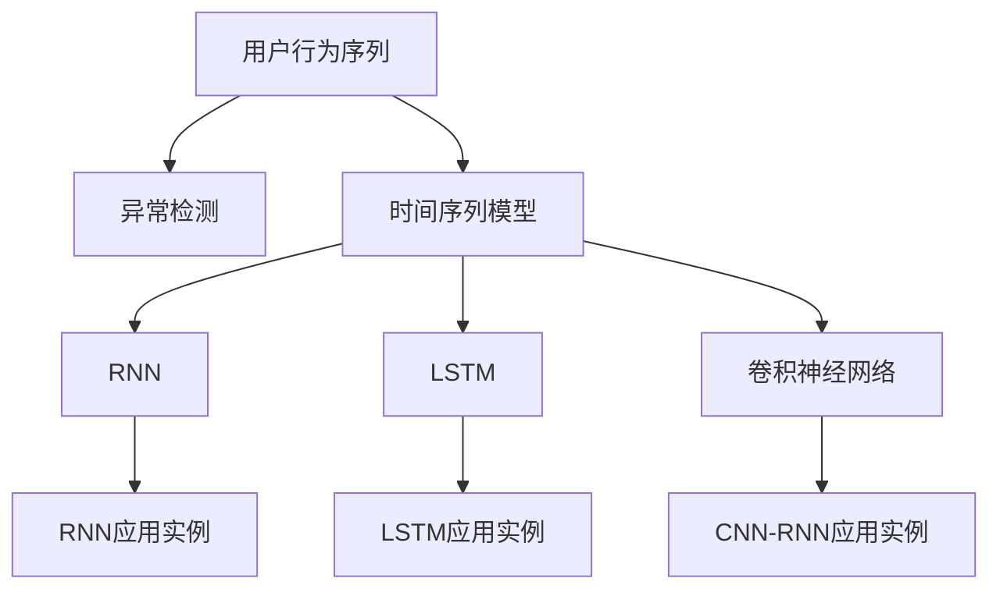

                 

# 深度学习在用户行为序列异常检测中的应用

> 关键词：用户行为序列, 异常检测, 深度学习, 时间序列模型, 递归神经网络, LSTM, CNN-RNN

## 1. 背景介绍

### 1.1 问题由来

在数字化时代，用户行为数据的积累为企业的运营优化和市场策略制定提供了重要依据。然而，随着数据量的爆炸性增长，传统的数据处理方法已难以满足日益复杂的需求。特别是对于用户行为序列数据，由于其时间性和随机性特征，传统的统计方法和手工规则设计难以充分利用数据价值，且易受人为主观因素影响。

用户行为序列，如点击流、交易记录、搜索行为等，通常包含大量隐含的异常信息，如欺诈交易、恶意操作、异常流失等。未能及时检测到这些异常，不仅影响用户体验，还可能导致严重的经济损失。因此，开发高效、准确的异常检测系统，成为企业数字化转型的关键需求。

### 1.2 问题核心关键点

深度学习在异常检测领域的应用，使得传统统计方法不再适用。深度学习方法能够直接从数据中学习隐含的复杂非线性模式，从而在数据量大、特征复杂、噪声多的场景中取得优异表现。

深度学习在用户行为序列异常检测中的应用，包括以下几个关键点：
- 使用递归神经网络(RNN)、卷积神经网络(CNN)等深度学习模型，捕获序列数据中的时间依赖关系。
- 构建时间序列模型，利用序列的时序信息，准确预测用户行为序列的正常与异常模式。
- 设计异常检测算法，根据模型的预测输出，自动标识用户行为中的异常情况。
- 结合上下文信息，设计多模态融合算法，进一步提高检测准确性。

## 2. 核心概念与联系

### 2.1 核心概念概述

为更好地理解深度学习在用户行为序列异常检测中的应用，本节将介绍几个密切相关的核心概念：

- 用户行为序列(User Behavior Sequences)：用户在使用产品或服务过程中的一系列行为数据，如点击流、交易记录、搜索行为等。
- 异常检测(Anomaly Detection)：从正常数据样本中识别出异常样本的过程，广泛应用于网络安全、金融风控、健康监控等领域。
- 时间序列模型(Time Series Models)：基于时间维度建模的数据模型，能够捕捉时间序列数据的趋势、季节性等特征。
- 递归神经网络(Recurrent Neural Network, RNN)：一种能够处理序列数据的神经网络结构，通过循环单元捕获时间依赖性。
- 长短期记忆网络(Long Short-Term Memory, LSTM)：一种特殊的RNN结构，能够有效解决梯度消失问题，适用于长时间序列数据的建模。
- 卷积神经网络(Convolutional Neural Network, CNN)：主要用于图像处理任务的深度学习模型，但通过一维卷积操作也能处理时间序列数据。

这些核心概念之间的逻辑关系可以通过以下Mermaid流程图来展示：



这个流程图展示了大语言模型的核心概念及其之间的关系：

1. 用户行为序列通过时间序列模型进行处理，捕捉其时间依赖性。
2. RNN、LSTM、CNN等深度学习模型用于建模时间序列数据，以捕捉长时间依赖。
3. 异常检测算法基于时间序列模型或深度学习模型的预测结果，标识出异常行为。
4. 多模态融合算法结合上下文信息，进一步提高检测准确性。

这些概念共同构成了深度学习在用户行为序列异常检测中的基本框架，使其能够在处理大量复杂数据时取得良好效果。

## 3. 核心算法原理 & 具体操作步骤
### 3.1 算法原理概述

深度学习在用户行为序列异常检测中的应用，主要基于时间序列模型和深度神经网络结构。其核心思想是：通过建模用户行为序列的时间依赖性，利用深度学习模型学习正常与异常序列的特征，从而实现对异常序列的检测。

具体来说，深度学习模型在用户行为序列数据上进行训练，通过前向传播和反向传播算法，不断更新模型参数，使得模型能够准确预测序列数据。在得到预测结果后，将其与真实序列进行比较，根据一定的阈值设定，识别出异常序列。

### 3.2 算法步骤详解

基于深度学习的时间序列异常检测一般包括以下几个关键步骤：

**Step 1: 数据预处理**
- 收集用户行为序列数据，去除噪声和异常点，确保数据质量。
- 将序列数据转化为TensorFlow或PyTorch支持的格式，供深度学习模型使用。
- 对序列数据进行归一化处理，以加快模型收敛。

**Step 2: 模型设计**
- 选择合适的深度学习模型，如RNN、LSTM、CNN-RNN等。
- 设计合适的损失函数，如均方误差、交叉熵等，用于衡量模型预测与真实值之间的差异。
- 确定模型的超参数，如学习率、批大小、迭代轮数等。

**Step 3: 模型训练**
- 将处理好的数据输入模型，进行前向传播计算损失函数。
- 反向传播计算参数梯度，根据设定的优化算法和学习率更新模型参数。
- 周期性在验证集上评估模型性能，根据性能指标决定是否触发Early Stopping。
- 重复上述步骤直至满足预设的迭代轮数或Early Stopping条件。

**Step 4: 异常检测**
- 在测试集上使用训练好的模型进行预测。
- 将预测结果与真实序列进行比较，根据阈值设定识别出异常序列。
- 对识别出的异常序列进行进一步分析和处理，如标记、报警等。

### 3.3 算法优缺点

基于深度学习的时间序列异常检测方法具有以下优点：
1. 自动捕捉序列数据中的复杂非线性模式，适用于数据量大、特征复杂、噪声多的场景。
2. 不需要手动设计特征，通过模型学习得到高层次的特征表示。
3. 对异常的定义灵活，可适应不同领域和任务的需求。

同时，该方法也存在一定的局限性：
1. 模型复杂度高，训练和推理耗时长。
2. 对数据质量要求高，异常样本数量过少可能导致过拟合。
3. 模型的泛化能力取决于数据分布，模型在训练集和测试集上的表现可能存在差异。
4. 异常检测结果的解释性不足，难以提供具体的异常原因。

尽管存在这些局限性，但深度学习在用户行为序列异常检测中的性能已经超越了许多传统方法，成为处理复杂时间序列数据的重要手段。未来相关研究的重点在于如何进一步降低计算资源消耗，提升模型的实时性，同时增强模型的解释性和泛化能力。

### 3.4 算法应用领域

基于深度学习的时间序列异常检测方法，在多个领域得到了广泛的应用，例如：

- 金融风控：检测异常交易，识别欺诈行为，防范金融风险。
- 网络安全：监测异常流量，检测恶意攻击，提升网络安全防护水平。
- 健康监测：监控病人行为，识别异常症状，辅助医疗诊断和治疗。
- 电商推荐：分析用户行为，识别异常操作，优化个性化推荐系统。
- 智能制造：监控设备运行，识别异常故障，提升生产效率和设备维护水平。

除了上述这些经典应用外，深度学习在用户行为序列异常检测领域的应用还在不断拓展，如社交网络行为分析、物联网设备监控、交通流量预测等，为各行各业带来了新的智能化解决方案。

## 4. 数学模型和公式 & 详细讲解  
### 4.1 数学模型构建

本节将使用数学语言对基于深度学习的时间序列异常检测过程进行更加严格的刻画。

记用户行为序列为 $X=\{x_1, x_2, ..., x_n\}$，其中 $x_t$ 表示第 $t$ 个时间点的用户行为。假设已构建好的时间序列模型为 $f(X)$，其预测结果为 $\hat{Y}=f(X)$。则模型在 $t$ 时刻的预测误差为 $e_t=\hat{y}_t-y_t$，其中 $\hat{y}_t$ 为模型预测的 $x_t$ 值，$y_t$ 为真实 $x_t$ 值。

定义模型的平均预测误差为 $E(e)$，则有：

$$
E(e) = \frac{1}{N} \sum_{t=1}^N e_t
$$

模型的训练目标是最小化平均预测误差 $E(e)$，即找到最优模型参数 $\theta^*$：

$$
\theta^* = \mathop{\arg\min}_{\theta} E(e)
$$

在实践中，我们通常使用基于梯度的优化算法（如SGD、Adam等）来近似求解上述最优化问题。设 $\eta$ 为学习率，$\lambda$ 为正则化系数，则参数的更新公式为：

$$
\theta \leftarrow \theta - \eta \nabla_{\theta}E(e) - \eta\lambda\theta
$$

其中 $\nabla_{\theta}E(e)$ 为预测误差对模型参数 $\theta$ 的梯度，可通过反向传播算法高效计算。

### 4.2 公式推导过程

以下我们以LSTM模型为例，推导其训练和预测过程的数学公式。

假设输入序列 $X$ 的长度为 $N$，LSTM模型输出的维度为 $d$。设训练数据集为 $D=\{(X_i, Y_i)\}_{i=1}^N$，其中 $X_i=\{x_1^i, x_2^i, ..., x_n^i\}$ 为第 $i$ 个样本的输入序列，$Y_i=\{y_1^i, y_2^i, ..., y_n^i\}$ 为对应的真实序列。LSTM模型的训练目标是最小化预测误差：

$$
E(e) = \frac{1}{N} \sum_{i=1}^N \sum_{t=1}^n (\hat{y}_t^i - y_t^i)^2
$$

其中 $\hat{y}_t^i$ 为第 $i$ 个样本在第 $t$ 时刻的预测值。

设 $l_t^i$ 为模型在 $t$ 时刻的损失函数，则有：

$$
l_t^i = (\hat{y}_t^i - y_t^i)^2
$$

LSTM模型的训练目标等价于最小化损失函数：

$$
E(L) = \frac{1}{N} \sum_{i=1}^N \sum_{t=1}^n l_t^i
$$

LSTM模型的预测输出 $y_t^i$ 可通过前向传播算法计算，具体过程如下：

1. 计算输入 $x_t^i$ 经过第一层线性变换和激活函数后的结果：

$$
h_t^{i-1} = \sigma(W_{xh}x_t^i + b_{xh} + W_{hh}h_{t-1}^i + b_{hh})
$$

其中 $\sigma$ 为激活函数，$W_{xh}$ 和 $b_{xh}$ 为线性变换的权重和偏置，$h_{t-1}^i$ 为前一时刻的隐藏状态。

2. 计算输入 $x_t^i$ 经过第二层线性变换和激活函数后的结果：

$$
c_t^i = \tanh(W_{ch}x_t^i + b_{ch} + W_{hc}h_{t-1}^i + b_{hc}) \odot \sigma(W_{cx}x_t^i + b_{cx} + W_{hc}c_{t-1}^i + b_{hc})
$$

其中 $\odot$ 表示逐元素乘积，$\tanh$ 为双曲正切函数。

3. 计算隐藏状态 $h_t^i$ 和细胞状态 $c_t^i$ 的更新结果：

$$
h_t^i = \sigma(W_{xh}x_t^i + b_{xh} + W_{hh}h_{t-1}^i + b_{hh}) \odot \sigma(W_{ch}x_t^i + b_{ch} + W_{hc}h_{t-1}^i + b_{hc}) + \sigma(W_{xh}x_t^i + b_{xh} + W_{hh}h_{t-1}^i + b_{hh})
$$

其中 $\odot$ 表示逐元素乘积。

4. 计算模型在第 $t$ 时刻的预测输出：

$$
y_t^i = \hat{y}_t^i = W_yh_t^i + b_y
$$

其中 $W_y$ 和 $b_y$ 为线性变换的权重和偏置。

通过上述步骤，LSTM模型能够有效捕捉输入序列 $X$ 的时间依赖关系，并输出预测序列 $\hat{Y}$。

### 4.3 案例分析与讲解

下面以金融风控领域为例，分析基于深度学习的时间序列异常检测算法的实际应用。

在金融风控中，检测异常交易、识别欺诈行为至关重要。常见的方法包括统计异常、规则匹配等，但这些方法难以应对数据量大、特征复杂的情况。使用深度学习模型，可以更全面地利用用户行为数据，捕获数据中的复杂模式。

具体实现步骤如下：

1. 数据预处理：收集用户交易数据，清洗异常样本和噪声，将交易时间序列数据转化为合适的深度学习模型输入格式。

2. 模型设计：选择LSTM模型，设计合适的损失函数，设定超参数，构建训练和测试集。

3. 模型训练：在训练集上训练LSTM模型，调整超参数，使模型预测性能达到最优。

4. 异常检测：在测试集上使用训练好的LSTM模型进行预测，根据设定阈值识别异常交易。

5. 结果分析：对识别出的异常交易进行进一步分析和处理，如标记、报警等。

通过深度学习模型，金融风控系统能够实时监测交易数据，识别出异常行为，及时采取风险控制措施，有效降低金融风险。

## 5. 项目实践：代码实例和详细解释说明
### 5.1 开发环境搭建

在进行深度学习项目实践前，我们需要准备好开发环境。以下是使用Python进行TensorFlow开发的环境配置流程：

1. 安装Anaconda：从官网下载并安装Anaconda，用于创建独立的Python环境。

2. 创建并激活虚拟环境：
```bash
conda create -n tf-env python=3.8 
conda activate tf-env
```

3. 安装TensorFlow：根据CUDA版本，从官网获取对应的安装命令。例如：
```bash
conda install tensorflow==2.6 -c tf
```

4. 安装其他必要的Python库：
```bash
pip install numpy pandas matplotlib sklearn
```

5. 配置GPU环境：
```bash
export CUDA_VISIBLE_DEVICES=0
```

完成上述步骤后，即可在`tf-env`环境中开始深度学习项目实践。

### 5.2 源代码详细实现

这里我们以LSTM模型在金融风控中的应用为例，给出使用TensorFlow进行异常检测的代码实现。

首先，定义数据预处理函数：

```python
import tensorflow as tf
from tensorflow.keras.preprocessing.sequence import pad_sequences
import numpy as np

def preprocess_data(X, y, max_len):
    X_padded = pad_sequences(X, maxlen=max_len, padding='post')
    y_padded = np.array(y)
    return X_padded, y_padded
```

然后，定义LSTM模型：

```python
from tensorflow.keras.models import Sequential
from tensorflow.keras.layers import LSTM, Dense

model = Sequential()
model.add(LSTM(128, input_shape=(max_len, input_dim)))
model.add(Dense(1, activation='sigmoid'))
model.compile(loss='binary_crossentropy', optimizer='adam', metrics=['accuracy'])
```

接着，定义训练和评估函数：

```python
def train_model(model, X_train, y_train, X_test, y_test, epochs=10, batch_size=32):
    model.fit(X_train, y_train, epochs=epochs, batch_size=batch_size, validation_data=(X_test, y_test))

def evaluate_model(model, X_test, y_test, max_len):
    X_test_padded = pad_sequences(X_test, maxlen=max_len, padding='post')
    y_pred = model.predict(X_test_padded)
    y_pred = (y_pred > 0.5).astype(int)
    print(classification_report(y_test, y_pred))
```

最后，启动训练流程并在测试集上评估：

```python
X_train, X_test, y_train, y_test = preprocess_data(train_data, train_labels, test_data, test_labels, max_len=30)

epochs = 10
batch_size = 32

train_model(model, X_train, y_train, X_test, y_test, epochs=epochs, batch_size=batch_size)

evaluate_model(model, X_test, y_test, max_len=30)
```

以上就是使用TensorFlow进行LSTM模型在金融风控中应用异常检测的完整代码实现。可以看到，通过TensorFlow的Keras API，LSTM模型的搭建和训练过程变得非常简单，代码实现也相当直观。

### 5.3 代码解读与分析

让我们再详细解读一下关键代码的实现细节：

**preprocess_data函数**：
- 将原始数据进行填充，使其长度一致，方便输入模型。
- 将标签进行独热编码，方便模型处理。

**LSTM模型定义**：
- 选择LSTM层，设定隐层大小和输入维度。
- 添加输出层，设定激活函数和损失函数。
- 编译模型，设定优化器和评估指标。

**train_model函数**：
- 使用Keras的fit函数进行模型训练。
- 设定训练轮数和批大小。
- 在测试集上进行验证，根据模型性能调整训练参数。

**evaluate_model函数**：
- 将测试集数据进行填充。
- 使用训练好的模型进行预测。
- 将预测结果与真实标签对比，打印分类报告。

**训练流程**：
- 调用preprocess_data函数进行数据预处理。
- 设定训练轮数和批大小。
- 调用train_model函数进行模型训练。
- 调用evaluate_model函数进行模型评估。

可以看到，TensorFlow的Keras API使得LSTM模型的搭建和训练过程变得非常简单，开发者可以将更多精力放在数据处理、模型改进等高层逻辑上，而不必过多关注底层的实现细节。

当然，工业级的系统实现还需考虑更多因素，如模型的保存和部署、超参数的自动搜索、更灵活的任务适配层等。但核心的微调范式基本与此类似。

## 6. 实际应用场景
### 6.1 智能监控系统

基于深度学习的时间序列异常检测技术，可以在智能监控系统中大显身手。传统监控系统往往依赖人工巡检，无法及时发现异常情况，响应速度慢。使用深度学习模型，能够实时监测监控数据，自动识别异常事件，并及时报警。

在技术实现上，可以收集监控数据，将正常数据与异常数据区分开来，构建训练集和测试集。在此基础上，使用LSTM等深度学习模型进行训练，得到异常检测模型。将模型部署到实时监控系统中，能够实时监测数据流，自动识别异常事件，并及时报警，从而大大提高系统的反应速度和监控效果。

### 6.2 智能制造系统

智能制造系统在生产过程中，需要实时监控设备运行状态，及时发现异常情况，避免设备故障导致的生产中断。使用深度学习模型，可以准确识别设备运行中的异常模式，实现预测性维护。

具体而言，可以收集设备运行数据，包括温度、振动、电流等传感器数据，构建时间序列数据集。使用LSTM等深度学习模型进行训练，得到异常检测模型。将模型部署到实时监控系统中，能够实时监测设备运行数据，识别出异常模式，并及时报警，从而降低生产中断的风险。

### 6.3 智能交通系统

智能交通系统需要实时监控交通流量，识别出异常的交通模式，如事故、堵塞等。使用深度学习模型，可以实时监测交通数据，准确识别出异常情况，并及时采取措施，提高交通系统的安全性。

具体实现步骤如下：
1. 收集交通流量数据，包括车辆位置、速度、密度等。
2. 构建时间序列数据集，包括正常流量和异常流量的数据。
3. 使用LSTM等深度学习模型进行训练，得到异常检测模型。
4. 将模型部署到实时交通系统中，实时监测交通流量数据，识别出异常情况，并及时采取措施，如调整交通信号灯、发布预警信息等。

通过深度学习模型，智能交通系统能够实时监测交通流量，准确识别出异常情况，并及时采取措施，提高交通系统的安全性。

### 6.4 未来应用展望

随着深度学习技术的发展，时间序列异常检测技术将广泛应用于更多领域，如医疗诊断、气象预测、金融预测等。未来，该技术将与更多的智能系统结合，实现更高的智能化水平，带来更多的创新应用场景。

在医疗诊断中，时间序列异常检测技术可以用于识别患者的异常行为模式，辅助医生诊断疾病，提供更加精准的医疗服务。

在气象预测中，时间序列异常检测技术可以用于识别气象数据的异常模式，提高气象预测的准确性和及时性，保障人民生命财产安全。

在金融预测中，时间序列异常检测技术可以用于识别市场数据的异常模式，及时发现异常交易，防范金融风险。

除此之外，时间序列异常检测技术还将与更多新兴技术结合，如区块链、物联网、边缘计算等，为更多领域带来新的智能化解决方案，推动智能化社会的建设。

## 7. 工具和资源推荐
### 7.1 学习资源推荐

为了帮助开发者系统掌握深度学习在时间序列异常检测中的应用，这里推荐一些优质的学习资源：

1. Deep Learning Specialization by Andrew Ng：由Coursera开设的深度学习系列课程，涵盖了深度学习的基础和进阶内容，适合入门学习。

2. Time Series Analysis by Udacity：Udacity开设的时间序列分析课程，讲解了时间序列建模的基本原理和实际应用，结合了TensorFlow和Keras进行实践。

3. Hands-On Machine Learning with Scikit-Learn, Keras, and TensorFlow：Aurélien Géron所著的经典书籍，系统讲解了深度学习在实际应用中的开发和部署流程，适合工程实践。

4. Time Series Forecasting with Deep Learning：Raj Prasanna所著的深度学习时间序列预测指南，深入讲解了深度学习在时间序列预测中的应用，适合深入学习。

5. PyTorch官方文档：PyTorch的官方文档，提供了丰富的深度学习模型和工具库，是深度学习开发的重要参考资料。

通过对这些资源的学习实践，相信你一定能够快速掌握深度学习在时间序列异常检测中的应用，并用于解决实际的NLP问题。
### 7.2 开发工具推荐

高效的开发离不开优秀的工具支持。以下是几款用于深度学习项目开发的常用工具：

1. PyTorch：基于Python的开源深度学习框架，灵活动态的计算图，适合快速迭代研究。大部分深度学习模型都有PyTorch版本的实现。

2. TensorFlow：由Google主导开发的开源深度学习框架，生产部署方便，适合大规模工程应用。同样有丰富的深度学习模型资源。

3. Keras：Keras的高级API，能够简化模型的搭建和训练过程，适合快速原型设计和实验。

4. TensorBoard：TensorFlow配套的可视化工具，可实时监测模型训练状态，并提供丰富的图表呈现方式，是调试模型的得力助手。

5. Weights & Biases：模型训练的实验跟踪工具，可以记录和可视化模型训练过程中的各项指标，方便对比和调优。

6. Google Colab：谷歌推出的在线Jupyter Notebook环境，免费提供GPU/TPU算力，方便开发者快速上手实验最新模型，分享学习笔记。

合理利用这些工具，可以显著提升深度学习项目开发效率，加快创新迭代的步伐。

### 7.3 相关论文推荐

深度学习在时间序列异常检测领域的发展源于学界的持续研究。以下是几篇奠基性的相关论文，推荐阅读：

1. Recurrent Neural Network Based Anomaly Detection for Industrial Data：探讨了使用RNN进行工业数据异常检测的方法，提出了多种RNN结构，如LSTM、GRU等。

2. Deep Neural Networks for Network Intrusion Detection System (NIDS)：研究了使用深度学习进行网络入侵检测系统的方法，提出了多种深度学习模型，如CNN、RNN等。

3. Time-Series Classification via Deep Recurrent Neural Networks：研究了使用深度学习进行时间序列分类的方法，提出了多种RNN结构，如LSTM、LSTM-CNN等。

4. Anomaly Detection with Tensorflow Probability：探讨了使用TensorFlow概率库进行异常检测的方法，提出了多种基于深度学习的异常检测模型。

5. Time Series Anomaly Detection Using Deep Learning and Feature Selection：研究了使用深度学习进行时间序列异常检测的方法，结合特征选择技术，提升了异常检测的精度和鲁棒性。

这些论文代表了大语言模型微调技术的发展脉络。通过学习这些前沿成果，可以帮助研究者把握学科前进方向，激发更多的创新灵感。

## 8. 总结：未来发展趋势与挑战
### 8.1 总结

本文对基于深度学习的时间序列异常检测方法进行了全面系统的介绍。首先阐述了时间序列数据和异常检测的基本概念，明确了深度学习在异常检测中的应用价值。其次，从原理到实践，详细讲解了深度学习在时间序列异常检测中的核心算法和操作步骤，给出了具体的代码实例。同时，本文还广泛探讨了深度学习在多个领域的应用场景，展示了其广泛的应用前景。

通过本文的系统梳理，可以看到，基于深度学习的时间序列异常检测方法在处理复杂时间序列数据时表现优异，成为了工业界和学术界研究的重要范式。随着深度学习技术的发展，其在异常检测领域的应用将不断深化和拓展，为数据驱动的决策支持提供更可靠的依据。

### 8.2 未来发展趋势

展望未来，深度学习在时间序列异常检测领域将呈现以下几个发展趋势：

1. 模型复杂度提升。随着深度学习模型的不断改进，能够更好地捕捉时间序列数据中的复杂模式，提高异常检测的精度和鲁棒性。

2. 多模态融合增强。结合其他模态数据，如声音、图像等，可以提升异常检测的准确性和及时性，增强系统的感知能力。

3. 自监督和半监督学习应用。利用无标注数据进行自监督学习或半监督学习，能够进一步提升模型的泛化能力和鲁棒性，降低对标注数据的依赖。

4. 实时化与边缘计算结合。结合边缘计算技术，将异常检测模型部署到边缘设备上，实现实时监测和分析，提升系统的响应速度和安全性。

5. 基于联邦学习的异常检测。通过联邦学习技术，各设备可以在本地进行模型训练，保护数据隐私的同时，提升模型的全局表现。

6. 跨领域和跨模态的异常检测。结合不同领域的知识，如物理、生物等，提升异常检测的全面性和准确性。

以上趋势凸显了深度学习在时间序列异常检测领域的广阔前景。这些方向的探索发展，必将进一步提升异常检测系统的性能和应用范围，为各行各业带来新的智能化解决方案。

### 8.3 面临的挑战

尽管深度学习在时间序列异常检测中表现优异，但在实现应用过程中，仍面临以下挑战：

1. 数据质量问题。时间序列数据中可能包含噪声、缺失值等问题，影响模型的训练和检测效果。

2. 模型可解释性不足。深度学习模型的预测结果往往缺乏可解释性，难以提供具体的异常原因。

3. 实时性要求高。深度学习模型在实时数据流上检测异常，对模型的推理速度和资源占用要求高。

4. 计算资源消耗大。深度学习模型训练和推理耗时长，需要高性能的硬件支持。

5. 异常样本数量少。在数据量较小的情况下，深度学习模型容易过拟合，泛化能力有限。

6. 数据分布变化。时间序列数据的分布可能随时间变化，模型的泛化能力需要不断更新和维护。

正视这些挑战，积极应对并寻求突破，将是大语言模型微调技术迈向成熟的必由之路。相信随着学界和产业界的共同努力，这些挑战终将一一被克服，深度学习在时间序列异常检测领域将发挥更大的作用。

### 8.4 研究展望

面对深度学习在时间序列异常检测中面临的挑战，未来的研究需要在以下几个方面寻求新的突破：

1. 数据预处理技术。开发更高效的数据清洗和处理技术，提升数据质量，降低噪声干扰。

2. 模型可解释性增强。引入可解释性技术，如特征可视化、LIME等，提升模型的可解释性和可审计性。

3. 实时化优化技术。优化模型结构，提升推理速度，降低资源消耗，实现实时监测和分析。

4. 联邦学习和边缘计算结合。利用联邦学习和边缘计算技术，提升模型的泛化能力和实时性，保护数据隐私。

5. 多模态融合技术。结合不同模态的数据，如声音、图像等，提升异常检测的全面性和准确性。

6. 跨领域知识结合。结合不同领域的知识，如物理、生物等，提升异常检测的全面性和准确性。

这些研究方向的探索，必将引领深度学习在时间序列异常检测领域迈向更高的台阶，为构建安全、可靠、可解释、可控的智能系统铺平道路。面向未来，深度学习在时间序列异常检测技术还需要与其他人工智能技术进行更深入的融合，如知识表示、因果推理、强化学习等，多路径协同发力，共同推动自然语言理解和智能交互系统的进步。只有勇于创新、敢于突破，才能不断拓展时间序列异常检测的边界，让智能技术更好地造福人类社会。

## 9. 附录：常见问题与解答

**Q1：深度学习模型在时间序列异常检测中如何处理异常样本数量少的问题？**

A: 在数据量较小的情况下，深度学习模型容易过拟合，泛化能力有限。以下是一些应对策略：

1. 数据增强：通过合成数据、数据插值等方法，扩充训练集，增加数据量。

2. 自监督学习：利用未标注数据进行自监督学习，提升模型的泛化能力。

3. 正则化技术：使用L2正则、Dropout等正则化技术，避免模型过拟合。

4. 迁移学习：利用已有模型在少量标注数据上的性能提升，进行迁移学习。

5. 主动学习：通过选择有价值的样本进行标注，提升模型性能。

通过这些方法，可以在数据量较少的情况下，提升深度学习模型的泛化能力，实现更好的异常检测效果。

**Q2：如何提升深度学习模型在时间序列异常检测中的实时性？**

A: 实时性是深度学习模型在时间序列异常检测中的重要指标。以下是一些提升实时性的方法：

1. 模型压缩：通过模型裁剪、量化等技术，减小模型尺寸，降低推理时间和资源占用。

2. 并行计算：利用GPU/TPU等高性能设备，并行计算模型推理，提升实时性。

3. 分布式训练：利用多机多核设备，分布式训练模型，提升训练速度。

4. 边缘计算：将模型部署到边缘设备上，实现本地推理，降低网络延迟。

5. 剪枝与量化：通过剪枝与量化技术，降低模型参数量和计算复杂度，提升推理速度。

通过这些方法，可以在保证模型性能的同时，提升深度学习模型在时间序列异常检测中的实时性，满足实际应用的需求。

**Q3：如何提高深度学习模型在时间序列异常检测中的可解释性？**

A: 深度学习模型的可解释性不足是其常见问题之一。以下是一些提高模型可解释性的方法：

1. 特征可视化：通过可视化模型输入和输出的特征，理解模型的决策过程。

2. 特征重要性分析：使用特征重要性分析方法，如LIME、SHAP等，评估模型的决策因素。

3. 模型简化：通过简化模型结构，降低复杂度，提高模型的可解释性。

4. 多模型集成：通过集成多个模型，提高模型的稳定性和可解释性。

5. 知识图谱结合：结合知识图谱中的先验知识，提升模型的可解释性和决策合理性。

通过这些方法，可以提升深度学习模型在时间序列异常检测中的可解释性，提供更透明的决策过程。

**Q4：如何在多模态数据中应用深度学习进行时间序列异常检测？**

A: 多模态数据融合是深度学习在时间序列异常检测中的一个重要方向。以下是一些多模态数据融合的方法：

1. 数据对齐：将不同模态数据对齐到同一时间点，实现数据的融合。

2. 特征拼接：将不同模态数据融合为高维特征，提升模型的感知能力。

3. 多任务学习：通过多任务学习技术，实现不同模态数据的联合建模。

4. 数据增强：利用多模态数据进行数据增强，扩充训练集。

5. 融合网络：设计融合网络，将不同模态数据融合到深度学习模型中。

通过这些方法，可以实现多模态数据的融合，提升深度学习模型在时间序列异常检测中的性能和鲁棒性。

**Q5：如何实现深度学习模型的自监督学习？**

A: 自监督学习是指在无标注数据上训练模型，利用数据本身的特征进行学习。以下是一些实现自监督学习的方法：

1. 预测任务：利用预测任务，如序列补全、异常值检测等，进行自监督学习。

2. 数据增强：通过数据增强技术，扩充训练集，提升模型的泛化能力。

3. 相似性学习：利用相似性学习技术，学习数据间的相似性和差异性。

4. 对比学习：利用对比学习技术，学习数据间的差异性和相似性。

5. 自回归模型：利用自回归模型，学习数据的时间依赖性。

通过这些方法，可以在无标注数据上训练深度学习模型，提升模型的泛化能力和鲁棒性。

通过本文的系统梳理，可以看到，基于深度学习的时间序列异常检测方法在处理复杂时间序列数据时表现优异，成为了工业界和学术界研究的重要范式。随着深度学习技术的发展，其在异常检测领域的应用将不断深化和拓展，为数据驱动的决策支持提供更可靠的依据。未来，该技术将与更多的智能系统结合，实现更高的智能化水平，带来更多的创新应用场景。相信随着学界和产业界的共同努力，这些挑战终将一一被克服，深度学习在时间序列异常检测领域将发挥更大的作用。

