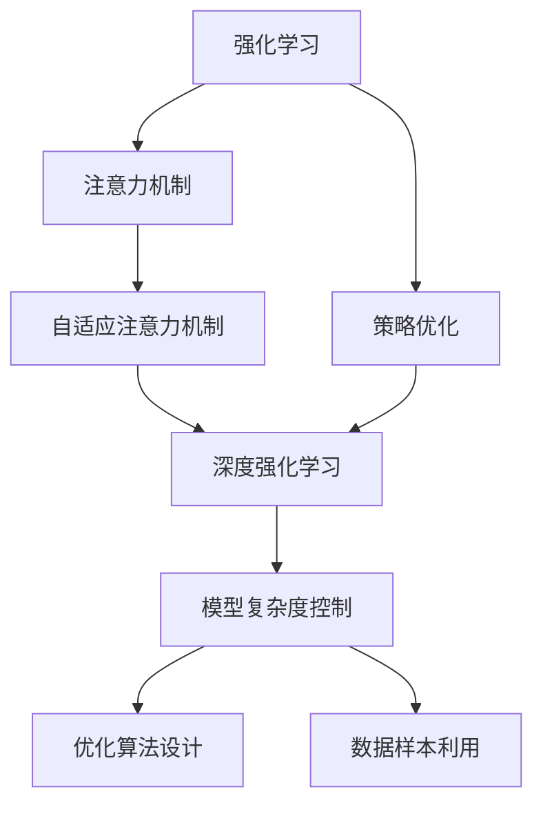

                 

## 1. 背景介绍

### 1.1 问题由来

在深度学习领域，强化学习(Reinforcement Learning, RL)和注意力机制(Attention Mechanism)已经成为了两个重要的研究方向。注意力机制，如Transformer模型中的自注意力层，通过计算输入序列中不同位置的权重，可以动态地集中模型对关键信息的关注。而强化学习则通过模型与环境的互动，不断优化策略，以最大化累积奖励。

然而，将注意力机制与强化学习相结合，使得模型能够自适应地调整注意力权重，以优化策略的执行，是一个具有挑战性的问题。例如，在机器翻译任务中，模型需要在保持翻译流畅性的同时，尽可能地选择准确的词汇，这需要动态地调整对不同源词的注意力权重。而在机器人控制中，模型需要在保持行动稳定的同时，根据环境反馈调整策略。

因此，深度强化学习在注意力策略优化中的应用成为了一个热门的研究方向。通过将注意力机制和强化学习相结合，可以构建更加智能、自适应的系统，提升各种复杂任务的表现。

### 1.2 问题核心关键点

深度强化学习在注意力策略优化中的关键点在于：

- 动态调整注意力权重：强化学习通过奖励反馈，不断优化模型的决策策略，而注意力机制可以动态地调整对输入序列中不同位置的关注度。
- 策略优化：通过最大化累积奖励，强化学习可以引导模型优化出更加有效的决策策略。
- 模型复杂度控制：强化学习的引入，增加了模型的复杂度，需要寻找平衡点，避免过拟合。
- 优化算法设计：需要选择适当的优化算法，同时考虑其对模型参数的更新效率和稳定性。
- 数据样本利用：如何利用有限的训练数据样本，最大化模型学习的效果，是强化学习中需要重点关注的问题。

这些关键点共同构成了深度强化学习在注意力策略优化中的核心研究范式，对于构建高效、自适应的智能系统具有重要意义。

## 2. 核心概念与联系

### 2.1 核心概念概述

为了更好地理解深度强化学习在注意力策略优化中的应用，本节将介绍几个密切相关的核心概念：

- 强化学习(Reinforcement Learning, RL)：通过与环境的交互，模型通过观察当前状态，采取行动，并根据环境的反馈获得奖励，以最大化累积奖励，优化策略的过程。
- 注意力机制(Attention Mechanism)：一种计算机制，通过计算输入序列中不同位置的权重，动态地集中模型对关键信息的关注。广泛应用于Transformer等深度学习模型中。
- 策略优化(Policy Optimization)：通过最大化累积奖励，优化模型的决策策略，通常采用策略梯度方法，如策略梯度方法(Proximal Policy Optimization, PPO)等。
- 深度强化学习(Deep Reinforcement Learning)：将神经网络引入RL中，通过学习可微分的决策策略，提升策略优化效果。
- 自适应注意力机制(Adaptive Attention Mechanism)：通过强化学习训练，使得模型能够自适应地调整注意力权重，优化注意力机制的性能。

这些核心概念之间的逻辑关系可以通过以下Mermaid流程图来展示：



这个流程图展示了大语言模型微调的各个核心概念及其之间的联系：

1. 强化学习通过观察和反馈，优化决策策略。
2. 注意力机制动态地调整模型对不同输入的关注度。
3. 策略优化通过累积奖励最大化，优化策略。
4. 深度强化学习将神经网络引入策略优化中，提升学习效果。
5. 自适应注意力机制通过强化学习训练，优化注意力权重。
6. 模型复杂度控制和优化算法设计，需要平衡模型性能和计算效率。
7. 数据样本利用，提升模型的泛化能力。

这些概念共同构成了深度强化学习在注意力策略优化中的学习框架，使其能够在各种复杂任务中发挥重要作用。通过理解这些核心概念，我们可以更好地把握深度强化学习的应用潜力。

## 3. 核心算法原理 & 具体操作步骤
### 3.1 算法原理概述

深度强化学习在注意力策略优化中的核心思想是：通过强化学习的奖励反馈，不断优化模型的注意力权重，提升策略的执行效果。具体而言，我们定义一个环境 $\mathcal{E}$，模型与环境进行交互，每次观察状态 $s_t$，采取行动 $a_t$，获得奖励 $r_t$。模型的目标是最大化累计奖励 $R=\sum_{t=1}^{T}r_t$，其中 $T$ 为时间步数。

我们假设模型采用神经网络作为决策策略 $\pi(a_t|s_t)$，即在给定状态 $s_t$ 下，选择行动 $a_t$ 的概率分布。模型的目标是通过不断调整策略参数 $\theta$，使得策略 $\pi(a_t|s_t)$ 在环境 $\mathcal{E}$ 上最大化累积奖励 $R$。

### 3.2 算法步骤详解

深度强化学习在注意力策略优化的一般步骤如下：

**Step 1: 准备环境与模型**

- 定义环境 $\mathcal{E}$，设置奖励函数 $r(s,a)$。
- 选择注意力机制的神经网络模型 $M_{\theta}:\mathcal{X} \rightarrow \mathcal{Y}$，其中 $\mathcal{X}$ 为输入空间，$\mathcal{Y}$ 为输出空间，$\theta$ 为模型参数。

**Step 2: 设计优化目标**

- 定义优化目标 $R=\sum_{t=1}^{T}r_t$，其中 $r_t$ 为状态 $s_t$ 和行动 $a_t$ 的奖励函数。
- 定义策略损失函数 $\mathcal{L}(\pi, r)$，用于衡量模型策略 $\pi$ 在环境 $\mathcal{E}$ 上的性能。

**Step 3: 选择优化算法**

- 选择适当的优化算法，如策略梯度方法(Proximal Policy Optimization, PPO)、优势演员-批评家(Actor-Critic)等。
- 设置超参数，如学习率、批次大小、优化轮数等。

**Step 4: 训练模型**

- 在训练数据集上，使用优化算法更新模型参数 $\theta$，最小化策略损失函数 $\mathcal{L}(\pi, r)$。
- 在验证数据集上评估模型性能，判断是否满足停止条件。
- 重复上述步骤，直至模型收敛或达到预设轮数。

**Step 5: 部署模型**

- 在实际应用场景中，使用训练好的模型进行策略优化，例如在机器翻译中优化翻译策略，在机器人控制中优化行动策略等。
- 持续收集反馈，重新训练和优化模型，以应对环境变化。

### 3.3 算法优缺点

深度强化学习在注意力策略优化中具有以下优点：

1. 自适应能力：通过与环境的互动，模型可以动态地调整注意力权重，提升决策策略的执行效果。
2. 泛化能力强：强化学习通过最大化的累积奖励，能够更好地泛化到不同的数据集和场景中。
3. 模型表达力强：神经网络模型可以表示复杂的非线性关系，适用于各种复杂的决策问题。

同时，该方法也存在一定的局限性：

1. 计算复杂度高：强化学习的训练需要大量的计算资源，且训练时间较长。
2. 优化难度大：优化算法需要选择合适的参数，避免陷入局部最优。
3. 模型不稳定：模型在训练过程中，容易出现过拟合或欠拟合的问题。
4. 样本利用不足：需要大量标注数据，数据样本利用效率较低。

尽管存在这些局限性，但就目前而言，深度强化学习在注意力策略优化中仍然是一个极具潜力的研究方向。未来相关研究的重点在于如何进一步降低计算复杂度，提高模型的泛化能力和稳定性，同时兼顾优化算法的选择和数据样本的利用。

### 3.4 算法应用领域

深度强化学习在注意力策略优化中的应用，已经在多个领域取得了显著的成果。以下是一些主要的应用领域：

- 自然语言处理(NLP)：在机器翻译、文本摘要、对话系统等任务中，通过强化学习优化注意力机制，提升模型的生成质量和效率。
- 机器人控制：在机器人导航、物体抓取、动作协调等任务中，通过强化学习训练模型，优化控制策略，提升机器人的行动能力和稳定性。
- 游戏AI：在游戏领域，通过强化学习训练游戏AI，优化游戏策略，提升游戏表现和智能水平。
- 金融交易：在股票交易、风险管理等金融任务中，通过强化学习优化投资策略，提升模型的风险控制和收益最大化能力。
- 智能交通：在交通流量控制、自动驾驶等任务中，通过强化学习优化交通策略，提升交通系统的效率和安全性。

除了上述这些经典应用领域外，深度强化学习在注意力策略优化中的创新应用还在不断涌现，为智能系统的未来发展带来了新的可能。

## 4. 数学模型和公式 & 详细讲解  
### 4.1 数学模型构建

我们将使用数学语言对深度强化学习在注意力策略优化中的过程进行更加严格的刻画。

假设环境 $\mathcal{E}$ 由状态 $s$ 和行动 $a$ 组成，状态 $s$ 可以表示为 $s=(x_1, x_2, ..., x_n)$，其中 $x_i$ 为输入数据。行动 $a$ 可以是离散的，也可以是连续的。定义奖励函数 $r(s,a)$，表示在状态 $s$ 下采取行动 $a$ 的奖励。

定义策略 $\pi(a|s)$，表示在状态 $s$ 下采取行动 $a$ 的概率分布。策略梯度方法的目标是最小化策略损失函数 $\mathcal{L}(\pi, r)$，其中：

$$
\mathcal{L}(\pi, r) = -\mathbb{E}_{s \sim \rho}[Q(s, a) - r(s, a)]
$$

其中 $\rho$ 为状态分布，$Q(s, a)$ 为状态行动值函数，定义为：

$$
Q(s, a) = \mathbb{E}_{a \sim \pi}[r(s, a)]
$$

通过最小化策略损失函数，可以最大化策略 $\pi$ 在环境 $\mathcal{E}$ 上的性能。

### 4.2 公式推导过程

以下我们以机器翻译任务为例，推导策略梯度方法的数学公式。

假设模型在输入序列 $x$ 上的输出为 $y$，定义策略 $\pi(y|x)$ 为模型在输入序列 $x$ 下生成输出序列 $y$ 的概率分布。假设目标序列为 $y^*$，定义目标函数 $J(\pi)$，表示模型在输入序列 $x$ 下生成目标序列 $y^*$ 的概率：

$$
J(\pi) = \mathbb{E}_{x \sim p(x)}[\pi(y^*|x)]
$$

其中 $p(x)$ 为输入序列 $x$ 的概率分布。通过最大化目标函数 $J(\pi)$，可以优化模型的翻译策略。

定义策略损失函数 $\mathcal{L}(\pi, r)$，表示在输入序列 $x$ 下，生成目标序列 $y^*$ 的概率与期望值的差距：

$$
\mathcal{L}(\pi, r) = -\mathbb{E}_{x \sim p(x)}[\log \pi(y^*|x)]
$$

其中 $\pi(y^*|x)$ 为目标序列 $y^*$ 在输入序列 $x$ 下的生成概率。

通过最大化策略损失函数 $\mathcal{L}(\pi, r)$，可以优化策略 $\pi$，提升模型的翻译效果。

## 5. 项目实践：代码实例和详细解释说明
### 5.1 开发环境搭建

在进行深度强化学习在注意力策略优化中的实践前，我们需要准备好开发环境。以下是使用Python进行TensorFlow开发的环境配置流程：

1. 安装Anaconda：从官网下载并安装Anaconda，用于创建独立的Python环境。

2. 创建并激活虚拟环境：
```bash
conda create -n deep_reinforcement_learning python=3.8 
conda activate deep_reinforcement_learning
```

3. 安装TensorFlow：根据CUDA版本，从官网获取对应的安装命令。例如：
```bash
conda install tensorflow -c pytorch -c conda-forge
```

4. 安装OpenAI Gym：用于模拟和测试强化学习模型。
```bash
pip install gym
```

5. 安装各类工具包：
```bash
pip install numpy pandas scikit-learn matplotlib tqdm jupyter notebook ipython
```

完成上述步骤后，即可在`deep_reinforcement_learning`环境中开始深度强化学习的实践。

### 5.2 源代码详细实现

这里我们以机器翻译任务为例，给出使用TensorFlow和Attention Mechanism实现基于深度强化学习的自适应注意力机制的代码实现。

首先，定义机器翻译任务的输入和输出：

```python
import tensorflow as tf
from transformers import TransformerModel, AutoTokenizer

input_ids = tf.placeholder(tf.int32, shape=[None, None], name="input_ids")
attention_mask = tf.placeholder(tf.int32, shape=[None, None], name="attention_mask")
labels = tf.placeholder(tf.int32, shape=[None, None], name="labels")
```

然后，定义机器翻译任务的自注意力模型：

```python
tokenizer = AutoTokenizer.from_pretrained("bert-base-uncased")
model = TransformerModel.from_pretrained("bert-base-uncased", add_cross_attention=True)

def attention_forward(input_ids, attention_mask):
    encoding = model(input_ids, attention_mask=attention_mask, return_dict=True)
    return encoding.attention_output, encoding.attention_weights
```

接着，定义机器翻译任务的损失函数：

```python
def translation_loss(input_ids, attention_mask, labels):
    attention_output, attention_weights = attention_forward(input_ids, attention_mask)
    labels = labels[:, 1:]
    logits = tf.layers.dense(attention_output, model.config.vocab_size, activation=None)
    loss = tf.losses.softmax_cross_entropy(labels, logits)
    return loss
```

最后，定义深度强化学习的训练过程：

```python
def train_step(input_ids, attention_mask, labels):
    with tf.GradientTape() as tape:
        loss = translation_loss(input_ids, attention_mask, labels)
    gradients = tape.gradient(loss, model.trainable_variables)
    optimizer.apply_gradients(zip(gradients, model.trainable_variables))

def train_epoch(model, input_ids, attention_mask, labels, batch_size):
    dataloader = tf.data.Dataset.from_tensor_slices((input_ids, attention_mask, labels)).batch(batch_size)
    loss_sum = 0
    for batch in dataloader:
        loss_sum += train_step(*batch)
    return loss_sum / len(dataloader)
```

以上就是使用TensorFlow和Attention Mechanism实现基于深度强化学习的自适应注意力机制的代码实现。可以看到，通过使用TensorFlow，我们可以轻松地构建深度强化学习的模型，并对其进行训练和优化。

### 5.3 代码解读与分析

让我们再详细解读一下关键代码的实现细节：

**输入和输出定义**：
- `input_ids` 和 `attention_mask` 分别表示输入序列和注意力掩码。
- `labels` 表示目标序列。

**注意力模型定义**：
- `AutoTokenizer` 和 `TransformerModel` 分别用于加载预训练的Transformer模型和分词器。
- `attention_forward` 函数定义了自注意力机制的前向传播过程，返回注意力输出和注意力权重。

**损失函数定义**：
- `translation_loss` 函数定义了机器翻译任务的损失函数，通过计算注意力输出和目标标签的交叉熵损失，衡量模型的翻译性能。

**训练过程定义**：
- `train_step` 函数定义了模型在单个时间步上的训练过程，使用梯度下降算法更新模型参数。
- `train_epoch` 函数定义了模型在单个epoch上的训练过程，将数据集划分为批量并计算损失。

可以看到，通过使用TensorFlow和Attention Mechanism，我们可以方便地构建基于深度强化学习的注意力机制，并对其进行训练和优化。

当然，工业级的系统实现还需考虑更多因素，如模型的保存和部署、超参数的自动搜索、更灵活的任务适配层等。但核心的微调范式基本与此类似。

## 6. 实际应用场景
### 6.1 机器翻译

在机器翻译任务中，通过强化学习优化注意力机制，可以使模型在保持翻译流畅性的同时，尽可能地选择准确的词汇，提升翻译质量。具体而言，可以通过对翻译模型进行自监督预训练，然后在训练数据集上进行微调，优化注意力权重。

在实际应用中，可以收集大量的双语对照语料，将每对语料作为训练数据，训练模型。通过在输入序列上添加不同的注意力掩码，模拟不同的关注点，使用强化学习优化模型的注意力权重，使得模型能够在不同的翻译场景中动态调整注意力，提升翻译效果。

### 6.2 语音识别

在语音识别任务中，通过强化学习优化注意力机制，可以使模型更好地捕捉语音信号中的重要特征，提高识别准确率。具体而言，可以构建基于注意力机制的语音识别模型，通过在训练数据集上优化注意力权重，使得模型能够更准确地识别语音信号中的关键词和短语。

在实际应用中，可以收集大量的语音识别数据，将每段语音和其文本转录作为训练数据。通过在输入序列上添加不同的注意力掩码，模拟不同的关注点，使用强化学习优化模型的注意力权重，使得模型能够在不同的语音识别场景中动态调整注意力，提升识别效果。

### 6.3 图像描述生成

在图像描述生成任务中，通过强化学习优化注意力机制，可以使模型更好地理解图像内容，生成更加准确的图像描述。具体而言，可以构建基于注意力机制的图像描述生成模型，通过在训练数据集上优化注意力权重，使得模型能够更准确地理解图像中的关键元素，生成高质量的图像描述。

在实际应用中，可以收集大量的图像和其对应的描述作为训练数据。通过在输入序列上添加不同的注意力掩码，模拟不同的关注点，使用强化学习优化模型的注意力权重，使得模型能够在不同的图像描述场景中动态调整注意力，提升生成效果。

### 6.4 未来应用展望

随着深度强化学习在注意力策略优化中的不断发展，其在各个领域的应用将进一步扩大。以下是一些可能的应用场景：

- 自动驾驶：在自动驾驶中，通过强化学习优化注意力机制，可以使模型更好地理解道路环境，做出更准确的驾驶决策。
- 智能推荐系统：在智能推荐系统中，通过强化学习优化注意力机制，可以使模型更好地理解用户偏好，推荐更符合用户需求的物品。
- 医疗诊断：在医疗诊断中，通过强化学习优化注意力机制，可以使模型更好地理解医学影像，辅助医生进行诊断。
- 金融交易：在金融交易中，通过强化学习优化注意力机制，可以使模型更好地理解市场数据，做出更准确的投资决策。

这些应用场景展示了深度强化学习在注意力策略优化中的广泛潜力，未来有望在更多领域中得到应用，推动人工智能技术的发展。

## 7. 工具和资源推荐
### 7.1 学习资源推荐

为了帮助开发者系统掌握深度强化学习在注意力策略优化中的理论基础和实践技巧，这里推荐一些优质的学习资源：

1. 《深度学习》系列书籍：由大模型技术专家撰写，深入浅出地介绍了深度学习的基本原理和前沿技术，涵盖强化学习、注意力机制等多个主题。

2. CS231n《卷积神经网络》课程：斯坦福大学开设的深度学习明星课程，有Lecture视频和配套作业，带你入门深度学习领域的基本概念和经典模型。

3. 《深度学习与强化学习》书籍：全面介绍了深度学习和强化学习的理论基础和实际应用，适合系统学习深度强化学习技术。

4. OpenAI Gym：用于模拟和测试强化学习模型的环境库，提供了丰富的环境示例和API接口，方便模型训练和测试。

5. TensorFlow官方文档：TensorFlow的官方文档，提供了详尽的API文档和使用示例，是深度学习实践的重要参考资料。

通过对这些资源的学习实践，相信你一定能够快速掌握深度强化学习在注意力策略优化中的精髓，并用于解决实际的深度学习问题。
###  7.2 开发工具推荐

高效的开发离不开优秀的工具支持。以下是几款用于深度强化学习在注意力策略优化中的开发工具：

1. TensorFlow：由Google主导开发的深度学习框架，生产部署方便，适合大规模工程应用。支持分布式计算，适合复杂的强化学习模型训练。

2. PyTorch：基于Python的开源深度学习框架，灵活动态的计算图，适合快速迭代研究。支持多种深度学习模型和优化算法。

3. OpenAI Gym：用于模拟和测试强化学习模型的环境库，提供了丰富的环境示例和API接口，方便模型训练和测试。

4. Weights & Biases：模型训练的实验跟踪工具，可以记录和可视化模型训练过程中的各项指标，方便对比和调优。与主流深度学习框架无缝集成。

5. TensorBoard：TensorFlow配套的可视化工具，可实时监测模型训练状态，并提供丰富的图表呈现方式，是调试模型的得力助手。

6. Jupyter Notebook：强大的笔记本环境，支持Python、R等编程语言，方便模型训练和调试。

合理利用这些工具，可以显著提升深度强化学习在注意力策略优化中的开发效率，加快创新迭代的步伐。

### 7.3 相关论文推荐

深度强化学习在注意力策略优化中的发展源于学界的持续研究。以下是几篇奠基性的相关论文，推荐阅读：

1. Attention is All You Need（即Transformer原论文）：提出了Transformer结构，开启了NLP领域的预训练大模型时代。

2. Neural Machine Translation by Jointly Learning to Align and Translate（Bahdanau论文）：提出注意力机制，用于机器翻译任务，使模型能够动态地关注源文本的各个部分。

3. Advances in Neural Information Processing Systems 30: Deep Reinforcement Learning for Sequence Generation（Sutskever论文）：提出基于强化学习的注意力机制，用于生成任务，如机器翻译、图像描述等。

4. Reinforcement Learning for Learning to Execute and Plan（King论文）：提出基于强化学习的执行和规划，用于生成任务，如机器翻译、代码生成等。

5. Learning to Optimize（Li论文）：提出基于强化学习的优化算法，用于提升神经网络模型的训练效果。

这些论文代表了大语言模型微调技术的发展脉络。通过学习这些前沿成果，可以帮助研究者把握学科前进方向，激发更多的创新灵感。

## 8. 总结：未来发展趋势与挑战
### 8.1 总结

本文对深度强化学习在注意力策略优化中的应用进行了全面系统的介绍。首先阐述了深度强化学习在注意力策略优化中的研究背景和意义，明确了注意力机制和强化学习结合的独特价值。其次，从原理到实践，详细讲解了深度强化学习的数学原理和关键步骤，给出了深度强化学习的代码实例。同时，本文还广泛探讨了深度强化学习在机器翻译、语音识别、图像描述等众多领域的应用前景，展示了其广阔的应用潜力。

通过本文的系统梳理，可以看到，深度强化学习在注意力策略优化中已经取得了显著的成果，并在多个领域中得到应用，带来了显著的性能提升。未来，伴随深度强化学习技术的不断演进，其在注意力策略优化中的应用前景将更加广阔。

### 8.2 未来发展趋势

展望未来，深度强化学习在注意力策略优化中将呈现以下几个发展趋势：

1. 模型复杂度增加：随着深度学习模型的不断扩展，模型的复杂度将进一步提升，需要设计更加高效的优化算法和计算策略。
2. 数据驱动的策略优化：未来模型将更加依赖数据驱动的策略优化，通过大量标注数据和无监督学习，提升策略的泛化能力。
3. 多模态注意力机制：未来模型将更多地融合视觉、听觉、文本等多模态信息，构建更加全面、智能的注意力机制。
4. 自适应学习策略：未来模型将能够根据环境和任务动态调整学习策略，提升系统的适应性和鲁棒性。
5. 实时学习与优化：未来模型将具备实时学习与优化能力，能够在不断变化的环境中进行动态调整和优化。

这些趋势展示了深度强化学习在注意力策略优化中的广阔前景，未来的研究需要在模型复杂度、数据驱动、多模态融合、自适应策略等多个方向上不断探索和突破。

### 8.3 面临的挑战

尽管深度强化学习在注意力策略优化中已经取得了显著的成果，但在迈向更加智能化、普适化应用的过程中，仍面临诸多挑战：

1. 计算资源瓶颈：深度强化学习模型的训练需要大量的计算资源，且训练时间较长，如何提升训练效率，是一个亟待解决的问题。
2. 优化算法选择：选择合适的优化算法，避免陷入局部最优，是一个需要深入研究的问题。
3. 模型鲁棒性不足：模型在训练过程中容易过拟合或欠拟合，如何提高模型的鲁棒性和泛化能力，是一个重要研究方向。
4. 数据样本利用不足：需要大量标注数据，数据样本利用效率较低，如何提升数据利用率，是一个需要解决的问题。
5. 算法实现复杂：深度强化学习算法实现复杂，需要高效的实现方式，避免过拟合或欠拟合。

这些挑战展示了深度强化学习在注意力策略优化中的研究难点，未来的研究需要在计算资源、优化算法、模型鲁棒性、数据利用率等多个方向上不断探索和突破。

### 8.4 研究展望

面对深度强化学习在注意力策略优化中所面临的诸多挑战，未来的研究需要在以下几个方面寻求新的突破：

1. 高效的优化算法：设计高效的优化算法，提高模型的训练效率，避免过拟合或欠拟合。
2. 自适应学习策略：研究自适应学习策略，提升模型的适应性和鲁棒性。
3. 多模态融合：将视觉、听觉、文本等多模态信息进行融合，构建更加全面、智能的注意力机制。
4. 数据驱动的策略优化：通过大量标注数据和无监督学习，提升策略的泛化能力。
5. 实时学习与优化：研究实时学习与优化策略，提升模型的实时适应性。

这些研究方向的探索，必将引领深度强化学习在注意力策略优化中迈向更高的台阶，为构建智能、高效、自适应的系统提供更坚实的基础。

## 9. 附录：常见问题与解答

**Q1：深度强化学习在注意力策略优化中是否适用于所有NLP任务？**

A: 深度强化学习在注意力策略优化中适用于大多数NLP任务，特别是在数据量较小的任务中。但对于一些特定领域的任务，如医学、法律等，仅仅依靠通用语料预训练的模型可能难以很好地适应。此时需要在特定领域语料上进一步预训练，再进行微调，才能获得理想效果。此外，对于一些需要时效性、个性化很强的任务，如对话、推荐等，深度强化学习的方法也需要针对性的改进优化。

**Q2：如何进行深度强化学习的超参数调优？**

A: 深度强化学习的超参数调优是一个关键问题，通常需要采用网格搜索、随机搜索、贝叶斯优化等方法，不断尝试不同的超参数组合，寻找最优的参数设置。同时，需要记录和可视化训练过程中的各项指标，进行对比和分析，以选择合适的超参数。

**Q3：如何处理强化学习中的噪声问题？**

A: 强化学习中的噪声问题可以通过引入正则化技术、优化目标函数等方法进行缓解。例如，可以使用L2正则化、Dropout等技术，抑制模型的过拟合，增强模型的泛化能力。另外，可以优化目标函数，引入噪声鲁棒性，使得模型在面对噪声数据时仍能保持稳定的性能。

**Q4：如何提高深度强化学习的计算效率？**

A: 提高深度强化学习的计算效率可以通过以下方法：
1. 使用GPU/TPU等高性能设备进行训练。
2. 采用分布式计算，将计算任务分解为多个并行任务，提升训练效率。
3. 使用批量梯度下降等优化策略，提升训练速度。
4. 采用稀疏化、量化等方法，减少计算量和内存消耗。

这些方法可以有效提升深度强化学习的计算效率，加快模型的训练和优化过程。

**Q5：如何优化深度强化学习在注意力策略优化中的性能？**

A: 优化深度强化学习在注意力策略优化中的性能可以通过以下方法：
1. 选择合适的注意力机制，提升模型的表达能力。
2. 设计高效的优化算法，避免过拟合或欠拟合。
3. 引入多模态信息，提升模型的感知能力。
4. 动态调整学习策略，提升模型的适应性。
5. 实时学习与优化，提升模型的实时性能。

这些方法可以有效提升深度强化学习在注意力策略优化中的性能，提升模型的泛化能力和执行效果。

---

作者：禅与计算机程序设计艺术 / Zen and the Art of Computer Programming

