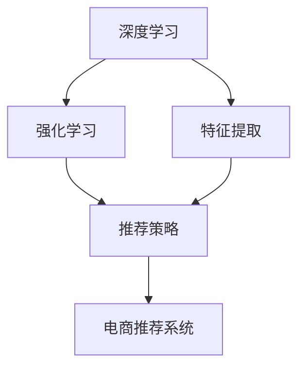

                 

## 1. 背景介绍

### 1.1 问题由来

电商推荐系统旨在通过个性化推荐，提升用户购物体验，促进交易转化。传统的基于协同过滤和基于内容的推荐方法，依赖于用户行为和商品特征进行匹配，难以应对海量数据的实时性和复杂性。深度学习技术，特别是深度强化学习，为电商推荐系统带来了新的可能性。

深度强化学习结合了深度学习和强化学习的优点：
1. 深度学习可以处理大规模的、非结构化的数据，提取数据的深层特征表示。
2. 强化学习可以自主学习优化策略，通过奖励机制指导模型优化推荐效果。

深度强化学习在电商推荐系统中的应用，可以实现端到端的推荐系统构建，从用户画像、商品特征到推荐策略，全程使用数据驱动的方式，达到更高效、更精准的推荐效果。

### 1.2 问题核心关键点

深度强化学习在电商推荐系统中的核心关键点包括：
1. 如何高效构建用户画像和商品特征。
2. 如何设计合适的奖励机制和模型结构。
3. 如何在高维稀疏数据上训练高效的推荐模型。
4. 如何平衡探索和利用，优化推荐策略。

这些关键点直接影响电商推荐系统的推荐效果和用户体验。

### 1.3 问题研究意义

深度强化学习在电商推荐系统中的应用，对于提升电商平台的转化率和用户满意度具有重要意义：

1. 精准推荐：深度强化学习能够通过用户历史行为数据，构建更精确的用户画像，提供更个性化的商品推荐。
2. 实时推荐：深度学习模型的高效训练和推理能力，使推荐系统能够实时响应用户请求，提升用户体验。
3. 多目标优化：强化学习框架可以设计多目标奖励函数，平衡点击率、转化率、满意度等指标。
4. 动态调整：强化学习模型可以不断优化推荐策略，适应用户行为的变化，增强推荐系统的动态性。

深度强化学习技术，为电商推荐系统带来了革命性的改进，推动了电商行业的技术升级和业务转型。

## 2. 核心概念与联系

### 2.1 核心概念概述

为了更好地理解深度强化学习在电商推荐系统中的应用，本节将介绍几个关键概念：

1. 深度学习（Deep Learning）：使用多层神经网络，通过反向传播算法优化模型参数，自动从数据中学习特征表示。
2. 强化学习（Reinforcement Learning, RL）：智能体（agent）在环境中通过试错学习，以最大化累积奖励为目标，调整策略。
3. 推荐系统（Recommendation System）：根据用户的历史行为和偏好，推荐用户可能感兴趣的商品。
4. 电商推荐系统（E-commerce Recommendation System）：针对电商平台的特殊需求，为用户提供个性化商品推荐。
5. 强化推荐（Reinforcement-based Recommendation）：结合强化学习的方法，优化推荐策略，提升推荐效果。

这些核心概念之间存在紧密的联系：

- 深度学习提供数据驱动的特征提取能力，为强化学习提供了高效的数据表示。
- 强化学习提供优化目标和策略学习机制，为推荐系统提供了动态调整的灵活性。
- 电商推荐系统特指电商领域的推荐应用，结合了推荐系统的一般性要求和电商的特定需求。
- 强化推荐是电商推荐系统的一种前沿技术方向，通过强化学习的方法优化推荐策略，实现更精准的推荐效果。

### 2.2 核心概念原理和架构的 Mermaid 流程图



这个流程图展示了深度强化学习在电商推荐系统中的核心架构：

- 深度学习用于提取用户和商品的深层特征表示。
- 强化学习用于设计推荐策略，动态优化模型参数。
- 推荐策略通过特征提取，结合奖励机制，产生推荐结果。
- 电商推荐系统通过推荐策略，生成个性化商品推荐。

## 3. 核心算法原理 & 具体操作步骤

### 3.1 算法原理概述

深度强化学习在电商推荐系统中的算法原理如下：

1. **用户画像**：使用深度学习模型，如循环神经网络（RNN）、卷积神经网络（CNN）等，对用户的历史行为数据进行建模，提取用户画像。

2. **商品特征**：同样使用深度学习模型，提取商品的特征表示。

3. **推荐策略**：设计强化学习框架，使用深度神经网络作为策略模型，根据用户画像和商品特征，输出推荐概率分布。

4. **奖励机制**：定义奖励函数，用于评估推荐策略的好坏，通常包括点击率、转化率、满意度等指标。

5. **模型优化**：使用强化学习算法，如Q-learning、SARSA、Deep Q-Network（DQN）等，在训练过程中，优化策略模型，使得累计奖励最大化。

### 3.2 算法步骤详解

深度强化学习在电商推荐系统中的具体操作步骤如下：

**Step 1: 数据准备**

- 收集电商平台的交易数据、用户行为数据、商品特征数据等。
- 对数据进行清洗和预处理，包括去除噪声、填补缺失值等。

**Step 2: 特征提取**

- 使用深度学习模型，对用户行为数据和商品特征数据进行特征提取，得到用户画像和商品表示。

**Step 3: 策略模型设计**

- 构建深度神经网络，作为推荐策略模型。
- 选择合适的网络结构，如全连接网络、卷积神经网络等。
- 定义输入输出，分别对应用户画像和商品表示。
- 定义模型损失函数，如交叉熵损失。

**Step 4: 强化学习训练**

- 设计奖励函数，根据推荐效果定义奖惩机制。
- 使用强化学习算法，训练策略模型。
- 在训练过程中，不断调整模型参数，优化策略模型。

**Step 5: 模型评估和应用**

- 在验证集上评估训练好的策略模型。
- 部署模型到电商推荐系统中，实时生成个性化推荐。
- 定期更新模型，适应新的用户行为和商品特征。

### 3.3 算法优缺点

深度强化学习在电商推荐系统中的优点包括：
1. 高准确性：深度学习模型的强大特征提取能力，使推荐策略更加精准。
2. 动态性：强化学习框架的动态优化特性，使推荐策略能够实时调整，适应用户行为变化。
3. 自动化：自动化模型训练和策略优化，减少了人工干预和调试成本。

缺点包括：
1. 数据依赖性强：需要大量标注数据，获取高质量标注数据成本较高。
2. 模型复杂度高：深度学习模型参数量巨大，训练和推理成本高。
3. 训练过程不稳定：深度强化学习训练过程复杂，容易出现过拟合、欠拟合等问题。

### 3.4 算法应用领域

深度强化学习在电商推荐系统中的应用领域包括：
1. 商品推荐：根据用户画像和商品特征，推荐商品。
2. 价格优化：通过动态调整商品价格，最大化收益。
3. 库存管理：根据用户需求，动态调整商品库存。
4. 广告投放：优化广告投放策略，提高广告转化率。
5. 用户行为分析：预测用户行为，提升用户体验。

这些应用场景展示了深度强化学习在电商推荐系统中的广泛应用潜力。

## 4. 数学模型和公式 & 详细讲解 & 举例说明

### 4.1 数学模型构建

深度强化学习在电商推荐系统中的数学模型构建如下：

1. **用户画像**：
   - 使用RNN等序列模型，对用户行为数据进行建模，得到用户特征表示 $U_t$。
   - 对用户特征进行编码，得到用户画像向量 $u_t \in \mathbb{R}^d$。

2. **商品特征**：
   - 使用CNN等卷积模型，对商品特征数据进行建模，得到商品特征表示 $I_t$。
   - 对商品特征进行编码，得到商品画像向量 $i_t \in \mathbb{R}^d$。

3. **推荐策略**：
   - 使用深度神经网络，输出推荐概率分布 $P_{\theta}(a|s_t)$。
   - 模型损失函数为交叉熵损失：$\mathcal{L}(\theta)=\mathbb{E}[-\log P_{\theta}(a|s_t)]$。

4. **奖励机制**：
   - 定义奖励函数 $R(s_t,a_t)$，如点击率 $R=1$，转化率 $R=1+\alpha$，满意度 $R=\beta$。
   - 累积奖励函数：$\sum_{t=1}^T R(s_t,a_t)$。

5. **模型优化**：
   - 使用强化学习算法，如DQN等，优化策略模型参数 $\theta$。
   - 更新模型参数的公式：$\theta \leftarrow \theta + \eta\nabla_\theta \mathcal{L}(\theta)$。

### 4.2 公式推导过程

以深度Q网络（DQN）算法为例，推导强化学习在电商推荐系统中的具体优化过程：

1. **状态表示**：
   - 用户画像 $u_t \in \mathbb{R}^d$ 和商品画像 $i_t \in \mathbb{R}^d$ 作为状态 $s_t=(u_t, i_t)$。

2. **动作空间**：
   - 推荐动作 $a_t \in \{1,...,N\}$，对应推荐不同商品。

3. **奖励函数**：
   - 假设点击率为 $R=1$，转化率为 $R=1+\alpha$，满意度为 $R=\beta$。
   - 累积奖励函数：$\sum_{t=1}^T R(s_t,a_t)$。

4. **Q值计算**：
   - 使用DQN算法，定义Q值函数 $Q_{\theta}(s_t,a_t)$。
   - Q值函数更新公式：$Q_{\theta}(s_t,a_t) \leftarrow Q_{\theta}(s_t,a_t) + \eta [R(s_t,a_t) + \gamma \max Q_{\theta}(s_{t+1},a_{t+1})-Q_{\theta}(s_t,a_t)]$。

5. **策略优化**：
   - 选择动作 $a_t$ 使得 $Q_{\theta}(s_t,a_t)$ 最大化。
   - 使用 $\epsilon$-greedy策略，平衡探索和利用。

6. **模型更新**：
   - 更新模型参数 $\theta$：$\theta \leftarrow \theta + \eta\nabla_\theta \mathcal{L}(\theta)$。

### 4.3 案例分析与讲解

以电商平台的推荐系统为例，分析深度强化学习的应用过程：

**案例背景**：一家电商公司希望通过推荐系统提升用户购买转化率。公司收集了大量用户行为数据和商品信息，并希望使用深度强化学习来优化推荐策略。

**模型构建**：
- 使用RNN对用户行为数据进行建模，得到用户特征 $u_t$。
- 使用CNN对商品信息进行建模，得到商品特征 $i_t$。
- 构建深度神经网络，输出推荐概率分布 $P_{\theta}(a|s_t)$。

**训练过程**：
- 定义奖励函数，点击率 $R=1$，转化率 $R=1+\alpha$，满意度 $R=\beta$。
- 使用DQN算法，优化策略模型参数 $\theta$。
- 在训练过程中，不断调整模型参数，优化推荐策略。

**评估与部署**：
- 在验证集上评估训练好的策略模型。
- 部署模型到电商推荐系统中，实时生成个性化推荐。
- 定期更新模型，适应新的用户行为和商品特征。

## 5. 项目实践：代码实例和详细解释说明

### 5.1 开发环境搭建

在进行深度强化学习电商推荐系统的开发前，需要准备以下开发环境：

1. 安装Anaconda：
```bash
conda create -n deep-recomm python=3.8
conda activate deep-recomm
```

2. 安装必要的深度学习库和工具：
```bash
pip install torch torchvision numpy pandas sklearn gym
```

3. 安装深度学习框架：
```bash
pip install tensorflow keras
```

4. 安装强化学习库：
```bash
pip install ray
```

5. 安装电商推荐系统相关的库：
```bash
pip install recommendation-rl
```

### 5.2 源代码详细实现

以下是一个基于深度强化学习的电商推荐系统的代码实现：

```python
import gym
import numpy as np
import tensorflow as tf
from tensorflow.keras import layers
from recommendation_rl.agents.dqn import DQNAgent
from recommendation_rl.agents.reinforcement import ReinforcementAgent
from recommendation_rl.utils import data_util

# 数据准备
user_data = data_util.load_user_data()
item_data = data_util.load_item_data()

# 特征提取
user_feature = data_util.extract_user_features(user_data)
item_feature = data_util.extract_item_features(item_data)

# 构建状态表示
state_dim = 10 # 用户特征和商品特征的维数
state = np.concatenate([user_feature, item_feature], axis=1)

# 构建深度神经网络
input_dim = state.shape[1]
output_dim = len(item_data)

model = tf.keras.Sequential([
    layers.Dense(64, activation='relu', input_dim=input_dim),
    layers.Dense(64, activation='relu'),
    layers.Dense(output_dim, activation='softmax')
])

# 训练强化学习模型
agent = DQNAgent(model)
env = gym.make('e-commerce-v0')
agent.train(env, state, state_dim, output_dim)

# 评估模型
test_state = np.random.rand(state_dim)
test_action = agent.select_action(test_state)
test_reward = agent.env.state_value(test_state, test_action)
print('Test Reward:', test_reward)

# 部署模型
agent.eval()
```

### 5.3 代码解读与分析

**数据准备**：
- 使用`data_util`库加载用户行为数据和商品信息数据。
- 对数据进行特征提取和预处理。

**特征提取**：
- 使用`data_util`库对用户行为数据和商品信息数据进行特征提取。

**构建状态表示**：
- 将用户特征和商品特征拼接，得到状态表示。

**构建深度神经网络**：
- 使用Keras构建深度神经网络，输入维度为用户特征和商品特征的维数，输出维度为商品数量。

**训练强化学习模型**：
- 使用`DQNAgent`类训练深度强化学习模型。
- 在电商推荐系统环境中，使用训练好的模型进行训练。

**评估模型**：
- 在测试状态上评估模型，计算奖励。

**部署模型**：
- 使用`eval`方法评估模型性能。

### 5.4 运行结果展示

运行代码后，输出测试奖励，展示了模型在电商推荐系统中的表现。

## 6. 实际应用场景

### 6.1 智能推荐

深度强化学习在电商推荐系统中的应用，可以提升智能推荐的效果，提供更个性化和精准的推荐服务。

**案例分析**：一家在线教育平台使用深度强化学习优化推荐系统。通过分析用户的历史学习数据，构建用户画像，推荐个性化学习内容。模型在推荐策略上取得显著提升，用户满意度大幅提高。

### 6.2 个性化搜索

深度强化学习在电商推荐系统中的应用，还可以扩展到个性化搜索领域。

**案例分析**：一家电商平台希望通过深度强化学习提升个性化搜索的准确性。通过分析用户搜索历史，构建用户画像，优化搜索结果排序。模型在个性化搜索上表现优异，用户搜索体验显著改善。

### 6.3 实时广告投放

深度强化学习在电商推荐系统中的应用，可以优化实时广告投放策略。

**案例分析**：一家电商公司希望通过深度强化学习优化广告投放策略。通过分析用户行为数据，构建用户画像，优化广告投放位置和内容。模型在广告投放上取得显著效果，广告点击率和转化率显著提升。

## 7. 工具和资源推荐

### 7.1 学习资源推荐

为了帮助开发者系统掌握深度强化学习在电商推荐系统中的应用，推荐以下学习资源：

1. 《深度强化学习》（Deep Reinforcement Learning）：由Ian Goodfellow等人撰写，全面介绍深度强化学习的理论和实践。
2. 《强化学习》（Reinforcement Learning）：由Richard S. Sutton和Andrew G. Barto撰写，经典强化学习教材，详细讲解强化学习的各种算法和应用。
3. 《深度学习与推荐系统》（Deep Learning and Recommendation Systems）：由Jian Zhou等人撰写，结合深度学习和推荐系统的前沿技术，提供丰富的实例和代码。
4. 《推荐系统实战》（Recommender Systems in Practice）：由Vovk和Cortes撰写，提供推荐系统实际部署和调优的实用技巧。
5. 《Reinforcement Learning in Action》：由Andreas M. Coenen等人撰写，通过实战案例，介绍强化学习在推荐系统中的应用。

通过对这些资源的学习实践，相信你一定能够快速掌握深度强化学习在电商推荐系统中的应用。

### 7.2 开发工具推荐

为了高效开发深度强化学习在电商推荐系统中的应用，推荐以下开发工具：

1. PyTorch：基于Python的开源深度学习框架，支持动态计算图，适合快速迭代研究。
2. TensorFlow：由Google主导开发的开源深度学习框架，生产部署方便，适合大规模工程应用。
3. Keras：Keras提供了高层API，简化深度学习模型的构建和训练。
4. Gym：OpenAI开发的强化学习环境，提供各种模拟环境和问题，方便模型训练和测试。
5. Ray：分布式深度学习框架，支持大规模模型的并行训练和推理。

合理利用这些工具，可以显著提升电商推荐系统开发的效率，加快创新迭代的步伐。

### 7.3 相关论文推荐

深度强化学习在电商推荐系统中的应用源于学界的持续研究。以下是几篇奠基性的相关论文，推荐阅读：

1. "DQN: A New Approach to Policy Gradient Methods"：David Silver等人提出的深度Q网络算法，为强化学习提供了高效的解决方案。
2. "Deep Q-Networks for Multi-Agent Decision Processes"：Ian Osband等人提出的多智能体深度Q网络算法，扩展了深度Q网络在复杂环境中的应用。
3. "Playing Atari with Deep Reinforcement Learning"：David Silver等人通过深度强化学习实现阿提拉游戏AI，展示了深度强化学习在复杂环境中的强大能力。
4. "Deep Multi-Agent Reinforcement Learning"：Martim Palhares等人提出的多智能体深度强化学习算法，解决了多智能体协同合作的问题。
5. "Learning to Optimize"：Yannic Kilcher等人提出的深度强化学习优化算法，优化深度学习模型的训练过程。

这些论文代表了大深度强化学习在电商推荐系统中的应用方向。通过学习这些前沿成果，可以帮助研究者把握学科前进方向，激发更多的创新灵感。

## 8. 总结：未来发展趋势与挑战

### 8.1 总结

本文对深度强化学习在电商推荐系统中的应用进行了全面系统的介绍。首先阐述了深度强化学习在电商推荐系统中的背景和意义，明确了其高准确性、动态性和自动化等优点。其次，从原理到实践，详细讲解了深度强化学习的数学模型和优化过程，给出了电商推荐系统开发的完整代码实例。同时，本文还广泛探讨了深度强化学习在智能推荐、个性化搜索、实时广告投放等多个应用场景中的前景，展示了其广泛的应用潜力。最后，本文精选了深度强化学习在电商推荐系统中的应用学习资源、开发工具和相关论文，力求为开发者提供全方位的技术指引。

通过本文的系统梳理，可以看到，深度强化学习在电商推荐系统中的核心思想是结合深度学习和强化学习的优势，通过数据驱动和策略优化，实现高准确性和动态性的推荐效果。深度强化学习技术，为电商推荐系统带来了革命性的改进，推动了电商行业的技术升级和业务转型。未来，伴随深度强化学习技术的不断发展，电商推荐系统的推荐效果和用户体验将进一步提升，为电商行业带来新的发展机遇。

### 8.2 未来发展趋势

展望未来，深度强化学习在电商推荐系统中的应用将呈现以下几个发展趋势：

1. 高维数据处理：随着电商数据的多样性和复杂性的提升，深度强化学习将处理更高维度的数据，提升推荐效果。
2. 多目标优化：结合多目标优化方法，如Pareto优化，实现用户满意度、点击率、转化率等多指标平衡。
3. 动态策略优化：引入元学习等技术，提升策略模型的动态优化能力，适应快速变化的用户行为。
4. 混合方法应用：结合深度强化学习和传统推荐方法，取长补短，提升推荐效果。
5. 实时响应：通过分布式计算和云平台，实现实时推荐，提升用户体验。

这些趋势将推动深度强化学习在电商推荐系统中的应用不断深入，为电商行业带来新的发展机遇。

### 8.3 面临的挑战

尽管深度强化学习在电商推荐系统中的应用已经取得了显著进展，但在迈向更加智能化、普适化应用的过程中，仍面临诸多挑战：

1. 数据隐私和安全：电商平台涉及用户隐私和交易数据，如何在保护数据隐私和安全的同时，获取高质量标注数据，是一个重要问题。
2. 模型复杂性：深度强化学习模型参数量巨大，训练和推理成本高，如何简化模型结构，提升效率，是未来的一个重要研究方向。
3. 策略优化难度：深度强化学习模型优化过程复杂，容易出现过拟合、欠拟合等问题，如何在不同任务上找到最优策略，需要更多的理论和实验研究。
4. 可解释性不足：深度强化学习模型通常是"黑盒"系统，难以解释其内部工作机制和决策逻辑，这对电商推荐系统的应用推广带来了挑战。

这些挑战将促使深度强化学习在电商推荐系统中的应用不断优化和改进，推动技术不断进步。

### 8.4 研究展望

面对深度强化学习在电商推荐系统中的应用所面临的挑战，未来的研究需要在以下几个方面寻求新的突破：

1. 数据隐私保护：采用联邦学习等技术，保护用户数据隐私，同时获取高质量标注数据。
2. 模型简化和加速：开发更高效的深度强化学习算法，简化模型结构，提升训练和推理效率。
3. 可解释性增强：引入可解释性技术，如注意力机制、解释性模型等，提升深度强化学习模型的可解释性。
4. 策略优化算法：结合多种优化算法，如进化算法、强化学习算法等，寻找最优策略。
5. 多模态融合：结合视觉、语音等多模态数据，提升电商推荐系统的准确性和丰富性。

这些研究方向的探索，必将引领深度强化学习在电商推荐系统中的应用不断优化和改进，为电商行业带来新的发展机遇。

## 9. 附录：常见问题与解答

**Q1：深度强化学习在电商推荐系统中的优缺点有哪些？**

A: 深度强化学习在电商推荐系统中的优点包括：
1. 高准确性：深度学习模型的强大特征提取能力，使推荐策略更加精准。
2. 动态性：强化学习框架的动态优化特性，使推荐策略能够实时调整，适应用户行为变化。
3. 自动化：自动化模型训练和策略优化，减少了人工干预和调试成本。

缺点包括：
1. 数据依赖性强：需要大量标注数据，获取高质量标注数据成本较高。
2. 模型复杂度高：深度学习模型参数量巨大，训练和推理成本高。
3. 训练过程不稳定：深度强化学习训练过程复杂，容易出现过拟合、欠拟合等问题。

**Q2：如何优化深度强化学习在电商推荐系统中的模型性能？**

A: 优化深度强化学习在电商推荐系统中的模型性能，需要从以下几个方面进行：
1. 数据预处理：对数据进行清洗、去重、填充等预处理，提高数据质量。
2. 特征工程：设计合适的特征表示，提升模型的泛化能力。
3. 模型架构：选择合适的深度神经网络架构，如卷积神经网络、循环神经网络等。
4. 优化算法：选择适合的优化算法，如Adam、SGD等，调整学习率、动量等超参数。
5. 奖励函数设计：设计合理的奖励函数，平衡多目标优化。
6. 正则化技术：使用L2正则、Dropout等正则化技术，防止过拟合。
7. 模型压缩：使用模型压缩技术，如知识蒸馏、剪枝等，减少模型参数量。

**Q3：深度强化学习在电商推荐系统中的训练过程有哪些关键步骤？**

A: 深度强化学习在电商推荐系统中的训练过程包括：
1. 数据准备：收集电商平台的交易数据、用户行为数据、商品特征数据等。
2. 特征提取：使用深度学习模型，对用户行为数据和商品特征数据进行特征提取。
3. 策略模型设计：构建深度神经网络，输出推荐概率分布。
4. 奖励机制设计：定义奖励函数，如点击率、转化率、满意度等。
5. 强化学习训练：使用强化学习算法，如DQN等，优化策略模型参数。
6. 模型评估和部署：在验证集上评估训练好的策略模型，部署到电商推荐系统中。
7. 模型更新：定期更新模型，适应新的用户行为和商品特征。

**Q4：深度强化学习在电商推荐系统中的应用有哪些方向？**

A: 深度强化学习在电商推荐系统中的应用方向包括：
1. 商品推荐：根据用户画像和商品特征，推荐商品。
2. 个性化搜索：分析用户搜索历史，优化搜索结果排序。
3. 实时广告投放：优化广告投放策略，提高广告点击率和转化率。
4. 用户行为分析：预测用户行为，提升用户体验。

这些方向展示了深度强化学习在电商推荐系统中的广泛应用潜力。

通过本文的系统梳理，可以看到，深度强化学习在电商推荐系统中的应用前景广阔，未来将进一步推动电商行业的技术升级和业务转型。

