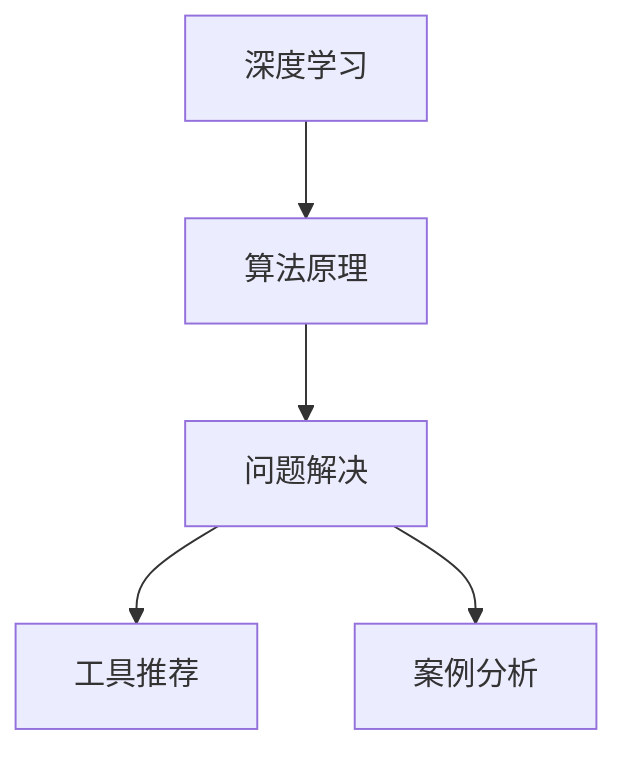

                 

# 深度思考:问题解决的利器

> 关键词：深度学习,算法原理,问题解决,工具推荐,案例分析

## 1. 背景介绍

### 1.1 问题由来

在现代社会，面对日益复杂的决策问题，仅凭经验或直觉已不足以解决问题。深度学习作为当前最前沿的AI技术之一，以其强大的建模能力和泛化能力，为复杂问题的解决提供了全新的思路。然而，尽管深度学习在许多领域取得了显著成效，但在实际应用中，如何合理地构建模型、设计算法、选择工具，仍是一个需要深入探讨的问题。本文旨在从深度思考的角度，探讨深度学习在问题解决中的应用，并提供一套完整的解决方案，帮助读者深入理解问题解决的理论基础和实践技巧。

### 1.2 问题核心关键点

深度学习在问题解决中具有以下关键点：
- 强大的建模能力：深度学习模型可以通过学习大量数据，发现数据中的复杂关系，构建强大的特征表示。
- 泛化能力：深度学习模型在未见过的数据上仍能保持较好的性能。
- 自动化处理：深度学习模型可以自动处理大规模、高维度的数据，无需人工特征工程。
- 可解释性：深度学习模型虽然在效果上非常优秀，但其内部机制复杂，难以解释。

深度学习在实际问题解决中，可以应用于图像识别、语音识别、自然语言处理、推荐系统等多个领域，具有广阔的应用前景。

## 2. 核心概念与联系

### 2.1 核心概念概述

为更好地理解深度学习在问题解决中的应用，本节将介绍几个关键概念及其之间的联系：

- **深度学习(Deep Learning)**：以神经网络为代表的机器学习算法，通过多层次的非线性变换，学习数据中的高层次特征。深度学习模型通常包含多层神经元，每一层负责学习不同层次的特征表示。
- **算法原理**：深度学习模型的训练过程通常采用梯度下降等优化算法，通过最小化损失函数来调整模型参数，使得模型输出的结果与真实值尽可能接近。
- **问题解决**：通过构建深度学习模型，可以自动地学习数据中的模式和规律，从而实现对问题的自动化解决。
- **工具推荐**：TensorFlow、PyTorch、Keras等深度学习框架，为模型构建、训练、部署提供了强大的支持。
- **案例分析**：以图像分类、语音识别、自然语言处理为例，展示深度学习在实际问题解决中的应用。

这些概念之间的逻辑关系可以通过以下Mermaid流程图来展示：



这个流程图展示了几大关键概念之间的联系：

1. 深度学习通过多层次的神经网络结构，学习数据中的高层次特征。
2. 算法原理描述了深度学习模型的训练过程，通过梯度下降等优化算法调整模型参数。
3. 问题解决展示了深度学习模型在实际问题解决中的应用，如图像分类、语音识别等。
4. 工具推荐介绍了常用的深度学习框架，用于构建、训练和部署模型。
5. 案例分析以实际应用为例，展示了深度学习在问题解决中的强大能力。

这些概念共同构成了深度学习在问题解决中的应用框架，使得深度学习能够被广泛应用于各种复杂问题的解决中。

## 3. 核心算法原理 & 具体操作步骤
### 3.1 算法原理概述

深度学习在问题解决中的核心算法原理包括以下几个方面：

- **模型构建**：选择合适的深度学习模型架构，如卷积神经网络(CNN)、循环神经网络(RNN)、变换器(Transformer)等。
- **数据准备**：收集、清洗、预处理数据，构建训练集、验证集和测试集。
- **模型训练**：通过梯度下降等优化算法，最小化损失函数，更新模型参数。
- **模型评估**：在测试集上评估模型性能，进行参数调优。

深度学习模型的训练过程通常分为以下几个步骤：

1. **数据预处理**：将原始数据转换为模型可接受的形式，如将图像转换为张量、将文本转换为词向量等。
2. **模型构建**：选择合适的深度学习模型架构，并定义损失函数、优化器等关键组件。
3. **模型训练**：将数据集分成训练集、验证集和测试集，使用训练集对模型进行训练，并在验证集上进行调优。
4. **模型评估**：使用测试集评估模型性能，进行参数调优，以提升模型泛化能力。

### 3.2 算法步骤详解

以下是深度学习在问题解决中的详细操作步骤：

**Step 1: 数据预处理**
- **收集数据**：根据问题类型，收集相关数据。例如，图像分类任务中需要收集图像数据；自然语言处理任务中需要收集文本数据。
- **数据清洗**：去除数据中的噪声和异常值，确保数据质量。
- **数据增强**：通过旋转、裁剪、缩放等技术扩充训练数据，提升模型泛化能力。

**Step 2: 模型构建**
- **选择模型**：根据任务类型选择合适的深度学习模型，如卷积神经网络(CNN)用于图像识别，循环神经网络(RNN)用于自然语言处理。
- **定义模型架构**：通过定义卷积层、池化层、全连接层等，构建模型。
- **定义损失函数**：根据任务类型选择合适的损失函数，如交叉熵损失、均方误差损失等。
- **定义优化器**：选择合适的优化器，如Adam、SGD等。

**Step 3: 模型训练**
- **划分数据集**：将数据集划分为训练集、验证集和测试集。
- **训练模型**：使用训练集对模型进行训练，通过梯度下降等优化算法调整模型参数。
- **验证调优**：在验证集上评估模型性能，进行超参数调优。
- **模型保存**：保存训练好的模型，以备后续使用。

**Step 4: 模型评估**
- **评估模型**：使用测试集评估模型性能，计算精度、召回率、F1值等指标。
- **参数调优**：根据测试集上的评估结果，调整模型参数，提升模型性能。

### 3.3 算法优缺点

深度学习在问题解决中的优势包括：

- **强大的建模能力**：深度学习模型能够自动学习数据中的复杂关系，发现数据中的隐含特征。
- **泛化能力强**：深度学习模型在未见过的数据上仍能保持较好的性能。
- **自动化处理**：深度学习模型可以自动处理大规模、高维度的数据，无需人工特征工程。

同时，深度学习也存在以下缺点：

- **计算资源消耗大**：深度学习模型通常包含大量参数，训练和推理时计算资源消耗大。
- **训练时间长**：深度学习模型的训练时间较长，需要大量的计算资源和时间。
- **可解释性差**：深度学习模型内部机制复杂，难以解释。

尽管存在这些缺点，但深度学习在实际问题解决中仍然具有显著的优势，尤其在数据量大、特征复杂、难以手工设计的场景中，深度学习表现尤为突出。

### 3.4 算法应用领域

深度学习在问题解决中的应用非常广泛，包括但不限于以下几个领域：

- **图像识别**：通过深度学习模型，可以对图像进行分类、检测、分割等操作。例如，用于自动驾驶中的物体检测、医学图像分析中的病灶识别等。
- **语音识别**：通过深度学习模型，可以对语音信号进行识别、转换等操作。例如，用于智能音箱中的语音交互、医疗诊断中的语音记录分析等。
- **自然语言处理(NLP)**：通过深度学习模型，可以对文本进行分类、生成、翻译等操作。例如，用于机器翻译、情感分析、智能客服等。
- **推荐系统**：通过深度学习模型，可以根据用户行为和物品特征，推荐相关的商品或内容。例如，用于电商平台的商品推荐、视频网站的个性化推荐等。

## 4. 数学模型和公式 & 详细讲解 & 举例说明

### 4.1 数学模型构建

深度学习在问题解决中的数学模型通常由以下几个部分构成：

- **输入层**：输入原始数据，并将其转换为模型可接受的形式。
- **隐藏层**：通过非线性变换，学习数据中的高层次特征表示。
- **输出层**：根据任务类型，输出预测结果或损失值。

深度学习模型的训练过程通常采用梯度下降等优化算法，通过最小化损失函数来调整模型参数。例如，对于一个分类任务，可以使用交叉熵损失函数来衡量模型预测与真实标签之间的差异。

### 4.2 公式推导过程

以一个简单的二分类任务为例，展示深度学习模型的训练过程。

假设模型为 $y=f(x;\theta)$，其中 $y$ 为预测结果，$x$ 为输入数据，$\theta$ 为模型参数。定义交叉熵损失函数为：

$$
\mathcal{L}(\theta) = -\frac{1}{N}\sum_{i=1}^N [y_i\log \hat{y} + (1-y_i)\log(1-\hat{y})]
$$

其中 $y_i$ 为真实标签，$\hat{y}$ 为模型预测结果。

通过梯度下降算法，最小化损失函数 $\mathcal{L}(\theta)$：

$$
\theta \leftarrow \theta - \eta \nabla_{\theta}\mathcal{L}(\theta)
$$

其中 $\eta$ 为学习率，$\nabla_{\theta}\mathcal{L}(\theta)$ 为损失函数对模型参数的梯度。

### 4.3 案例分析与讲解

以图像分类任务为例，展示深度学习在实际问题解决中的应用。

假设任务为手写数字识别，数据集为MNIST，模型为LeNet。首先，将数据集划分为训练集、验证集和测试集。然后，构建LeNet模型，定义交叉熵损失函数和Adam优化器。在训练过程中，使用训练集对模型进行训练，并在验证集上进行调优。最后，在测试集上评估模型性能，计算准确率和混淆矩阵等指标。

## 5. 项目实践：代码实例和详细解释说明
### 5.1 开发环境搭建

在进行深度学习问题解决的项目实践中，我们需要准备好开发环境。以下是使用Python进行TensorFlow开发的常见环境配置流程：

1. 安装Anaconda：从官网下载并安装Anaconda，用于创建独立的Python环境。
2. 创建并激活虚拟环境：
```bash
conda create -n tf-env python=3.8 
conda activate tf-env
```
3. 安装TensorFlow：根据CUDA版本，从官网获取对应的安装命令。例如：
```bash
conda install tensorflow -c conda-forge
```
4. 安装其他必要库：
```bash
pip install numpy matplotlib scikit-learn pandas tqdm
```

完成上述步骤后，即可在`tf-env`环境中开始项目实践。

### 5.2 源代码详细实现

以下是一个简单的图像分类任务的代码实现，以TensorFlow为例：

```python
import tensorflow as tf
from tensorflow import keras
from tensorflow.keras import layers

# 加载数据集
mnist = keras.datasets.mnist
(x_train, y_train), (x_test, y_test) = mnist.load_data()

# 数据预处理
x_train, x_test = x_train / 255.0, x_test / 255.0

# 构建模型
model = keras.Sequential([
    layers.Flatten(input_shape=(28, 28)),
    layers.Dense(128, activation='relu'),
    layers.Dense(10, activation='softmax')
])

# 编译模型
model.compile(optimizer='adam',
              loss='sparse_categorical_crossentropy',
              metrics=['accuracy'])

# 训练模型
model.fit(x_train, y_train, epochs=5)

# 评估模型
model.evaluate(x_test, y_test)
```

### 5.3 代码解读与分析

让我们再详细解读一下关键代码的实现细节：

**数据预处理**：
- `mnist.load_data()`：加载MNIST数据集，包含训练集和测试集。
- `x_train, x_test = x_train / 255.0, x_test / 255.0`：将数据归一化到[0,1]区间。

**模型构建**：
- `layers.Flatten(input_shape=(28, 28))`：将28x28的图像数据展平成一维向量。
- `layers.Dense(128, activation='relu')`：添加一个全连接层，128个神经元，激活函数为ReLU。
- `layers.Dense(10, activation='softmax')`：添加输出层，10个神经元，激活函数为Softmax。

**模型编译**：
- `model.compile(optimizer='adam', ...)`：使用Adam优化器进行模型训练。
- `loss='sparse_categorical_crossentropy'`：使用交叉熵损失函数。
- `metrics=['accuracy']`：评估指标为准确率。

**模型训练**：
- `model.fit(x_train, y_train, epochs=5)`：在训练集上训练5个epoch。

**模型评估**：
- `model.evaluate(x_test, y_test)`：在测试集上评估模型性能。

可以看到，TensorFlow提供了强大的深度学习库，通过简单的代码即可构建、训练和评估深度学习模型。开发者可以将更多精力放在数据处理、模型改进等高层逻辑上，而不必过多关注底层的实现细节。

当然，工业级的系统实现还需考虑更多因素，如模型的保存和部署、超参数的自动搜索、更灵活的任务适配层等。但核心的训练流程基本与此类似。

## 6. 实际应用场景
### 6.1 智能医疗

深度学习在医疗领域的应用前景广阔，通过构建深度学习模型，可以辅助医生进行疾病诊断、药物研发、医疗影像分析等。例如，通过深度学习模型对医学影像进行分类，自动识别病灶区域；通过深度学习模型对电子病历进行分析，提取关键信息辅助诊断；通过深度学习模型预测药物分子性质，加速新药研发等。

### 6.2 智慧城市

智慧城市建设中，深度学习可以用于城市交通管理、环境监测、公共安全等。例如，通过深度学习模型对交通监控视频进行分析，识别交通违规行为；通过深度学习模型对空气质量监测数据进行分析，预测空气污染情况；通过深度学习模型对公共安全事件进行预警，提高应急响应能力。

### 6.3 金融科技

金融科技领域中，深度学习可以用于信用评估、风险管理、交易预测等。例如，通过深度学习模型对客户行为数据进行分析，预测违约风险；通过深度学习模型对市场数据进行建模，预测股票价格；通过深度学习模型对交易数据进行分析，优化投资策略等。

### 6.4 未来应用展望

随着深度学习技术的不断发展，其在问题解决中的应用将越来越广泛，为各行各业带来变革性影响。未来，深度学习将深度融合到更多领域，推动更多场景的智能化、自动化、自动化发展，为社会进步注入新的动力。

## 7. 工具和资源推荐
### 7.1 学习资源推荐

为了帮助开发者系统掌握深度学习在问题解决中的应用，这里推荐一些优质的学习资源：

1. 《深度学习》一书：Ian Goodfellow、Yoshua Bengio、Aaron Courville合著，全面介绍了深度学习的基本概念、算法原理和应用实践。
2. DeepLearning.ai课程：Andrew Ng教授主导的深度学习课程，涵盖了深度学习的基本理论和应用实例。
3. Kaggle竞赛：Kaggle提供大量深度学习竞赛数据集和开源代码，是深度学习实践和学习的绝佳平台。
4. TensorFlow官方文档：TensorFlow提供的官方文档，包含丰富的深度学习模型和工具介绍。
5. PyTorch官方文档：PyTorch提供的官方文档，涵盖深度学习模型的构建、训练和部署。

通过对这些资源的学习实践，相信你一定能够快速掌握深度学习在问题解决中的应用，并用于解决实际的工程问题。

### 7.2 开发工具推荐

高效的深度学习开发离不开优秀的工具支持。以下是几款用于深度学习开发的常用工具：

1. TensorFlow：由Google主导开发的深度学习框架，生产部署方便，适合大规模工程应用。
2. PyTorch：Facebook开发的深度学习框架，支持动态计算图，适合快速迭代研究。
3. Keras：高层次深度学习API，易于上手，支持多种深度学习框架后端。
4. Weights & Biases：模型训练的实验跟踪工具，可以记录和可视化模型训练过程中的各项指标，方便对比和调优。
5. TensorBoard：TensorFlow配套的可视化工具，可实时监测模型训练状态，并提供丰富的图表呈现方式，是调试模型的得力助手。

合理利用这些工具，可以显著提升深度学习模型的开发效率，加快创新迭代的步伐。

### 7.3 相关论文推荐

深度学习在问题解决中的应用源于学界的持续研究。以下是几篇奠基性的相关论文，推荐阅读：

1. AlexNet：ImageNet大规模视觉识别挑战赛的冠军，展示了卷积神经网络在图像分类任务上的强大能力。
2. GoogleNet：通过Inception模块提升了卷积神经网络的深度和效率，进一步提高了图像分类性能。
3. Attention is All You Need：提出了Transformer模型，开创了自注意力机制在深度学习中的应用，极大地提升了序列建模能力。
4. BERT: Pre-training of Deep Bidirectional Transformers for Language Understanding：提出BERT模型，引入了基于掩码的自监督预训练任务，刷新了多项NLP任务SOTA。
5. GANs Trained by a Two Time-Scale Update Rule Converge to the Semi-Equilibrium：提出了生成对抗网络(GANs)，为深度学习中的生成模型提供了新的思路。

这些论文代表了大规模深度学习模型和算法的发展脉络。通过学习这些前沿成果，可以帮助研究者把握学科前进方向，激发更多的创新灵感。

## 8. 总结：未来发展趋势与挑战
### 8.1 总结

本文从深度思考的角度，探讨了深度学习在问题解决中的应用。首先阐述了深度学习在问题解决中的强大能力，明确了深度学习在数据建模、自动化处理等方面的独特优势。其次，从算法原理到具体操作步骤，详细讲解了深度学习在问题解决中的数学模型和操作步骤，给出了具体的代码实例。最后，讨论了深度学习在实际应用中的场景，展示了深度学习在智慧医疗、智慧城市、金融科技等领域的应用前景。

通过本文的系统梳理，可以看到，深度学习在问题解决中具有广泛的应用前景，能够自动地学习数据中的复杂关系，解决各类复杂问题。未来，随着深度学习技术的不断发展，其在问题解决中的应用将更加广泛，为各行各业带来变革性影响。

### 8.2 未来发展趋势

深度学习在问题解决中的未来发展趋势包括以下几个方面：

1. **模型结构优化**：未来的深度学习模型将更加复杂，通过多层次的非线性变换，学习更高层次的特征表示。例如，通过引入注意力机制、残差连接等结构，进一步提升模型的表达能力。
2. **自适应学习**：未来的深度学习模型将具备更强的自适应能力，能够根据输入数据的变化，动态调整模型结构和参数。例如，通过元学习技术，提升模型的泛化能力和学习效率。
3. **跨领域应用**：未来的深度学习模型将更加通用，能够在多个领域进行应用。例如，通过迁移学习技术，将在大规模数据集上预训练的模型迁移到小样本领域，提升模型的应用范围。
4. **多模态融合**：未来的深度学习模型将支持多种数据模态的融合，如视觉、语音、文本等。例如，通过跨模态学习技术，构建多模态融合模型，提升模型对复杂场景的理解能力。
5. **可解释性增强**：未来的深度学习模型将更加注重可解释性，通过引入可视化、解释器等技术，增强模型的透明性和可信度。

以上趋势凸显了深度学习在问题解决中的广阔前景，预示着深度学习技术将进一步深入到各行各业，推动更多领域的智能化发展。

### 8.3 面临的挑战

尽管深度学习在问题解决中已经取得了显著成效，但在迈向更加智能化、普适化应用的过程中，仍面临诸多挑战：

1. **计算资源消耗大**：深度学习模型通常包含大量参数，训练和推理时计算资源消耗大。例如，训练大型卷积神经网络需要大量的计算资源和时间。
2. **数据依赖性强**：深度学习模型依赖大量高质量标注数据进行训练，对于数据稀疏、标注成本高的领域，深度学习模型难以发挥其优势。
3. **模型鲁棒性不足**：深度学习模型面对数据分布变化时，泛化性能可能下降，甚至出现灾难性遗忘。例如，在面对小样本、少见类别时，模型性能可能大幅下降。
4. **可解释性差**：深度学习模型内部机制复杂，难以解释。例如，卷积神经网络中的卷积核、循环神经网络中的记忆单元等，其内部机制难以理解。
5. **数据隐私和安全问题**：深度学习模型需要大量数据进行训练，数据隐私和安全问题亟待解决。例如，如何在保护用户隐私的前提下，获取和利用高质量数据。

以上挑战凸显了深度学习在问题解决中仍需不断改进和优化，需要更多理论和实践的积累。

### 8.4 研究展望

未来的深度学习研究需要在以下几个方面寻求新的突破：

1. **模型压缩与加速**：通过模型压缩、量化等技术，提升模型的推理速度和存储效率。例如，通过剪枝、量化等方法，减小模型的参数规模，提升模型的计算效率。
2. **迁移学习与跨领域应用**：通过迁移学习技术，将在大规模数据集上预训练的模型迁移到小样本领域，提升模型的应用范围。例如，通过领域自适应技术，提升模型在不同领域上的泛化能力。
3. **多模态融合**：通过跨模态学习技术，构建多模态融合模型，提升模型对复杂场景的理解能力。例如，通过融合视觉、语音、文本等多模态信息，提升模型的感知能力和决策能力。
4. **自适应学习与元学习**：通过自适应学习技术，提升模型的泛化能力和学习效率。例如，通过元学习技术，提升模型的跨领域迁移能力和自适应能力。
5. **可解释性与透明性**：通过可视化、解释器等技术，增强模型的透明性和可信度。例如，通过引入可解释性模型，提升模型的可解释性和可信度。

这些研究方向将推动深度学习技术向更广泛、更深入、更实用的方向发展，为问题解决提供更强大的技术支持。

## 9. 附录：常见问题与解答

**Q1: 深度学习模型在训练过程中如何进行超参数调优？**

A: 深度学习模型的超参数调优通常使用网格搜索、随机搜索等方法。例如，通过设置学习率、批大小、迭代轮数等超参数，在训练过程中进行动态调整。常用的调优工具包括Hyperopt、Keras Tuner等。

**Q2: 深度学习模型在实际应用中如何进行推理？**

A: 深度学习模型的推理通常使用预训练模型和微调模型，将输入数据转换为模型可接受的形式，然后通过前向传播计算输出。例如，对于图像分类任务，将输入图像转换为张量，通过前向传播计算输出类别概率，并取最大值作为预测结果。

**Q3: 深度学习模型在问题解决中如何提高泛化能力？**

A: 深度学习模型在问题解决中可以通过以下方法提高泛化能力：
1. 数据增强：通过旋转、裁剪、缩放等技术扩充训练数据，提升模型泛化能力。
2. 正则化：使用L2正则、Dropout等技术，防止模型过拟合。
3. 模型压缩：通过剪枝、量化等技术，减小模型参数规模，提升模型泛化能力。
4. 迁移学习：通过在大规模数据集上预训练的模型，迁移到小样本领域，提升模型泛化能力。

**Q4: 深度学习模型在问题解决中如何提高可解释性？**

A: 深度学习模型在问题解决中可以通过以下方法提高可解释性：
1. 可视化技术：通过可视化模型的内部机制，理解模型的决策过程。例如，使用梯度可视化技术，可视化模型的梯度流向。
2. 解释器技术：通过引入可解释性模型，增强模型的透明性和可信度。例如，使用LIME、SHAP等解释器技术，解释模型的预测结果。
3. 特征重要性分析：通过特征重要性分析，理解模型对各个特征的依赖关系。例如，使用SHAP值分析模型对各个特征的贡献度。

**Q5: 深度学习模型在问题解决中如何提高鲁棒性？**

A: 深度学习模型在问题解决中可以通过以下方法提高鲁棒性：
1. 对抗样本训练：通过引入对抗样本，增强模型的鲁棒性。例如，使用FGSM、PGD等对抗训练技术，提升模型的鲁棒性。
2. 数据扰动：通过对输入数据进行扰动，增强模型的鲁棒性。例如，使用噪声注入技术，提升模型的泛化能力。
3. 多模型集成：通过构建多个深度学习模型，集成模型预测结果，提升模型的鲁棒性。例如，通过投票、堆叠等技术，提升模型的鲁棒性。

这些方法可以帮助深度学习模型在问题解决中提高泛化能力和鲁棒性，进一步提升模型的性能和应用范围。

---

作者：禅与计算机程序设计艺术 / Zen and the Art of Computer Programming

