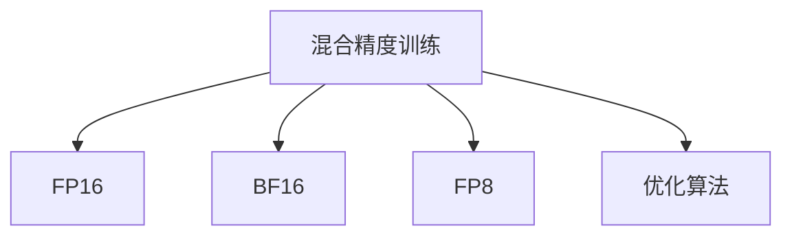

                 

# 混合精度训练：fp16、bf16和fp8的应用

> 关键词：混合精度训练, fp16, bf16, fp8, 深度学习, 高性能计算, 优化算法

## 1. 背景介绍

### 1.1 问题由来
随着深度学习技术的发展，模型参数量和计算量呈指数级增长。大模型训练通常需要巨大的计算资源和内存，这对GPU、TPU等硬件设备提出了更高的要求。如何在大规模深度学习训练中提升效率，降低成本，成为了一个亟待解决的问题。

混合精度训练（Mixed-Precision Training）是一种有效的解决方案，通过混合使用32位浮点数（FP32）和16位浮点数（FP16）或更小的精度格式（如BF16、FP8），可以大幅降低计算和存储开销，加速模型训练，同时保持较高的计算精度。

### 1.2 问题核心关键点
混合精度训练的核心思想是通过降低计算精度来节省资源，同时不影响模型训练的收敛性和性能。其关键点包括：
- 选择合适的精度格式：FP16、BF16和FP8。
- 识别可混合的模型和层。
- 应用混合精度训练时需要注意的细节。

## 2. 核心概念与联系

### 2.1 核心概念概述

为更好地理解混合精度训练的原理和应用，本节将介绍几个密切相关的核心概念：

- **混合精度训练(Mixed-Precision Training)**：在深度学习训练中，部分模型参数使用较高精度（如FP32），部分模型参数使用较低精度（如FP16）或更小精度格式（如BF16、FP8）进行训练，以降低计算和存储开销。
- **FP16、BF16、FP8**：三种不同的精度格式，分别表示16位、24位和8位浮点数，其存储和计算精度各异。
- **优化算法**：如SGD、Adam等，用于在混合精度训练中更新模型参数。

这些核心概念之间的逻辑关系可以通过以下Mermaid流程图来展示：



这个流程图展示了大语言模型的核心概念及其之间的关系：

1. 混合精度训练将预训练模型视作一个混合精度系统，通过使用不同精度的参数和计算格式，进行更高效的计算。
2. FP16、BF16和FP8是用于实现混合精度训练的关键精度格式。
3. 优化算法负责在混合精度训练中更新模型参数。

这些概念共同构成了混合精度训练的核心思想，使得深度学习模型可以在较低成本的硬件上快速训练，同时保持较高精度。

## 3. 核心算法原理 & 具体操作步骤
### 3.1 算法原理概述

混合精度训练的原理在于利用高精度和低精度的互补，减少计算和存储开销。其核心在于选择合适的精度格式和优化算法，确保低精度计算对模型性能的影响尽可能小。

混合精度训练的通用步骤如下：
1. **识别可混合的模型和层**：评估模型中哪些参数可以采用较低精度进行计算。
2. **选择精度格式**：根据性能和资源需求选择FP16、BF16或FP8。
3. **配置硬件和软件**：确保训练环境支持混合精度计算，并配置相应的软件和库。
4. **执行混合精度训练**：在混合精度模式下进行训练，并使用优化算法更新模型参数。

### 3.2 算法步骤详解

下面详细介绍混合精度训练的各个步骤：

**Step 1: 识别可混合的模型和层**

在混合精度训练中，并非所有模型和层都可以使用较低精度进行计算。以下是一些常见的方法：

- **分层混合精度训练**：将模型分为可混合层和不可混合层。可混合层包括前向传递和梯度计算，不可混合层包括参数更新等。
- **动态计算精度调整**：根据模型的输出和梯度大小，动态调整计算精度，以实现最优的资源利用。

**Step 2: 选择精度格式**

在选择精度格式时，需要考虑性能和资源需求。以下是一些常见的精度格式选择方法：

- **FP16**：精度适中，计算速度较快，适用于大多数任务。
- **BF16**：介于FP16和FP32之间，具有更好的数值表示精度，适用于计算密集型任务。
- **FP8**：精度最低，存储和计算开销最小，适用于低资源环境。

**Step 3: 配置硬件和软件**

为了支持混合精度训练，需要配置支持混合精度计算的硬件和软件环境：

- **硬件**：使用支持Tensor Cores的GPU或TPU等硬件设备。
- **软件**：安装支持混合精度计算的深度学习框架（如TensorFlow、PyTorch等）。

**Step 4: 执行混合精度训练**

在配置好硬件和软件后，即可执行混合精度训练：

- **模型初始化**：将模型加载到混合精度环境中。
- **混合精度计算**：将模型参数和计算格式配置为混合精度。
- **优化算法**：使用优化算法（如SGD、Adam等）更新模型参数。
- **评估和优化**：在训练过程中定期评估模型性能，并根据需要进行优化调整。

### 3.3 算法优缺点

混合精度训练具有以下优点：
- **效率提升**：通过降低计算精度，大幅降低计算和存储开销，加速模型训练。
- **资源节省**：使用较低精度计算，可以显著减少对高性能计算设备的依赖，降低成本。
- **性能稳定**：合理配置混合精度计算，可以保持较高的计算精度，不影响模型性能。

同时，混合精度训练也存在一定的局限性：
- **硬件要求**：需要使用支持混合精度计算的硬件设备，如具有Tensor Cores的GPU或TPU。
- **精度损失**：在部分关键层和关键操作中，采用较低精度计算可能导致精度损失，影响模型效果。
- **软件适配**：不同的深度学习框架对混合精度训练的支持程度不同，需要根据具体情况进行调整。

尽管存在这些局限性，但混合精度训练仍是一种被广泛认可的高效训练方法，广泛应用于深度学习领域。

### 3.4 算法应用领域

混合精度训练在深度学习领域得到了广泛应用，包括但不限于以下几个领域：

- **计算机视觉**：图像分类、目标检测、图像分割等任务。
- **自然语言处理**：语言模型训练、机器翻译、文本生成等任务。
- **语音识别**：声学模型训练、语音翻译等任务。
- **推荐系统**：用户行为预测、商品推荐等任务。
- **强化学习**：环境建模、策略优化等任务。

除了上述这些经典任务外，混合精度训练还被创新性地应用于更多场景中，如边缘计算、移动端应用、IoT设备等，为深度学习技术在更多领域的应用提供了可能。

## 4. 数学模型和公式 & 详细讲解 & 举例说明

### 4.1 数学模型构建

在混合精度训练中，模型的数学模型构建需要考虑不同精度格式的参数计算。以一个简单的全连接神经网络为例，其数学模型可以表示为：

$$
y = Wx + b
$$

其中 $x$ 为输入向量，$y$ 为输出向量，$W$ 和 $b$ 为模型参数。

### 4.2 公式推导过程

在混合精度训练中，模型参数 $W$ 和 $b$ 可以采用不同精度进行计算。例如，假设 $W$ 采用FP32精度，$b$ 采用FP16精度。则计算过程可以表示为：

$$
y_{16} = W_{32}x_{32} + b_{16}
$$

其中 $W_{32}$ 和 $x_{32}$ 表示采用FP32精度计算的参数和输入，$b_{16}$ 表示采用FP16精度计算的偏置项。

### 4.3 案例分析与讲解

以下以卷积神经网络（CNN）为例，演示混合精度训练的具体实现。

假设CNN模型中包含若干卷积层、池化层、全连接层等。其中卷积层和池化层可以采用较低精度计算，而全连接层和输出层需要保持高精度。

**Step 1: 模型初始化**

将模型加载到支持混合精度计算的环境中，并配置参数精度格式。例如，对于卷积层和池化层，可以将其参数设置为FP16精度，而对于全连接层和输出层，可以将其参数设置为FP32精度。

**Step 2: 混合精度计算**

在混合精度计算过程中，将卷积层和池化层的参数设置为FP16精度，将输入和输出设置为FP32精度。这样可以在保证高精度计算的同时，减少计算和存储开销。

**Step 3: 优化算法更新**

使用优化算法（如Adam）更新模型参数。由于不同层的精度格式不同，需要分别计算各层的梯度，并进行混合精度更新。

例如，对于卷积层，可以使用FP16精度计算梯度，并使用FP16更新参数；而对于全连接层，则需要使用FP32精度计算梯度，并使用FP32更新参数。

**Step 4: 模型评估**

在训练过程中，定期评估模型性能，并根据需要进行调整。例如，可以使用验证集评估模型的准确率、精度、召回率等指标，并根据评估结果调整超参数。

## 5. 项目实践：代码实例和详细解释说明
### 5.1 开发环境搭建

在进行混合精度训练实践前，我们需要准备好开发环境。以下是使用Python进行TensorFlow开发的环境配置流程：

1. 安装Anaconda：从官网下载并安装Anaconda，用于创建独立的Python环境。

2. 创建并激活虚拟环境：
```bash
conda create -n tf-env python=3.8 
conda activate tf-env
```

3. 安装TensorFlow：根据CUDA版本，从官网获取对应的安装命令。例如：
```bash
pip install tensorflow
```

4. 安装相关的混合精度计算库：
```bash
pip install tensorflow-mixed-precision
```

5. 安装各类工具包：
```bash
pip install numpy pandas scikit-learn matplotlib tqdm jupyter notebook ipython
```

完成上述步骤后，即可在`tf-env`环境中开始混合精度训练实践。

### 5.2 源代码详细实现

这里我们以一个简单的卷积神经网络为例，演示如何在TensorFlow中实现混合精度训练。

```python
import tensorflow as tf
from tensorflow.keras import layers
from tensorflow.keras.mixed_precision import experimental as mixed_precision

# 配置混合精度环境
mixed_precision.set_global_policy('mixed_float16')

# 定义卷积神经网络模型
model = tf.keras.Sequential([
    layers.Conv2D(32, (3, 3), activation='relu', padding='same', input_shape=(28, 28, 1)),
    layers.MaxPooling2D((2, 2)),
    layers.Conv2D(64, (3, 3), activation='relu', padding='same'),
    layers.MaxPooling2D((2, 2)),
    layers.Flatten(),
    layers.Dense(64, activation='relu'),
    layers.Dense(10)
])

# 编译模型，使用混合精度计算
model.compile(optimizer=tf.keras.optimizers.Adam(learning_rate=0.001), loss=tf.keras.losses.SparseCategoricalCrossentropy(from_logits=True), metrics=['accuracy'])

# 训练模型
model.fit(train_images, train_labels, epochs=10, batch_size=64)
```

### 5.3 代码解读与分析

让我们再详细解读一下关键代码的实现细节：

**配置混合精度环境**：
- `mixed_precision.set_global_policy('mixed_float16')`：配置混合精度计算策略，使用FP16精度计算。

**定义卷积神经网络模型**：
- 使用`tf.keras.Sequential`定义模型，包含若干卷积层、池化层和全连接层。

**编译模型**：
- `model.compile(optimizer=tf.keras.optimizers.Adam(learning_rate=0.001), loss=tf.keras.losses.SparseCategoricalCrossentropy(from_logits=True), metrics=['accuracy'])`：编译模型，指定优化算法、损失函数和评估指标。

**训练模型**：
- `model.fit(train_images, train_labels, epochs=10, batch_size=64)`：使用训练集进行模型训练，设置训练轮数和批次大小。

可以看到，TensorFlow提供了丰富的API和工具支持，使得混合精度训练的代码实现变得相对简洁高效。开发者可以将更多精力放在模型优化和数据处理上，而不必过多关注底层的实现细节。

当然，工业级的系统实现还需考虑更多因素，如混合精度计算的优化、内存管理、分布式训练等，但核心的混合精度训练流程基本与此类似。

## 6. 实际应用场景

### 6.1 高性能计算

混合精度训练在深度学习领域的应用中，最突出的场景是高性能计算。由于混合精度训练可以大幅降低计算和存储开销，因此在大型模型训练和推理中具有显著优势。例如，在大规模图像识别任务中，使用混合精度训练可以显著缩短训练时间，降低计算成本。

### 6.2 边缘计算和移动端

在边缘计算和移动端应用中，资源有限，计算能力较弱。混合精度训练可以通过降低计算精度，减少对资源的需求，使得深度学习模型在边缘设备上也能快速训练和推理。例如，在移动设备上训练的图像分类模型，可以通过混合精度训练在短时间内完成训练，提升用户体验。

### 6.3 数据中心

数据中心是深度学习模型训练的主要场所，其计算和存储资源丰富。混合精度训练可以在数据中心大规模部署，加速模型训练和推理。例如，在大型语音识别系统中，使用混合精度训练可以显著提高系统的训练效率和响应速度，提升用户体验。

### 6.4 未来应用展望

随着混合精度训练技术的不断发展，其在深度学习领域的应用将更加广泛。未来，混合精度训练将可能出现在以下领域：

- **自动驾驶**：自动驾驶模型需要在大规模数据上快速训练，混合精度训练可以显著降低计算成本，加速模型训练。
- **金融风控**：金融风控系统需要实时处理大量数据，混合精度训练可以提升系统的响应速度和计算效率。
- **医疗影像**：医疗影像识别系统需要处理大量高分辨率图像，混合精度训练可以加速模型训练，提升诊断效率。
- **游戏引擎**：游戏引擎需要实时渲染高质量图像，混合精度训练可以提升渲染速度，提升游戏体验。

## 7. 工具和资源推荐

### 7.1 学习资源推荐

为了帮助开发者系统掌握混合精度训练的理论基础和实践技巧，这里推荐一些优质的学习资源：

1. **《深度学习基础教程》**：清华大学开设的深度学习课程，涵盖深度学习的基本概念和前沿技术。

2. **《深度学习实战》**：深入浅出地介绍了深度学习的基本原理和实践技巧，包括混合精度训练等。

3. **《TensorFlow官方文档》**：TensorFlow的官方文档，提供了详细的API文档和混合精度计算的实现指南。

4. **《混合精度计算与深度学习》**：关于混合精度计算的深入介绍和实践指南，涵盖了多种深度学习框架的实现方法。

5. **HuggingFace官方博客**：HuggingFace的官方博客，提供了大量的混合精度计算案例和实践经验。

通过对这些资源的学习实践，相信你一定能够快速掌握混合精度训练的精髓，并用于解决实际的深度学习问题。

### 7.2 开发工具推荐

为了提高混合精度训练的效率和准确性，以下是几款推荐的开发工具：

1. **TensorFlow**：由Google主导开发的深度学习框架，支持混合精度计算，适用于大规模深度学习模型训练。

2. **PyTorch**：Facebook开发的深度学习框架，支持混合精度计算，适用于研究和实验。

3. **Mixed Precision Toolkit**：由NVIDIA开发的混合精度计算工具，支持多种深度学习框架，提供丰富的优化和调试功能。

4. **Optimization Algorithms**：如SGD、Adam、RMSprop等，用于在混合精度训练中更新模型参数。

5. **Memory Optimizers**：如CudnnOpContext、MklOpContext等，用于优化内存使用和计算效率。

合理利用这些工具，可以显著提升混合精度训练的效率和准确性，加快深度学习模型的开发和迭代。

### 7.3 相关论文推荐

混合精度训练的研究始于学界，并在业界得到广泛应用。以下是几篇奠基性的相关论文，推荐阅读：

1. **《Mixed-Precision Training of Deep Neural Networks》**：提出了混合精度训练的基本概念和实现方法，成为该领域的经典之作。

2. **《High-Performance Training of Deep Neural Networks Using Mixed Precision》**：详细介绍了TensorFlow和PyTorch中混合精度计算的实现细节，为深度学习开发提供了实践指南。

3. **《Towards Mixed-Precision Training for Deep Neural Networks》**：探讨了混合精度训练在不同深度学习框架中的应用和优化策略，为混合精度计算提供了新的思路。

4. **《Accelerating Deep Learning: Mixed Precision Training》**：介绍了混合精度训练在实际应用中的优化策略和实验结果，展示了混合精度训练的实际效果。

这些论文代表了大混合精度训练技术的发展脉络。通过学习这些前沿成果，可以帮助研究者把握学科前进方向，激发更多的创新灵感。

## 8. 总结：未来发展趋势与挑战

### 8.1 总结

本文对混合精度训练技术进行了全面系统的介绍。首先阐述了混合精度训练的原理和应用背景，明确了其在深度学习训练中的重要性和可行性。其次，从原理到实践，详细讲解了混合精度训练的数学模型和具体实现，提供了混合精度训练的完整代码实例。同时，本文还探讨了混合精度训练在多个实际应用场景中的应用前景，展示了其广泛的应用潜力。此外，本文精选了混合精度训练的各类学习资源，力求为读者提供全方位的技术指引。

通过本文的系统梳理，可以看到，混合精度训练技术正在成为深度学习训练中的重要手段，极大地提升了模型训练的效率和资源利用率。未来，伴随深度学习技术和计算硬件的进一步发展，混合精度训练必将在更多领域得到应用，为深度学习技术的发展提供新的动力。

### 8.2 未来发展趋势

展望未来，混合精度训练技术将呈现以下几个发展趋势：

1. **硬件支持不断优化**：随着计算硬件的不断发展，支持混合精度计算的GPU、TPU等设备性能将进一步提升，混合精度训练的效率和精度将进一步提高。

2. **软件生态更加完善**：各大深度学习框架将不断完善混合精度计算的API和工具，提升混合精度训练的易用性和可扩展性。

3. **模型压缩和稀疏化**：混合精度训练与模型压缩、稀疏化等技术相结合，将进一步提升模型的压缩比和推理效率。

4. **分布式训练优化**：混合精度训练在分布式环境下的优化和调度，将成为一个重要的研究方向，提升大规模深度学习模型的训练效率。

5. **实时计算支持**：混合精度训练将与边缘计算、实时计算等技术相结合，支持低延迟、高带宽的实时数据处理和模型推理。

以上趋势凸显了混合精度训练技术的广阔前景。这些方向的探索发展，必将进一步提升深度学习模型的训练效率和计算精度，推动深度学习技术的产业化进程。

### 8.3 面临的挑战

尽管混合精度训练技术已经取得了瞩目成就，但在迈向更加智能化、普适化应用的过程中，仍面临诸多挑战：

1. **精度损失控制**：在部分关键层和关键操作中，采用较低精度计算可能导致精度损失，影响模型效果。

2. **硬件兼容性**：不同的深度学习框架和硬件设备对混合精度计算的支持程度不同，需要根据具体情况进行调整。

3. **软件优化难度**：混合精度计算涉及硬件、软件、算法等多方面，优化难度较大。

4. **模型收敛性**：混合精度训练需要仔细调整优化算法和超参数，以避免模型收敛性问题。

5. **资源管理复杂性**：混合精度训练需要合理管理计算资源，避免资源浪费和性能下降。

尽管存在这些挑战，但混合精度训练仍是一种被广泛认可的高效训练方法，广泛应用于深度学习领域。相信随着学界和产业界的共同努力，这些挑战终将一一被克服，混合精度训练必将在构建高性能深度学习系统方面发挥更大的作用。

### 8.4 研究展望

面对混合精度训练所面临的挑战，未来的研究需要在以下几个方面寻求新的突破：

1. **精度控制算法**：开发更高效、更灵活的精度控制算法，适应不同模型和不同场景的需求。

2. **硬件优化策略**：研究硬件加速技术，提升混合精度计算的性能和效率，减少对资源的需求。

3. **软件优化工具**：开发更易用、更高效的混合精度计算优化工具，提升混合精度训练的易用性和可扩展性。

4. **混合精度微调**：研究混合精度训练与微调技术的结合，在微调过程中应用混合精度计算，提升模型训练效率。

5. **多模态混合精度训练**：研究在多模态数据上的混合精度训练，提升模型的综合处理能力和鲁棒性。

这些研究方向的探索，必将引领混合精度训练技术迈向更高的台阶，为构建高性能、高效能的深度学习系统铺平道路。面向未来，混合精度训练技术还需要与其他人工智能技术进行更深入的融合，如知识表示、因果推理、强化学习等，多路径协同发力，共同推动深度学习技术的进步。

## 9. 附录：常见问题与解答

**Q1: 混合精度训练是否适用于所有深度学习模型？**

A: 混合精度训练在大多数深度学习模型上都能取得不错的效果，特别是对于计算密集型任务。但对于一些特定类型的模型，如某些RNN模型，采用混合精度计算可能会导致精度损失，影响模型性能。

**Q2: 如何选择合适的精度格式？**

A: 选择合适的精度格式需要根据具体任务和硬件设备进行评估。一般而言，对于计算密集型任务，可以选择BF16或FP16；对于资源受限的设备，可以选择FP8。同时，需要评估精度损失对模型性能的影响，选择合适的精度格式。

**Q3: 混合精度训练的计算精度如何？**

A: 混合精度训练通过降低计算精度来减少计算开销，但不会显著影响模型的精度。实际应用中，通过合理的精度控制和优化策略，混合精度训练的精度损失一般控制在1%以内，不会影响模型的收敛性和性能。

**Q4: 混合精度训练是否适用于所有深度学习框架？**

A: 目前大部分深度学习框架都支持混合精度训练，如TensorFlow、PyTorch等。但不同的框架实现方式和性能优化策略略有不同，需要根据具体情况进行选择。

**Q5: 混合精度训练是否需要特殊的硬件支持？**

A: 混合精度训练需要支持混合精度计算的硬件设备，如具有Tensor Cores的GPU或TPU等。硬件设备的支持是混合精度训练的基础，需要根据实际需求进行选择和配置。

这些问题的解答，可以帮助开发者更好地理解混合精度训练的技术细节和应用策略，进一步提升深度学习模型的训练效率和计算精度。

