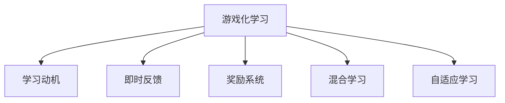

                 

# 游戏化学习：寓教于乐，激发参与热情

> 关键词：游戏化学习, 教育技术, 参与度, 学习动机, 用户体验, 混合学习

## 1. 背景介绍

### 1.1 问题由来
随着数字技术的快速发展和普及，在线教育已成为学习的主要方式之一。然而，传统的在线教育往往缺乏互动性和趣味性，难以吸引学生的注意力，导致学习效率低下。如何在在线教育中引入游戏化元素，激发学生的参与热情，提升学习效果，已成为教育技术领域的一个重要研究方向。

### 1.2 问题核心关键点
游戏化学习（Gamification Learning）是一种将游戏设计元素引入教育领域的方法，通过设置目标、竞争、反馈、奖励等游戏机制，激发学生的学习动机，提升学习效果。游戏化学习的核心在于：
- 目标设置：设定明确的学习目标，引导学生不断努力。
- 竞争与合作：引入竞争与合作机制，增强学习动力。
- 即时反馈：及时提供反馈信息，帮助学生调整学习策略。
- 奖励系统：通过奖励机制，激励学生持续学习。

游戏化学习的研究与应用，不仅关注学生的外部激励，更关注其内在动机的激发。通过将学习过程设计成游戏，让学生在游戏中获得成就感和满足感，从而提升学习兴趣和效果。

### 1.3 问题研究意义
游戏化学习在教育领域的应用，对于提高学生的学习兴趣、提升学习效果、促进创新思维等方面具有重要意义：

1. **提高学习兴趣**：通过设置趣味性和挑战性的任务，激发学生的好奇心和探索欲，使其对学习内容产生兴趣。
2. **提升学习效果**：通过游戏机制的设计，将复杂的知识点转化为易于理解、操作的任务，提升学生的理解和应用能力。
3. **促进创新思维**：在游戏化的学习环境中，学生需要不断尝试、探索、创新，以完成不同的任务，从而培养其创新思维和问题解决能力。
4. **增强社交互动**：通过协作和竞争机制，促进学生之间的互动交流，增强团队合作精神。
5. **个性化学习**：根据学生的学习进度和兴趣，动态调整游戏难度和内容，实现个性化的学习体验。

## 2. 核心概念与联系

### 2.1 核心概念概述

为更好地理解游戏化学习的原理和应用，本节将介绍几个关键概念及其相互联系：

- **游戏化学习（Gamification Learning）**：将游戏设计元素引入教育领域，通过设置目标、竞争、反馈、奖励等机制，激发学生的学习动机，提升学习效果。
- **学习动机（Learning Motivation）**：推动学生积极参与学习活动的心理动因，包括内在动机和外在动机。
- **即时反馈（Immediate Feedback）**：在学生完成任务后，及时提供反馈信息，帮助其了解学习效果，调整学习策略。
- **奖励系统（Reward System）**：通过设置奖励机制，激励学生持续学习，提升学习动力。
- **混合学习（Blended Learning）**：结合在线学习和面对面教学，提供更加灵活和高效的学习方式。
- **自适应学习（Adaptive Learning）**：根据学生的学习进度和能力，动态调整学习内容和难度，实现个性化的学习体验。

这些概念之间的逻辑关系可以通过以下Mermaid流程图来展示：



这个流程图展示游戏化学习与各核心概念之间的相互联系：

1. 游戏化学习通过设置目标、竞争、反馈、奖励等机制，激发学生的学习动机。
2. 即时反馈帮助学生了解学习效果，调整学习策略。
3. 奖励系统通过正向激励，增强学生的持续学习动力。
4. 混合学习结合在线和面对面教学，提供更加灵活高效的学习方式。
5. 自适应学习根据学生学习情况，动态调整学习内容和难度，实现个性化学习。

## 3. 核心算法原理 & 具体操作步骤
### 3.1 算法原理概述

游戏化学习的主要算法原理包括目标设置、即时反馈、奖励系统等。这些机制的设计和实施，可以通过以下步骤进行：

1. **目标设置**：根据学习内容，设定明确的学习目标，引导学生朝着目标努力。
2. **即时反馈**：在学生完成任务后，及时提供反馈信息，帮助其了解学习效果，调整学习策略。
3. **奖励系统**：通过设置奖励机制，激励学生持续学习，提升学习动力。
4. **混合学习**：结合在线学习和面对面教学，提供更加灵活和高效的学习方式。
5. **自适应学习**：根据学生的学习进度和能力，动态调整学习内容和难度，实现个性化的学习体验。

### 3.2 算法步骤详解

游戏化学习的具体实施步骤包括：

**Step 1: 设计学习目标**
- 根据学习内容，设计清晰、具体、可量化的学习目标，如完成特定的任务、掌握某项技能等。
- 将学习目标进行可视化展示，如通过进度条、目标树等方式，帮助学生明确目标。

**Step 2: 引入竞争与合作机制**
- 在学生之间引入竞争机制，如排名、积分、排行榜等，激发学生的竞争意识。
- 设计合作任务，鼓励学生共同完成任务，增强团队合作精神。

**Step 3: 实现即时反馈**
- 在学习过程中，通过即时反馈系统，及时提供学习效果的信息，如正确率、得分等。
- 反馈信息应具体、详细，帮助学生了解自己的学习情况，调整学习策略。

**Step 4: 设置奖励系统**
- 根据学习目标和反馈信息，设置相应的奖励机制，如积分、徽章、虚拟奖品等。
- 奖励系统应多样化，既有即时奖励（如即时积分），又有延迟奖励（如成就展示），增强学生的持续学习动力。

**Step 5: 实施混合学习**
- 结合在线学习和面对面教学，提供灵活的学习方式，如在线课程与班级讨论、自主学习与教师指导相结合。
- 利用在线平台提供丰富的学习资源和工具，如视频教程、互动练习、虚拟实验室等，增强学习效果。

**Step 6: 实现自适应学习**
- 根据学生的学习进度和能力，动态调整学习内容和难度，实现个性化的学习体验。
- 使用学习管理系统（LMS）收集学生的学习数据，分析学习行为和效果，提供个性化的学习建议。

### 3.3 算法优缺点

游戏化学习在提升学习效果方面具有以下优点：
1. 提高学习兴趣：通过设置趣味性和挑战性的任务，激发学生的好奇心和探索欲，使其对学习内容产生兴趣。
2. 提升学习效果：通过游戏机制的设计，将复杂的知识点转化为易于理解、操作的任务，提升学生的理解和应用能力。
3. 增强社交互动：通过协作和竞争机制，促进学生之间的互动交流，增强团队合作精神。
4. 实现个性化学习：根据学生的学习进度和兴趣，动态调整游戏难度和内容，实现个性化的学习体验。

同时，游戏化学习也存在一些局限性：
1. 设计复杂：需要根据不同的学习内容，设计合适的游戏机制，设计过程复杂。
2. 依赖技术：游戏化学习依赖于在线平台和工具，需要较高的技术支持。
3. 资源投入：游戏化学习的实施需要投入大量的时间、精力和资金，成本较高。
4. 可能产生副作用：游戏化学习过度依赖奖励，可能导致学生学习动机过于功利，忽略学习本身的价值。

尽管存在这些局限性，但就目前而言，游戏化学习仍是提升在线教育效果的重要手段。未来相关研究的重点在于如何进一步降低实施成本，提高游戏机制的普适性和灵活性，同时兼顾学生的学习动机和实际效果。

### 3.4 算法应用领域

游戏化学习在游戏化课程设计、游戏化教育平台、游戏化评估系统等多个领域得到了广泛应用，以下是几个典型的应用场景：

**1. 游戏化课程设计**
- 在K-12教育中，将游戏元素引入课程设计，提升学生学习的趣味性和互动性。如通过角色扮演、任务完成等游戏机制，激发学生的学习兴趣。

**2. 游戏化教育平台**
- 在线教育平台如Coursera、edX等，引入游戏化机制，增强学习体验和效果。如设置学习进度排行榜、虚拟学分等，激励学生完成学习任务。

**3. 游戏化评估系统**
- 利用游戏化评估系统，如学习管理系统（LMS），收集学生的学习数据，分析学习行为和效果，提供个性化的学习建议。如通过奖励积分、成就展示等方式，激励学生持续学习。

此外，游戏化学习也被创新性地应用于职业培训、心理健康教育等多个领域，为不同场景下的学习提供了新的可能性。

## 4. 数学模型和公式 & 详细讲解 & 举例说明

### 4.1 数学模型构建

游戏化学习的效果评估可以通过以下数学模型进行构建：

假设学习目标为 $T$，学生的当前学习进度为 $P$，即时反馈为 $F$，奖励系统为 $R$，则游戏化学习效果 $E$ 可以表示为：

$$
E = f(T, P, F, R)
$$

其中 $f$ 为游戏化学习效果函数，根据学生的学习情况，综合考虑学习目标、进度、反馈和奖励，计算学习效果。

### 4.2 公式推导过程

通过上述数学模型，可以进一步推导出游戏化学习效果的具体计算公式。假设 $T$、$P$、$F$、$R$ 分别为学习目标、进度、反馈和奖励，则学习效果 $E$ 可以表示为：

$$
E = k_1 \cdot T + k_2 \cdot P + k_3 \cdot F + k_4 \cdot R
$$

其中 $k_1$、$k_2$、$k_3$、$k_4$ 为权系数，根据不同学习目标和情境进行调整。例如，对于需要掌握特定技能的任务，$k_1$ 应较大；对于需要长期积累的任务，$k_2$ 应较大。

### 4.3 案例分析与讲解

以一个在线编程课程为例，分析游戏化学习效果的计算过程：

**案例背景**：学生 A 在完成编程任务后，获得了即时反馈和积分奖励，但进度较慢。课程设计中，学习目标为掌握 Python 编程技能，任务完成后可以获得虚拟徽章。

**具体计算**：
1. 学习目标 $T$：掌握 Python 编程技能，设 $T=10$
2. 学习进度 $P$：当前已完成 5% 的任务，设 $P=0.05$
3. 即时反馈 $F$：任务完成后，获得 80% 的分数，设 $F=0.8$
4. 奖励系统 $R$：完成每个任务获得 10 积分，设 $R=10$

将上述数据代入学习效果公式：

$$
E = 10 \cdot 0.05 + 0.8 \cdot 0.5 + 10 \cdot 1 = 8.4
$$

通过计算得到学生 A 的学习效果为 8.4，表示其在该任务上的学习效果较好，但仍有提升空间。

## 5. 项目实践：代码实例和详细解释说明

### 5.1 开发环境搭建

在进行游戏化学习开发前，我们需要准备好开发环境。以下是使用Python进行开发的环境配置流程：

1. 安装Anaconda：从官网下载并安装Anaconda，用于创建独立的Python环境。

2. 创建并激活虚拟环境：
```bash
conda create -n gamified-learning python=3.8 
conda activate gamified-learning
```

3. 安装相关库：
```bash
pip install pandas numpy matplotlib django
```

4. 搭建Web应用：
```bash
django-admin startproject gamified_learning
cd gamified_learning
python manage.py startapp games
```

完成上述步骤后，即可在`gamified_learning`环境中开始游戏化学习开发。

### 5.2 源代码详细实现

下面我们以一个在线编程任务为例，给出使用Django框架实现游戏化学习过程的代码实现。

**游戏化学习模型**：

```python
from django.db import models
from django.contrib.auth.models import User

class Game(models.Model):
    user = models.ForeignKey(User, on_delete=models.CASCADE)
    name = models.CharField(max_length=50)
    goal = models.FloatField()
    progress = models.FloatField()
    feedback = models.FloatField()
    reward = models.FloatField()
    
    def save(self, *args, **kwargs):
        self.evaluation = self.calculate_evaluation()
        super().save(*args, **kwargs)

    def calculate_evaluation(self):
        k1 = 0.1  # 学习目标权重
        k2 = 0.2  # 学习进度权重
        k3 = 0.3  # 即时反馈权重
        k4 = 0.4  # 奖励系统权重
        return (k1 * self.goal + k2 * self.progress + k3 * self.feedback + k4 * self.reward)

class UserGame(models.Model):
    user = models.ForeignKey(User, on_delete=models.CASCADE)
    game = models.ForeignKey(Game, on_delete=models.CASCADE)
    completion = models.FloatField()
```

**游戏化学习页面**：

```html
<!DOCTYPE html>
<html>
<head>
    <title>Gameified Learning</title>
    <script src="https://cdn.jsdelivr.net/npm/chart.js"></script>
</head>
<body>
    <h1>Gameified Learning</h1>
    <p>Your current game score: {{ game.evaluation }}</p>
    <p>Your goal: {{ game.goal }}</p>
    <p>Your progress: {{ game.progress }}</p>
    <p>Your feedback: {{ game.feedback }}</p>
    <p>Your reward: {{ game.reward }}</p>
    <p>Your completion: {{ game.completion }}</p>
    <div>
        <canvas id="myChart"></canvas>
    </div>
    <script>
        var ctx = document.getElementById('myChart').getContext('2d');
        var myChart = new Chart(ctx, {
            type: 'bar',
            data: {
                labels: ['Goal', 'Progress', 'Feedback', 'Reward', 'Completion'],
                datasets: [{
                    label: 'Score',
                    data: [{{ game.goal }}, {{ game.progress }}, {{ game.feedback }}, {{ game.reward }}, {{ game.completion }}],
                    backgroundColor: [
                        'rgba(255, 99, 132, 0.2)',
                        'rgba(54, 162, 235, 0.2)',
                        'rgba(255, 206, 86, 0.2)',
                        'rgba(75, 192, 192, 0.2)',
                        'rgba(153, 102, 255, 0.2)'
                    ],
                    borderColor: [
                        'rgba(255, 99, 132, 1)',
                        'rgba(54, 162, 235, 1)',
                        'rgba(255, 206, 86, 1)',
                        'rgba(75, 192, 192, 1)',
                        'rgba(153, 102, 255, 1)'
                    ],
                    borderWidth: 1
                }]
            },
            options: {
                scales: {
                    yAxes: [{
                        ticks: {
                            beginAtZero: true
                        }
                    }]
                }
            }
        });
    </script>
</body>
</html>
```

**游戏化学习控制器**：

```python
from django.shortcuts import render
from .models import Game, UserGame
from django.http import JsonResponse

def game_info(request, user_id):
    user = User.objects.get(id=user_id)
    games = Game.objects.filter(user=user).order_by('-name')
    context = {
        'user': user,
        'games': games
    }
    return render(request, 'games/index.html', context)

def update_game(request, user_id, game_id):
    user = User.objects.get(id=user_id)
    game = Game.objects.get(id=game_id, user=user)
    if request.method == 'POST':
        data = request.POST
        game.progress = float(data['progress'])
        game.feedback = float(data['feedback'])
        game.reward = float(data['reward'])
        game.save()
        return JsonResponse({'success': True})
    else:
        return JsonResponse({'success': False})
```

完成上述步骤后，即可在`gamified_learning`环境中运行游戏化学习系统，并实现游戏化学习过程的交互。

### 5.3 代码解读与分析

让我们再详细解读一下关键代码的实现细节：

**Game模型**：
- 定义了学生与游戏之间的关系，包括学习目标、进度、反馈、奖励等属性。
- 在模型保存时，计算并更新游戏效果（Evaluation），记录到数据库中。

**UserGame模型**：
- 记录了学生在特定游戏中的完成进度，用于计算游戏效果。

**game_info视图**：
- 展示当前学生参与的所有游戏信息，包括目标、进度、反馈、奖励等。
- 使用Chart.js库展示游戏效果（Evaluation）的饼图，直观展示学生在不同维度的表现。

**update_game视图**：
- 接收学生对特定游戏的进度、反馈、奖励等信息的更新请求。
- 更新游戏状态，并返回JSON响应，告知更新是否成功。

**游戏化学习页面**：
- 使用Django模板语言渲染HTML页面，展示学生当前的游戏效果和目标。
- 嵌入Chart.js库，动态展示游戏效果的饼图。

可以看到，通过上述代码实现，我们能够轻松搭建一个基于Django的游戏化学习系统，实时展示学生的学习情况，激励其持续学习。

## 6. 实际应用场景
### 6.1 教育领域

在游戏化学习的实际应用中，教育领域是其最常见的应用场景之一。通过将游戏元素引入课堂，能够有效提升学生的学习兴趣和参与度，从而提高学习效果。

**应用案例**：
- 小学数学课程：通过设计数学游戏，如数字找规律、数学谜题等，激发学生的数学兴趣，提升数学能力。
- 大学编程课程：通过编程任务和挑战，提升学生的编程技能和团队合作精神。
- 在线语言学习：通过设计互动游戏和任务，提升学生的语言学习效果，增强语言应用能力。

**效果分析**：
- 学习兴趣提升：通过设置趣味性和挑战性的任务，激发学生的好奇心和探索欲，使其对学习内容产生兴趣。
- 学习效果提升：通过游戏机制的设计，将复杂的知识点转化为易于理解、操作的任务，提升学生的理解和应用能力。
- 团队合作增强：通过协作和竞争机制，促进学生之间的互动交流，增强团队合作精神。

### 6.2 企业培训

游戏化学习在企业培训中也得到了广泛应用，通过将游戏元素引入培训课程，能够提升员工的参与度和学习效果。

**应用案例**：
- 产品开发：通过设计产品开发游戏中的任务和挑战，提升员工的创新能力和协作精神。
- 客户服务：通过客户服务游戏中的模拟对话和场景，提升员工的客户服务技能。
- 项目管理：通过项目管理游戏中的任务和目标设定，提升员工的项目管理和团队协作能力。

**效果分析**：
- 员工参与度提升：通过设置挑战性的任务和奖励机制，激励员工积极参与培训。
- 学习效果提升：通过游戏机制的设计，将复杂的技能和知识转化为易于理解、操作的任务，提升员工的学习效果。
- 团队协作增强：通过协作和竞争机制，促进员工之间的互动交流，增强团队协作能力。

### 6.3 健康领域

游戏化学习在健康领域的应用，通过将游戏元素引入健康管理中，能够提升用户的健康意识和参与度。

**应用案例**：
- 健康挑战：通过设计健康挑战游戏，如步行挑战、饮食挑战等，激励用户保持健康生活方式。
- 心理健康：通过心理健康游戏中的心理测试和游戏任务，提升用户的心理健康水平。
- 健康教育：通过健康教育游戏中的互动和挑战，提升用户的健康知识水平。

**效果分析**：
- 健康意识提升：通过设置健康挑战和奖励机制，激励用户积极参与健康管理。
- 健康行为改善：通过游戏机制的设计，将健康管理转化为有趣、可操作的任务，提升用户的健康行为。
- 健康知识增强：通过健康教育游戏中的互动和挑战，提升用户的健康知识水平。

### 6.4 未来应用展望

随着游戏化学习技术的不断成熟，其在更多领域的应用前景将更加广阔。未来，游戏化学习将在以下几个方面进一步发展：

**1. 更多领域应用**
- 游戏化学习将不仅仅应用于教育、培训、健康等领域，还将拓展到金融、市场营销、社会治理等多个领域。
- 通过将游戏元素引入实际应用中，提升各个领域的参与度和效果，推动社会各行业的智能化转型。

**2. 更加个性化**
- 游戏化学习将结合个性化推荐和自适应学习技术，根据用户的学习进度和兴趣，动态调整游戏难度和内容，实现个性化的学习体验。
- 通过用户数据的多维度分析，提供更加精准的学习建议和推荐，增强学习效果。

**3. 融合新技术**
- 游戏化学习将结合增强现实（AR）、虚拟现实（VR）、人工智能（AI）等新技术，提供更加丰富、沉浸式的学习体验。
- 通过虚拟现实环境中的互动和挑战，提升用户的学习兴趣和参与度，实现更加逼真的学习场景。

**4. 注重用户体验**
- 游戏化学习将更加注重用户体验，设计更加人性化、易操作的游戏界面和交互方式。
- 通过简化游戏规则和操作，降低用户的学习门槛，增强学习的便利性和易用性。

**5. 强调伦理和社会责任**
- 游戏化学习将注重伦理和社会责任，避免游戏中出现误导性、有害的内容。
- 通过设计健康、积极、有益的游戏内容，促进社会正向价值观的传播和普及。

## 7. 工具和资源推荐
### 7.1 学习资源推荐

为了帮助开发者系统掌握游戏化学习的理论基础和实践技巧，这里推荐一些优质的学习资源：

1. 《Gamification by Design》书籍：详细介绍了游戏化学习的理论和实践，涵盖目标设定、即时反馈、奖励系统等多个方面。
2. 《Gameful Learning》课程：通过实际案例分析，探讨游戏化学习在K-12教育中的应用，提供详细的游戏设计指导。
3. 《Gamification Network》社区：提供游戏化学习的最新研究、实践案例和交流平台，汇集了大量游戏化学习专家。
4. 《Gamification Research Consortium》论文集：收集了最新的游戏化学习研究成果，涵盖游戏化设计、效果评估等多个主题。
5. 《Gamification for Education》报告：总结了游戏化学习在教育领域的应用效果，提供了大量成功案例和研究数据。

通过对这些资源的学习实践，相信你一定能够快速掌握游戏化学习的精髓，并用于解决实际的学习问题。

### 7.2 开发工具推荐

高效的游戏化学习开发需要依赖于丰富的开发工具和平台。以下是几款常用的游戏化学习开发工具：

1. Django框架：提供强大的Web应用开发功能，支持游戏化学习模型的创建和展示。
2. Chart.js库：提供丰富的图表可视化功能，支持游戏效果（Evaluation）的展示。
3. Unity引擎：提供强大的游戏开发功能，支持虚拟现实和增强现实游戏的设计和实现。
4. Blender软件：提供三维建模和动画制作功能，支持游戏场景的可视化设计。
5. Google Colab平台：提供免费的GPU/TPU算力，支持快速实验和原型开发。

合理利用这些工具，可以显著提升游戏化学习的开发效率，加快创新迭代的步伐。

### 7.3 相关论文推荐

游戏化学习的研究源于学界的持续研究。以下是几篇奠基性的相关论文，推荐阅读：

1. 《Gamification in Education: 10 Things You Should Know》论文：系统总结了游戏化学习在教育领域的应用效果，提供了大量的实际案例和研究数据。
2. 《Gamification and Game-Based Learning》书籍：详细介绍了游戏化学习的基本概念和设计原则，涵盖游戏化课程设计、即时反馈等多个方面。
3. 《Gamification: How to Motivate People in the Digital Age》书籍：探讨了游戏化学习在商业和组织中的应用，提供了大量的实际案例和研究数据。
4. 《Designing Effective Game-based Learning》论文：介绍了游戏化学习的理论基础和实践方法，提供了大量的实验数据和研究成果。
5. 《Gamification for Corporate Learning》报告：总结了游戏化学习在企业培训中的应用效果，提供了大量的成功案例和研究数据。

这些论文代表了大语言模型微调技术的发展脉络。通过学习这些前沿成果，可以帮助研究者把握学科前进方向，激发更多的创新灵感。

## 8. 总结：未来发展趋势与挑战

### 8.1 总结

本文对游戏化学习的原理和实践进行了全面系统的介绍。首先阐述了游戏化学习的背景和意义，明确了游戏化学习在提升学生学习兴趣和效果方面的独特价值。其次，从原理到实践，详细讲解了游戏化学习的数学模型和操作步骤，给出了游戏化学习开发的完整代码实例。同时，本文还探讨了游戏化学习在教育、企业、健康等多个领域的应用前景，展示了游戏化学习的广泛应用。

通过本文的系统梳理，可以看到，游戏化学习在提升学生学习兴趣、效果和体验方面具有重要意义。游戏化学习的方法，通过将游戏元素引入教育和学习过程中，能够有效激发学生的学习动机，提升学习效果。未来，游戏化学习将继续在教育、培训、健康等多个领域得到应用，为学习者提供更加丰富、有趣、高效的学习体验。

### 8.2 未来发展趋势

展望未来，游戏化学习技术将呈现以下几个发展趋势：

**1. 应用场景多样化**
- 游戏化学习将不仅仅应用于教育、培训、健康等领域，还将拓展到更多实际应用场景中，如金融、市场营销、社会治理等。
- 通过将游戏元素引入各个领域，提升各个领域的参与度和效果，推动社会各行业的智能化转型。

**2. 技术融合创新**
- 游戏化学习将结合人工智能、增强现实、虚拟现实等新技术，提供更加丰富、沉浸式的学习体验。
- 通过虚拟现实环境中的互动和挑战，提升用户的学习兴趣和参与度，实现更加逼真的学习场景。

**3. 个性化和自适应**
- 游戏化学习将结合个性化推荐和自适应学习技术，根据用户的学习进度和兴趣，动态调整游戏难度和内容，实现个性化的学习体验。
- 通过用户数据的多维度分析，提供更加精准的学习建议和推荐，增强学习效果。

**4. 注重用户体验**
- 游戏化学习将更加注重用户体验，设计更加人性化、易操作的游戏界面和交互方式。
- 通过简化游戏规则和操作，降低用户的学习门槛，增强学习的便利性和易用性。

**5. 强调伦理和社会责任**
- 游戏化学习将注重伦理和社会责任，避免游戏中出现误导性、有害的内容。
- 通过设计健康、积极、有益的游戏内容，促进社会正向价值观的传播和普及。

### 8.3 面临的挑战

尽管游戏化学习技术已经取得了显著进展，但在实际应用中也面临一些挑战：

**1. 设计复杂**
- 游戏化学习的设计需要考虑多个维度和因素，包括游戏机制、目标设定、即时反馈等，设计过程复杂。
- 需要具备一定的游戏设计和心理学知识，才能设计出有效、有趣的游戏化学习内容。

**2. 资源投入**
- 游戏化学习的实施需要投入大量的时间、精力和资金，成本较高。
- 需要开发和维护游戏化学习平台和工具，提供稳定的技术支持。

**3. 效果评估**
- 游戏化学习的评估需要多维度的数据收集和分析，评估过程复杂。
- 需要设计合适的评估指标，全面衡量学习效果和用户体验。

**4. 用户体验**
- 游戏化学习的用户体验需要不断优化和调整，才能满足不同用户的需求。
- 需要根据用户反馈不断迭代和改进游戏内容，提升用户满意度。

**5. 伦理和责任**
- 游戏化学习需要注重伦理和责任，避免游戏中出现误导性、有害的内容。
- 需要设计健康、积极、有益的游戏内容，确保用户的安全和健康。

尽管存在这些挑战，但游戏化学习的前景依然广阔。通过不断优化设计、投入资源、改进技术，相信游戏化学习将进一步提升各领域的学习效果和用户体验，推动社会的智能化转型。

### 8.4 研究展望

面对游戏化学习面临的挑战，未来的研究需要在以下几个方面寻求新的突破：

**1. 设计方法和工具**
- 开发更加简便、高效的游戏化设计工具和方法，降低游戏化学习的实施难度。
- 引入更加科学的设计方法，如用户研究、心理学实验等，提高游戏化学习的有效性。

**2. 技术融合和创新**
- 结合人工智能、增强现实、虚拟现实等新技术，提供更加丰富、沉浸式的学习体验。
- 通过新技术的应用，提升游戏化学习的趣味性和互动性，增强学习效果。

**3. 个性化和自适应**
- 结合个性化推荐和自适应学习技术，根据用户的学习进度和兴趣，动态调整游戏难度和内容，实现个性化的学习体验。
- 通过用户数据的多维度分析，提供更加精准的学习建议和推荐，增强学习效果。

**4. 用户体验优化**
- 注重用户体验，设计更加人性化、易操作的游戏界面和交互方式。
- 通过简化游戏规则和操作，降低用户的学习门槛，增强学习的便利性和易用性。

**5. 伦理和责任**
- 注重伦理和责任，避免游戏中出现误导性、有害的内容。
- 设计健康、积极、有益的游戏内容，确保用户的安全和健康。

这些研究方向的探索发展，必将引领游戏化学习技术迈向更高的台阶，为学习者提供更加丰富、有趣、高效的学习体验。面向未来，游戏化学习技术还需要与其他人工智能技术进行更深入的融合，如知识表示、因果推理、强化学习等，多路径协同发力，共同推动自然语言理解和智能交互系统的进步。只有勇于创新、敢于突破，才能不断拓展游戏化学习的边界，让智能技术更好地造福人类社会。

## 9. 附录：常见问题与解答

**Q1：游戏化学习如何衡量学习效果？**

A: 游戏化学习的效果评估可以通过多维度的数据收集和分析进行。常用的评估指标包括：
- 学习目标完成率：衡量学生完成特定学习目标的程度。
- 学习进度：衡量学生在特定任务中的进度。
- 即时反馈得分：衡量学生在即时反馈中的得分和表现。
- 奖励积分：衡量学生在奖励系统中的积分和成就。
- 学习动机：衡量学生参与游戏的动机和兴趣。

通过这些指标的综合评估，可以全面衡量游戏化学习的效果，提供有针对性的改进建议。

**Q2：游戏化学习如何设计游戏机制？**

A: 游戏化学习的关键在于设计有效的游戏机制，以激发学生的学习动机和兴趣。常用的游戏机制包括：
- 目标设定：设定明确的学习目标，引导学生朝着目标努力。
- 即时反馈：在学生完成任务后，及时提供反馈信息，帮助其了解学习效果，调整学习策略。
- 奖励系统：通过设置奖励机制，激励学生持续学习，提升学习动力。
- 竞争与合作：引入竞争与合作机制，增强学习动力。
- 任务设计：设计趣味性和挑战性的任务，激发学生的好奇心和探索欲。

设计游戏机制需要考虑学生的学习特点和兴趣，结合不同的学习内容和目标，设计出合适、有效的游戏机制。

**Q3：游戏化学习如何提高学习效果？**

A: 游戏化学习通过设置游戏机制，将复杂的知识点转化为易于理解、操作的任务，提升学生的理解和应用能力。具体来说，可以通过以下方法提高学习效果：
- 设定明确的学习目标：通过设定目标，激发学生的学习动机，使其朝着目标努力。
- 设计趣味性和挑战性的任务：通过设计趣味性和挑战性的任务，激发学生的好奇心和探索欲，提升学习兴趣。
- 提供即时反馈：在学生完成任务后，及时提供反馈信息，帮助其了解学习效果，调整学习策略。
- 设置奖励机制：通过设置奖励机制，激励学生持续学习，提升学习动力。
- 实现混合学习和自适应学习：结合在线学习和面对面教学，提供灵活的学习方式；根据学生的学习进度和兴趣，动态调整学习内容和难度，实现个性化的学习体验。

通过这些方法，可以显著提升学生的学习效果，实现更好的学习成果。

**Q4：游戏化学习如何应对学习动机不足的问题？**

A: 学习动机不足是游戏化学习面临的一个常见问题。可以通过以下方法应对：
- 设计趣味性和挑战性的任务：通过设计趣味性和挑战性的任务，激发学生的好奇心和探索欲，提升学习兴趣。
- 设置明确的学习目标：通过设定明确的学习目标，引导学生朝着目标努力，增强学习动机。
- 提供即时反馈和奖励：在学生完成任务后，及时提供反馈信息和奖励，增强学习动力。
- 引入竞争与合作机制：通过引入竞争与合作机制，增强学习动机和合作精神。
- 设计互动和协作任务：通过设计互动和协作任务，促进学生之间的互动交流，增强学习动力。

通过这些方法，可以有效地应对学习动机不足的问题，提升学生的学习效果。

**Q5：游戏化学习如何结合人工智能技术？**

A: 游戏化学习可以结合人工智能技术，提供更加丰富、智能化、个性化的学习体验。具体来说，可以通过以下方法结合人工智能技术：
- 利用机器学习进行个性化推荐：根据学生的学习进度和兴趣，动态调整游戏难度和内容，实现个性化的学习体验。
- 结合自然语言处理技术：通过自然语言处理技术，分析学生的学习数据，提供个性化的学习建议。
- 引入增强学习算法：通过增强学习算法，优化游戏机制和奖励系统，提升学习效果。
- 使用深度学习进行任务生成：通过深度学习技术，自动生成个性化的学习任务和挑战，增强学习的趣味性和挑战性。
- 结合知识图谱和规则库：将符号化的先验知识，如知识图谱、逻辑规则等，与神经网络模型进行巧妙融合，引导微调过程学习更准确、合理的语言模型。

通过这些方法，可以结合人工智能技术，提供更加智能、高效、个性化的游戏化学习体验。

---

作者：禅与计算机程序设计艺术 / Zen and the Art of Computer Programming

