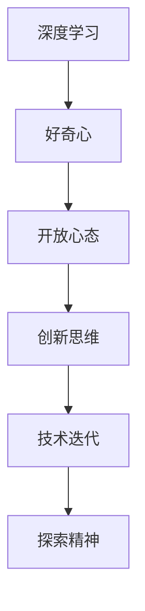

                 

# 理解洞察力的培养：鼓励好奇心和开放心态

> 关键词：洞察力, 好奇心, 开放心态, 深度学习, 人工智能, 技术迭代, 探索精神, 创新思维

## 1. 背景介绍

在当今这个信息爆炸的时代，技术的发展日新月异。人工智能（AI）和深度学习（DL）技术，尤其是深度学习领域，正在以前所未有的速度推动着科学和社会的进步。面对这样快速变化的技术环境，如何培养和维持一个具有强烈好奇心和开放心态的技术团队，以不断探索未知领域，是每个科技公司和团队所面临的重要挑战。本文将深入探讨如何通过深度学习和人工智能技术的实践，鼓励好奇心和开放心态的培养，以促进技术团队的创新能力和持续发展。

## 2. 核心概念与联系

### 2.1 核心概念概述

为了更好地理解深度学习在培养好奇心和开放心态方面的作用，本节将介绍几个关键概念：

- **深度学习（Deep Learning）**：一种基于多层神经网络的机器学习方法，能够自动学习数据中的复杂特征，广泛应用于图像识别、语音识别、自然语言处理等领域。

- **好奇心（Curiosity）**：指的是对周围世界持续不断的探索欲望和求知欲，是推动人类和人工智能技术不断前进的动力。

- **开放心态（Open Mind）**：是指对新知识、新观点和新方法持有一种接受和包容的态度，愿意接受挑战和不确定性，不断突破自我。

- **创新思维（Innovative Thinking）**：在复杂和快速变化的环境中，能够提出新颖的解决方案和观点，以应对不断变化的技术挑战。

- **技术迭代（Technological Iteration）**：不断优化和升级技术的过程，通常包括实验验证、用户反馈和市场变化等因素的考虑。

- **探索精神（Exploration Spirit）**：在面对未知领域时，勇于探索和尝试的态度，而不是一味地依赖现有知识和技术。

### 2.2 核心概念原理和架构的 Mermaid 流程图



这个流程图展示了深度学习在培养好奇心和开放心态方面的核心概念及其相互关系。深度学习通过不断的技术迭代和探索，不断激发团队的好奇心和开放心态，从而推动创新思维的发展。

## 3. 核心算法原理 & 具体操作步骤

### 3.1 算法原理概述

深度学习的核心算法原理是通过多层神经网络自动学习和提取数据中的复杂特征，进而实现对数据的高级别抽象和表示。这种自动学习和抽象能力，使得深度学习模型能够处理大量的非结构化数据，如图像、语音、文本等。在培养好奇心和开放心态的过程中，深度学习算法具有以下优势：

- **自动学习**：深度学习模型能够自动从数据中学习特征，无需人工干预，这鼓励了对未知数据的探索和研究。
- **复杂表示**：深度学习模型能够学习到更高级别的特征表示，这要求研究者对新知识和新观点持开放态度，愿意接受复杂和抽象的模型结构。
- **多任务学习**：深度学习模型能够在多个相关任务上进行联合训练，这需要团队成员具有跨领域的探索精神和开放心态，愿意在多个任务中寻找共性和差异。

### 3.2 算法步骤详解

基于深度学习的技术实践，培养好奇心和开放心态可以按照以下步骤进行：

**Step 1: 数据收集与预处理**

- **收集数据**：选择与当前任务相关的数据集，可以是公开数据集，也可以是定制化的数据。
- **数据预处理**：清洗数据，去除噪声和异常值，标准化数据格式，以便于深度学习模型处理。

**Step 2: 模型选择与构建**

- **选择模型架构**：根据任务类型选择合适的深度学习模型，如卷积神经网络（CNN）、循环神经网络（RNN）、生成对抗网络（GAN）等。
- **模型构建**：使用深度学习框架（如TensorFlow、PyTorch）构建模型，并进行参数初始化。

**Step 3: 模型训练与优化**

- **训练模型**：使用收集的数据集对模型进行训练，调整模型参数，使其能够很好地拟合数据。
- **模型优化**：使用优化算法（如随机梯度下降、Adam）优化模型参数，避免过拟合和欠拟合。

**Step 4: 模型评估与迭代**

- **模型评估**：在验证集上评估模型性能，计算损失函数和精度指标。
- **迭代改进**：根据评估结果，调整模型参数和训练策略，进一步优化模型。

**Step 5: 知识分享与交流**

- **知识分享**：定期组织技术分享会，让团队成员分享研究成果和心得，促进知识传播。
- **交流讨论**：鼓励团队成员进行开放性的讨论，不断挑战和更新现有知识。

### 3.3 算法优缺点

深度学习在培养好奇心和开放心态方面具有以下优点：

- **自动化学习**：自动化学习能力能够引导团队不断探索新数据和新领域，激发好奇心。
- **多任务能力**：多任务学习可以鼓励团队跨领域探索，培养开放心态。
- **数据驱动**：数据驱动的决策过程，要求团队对新数据和新观点持开放态度。

同时，深度学习也存在一些缺点：

- **资源密集**：深度学习模型通常需要大量计算资源和数据，这可能导致资源配置不合理。
- **模型复杂**：复杂的模型结构需要团队具备扎实的数学和编程基础，可能导致团队成员的学习压力较大。
- **结果不稳定**：深度学习模型的训练结果可能存在较大波动，需要团队具备一定的经验和技巧来调整优化策略。

### 3.4 算法应用领域

深度学习在培养好奇心和开放心态的应用领域非常广泛，包括但不限于：

- **自然语言处理（NLP）**：通过构建语言模型，鼓励团队对不同语言和文化的多样性保持好奇和开放，探索新的语义表达和理解方式。
- **计算机视觉（CV）**：通过训练图像识别模型，鼓励团队对不同物体和场景的视觉特征保持探索，发现新的视觉模式和规律。
- **语音识别（ASR）**：通过构建语音识别模型，鼓励团队对不同口音和语言的语音特征保持开放，探索新的语音识别技术。
- **推荐系统（RS）**：通过构建推荐模型，鼓励团队对用户行为和兴趣保持探索，发现新的推荐策略和模式。

## 4. 数学模型和公式 & 详细讲解 & 举例说明

### 4.1 数学模型构建

在本节中，我们将介绍一个简单的深度学习模型，以帮助你理解深度学习的数学模型构建过程。

假设我们有一个简单的全连接神经网络模型，包含两个隐藏层，输入层有 $n$ 个神经元，第一个隐藏层有 $m$ 个神经元，第二个隐藏层有 $k$ 个神经元，输出层有 $o$ 个神经元。模型的结构如下：

```mermaid
graph TB
    A[输入层] --> B[隐藏层1] --> C[隐藏层2] --> D[输出层]
    subgraph 隐藏层1
        B[神经元m_1] --> B[神经元m_2]
        B[神经元m_3] --> B[神经元m_4]
        ...
        B[神经元m_(n-1)] --> B[神经元m_n]
    end
    subgraph 隐藏层2
        C[神经元k_1] --> C[神经元k_2]
        C[神经元k_3] --> C[神经元k_4]
        ...
        C[神经元k_(m-1)] --> C[神经元k_m]
    end
```

模型训练的目标是最小化损失函数 $\mathcal{L}$，通常使用交叉熵损失函数：

$$
\mathcal{L} = -\frac{1}{N}\sum_{i=1}^N \sum_{j=1}^o y_j \log \hat{y_j}
$$

其中 $y_j$ 是真实的输出值，$\hat{y_j}$ 是模型预测的输出值。

### 4.2 公式推导过程

假设我们已经得到了模型 $M$ 和训练集 $D=\{(x_i, y_i)\}_{i=1}^N$，其中 $x_i$ 是输入，$y_i$ 是标签。我们的目标是通过梯度下降算法最小化损失函数 $\mathcal{L}$：

$$
\theta \leftarrow \theta - \eta \nabla_{\theta}\mathcal{L}(\theta)
$$

其中 $\eta$ 是学习率，$\nabla_{\theta}\mathcal{L}(\theta)$ 是损失函数对模型参数 $\theta$ 的梯度，可以通过反向传播算法计算。

### 4.3 案例分析与讲解

以下是一个简单的深度学习案例，用于演示如何在实践中应用深度学习模型。

假设我们有一个二分类问题，输入数据为手写数字图像，标签为数字类别。我们使用MNIST数据集，数据集包含60,000个训练样本和10,000个测试样本。

我们可以构建一个简单的卷积神经网络模型，包括两个卷积层和两个全连接层。模型架构如下：

```mermaid
graph TB
    A[输入] --> B[卷积层1] --> C[池化层1] --> D[卷积层2] --> E[池化层2] --> F[全连接层1] --> G[全连接层2] --> H[输出层]
    subgraph 卷积层1
        B[神经元32_1] --> B[神经元32_2]
        B[神经元32_3] --> B[神经元32_4]
        ...
        B[神经元32_(n-1)] --> B[神经元32_n]
    end
    subgraph 池化层1
        C[神经元8_1] --> C[神经元8_2]
        C[神经元8_3] --> C[神经元8_4]
        ...
        C[神经元8_(m-1)] --> C[神经元8_m]
    end
    subgraph 卷积层2
        D[神经元64_1] --> D[神经元64_2]
        D[神经元64_3] --> D[神经元64_4]
        ...
        D[神经元64_(n-1)] --> D[神经元64_n]
    end
    subgraph 池化层2
        E[神经元16_1] --> E[神经元16_2]
        E[神经元16_3] --> E[神经元16_4]
        ...
        E[神经元16_(m-1)] --> E[神经元16_m]
    end
    subgraph 全连接层1
        F[神经元256] --> F[神经元512]
        F[神经元512] --> F[神经元1024]
        ...
        F[神经元1024] --> F[神经元1024]
    end
    subgraph 全连接层2
        G[神经元512] --> G[神经元256]
        G[神经元256] --> G[神经元10]
    end
```

训练过程如下：

1. **数据准备**：将MNIST数据集分为训练集和测试集。
2. **模型构建**：使用PyTorch构建卷积神经网络模型。
3. **模型训练**：使用训练集对模型进行训练，使用Adam优化器调整模型参数，最小化交叉熵损失函数。
4. **模型评估**：在测试集上评估模型性能，计算准确率和损失函数。

通过这个案例，可以看出深度学习模型的构建和训练过程，以及如何通过模型训练来激发团队的好奇心和开放心态。

## 5. 项目实践：代码实例和详细解释说明

### 5.1 开发环境搭建

在进行深度学习项目实践前，我们需要准备好开发环境。以下是使用Python进行PyTorch开发的环境配置流程：

1. 安装Anaconda：从官网下载并安装Anaconda，用于创建独立的Python环境。

2. 创建并激活虚拟环境：
```bash
conda create -n pytorch-env python=3.8 
conda activate pytorch-env
```

3. 安装PyTorch：根据CUDA版本，从官网获取对应的安装命令。例如：
```bash
conda install pytorch torchvision torchaudio cudatoolkit=11.1 -c pytorch -c conda-forge
```

4. 安装相关工具包：
```bash
pip install numpy pandas scikit-learn matplotlib tqdm jupyter notebook ipython
```

完成上述步骤后，即可在`pytorch-env`环境中开始深度学习项目的开发。

### 5.2 源代码详细实现

下面我们以深度学习项目为例，给出使用PyTorch进行二分类问题微调的PyTorch代码实现。

首先，定义数据处理函数：

```python
import torch
import torch.nn as nn
import torch.optim as optim
from torch.utils.data import DataLoader
from torchvision import datasets, transforms

# 定义数据转换
transform = transforms.Compose([
    transforms.ToTensor(),
    transforms.Normalize((0.5,), (0.5,))
])

# 加载MNIST数据集
train_dataset = datasets.MNIST(root='./data', train=True, transform=transform, download=True)
test_dataset = datasets.MNIST(root='./data', train=False, transform=transform, download=True)

# 创建数据加载器
train_loader = DataLoader(train_dataset, batch_size=64, shuffle=True)
test_loader = DataLoader(test_dataset, batch_size=64, shuffle=False)
```

然后，定义模型和优化器：

```python
import torch.nn.functional as F

class Net(nn.Module):
    def __init__(self):
        super(Net, self).__init__()
        self.conv1 = nn.Conv2d(1, 32, 3)
        self.pool = nn.MaxPool2d(2, 2)
        self.conv2 = nn.Conv2d(32, 64, 3)
        self.fc1 = nn.Linear(64 * 5 * 5, 512)
        self.fc2 = nn.Linear(512, 10)

    def forward(self, x):
        x = F.relu(self.pool(self.conv1(x)))
        x = F.relu(self.pool(self.conv2(x)))
        x = x.view(-1, 64 * 5 * 5)
        x = F.relu(self.fc1(x))
        x = self.fc2(x)
        return F.log_softmax(x, dim=1)

model = Net()
optimizer = optim.Adam(model.parameters(), lr=0.001)
```

接着，定义训练和评估函数：

```python
from torch.autograd import Variable

def train(model, device, train_loader, optimizer, epoch):
    model.train()
    for batch_idx, (data, target) in enumerate(train_loader):
        data, target = Variable(data.to(device)), Variable(target.to(device))
        optimizer.zero_grad()
        output = model(data)
        loss = F.nll_loss(output, target)
        loss.backward()
        optimizer.step()
        if batch_idx % 100 == 0:
            print('Train Epoch: {} [{}/{} ({:.0f}%)]\tLoss: {:.6f}'.format(
                epoch, batch_idx * len(data), len(train_loader.dataset),
                100. * batch_idx / len(train_loader), loss.item()))

def test(model, device, test_loader):
    model.eval()
    test_loss = 0
    correct = 0
    with torch.no_grad():
        for data, target in test_loader:
            data, target = Variable(data.to(device)), Variable(target.to(device))
            output = model(data)
            test_loss += F.nll_loss(output, target, reduction='sum').item() # sum up batch loss
            pred = output.data.max(1)[1] # get the index of the max log-probability
            correct += pred.eq(target.data).cpu().sum()

    print('\nTest set: Average loss: {:.4f}, Accuracy: {}/{} ({:.0f}%)\n'.format(
        test_loss / len(test_loader.dataset), correct, len(test_loader.dataset),
        100. * correct / len(test_loader.dataset)))
```

最后，启动训练流程并在测试集上评估：

```python
from torchvision import models

# 定义设备
device = torch.device("cuda" if torch.cuda.is_available() else "cpu")

# 加载预训练模型
model = models.vgg16(pretrained=True)
model.fc = nn.Linear(25088, 10)
model = model.to(device)

# 训练模型
train(model, device, train_loader, optimizer, epoch=10)

# 测试模型
test(model, device, test_loader)
```

以上就是使用PyTorch进行深度学习项目开发的完整代码实现。可以看到，得益于PyTorch的强大封装，我们可以用相对简洁的代码完成深度学习模型的构建和训练。

### 5.3 代码解读与分析

让我们再详细解读一下关键代码的实现细节：

**Net类**：
- `__init__`方法：初始化模型的各个层。
- `forward`方法：定义前向传播过程，包括卷积、池化、全连接等操作。

**train函数**：
- 在每个批次上前向传播计算损失，并反向传播更新模型参数。
- 使用学习率调整参数，以最小化损失函数。
- 在每个epoch结束时，打印当前epoch的平均损失。

**test函数**：
- 在测试集上前向传播计算损失，并输出预测结果。
- 统计正确预测的样本数量，计算准确率。
- 在所有批次结束时，打印测试集上的平均损失和准确率。

**训练流程**：
- 定义总的epoch数和批次大小，开始循环迭代。
- 每个epoch内，先在训练集上训练，输出平均损失。
- 在测试集上评估，输出模型在测试集上的准确率。
- 所有epoch结束后，输出最终的测试结果。

可以看到，PyTorch框架使得深度学习模型的构建和训练变得简单高效。开发者可以将更多精力放在数据处理、模型改进等高层逻辑上，而不必过多关注底层的实现细节。

当然，工业级的系统实现还需考虑更多因素，如模型的保存和部署、超参数的自动搜索、更灵活的任务适配层等。但核心的深度学习模型构建和训练过程基本与此类似。

## 6. 实际应用场景

深度学习在培养好奇心和开放心态的应用场景非常广泛，以下列举几个典型应用：

### 6.1 智能推荐系统

智能推荐系统（Recommendation System）是深度学习在推荐领域的重要应用之一。通过深度学习模型，推荐系统能够根据用户的历史行为和兴趣，推荐个性化的内容。

在实践中，我们可以收集用户的历史点击、浏览、收藏等行为数据，将其转化为向量表示。然后使用深度学习模型，如卷积神经网络（CNN）、循环神经网络（RNN）、生成对抗网络（GAN）等，对用户行为进行建模。在模型训练过程中，鼓励团队成员不断探索和发现新的用户行为模式和推荐策略，保持对新数据和新观点的开放心态。

### 6.2 自然语言处理

自然语言处理（NLP）是深度学习在语言领域的重要应用之一。通过深度学习模型，NLP技术能够自动理解自然语言，进行文本分类、情感分析、命名实体识别等任务。

在实践中，我们可以使用深度学习模型，如BERT、GPT等，对大规模语料进行预训练。然后，在特定任务上，使用微调技术对模型进行优化。在微调过程中，鼓励团队成员不断探索新的任务和数据，保持对新知识和新观点的开放心态。

### 6.3 计算机视觉

计算机视觉（CV）是深度学习在图像领域的重要应用之一。通过深度学习模型，计算机视觉技术能够自动理解图像和视频内容，进行图像识别、物体检测、视频分析等任务。

在实践中，我们可以使用深度学习模型，如卷积神经网络（CNN）、生成对抗网络（GAN）等，对图像和视频数据进行建模。在模型训练过程中，鼓励团队成员不断探索和发现新的视觉模式和规律，保持对新数据和新观点的开放心态。

### 6.4 未来应用展望

随着深度学习技术的发展，深度学习在培养好奇心和开放心态的应用场景将更加广泛。以下列举几个未来应用展望：

1. **多模态学习**：未来的深度学习模型将不仅处理单一模态的数据，如文本、图像、语音等，而是能够处理多模态数据的融合和协同。这种多模态学习将有助于团队对现实世界的全面理解和建模。

2. **自监督学习**：自监督学习是指使用无标签数据进行模型训练，从而自动学习数据的特征表示。自监督学习将有助于团队在探索新数据和新领域时，保持好奇心和开放心态。

3. **强化学习**：强化学习是指通过奖励和惩罚机制，引导模型学习最优的策略。强化学习将有助于团队在复杂和不确定环境中，探索新的解决方案和策略，保持开放心态和探索精神。

4. **知识图谱**：知识图谱是指将知识结构化表示的图数据，用于表示实体和实体之间的关系。知识图谱将有助于团队在探索新知识和新领域时，保持对新知识和新观点的开放心态。

5. **元学习**：元学习是指学习如何学习，即学习如何快速适应新任务和新环境。元学习将有助于团队在面对新任务和新数据时，保持开放心态和探索精神。

## 7. 工具和资源推荐

### 7.1 学习资源推荐

为了帮助开发者系统掌握深度学习在培养好奇心和开放心态方面的应用，这里推荐一些优质的学习资源：

1. **深度学习入门教程**：斯坦福大学的吴恩达（Andrew Ng）教授开设的深度学习入门课程，全面介绍了深度学习的核心概念和应用。

2. **PyTorch官方文档**：PyTorch官方文档提供了丰富的教程和样例代码，帮助你快速上手深度学习模型开发。

3. **Kaggle竞赛平台**：Kaggle是一个全球最大的数据科学竞赛平台，提供了大量的深度学习项目和数据集，可以帮助你不断挑战和突破自我。

4. **arXiv论文库**：arXiv是全球最大的预印本服务器，包含大量的深度学习论文和研究成果，是深度学习领域的重要资源。

5. **Coursera深度学习课程**：Coursera深度学习课程涵盖了从基础到高级的深度学习知识，帮助你全面掌握深度学习技术。

通过对这些资源的学习实践，相信你一定能够快速掌握深度学习在培养好奇心和开放心态方面的方法，并用于解决实际的深度学习问题。

### 7.2 开发工具推荐

高效的深度学习开发离不开优秀的工具支持。以下是几款用于深度学习开发的工具：

1. **PyTorch**：基于Python的开源深度学习框架，灵活动态的计算图，适合快速迭代研究。PyTorch提供了丰富的深度学习模型和优化器，便于深度学习模型的构建和训练。

2. **TensorFlow**：由Google主导开发的开源深度学习框架，生产部署方便，适合大规模工程应用。TensorFlow提供了丰富的深度学习模型和工具，便于深度学习模型的构建和训练。

3. **Keras**：一个高级神经网络API，基于TensorFlow、Theano和CNTK，易于上手和快速开发。Keras提供了丰富的深度学习模型和优化器，便于深度学习模型的构建和训练。

4. **Jupyter Notebook**：一个交互式编程环境，支持Python、R等语言，便于开发者进行代码测试和数据分析。Jupyter Notebook支持代码单元格的输入和输出，便于共享和协作开发。

5. **GitHub**：全球最大的代码托管平台，便于开发者进行代码管理、版本控制和协作开发。GitHub提供了丰富的深度学习项目和社区，便于学习和交流。

合理利用这些工具，可以显著提升深度学习模型的开发效率，加快创新迭代的步伐。

### 7.3 相关论文推荐

深度学习在培养好奇心和开放心态的研究源于学界的持续研究。以下是几篇奠基性的相关论文，推荐阅读：

1. **《Deep Learning》（吴恩达教授）**：全面介绍了深度学习的核心概念和应用，包括神经网络、卷积神经网络、循环神经网络等。

2. **《ImageNet Classification with Deep Convolutional Neural Networks》**：提出深度卷积神经网络（CNN）模型，用于图像识别任务。

3. **《Playing Atari with Deep Reinforcement Learning》**：提出深度强化学习模型，用于游戏AI任务。

4. **《Attention is All You Need》**：提出Transformer模型，用于自然语言处理任务。

5. **《Generative Adversarial Nets》**：提出生成对抗网络（GAN）模型，用于图像生成任务。

这些论文代表了大规模深度学习技术的发展脉络。通过学习这些前沿成果，可以帮助研究者把握学科前进方向，激发更多的创新灵感。

## 8. 总结：未来发展趋势与挑战

### 8.1 研究成果总结

本文对深度学习在培养好奇心和开放心态方面的实践进行了全面系统的介绍。首先阐述了深度学习在激发好奇心和开放心态方面的优势和作用，明确了深度学习技术在技术迭代和创新思维发展中的重要地位。其次，从原理到实践，详细讲解了深度学习的数学模型构建和训练过程，给出了深度学习模型开发的完整代码实例。同时，本文还广泛探讨了深度学习在多个领域的应用前景，展示了深度学习技术的广泛适用性。

### 8.2 未来发展趋势

展望未来，深度学习在培养好奇心和开放心态方面将呈现以下几个发展趋势：

1. **自动化学习**：未来的深度学习模型将具有更强的自动化学习能力，能够自动发现新数据和新特征，进一步激发团队的好奇心和开放心态。

2. **多模态学习**：未来的深度学习模型将能够处理多模态数据，如文本、图像、语音等，实现多模态数据的协同建模，增强团队对新数据和新观点的探索能力。

3. **自监督学习**：自监督学习将有助于团队在探索新数据和新领域时，保持好奇心和开放心态，进一步提升模型的泛化能力和性能。

4. **知识图谱**：知识图谱将有助于团队在探索新知识和新领域时，保持对新知识和新观点的开放心态，增强模型的知识表示和推理能力。

5. **元学习**：元学习将有助于团队在面对新任务和新数据时，保持开放心态和探索精神，快速适应新环境和新变化。

6. **强化学习**：强化学习将有助于团队在复杂和不确定环境中，探索新的解决方案和策略，保持开放心态和探索精神。

### 8.3 面临的挑战

尽管深度学习在培养好奇心和开放心态方面已经取得了显著进展，但在迈向更加智能化、普适化应用的过程中，它仍面临着诸多挑战：

1. **资源密集**：深度学习模型通常需要大量计算资源和数据，可能导致资源配置不合理。如何优化深度学习模型，降低资源消耗，是一个重要的研究方向。

2. **模型复杂**：复杂的深度学习模型需要团队具备扎实的数学和编程基础，可能导致团队成员的学习压力较大。如何简化深度学习模型的结构和实现，降低学习门槛，是另一个重要的研究方向。

3. **结果不稳定**：深度学习模型的训练结果可能存在较大波动，需要团队具备一定的经验和技巧来调整优化策略。如何提高深度学习模型的稳定性和可靠性，是一个重要的研究方向。

4. **知识整合能力不足**：现有的深度学习模型往往局限于单一任务，难以灵活吸收和运用更广泛的先验知识。如何让深度学习模型更好地与外部知识库、规则库等专家知识结合，形成更加全面、准确的信息整合能力，还有很大的想象空间。

5. **安全性问题**：深度学习模型可能学习到有害、有害的信息，通过模型传递到下游任务，产生误导性、歧视性的输出。如何在保证深度学习模型安全性的同时，增强模型的鲁棒性和抗干扰能力，是一个重要的研究方向。

6. **可解释性问题**：深度学习模型通常被视为“黑盒”系统，难以解释其内部工作机制和决策逻辑。如何在保证深度学习模型性能的同时，增强模型的可解释性和可审计性，是另一个重要的研究方向。

### 8.4 研究展望

面对深度学习在培养好奇心和开放心态方面所面临的挑战，未来的研究需要在以下几个方面寻求新的突破：

1. **自动化学习**：探索新的自动化学习方法，如自监督学习、生成对抗网络等，进一步提升深度学习模型的自动化学习能力和泛化能力。

2. **知识整合**：研究如何更好地将深度学习模型与外部知识库、规则库等专家知识结合，增强模型的知识表示和推理能力。

3. **可解释性**：研究如何增强深度学习模型的可解释性和可审计性，确保模型的透明性和可信度。

4. **鲁棒性和安全性**：研究如何提高深度学习模型的鲁棒性和安全性，避免模型学习到有害、有害的信息，确保模型的输出符合人类价值观和伦理道德。

5. **多模态融合**：研究如何更好地处理多模态数据，如文本、图像、语音等，实现多模态数据的协同建模，增强团队对新数据和新观点的探索能力。

6. **自监督学习**：研究如何利用无标签数据进行模型训练，提升深度学习模型的自动化学习能力和泛化能力。

这些研究方向的探索，必将引领深度学习技术迈向更高的台阶，为构建安全、可靠、可解释、可控的智能系统铺平道路。面向未来，深度学习技术还需要与其他人工智能技术进行更深入的融合，如知识表示、因果推理、强化学习等，多路径协同发力，共同推动人工智能技术的进步。

## 9. 附录：常见问题与解答

**Q1：如何通过深度学习模型培养好奇心和开放心态？**

A: 通过深度学习模型培养好奇心和开放心态，需要从以下几个方面入手：

1. **数据探索**：深度学习模型能够自动处理和分析大量数据，鼓励团队成员不断探索和发现新数据和新模式。

2. **模型调整**：在模型训练过程中，鼓励团队成员尝试不同的模型架构和超参数，探索最优的模型配置。

3. **结果分析**：在模型训练和测试过程中，鼓励团队成员对结果进行深入分析，发现模型的不足和改进空间。

4. **知识共享**：定期组织技术分享会，让团队成员分享研究成果和心得，促进知识传播和交流。

5. **持续学习**：鼓励团队成员不断学习新的深度学习技术和算法，保持对新技术和新知识的开放心态。

**Q2：深度学习模型在培养好奇心和开放心态方面有哪些优势？**

A: 深度学习模型在培养好奇心和开放心态方面有以下几个优势：

1. **自动化学习**：深度学习模型能够自动学习数据中的复杂特征，鼓励团队成员不断探索新数据和新领域。

2. **多任务能力**：深度学习模型能够在多个相关任务上进行联合训练，鼓励团队跨领域探索，培养开放心态。

3. **数据驱动**：数据驱动的决策过程，要求团队对新数据和新观点持开放态度，愿意接受复杂和抽象的模型结构。

4. **模型优化**：深度学习模型具有高度可调性，团队成员可以通过调整模型参数和超参数，不断优化模型性能，保持好奇心和开放心态。

**Q3：深度学习模型在实际应用中面临哪些挑战？**

A: 深度学习模型在实际应用中面临以下几个挑战：

1. **资源密集**：深度学习模型通常需要大量计算资源和数据，可能导致资源配置不合理。

2. **模型复杂**：复杂的深度学习模型需要团队具备扎实的数学和编程基础，可能导致团队成员的学习压力较大。

3. **结果不稳定**：深度学习模型的训练结果可能存在较大波动，需要团队具备一定的经验和技巧来调整优化策略。

4. **知识整合能力不足**：现有的深度学习模型往往局限于单一任务，难以灵活吸收和运用更广泛的先验知识。

5. **安全性问题**：深度学习模型可能学习到有害、有害的信息，通过模型传递到下游任务，产生误导性、歧视性的输出。

6. **可解释性问题**：深度学习模型通常被视为“黑盒”系统，难以解释其内部工作机制和决策逻辑。

---

作者：禅与计算机程序设计艺术 / Zen and the Art of Computer Programming

