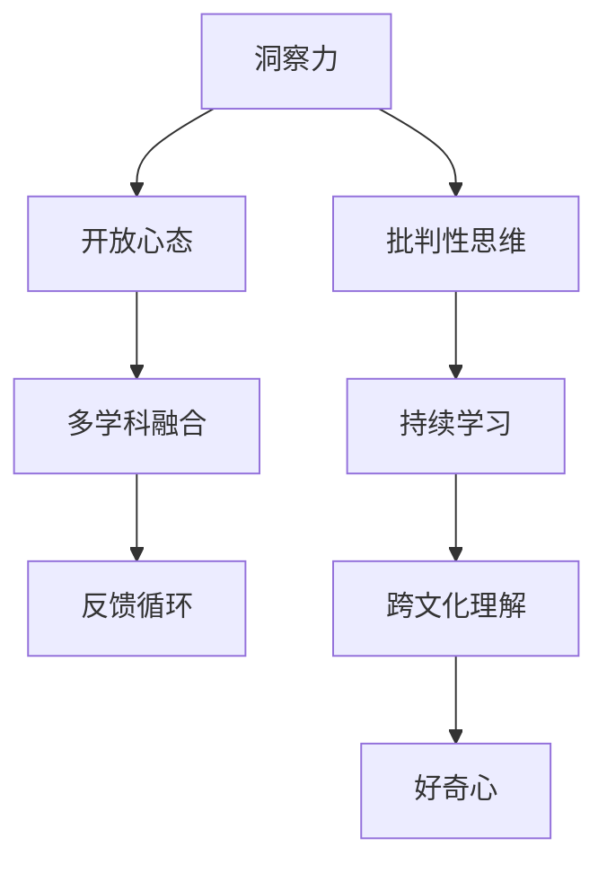

                 

# 理解洞察力的培养：鼓励好奇心和开放心态

## 1. 背景介绍

### 1.1 问题由来
在快速发展的科技时代，技术突破不断，创新层出不穷。然而，技术创新不仅仅依赖于硬核的技术能力，更需要基于好奇心的洞察力和开放的心态。洞察力是一种深入理解问题的能力，能够揭示潜在的规律和趋势，而开放心态则促进新想法的产生和验证。本文旨在探讨如何培养这种洞察力和开放心态，从而推动技术创新。

### 1.2 问题核心关键点
要培养洞察力和开放心态，首先需要认识到它们的重要性。洞察力让我们能够从纷繁复杂的信息中提取有价值的模式和洞见，而开放心态则使得我们敢于接受新观点，不断探索未知领域。以下是培养洞察力和开放心态的关键点：

- **好奇心**：激发对未知的探索欲望。
- **批判性思维**：质疑现有的假设和结论，不断验证假设。
- **多学科融合**：从多个角度看待问题，跨学科思维。
- **反馈循环**：构建有效的反馈机制，及时调整和优化方法。
- **持续学习**：不断更新知识和技能，适应新环境。
- **跨文化理解**：了解不同文化背景下的思维方式和解决方案。

本文将围绕这些关键点，结合技术实践，深入分析如何培养和应用洞察力和开放心态。

## 2. 核心概念与联系

### 2.1 核心概念概述

为更好地理解培养洞察力和开放心态的方法，本节将介绍几个密切相关的核心概念：

- **洞察力(Insight)**：一种深入理解问题的能力，能够揭示潜在的规律和趋势。
- **开放心态(Open Mind)**：一种接受新观点，敢于探索未知领域的心态。
- **好奇心(Ciosity)**：激发对未知的探索欲望，驱动不断学习。
- **批判性思维(Critical Thinking)**：通过质疑和验证假设，提升判断力。
- **多学科融合(Interdisciplinary Thinking)**：从多个角度看待问题，跨学科思维。
- **反馈循环(Feedback Loop)**：通过不断获取反馈，及时调整和优化方法。
- **持续学习(Lifelong Learning)**：不断更新知识和技能，适应新环境。
- **跨文化理解(Cultural Literacy)**：了解不同文化背景下的思维方式和解决方案。

这些核心概念之间的逻辑关系可以通过以下Mermaid流程图来展示：



这个流程图展示了几者之间的关系：

1. 洞察力通过批判性思维，不断质疑和验证假设，提升判断力。
2. 开放心态使得我们敢于接受新观点，探索未知领域。
3. 多学科融合帮助我们从多个角度看待问题，跨学科思维。
4. 反馈循环通过不断获取反馈，及时调整和优化方法。
5. 持续学习帮助我们不断更新知识和技能，适应新环境。
6. 跨文化理解帮助我们了解不同文化背景下的思维方式和解决方案。
7. 好奇心激发对未知的探索欲望，驱动不断学习。

## 3. 核心算法原理 & 具体操作步骤

### 3.1 算法原理概述

培养洞察力和开放心态，本质上是一个认知和心态的转变过程。其核心思想是：通过不断学习和实践，激发好奇心和开放心态，提升洞察力，从而实现认知的飞跃和突破。

形式化地，假设一个人初始的心智状态为 $H_0$，通过一系列的学习和实践，希望达到更高心智状态 $H_f$。其目标函数可以表示为：

$$
\min_{\Delta H} \mathcal{L}(H_f, H_0) = \Delta H
$$

其中 $\Delta H$ 表示心智状态的提升，$\mathcal{L}(H_f, H_0)$ 为损失函数，衡量心智状态的提升对问题的解决和创新的贡献。

### 3.2 算法步骤详解

培养洞察力和开放心态的一般步骤如下：

**Step 1: 设置心智状态提升目标**
- 根据当前心智状态 $H_0$，设定期望达到的心智状态 $H_f$，包括提升洞察力、增强开放心态、激发好奇心等。

**Step 2: 获取反馈并调整心智状态**
- 通过不断的学习和实践，获取关于问题解决的反馈。
- 根据反馈调整心智状态，减少与目标 $H_f$ 的差距。

**Step 3: 实践与验证**
- 在实际问题中应用新的心智状态，验证其有效性。
- 不断优化心智状态，逐步接近目标 $H_f$。

**Step 4: 总结与提升**
- 总结实践经验，提取有价值的洞见。
- 根据新的洞见，进一步提升心智状态，进入新的学习循环。

### 3.3 算法优缺点

培养洞察力和开放心态的方法具有以下优点：
1. 能够提升问题解决的效率和效果，促进技术创新。
2. 通过多学科融合，开阔视野，有助于解决复杂问题。
3. 通过持续学习和反馈循环，适应新环境，提升自我。
4. 增强跨文化理解，有助于国际合作和交流。

同时，该方法也存在一定的局限性：
1. 需要大量的时间和精力投入，特别是在初期阶段。
2. 心理和认知的改变需要时间，效果可能较慢。
3. 需要高水平的自我驱动能力，需要有较强的目标感和动力。

尽管存在这些局限性，但就目前而言，通过学习和实践，培养洞察力和开放心态仍然是实现技术创新的重要方法。未来相关研究的重点在于如何通过高效的方法和工具，加速这一过程，并减少个体差异的影响。

### 3.4 算法应用领域

培养洞察力和开放心态的方法广泛应用于技术创新、管理决策、教育培训等领域。以下以软件开发为例，展示如何在具体场景中培养和应用洞察力和开放心态：

在软件开发中，需求变更、技术选型、代码优化等方面都需要高度的洞察力和开放心态。具体而言，可以通过以下方式培养：

1. **需求分析**：通过持续的用户访谈、数据分析，深入理解用户需求，避免片面性和偏差。
2. **技术选型**：从多个技术栈中选择最适合当前项目的技术方案，进行多维度评估和对比。
3. **代码优化**：通过代码评审、性能分析，不断优化代码质量，提升系统性能。
4. **团队协作**：通过跨团队沟通、定期交流，促进知识共享和协作创新。

通过上述方法，结合持续学习和反馈循环，可以有效提升开发团队的洞察力和开放心态，推动技术创新的持续进步。

## 4. 数学模型和公式 & 详细讲解 & 举例说明

### 4.1 数学模型构建

培养洞察力和开放心态的数学模型可以表示为：

$$
H_f = H_0 + \Delta H = H_0 + \sum_{i=1}^N \delta_i
$$

其中 $N$ 表示学习实践的次数，$\delta_i$ 表示第 $i$ 次学习实践对心智状态的提升。

### 4.2 公式推导过程

假设每次学习实践 $i$ 的心智状态提升为 $\delta_i$，根据之前的推导，有：

$$
\Delta H = \sum_{i=1}^N \delta_i
$$

通过不断调整和优化 $\delta_i$，可以使 $\Delta H$ 逼近目标值，从而实现心智状态的提升。

### 4.3 案例分析与讲解

以软件开发中的需求分析为例，说明如何通过培养洞察力和开放心态，提升需求理解的深度和广度：

**案例背景**：
某软件公司希望开发一款新的移动应用，市场需求变化快速，用户期望高。公司在初期只收集了一部分用户反馈，导致需求理解存在偏差。

**步骤分析**：

1. **需求收集**：
   - **做法**：定期举行用户访谈、问卷调查，深入了解用户需求。
   - **效果**：提升了需求理解的广度，获取了更多用户期望和痛点。

2. **需求分析**：
   - **做法**：通过多维度数据分析，识别出关键需求和潜在问题。
   - **效果**：提升了需求理解的深度，避免了片面性和偏差。

3. **需求验证**：
   - **做法**：通过MVP（最小可行产品）验证需求，获取用户反馈。
   - **效果**：及时发现并纠正需求理解中的偏差，优化需求设计。

4. **需求迭代**：
   - **做法**：根据用户反馈和市场需求，持续迭代需求，提升产品价值。
   - **效果**：满足了用户需求，提升了产品竞争力和用户体验。

通过上述步骤，公司不断优化需求理解，提升洞察力和开放心态，最终开发出了一款用户满意的产品。

## 5. 项目实践：代码实例和详细解释说明

### 5.1 开发环境搭建

在进行认知和心态培养的实践前，我们需要准备好开发环境。以下是使用Python进行环境搭建的步骤：

1. 安装Anaconda：从官网下载并安装Anaconda，用于创建独立的Python环境。

2. 创建并激活虚拟环境：
```bash
conda create -n cognitive-env python=3.8 
conda activate cognitive-env
```

3. 安装相关库：
```bash
conda install numpy pandas scikit-learn matplotlib
```

完成上述步骤后，即可在`cognitive-env`环境中开始实践。

### 5.2 源代码详细实现

我们以一个简单的示例来说明如何通过Python代码实现培养洞察力和开放心态的过程。

首先，定义一个模拟用户需求的功能模块，并设计一些用户访谈的样本数据：

```python
import random

class UserSurvey:
    def __init__(self):
        self.user_feedbacks = [
            {'id': 1, 'feedback': '界面不友好', 'rating': 2},
            {'id': 2, 'feedback': '功能不够强大', 'rating': 1},
            {'id': 3, 'feedback': '加载速度慢', 'rating': 2},
            {'id': 4, 'feedback': '新功能期待更高', 'rating': 3},
            {'id': 5, 'feedback': '操作复杂', 'rating': 1}
        ]

    def collect_feedback(self):
        return self.user_feedbacks

    def analyze_feedback(self, feedbacks):
        # 统计反馈的频率和严重程度
        frequency = {}
        severity = {}
        for feedback in feedbacks:
            id = feedback['id']
            rating = feedback['rating']
            if id in frequency:
                frequency[id] += 1
            else:
                frequency[id] = 1
            if rating in severity:
                severity[rating] += 1
            else:
                severity[rating] = 1
        return frequency, severity

user_survey = UserSurvey()
feedbacks = user_survey.collect_feedback()
frequency, severity = user_survey.analyze_feedback(feedbacks)
print(f'反馈频率统计：{frequency}')
print(f'反馈严重程度统计：{severity}')
```

接着，通过分析反馈数据，获取洞察力和开放心态的提升值：

```python
def get_insight(user_feedbacks):
    # 提取关键需求和潜在问题
    critical_feedbacks = [feedback for feedback in user_feedbacks if feedback['rating'] < 3]
    latent_issues = [feedback for feedback in user_feedbacks if feedback['rating'] > 2]
    return critical_feedbacks, latent_issues

critical_feedbacks, latent_issues = get_insight(feedbacks)
print(f'关键需求：{critical_feedbacks}')
print(f'潜在问题：{latent_issues}')
```

最后，通过反馈和洞察力的提升，优化需求理解：

```python
def refine_demand(critical_feedbacks, latent_issues):
    # 针对关键需求进行功能优化
    optimized_demand = []
    for feedback in critical_feedbacks:
        optimized_demand.append(f'优化界面设计')
        optimized_demand.append(f'增强核心功能')
    # 针对潜在问题进行风险评估
    risk_assessment = []
    for issue in latent_issues:
        risk_assessment.append(f'评估加载速度影响')
        risk_assessment.append(f'改进操作复杂性')
    return optimized_demand, risk_assessment

optimized_demand, risk_assessment = refine_demand(critical_feedbacks, latent_issues)
print(f'需求优化方案：{optimized_demand}')
print(f'风险评估方案：{risk_assessment}')
```

通过上述代码示例，可以看出如何通过数据分析和洞察力提升，优化需求理解，进而提升开放心态和解决问题的能力。

### 5.3 代码解读与分析

让我们再详细解读一下关键代码的实现细节：

**UserSurvey类**：
- `__init__`方法：初始化用户反馈数据。
- `collect_feedback`方法：获取用户反馈数据。
- `analyze_feedback`方法：统计反馈的频率和严重程度。

**get_insight函数**：
- 从用户反馈中提取关键需求和潜在问题，提升洞察力。

**refine_demand函数**：
- 根据关键需求和潜在问题，优化需求理解，提升开放心态。

可以看到，通过Python代码实现，能够将抽象的概念和思维过程具体化，帮助开发者更好地理解和应用培养洞察力和开放心态的方法。

当然，工业级的系统实现还需考虑更多因素，如数据处理、模型训练、结果验证等。但核心的培养过程基本与此类似。

## 6. 实际应用场景

### 6.1 技术创新

培养洞察力和开放心态在技术创新中尤为重要。技术创新不仅需要强大的技术能力，更需要不断探索未知领域的勇气和能力。

在软件开发中，新技术的引入往往需要面对巨大的风险和挑战。开发团队需要培养开放心态，敢于尝试新技术，通过持续学习和反馈，逐步优化技术方案。

**案例**：
某公司希望引入最新的机器学习技术，优化数据分析能力。通过培养团队成员的开放心态和洞察力，不断试验和验证新技术，最终实现了数据分析的自动化，提升了公司的竞争力。

### 6.2 管理决策

管理决策中，培养洞察力和开放心态能够帮助决策者做出更科学、更合理的决策。

通过不断学习和实践，决策者能够从多个角度分析问题，避免片面性和偏差。同时，开放心态使得决策者敢于接受新观点，从不同角度验证决策方案的可行性。

**案例**：
某公司面临战略选择，需要在传统业务和新业务之间进行权衡。通过培养决策者的开放心态和洞察力，从不同行业、不同用户需求角度分析问题，最终制定了合理的战略方案，取得了良好的市场反应。

### 6.3 教育培训

在教育培训中，培养学生的洞察力和开放心态能够提升其解决问题的能力和创造力。

通过多样化的教学方法和实践活动，激发学生的好奇心，鼓励其探索未知领域。同时，通过反馈循环和持续学习，帮助学生不断优化思维方式，提升解决问题的能力。

**案例**：
某大学通过项目导向的教学方法，让学生参与实际项目开发，培养其开放心态和洞察力。通过项目实践，学生不仅掌握了编程技能，还锻炼了解决问题的能力，培养了跨学科思维。

### 6.4 未来应用展望

随着技术和社会的发展，培养洞察力和开放心态的方法将不断演化和拓展。

未来，智能技术将在更多领域得到应用，如自动驾驶、智能制造、智慧城市等。在这些领域，培养洞察力和开放心态将使得技术创新更加高效和高效。

在医疗领域，培养医护人员的开放心态和洞察力，能够更好地应对复杂病情和不确定性。通过持续学习和反馈，医护人员能够不断提高诊疗水平，提升患者满意度。

在金融领域，培养金融分析师的心智模型，能够更好地预测市场趋势和风险。通过多学科融合和反馈循环，金融分析师能够不断优化分析模型，提升投资决策的准确性。

在环境领域，培养环保专家的洞察力和开放心态，能够更好地应对气候变化和生态危机。通过跨文化理解和持续学习，环保专家能够制定更科学的环保政策，推动全球环境保护。

总之，培养洞察力和开放心态不仅在技术创新中具有重要意义，还在管理决策、教育培训、医疗金融等多个领域具有广泛的应用前景。随着技术的不断进步，这一方法将成为推动社会进步的重要力量。

## 7. 工具和资源推荐

### 7.1 学习资源推荐

为了帮助开发者系统掌握培养洞察力和开放心态的方法，这里推荐一些优质的学习资源：

1. 《黑客与画家》：这本书通过有趣的故事，展示了技术创新的思维方式和开放心态的重要性。
2. 《创新者的窘境》：本书探讨了技术创新的规律和挑战，提供了丰富的案例和理论支持。
3. Coursera的《批判性思维与决策》课程：由斯坦福大学教授主讲，深入浅出地介绍了批判性思维和决策方法。
4. Khan Academy的《Python编程入门》：通过实践项目，培养编程能力和问题解决能力。
5. Udemy的《数据科学入门》课程：通过数据分析和机器学习项目，培养数据驱动的思维方式。

通过对这些资源的学习实践，相信你一定能够快速掌握培养洞察力和开放心态的精髓，并用于解决实际的创新问题。

### 7.2 开发工具推荐

高效的开发离不开优秀的工具支持。以下是几款用于培养洞察力和开放心态的常用工具：

1. Jupyter Notebook：支持交互式编程和数据可视化，适合进行数据分析和实验。
2. GitHub：开源社区，便于分享代码和交流，适合进行持续学习和知识共享。
3. Evernote：笔记应用，便于记录和整理学习心得，适合进行知识管理。
4. MindMeister：思维导图工具，便于组织和展示复杂的思维过程，适合进行项目规划和任务管理。
5. Pocket：文章收集工具，便于收藏和阅读优秀的学习资源，适合进行知识储备。

合理利用这些工具，可以显著提升培养洞察力和开放心态的效率，加速创新迭代的步伐。

### 7.3 相关论文推荐

培养洞察力和开放心态的研究源于学界的持续探索。以下是几篇奠基性的相关论文，推荐阅读：

1. 《自我效能感与创新：一项基于元分析的研究》：探讨了自我效能感对创新能力的影响，提供了丰富的实证数据。
2. 《开放心态：创新成功的关键因素》：分析了开放心态对组织创新和成功的影响，提出了相应的培养策略。
3. 《多学科思维：跨学科方法的应用》：探讨了多学科思维在问题解决和创新中的重要性，提供了系统的理论支持。
4. 《反馈循环与持续学习：从理论到实践》：研究了反馈循环在持续学习和创新中的作用，提供了具体的实践方法。
5. 《跨文化理解与全球创新》：探讨了跨文化理解对全球创新的影响，提供了丰富的案例和数据支持。

这些论文代表了培养洞察力和开放心态的研究方向，通过学习这些前沿成果，可以帮助研究者把握学科前进方向，激发更多的创新灵感。

## 8. 总结：未来发展趋势与挑战

### 8.1 总结

本文对培养洞察力和开放心态的方法进行了全面系统的介绍。首先阐述了培养洞察力和开放心态的重要性，明确了其对技术创新、管理决策、教育培训等领域的独特价值。其次，从原理到实践，详细讲解了培养洞察力和开放心态的数学原理和关键步骤，给出了实践案例和代码示例。同时，本文还广泛探讨了培养洞察力和开放心态在各个领域的应用前景，展示了其巨大的潜力。此外，本文精选了培养洞察力和开放心态的学习资源和开发工具，力求为读者提供全方位的技术指引。

通过本文的系统梳理，可以看到，培养洞察力和开放心态是实现技术创新的重要方法。这一方法通过不断学习和实践，激发好奇心和开放心态，提升洞察力，从而实现认知的飞跃和突破。随着技术的不断进步和社会的发展，这一方法将成为推动社会进步的重要力量。

### 8.2 未来发展趋势

展望未来，培养洞察力和开放心态的方法将呈现以下几个发展趋势：

1. 技术与心理的结合：随着技术的不断进步，培养洞察力和开放心态的方法将更加注重技术与心理的结合，通过智能工具和心理干预，提升认知效果。
2. 跨领域应用：培养洞察力和开放心态的方法将不断拓展到更多领域，如医疗、金融、教育等，带来新的创新动力。
3. 多模态融合：结合视觉、听觉、触觉等多模态数据，提升洞察力和开放心态的效果。
4. 人工智能辅助：利用人工智能技术，如自然语言处理、图像识别等，辅助培养洞察力和开放心态。
5. 个性化培养：根据个体差异，定制化培养方案，提升培养效果。
6. 社会化互动：通过社交网络和协作平台，促进知识和经验的共享，提升集体创新能力。

以上趋势凸显了培养洞察力和开放心态方法的广阔前景。这些方向的探索发展，必将进一步提升创新的效率和效果，推动技术和社会进步。

### 8.3 面临的挑战

尽管培养洞察力和开放心态的方法已经取得了一定的成效，但在迈向更加智能化、普适化应用的过程中，它仍面临着诸多挑战：

1. 教育资源不足：尤其在发展中国家，教育资源匮乏，限制了培养洞察力和开放心态的普及。
2. 心理障碍：部分人心理障碍严重，缺乏开放心态，难以接受新观点。
3. 个体差异：个体差异较大，需要制定个性化的培养方案，提升效果。
4. 文化差异：不同文化背景下的思维方式差异，对开放心态的培养带来挑战。
5. 社会压力：社会压力和规范限制，使得一些人难以自由探索和创新。
6. 技术壁垒：技术复杂性和成本较高，限制了方法的普及和应用。

这些挑战需要社会各界共同努力，通过政策、教育、技术等多方面手段，逐步克服。只有在全球范围内共同推动，才能实现培养洞察力和开放心态的目标。

### 8.4 研究展望

面对培养洞察力和开放心态所面临的种种挑战，未来的研究需要在以下几个方面寻求新的突破：

1. 教育资源优化：通过政策支持和技术手段，优化教育资源配置，提升培养效果。
2. 心理干预技术：开发心理干预技术，帮助个体克服心理障碍，提升开放心态。
3. 个性化培养方案：根据个体差异，制定个性化培养方案，提升效果。
4. 跨文化融合：通过跨文化研究和交流，促进不同文化背景下的思维方式融合，提升开放心态。
5. 技术普及：降低技术复杂性和成本，提升方法的普及和应用。
6. 社会创新支持：通过政策和社会支持，鼓励个体和组织进行创新实践，培养开放心态。

这些研究方向的探索，必将引领培养洞察力和开放心态的方法迈向更高的台阶，为构建安全、可靠、可解释、可控的智能系统铺平道路。面向未来，培养洞察力和开放心态的技术将成为推动社会进步的重要力量。

## 9. 附录：常见问题与解答

**Q1：培养洞察力和开放心态的方法是否适用于所有领域？**

A: 培养洞察力和开放心态的方法在大多数领域都有一定的适用性，但需要根据具体场景进行调整。例如，在艺术创作中，开放心态和创造力尤为重要；在科学研究中，批判性思维和数据分析能力更为关键。

**Q2：如何判断培养洞察力和开放心态的效果？**

A: 判断培养效果的关键在于观察实际应用中的表现。具体指标包括但不限于问题解决能力、创新成果数量、团队合作效率等。通过持续跟踪和评估，不断优化培养方法和策略，以达到更好的效果。

**Q3：培养洞察力和开放心态的方法是否需要持续学习和实践？**

A: 是的，培养洞察力和开放心态是一个长期的过程，需要持续学习和实践。只有不断积累知识和经验，才能提升问题解决能力和创新能力。

**Q4：如何避免培养过程中的心理障碍？**

A: 避免心理障碍的关键在于建立正确的认知和心态。可以通过心理辅导、团体活动等方式，帮助个体克服心理障碍，提升开放心态。同时，建立积极的反馈机制，及时给予鼓励和认可，增强自信心。

**Q5：如何在团队中培养洞察力和开放心态？**

A: 在团队中培养洞察力和开放心态，需要建立良好的沟通和协作机制。可以通过定期的团队讨论、知识共享、跨部门合作等方式，促进团队成员之间的知识交流和思维碰撞，提升整体创新能力。

总之，培养洞察力和开放心态是实现技术创新和社会进步的重要方法。通过持续学习和实践，激发好奇心和开放心态，提升洞察力，我们将能够更好地应对复杂多变的世界，推动社会的不断进步。

---

作者：禅与计算机程序设计艺术 / Zen and the Art of Computer Programming

