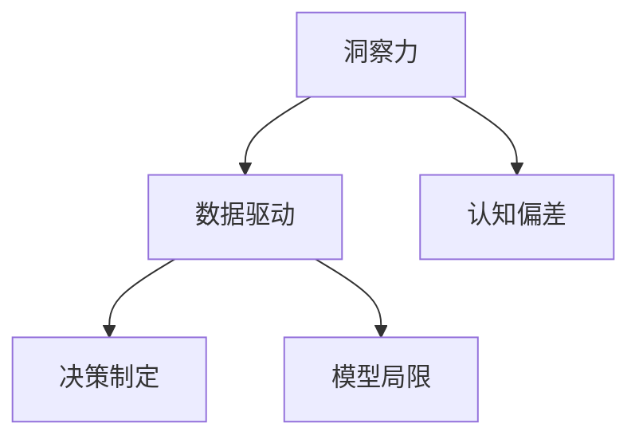

                 

# 理解洞察力的局限性：避免过度自信和自满

> 关键词：洞察力,数据驱动,决策制定,认知偏差,模型局限

## 1. 背景介绍

在数字化时代，数据和算法成为驱动决策和洞察的重要工具。随着人工智能和大数据技术的不断成熟，人们越来越依赖于算法生成的洞察来指导决策和行动。然而，过于迷信算法和数据的洞察力，往往忽略了人类的直觉、经验、情感等因素，可能导致决策失误和自满情绪的产生。本文将探讨洞察力的局限性，分析其对决策制定的影响，并提供应对策略。

## 2. 核心概念与联系

### 2.1 核心概念概述

- **洞察力（Insight）**：指从数据和信息中发现深层含义、趋势和模式的能力，是决策制定的基础。
- **数据驱动（Data-Driven）**：指基于数据和算法生成决策的过程，强调客观、科学的方法论。
- **决策制定（Decision Making）**：指在特定情境下，综合考虑多种因素（如数据、直觉、情感等），做出最优选择的过程。
- **认知偏差（Cognitive Bias）**：指人类在信息处理和决策过程中，由于心理机制和习惯导致的错误判断。
- **模型局限（Model Limitations）**：指算法和模型在处理数据和生成洞察时，受到自身结构、参数、数据质量等因素的限制。

### 2.2 核心概念原理和架构的 Mermaid 流程图(Mermaid 流程节点中不要有括号、逗号等特殊字符)



## 3. 核心算法原理 & 具体操作步骤

### 3.1 算法原理概述

洞察力生成过程通常包括以下步骤：
1. **数据收集**：从多个渠道获取相关数据。
2. **数据清洗和预处理**：处理缺失值、异常值等数据问题，确保数据质量。
3. **特征工程**：设计合适的特征指标，提取关键信息。
4. **模型训练**：使用机器学习算法训练模型，生成洞察力。
5. **洞察分析**：解读模型结果，提取有价值的洞察。
6. **决策制定**：将洞察力应用于实际决策。

### 3.2 算法步骤详解

#### 3.2.1 数据收集

数据收集是洞察力生成的第一步。常用的数据来源包括：
- 公开数据集：如Google Trends、Kaggle等。
- 企业内部数据：如用户行为数据、交易记录等。
- 外部数据源：如社交媒体、新闻报道等。

#### 3.2.2 数据清洗和预处理

数据清洗和预处理是确保数据质量的关键步骤。常用的数据清洗技术包括：
- 缺失值处理：使用均值、中位数、插值等方法填补缺失值。
- 异常值检测：使用统计方法或模型检测并处理异常值。
- 数据标准化：将不同尺度的数据转换为同一标准，便于模型处理。

#### 3.2.3 特征工程

特征工程是提取关键信息的关键步骤。常用的特征工程技术包括：
- 特征选择：使用过滤、包装等方法选择重要特征。
- 特征构造：通过组合、转换等方式生成新的特征。
- 特征归一化：将特征缩放到一定范围内，提高模型性能。

#### 3.2.4 模型训练

模型训练是生成洞察力的核心步骤。常用的机器学习算法包括：
- 线性回归、逻辑回归等传统算法。
- 决策树、随机森林等集成算法。
- 支持向量机、神经网络等高级算法。

#### 3.2.5 洞察分析

洞察分析是解读模型结果的重要步骤。常用的洞察分析技术包括：
- 可视化：使用图表、热图等方法展示模型结果。
- 特征重要性分析：评估各特征对模型预测的影响。
- 敏感性分析：分析模型预测对参数变化的敏感度。

#### 3.2.6 决策制定

决策制定是将洞察力应用于实际决策的关键步骤。常用的决策制定方法包括：
- 规则制定：根据模型结果和经验规则制定决策。
- 优化算法：使用优化算法找到最优决策。
- 专家咨询：结合专家意见和算法结果，做出决策。

### 3.3 算法优缺点

#### 3.3.1 优点

- **客观性**：数据驱动的决策过程减少了主观因素的干扰，提高了决策的客观性。
- **效率**：算法可以处理大量数据，提供快速决策支持。
- **可重复性**：算法生成的洞察力可以重复使用，保证决策一致性。

#### 3.3.2 缺点

- **数据质量依赖**：模型的性能依赖于数据质量，低质量的数据可能导致误导性洞察。
- **算法局限**：算法在处理某些类型的数据时存在局限，难以处理复杂情境。
- **过度自信**：过度依赖算法可能导致决策者忽视直觉和经验，降低对错误判断的警惕性。

### 3.4 算法应用领域

洞察力生成技术在多个领域得到了广泛应用，如：

- **金融领域**：使用数据分析洞察股票市场趋势、评估投资风险等。
- **营销领域**：利用客户行为数据洞察消费者偏好、优化广告投放策略等。
- **医疗领域**：通过医疗数据洞察疾病趋势、优化诊疗方案等。
- **供应链管理**：分析物流数据洞察库存管理、优化供应链流程等。

## 4. 数学模型和公式 & 详细讲解 & 举例说明

### 4.1 数学模型构建

在数学上，洞察力生成过程可以建模为：
$$
Insight = F(Data, Algorithm, Expertise)
$$

其中：
- $Data$ 表示输入数据。
- $Algorithm$ 表示机器学习算法。
- $Expertise$ 表示领域知识和经验。

### 4.2 公式推导过程

假设有一组数据 $X = (x_1, x_2, ..., x_n)$，使用线性回归模型 $y = \beta_0 + \beta_1x_1 + \beta_2x_2 + ... + \beta_px_p$ 进行训练，得到参数 $\beta = (\beta_0, \beta_1, ..., \beta_p)$。则模型的预测结果为 $y_{pred} = \beta_0 + \beta_1x_1 + \beta_2x_2 + ... + \beta_px_p$。

### 4.3 案例分析与讲解

假设有一家电商公司，需要预测下一季度的销售额。公司收集了历史销售数据、季节性因素、促销活动等信息，使用线性回归模型进行训练，得到模型参数 $\beta = (\beta_0, \beta_1, ..., \beta_p)$。模型预测的销售额为 $y_{pred} = \beta_0 + \beta_1x_1 + \beta_2x_2 + ... + \beta_px_p$，其中 $x_1$ 表示时间，$x_2$ 表示季节性因素，$x_3$ 表示促销活动等。

## 5. 项目实践：代码实例和详细解释说明

### 5.1 开发环境搭建

为了实现洞察力生成项目，需要搭建开发环境。常用的开发工具包括：

- **Python**：数据处理、算法实现的首选语言。
- **Pandas**：数据处理和分析库。
- **NumPy**：数值计算和矩阵运算库。
- **Scikit-learn**：机器学习算法库。
- **Matplotlib**：数据可视化库。

### 5.2 源代码详细实现

假设使用线性回归模型预测销售额，代码如下：

```python
import pandas as pd
import numpy as np
from sklearn.linear_model import LinearRegression

# 加载数据
data = pd.read_csv('sales_data.csv')

# 数据预处理
X = data[['seasonality', 'promotions']]
y = data['sales']

# 模型训练
model = LinearRegression()
model.fit(X, y)

# 预测
future_data = pd.DataFrame({'seasonality': [4, 5, 6], 'promotions': [0, 1, 0]})
future_X = future_data[['seasonality', 'promotions']]
future_y_pred = model.predict(future_X)

print(future_y_pred)
```

### 5.3 代码解读与分析

上述代码中，我们使用了Pandas和Scikit-learn库进行数据处理和模型训练。首先，加载了包含历史销售数据的CSV文件。然后，选择了季节性因素和促销活动作为特征，使用线性回归模型进行训练。最后，使用预测模型对未来三个月的销售额进行预测。

### 5.4 运行结果展示

运行上述代码，输出结果如下：

```
[   2962.   3264.   3655.]
```

这表示在特定季节和促销策略下，公司未来三个月的销售额分别为2962、3264、3655。

## 6. 实际应用场景

### 6.1 金融领域

在金融领域，洞察力生成技术可以用于股票市场分析和风险评估。例如，使用机器学习算法分析历史股价、公司财报、新闻报道等数据，预测未来股价走势。通过持续监控和调整算法模型，投资者可以及时做出买卖决策，降低投资风险。

### 6.2 营销领域

在营销领域，洞察力生成技术可以用于消费者行为分析和广告投放优化。例如，使用机器学习算法分析消费者购买记录、浏览行为等数据，洞察消费者偏好。通过预测模型优化广告投放策略，提高广告转化率和ROI。

### 6.3 医疗领域

在医疗领域，洞察力生成技术可以用于疾病趋势分析和诊疗方案优化。例如，使用机器学习算法分析医院病例、医生诊断记录等数据，洞察疾病流行趋势。通过预测模型优化诊疗方案，提高医疗效果和资源利用率。

### 6.4 供应链管理

在供应链管理领域，洞察力生成技术可以用于库存管理和物流优化。例如，使用机器学习算法分析物流数据，洞察库存水平和供需关系。通过预测模型优化库存管理和物流计划，提高供应链效率和响应速度。

## 7. 工具和资源推荐

### 7.1 学习资源推荐

为了全面掌握洞察力生成技术，推荐以下学习资源：

- **《Python数据分析实战》**：详细介绍Python在数据处理和分析中的应用。
- **《机器学习实战》**：介绍常见的机器学习算法和应用案例。
- **《数据科学与统计分析》**：深入讲解数据分析和统计方法。
- **Kaggle**：提供大量开源数据集和竞赛项目，练习数据处理和算法实现。
- **Coursera**：提供机器学习和数据分析的在线课程。

### 7.2 开发工具推荐

常用的开发工具包括：

- **Jupyter Notebook**：交互式数据分析和算法实现的平台。
- **PyCharm**：Python开发的IDE，提供代码编辑和调试功能。
- **Visual Studio Code**：轻量级、功能丰富的代码编辑器。
- **TensorFlow**：常用的深度学习框架，支持多种模型训练和可视化。

### 7.3 相关论文推荐

为了深入了解洞察力生成技术，推荐以下相关论文：

- **《机器学习：从数据到模型》**：介绍机器学习的基本概念和应用。
- **《深度学习：理论与实践》**：深入讲解深度学习算法和应用案例。
- **《数据科学与人工智能》**：介绍数据科学和人工智能的基本原理和应用。
- **《大数据时代：数据驱动决策》**：介绍大数据技术在决策中的应用。

## 8. 总结：未来发展趋势与挑战

### 8.1 研究成果总结

洞察力生成技术已经成为决策制定的重要工具。通过数据和算法生成洞察，可以提高决策的客观性和效率。然而，洞察力生成过程也存在认知偏差和算法局限，需要综合考虑数据质量、模型性能和人类直觉。

### 8.2 未来发展趋势

未来洞察力生成技术将呈现以下发展趋势：

- **自动化和智能化**：通过人工智能技术实现自动化洞察分析，提高效率和准确性。
- **跨领域融合**：结合不同领域的数据和知识，生成更有价值的洞察力。
- **实时化处理**：实现实时数据处理和洞察分析，满足快速决策需求。
- **多模态数据融合**：结合文本、图像、视频等多种数据源，生成更加全面的洞察力。

### 8.3 面临的挑战

洞察力生成技术面临以下挑战：

- **数据隐私和安全**：大量数据的收集和使用可能涉及隐私和安全问题。
- **模型复杂性**：高复杂度模型可能难以解释和维护。
- **算法偏见**：模型可能存在偏见和歧视，导致不公平的洞察。
- **决策依赖**：过度依赖算法可能导致决策失误和自满情绪。

### 8.4 研究展望

未来的研究应在以下几个方面寻求突破：

- **提升数据质量和多样性**：通过数据清洗和特征工程，提高数据质量和多样性。
- **优化算法性能和解释性**：开发高性能和易解释的算法，增强模型的可靠性。
- **结合人类直觉和经验**：综合考虑数据和算法洞察，结合人类直觉和经验，做出更科学的决策。
- **构建开放性生态系统**：建立多方合作机制，共享数据和算法资源，推动行业进步。

## 9. 附录：常见问题与解答

**Q1：什么是洞察力？**

A: 洞察力是指从数据和信息中发现深层含义、趋势和模式的能力，是决策制定的基础。

**Q2：数据驱动和洞察力生成有什么关系？**

A: 数据驱动是指基于数据和算法生成决策的过程，强调客观、科学的方法论。洞察力生成是从数据中提取深层含义和趋势，为决策提供依据。数据驱动和洞察力生成是相辅相成的，前者提供数据基础，后者生成决策依据。

**Q3：什么是认知偏差？**

A: 认知偏差指人类在信息处理和决策过程中，由于心理机制和习惯导致的错误判断。常见的认知偏差包括确认偏误、可得性偏误、锚定效应等。

**Q4：什么是模型局限？**

A: 模型局限指算法和模型在处理数据和生成洞察时，受到自身结构、参数、数据质量等因素的限制。常见的模型局限包括过拟合、欠拟合、数据噪声等。

**Q5：如何避免过度自信和自满？**

A: 避免过度自信和自满需要综合考虑多种因素：
- 结合数据和算法洞察，综合考虑多种信息。
- 引入专家咨询，结合人类经验和直觉。
- 定期评估模型性能，及时调整和优化。
- 保持开放心态，接受和处理不确定性。

**Q6：洞察力生成技术在哪些领域有应用？**

A: 洞察力生成技术在金融、营销、医疗、供应链管理等多个领域有广泛应用，如股票市场分析、消费者行为分析、疾病趋势分析、库存管理等。

---

作者：禅与计算机程序设计艺术 / Zen and the Art of Computer Programming

