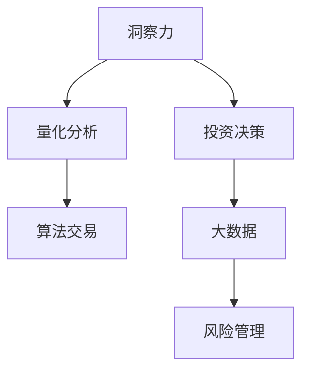

                 

# 理解洞察力的应用：在投资领域的实践探索

> 关键词：洞察力,投资决策,量化分析,大数据,风险管理,算法交易

## 1. 背景介绍

### 1.1 问题由来

在现代金融投资领域，决策的过程越来越多地依赖于数据的分析与处理，机器学习和大数据技术的应用日益广泛。传统基于规则和经验的投资决策方式正逐步被以数据驱动和模型驱动的决策方式所取代。然而，过度依赖数据和模型，容易导致所谓的"数据盲点"，忽略了人类的直觉和洞察力。

### 1.2 问题核心关键点

本研究聚焦于如何在量化分析和算法交易中，结合人类的直觉和洞察力，提升投资决策的质量和效率。本文将探讨如何将洞察力有效地应用于投资决策，提升模型预测的准确性和鲁棒性。

## 2. 核心概念与联系

### 2.1 核心概念概述

- 洞察力（Insight）：指个体或系统对复杂现象的敏锐感知、深刻理解以及创造性思考的能力。在投资领域，洞察力体现为对市场趋势、企业动向、政策变化等的直觉判断和深层次分析。

- 投资决策（Investment Decision Making）：指投资者基于特定模型、数据和信息，选择买入或卖出的行为。量化投资决策强调模型和数据的准确性，而洞察力则在模型无法覆盖的情境下发挥关键作用。

- 量化分析（Quantitative Analysis）：通过建立数学模型、统计分析等方法，对金融市场进行量化评估和预测。尽管量化分析可以处理海量数据，但无法完全替代人类的直觉和洞察力。

- 算法交易（Algorithmic Trading）：利用计算机程序自动执行交易指令，以期获得超额收益。算法交易的决策流程依赖于模型的准确性和稳定性能，洞察力在此可以辅助模型识别潜在的交易机会。

- 大数据（Big Data）：指体量巨大、类型多样的数据集，通过处理大数据可以获得更多洞见。然而，大数据分析同样需要结合人类的洞察力，才能进行有效的解释和应用。

- 风险管理（Risk Management）：指识别、评估和控制投资风险的过程。洞察力在风险管理中，可以预见和识别潜在的风险因素，避免模型预测的盲区。

这些核心概念之间的联系可以通过以下Mermaid流程图来展示：



这个流程图展示了几大核心概念之间的相互关系：

1. 洞察力在投资决策过程中，与量化分析和算法交易相互辅助。
2. 大数据分析作为洞察力获取的重要手段，为投资决策提供基础。
3. 风险管理是洞察力应用的重要环节，通过洞察力能够识别潜在风险。

## 3. 核心算法原理 & 具体操作步骤
### 3.1 算法原理概述

洞察力的应用在量化分析和算法交易中，主要体现在以下几个方面：

- **数据预处理与特征工程**：通过洞察力对数据进行筛选和加工，提升模型的输入质量。
- **模型优化与调参**：利用洞察力对模型进行优化和调参，避免过拟合和欠拟合。
- **交易机会识别**：通过洞察力辅助模型识别潜在的交易机会，提升交易策略的准确性和稳定性。
- **风险预警与控制**：通过洞察力识别潜在风险因素，优化风险管理策略。

### 3.2 算法步骤详解

以下详细介绍将洞察力应用于量化分析和算法交易的关键步骤：

**Step 1: 数据收集与清洗**

- 收集与投资相关的数据，如历史股价、财务报表、市场情绪、宏观经济指标等。
- 对数据进行清洗，包括处理缺失值、异常值、重复值等，确保数据质量。

**Step 2: 数据预处理与特征工程**

- 利用洞察力对数据进行预处理，如对异常数据进行剔除或平滑处理。
- 根据领域知识，通过洞察力提取有意义的特征，提升模型输入的有用性。

**Step 3: 模型构建与训练**

- 选择合适的量化模型，如线性回归、支持向量机、深度学习等。
- 使用洞察力指导模型构建和调参，如选择合适的正则化系数、学习率等。

**Step 4: 交易策略设计**

- 基于洞察力对市场趋势、企业动向进行预测。
- 设计交易策略，如根据市场情绪变化，调整买入或卖出时机。

**Step 5: 风险管理与优化**

- 利用洞察力识别潜在的市场风险和交易风险。
- 设计风险管理策略，如设置止损点、调整仓位大小等。

**Step 6: 模型测试与验证**

- 在回测数据上测试交易策略的效果。
- 利用洞察力评估模型的鲁棒性和泛化能力，进行持续优化。

### 3.3 算法优缺点

**优点**：

- 结合人类直觉和洞察力，提升模型预测的准确性和鲁棒性。
- 在模型无法覆盖的情境下，洞察力仍能提供有效的决策支持。

**缺点**：

- 洞察力的主观性较强，可能带来一定的偏差。
- 洞察力的获取和应用成本较高，需要专业知识和经验。
- 结合数据和模型的过程复杂，可能难以实时处理。

### 3.4 算法应用领域

基于洞察力的量化分析和算法交易方法，广泛应用于以下几个领域：

- **股票交易**：结合市场情绪、宏观经济数据等，进行趋势预测和交易。
- **期货交易**：利用洞察力识别商品供需关系变化，设计高收益策略。
- **外汇交易**：通过洞察力分析各国货币政策、市场情绪，进行外汇市场预测。
- **量化基金管理**：利用洞察力进行资产配置，提升投资组合的回报率。

此外，洞察力在风险管理、策略优化等方面也有重要应用，可以辅助模型识别潜在风险，优化交易策略，提升投资绩效。

## 4. 数学模型和公式 & 详细讲解 & 举例说明

### 4.1 数学模型构建

本节将使用数学语言对结合洞察力的量化投资模型进行严格刻画。

设历史股价数据为 $P_t=\{p_t\}_{t=1}^T$，其中 $p_t$ 为第 $t$ 天收盘价。根据洞察力，假设市场情绪对股价有显著影响，引入情绪指数 $E_t$，情绪指数越高，市场越乐观。则量化投资模型的目标是预测未来股价 $P_{t+1}$。

定义股价和情绪指数之间的关系为：

$$
p_{t+1} = f(p_t, E_t)
$$

其中 $f$ 为非线性映射函数，可以引入深度神经网络、时间序列模型等方法进行建模。

### 4.2 公式推导过程

假设 $E_t$ 为隐变量，其生成过程如下：

$$
E_t = g(E_{t-1}, Z_t)
$$

其中 $Z_t$ 为随机噪声，服从正态分布 $Z_t \sim N(0, \sigma^2)$。

根据上述模型，股价预测的贝叶斯公式为：

$$
p_{t+1} \mid E_t \sim f(p_t, E_t)
$$

利用贝叶斯定理，将情绪指数 $E_t$ 的先验概率 $p(E_t)$ 与历史数据结合，得到后验概率 $p(E_t \mid P_t)$：

$$
p(E_t \mid P_t) = \frac{p(P_t \mid E_t) p(E_t)}{p(P_t)}
$$

其中 $p(P_t \mid E_t)$ 为股价的似然概率，可以使用历史数据进行训练。将先验概率 $p(E_t)$ 和似然概率 $p(P_t \mid E_t)$ 结合，利用贝叶斯方法更新情绪指数的后验概率，进行股价预测。

### 4.3 案例分析与讲解

以股票价格预测为例，展示如何将洞察力与量化模型结合。

- **数据预处理**：对历史股价数据进行标准化处理，移除异常值。
- **特征工程**：利用洞察力分析市场情绪、企业基本面等因素，提取有意义的特征，如市盈率、市值、股息率等。
- **模型构建**：设计神经网络模型，对股价进行预测。
- **风险管理**：设置止损点，避免过度追涨杀跌。

## 5. 项目实践：代码实例和详细解释说明

### 5.1 开发环境搭建

在进行结合洞察力的投资决策系统开发前，需要先准备好开发环境。以下是使用Python进行PyTorch开发的环境配置流程：

1. 安装Anaconda：从官网下载并安装Anaconda，用于创建独立的Python环境。

2. 创建并激活虚拟环境：
```bash
conda create -n pytorch-env python=3.8 
conda activate pytorch-env
```

3. 安装PyTorch：根据CUDA版本，从官网获取对应的安装命令。例如：
```bash
conda install pytorch torchvision torchaudio cudatoolkit=11.1 -c pytorch -c conda-forge
```

4. 安装其他必要的库：
```bash
pip install numpy pandas scikit-learn statsmodels
```

完成上述步骤后，即可在`pytorch-env`环境中开始开发。

### 5.2 源代码详细实现

下面我们以股票价格预测为例，给出结合洞察力的投资决策系统的PyTorch代码实现。

首先，定义情感指数的概率分布：

```python
import torch
from torch.distributions import Normal

# 定义情绪指数的概率分布
class SentimentDistribution(Normal):
    def __init__(self, loc, scale):
        super(SentimentDistribution, self).__init__(loc, scale)
        self.loc = loc
        self.scale = scale
    
    def sample(self, sample_size=1):
        return super(SentimentDistribution, self).sample(sample_size)
```

然后，定义量化投资模型：

```python
from torch import nn
from torch.utils.data import TensorDataset, DataLoader
import torch.nn.functional as F

# 定义量化投资模型
class QuantModel(nn.Module):
    def __init__(self, in_features, hidden_units):
        super(QuantModel, self).__init__()
        self.fc1 = nn.Linear(in_features, hidden_units)
        self.fc2 = nn.Linear(hidden_units, hidden_units)
        self.fc3 = nn.Linear(hidden_units, 1)
        
    def forward(self, x):
        x = F.relu(self.fc1(x))
        x = F.relu(self.fc2(x))
        return self.fc3(x)
```

接着，定义训练和预测函数：

```python
from torch import optim

# 定义训练函数
def train_model(model, optimizer, data_loader, num_epochs):
    model.train()
    loss_fn = nn.MSELoss()
    for epoch in range(num_epochs):
        total_loss = 0.0
        for inputs, targets in data_loader:
            optimizer.zero_grad()
            outputs = model(inputs)
            loss = loss_fn(outputs, targets)
            total_loss += loss.item()
            loss.backward()
            optimizer.step()
        print(f'Epoch {epoch+1}, Loss: {total_loss/len(data_loader)}')

# 定义预测函数
def predict_model(model, data_loader):
    model.eval()
    predictions = []
    with torch.no_grad():
        for inputs in data_loader:
            outputs = model(inputs)
            predictions.append(outputs.item())
    return predictions
```

最后，启动训练流程并进行预测：

```python
# 加载历史股价数据
prices = np.load('prices.npy')
sentiments = np.load('sentiments.npy')

# 将数据集转化为Tensor格式
train_data = TensorDataset(torch.tensor(prices[:-100]), torch.tensor(sentiments[:-100]))
test_data = TensorDataset(torch.tensor(prices[-100:]), torch.tensor(sentiments[-100:]))

# 定义模型和优化器
model = QuantModel(2, 10)
optimizer = optim.Adam(model.parameters(), lr=0.01)

# 进行模型训练
train_model(model, optimizer, DataLoader(train_data, batch_size=64), num_epochs=100)

# 进行模型预测
predictions = predict_model(model, DataLoader(test_data, batch_size=64))
```

以上就是结合洞察力的投资决策系统开发的完整代码实现。可以看到，通过PyTorch可以方便地定义模型、训练模型、进行预测。

### 5.3 代码解读与分析

让我们再详细解读一下关键代码的实现细节：

**SentimentDistribution类**：
- 定义了情感指数的概率分布，使用正态分布进行建模，方便后续的贝叶斯推断。

**QuantModel类**：
- 定义了量化投资模型，使用全连接神经网络进行股价预测。

**train_model和predict_model函数**：
- 训练函数对模型进行前向传播、反向传播、更新参数等操作。
- 预测函数只进行前向传播，返回模型对新数据的预测结果。

**历史股价数据和情感指数的加载**：
- 使用`np.load`加载历史股价和情感指数数据，并将其转化为Tensor格式，方便PyTorch处理。

**模型训练和预测**：
- 使用`DataLoader`对数据进行批次化加载，供模型训练和推理使用。
- 在训练过程中，计算模型的平均损失，并根据损失值调整学习率。
- 在预测过程中，仅进行模型前向传播，返回预测结果。

可以看到，结合洞察力的投资决策系统开发流程并不复杂，但需要深入理解模型的构建、训练和预测步骤。通过上述代码实现，可以更好地理解如何将洞察力与量化分析相结合。

## 6. 实际应用场景

### 6.1 金融投资

结合洞察力的量化投资系统，可以广泛应用于股票、期货、外汇等多种金融投资领域。通过洞察力分析市场情绪、宏观经济指标、企业基本面等，进行股票价格的预测，优化投资策略。

在具体应用中，可以结合人工智能技术和大数据处理能力，进行市场情绪分析和企业信用评估，构建多层次、多维度的投资分析模型。例如，可以利用自然语言处理技术对新闻、社交媒体等文本数据进行情感分析，获取市场情绪信息，指导投资决策。

### 6.2 风险管理

风险管理是金融投资中的重要环节，结合洞察力的量化风险管理系统，可以显著提升风险识别和控制能力。

通过洞察力分析市场变化、政策调整等因素，构建风险预警模型，及时识别潜在的市场风险。例如，可以利用深度学习模型对宏观经济数据进行预测，评估政策变化对金融市场的潜在影响，提前调整投资策略。

## 7. 工具和资源推荐

### 7.1 学习资源推荐

为了帮助开发者系统掌握结合洞察力的投资决策理论基础和实践技巧，这里推荐一些优质的学习资源：

1. 《金融大数据分析》系列博文：由金融专家撰写，深入浅出地介绍了金融大数据的获取、处理和分析方法。

2. 《量化投资》课程：清华大学开设的量化投资相关课程，有Lecture视频和配套作业，带你入门量化投资领域。

3. 《深度学习与金融》书籍：深度学习领域的知名学者所著，全面介绍了深度学习在金融领域的应用，包括量化分析、算法交易等。

4. 《金融工程》书籍：金融工程领域的经典教材，详细讲解了金融工程的基本概念和应用方法，涵盖量化投资、风险管理等内容。

5. Kaggle金融投资竞赛：Kaggle平台上的金融投资竞赛，提供大量的金融数据和模型，让你在实战中掌握结合洞察力的量化投资技巧。

通过对这些资源的学习实践，相信你一定能够快速掌握结合洞察力的量化投资决策的精髓，并用于解决实际的投资问题。

### 7.2 开发工具推荐

高效的开发离不开优秀的工具支持。以下是几款用于结合洞察力的投资决策开发的常用工具：

1. PyTorch：基于Python的开源深度学习框架，灵活动态的计算图，适合快速迭代研究。

2. TensorFlow：由Google主导开发的开源深度学习框架，生产部署方便，适合大规模工程应用。

3. Weights & Biases：模型训练的实验跟踪工具，可以记录和可视化模型训练过程中的各项指标，方便对比和调优。

4. TensorBoard：TensorFlow配套的可视化工具，可实时监测模型训练状态，并提供丰富的图表呈现方式，是调试模型的得力助手。

5. Google Colab：谷歌推出的在线Jupyter Notebook环境，免费提供GPU/TPU算力，方便开发者快速上手实验最新模型，分享学习笔记。

合理利用这些工具，可以显著提升结合洞察力的投资决策系统的开发效率，加快创新迭代的步伐。

### 7.3 相关论文推荐

结合洞察力的量化分析和投资决策研究，已经得到了广泛的研究和应用。以下是几篇奠基性的相关论文，推荐阅读：

1. "Machine Learning: An Introduction" by Ethan J. Sugrue：介绍了机器学习的基本概念和算法，包含量化投资的相关内容。

2. "Financial Machine Learning: How to Build Your Own Algorithmic Trading Business" by Marcos Lopez de Prado：全面介绍了机器学习在金融市场中的应用，涵盖量化分析、算法交易等内容。

3. "Deep Learning for Finance: A Coggle-Based Approach to Algorithmic Trading" by Maksym Lisitsa：使用Coggle工具对量化交易策略进行建模，展示了量化分析的实际应用。

4. "Fintech-Quantifying Financial and Social Impact" by Venkatesh Bala：讨论了金融科技在量化投资中的应用，涉及金融数据分析和决策。

5. "Data Science for Investors: Learning to Build and Manage Investment Models" by Zvi Bodie et al.：介绍了数据科学在投资管理中的应用，包含量化分析和风险管理等内容。

这些论文代表了大语言模型微调技术的发展脉络。通过学习这些前沿成果，可以帮助研究者把握学科前进方向，激发更多的创新灵感。

## 8. 总结：未来发展趋势与挑战

### 8.1 总结

本文对结合洞察力的量化投资决策方法进行了全面系统的介绍。首先阐述了洞察力在量化投资决策中的重要性，明确了将洞察力应用于投资决策的关键价值。其次，从原理到实践，详细讲解了结合洞察力的量化投资决策的数学原理和关键步骤，给出了量化投资决策系统的完整代码实例。同时，本文还广泛探讨了结合洞察力的投资决策在金融投资和风险管理中的应用前景，展示了结合洞察力的投资决策系统的巨大潜力。此外，本文精选了结合洞察力的投资决策的学习资源，力求为读者提供全方位的技术指引。

通过本文的系统梳理，可以看到，结合洞察力的量化投资决策方法在金融投资中的应用前景广阔，有望提升投资决策的质量和效率。然而，结合洞察力的投资决策也面临诸多挑战，如洞察力的主观性和获取成本、模型的复杂性和实时性等，需要进一步探索和优化。

### 8.2 未来发展趋势

展望未来，结合洞察力的量化投资决策技术将呈现以下几个发展趋势：

1. 结合更多领域知识。结合洞察力与其他领域知识（如心理学、社会学等）进行深度融合，提升投资决策的全面性和准确性。

2. 引入多层次模型。利用洞察力构建多层次、多维度的投资决策模型，提升模型的复杂性和鲁棒性。

3. 融合AI技术。结合洞察力的量化投资决策系统将越来越多地引入AI技术，如自然语言处理、图像识别等，提升数据的处理能力和洞察力的应用效率。

4. 强调数据质量。洞察力的获取和应用离不开高质量的数据，未来的研究将更多地关注数据的获取、处理和标注方法，提升数据的质量。

5. 优化模型结构。结合洞察力的投资决策系统将更加注重模型的结构优化，提升模型的实时性和计算效率。

6. 强化风险管理。结合洞察力的投资决策系统将更加注重风险管理，构建全面的风险预警和控制体系，提升投资的安全性和稳定性。

以上趋势凸显了结合洞察力的量化投资决策技术的广阔前景。这些方向的探索发展，必将进一步提升投资决策的质量和效率，为金融投资带来新的突破。

### 8.3 面临的挑战

尽管结合洞察力的量化投资决策技术已经取得了瞩目成就，但在迈向更加智能化、普适化应用的过程中，它仍面临着诸多挑战：

1. 洞察力的主观性。洞察力的获取和应用具有较强的个人主观性，不同的分析师可能会得出不同的结论，导致决策的不确定性增加。

2. 洞察力的获取成本。高质量的洞察力获取成本较高，尤其是在金融、政治等复杂领域，需要耗费大量时间和资源。

3. 模型的复杂性。结合洞察力的投资决策模型通常较为复杂，难以实时处理和应用。

4. 数据质量问题。高质量数据的获取和处理仍然是一个难题，需要大量的人力和技术支持。

5. 模型的鲁棒性。结合洞察力的投资决策模型在面对未知或异常情况时，可能表现不稳定，影响决策的准确性。

6. 模型的不透明性。结合洞察力的投资决策模型通常较为复杂，难以进行解释和调试，存在"黑箱"问题。

7. 模型的实时性。结合洞察力的投资决策模型在实时处理和更新上存在挑战，需要进一步优化模型结构和算法。

8. 模型的安全性。结合洞察力的投资决策模型可能会面临数据泄露、模型攻击等安全问题，需要加强安全防护措施。

这些挑战凸显了结合洞察力的投资决策技术在实际应用中需要进一步优化和完善。唯有在数据、模型、技术、应用等多方面进行全面优化，才能真正发挥结合洞察力的投资决策技术的优势。

### 8.4 研究展望

面对结合洞察力的投资决策技术面临的诸多挑战，未来的研究需要在以下几个方面寻求新的突破：

1. 引入更多领域知识。结合洞察力与其他领域知识（如心理学、社会学等）进行深度融合，提升投资决策的全面性和准确性。

2. 构建多层次模型。利用洞察力构建多层次、多维度的投资决策模型，提升模型的复杂性和鲁棒性。

3. 融合AI技术。结合洞察力的投资决策系统将越来越多地引入AI技术，如自然语言处理、图像识别等，提升数据的处理能力和洞察力的应用效率。

4. 优化模型结构。结合洞察力的投资决策系统将更加注重模型的结构优化，提升模型的实时性和计算效率。

5. 强化风险管理。结合洞察力的投资决策系统将更加注重风险管理，构建全面的风险预警和控制体系，提升投资的安全性和稳定性。

6. 强化数据质量管理。结合洞察力的投资决策系统将更加注重数据质量的管理，提高数据处理和标注的效率和准确性。

7. 优化模型训练流程。结合洞察力的投资决策系统将更加注重模型的训练优化，提升模型的实时性和计算效率。

8. 加强安全防护。结合洞察力的投资决策系统将更加注重数据安全和模型防护，构建安全可靠的系统。

9. 引入机器学习和自然语言处理技术。结合洞察力的投资决策系统将越来越多地引入机器学习和自然语言处理技术，提升洞察力的获取和应用效率。

10. 引入集成学习技术。结合洞察力的投资决策系统将更多地引入集成学习技术，提升模型的准确性和鲁棒性。

这些研究方向的探索，必将引领结合洞察力的投资决策技术迈向更高的台阶，为金融投资带来新的突破。

## 9. 附录：常见问题与解答

**Q1：结合洞察力的投资决策系统在实际应用中如何处理复杂数据？**

A: 结合洞察力的投资决策系统在处理复杂数据时，通常需要进行多层次、多维度的特征工程和数据分析。具体而言，可以采用以下方法：

1. 数据清洗：对原始数据进行预处理，如去除异常值、填补缺失值等，确保数据质量。

2. 特征提取：利用洞察力分析数据中的关键特征，如市场情绪、企业基本面等，提取有意义的特征进行建模。

3. 数据可视化：使用可视化工具对数据进行展示，帮助分析师理解数据的分布和趋势，进行深入分析。

4. 数据挖掘：利用机器学习算法对数据进行挖掘，发现隐藏在数据中的模式和规律，指导投资决策。

**Q2：结合洞察力的投资决策系统在实际应用中如何处理多层次数据？**

A: 结合洞察力的投资决策系统在处理多层次数据时，通常需要进行多层次、多维度的模型构建和训练。具体而言，可以采用以下方法：

1. 构建多层次模型：结合洞察力构建多层次、多维度的投资决策模型，如在基础量化模型基础上引入深度学习模型、时序模型等，提升模型的复杂性和鲁棒性。

2. 数据融合：将不同层次的数据进行融合，如将财务数据、市场情绪数据、宏观经济数据等进行综合分析，提升模型的全面性和准确性。

3. 多层次训练：对模型进行多层次训练，如先进行基础量化模型训练，再进行深度学习模型训练，最后进行综合模型训练，提升模型的性能。

**Q3：结合洞察力的投资决策系统在实际应用中如何提升模型的实时性？**

A: 结合洞察力的投资决策系统在提升模型实时性方面，可以采用以下方法：

1. 模型优化：对模型进行优化，如剪枝、量化等，减小模型大小，提升推理速度。

2. 分布式计算：使用分布式计算框架，如Spark、Dask等，提升计算效率和模型实时性。

3. 缓存机制：对常用数据进行缓存，如将历史数据和预测结果缓存，减少重复计算，提升系统效率。

4. 算法优化：采用高效的算法，如K-means聚类、随机森林等，提升模型的计算效率。

**Q4：结合洞察力的投资决策系统在实际应用中如何提高模型的准确性？**

A: 结合洞察力的投资决策系统在提高模型准确性方面，可以采用以下方法：

1. 数据增强：通过数据增强技术，如回译、近义替换等，增加数据多样性，提高模型的泛化能力。

2. 正则化技术：使用正则化技术，如L2正则、Dropout等，防止模型过拟合，提升模型的稳定性和准确性。

3. 多模型集成：构建多个模型，如基础量化模型、深度学习模型等，进行多模型集成，提升模型的综合性能。

4. 在线学习：利用在线学习技术，如增量学习、自适应学习等，持续更新模型，提升模型的实时性和准确性。

**Q5：结合洞察力的投资决策系统在实际应用中如何处理数据质量问题？**

A: 结合洞察力的投资决策系统在处理数据质量问题方面，可以采用以下方法：

1. 数据清洗：对原始数据进行预处理，如去除异常值、填补缺失值等，确保数据质量。

2. 数据标注：对数据进行标注，如标注情感、标签等，提高数据的可用性。

3. 数据验证：对数据进行验证，如使用交叉验证、对比分析等，确保数据的质量和一致性。

4. 数据融合：将不同来源的数据进行融合，提升数据的全面性和准确性。

5. 数据可视化：使用可视化工具对数据进行展示，帮助分析师理解数据的分布和趋势，进行深入分析。

这些方法可以有效处理数据质量问题，确保结合洞察力的投资决策系统的数据基础扎实可靠。

---

作者：禅与计算机程序设计艺术 / Zen and the Art of Computer Programming

