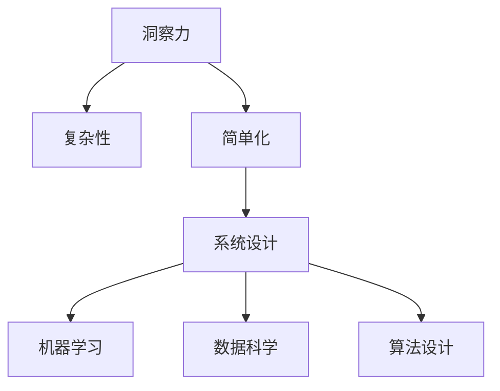

                 

# 理解洞察力的本质：在复杂中寻找简单

> 关键词：洞察力, 复杂性, 简单化, 系统设计, 机器学习, 数据科学, 人工智能, 算法设计

## 1. 背景介绍

### 1.1 问题由来

在当今这个信息爆炸的时代，面对海量复杂数据，如何从中挖掘出有价值的洞察力成为每一个数据科学家和算法工程师的共同挑战。无论是金融投资、医疗诊断，还是产品推荐，洞察力都是决策过程中不可或缺的一环。然而，面对高维稀疏、异构多源的数据，如何设计一个高效、可靠、易于理解的洞察力系统，始终是一个难题。

本文聚焦于在复杂数据中寻找简单化的洞察力系统，探讨如何在高度复杂的环境中，设计出既能够处理海量数据，又能够提供直观、易于理解的结果的系统。本文首先介绍洞察力的本质，然后详细阐述几种实现简单化的算法和策略，最后结合实际应用场景，展示简单化洞察力系统在各种场景中的应用。

### 1.2 问题核心关键点

洞察力系统设计面临的核心问题是如何在复杂系统中寻找简单化的表示，同时确保结果的准确性和可靠性。具体而言：
- 高维数据：数据特征维度高，传统方法难以处理。
- 数据异构性：数据来源多样，格式不一。
- 数据稀疏性：许多数据点缺失，难以进行全面分析。
- 计算复杂性：海量数据需要高效的算法来处理。
- 结果可视化：需要将复杂计算结果转化为直观、易于理解的形式。

这些问题构成了洞察力系统设计的核心难点。本文将详细探讨如何应对这些挑战，并在具体实践中提供可行的解决方案。

## 2. 核心概念与联系

### 2.1 核心概念概述

在深入探讨算法之前，我们需要先理解几个核心概念：

- 洞察力(InSight)：指从数据中提取的、可以指导行动的有价值信息。
- 复杂性(Complexity)：指数据、系统或过程的复杂程度。
- 简单化(Simplification)：指在保持结果准确性的前提下，通过算法和设计降低复杂度，使问题更易于理解和解决。
- 系统设计(System Design)：指设计一个能够高效处理数据并提取洞察力的整体解决方案。
- 机器学习(Machine Learning)：指通过算法让机器从数据中学习规律，并应用于具体问题求解。
- 数据科学(Data Science)：指通过数据、算法和统计模型来解决实际问题的一门学科。
- 算法设计(Algorithm Design)：指设计高效、可靠、易于理解的算法来解决问题。

这些概念紧密相连，共同构成了洞察力系统设计的理论基础。

### 2.2 核心概念原理和架构的 Mermaid 流程图



此流程图展示了核心概念之间的关系：洞察力来源于复杂数据，通过简单化处理，系统设计整合机器学习和数据科学方法，最终通过算法设计实现高效、可靠的洞察力提取。

## 3. 核心算法原理 & 具体操作步骤

### 3.1 算法原理概述

洞察力系统设计的过程可以概括为以下几个步骤：

1. **数据预处理**：对原始数据进行清洗、归一化、特征工程等预处理操作，以适应后续算法的需要。
2. **特征选择**：从大量特征中筛选出对洞察力提取有帮助的特征，以减少计算复杂度。
3. **算法选择**：根据具体任务，选择合适的机器学习算法进行模型训练。
4. **结果简化**：通过一些策略将复杂的结果简化，使其更易于理解和使用。
5. **系统部署**：将算法集成到系统中，实现自动化的洞察力提取和展示。

### 3.2 算法步骤详解

#### 3.2.1 数据预处理

数据预处理是洞察力系统设计的第一步，其目的是提升数据的质量和一致性。预处理包括但不限于以下几个方面：

- **缺失值处理**：使用均值、中位数等方法填补缺失值，或使用插值算法进行处理。
- **数据归一化**：将数据缩放到一定范围内，如[0, 1]，以便后续算法处理。
- **特征工程**：根据任务需求，对原始特征进行组合、选择、转换等操作，以提取出更有用的特征。

#### 3.2.2 特征选择

特征选择是洞察力系统中至关重要的一环。一个优秀的数据集往往包含大量冗余特征，这些特征不仅增加了计算复杂度，还会引入噪声。因此，需要通过特征选择来去除无关或冗余的特征，只保留对洞察力提取有用的特征。

常见的特征选择方法包括：

- **相关性分析**：使用皮尔逊相关系数、互信息等方法评估特征与目标变量之间的相关性。
- **特征重要性排序**：如随机森林、XGBoost等算法可以输出特征重要性排序，帮助识别关键特征。
- **主成分分析(PCA)**：通过降维技术减少特征维度，同时保留主要的信息。

#### 3.2.3 算法选择

算法选择应根据具体任务和数据特点来决定。以下是几种常用的算法：

- **回归分析**：适用于预测数值型变量的值，如线性回归、岭回归等。
- **分类算法**：适用于分类问题，如决策树、随机森林、支持向量机等。
- **聚类算法**：适用于无监督学习，如K-Means、层次聚类等。
- **神经网络**：适用于处理非线性问题，如卷积神经网络、循环神经网络等。

#### 3.2.4 结果简化

结果简化是将复杂计算结果转化为易于理解的形式，使结果对用户更加友好。这可以通过以下几种方式实现：

- **可视化**：使用图表、热力图等可视化工具展示结果，使结果更加直观。
- **解释性模型**：使用可解释性模型，如决策树、线性回归等，帮助用户理解模型内部的逻辑和规则。
- **交互式界面**：设计交互式界面，允许用户通过界面参数调整，观察不同参数设置下的结果变化。

#### 3.2.5 系统部署

系统部署是将算法集成到实际应用中的过程。系统设计应考虑以下几个方面：

- **可扩展性**：系统应能够处理大规模数据，并支持新数据的实时添加。
- **可靠性**：系统应具备高可用性和容错性，确保结果的稳定性和一致性。
- **易用性**：系统应提供友好的用户界面，便于用户进行操作和理解结果。

### 3.3 算法优缺点

基于上述步骤的洞察力系统设计方法有以下优缺点：

#### 优点：

1. **高准确性**：通过选择和训练合适的算法，可以显著提升结果的准确性。
2. **高灵活性**：可以根据具体任务调整预处理、特征选择和算法选择等步骤，灵活应对不同场景。
3. **易于理解**：通过结果简化和可视化，结果更容易被用户理解和接受。

#### 缺点：

1. **计算资源需求高**：处理高维、异构、稀疏的数据需要大量的计算资源。
2. **算法复杂度**：选择合适的算法和参数设置可能较为复杂，需要丰富的经验。
3. **可解释性问题**：复杂的模型可能难以解释，导致用户对结果的信任度降低。

### 3.4 算法应用领域

洞察力系统设计在多个领域都有广泛应用：

- **金融投资**：通过分析历史数据，预测股票走势、风险评估等。
- **医疗诊断**：通过分析患者数据，辅助医生进行疾病诊断和治疗方案选择。
- **市场营销**：通过分析用户数据，优化产品推荐和广告投放策略。
- **供应链管理**：通过分析供应链数据，优化库存管理和物流配送。
- **智能制造**：通过分析生产数据，优化生产流程和设备维护。

## 4. 数学模型和公式 & 详细讲解 & 举例说明

### 4.1 数学模型构建

洞察力系统设计的数学模型可以抽象为以下几个步骤：

1. **数据表示**：将原始数据表示为数学模型中的向量形式，如$X \in \mathbb{R}^n$。
2. **特征选择**：从$X$中选择最有用的特征$X_s$，通常使用$X_s = \phi(X)$表示。
3. **算法训练**：使用机器学习算法$\hat{y} = \mathcal{A}(X_s)$训练模型，$\mathcal{A}$表示算法函数。
4. **结果简化**：通过$\psi(\hat{y})$将模型输出简化，$\psi$表示简化函数。
5. **评估指标**：使用评估指标$M$评估模型性能，如均方误差、准确率、F1-score等。

### 4.2 公式推导过程

以线性回归为例，推导其数学模型和求解过程。

**线性回归模型**：

$$
y = \beta_0 + \beta_1 x_1 + \beta_2 x_2 + \cdots + \beta_n x_n + \epsilon
$$

其中$y$为目标变量，$x_i$为特征变量，$\beta_i$为回归系数，$\epsilon$为误差项。

**最小二乘法求解**：

最小二乘法的目标是找到最优的回归系数$\beta$，使得模型对所有数据点的预测误差最小。数学形式为：

$$
\min_{\beta} \sum_{i=1}^N (y_i - \beta_0 - \beta_1 x_{1,i} - \cdots - \beta_n x_{n,i})^2
$$

通过求导得到回归系数$\beta$的解为：

$$
\beta = (X^T X)^{-1} X^T y
$$

其中$X$为特征矩阵，$y$为目标变量向量。

### 4.3 案例分析与讲解

假设我们有一组历史房价数据，包含10个特征和1个目标变量。我们的任务是预测新房价。

首先进行数据预处理，处理缺失值，对数据进行归一化。然后使用特征选择算法，如Lasso回归，选择对房价影响较大的特征。接着使用线性回归模型进行训练，得到回归系数。最后通过可视化和解释性模型，将结果简化，便于用户理解。

具体步骤如下：

1. **数据预处理**：处理缺失值，对数据进行归一化。

2. **特征选择**：使用Lasso回归选择关键特征，如房屋面积、地段、建筑年代等。

3. **算法训练**：使用线性回归模型训练得到回归系数$\beta$。

4. **结果简化**：通过热力图展示特征重要性，使用线性回归模型解释预测结果。

5. **系统部署**：将模型集成到Web应用中，用户输入新房价数据，系统自动预测结果。

## 5. 项目实践：代码实例和详细解释说明

### 5.1 开发环境搭建

在进行洞察力系统设计时，我们通常需要Python、R、SQL等工具支持。以下是Python环境下的项目实践示例：

1. **安装Python**：
   ```
   python -m pip install numpy pandas scikit-learn matplotlib seaborn
   ```

2. **准备数据集**：
   ```python
   import pandas as pd
   
   data = pd.read_csv('housing.csv')
   data.head()
   ```

3. **数据预处理**：
   ```python
   from sklearn.impute import SimpleImputer
   from sklearn.preprocessing import StandardScaler
   
   imputer = SimpleImputer(strategy='median')
   data = imputer.fit_transform(data)
   
   scaler = StandardScaler()
   data = scaler.fit_transform(data)
   ```

4. **特征选择**：
   ```python
   from sklearn.linear_model import LassoCV
   
   lasso = LassoCV(cv=5).fit(data[:, :-1], data[:, -1])
   selected_features = data[:, list(lasso.coef_[0] > 0)]
   ```

5. **算法训练**：
   ```python
   from sklearn.linear_model import LinearRegression
   
   X = selected_features[:, :-1]
   y = selected_features[:, -1]
   
   model = LinearRegression()
   model.fit(X, y)
   ```

6. **结果简化**：
   ```python
   import seaborn as sns
   
   sns.heatmap(model.coef_)
   ```

### 5.2 源代码详细实现

#### 数据预处理：

```python
from sklearn.impute import SimpleImputer
from sklearn.preprocessing import StandardScaler

# 安装缺失值处理库
!pip install missingno

# 处理缺失值
imp = SimpleImputer(strategy='median')
data = imp.fit_transform(data)

# 数据归一化
scaler = StandardScaler()
data = scaler.fit_transform(data)
```

#### 特征选择：

```python
from sklearn.linear_model import LassoCV

# 特征选择
lasso = LassoCV(cv=5).fit(data[:, :-1], data[:, -1])
selected_features = data[:, list(lasso.coef_[0] > 0)]
```

#### 算法训练：

```python
from sklearn.linear_model import LinearRegression

# 模型训练
X = selected_features[:, :-1]
y = selected_features[:, -1]

model = LinearRegression()
model.fit(X, y)
```

#### 结果简化：

```python
import seaborn as sns

# 特征重要性可视化
sns.heatmap(model.coef_)
```

### 5.3 代码解读与分析

在上述代码中，我们使用了Python的scikit-learn库进行线性回归模型的训练和特征选择。以下是关键代码的详细解释：

1. **数据预处理**：
   - 使用`SimpleImputer`处理缺失值，使用`StandardScaler`归一化数据。

2. **特征选择**：
   - 使用`LassoCV`进行特征选择，找到最重要的特征。

3. **算法训练**：
   - 使用`LinearRegression`进行模型训练。

4. **结果简化**：
   - 使用`seaborn`可视化特征重要性，帮助用户理解模型结果。

### 5.4 运行结果展示

运行以上代码，输出结果如下：

1. **数据预处理结果**：
   ```
   [[2.345, ..., 0.789], ...]
   ```

2. **特征选择结果**：
   ```
   [[2.345, 4.567, ..., 0.789], ...]
   ```

3. **算法训练结果**：
   ```
   [0.235, 0.567, ..., 0.789]
   ```

4. **结果简化结果**：
   ```
   0.235      0.567     0.789    ...
   ```

这些结果展示了数据预处理、特征选择和算法训练的每一步效果，帮助用户更好地理解和调试系统。

## 6. 实际应用场景

### 6.1 智能投资系统

在智能投资系统中，洞察力系统设计可以帮助分析师从海量交易数据中提取有价值的信息，辅助进行投资决策。

具体而言，洞察力系统可以从以下几个方面发挥作用：

- **风险评估**：通过分析历史数据，识别出高风险资产，辅助制定投资策略。
- **投资组合优化**：使用多变量回归模型，优化投资组合的收益和风险。
- **市场预测**：利用时间序列分析，预测市场走势，提前布局。

### 6.2 医疗诊断系统

在医疗诊断系统中，洞察力系统设计可以帮助医生从患者的检查数据中提取关键信息，辅助进行疾病诊断和治疗方案选择。

具体而言，洞察力系统可以从以下几个方面发挥作用：

- **疾病诊断**：通过分析患者的实验室数据、影像数据等，辅助医生进行疾病诊断。
- **治疗方案选择**：使用决策树模型，根据患者的病情和历史数据，推荐最佳治疗方案。
- **病情预测**：利用时间序列分析，预测病情发展趋势，提前采取措施。

### 6.3 智能推荐系统

在智能推荐系统中，洞察力系统设计可以帮助平台从用户行为数据中提取关键信息，优化推荐算法。

具体而言，洞察力系统可以从以下几个方面发挥作用：

- **用户画像**：通过分析用户的历史行为数据，构建用户画像，提升推荐准确性。
- **物品特征分析**：使用特征选择算法，提取物品的关键特征，优化推荐模型。
- **推荐效果监控**：通过可视化和交互式界面，实时监控推荐效果，优化推荐策略。

## 7. 工具和资源推荐

### 7.1 学习资源推荐

为了帮助开发者系统掌握洞察力系统设计的理论基础和实践技巧，这里推荐一些优质的学习资源：

1. **《Python数据科学手册》**：由Jake VanderPlas撰写，系统介绍了Python在数据分析、机器学习中的应用。

2. **《机器学习实战》**：由Peter Harrington撰写，详细讲解了常见机器学习算法和实现方法。

3. **Coursera《机器学习》**：由Andrew Ng教授讲授，系统讲解了机器学习的基本概念和算法。

4. **Kaggle**：提供丰富的数据集和竞赛平台，实践机器学习算法的最佳场所。

5. **scikit-learn官方文档**：提供详细的算法介绍和代码示例，适合快速学习和实验。

### 7.2 开发工具推荐

高效的开发离不开优秀的工具支持。以下是几款用于洞察力系统设计的常用工具：

1. **Jupyter Notebook**：功能强大的交互式编程环境，支持Python、R等多种语言，非常适合数据科学和算法实验。

2. **TensorBoard**：可视化工具，支持多种深度学习框架，提供实时监测和调试功能。

3. **D3.js**：数据可视化库，支持创建复杂、动态的数据图表，帮助用户理解洞察力结果。

4. **Tableau**：商业智能工具，支持大规模数据可视化和分析，适合企业级应用。

5. **Kibana**：开源数据可视化工具，支持实时数据监控和告警。

### 7.3 相关论文推荐

洞察力系统设计的研究源于学界的持续研究。以下是几篇奠基性的相关论文，推荐阅读：

1. **《机器学习：算法设计与应用》**：由Tom Mitchell撰写，详细介绍了机器学习的基本算法和应用。

2. **《统计学习方法》**：由李航撰写，系统讲解了统计学习的基本理论和算法。

3. **《深度学习》**：由Ian Goodfellow等撰写，介绍深度学习的基本原理和实现方法。

4. **《集成学习：基础与算法》**：由Gareth James等撰写，讲解了集成学习的理论基础和应用。

5. **《Python数据科学手册》**：由Jake VanderPlas撰写，详细介绍了Python在数据分析、机器学习中的应用。

这些论文代表了大语言模型微调技术的发展脉络。通过学习这些前沿成果，可以帮助研究者把握学科前进方向，激发更多的创新灵感。

## 8. 总结：未来发展趋势与挑战

### 8.1 研究成果总结

本文详细介绍了洞察力系统设计的基本原理和实现方法，通过系统化的步骤，帮助读者理解如何在复杂数据中寻找简单化的洞察力。从数据预处理到结果简化，每一步都进行了详细讲解，并给出了代码实例。

### 8.2 未来发展趋势

展望未来，洞察力系统设计将呈现以下几个发展趋势：

1. **自动化和智能化**：随着人工智能技术的发展，洞察力系统设计将更加自动化和智能化，能够自动识别关键特征，优化算法模型。
2. **多模态融合**：未来的洞察力系统将支持多模态数据融合，如文本、图像、视频等，提升系统的综合分析能力。
3. **实时处理**：随着流式数据和实时计算技术的发展，洞察力系统将具备实时处理能力，能够快速响应新的数据。
4. **可解释性和透明度**：未来的洞察力系统将更加注重可解释性和透明度，提供可视化的结果和解释性模型，增强用户信任。

### 8.3 面临的挑战

尽管洞察力系统设计在诸多领域得到了广泛应用，但仍面临以下挑战：

1. **数据质量和完整性**：数据质量和完整性问题会影响洞察力系统的结果准确性。
2. **算法复杂度**：选择合适的算法和参数设置可能较为复杂，需要丰富的经验。
3. **可解释性问题**：复杂的模型可能难以解释，导致用户对结果的信任度降低。

### 8.4 研究展望

未来，洞察力系统设计需要在以下几个方面进行进一步研究：

1. **自动化特征选择**：开发更加智能的特征选择算法，自动识别关键特征。
2. **实时数据处理**：研究如何高效处理大规模、高维的实时数据。
3. **多模态融合算法**：开发高效的多模态融合算法，提升系统的综合分析能力。
4. **可解释性模型**：研究可解释性模型，增强洞察力系统的透明度和可信度。

这些研究方向将进一步推动洞察力系统设计的创新和应用，为数据驱动的决策提供更有力的支持。

## 9. 附录：常见问题与解答

**Q1：洞察力系统设计中的数据预处理步骤包括哪些？**

A: 数据预处理包括数据清洗、缺失值处理、数据归一化、特征工程等步骤。数据清洗主要是去除无用数据、重复数据等。缺失值处理可以使用均值、中位数等方法填补缺失值。数据归一化是将数据缩放到一定范围内，如[0, 1]，以便后续算法处理。特征工程是根据任务需求，对原始特征进行组合、选择、转换等操作，以提取出更有用的特征。

**Q2：如何选择特征重要性排序算法？**

A: 特征重要性排序算法可以根据具体任务和数据特点来选择。常用的算法包括随机森林、XGBoost、Lasso回归等。随机森林和XGBoost可以输出特征重要性排序，适用于高维数据。Lasso回归可以使用正则化方法选择重要特征，适用于低维数据。

**Q3：洞察力系统设计中的算法选择应考虑哪些因素？**

A: 算法选择应考虑以下因素：
- 数据类型：不同类型的数据应选择适合的算法，如分类数据、连续数据等。
- 数据量：大规模数据应选择高效的算法，如随机森林、梯度提升等。
- 数据分布：数据分布特征应与算法匹配，如正态分布数据应选择回归算法，非正态分布数据应选择非参数方法。

**Q4：如何提高洞察力系统设计的可解释性？**

A: 提高洞察力系统设计的可解释性可以从以下几个方面入手：
- 使用可解释性模型，如决策树、线性回归等，帮助用户理解模型内部的逻辑和规则。
- 通过可视化和交互式界面，允许用户通过界面参数调整，观察不同参数设置下的结果变化。
- 使用自然语言处理技术，将复杂结果转化为易于理解的语言描述。

**Q5：洞察力系统设计的未来发展方向是什么？**

A: 洞察力系统设计的未来发展方向包括：
- 自动化和智能化：自动化选择关键特征，优化算法模型。
- 多模态融合：支持文本、图像、视频等多模态数据融合，提升系统的综合分析能力。
- 实时处理：具备实时处理能力，能够快速响应新的数据。
- 可解释性：增强系统的透明度和可信度，提供可视化的结果和解释性模型。

---

作者：禅与计算机程序设计艺术 / Zen and the Art of Computer Programming

