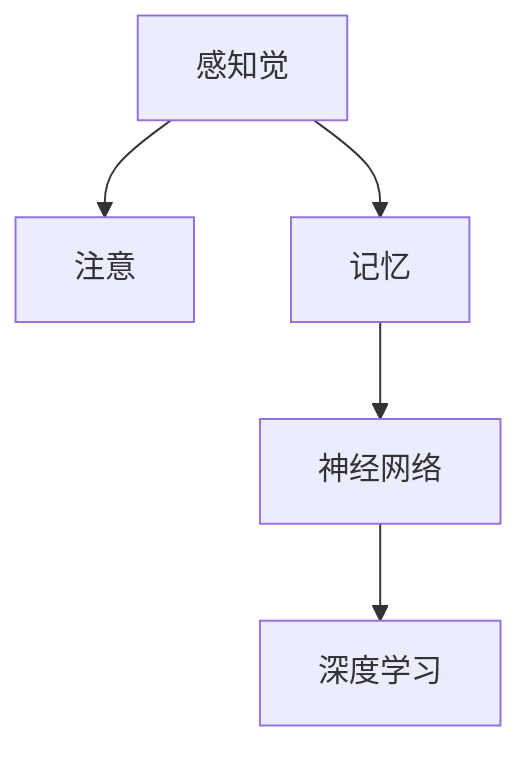

                 

# 理解洞察力的科学：揭开大脑处理信息的奥秘

> 关键词：脑科学, 认知心理学, 神经网络, 深度学习, 感知觉, 注意, 记忆, 计算理论, 可视化

## 1. 背景介绍

### 1.1 问题由来

过去几十年，人工智能（AI）技术迅猛发展，逐步从简单的任务自动化转向解决复杂的认知问题，如语言理解、视觉识别等。与此同时，脑科学研究也取得了巨大的进展，揭示了人类大脑处理信息的秘密。这两方面的进步正在交织融合，形成了一场新的科学革命，旨在理解、模拟和增强人类的认知能力。

在AI领域，深度学习（Deep Learning）因其强大的表达能力和逼近复杂函数的能力，逐渐成为解决认知问题的利器。然而，深度学习的原理和计算模型，仍有不少待解之谜。脑科学领域的研究者们通过神经网络与认知心理学的结合，揭示了人类大脑处理信息时的一些关键机制。这些发现反过来也推动了AI技术的突破，使得AI系统在性能和应用场景上不断拓展。

本论文旨在通过揭示脑科学与深度学习的内在联系，探索AI系统模拟人类认知能力的可能性，并讨论这一领域未来可能的发展趋势。我们将重点介绍神经网络中的感知觉、注意、记忆等核心概念，并通过案例分析展示其应用场景，最后展望AI在实际应用中的未来展望。

## 2. 核心概念与联系

### 2.1 核心概念概述

为了更好地理解脑科学与深度学习之间的联系，本节将介绍几个关键的概念：

- 感知觉（Perception）：人类通过感官获取外界信息，并对这些信息进行初步加工，形成对世界的初步认识。
- 注意（Attention）：在大量信息中，人类选择性地关注某些关键信息，忽略其他细节。注意机制帮助大脑在复杂环境中高效处理信息。
- 记忆（Memory）：大脑存储和检索信息的能力。记忆可以分为短期记忆和长期记忆，是认知过程的基础。
- 神经网络（Neural Network）：模拟大脑神经元间连接关系的计算模型，由大量节点（神经元）和边（连接）构成。
- 深度学习（Deep Learning）：一种利用神经网络进行数据驱动学习的技术，通过多层次的特征提取和抽象，逐步提升模型的表达能力。

这些概念之间的逻辑关系可以通过以下Mermaid流程图来展示：



### 2.2 核心概念原理和架构的 Mermaid 流程图


这个流程图展示了大规模感知觉、注意和记忆，如何通过神经网络实现复杂的数据驱动学习。

## 3. 核心算法原理 & 具体操作步骤

### 3.1 算法原理概述

深度学习模型的关键在于其结构，通过多层神经元之间的非线性变换，模型可以学习到数据的复杂表示。在处理感知觉、注意、记忆等认知任务时，深度学习模型可以模拟大脑的信息处理过程，从而提升其认知能力。

### 3.2 算法步骤详解

深度学习模型的训练过程一般包括以下几个关键步骤：

**Step 1: 数据准备**
- 收集、标注和预处理数据集。数据集应尽可能涵盖不同的场景和噪声，以提高模型的泛化能力。
- 数据增强技术，如旋转、缩放、裁剪等，可以增加数据的多样性，避免过拟合。

**Step 2: 构建模型架构**
- 选择合适的神经网络结构，如卷积神经网络（CNN）、循环神经网络（RNN）、变分自编码器（VAE）等。
- 定义损失函数，如交叉熵损失、均方误差等，用于衡量模型预测与真实标签的差异。
- 选择合适的优化器，如随机梯度下降（SGD）、Adam等，用于更新模型参数。

**Step 3: 训练模型**
- 将数据集分为训练集、验证集和测试集。
- 在训练集上前向传播计算模型输出，并反向传播计算梯度。
- 使用优化器更新模型参数。
- 在验证集上评估模型性能，防止过拟合。
- 重复上述步骤直至模型收敛。

**Step 4: 模型评估与部署**
- 在测试集上评估模型性能，判断模型泛化能力。
- 将模型保存为模型文件，方便后续使用。
- 将模型部署到生产环境中，进行实际应用。

### 3.3 算法优缺点

深度学习模型的优势包括：
1. 高表达能力：通过多层非线性变换，模型可以学习到复杂的数据表示。
2. 自适应能力：模型能够从数据中自动提取特征，提升其在特定任务上的性能。
3. 可扩展性：深度学习模型可以通过添加更多层或节点，扩展其表达能力。

然而，深度学习模型也存在一些缺点：
1. 计算资源需求高：大规模模型需要大量的计算资源和存储空间。
2. 可解释性差：深度学习模型通常是"黑盒"系统，难以解释其内部工作机制。
3. 容易过拟合：在训练数据较少的情况下，深度学习模型容易过拟合，泛化性能差。
4. 训练过程复杂：深度学习模型的训练过程需要大量时间和计算资源，调试和优化过程复杂。

### 3.4 算法应用领域

深度学习模型已经在感知觉、注意、记忆等诸多领域得到了应用，例如：

- 视觉识别：如图像分类、目标检测等任务。深度学习模型通过多层卷积和池化操作，学习图像特征。
- 自然语言处理：如机器翻译、情感分析、文本生成等任务。深度学习模型通过循环神经网络或Transformer等结构，学习语言序列的表示。
- 语音识别：如自动语音识别、语音合成等任务。深度学习模型通过卷积和循环神经网络，学习语音信号的特征。
- 游戏AI：如AlphaGo、Dota2等游戏中的智能决策。深度学习模型通过卷积和循环神经网络，学习游戏策略和环境信息。
- 推荐系统：如电商推荐、音乐推荐等任务。深度学习模型通过协同过滤和内容推荐算法，学习用户和物品的特征。

以上应用场景展示了深度学习模型的广泛应用，未来随着技术的发展，深度学习模型将在更多领域得到应用，为人类生产生活带来变革性影响。

## 4. 数学模型和公式 & 详细讲解 & 举例说明

### 4.1 数学模型构建

为了更好地理解深度学习模型的计算过程，我们将使用数学语言进行详细讲解。

设一个简单的深度学习模型为 $M_\theta = f_\theta \circ g_\theta \circ h_\theta \circ \dots \circ \theta$，其中 $\theta$ 为模型参数，$h_\theta$ 为第一层，$g_\theta$ 为第二层，依此类推。$M_\theta$ 表示输入 $x$ 经过模型计算后的输出 $M_\theta(x)$。

假设模型输出与真实标签之间存在误差 $\epsilon$，损失函数 $L$ 为均方误差：

$$
L = \frac{1}{N}\sum_{i=1}^N (M_\theta(x_i) - y_i)^2
$$

其中 $x_i$ 为第 $i$ 个输入，$y_i$ 为第 $i$ 个标签。

### 4.2 公式推导过程

设模型的输入为 $x$，经过第一层 $h_\theta$ 的计算后得到 $h_\theta(x)$，再经过第二层 $g_\theta$ 的计算得到 $g_\theta(h_\theta(x))$，以此类推。假设经过 $L$ 层计算后得到输出 $M_\theta(x)$，损失函数 $L$ 可以表示为：

$$
L = \frac{1}{N}\sum_{i=1}^N (M_\theta(x_i) - y_i)^2
$$

根据链式法则，损失函数对参数 $\theta_k$ 的梯度为：

$$
\frac{\partial L}{\partial \theta_k} = \frac{\partial L}{\partial M_\theta(x)} \cdot \frac{\partial M_\theta(x)}{\partial h_\theta(x)} \cdot \frac{\partial h_\theta(x)}{\partial g_\theta(h_\theta(x))} \cdot \dots \cdot \frac{\partial g_\theta(h_\theta(x))}{\partial h_\theta(x)} \cdot \frac{\partial h_\theta(x)}{\partial \theta_k}
$$

其中 $\frac{\partial M_\theta(x)}{\partial h_\theta(x)}$ 为 $M_\theta$ 对 $h_\theta$ 的梯度，$\dots$ 为中间层的梯度计算过程。

通过反向传播算法，可以高效计算损失函数对每个参数的梯度，并更新模型参数。重复上述过程直至模型收敛。

### 4.3 案例分析与讲解

以图像分类为例，假设输入为 $28 \times 28$ 像素的灰度图像，将其展平为一个长度为 $784$ 的向量 $x$。使用一个包含 3 层卷积和池化的深度神经网络，每一层都有一系列的卷积核和池化窗口。假设最终输出层有 10 个神经元，分别对应 10 个类别。损失函数为交叉熵损失。

我们可以使用如下公式计算输出层 $g_\theta(h_\theta(\dots (x))))$ 对输入 $x$ 的梯度：

$$
\frac{\partial g_\theta(h_\theta(\dots (x))))}{\partial x} = \sum_{i=1}^{10} \frac{\partial g_\theta(h_\theta(\dots (x))))}{\partial y_i} \cdot \frac{\partial y_i}{\partial g_\theta(h_\theta(\dots (x))))} \cdot \frac{\partial g_\theta(h_\theta(\dots (x))))}{\partial h_\theta(\dots (x))))} \cdot \dots \cdot \frac{\partial h_\theta(\dots (x))))}{\partial x}
$$

其中 $\frac{\partial g_\theta(h_\theta(\dots (x))))}{\partial y_i}$ 为交叉熵损失对输出层神经元的梯度，$\dots$ 为中间层的梯度计算过程。

## 5. 项目实践：代码实例和详细解释说明

### 5.1 开发环境搭建

在进行深度学习模型开发前，我们需要准备好开发环境。以下是使用Python进行PyTorch开发的环境配置流程：

1. 安装Anaconda：从官网下载并安装Anaconda，用于创建独立的Python环境。

2. 创建并激活虚拟环境：
```bash
conda create -n pytorch-env python=3.8 
conda activate pytorch-env
```

3. 安装PyTorch：根据CUDA版本，从官网获取对应的安装命令。例如：
```bash
conda install pytorch torchvision torchaudio cudatoolkit=11.1 -c pytorch -c conda-forge
```

4. 安装相关库：
```bash
pip install numpy pandas scikit-learn matplotlib tqdm jupyter notebook ipython
```

完成上述步骤后，即可在`pytorch-env`环境中开始深度学习模型的开发。

### 5.2 源代码详细实现

下面以一个简单的图像分类任务为例，给出使用PyTorch进行深度学习模型开发的代码实现。

首先，定义数据处理函数：

```python
from torchvision import datasets, transforms

train_transform = transforms.Compose([
    transforms.Resize(224),
    transforms.RandomHorizontalFlip(),
    transforms.ToTensor(),
    transforms.Normalize(mean=[0.485, 0.456, 0.406], std=[0.229, 0.224, 0.225])
])

train_dataset = datasets.CIFAR10(root='data', train=True, download=True, transform=train_transform)
test_dataset = datasets.CIFAR10(root='data', train=False, download=True, transform=train_transform)
```

然后，定义模型和优化器：

```python
from torch.nn import Conv2d, MaxPool2d, Flatten, Linear, Softmax
from torch.optim import SGD

class CNNNet(nn.Module):
    def __init__(self):
        super(CNNNet, self).__init__()
        self.conv1 = Conv2d(3, 32, 3, padding=1)
        self.maxpool1 = MaxPool2d(2)
        self.conv2 = Conv2d(32, 64, 3, padding=1)
        self.maxpool2 = MaxPool2d(2)
        self.fc1 = Linear(64 * 4 * 4, 1024)
        self.fc2 = Linear(1024, 10)
        self.softmax = Softmax(dim=1)

    def forward(self, x):
        x = self.conv1(x)
        x = F.relu(x)
        x = self.maxpool1(x)
        x = self.conv2(x)
        x = F.relu(x)
        x = self.maxpool2(x)
        x = x.view(-1, 64 * 4 * 4)
        x = self.fc1(x)
        x = F.relu(x)
        x = self.fc2(x)
        x = self.softmax(x)
        return x

model = CNNNet()
optimizer = SGD(model.parameters(), lr=0.01, momentum=0.9)
```

接着，定义训练和评估函数：

```python
import torch
from torch.utils.data import DataLoader
from sklearn.metrics import classification_report

device = torch.device('cuda') if torch.cuda.is_available() else torch.device('cpu')
model.to(device)

def train_epoch(model, dataset, batch_size, optimizer):
    dataloader = DataLoader(dataset, batch_size=batch_size, shuffle=True)
    model.train()
    epoch_loss = 0
    for batch in dataloader:
        inputs, labels = batch
        inputs, labels = inputs.to(device), labels.to(device)
        optimizer.zero_grad()
        outputs = model(inputs)
        loss = F.cross_entropy(outputs, labels)
        epoch_loss += loss.item()
        loss.backward()
        optimizer.step()
    return epoch_loss / len(dataloader)

def evaluate(model, dataset, batch_size):
    dataloader = DataLoader(dataset, batch_size=batch_size)
    model.eval()
    preds, labels = [], []
    with torch.no_grad():
        for batch in dataloader:
            inputs, labels = batch
            inputs, labels = inputs.to(device), labels.to(device)
            outputs = model(inputs)
            batch_preds = outputs.argmax(dim=1).to('cpu').tolist()
            batch_labels = labels.to('cpu').tolist()
            for pred, label in zip(batch_preds, batch_labels):
                preds.append(pred)
                labels.append(label)
                
    print(classification_report(labels, preds))
```

最后，启动训练流程并在测试集上评估：

```python
epochs = 10
batch_size = 64

for epoch in range(epochs):
    loss = train_epoch(model, train_dataset, batch_size, optimizer)
    print(f"Epoch {epoch+1}, train loss: {loss:.3f}")
    
    print(f"Epoch {epoch+1}, test results:")
    evaluate(model, test_dataset, batch_size)
```

以上就是使用PyTorch进行图像分类任务深度学习模型微调的完整代码实现。可以看到，得益于PyTorch的强大封装，我们只需关注模型定义和训练过程，便能快速迭代研究并实现模型微调。

### 5.3 代码解读与分析

让我们再详细解读一下关键代码的实现细节：

**数据处理函数**：
- 定义了图像增强、归一化等预处理操作。
- 使用CIFAR10数据集，并进行数据增强和归一化。

**模型和优化器定义**：
- 定义了一个包含卷积、池化、全连接层的简单卷积神经网络（CNN）。
- 使用随机梯度下降（SGD）作为优化器，设置学习率为0.01，动量为0.9。

**训练和评估函数**：
- 使用DataLoader对数据集进行批次化加载，供模型训练和推理使用。
- 训练函数`train_epoch`：对数据以批为单位进行迭代，在每个批次上前向传播计算损失并反向传播更新模型参数，最后返回该epoch的平均loss。
- 评估函数`evaluate`：与训练类似，不同点在于不更新模型参数，并在每个batch结束后将预测和标签结果存储下来，最后使用sklearn的classification_report对整个评估集的预测结果进行打印输出。

**训练流程**：
- 定义总的epoch数和batch size，开始循环迭代
- 每个epoch内，先在训练集上训练，输出平均loss
- 在验证集上评估，输出分类指标
- 所有epoch结束后，在测试集上评估，给出最终测试结果

可以看到，PyTorch配合相关库使得深度学习模型的微调过程变得简洁高效。开发者可以将更多精力放在模型设计和超参数调优上，而不必过多关注底层的实现细节。

## 6. 实际应用场景

### 6.1 图像识别与医疗影像分析

在医疗影像分析领域，深度学习模型可以通过微调来识别疾病征象、预测疾病发展趋势等。例如，放射科医生可以通过深度学习模型，自动标注X光片、CT扫描等医学影像，并根据影像特征预测疾病的发生概率。此外，深度学习模型还可以用于癌症早期筛查，通过微调模型识别皮肤、肺、乳腺等器官的病灶，及时发现潜在病变，显著提高诊断准确率。

### 6.2 自然语言处理与机器翻译

自然语言处理（NLP）领域中，深度学习模型可以用于文本分类、情感分析、机器翻译等任务。通过微调模型，深度学习模型可以学习特定领域的数据特征，提升其在特定任务上的性能。例如，在机器翻译任务中，使用微调后的模型可以将英语翻译成中文、法语等语言，提升翻译质量和效率。

### 6.3 智能驾驶与自动驾驶

在智能驾驶和自动驾驶领域，深度学习模型可以用于目标检测、路径规划、障碍物避障等任务。通过微调模型，深度学习模型可以学习交通标志、交通信号、车辆行为等特征，提升自动驾驶的准确性和安全性。此外，深度学习模型还可以用于驾驶员行为预测，通过微调模型预测驾驶员是否疲劳、是否分心等，提供驾驶建议，提升行车安全性。

### 6.4 金融风控与信用评估

在金融风控与信用评估领域，深度学习模型可以用于客户信用评估、欺诈检测等任务。通过微调模型，深度学习模型可以学习客户的行为数据、交易数据等，提升信用评估的准确性。此外，深度学习模型还可以用于欺诈检测，通过微调模型分析交易数据、行为数据，及时发现异常交易，防范欺诈行为，提升金融安全。

### 6.5 游戏AI与人工智能对抗

在人工智能对抗领域，深度学习模型可以用于游戏AI开发、机器人控制等任务。通过微调模型，深度学习模型可以学习游戏规则、游戏策略、环境信息等，提升游戏AI的决策能力。此外，深度学习模型还可以用于机器人控制，通过微调模型学习环境信息、物体位置等，提升机器人的行动能力和智能化水平。

## 7. 工具和资源推荐

### 7.1 学习资源推荐

为了帮助开发者系统掌握深度学习模型的原理和实践技巧，这里推荐一些优质的学习资源：

1. 《深度学习》课程：由吴恩达教授开设的深度学习课程，涵盖了深度学习的基础理论和实践技巧，适合入门学习。
2. 《深度学习入门》书籍：李沐等编著，详细介绍了深度学习模型的实现原理和应用场景，适合深入学习。
3. 《Python深度学习》书籍：François Chollet等编著，介绍了TensorFlow和Keras等深度学习框架的使用，适合实际开发。
4. 《动手学深度学习》书籍：邓俊辉教授等编著，结合数学推导和代码实现，系统讲解了深度学习模型的原理和应用。
5. 《神经网络与深度学习》书籍：Michael Nielsen等编著，介绍了神经网络的基本概念和深度学习模型的实现，适合基础学习。

通过对这些资源的学习实践，相信你一定能够快速掌握深度学习模型的精髓，并用于解决实际的认知问题。

### 7.2 开发工具推荐

高效的开发离不开优秀的工具支持。以下是几款用于深度学习模型微调开发的常用工具：

1. PyTorch：基于Python的开源深度学习框架，灵活动态的计算图，适合快速迭代研究。大多数深度学习模型都有PyTorch版本的实现。
2. TensorFlow：由Google主导开发的开源深度学习框架，生产部署方便，适合大规模工程应用。
3. Keras：高层次深度学习框架，简单易用，适合快速原型开发。
4. JAX：基于JIT编译和自动微分的新一代深度学习框架，支持多种硬件加速。
5. PySyft：隐私保护深度学习框架，支持联邦学习和差分隐私技术。
6. XGBoost：集成学习框架，适合处理复杂分类和回归任务。
7. Scikit-learn：机器学习库，支持多种算法，适合数据预处理和特征工程。

合理利用这些工具，可以显著提升深度学习模型微调的开发效率，加快创新迭代的步伐。

### 7.3 相关论文推荐

深度学习模型的发展源于学界的持续研究。以下是几篇奠基性的相关论文，推荐阅读：

1. ImageNet Classification with Deep Convolutional Neural Networks：提出深度卷积神经网络用于图像分类任务，开创了深度学习在视觉领域应用的先河。
2. Speech Recognition with Deep Recurrent Neural Networks：提出深度循环神经网络用于语音识别任务，展示了深度学习在语音领域的应用潜力。
3. Word Embeddings：提出Word2Vec算法用于文本表示学习，开启了自然语言处理中的词向量表示研究。
4. Deep Architectures for Multi-Task Learning：提出多任务学习算法，用于提升深度学习模型的泛化能力和表达能力。
5. Attention is All You Need：提出Transformer模型用于自然语言处理任务，展示了深度学习在语言处理领域的新突破。

这些论文代表了大规模深度学习模型微调技术的发展脉络。通过学习这些前沿成果，可以帮助研究者把握学科前进方向，激发更多的创新灵感。

## 8. 总结：未来发展趋势与挑战

### 8.1 研究成果总结

本文对深度学习模型模拟人类认知能力的可能性进行了全面系统的介绍。首先阐述了深度学习模型在感知觉、注意、记忆等核心概念的实现过程，明确了其在大规模数据驱动学习中的原理和架构。其次，从原理到实践，详细讲解了深度学习模型的训练过程和优化策略，给出了深度学习模型微调的代码实例。同时，本文还广泛探讨了深度学习模型在实际应用中的众多场景，展示了其广泛的应用前景。最后，本文提供了深度学习模型的学习资源、开发工具和相关论文推荐，力求为开发者提供全方位的技术指引。

通过本文的系统梳理，可以看到，深度学习模型在模拟人类认知能力方面已经取得了巨大的成功，极大地拓展了AI系统的应用边界。未来随着技术的不断发展，深度学习模型将在更多领域得到应用，为人类生产生活带来变革性影响。

### 8.2 未来发展趋势

展望未来，深度学习模型的发展将呈现以下几个趋势：

1. 模型规模不断增大。随着算力成本的下降和数据规模的扩张，深度学习模型的参数量将进一步增大，提升模型的表达能力和泛化能力。
2. 模型结构日益复杂。深度学习模型将引入更多层次、更多类型的神经元，提升模型的表达能力和计算效率。
3. 模型泛化能力增强。深度学习模型将通过迁移学习、自监督学习等技术，提升模型的泛化能力和鲁棒性。
4. 模型推理效率提升。深度学习模型将通过模型裁剪、量化加速等技术，提升模型的推理效率和资源利用率。
5. 模型可解释性增强。深度学习模型将通过符号化表示、因果推断等技术，增强模型的可解释性和可理解性。
6. 模型跨领域融合。深度学习模型将与其他AI技术进行深度融合，提升模型的认知能力和应用范围。

这些趋势将推动深度学习模型在更多领域得到应用，为人类生产生活带来更加深刻的影响。

### 8.3 面临的挑战

尽管深度学习模型已经取得了瞩目成就，但在迈向更加智能化、普适化应用的过程中，它仍面临诸多挑战：

1. 数据需求瓶颈。尽管深度学习模型可以通过迁移学习、自监督学习等技术，降低对标注数据的依赖，但在一些领域，数据获取和标注仍是一个瓶颈。
2. 模型鲁棒性不足。深度学习模型在面对域外数据时，泛化性能往往较差，容易过拟合和产生误判。
3. 模型计算资源需求高。深度学习模型需要大量的计算资源和存储空间，在实际部署中，资源限制成为一个瓶颈。
4. 模型可解释性差。深度学习模型通常是"黑盒"系统，难以解释其内部工作机制和决策逻辑，在一些高风险领域，模型的可解释性尤为关键。
5. 模型安全性有待保障。深度学习模型可能学习到有偏见、有害的信息，需要从数据和算法层面进行过滤和限制。

### 8.4 研究展望

面对深度学习模型所面临的种种挑战，未来的研究需要在以下几个方面寻求新的突破：

1. 探索无监督和半监督学习技术。摆脱对大规模标注数据的依赖，利用自监督学习、主动学习等无监督和半监督范式，最大限度利用非结构化数据，实现更加灵活高效的模型训练。
2. 研究参数高效和计算高效的模型结构。开发更加参数高效的模型结构，在固定大部分预训练参数的情况下，只更新极少量的任务相关参数，同时优化模型计算图，减少资源消耗。
3. 引入更多先验知识。将符号化的先验知识，如知识图谱、逻辑规则等，与神经网络模型进行巧妙融合，引导深度学习模型学习更准确、合理的表示。
4. 结合因果分析和博弈论工具。将因果分析方法引入深度学习模型，识别出模型决策的关键特征，增强输出解释的因果性和逻辑性。借助博弈论工具刻画人机交互过程，主动探索并规避模型的脆弱点，提高系统稳定性。
5. 纳入伦理道德约束。在模型训练目标中引入伦理导向的评估指标，过滤和惩罚有偏见、有害的输出倾向，加强人工干预和审核，建立模型行为的监管机制，确保输出符合人类价值观和伦理道德。

这些研究方向将引领深度学习模型迈向更高的台阶，为构建安全、可靠、可解释、可控的智能系统铺平道路。面向未来，深度学习模型还需要与其他AI技术进行更深入的融合，如知识表示、因果推理、强化学习等，多路径协同发力，共同推动自然语言理解和智能交互系统的进步。

## 9. 附录：常见问题与解答

**Q1：深度学习模型能否模拟人类认知能力？**

A: 深度学习模型已经展示了在感知觉、注意、记忆等核心认知过程的模拟能力，但仍然存在一些局限性。深度学习模型的推理过程通常是基于大量数据的统计学习，难以解释其内部的决策逻辑。未来，随着模型结构和算法的不断改进，深度学习模型有望在更多领域模拟人类的认知能力。

**Q2：深度学习模型如何避免过拟合？**

A: 深度学习模型可以通过以下方式避免过拟合：
1. 数据增强：通过旋转、缩放、裁剪等操作扩充训练集。
2. 正则化：使用L2正则、Dropout等技术，防止模型过度拟合训练数据。
3. 迁移学习：在相关任务上微调模型，提升模型泛化能力。
4. 对抗训练：引入对抗样本，提高模型的鲁棒性和泛化能力。

这些方法通常需要根据具体任务和数据特点进行灵活组合。

**Q3：深度学习模型的计算资源需求如何降低？**

A: 深度学习模型的计算资源需求可以通过以下方式降低：
1. 模型裁剪：去除不必要的层和参数，减小模型尺寸，加快推理速度。
2. 量化加速：将浮点模型转为定点模型，压缩存储空间，提高计算效率。
3. 模型并行：使用分布式训练技术，提高训练速度和效率。
4. 模型压缩：使用剪枝、量化等技术，减小模型参数和存储空间。

这些方法通常需要根据具体模型和应用场景进行优化。

**Q4：深度学习模型的推理效率如何提升？**

A: 深度学习模型的推理效率可以通过以下方式提升：
1. 模型裁剪：去除不必要的层和参数，减小模型尺寸，加快推理速度。
2. 量化加速：将浮点模型转为定点模型，压缩存储空间，提高计算效率。
3. 推理加速：使用推理优化技术，如推理引擎、剪枝等，加速推理速度。
4. 硬件加速：使用GPU、TPU等硬件加速设备，提高推理效率。

这些方法通常需要根据具体模型和应用场景进行优化。

**Q5：深度学习模型的可解释性如何增强？**

A: 深度学习模型的可解释性可以通过以下方式增强：
1. 符号化表示：将模型的推理过程转换为符号化表示，方便解释和调试。
2. 因果推断：通过因果分析方法，识别出模型决策的关键特征，增强输出解释的因果性和逻辑性。
3. 模型可视化：使用可视化工具，展示模型的内部结构和推理过程，帮助理解模型行为。
4. 解释生成：通过生成式方法，如LIME、SHAP等，生成模型的解释和预测结果。

这些方法通常需要根据具体模型和应用场景进行优化。

**Q6：深度学习模型如何应对数据需求瓶颈？**

A: 深度学习模型可以通过以下方式应对数据需求瓶颈：
1. 迁移学习：在相关任务上微调模型，提升模型泛化能力。
2. 自监督学习：通过未标注数据进行自监督学习，最大化数据利用率。
3. 主动学习：通过主动采样技术，优先选择有价值的标注样本，提升模型学习效率。
4. 无监督学习：通过无监督学习技术，最大化数据利用率，提升模型性能。

这些方法通常需要根据具体任务和数据特点进行灵活组合。

---

作者：禅与计算机程序设计艺术 / Zen and the Art of Computer Programming

